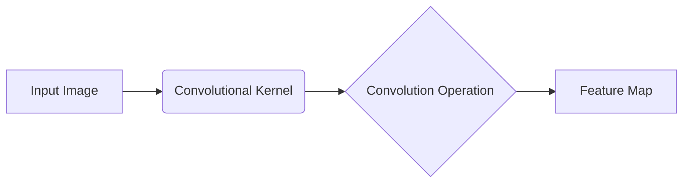
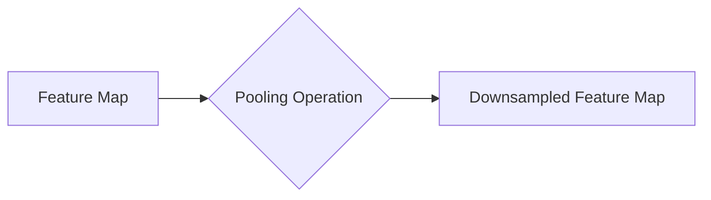
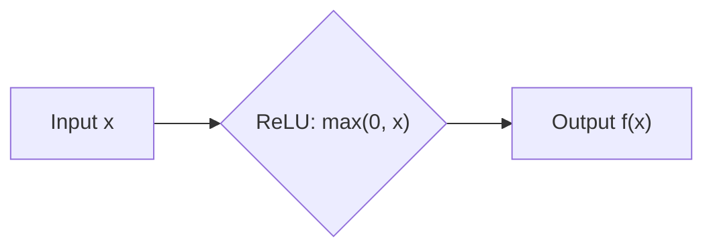
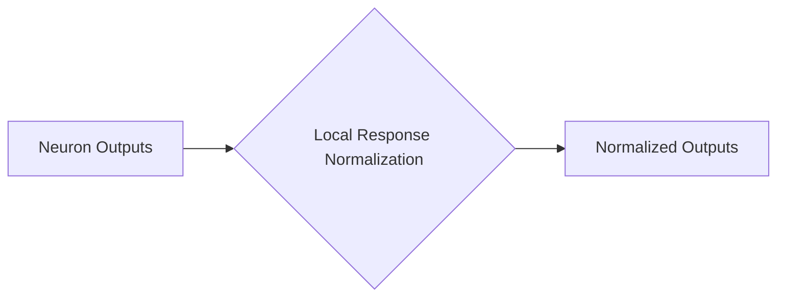
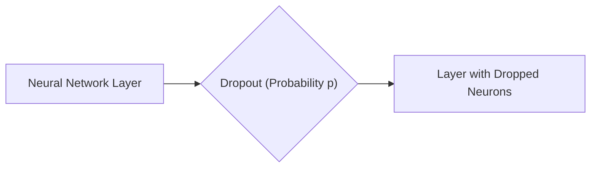
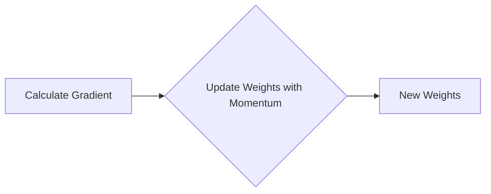

## AI论文解读 | 深度卷积神经网络(CNNs)在图像分类上的应用  
                
### 作者                
digoal                
                
### 日期                
2025-03-04               
                
### 标签                
PostgreSQL , PolarDB , DuckDB , AI , 论文解读    
                
----                
                
## 背景     
[《ImageNet Classification with Deep Convolutional Neural Networks》](3065386.pdf)    
- https://dl.acm.org/doi/pdf/10.1145/3065386 
  
提示: 
```
读懂这篇论文需要哪些基础知识, 请给我讲一下这些基础知识, 然后再解读这篇论文, 尽量通熟易懂, 可以使用mermaid图
提取一些重要的术语并详细解释, 可以使用mermaid图示
```
  
## 一、基础知识

这篇论文的核心是深度卷积神经网络（Deep Convolutional Neural Networks, CNNs）在图像分类上的应用。因此，我们需要了解以下几个关键概念：

1.  **神经网络 (Neural Networks)**

    *   **基本概念**: 神经网络是一种模仿生物神经系统的计算模型，由多个相互连接的节点（神经元）组成。
    *   **结构**: 通常包括输入层、隐藏层和输出层。
    *   **工作原理**: 通过调整神经元之间的连接权重，使网络能够学习输入数据中的模式，并进行预测或分类。
    *   **前向传播**: 输入数据通过网络，逐层计算，最终得到输出结果。
    *   **反向传播**: 根据输出结果与真实标签的差异（损失），反向调整网络中的权重，使网络能够更好地拟合数据。

    ```mermaid
    graph LR
        A[Input Layer] --> B(Hidden Layer 1);
        B --> C(Hidden Layer 2);
        C --> D[Output Layer];
    ```

2.  **卷积神经网络 (Convolutional Neural Networks, CNNs)**

    *   **专门处理图像**: CNN 是一种专门用于处理图像数据的神经网络。
    *   **卷积层 (Convolutional Layer)**: 使用卷积核（滤波器）扫描输入图像，提取图像的局部特征。
    *   **池化层 (Pooling Layer)**: 降低特征图的维度，减少计算量，并提高模型的鲁棒性。常见的池化操作包括最大池化和平均池化。
    *   **全连接层 (Fully Connected Layer)**: 将卷积层和池化层提取的特征进行组合，用于最终的分类或预测。
    *   **特征图 (Feature Map)**: 卷积核在输入图像上滑动后得到的输出结果。
    *   **感受野 (Receptive Field)**: 卷积核能够“看到”的输入图像的区域大小。

    ```mermaid
    graph LR
        A[Input Image] --> B(Convolutional Layer);
        B --> C(Pooling Layer);
        C --> D(Convolutional Layer);
        D --> E(Pooling Layer);
        E --> F(Fully Connected Layer);
        F --> G["Output (Classification)"];
    ```

3.  **激活函数 (Activation Functions)**

    *   **引入非线性**: 激活函数用于在神经元中引入非线性，使神经网络能够学习复杂的模式。
    *   **常见激活函数**:
        *   Sigmoid: 将输入值映射到 0 到 1 之间。
        *   Tanh: 将输入值映射到 -1 到 1 之间。
        *   ReLU (Rectified Linear Unit):  `f(x) = max(0, x)`。ReLU 在深度学习中被广泛使用，因为它能够加速训练过程。

    ```mermaid
    graph LR
        A[Input x] --> B{Activation Function};
        B --> C["Output f(x)"];
    ```

4.  **损失函数 (Loss Functions)**

    *   **衡量预测误差**: 损失函数用于衡量神经网络的预测结果与真实标签之间的差异。
    *   **优化目标**: 训练神经网络的目标是最小化损失函数。
    *   **常见损失函数**:
        *   交叉熵损失 (Cross-Entropy Loss): 常用于分类问题。
        *   均方误差损失 (Mean Squared Error Loss): 常用于回归问题。

    ```mermaid
    graph LR
        A[Predicted Output] --> B{Loss Function};
        C[True Label] --> B;
        B --> D[Loss Value];
    ```

5.  **优化算法 (Optimization Algorithms)**

    *   **更新权重**: 优化算法用于更新神经网络中的权重，以最小化损失函数。
    *   **梯度下降 (Gradient Descent)**: 一种常用的优化算法，通过计算损失函数对权重的梯度，并沿着梯度的反方向更新权重。
    *   **反向传播 (Backpropagation)**: 计算梯度的过程。
    *   **学习率 (Learning Rate)**: 控制权重更新的步长。

    ```mermaid
    graph LR
        A[Calculate Gradient] --> B{Update Weights};
        B --> C[New Weights];
    ```

6.  **过拟合 (Overfitting)**

    *   **模型泛化能力差**: 过拟合是指模型在训练数据上表现良好，但在测试数据上表现较差的现象。
    *   **原因**: 模型过于复杂，学习了训练数据中的噪声。
    *   **解决方法**:
        *   增加训练数据。
        *   使用正则化方法 (Regularization)。
        *   Dropout。

7.  **正则化 (Regularization)**

    *   **防止过拟合**: 正则化是一种用于防止过拟合的技术，通过在损失函数中添加一个惩罚项，限制模型的复杂度。
    *   **L1 正则化**: 在损失函数中添加权重绝对值的和。
    *   **L2 正则化**: 在损失函数中添加权重平方的和。

8.  **Dropout**

    *   **随机失活神经元**: Dropout 是一种在训练过程中随机失活一部分神经元的技术，可以有效地防止过拟合。
    *   **提高鲁棒性**: Dropout 可以使网络更加鲁棒，因为它迫使网络学习更加冗余的表示。

9.  **ImageNet 数据集**

    *   **大规模图像数据集**: ImageNet 是一个包含超过 1400 万张图像的大规模图像数据集，用于图像分类、目标检测等任务。
    *   **ILSVRC 比赛**: ImageNet Large Scale Visual Recognition Challenge (ILSVRC) 是一个基于 ImageNet 数据集的图像分类比赛。

10. **GPU 加速**

    *   **并行计算**: GPU (Graphics Processing Unit) 是一种专门用于图形处理的硬件，具有强大的并行计算能力。
    *   **加速训练**: 使用 GPU 可以显著加速神经网络的训练过程。

## 二、论文解读 

现在，我们来解读这篇 AlexNet 论文。

**1. 摘要 (Abstract)**

*   **核心内容**: 作者训练了一个大型深度卷积神经网络，用于 ImageNet LSVRC-2010 图像分类比赛，取得了当时最好的结果。
*   **关键技术**:
    *   深度卷积神经网络 (CNN)。
    *   ReLU 激活函数。
    *   高效的 GPU 实现。
    *   Dropout 正则化。
*   **结果**: 在 ImageNet LSVRC-2010 测试集上，top-1 错误率为 37.5%，top-5 错误率为 17.0%。在 ILSVRC-2012 比赛中，top-5 测试错误率为 15.3%，远超第二名 (26.2%)。

**2. 引言 (Introduction)**

*   **背景**: 传统的计算机视觉方法依赖于手工设计的特征，而深度学习方法可以自动学习特征。
*   **ImageNet 的重要性**: ImageNet 数据集的出现为训练大型深度神经网络提供了可能。
*   **CNN 的优势**: CNN 具有强大的学习能力，并且对图像的平移、旋转等变换具有鲁棒性。
*   **论文贡献**:
    *   训练了一个大型 CNN，并在 ImageNet 上取得了当时最好的结果。
    *   提供了一个高效的 GPU 实现。
    *   提出了一些新的网络结构和训练技巧。

**3. 数据集 (The Dataset)**

*   **ImageNet 数据集**: 包含超过 1500 万张图像，属于 22000 个类别。
*   **ILSVRC 比赛**: 使用 ImageNet 的一个子集，包含 1000 个类别，每个类别约 1000 张图像。
*   **数据预处理**: 将图像缩放到 256x256 的分辨率，并减去像素的均值。

**4. 网络结构 (The Architecture)**

*   **整体结构**: 包含 8 个学习层，其中 5 个卷积层和 3 个全连接层。
*   **ReLU 激活函数**: 使用 ReLU 作为激活函数，加速训练过程。
*   **多 GPU 训练**: 将网络分布在两个 GPU 上进行训练，以扩大网络规模。
*   **局部响应归一化 (Local Response Normalization)**: 对神经元的输出进行归一化，提高模型的泛化能力。
*   **重叠池化 (Overlapping Pooling)**: 使用重叠的池化窗口，减少过拟合。

    ```mermaid
    graph TD
        A["Input Image (224x224x3)"] --> B("Convolutional Layer 1 (96 kernels, 11x11, stride 4)");
        B --> C(ReLU);
        C --> D(Local Response Normalization);
        D --> E("Max Pooling (3x3, stride 2)");
        E --> F("Convolutional Layer 2 (256 kernels, 5x5)");
        F --> G(ReLU);
        G --> H(Local Response Normalization);
        H --> I("Max Pooling (3x3, stride 2)");
        I --> J("Convolutional Layer 3 (384 kernels, 3x3)");
        J --> K(ReLU);
        K --> L("Convolutional Layer 4 (384 kernels, 3x3)");
        L --> M(ReLU);
        M --> N("Convolutional Layer 5 (256 kernels, 3x3)");
        N --> O(ReLU);
        O --> P("Max Pooling (3x3, stride 2)");
        P --> Q("Fully Connected Layer 1 (4096 neurons)");
        Q --> R(ReLU);
        R --> S(Dropout);
        S --> T("Fully Connected Layer 2 (4096 neurons)");
        T --> U(ReLU);
        U --> V(Dropout);
        V --> W("Fully Connected Layer 3 (1000 neurons)");
        W --> X(Softmax);
        X --> Y["Output (1000 classes)"];
    ```

**5. 减少过拟合 (Reducing Overfitting)**

*   **数据增强 (Data Augmentation)**: 通过对训练图像进行平移、旋转、缩放等变换，增加训练数据的多样性。
*   **Dropout**: 在全连接层中使用 Dropout，随机失活一部分神经元，防止过拟合。

**6. 训练细节 (Details of Learning)**

*   **优化算法**: 使用带动量的随机梯度下降 (SGD) 算法。
*   **学习率**: 初始学习率为 0.01，并在验证集误差不再下降时手动降低学习率。
*   **训练时间**: 在两个 GTX 580 3GB GPU 上训练 5-6 天。

**7. 结果 (Results)**

*   **ILSVRC-2010**: top-1 错误率为 37.5%，top-5 错误率为 17.0%，远超当时的 state-of-the-art。
*   **ILSVRC-2012**: top-5 测试错误率为 15.3%，远超第二名 (26.2%)。
*   **可视化**: 可视化了卷积核和特征图，展示了网络学习到的特征。

**8. 讨论 (Discussion)**

*   **深度的重要性**: 移除任何一个卷积层都会导致性能下降，说明深度对于网络的性能至关重要。
*   **未来方向**: 增加网络规模，使用无监督预训练，处理视频序列。

**9. 结论 (Epilogue)**

*   **影响**: AlexNet 的成功推动了深度学习在计算机视觉领域的应用。

**总结**

AlexNet 论文的核心贡献在于：

*   **证明了深度卷积神经网络在图像分类上的有效性。**
*   **提出了一些新的网络结构和训练技巧，例如 ReLU 激活函数、多 GPU 训练、局部响应归一化和 Dropout。**
*   **为后续的深度学习研究奠定了基础。**


## 三、关键术语

**1. 卷积层 (Convolutional Layer)**

*   **定义**: 卷积层是 CNN 的核心组成部分，用于提取图像的局部特征。
*   **工作原理**:
    *   使用卷积核（滤波器）在输入图像上滑动。
    *   卷积核与图像的局部区域进行卷积运算（对应元素相乘再求和）。
    *   得到一个特征图 (Feature Map)，表示该卷积核提取到的特征。
*   **参数**:
    *   卷积核大小 (Kernel Size): 例如 3x3, 5x5, 11x11。
    *   卷积核数量 (Number of Kernels): 决定了输出特征图的数量。
    *   步长 (Stride): 卷积核每次滑动的距离。
    *   填充 (Padding): 在输入图像周围填充 0，以控制输出特征图的大小。



**2. 池化层 (Pooling Layer)**

*   **定义**: 池化层用于降低特征图的维度，减少计算量，并提高模型的鲁棒性。
*   **工作原理**:
    *   将特征图划分为多个区域。
    *   对每个区域进行池化操作，例如最大池化 (Max Pooling) 或平均池化 (Average Pooling)。
    *   最大池化选择区域内的最大值，平均池化计算区域内的平均值。
*   **参数**:
    *   池化窗口大小 (Pool Size): 例如 2x2, 3x3。
    *   步长 (Stride): 池化窗口每次滑动的距离。



**3. ReLU 激活函数 (ReLU Activation Function)**

*   **定义**: ReLU (Rectified Linear Unit) 是一种常用的激活函数，定义为 `f(x) = max(0, x)`。
*   **作用**:
    *   引入非线性，使神经网络能够学习复杂的模式。
    *   加速训练过程，因为 ReLU 的梯度在 x > 0 时为 1，避免了梯度消失问题。
*   **优点**:
    *   计算简单。
    *   加速训练。
*   **缺点**:
    *   可能导致神经元“死亡”，即输出始终为 0。



**4. 局部响应归一化 (Local Response Normalization, LRN)**

*   **定义**: LRN 是一种归一化技术，用于增强模型的泛化能力。
*   **工作原理**:
    *   对相邻的神经元的输出进行归一化，抑制响应较大的神经元，突出响应较小的神经元。
    *   公式：`b_{x,y}^i = a_{x,y}^i / (k + \alpha \sum_{j=max(0, i-n/2)}^{min(N-1, i+n/2)} (a_{x,y}^j)^2)^\beta`
        *   `a_{x,y}^i`: 第 `i` 个卷积核在位置 `(x, y)` 的输出。
        *   `b_{x,y}^i`: 归一化后的输出。
        *   `N`: 卷积核的总数。
        *   `n`: 局部范围的大小。
        *   `k`, `\alpha`, `\beta`: 超参数。
*   **作用**:
    *   增强模型的泛化能力。
    *   在 AlexNet 中起到了重要的作用，但在后续的网络中逐渐被 Batch Normalization 取代。



**5. Dropout**

*   **定义**: Dropout 是一种正则化技术，用于防止过拟合。
*   **工作原理**:
    *   在训练过程中，随机失活一部分神经元（即将其输出设置为 0）。
    *   每个神经元以一定的概率 `p` 被失活。
    *   在测试过程中，所有神经元都激活，但其输出需要乘以 `(1-p)`。
*   **作用**:
    *   防止过拟合。
    *   提高模型的鲁棒性。
    *   相当于训练了多个不同的网络，并对它们的预测结果进行平均。



**6. 数据增强 (Data Augmentation)**

*   **定义**: 数据增强是一种通过对训练数据进行变换，增加训练数据多样性的技术。
*   **常见方法**:
    *   平移 (Translation)。
    *   旋转 (Rotation)。
    *   缩放 (Scaling)。
    *   翻转 (Flipping)。
    *   裁剪 (Cropping)。
    *   颜色变换 (Color Jittering)。
*   **作用**:
    *   增加训练数据的多样性。
    *   提高模型的泛化能力。
    *   减少过拟合。


**7. 优化算法 (Optimization Algorithm)**

*   **定义**: 优化算法用于更新神经网络中的权重，以最小化损失函数。
*   **AlexNet 使用的算法**:
    *   带动量的随机梯度下降 (SGD with Momentum)。
*   **随机梯度下降 (SGD)**:
    *   每次迭代只使用一个样本来计算梯度。
    *   计算速度快，但容易陷入局部最小值。
*   **动量 (Momentum)**:
    *   引入动量项，使梯度更新更加平滑。
    *   有助于跳出局部最小值。



**总结**

这些术语是理解 AlexNet 论文的关键。掌握这些概念，可以帮助你更好地理解深度学习的基本原理，以及 AlexNet 在图像分类任务中的应用。
      
<b> 以上内容基于DeepSeek及诸多AI生成, 轻微人工调整, 感谢杭州深度求索人工智能等公司. </b>           
         
<b> AI 生成的内容请自行辨别正确性, 当然也多了些许踩坑的乐趣, 毕竟冒险是每个男人的天性. </b>         
        
        
  
#### [期望 PostgreSQL|开源PolarDB 增加什么功能?](https://github.com/digoal/blog/issues/76 "269ac3d1c492e938c0191101c7238216")
  
  
#### [PolarDB 开源数据库](https://openpolardb.com/home "57258f76c37864c6e6d23383d05714ea")
  
  
#### [PolarDB 学习图谱](https://www.aliyun.com/database/openpolardb/activity "8642f60e04ed0c814bf9cb9677976bd4")
  
  
#### [PostgreSQL 解决方案集合](../201706/20170601_02.md "40cff096e9ed7122c512b35d8561d9c8")
  
  
#### [德哥 / digoal's Github - 公益是一辈子的事.](https://github.com/digoal/blog/blob/master/README.md "22709685feb7cab07d30f30387f0a9ae")
  
  
#### [About 德哥](https://github.com/digoal/blog/blob/master/me/readme.md "a37735981e7704886ffd590565582dd0")
  
  

  
