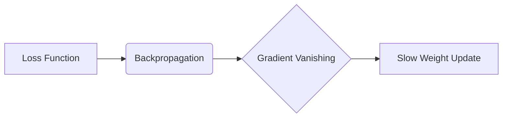
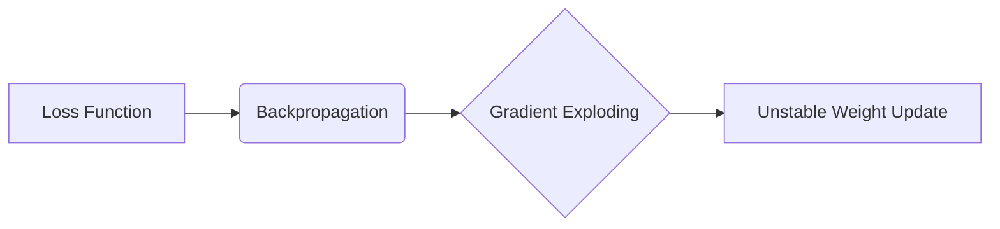
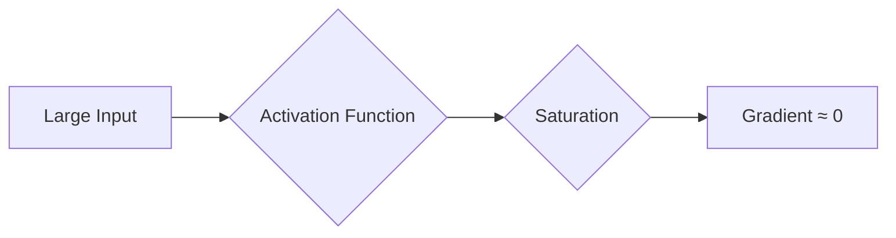
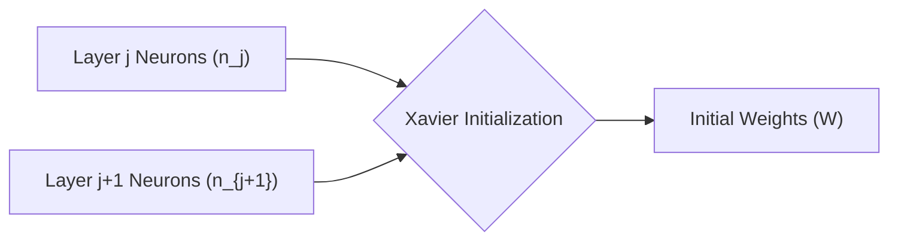
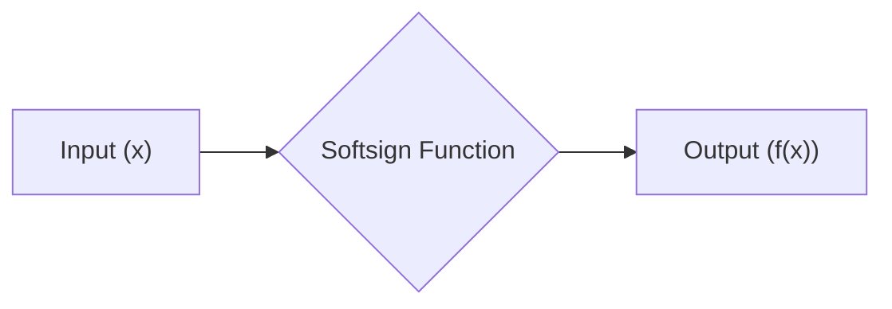
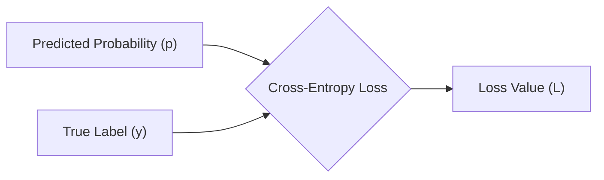
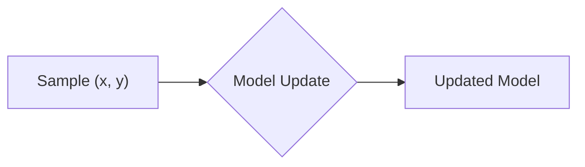

## AI论文解读 | 探讨深度前馈神经网络训练难题
                
### 作者                
digoal                
                
### 日期                
2025-03-04               
                
### 标签                
PostgreSQL , PolarDB , DuckDB , AI , 论文解读    
                
----                
                
## 背景     
[《Understanding the difficulty of training deep feedforward neural networks》](glorot10a.pdf)    
- https://proceedings.mlr.press/v9/glorot10a/glorot10a.pdf?hc_location=ufi
  
提示: 
```
读懂这篇论文需要哪些基础知识, 请给我讲一下这些基础知识, 然后再解读这篇论文, 尽量通熟易懂, 可以使用mermaid图
提取一些重要的术语并详细解释, 可以使用mermaid图示
```
  
## 一、基础知识

这篇论文主要探讨了深度前馈神经网络（Deep Feedforward Neural Networks）的训练难题，并提出了一种新的权重初始化方法。因此，我们需要了解以下几个关键概念：

1.  **前馈神经网络 (Feedforward Neural Networks)**

    *   **基本概念**: 前馈神经网络是一种最基本的神经网络结构，信息单向流动，从输入层到隐藏层，再到输出层。
    *   **结构**: 通常包括输入层、多个隐藏层和输出层。
    *   **工作原理**: 通过调整神经元之间的连接权重，使网络能够学习输入数据中的模式，并进行预测或分类。
    *   **与 CNN 的区别**: 前馈神经网络没有卷积层和池化层，通常用于处理非结构化数据，例如数值数据。

    ```mermaid
    graph LR
        A[Input Layer] --> B(Hidden Layer 1);
        B --> C(Hidden Layer 2);
        C --> D[Output Layer];
    ```

2.  **深度神经网络 (Deep Neural Networks, DNNs)**

    *   **多层隐藏层**: 深度神经网络是指具有多个隐藏层的神经网络。
    *   **学习复杂特征**: 深度神经网络可以学习更加复杂的特征表示，从而提高模型的性能。
    *   **训练难题**: 深度神经网络的训练通常比较困难，容易出现梯度消失或梯度爆炸等问题。

3.  **激活函数 (Activation Functions)**

    *   **引入非线性**: 激活函数用于在神经元中引入非线性，使神经网络能够学习复杂的模式。
    *   **常见激活函数**:
        *   Sigmoid: 将输入值映射到 0 到 1 之间。
        *   Tanh: 将输入值映射到 -1 到 1 之间。
        *   ReLU (Rectified Linear Unit):  `f(x) = max(0, x)`。
        *   Softsign: `f(x) = x / (1 + |x|)`。
    *   **饱和区**: 激活函数在输入值很大或很小时，梯度接近于 0 的区域。

    ```mermaid
    graph LR
        A[Input x] --> B{Activation Function};
        B --> C["Output f(x)"];
    ```

4.  **梯度消失和梯度爆炸 (Vanishing and Exploding Gradients)**

    *   **梯度消失**: 在深度神经网络中，梯度在反向传播过程中逐渐减小，导致浅层网络的权重更新缓慢，难以学习。
    *   **梯度爆炸**: 在深度神经网络中，梯度在反向传播过程中逐渐增大，导致权重更新过大，模型不稳定。
    *   **原因**: 激活函数的饱和区、权重初始化不当等。

    ```mermaid
    graph LR
        A[Loss Function] --> B(Backpropagation);
        B --> C{Gradient Vanishing/Exploding};
        C --> D[Weight Update];
    ```

5.  **权重初始化 (Weight Initialization)**

    *   **重要性**: 权重初始化对神经网络的训练至关重要。
    *   **常见方法**:
        *   随机初始化: 从一个小的随机分布中采样权重。
        *   Xavier 初始化: 根据输入和输出的维度来调整权重的方差，使每一层的激活值和梯度保持相似的方差。
        *   He 初始化: 类似于 Xavier 初始化，但更适用于 ReLU 激活函数。

    ```mermaid
    graph LR
        A[Weight Initialization] --> B{Random Distribution};
        B --> C[Initial Weights];
    ```

6.  **Softmax 函数**

    *   **多分类问题**: Softmax 函数通常用于多分类问题，将多个输出值转换为概率分布。
    *   **公式**: `P(y=i | x) = exp(z_i) / sum(exp(z_j))`，其中 `z_i` 是第 `i` 个输出值。

    ```mermaid
    graph LR
        A["Output Values (z)"] --> B{Softmax Function};
        B --> C["Probability Distribution (P)"];
    ```

7.  **损失函数 (Loss Functions)**

    *   **衡量预测误差**: 损失函数用于衡量神经网络的预测结果与真实标签之间的差异。
    *   **常见损失函数**:
        *   交叉熵损失 (Cross-Entropy Loss): 常用于分类问题。
        *   均方误差损失 (Mean Squared Error Loss): 常用于回归问题。

    ```mermaid
    graph LR
        A[Predicted Output] --> B{Loss Function};
        C[True Label] --> B;
        B --> D[Loss Value];
    ```

8.  **随机梯度下降 (Stochastic Gradient Descent, SGD)**

    *   **更新权重**: 优化算法用于更新神经网络中的权重，以最小化损失函数。
    *   **SGD**: 每次迭代只使用一个样本来计算梯度，并更新权重。
    *   **Mini-batch SGD**: 每次迭代使用一小批样本来计算梯度，并更新权重。

    ```mermaid
    graph LR
        A[Calculate Gradient] --> B{Update Weights};
        B --> C[New Weights];
    ```

9.  **在线学习 (Online Learning)**

    *   **逐个样本学习**: 在线学习是指逐个样本地更新模型参数。
    *   **适用于大数据**: 适用于处理大规模数据，可以实时更新模型。

10. **数据集 (Datasets)**

    *   MNIST: 手写数字数据集。
    *   CIFAR-10: 包含 10 个类别的彩色图像数据集。
    *   ImageNet: 大规模图像数据集。

## 二、论文解读  

现在，我们来解读这篇 Glorot 和 Bengio 的论文。

**1. 摘要 (Abstract)**

*   **核心问题**: 探讨了为什么在 2006 年之前，深度多层神经网络难以成功训练。
*   **研究方法**: 通过实验分析激活函数和梯度在网络中的变化，以及权重初始化对训练的影响。
*   **主要发现**:
    *   Sigmoid 激活函数不适合深度网络，因为其均值可能导致顶层隐藏单元饱和。
    *   提出了一种新的权重初始化方法，可以显著加快收敛速度。

**2. 引言 (Introduction)**

*   **背景**: 深度学习方法可以学习特征层次结构，从而提高模型的性能。
*   **问题**: 为什么传统的随机初始化和梯度下降方法在深度神经网络中表现不佳？
*   **研究重点**: 分析激活函数和梯度在网络中的变化，以及权重初始化对训练的影响。
*   **研究目标**: 更好地理解深度神经网络的训练难题，并设计更好的算法。

**3. 实验设置和数据集 (Experimental Setting and Datasets)**

*   **数据集**:
    *   Shapeset-3x2: 一个合成图像数据集，用于在线学习。
    *   MNIST: 手写数字数据集。
    *   CIFAR-10: 包含 10 个类别的彩色图像数据集。
    *   Small-ImageNet: ImageNet 的一个子集。
*   **网络结构**:
    *   1 到 5 个隐藏层。
    *   每层 1000 个隐藏单元。
    *   Softmax logistic regression 输出层。
*   **优化方法**:
    *   随机梯度下降 (SGD)。
    *   Mini-batch 大小为 10。
*   **激活函数**:
    *   Sigmoid。
    *   Tanh。
    *   Softsign。
*   **权重初始化**:
    *   传统的随机初始化: `W_ij ~ U[-1/sqrt(n), 1/sqrt(n)]`，其中 `n` 是上一层的神经元数量。

**4. 激活函数和饱和的影响 (Effect of Activation Functions and Saturation During Training)**

*   **Sigmoid**:
    *   顶层隐藏单元容易饱和，导致梯度消失。
    *   饱和的单元可以缓慢地脱离饱和状态，但会导致训练过程中的 plateau。
*   **Tanh**:
    *   不会出现 Sigmoid 的饱和问题，但会出现逐层饱和现象。
*   **Softsign**:
    *   饱和程度较低，各层一起饱和。
    *   激活值分布在非线性区域，有利于梯度流动。

**5. 梯度及其传播的研究 (Studying Gradients and their Propagation)**

*   **损失函数的影响**:
    *   交叉熵损失比二次损失更适合分类问题。
*   **梯度消失和梯度爆炸的理论分析**:
    *   推导了梯度方差的公式。
    *   提出了 Xavier 初始化方法，使每一层的激活值和梯度保持相似的方差。
    *   Xavier 初始化公式: `W ~ U[-sqrt(6)/sqrt(n_j + n_{j+1}), sqrt(6)/sqrt(n_j + n_{j+1})]`，其中 `n_j` 和 `n_{j+1}` 是第 `j` 层和第 `j+1` 层的神经元数量。
*   **梯度传播的实验研究**:
    *   验证了 Xavier 初始化可以使梯度更好地传播。

**6. 误差曲线和结论 (Error Curves and Conclusions)**

*   **实验结果**:
    *   传统的随机初始化和 Sigmoid/Tanh 激活函数表现较差。
    *   Softsign 激活函数对初始化方法的鲁棒性更强。
    *   Xavier 初始化可以显著提高 Tanh 网络的性能。
*   **结论**:
    *   监控激活值和梯度是理解深度网络训练难题的有效方法。
    *   Sigmoid 激活函数应避免使用。
    *   保持层与层之间的激活值和梯度流动良好，有助于提高模型的性能。

**总结**

这篇论文的主要贡献在于：

*   **指出了 Sigmoid 激活函数在深度网络中的问题。**
*   **提出了 Xavier 初始化方法，可以使梯度更好地传播。**
*   **为后续的深度学习研究提供了重要的理论基础和实验指导。**

## 三、关键术语

**1. 梯度消失 (Vanishing Gradients)**

*   **定义**: 在深度神经网络中，梯度在反向传播过程中逐渐减小，导致浅层网络的权重更新缓慢，难以学习。
*   **原因**:
    *   激活函数的饱和区（例如 Sigmoid 函数）。
    *   权重初始化不当。
*   **影响**:
    *   浅层网络无法有效学习。
    *   模型性能下降。



**2. 梯度爆炸 (Exploding Gradients)**

*   **定义**: 在深度神经网络中，梯度在反向传播过程中逐渐增大，导致权重更新过大，模型不稳定。
*   **原因**:
    *   权重初始化过大。
    *   某些激活函数。
*   **影响**:
    *   权重更新过大，导致模型不稳定。
    *   训练过程发散。



**3. 饱和 (Saturation)**

*   **定义**: 激活函数在输入值很大或很小时，梯度接近于 0 的状态。
*   **影响**:
    *   梯度消失。
    *   神经元停止学习。
*   **常见激活函数**:
    *   Sigmoid: 在输入值很大或很小时，梯度接近于 0。
    *   Tanh: 类似于 Sigmoid，但在输入值很大或很小时，梯度也接近于 0。



**4. Xavier 初始化 (Xavier Initialization)**

*   **定义**: 一种权重初始化方法，旨在使每一层的激活值和梯度保持相似的方差。
*   **公式**: `W ~ U[-sqrt(6)/sqrt(n_j + n_{j+1}), sqrt(6)/sqrt(n_j + n_{j+1})]`，其中 `n_j` 和 `n_{j+1}` 是第 `j` 层和第 `j+1` 层的神经元数量。
*   **目的**:
    *   避免梯度消失和梯度爆炸。
    *   加快收敛速度。
*   **适用场景**:
    *   适用于 Tanh 等激活函数。



**5. Softsign 激活函数**

*   **定义**: 一种激活函数，公式为 `f(x) = x / (1 + |x|)`。
*   **特点**:
    *   饱和程度较低。
    *   各层一起饱和。
    *   激活值分布在非线性区域，有利于梯度流动。
*   **优点**:
    *   对初始化方法的鲁棒性更强。



**6. 交叉熵损失 (Cross-Entropy Loss)**

*   **定义**: 一种损失函数，常用于分类问题，衡量预测概率分布与真实标签之间的差异。
*   **公式**: `L = -sum(y_i * log(p_i))`，其中 `y_i` 是真实标签，`p_i` 是预测概率。
*   **优点**:
    *   比二次损失更适合分类问题。
    *   可以避免梯度消失。



**7. 在线学习 (Online Learning)**

*   **定义**: 逐个样本地更新模型参数的学习方式。
*   **特点**:
    *   适用于处理大规模数据。
    *   可以实时更新模型。
*   **优点**:
    *   可以适应数据分布的变化。



**总结**

这些术语是理解 Glorot 和 Bengio 论文的关键。掌握这些概念，可以帮助你更好地理解深度神经网络的训练难题，以及 Xavier 初始化方法的作用。


<b> 以上内容基于DeepSeek及诸多AI生成, 轻微人工调整, 感谢杭州深度求索人工智能等公司. </b>           
         
<b> AI 生成的内容请自行辨别正确性, 当然也多了些许踩坑的乐趣, 毕竟冒险是每个男人的天性. </b>         
        
        
  
#### [期望 PostgreSQL|开源PolarDB 增加什么功能?](https://github.com/digoal/blog/issues/76 "269ac3d1c492e938c0191101c7238216")
  
  
#### [PolarDB 开源数据库](https://openpolardb.com/home "57258f76c37864c6e6d23383d05714ea")
  
  
#### [PolarDB 学习图谱](https://www.aliyun.com/database/openpolardb/activity "8642f60e04ed0c814bf9cb9677976bd4")
  
  
#### [PostgreSQL 解决方案集合](../201706/20170601_02.md "40cff096e9ed7122c512b35d8561d9c8")
  
  
#### [德哥 / digoal's Github - 公益是一辈子的事.](https://github.com/digoal/blog/blob/master/README.md "22709685feb7cab07d30f30387f0a9ae")
  
  
#### [About 德哥](https://github.com/digoal/blog/blob/master/me/readme.md "a37735981e7704886ffd590565582dd0")
  
  

  
