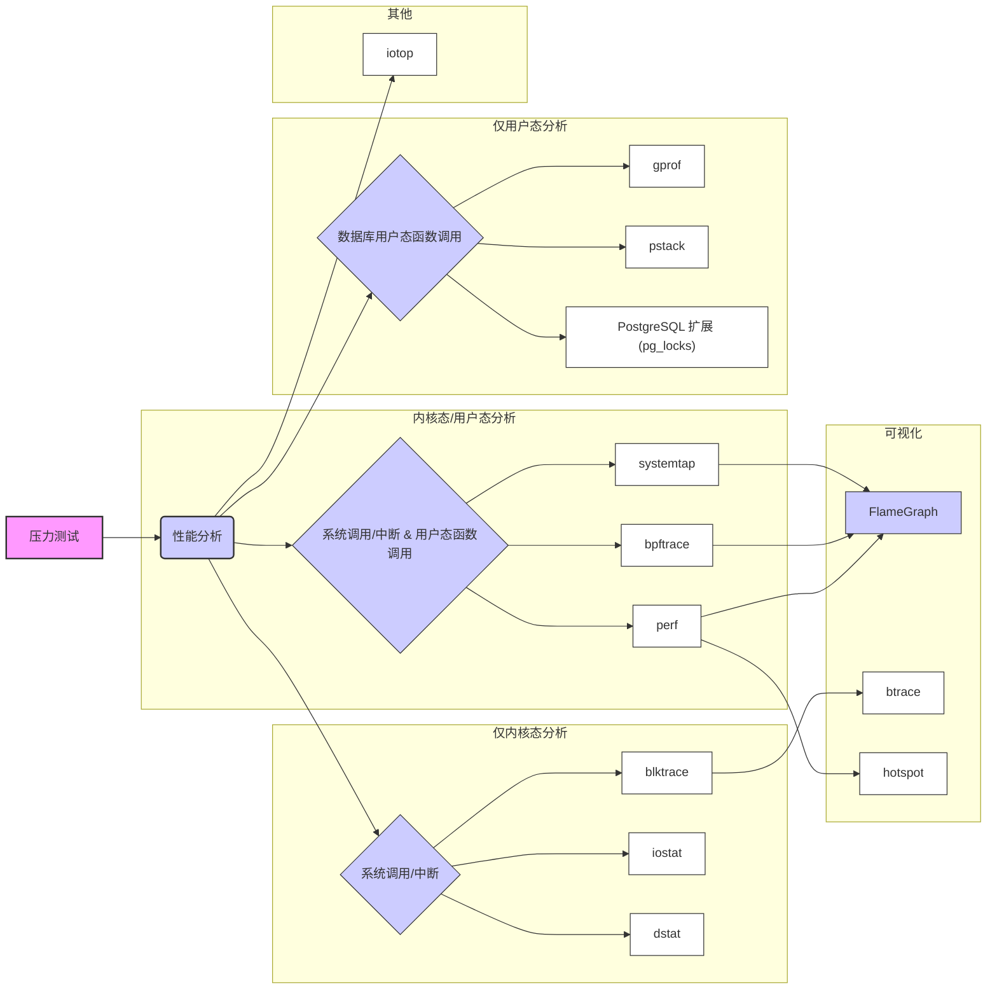

## AI辅助 PolarDB内核学习 - 10 如何分析内核态和用户态性能瓶颈  
      
### 作者      
digoal      
      
### 日期      
2025-03-05      
      
### 标签      
PostgreSQL , PolarDB , DuckDB , AI , 内核 , 学习 , 性能分析 , 内核态 , 用户态        
      
----      
      
## 背景     
用AI解决这个问题: 如何分析内核态和用户态性能瓶颈?    
  

  
## 提示  
1、我在对PostgreSQL数据库进行某个场景的压力测试, 假设数据库部署在Linux操作系统中, 如何从系统调用/中断(内核态)以及数据库用户态函数调用的多角度, 分析数据库产品代码的性能瓶颈?  除了常用工具以外, 还需要重点讲一下perf, strace, pstack, gdb, ebpf, valgrind, callgrind, bpftrace, gprof, iotop, iostat, dstat, 火焰图分析等工具, 结合常见的性能瓶颈案例进行分享, 并给出工具的常用方法, 最后还需要对分析结果进行讲解.    
  
2、应该安装哪些符号表? linux内核和postgresql的吗?   
  
3、FlameGraph 如何生成perf和bpftrace抓取结果的火焰图?   
  
4、pstack 分析锁竞争太不现实了, 因为进程多不知道是哪几个进程有堵塞, 并且堵塞可能很快消失, 无法准确的使用pstack来跟踪对应pid. 请重新给出锁竞争的分析方法  
  
5、以 eBPF + bpftrace 为例, 深入讲一下  
  
6、锁的种类不止mutex_lock这种吧? 其他的锁还有哪些? 如何跟踪所有的锁事件?   
  
7、IO 这块再讲一下更底层的 blocktrace, 以及IOdepth  
  
8、把以上用到的所有工具绘制到一张mermaid图中  
  
9、从内核态到用户态有哪些交换? 如果切换较多会带来什么瓶颈?   
  
10、如何分析切换是什么原因引起的?  
  
11、什么时候会从用户态切到内核态, 或者反之? 设计数据库代码时如何避免?  
  
12、详细说说 RDMA 技术   
  
## 1、内核态和用户态性能瓶颈分析手段   
  
好的，我们来深入探讨如何利用各种工具，从系统调用/中断（内核态）和数据库用户态函数调用两个角度，分析PostgreSQL数据库在Linux环境下的性能瓶颈，并对分析结果进行讲解。  
  
**一、工具概览与性能瓶颈案例**  
  
在开始详细介绍工具之前，先了解一些常见的PostgreSQL性能瓶颈，以及哪些工具可以帮助我们定位它们：  
  
*   **I/O瓶颈：**  
    *   **原因：** 磁盘读写速度慢，导致数据访问延迟。  
    *   **工具：** `iotop`, `iostat`, `dstat`, `strace`, `perf`, 火焰图（针对I/O相关的内核函数）。  
*   **CPU瓶颈：**  
    *   **原因：** CPU资源不足，导致SQL语句执行缓慢。  
    *   **工具：** `top`, `perf`, `gprof`, `gdb`, `valgrind`, `callgrind`, 火焰图。  
*   **内存瓶颈：**  
    *   **原因：** 内存不足，导致频繁的页面交换（swap）。  
    *   **工具：** `top`, `vmstat`, `perf`, `valgrind`。  
*   **锁竞争：**  
    *   **原因：** 多个进程/线程争用同一把锁，导致阻塞。  
    *   **工具：** `pstack`, `gdb`, `perf`, `eBPF`, `bpftrace`。  
*   **网络瓶颈：**  
    *   **原因：** 网络带宽不足，导致数据传输延迟。  
    *   **工具：** `tcpdump`, `wireshark`, `perf`, `strace`（网络相关的系统调用）。  
*   **SQL查询效率低：**  
    *   **原因：** SQL语句没有使用索引，或者执行计划不佳。  
    *   **工具：** `EXPLAIN`, `pg_stat_statements`, `auto_explain`。  
*   **上下文切换过多：**  
    *   **原因：** 进程/线程频繁切换，导致CPU时间浪费。  
    *   **工具：** `perf`, `eBPF`, `bpftrace`。  
  
**二、工具详解与使用方法**  
  
1.  **`perf` (Performance Counters)**  
  
    *   **功能：** Linux性能分析工具，可以收集CPU周期、指令数、缓存命中率、分支预测等硬件性能计数器信息，以及内核函数调用信息。  
    *   **常用方法：**  
        *   **`perf record -p <pid> -g --call-graph dwarf -o perf.data`：** 记录指定进程的性能数据，`-p`指定进程ID，`-g`启用调用图（call graph）记录，`--call-graph dwarf`使用DWARF信息生成调用图，`-o`指定输出文件名。  
        *   **`perf record -e cpu-clock -g --call-graph dwarf -o perf.data -- postgres`：** 记录所有postgres进程的CPU时钟事件。  
        *   **`perf report -i perf.data`：** 生成性能报告，可以查看函数调用次数、耗时等信息。  
        *   **`perf top -p <pid>`：** 实时显示指定进程的性能数据。  
        *   **`perf annotate -i perf.data -l`：**  查看源代码级别的性能注释，需要有调试符号表。  
        *   **`perf stat -p <pid> <command>`：** 运行命令并收集性能统计信息。  
    *   **案例：**  
        *   **CPU瓶颈：** 使用`perf top`或`perf record` + `perf report`，可以找到CPU占用率最高的函数，例如SQL解析、执行器等。  
            *   **分析结果：** 如果发现某个函数（例如`ExecProcNode`，`standard_planner`）占用了大量的CPU时间，则需要深入分析该函数的实现，以及相关的SQL语句，看是否存在优化空间。  
        *   **缓存未命中：** 使用`perf stat -e cache-misses -p <pid>`可以查看缓存未命中率。  
            *   **分析结果：** 如果缓存未命中率很高，则可能需要调整`shared_buffers`等配置参数，或者优化SQL语句，减少数据访问量。  
        *   **锁竞争：** 使用`perf record -e lock:acquire -g --call-graph dwarf -o perf.data`可以记录锁获取事件，然后使用`perf report`分析锁竞争情况。  
            *   **分析结果：** 如果发现某个锁（例如`relation_lock`，`buffer_content_lock`）的竞争非常激烈，则需要深入分析锁的使用场景，看是否存在减少锁竞争的方法，例如使用更细粒度的锁，或者采用无锁算法。  
  
2.  **`strace`**  
  
    *   **功能：** 跟踪进程执行过程中的系统调用和信号。  
    *   **常用方法：**  
        *   **`strace -c -p <pid>`：** 统计指定进程的系统调用次数、耗时等信息。  
        *   **`strace -T -tt -e trace=file -p <pid>`：** 跟踪指定进程的文件I/O相关的系统调用，并显示时间戳和耗时。  
        *   **`strace -f -c postgres`：** 跟踪所有postgres进程的系统调用，并进行统计。  
        *   **`strace -e trace=network -p <pid>`：** 跟踪网络相关的系统调用。  
    *   **案例：**  
        *   **I/O瓶颈：** 使用`strace -T -tt -e trace=file -p <pid>`可以查看文件I/O相关的系统调用，例如`read`、`write`、`fsync`等，如果发现某个系统调用耗时过长，则可能存在I/O瓶颈。  
            *   **分析结果：** 如果`fsync`调用耗时过长，则可能需要优化WAL的写入策略，或者使用更快的磁盘。 如果`read`或`write`调用耗时过长，则可能需要优化SQL语句，减少数据访问量，或者调整`shared_buffers`等配置参数。  
        *   **网络瓶颈：** 使用`strace -e trace=network -p <pid>`可以查看网络相关的系统调用，例如`send`、`recv`等，如果发现数据传输延迟过高，则可能存在网络瓶颈。  
            *   **分析结果：** 如果`send`或`recv`调用耗时过长，则可能需要优化网络配置，或者增加网络带宽。  
  
3.  **`pstack`**  
  
    *   **功能：** 显示进程的调用栈。  
    *   **常用方法：**  
        *   **`pstack <pid>`：** 显示指定进程的调用栈。  
    *   **案例：**  
        *   **锁竞争：** 使用`pstack`可以查看进程当前正在执行的函数，如果发现多个进程都阻塞在同一个锁上，则可能存在锁竞争。  
            *   **分析结果：** 通过调用栈，可以了解进程当前正在执行的函数，以及等待的锁，从而分析锁竞争的原因。  
  
4.  **`gdb` (GNU Debugger)**  
  
    *   **功能：** 调试器，可以设置断点、单步执行、查看变量值等。  
    *   **常用方法：**  
        *   **`gdb -p <pid>`：** 连接到指定进程。  
        *   **`break <function_name>`：** 在指定函数处设置断点。  
        *   **`run`：** 运行程序。  
        *   **`next`：** 单步执行。  
        *   **`print <variable_name>`：** 查看变量值。  
        *   **`backtrace`：** 查看调用栈。  
    *   **案例：**  
        *   **锁竞争：** 使用`gdb`可以查看进程当前持有的锁，以及等待的锁，从而分析锁竞争的原因。  
            *   **分析结果：** 通过查看锁的持有者和等待者，可以了解锁竞争的场景，以及是否存在死锁等问题.  
        *   **内存泄漏：** 使用`gdb`可以查看内存分配和释放情况，从而发现内存泄漏。  
            *   **分析结果：** 如果发现内存分配后没有被释放，则可能存在内存泄漏。  
  
5.  **`eBPF` (Extended Berkeley Packet Filter) 和 `bpftrace`**  
  
    *   **功能：** eBPF是一种内核技术，可以在内核中安全地运行用户提供的代码。`bpftrace`是一个基于eBPF的动态跟踪工具，可以用来跟踪内核和用户态程序的性能数据。  
    *   **常用方法：**  
        *   **`bpftrace -e 'tracepoint:syscalls:sys_enter_read { @[pid, comm] = count(); }'`：** 统计每个进程的`read`系统调用次数。  
        *   **`bpftrace -e 'kprobe:mutex_lock { @[func] = count(); }'`：** 统计`mutex_lock`函数的调用次数。  
        *   **`bpftrace -e 'profile:hz:99 { @[ustack()] = count(); }'`：**  生成用户态的火焰图。  
    *   **案例：**  
        *   **锁竞争：** 使用`bpftrace`可以跟踪锁的获取和释放事件，从而分析锁竞争的原因。  
            *   **分析结果：** 通过跟踪锁的获取和释放事件，可以了解锁的竞争程度，以及锁的持有时间。  
        *   **上下文切换：** 使用`bpftrace`可以跟踪进程/线程的上下文切换事件，从而分析上下文切换过多的原因。  
            *   **分析结果：** 如果上下文切换非常频繁，则可能需要调整进程/线程的数量，或者优化锁的使用，减少锁竞争。  
        *   **I/O延迟：** 使用`bpftrace`可以跟踪I/O相关的系统调用，并计算延迟。  
            *   **分析结果：** 通过计算I/O延迟，可以了解I/O操作的性能瓶颈。  
  
6.  **`valgrind` 和 `callgrind`**  
  
    *   **功能：** `valgrind`是一个内存调试和性能分析工具套件，`callgrind`是`valgrind`的一个工具，可以用来分析程序的函数调用图和性能数据。  
    *   **常用方法：**  
        *   **`valgrind --tool=callgrind --callgrind-out-file=callgrind.out postgres ...`：** 运行PostgreSQL，并使用`callgrind`收集性能数据。  
        *   **`kcachegrind callgrind.out`：** 使用`kcachegrind`查看`callgrind`生成的性能数据。  
    *   **案例：**  
        *   **CPU瓶颈：** 使用`callgrind`可以找到CPU占用率最高的函数，以及函数之间的调用关系。  
            *   **分析结果：** 通过分析函数调用图，可以了解程序的执行流程，以及哪些函数占用了大量的CPU时间。  
        *   **内存泄漏：** 使用`valgrind`的其他工具，例如`memcheck`，可以检测内存泄漏。  
            *   **分析结果：** 如果发现内存分配后没有被释放，则可能存在内存泄漏。  
  
7.  **`gprof`**  
  
    *   **功能：** GNU profiler，可以用来分析程序的函数调用图和性能数据。  
    *   **常用方法：**  
        *   **编译时添加`-pg`选项：** `gcc -pg ...`  
        *   **运行程序：** `./a.out`  
        *   **生成性能数据：** `gprof a.out gmon.out`  
    *   **案例：**  
        *   **CPU瓶颈：** 使用`gprof`可以找到CPU占用率最高的函数。  
            *   **分析结果：** 如果发现某个函数占用了大量的CPU时间，则需要深入分析该函数的实现，看是否存在优化空间。  
  
8.  **`iotop`, `iostat`, `dstat`**  
  
    *   **功能：** 监控I/O性能的工具。  
    *   **常用方法：**  
        *   **`iotop`：** 实时显示每个进程的I/O使用情况。  
        *   **`iostat -x 1`：** 每秒显示一次I/O统计信息。  
        *   **`dstat -d -n`：** 同时显示磁盘和网络I/O统计信息。  
    *   **案例：**  
        *   **I/O瓶颈：** 使用这些工具可以查看磁盘I/O的利用率、延迟等指标，如果发现磁盘I/O利用率过高，或者延迟过长，则可能存在I/O瓶颈。  
            *   **分析结果：** 如果磁盘I/O利用率过高，则可能需要优化SQL语句，减少数据访问量，或者使用更快的磁盘。 如果磁盘I/O延迟过长，则可能需要优化磁盘配置，或者使用SSD等高性能存储设备.  
  
9.  **火焰图 (Flame Graph)**  
  
    *   **功能：** 一种可视化性能分析数据的工具，可以用来显示函数调用关系和CPU占用率。  
    *   **常用方法：**  
        *   使用`perf`或`bpftrace`等工具收集性能数据。  
        *   使用火焰图生成工具（例如`FlameGraph`）生成火焰图。  
    *   **案例：**  
        *   **CPU瓶颈：** 火焰图可以清晰地显示CPU占用率最高的函数，以及函数之间的调用关系，从而帮助我们找到CPU瓶颈。  
            *   **分析结果：** 通过火焰图，可以快速定位CPU占用率最高的函数，以及函数之间的调用关系，从而帮助我们找到性能瓶颈。  
  
**三、分析结果讲解**  
  
在收集到各种性能数据后，需要对这些数据进行分析，才能找到真正的性能瓶颈。 以下是一些常用的分析方法：  
  
1.  **对比分析：** 将不同场景下的性能数据进行对比，例如在高负载和低负载情况下，或者在优化前后，从而了解性能的变化情况。  
2.  **关联分析：** 将不同工具的输出进行关联分析，例如将`perf`的输出与`strace`的输出进行关联，从而了解CPU占用率高的函数是否与I/O操作有关。  
3.  **趋势分析：** 观察性能数据的变化趋势，例如CPU占用率、内存使用率、磁盘I/O等，从而了解性能瓶颈的发展趋势。  
4.  **异常分析：** 关注异常的性能数据，例如CPU占用率突然升高、内存使用率突然增加等，从而发现潜在的性能问题。  
  
**四、总结**  
  
性能分析是一个复杂的过程，需要根据实际情况选择合适的工具，并结合多种工具的输出来进行综合分析。 熟练掌握这些工具的使用方法，可以帮助我们快速定位PostgreSQL数据库的性能瓶颈，并进行优化。  
  
希望这些信息能帮助你更好地分析PostgreSQL数据库的性能瓶颈。 记住，性能分析是一个迭代的过程，需要耐心和细致的观察。 祝你成功！  
  
---  
  
## 2、应该安装哪些符号表? linux内核和postgresql的吗?  
  
  
是的，为了能够更深入地分析 PostgreSQL 数据库的性能瓶颈，你需要安装 Linux 内核和 PostgreSQL 的符号表。 符号表包含了程序代码中的函数名、变量名、行号等信息，这些信息对于调试器（如 GDB）和性能分析工具（如 perf）来说至关重要。  
  
**1. Linux 内核符号表**  
  
*   **作用：** 允许你分析内核态的性能瓶颈，例如系统调用、中断处理等。  
*   **安装方法：**  
  
    *   **方法一：** 使用包管理器安装（推荐）  
  
        *   **Debian/Ubuntu:**  
  
            ```bash  
            sudo apt-get update  
            sudo apt-get install linux-image-$(uname -r)-dbgsym  
            ```  
  
            如果找不到 `-dbgsym` 包，可以尝试安装 `linux-debuginfo` 包。  
  
        *   **CentOS/RHEL/Fedora:**  
  
            ```bash  
            sudo debuginfo-install kernel-$(uname -r)  
            ```  
  
            你可能需要启用 debuginfo 仓库。  
  
    *   **方法二：** 手动下载和安装  
  
        *   从你的 Linux 发行版的官方网站或镜像站点下载与你的内核版本匹配的 debuginfo 包。  
        *   使用 `rpm` 或 `dpkg` 命令安装 debuginfo 包。  
  
*   **验证：**  
  
    *   使用 `perf` 或 `GDB` 等工具，查看是否能够解析内核函数名。  
  
**2. PostgreSQL 符号表**  
  
*   **作用：** 允许你分析 PostgreSQL 用户态代码的性能瓶颈，例如 SQL 解析、查询优化、执行器等。  
*   **安装方法：**  
  
    *   **方法一：** 使用包管理器安装（推荐）  
  
        *   **Debian/Ubuntu:**  
  
            ```bash  
            sudo apt-get update  
            sudo apt-get install postgresql-server-dev-all  
            ```  
  
            这个包通常会包含 PostgreSQL 的调试符号。  
  
        *   **CentOS/RHEL/Fedora:**  
  
            ```bash  
            sudo debuginfo-install postgresql-server  
            ```  
  
            你可能需要启用 debuginfo 仓库。  
  
    *   **方法二：** 编译时生成  
  
        *   在编译 PostgreSQL 时，确保添加 `-g` 选项，以生成调试符号。  
        *   如果你是从源代码编译 PostgreSQL，可以执行以下步骤：  
  
            ```bash  
            ./configure --enable-debug  
            make  
            sudo make install  
            ```  
  
*   **验证：**  
  
    *   使用 `perf` 或 `GDB` 等工具，查看是否能够解析 PostgreSQL 函数名。  
    *   确保 PostgreSQL 的可执行文件和共享库中包含了调试符号。  
  
**注意事项**  
  
*   **版本匹配：** 确保安装的符号表与你的内核版本和 PostgreSQL 版本完全匹配。  
*   **存储空间：** 符号表可能会占用大量的存储空间。  
*   **安全性：** 在生产环境中，你可能需要权衡调试信息的准确性和安全性。  
  
**示例**  
  
假设你使用的是 Ubuntu 系统，并且已经安装了 PostgreSQL 14。 你可以执行以下步骤来安装内核和 PostgreSQL 的符号表：  
  
1.  **安装内核符号表：**  
  
    ```bash  
    sudo apt-get update  
    sudo apt-get install linux-image-$(uname -r)-dbgsym  
    ```  
  
2.  **安装 PostgreSQL 符号表：**  
  
    ```bash  
    sudo apt-get update  
    sudo apt-get install postgresql-server-dev-all  
    ```  
  
3.  **验证：**  
  
    *   使用 `perf` 记录 PostgreSQL 进程的性能数据：  
  
        ```bash  
        perf record -g --call-graph dwarf -o perf.data -p <postgres_pid>  
        ```  
  
    *   使用 `perf report` 查看性能报告，并确保能够解析内核和 PostgreSQL 函数名。  
  
**总结**  
  
安装 Linux 内核和 PostgreSQL 的符号表对于深入分析 PostgreSQL 数据库的性能瓶颈至关重要。 符号表包含了程序代码中的函数名、变量名、行号等信息，这些信息可以帮助你更好地理解程序的执行流程，并找到性能瓶颈。 确保安装的符号表与你的内核版本和 PostgreSQL 版本完全匹配。  
  
---  
  
## 3、FlameGraph 如何生成perf和bpftrace抓取结果的火焰图  
  
好的，我们来详细讲解如何使用 FlameGraph 工具生成 `perf` 和 `bpftrace` 抓取结果的火焰图。  
  
**一、FlameGraph 工具包**  
  
首先，你需要下载 FlameGraph 工具包。 这是一个由 Brendan Gregg 开发的 Perl 脚本集合，用于生成火焰图。  
  
```bash  
git clone https://github.com/brendangregg/FlameGraph.git  
```  
  
**二、生成 `perf` 数据的火焰图**  
  
1.  **收集 `perf` 数据：**  
  
    ```bash  
    perf record -F 99 -p <pid> -g --call-graph dwarf -o perf.data  
    # 或者，针对所有 postgres 进程  
    perf record -F 99 -g --call-graph dwarf -o perf.data -- postgres  
    ```  
  
    *   `-F 99`：指定采样频率为 99 Hz。  
    *   `-p <pid>`：指定要分析的进程 ID。  
    *   `-g`：启用调用图记录。  
    *   `--call-graph dwarf`：使用 DWARF 信息生成调用图（确保已安装调试符号）。  
    *   `-o perf.data`：指定输出文件名。  
  
2.  **转换 `perf` 数据为火焰图可读的格式：**  
  
    ```bash  
    perf script -i perf.data | ./FlameGraph/stackcollapse-perf.pl > out.folded  
    ```  
  
    *   `perf script -i perf.data`：将 `perf.data` 文件转换为文本格式。  
    *   `./FlameGraph/stackcollapse-perf.pl`：FlameGraph 工具包中的一个 Perl 脚本，用于将 `perf script` 的输出转换为火焰图所需的 "folded stack" 格式。  
  
3.  **生成火焰图：**  
  
    ```bash  
    ./FlameGraph/flamegraph.pl --title="PostgreSQL CPU Flame Graph" --width=1200 --colors=java out.folded > flamegraph.svg  
    ```  
  
    *   `./FlameGraph/flamegraph.pl`：FlameGraph 工具包中的主脚本，用于生成火焰图。  
    *   `--title`：设置火焰图的标题。  
    *   `--width`：设置火焰图的宽度。  
    *   `--colors`：设置火焰图的颜色方案（例如 `java`, `perl`, `io` 等）。  
    *   `out.folded`：输入文件，包含 "folded stack" 格式的数据。  
    *   `flamegraph.svg`：输出文件，包含火焰图的 SVG 图像。  
  
**三、生成 `bpftrace` 数据的火焰图**  
  
1.  **使用 `bpftrace` 收集数据：**  
  
    ```bash  
    bpftrace -e 'profile:hz:99 { @[ustack()] = count(); }' > out.stacks  
    ```  
  
    *   `profile:hz:99`：每 99 赫兹采样一次用户栈。  
    *   `@[ustack()] = count()`：对用户栈进行计数。  
    *   `out.stacks`：将数据输出到文件。  
  
2.  **转换 `bpftrace` 数据为火焰图可读的格式：**  
  
    ```bash  
    ./FlameGraph/stackcollapse.pl out.stacks > out.folded  
    ```  
  
    *   `./FlameGraph/stackcollapse.pl`：FlameGraph 工具包中的一个 Perl 脚本，用于将各种栈跟踪数据转换为火焰图所需的 "folded stack" 格式。  
  
3.  **生成火焰图：**  
  
    ```bash  
    ./FlameGraph/flamegraph.pl --title="PostgreSQL CPU Flame Graph (bpftrace)" --width=1200 --colors=java out.folded > flamegraph.svg  
    ```  
  
    *   与 `perf` 数据的火焰图生成步骤相同。  
  
**四、火焰图分析**  
  
*   **X 轴：** 表示样本的数量。 更宽的块表示该函数在采样期间被执行的次数更多。  
*   **Y 轴：** 表示调用栈的深度。 顶部的块表示当前正在执行的函数，下面的块表示调用该函数的函数，依此类推。  
*   **颜色：** 颜色没有特定的含义，只是为了区分不同的块。  
*   **交互：** 你可以点击火焰图中的块来放大查看该函数的调用栈。  
  
**分析技巧**  
  
*   **寻找宽大的 "火焰"：** 寻找在火焰图中占据较大宽度的块。 这些块通常是 CPU 时间花费最多的函数，可能是性能瓶颈。  
*   **关注顶部的 "火焰"：** 顶部的块表示当前正在执行的函数。 如果顶部的块很宽，则表示该函数本身可能存在性能问题。  
*   **分析调用栈：** 点击火焰图中的块，查看其调用栈。 这可以帮助你理解该函数是如何被调用的，以及是否存在不必要的函数调用。  
  
**五、其他选项**  
  
*   `--reverse`：生成反向火焰图，从叶子节点开始显示。  
*   `--inverted`：生成倒置火焰图，将根节点放在顶部。  
*   `--cp`：生成差分火焰图，比较两个火焰图的差异。  
  
**六、注意事项**  
  
*   **调试符号：** 为了生成更准确的火焰图，请确保已安装调试符号。  
*   **采样频率：** 采样频率越高，火焰图的精度越高，但也会增加性能开销。  
*   **数据量：** 如果数据量太大，火焰图可能会变得难以阅读。 可以尝试减少采样时间或采样频率。  
  
希望这些信息能帮助你生成和分析 PostgreSQL 数据库的火焰图。  
  
---  
  
## 4、pstack 分析锁竞争太不现实了, 因为进程多不知道是哪几个进程有堵塞, 并且堵塞可能很快消失, 无法准确的使用pstack来跟踪对应pid. 请重新给出锁竞争的分析方法  
  
你说得对，`pstack` 在分析锁竞争问题时确实存在局限性，尤其是在高并发、多进程的环境下，很难准确地捕捉到锁竞争的瞬间。 感谢指出这一点。 我们来重新梳理一下锁竞争的分析方法，提供更有效、更实用的方案。  
  
**更有效的锁竞争分析方法**  
  
以下方法结合了实时性、统计性和可追溯性，能更有效地定位锁竞争问题：  
  
1.  **`perf` + `hotspot` (或 `FlameGraph`)**  
  
    *   **原理：** `perf` 记录锁相关的事件，然后使用 `hotspot` 或 `FlameGraph` 可视化锁竞争的热点函数。  
    *   **步骤：**  
  
        1.  **使用 `perf` 记录锁事件：**  
  
            ```bash  
            perf record -e 'lock:acquire' -g -o perf.data -- postgres  
            # 或者，更精确地指定锁类型 (例如 mutex)  
            perf record -e 'mutex:mutex_lock' -g -o perf.data -- postgres  
            ```  
  
            *   `-e 'lock:acquire'`：记录所有锁的获取事件。  
            *   `-e 'mutex:mutex_lock'`：记录互斥锁的获取事件（更精确）。  
            *   `-g`：启用调用图记录。  
            *   `-o perf.data`：指定输出文件名。  
  
        2.  **使用 `hotspot` 分析 (推荐)：**  
  
            *   `hotspot` 是一个现代的 `perf` 数据可视化工具，能更方便地分析锁竞争。  
  
            ```bash  
            # 安装 hotspot (如果尚未安装)  
            cargo install hotspot  
  
            # 使用 hotspot 打开 perf.data  
            hotspot perf.data  
            ```  
  
            *   在 `hotspot` 中，你可以看到锁竞争的热点函数，以及调用栈。  
  
        3.  **或者，使用 `FlameGraph` 分析：**  
  
            ```bash  
            perf script -i perf.data | ./FlameGraph/stackcollapse-perf.pl > out.folded  
            ./FlameGraph/flamegraph.pl --title="PostgreSQL Lock Contention Flame Graph" --width=1200 out.folded > flamegraph.svg  
            ```  
  
            *   生成火焰图，并分析锁竞争的热点函数。  
  
    *   **优点：**  
        *   **全局视角：** 能够捕获所有进程的锁竞争情况。  
        *   **调用栈信息：** 能够追溯到锁竞争发生的代码位置。  
        *   **可视化：** `hotspot` 和 `FlameGraph` 提供了直观的可视化界面，方便分析。  
  
    *   **缺点：**  
        *   **性能开销：** 记录锁事件会带来一定的性能开销，在高负载环境下需要注意。  
  
2.  **`eBPF` + `bpftrace`**  
  
    *   **原理：** 使用 `eBPF` 程序动态跟踪内核锁相关的事件，并使用 `bpftrace` 分析和汇总数据。  
    *   **步骤：**  
  
        1.  **编写 `bpftrace` 脚本：**  
  
            ```bpftrace  
            #!/usr/bin/bpftrace  
  
            kprobe:mutex_lock {  
              @lock_holders[arg0] = hist(pid);  
            }  
  
            kprobe:mutex_unlock {  
              delete(@lock_holders[arg0]);  
            }  
  
            interval:s:5 {  
              clear(@lock_holders);  
            }  
            ```  
  
            *   `kprobe:mutex_lock`：在 `mutex_lock` 函数入口处触发。  
            *   `kprobe:mutex_unlock`：在 `mutex_unlock` 函数入口处触发。  
            *   `@lock_holders[arg0] = hist(pid)`：记录持有锁的进程 ID 的直方图。  
            *   `interval:s:5`：每 5 秒清除一次直方图。  
  
        2.  **运行 `bpftrace` 脚本：**  
  
            ```bash  
            sudo bpftrace your_script.bt  
            ```  
  
        3.  **分析输出：**  
  
            *   `bpftrace` 会输出持有锁的进程 ID 的直方图，你可以看到哪些进程在争用锁。  
  
    *   **优点：**  
        *   **低开销：** `eBPF` 程序的性能开销非常低。  
        *   **高度定制：** 可以根据需要定制 `bpftrace` 脚本，跟踪特定的锁或事件。  
        *   **实时性：** 能够实时监控锁竞争情况。  
  
    *   **缺点：**  
        *   **需要 `root` 权限：** 运行 `bpftrace` 需要 `root` 权限。  
        *   **学习曲线：** 编写 `bpftrace` 脚本需要一定的 `eBPF` 知识。  
  
3.  **PostgreSQL 扩展 (例如 `pg_locks`)**  
  
    *   **原理：** 使用 PostgreSQL 提供的扩展或视图，查询锁的信息。  
    *   **步骤：**  
  
        1.  **查询 `pg_locks` 视图：**  
  
            ```sql  
            SELECT pid, locktype, database, relation, transactionid, mode, granted  
            FROM pg_locks  
            WHERE NOT granted;  
            ```  
  
            *   这个查询会显示所有未被授予的锁，即正在等待的锁。  
  
        2.  **结合 `pg_stat_activity` 视图：**  
  
            ```sql  
            SELECT a.pid, a.query, l.locktype, l.database, l.relation, l.transactionid, l.mode, l.granted  
            FROM pg_stat_activity a  
            JOIN pg_locks l ON a.pid = l.pid  
            WHERE NOT l.granted;  
            ```  
  
            *   这个查询会显示正在等待锁的进程的查询语句。  
  
    *   **优点：**  
        *   **易于使用：** 使用 SQL 查询即可获取锁信息。  
        *   **无需额外工具：** 不需要安装额外的工具。  
  
    *   **缺点：**  
        *   **信息有限：** 只能获取锁的基本信息，无法追溯到锁竞争发生的代码位置。  
        *   **实时性较差：** 需要定期查询才能获取最新的锁信息。  
  
4.  **`systemtap` (如果适用)**  
  
    *   **原理：** 类似于 `eBPF`，但更强大，也更复杂。  
    *   **步骤：**  
  
        1.  **编写 `systemtap` 脚本：**  
  
            ```systemtap  
            probe kernel.function("mutex_lock") {  
              printf("%d %s\n", pid(), execname());  
            }  
            ```  
  
        2.  **运行 `systemtap` 脚本：**  
  
            ```bash  
            sudo stap your_script.stp  
            ```  
  
    *   **优点：**  
        *   **高度定制：** 可以跟踪几乎任何内核事件。  
  
    *   **缺点：**  
        *   **复杂性：** 编写 `systemtap` 脚本需要深入的内核知识。  
        *   **安全性：** 不当的 `systemtap` 脚本可能会导致系统崩溃。  
  
**选择哪种方法？**  
  
*   **推荐：** `perf` + `hotspot` 是一个很好的起点，它提供了全局视角和调用栈信息，并且易于使用。  
*   **高级用户：** `eBPF` + `bpftrace` 提供了更低的开销和更高的定制性，但需要一定的 `eBPF` 知识。  
*   **快速检查：** `pg_locks` 视图可以快速检查当前的锁等待情况。  
*   **谨慎使用：** `systemtap` 功能强大，但需要谨慎使用，避免影响系统稳定性。  
  
**分析结果**  
  
无论使用哪种方法，分析结果的关键在于：  
  
*   **识别热点锁：** 哪些锁的竞争最激烈？  
*   **追溯调用栈：** 哪些代码路径导致了锁竞争？  
*   **分析锁的持有时间：** 锁被持有的时间是否过长？  
*   **识别死锁：** 是否存在死锁情况？  
  
通过分析这些信息，你可以找到锁竞争的根本原因，并采取相应的优化措施，例如：  
  
*   **减少锁的持有时间：** 优化代码，减少锁的临界区。  
*   **使用更细粒度的锁：** 将一个大锁拆分成多个小锁，减少锁竞争。  
*   **使用无锁算法：** 在某些情况下，可以使用无锁算法来避免锁竞争。  
*   **调整事务隔离级别：** 降低事务隔离级别可以减少锁的冲突。  
*   **优化 SQL 查询：** 优化 SQL 查询可以减少锁的持有时间。  
  
希望这些更详细、更实用的方法能帮助你更好地分析 PostgreSQL 数据库的锁竞争问题。  
  
---  
  
## 5、以 eBPF + bpftrace 为例, 深入讲一下  
  
好的，我们来深入讲解如何使用 `eBPF` + `bpftrace` 分析 PostgreSQL 数据库的锁竞争问题。  
  
**一、环境准备**  
  
1.  **安装 `bpftrace`：**  
  
    *   **Ubuntu/Debian:**  
  
        ```bash  
        sudo apt-get update  
        sudo apt-get install bpftrace  
        ```  
  
    *   **CentOS/RHEL/Fedora:**  
  
        ```bash  
        sudo yum install bpftrace  
        ```  
  
    *   如果你的系统没有提供预编译的 `bpftrace` 包，你需要从源代码编译安装。  
  
2.  **确认内核版本：**  
  
    *   `bpftrace` 需要较新的内核版本（通常是 4.18 或更高版本）。  
  
    ```bash  
    uname -r  
    ```  
  
3.  **安装调试符号：**  
  
    *   为了能够解析内核函数名，你需要安装内核的调试符号。 参见之前的回答中关于安装调试符号的部分。  
  
**二、`bpftrace` 脚本编写**  
  
我们将编写一个 `bpftrace` 脚本，用于跟踪互斥锁（mutex）的获取和释放事件，并统计锁的竞争情况。  
  
```bpftrace  
#!/usr/bin/bpftrace  
  
// 跟踪互斥锁的获取事件  
kprobe:mutex_lock {  
  // 获取锁的地址  
  $lock_addr = arg0;  
  
  // 记录锁的持有者 (进程 ID)  
  @lock_holders[$lock_addr] = pid;  
  
  // 记录锁的获取时间  
  @lock_start[$lock_addr] = nsecs;  
}  
  
// 跟踪互斥锁的释放事件  
kprobe:mutex_unlock {  
  // 获取锁的地址  
  $lock_addr = arg0;  
  
  // 计算锁的持有时间  
  $duration = nsecs - @lock_start[$lock_addr];  
  
  // 统计锁的持有时间  
  @lock_duration[$lock_addr] = hist($duration);  
  
  // 记录锁的释放者 (进程 ID)  
  @lock_releases[$lock_addr] = pid;  
  
  // 清除锁的持有者和获取时间  
  delete(@lock_holders[$lock_addr]);  
  delete(@lock_start[$lock_addr]);  
}  
  
// 定期输出统计信息  
interval:s:5 {  
  printf("--- Top 10 Lock Contention (Duration) ---\n");  
  print(@lock_duration / 1000000); // 以毫秒为单位显示  
  
  printf("--- Lock Holders ---\n");  
  print(@lock_holders);  
  
  clear(@lock_duration);  
}  
  
// 在脚本退出时输出所有锁的持有者  
END {  
  printf("--- Remaining Lock Holders (at exit) ---\n");  
  print(@lock_holders);  
}  
```  
  
**脚本解释**  
  
*   **`kprobe:mutex_lock`：** 在内核函数 `mutex_lock` 的入口处触发。 `mutex_lock` 是 Linux 内核中用于获取互斥锁的函数。  
    *   `arg0`：`mutex_lock` 函数的第一个参数，即锁的地址。  
    *   `@lock_holders[$lock_addr] = pid`：将锁的地址 `$lock_addr` 和持有锁的进程 ID `pid` 关联起来，存储在 `@lock_holders` 关联数组中。  
    *   `@lock_start[$lock_addr] = nsecs`：记录锁的获取时间，使用 `nsecs` 获取当前时间（纳秒）。  
*   **`kprobe:mutex_unlock`：** 在内核函数 `mutex_unlock` 的入口处触发。 `mutex_unlock` 是 Linux 内核中用于释放互斥锁的函数。  
    *   `$duration = nsecs - @lock_start[$lock_addr]`：计算锁的持有时间，即释放时间减去获取时间。  
    *   `@lock_duration[$lock_addr] = hist($duration)`：统计锁的持有时间，使用 `hist()` 函数创建直方图。  
    *   `delete(@lock_holders[$lock_addr])`：清除锁的持有者信息。  
    *   `delete(@lock_start[$lock_addr])`：清除锁的获取时间信息。  
*   **`interval:s:5`：** 每 5 秒触发一次。  
    *   `printf("--- Top 10 Lock Contention (Duration) ---\n")`：输出标题。  
    *   `print(@lock_duration / 1000000)`：打印锁的持有时间直方图，并将纳秒转换为毫秒。  
    *   `clear(@lock_duration)`：清除锁的持有时间直方图，以便统计下一个 5 秒的锁竞争情况。  
*   **`END`：** 在脚本退出时触发。  
    *   `printf("--- Remaining Lock Holders (at exit) ---\n")`：输出标题。  
    *   `print(@lock_holders)`：打印所有剩余的锁持有者信息，这可以帮助你检测死锁情况。  
  
**三、运行 `bpftrace` 脚本**  
  
1.  **保存脚本：** 将脚本保存为 `lock_contention.bt`。  
  
2.  **运行脚本：**  
  
    ```bash  
    sudo bpftrace lock_contention.bt  
    ```  
  
    *   你需要 `root` 权限才能运行 `bpftrace` 脚本。  
  
**四、分析输出**  
  
`bpftrace` 脚本会定期输出以下信息：  
  
*   **Top 10 Lock Contention (Duration)：** 显示锁的持有时间直方图，你可以看到哪些锁的竞争最激烈，以及锁的持有时间分布。  
*   **Lock Holders：** 显示当前持有锁的进程 ID，你可以看到哪些进程正在持有锁。  
*   **Remaining Lock Holders (at exit)：** 在脚本退出时，显示所有剩余的锁持有者信息，这可以帮助你检测死锁情况。  
  
**分析技巧**  
  
*   **关注锁的持有时间：** 如果某个锁的持有时间很长，则可能存在性能问题。 你需要深入分析该锁的使用场景，看是否存在优化空间。  
*   **关注锁的持有者：** 如果某个进程长时间持有某个锁，则可能存在问题。 你需要分析该进程的代码，看是否存在死锁或其他问题。  
*   **结合其他工具：** 你可以将 `bpftrace` 的输出与其他工具（例如 `perf`、`gdb`）的输出结合起来分析，从而更全面地了解锁竞争的情况。  
  
**五、高级用法**  
  
*   **跟踪特定的锁：** 你可以使用 `if` 语句来跟踪特定的锁。 例如，如果你想跟踪地址为 `0xffffffff82102240` 的锁，可以修改 `kprobe:mutex_lock` 探针如下：  
  
    ```bpftrace  
    kprobe:mutex_lock  
    /arg0 == 0xffffffff82102240/  
    {  
      // ...  
    }  
    ```  
  
*   **跟踪特定的进程：** 你可以使用 `pid` 内置变量来跟踪特定的进程。 例如，如果你想跟踪进程 ID 为 `1234` 的进程，可以添加以下条件：  
  
    ```bpftrace  
    /pid == 1234/  
    {  
      // ...  
    }  
    ```  
  
*   **使用 `ustack()` 函数：** 你可以使用 `ustack()` 函数来获取用户态的调用栈。 这可以帮助你追溯到锁竞争发生的用户态代码位置。  
  
    ```bpftrace  
    kprobe:mutex_lock {  
      @stacks[ustack()] = count();  
    }  
    ```  
  
    然后，你可以使用 `FlameGraph` 工具来可视化调用栈信息。  
  
**六、注意事项**  
  
*   **性能开销：** `bpftrace` 脚本的性能开销通常很低，但如果脚本过于复杂，或者采样频率过高，则可能会影响系统性能。  
*   **内核版本：** 不同的内核版本可能需要不同的 `bpftrace` 脚本。  
*   **调试符号：** 为了能够解析内核函数名，你需要安装内核的调试符号。  
*   **安全：** 编写 `bpftrace` 脚本需要谨慎，避免影响系统稳定性。  
  
希望这个更深入的讲解能帮助你使用 `eBPF` + `bpftrace` 分析 PostgreSQL 数据库的锁竞争问题。 记住，实践是最好的老师，多尝试、多调试，你就能掌握这些工具的使用方法。  
  
  
---  
  
## 6、锁的种类不止mutex_lock这种吧? 其他的锁还有哪些? 如何跟踪所有的锁事件?  
  
你说得非常对，互斥锁（`mutex_lock`）只是 Linux 内核中锁的一种类型。 为了更全面地分析锁竞争，我们需要了解 Linux 内核中常见的锁类型，以及如何跟踪所有的锁事件。  
  
**一、Linux 内核中常见的锁类型**  
  
1.  **互斥锁 (Mutex)：**  
  
    *   **作用：** 用于保护临界区，确保同一时间只有一个线程可以访问该临界区。  
    *   **相关函数：** `mutex_lock()`, `mutex_unlock()`  
    *   **`perf` 事件：** `mutex:mutex_lock`, `mutex:mutex_unlock`  
  
2.  **自旋锁 (Spinlock)：**  
  
    *   **作用：** 类似于互斥锁，但自旋锁在等待锁释放时会一直循环（自旋），而不是睡眠。 适用于临界区非常短的情况。  
    *   **相关函数：** `spin_lock()`, `spin_unlock()`  
    *   **`perf` 事件：** `spinlock:spin_lock`, `spinlock:spin_unlock`  
  
3.  **读写锁 (Read-Write Lock)：**  
  
    *   **作用：** 允许多个线程同时读取共享资源，但只允许一个线程写入共享资源。 适用于读多写少的场景。  
    *   **相关函数：** `read_lock()`, `read_unlock()`, `write_lock()`, `write_unlock()`  
    *   **`perf` 事件：** `rwlock:read_lock`, `rwlock:read_unlock`, `rwlock:write_lock`, `rwlock:write_unlock`  
  
4.  **顺序锁 (Seqlock)：**  
  
    *   **作用：** 类似于读写锁，但写者不会阻塞读者。 读者需要检查数据是否被写者修改过，如果被修改过则需要重新读取。 适用于写少读多的场景，且读者可以容忍读取到旧数据。  
    *   **相关函数：** `write_seqlock()`, `write_sequnlock()`, `read_seqbegin()`, `read_seqretry()`  
  
5.  **RCU (Read-Copy-Update)：**  
  
    *   **作用：** 一种无锁技术，允许读者在没有锁的情况下读取共享数据。 写者需要先复制一份数据，然后修改副本，最后使用原子操作更新指针。 适用于读多写少的场景，且读者可以容忍读取到旧数据。  
    *   **相关函数：** `rcu_read_lock()`, `rcu_read_unlock()`, `synchronize_rcu()`  
  
6.  **信号量 (Semaphore)：**  
  
    *   **作用：** 用于控制对共享资源的访问，允许多个线程同时访问共享资源，但访问数量有限制。  
    *   **相关函数：** `down()`, `up()`  
  
**二、如何跟踪所有的锁事件**  
  
1.  **使用 `perf`：**  
  
    *   `perf` 提供了一个通用的 `lock:acquire` 和 `lock:release` 事件，可以跟踪所有类型的锁的获取和释放事件。  
  
    ```bash  
    perf record -e 'lock:acquire' -e 'lock:release' -g -o perf.data -- postgres  
    ```  
  
    *   你也可以使用更具体的事件来跟踪特定类型的锁，例如：  
  
    ```bash  
    perf record -e 'mutex:mutex_lock' -e 'mutex:mutex_unlock' \
                -e 'spinlock:spin_lock' -e 'spinlock:spin_unlock' \
                -e 'rwlock:read_lock' -e 'rwlock:read_unlock' \
                -e 'rwlock:write_lock' -e 'rwlock:write_unlock' \
                -g -o perf.data -- postgres  
    ```  
  
2.  **使用 `bpftrace`：**  
  
    *   你可以使用 `kprobe` 探针来跟踪所有类型的锁的获取和释放事件。  
  
    ```bpftrace  
    kprobe:mutex_lock,  
    kprobe:spin_lock,  
    kprobe:read_lock,  
    kprobe:write_lock {  
      printf("%s %d %s\n", func, pid, comm);  
    }  
  
    kprobe:mutex_unlock,  
    kprobe:spin_unlock,  
    kprobe:read_unlock,  
    kprobe:write_unlock {  
      printf("%s %d %s\n", func, pid, comm);  
    }  
    ```  
  
    *   这个脚本会打印所有锁的获取和释放事件的函数名、进程 ID 和进程名。  
  
3.  **使用 `systemtap`：**  
  
    *   类似于 `bpftrace`，你可以使用 `systemtap` 的 `probe` 来跟踪所有类型的锁的获取和释放事件。  
  
**三、注意事项**  
  
*   **性能开销：** 跟踪所有类型的锁事件会带来较大的性能开销，在高负载环境下需要谨慎使用。  
*   **事件过滤：** 你可以使用 `perf` 或 `bpftrace` 的过滤功能来减少性能开销，例如只跟踪特定进程或特定类型的锁事件。  
*   **内核版本：** 不同的内核版本可能支持不同的锁事件。 你需要查阅内核文档来了解你的内核版本支持哪些锁事件。  
  
**四、示例：使用 `bpftrace` 跟踪所有锁事件并统计锁类型**  
  
```bpftrace  
#!/usr/bin/bpftrace  
  
kprobe:mutex_lock,  
kprobe:spin_lock,  
kprobe:read_lock,  
kprobe:write_lock  
{  
  @lock_type[func] = count();  
}  
  
interval:s:5 {  
  printf("--- Lock Type Statistics ---\n");  
  print(@lock_type);  
  clear(@lock_type);  
}  
```  
  
*   这个脚本会统计每种锁类型的获取次数，并定期输出统计信息。  
  
希望这些信息能帮助你更全面地了解 Linux 内核中的锁类型，以及如何跟踪所有的锁事件。 记住，根据你的具体需求选择合适的工具和方法，并注意性能开销。  
  
---  
  
## 7、IO 这块再讲一下更底层的 blocktrace, 以及IOdepth  
  
好的，我们来深入探讨 I/O 性能分析，包括更底层的 `blocktrace` 工具，以及 I/O 深度（IOdepth）的概念。  
  
**一、`blocktrace` (或 `blktrace`)**  
  
`blocktrace` (现在通常称为 `blktrace`) 是一个 Linux 内核提供的工具，用于跟踪块设备上的 I/O 操作。 它可以捕获 I/O 请求的详细信息，例如：  
  
*   **时间戳：** I/O 请求发生的时间。  
*   **进程 ID (PID)：** 发起 I/O 请求的进程。  
*   **设备 ID：** I/O 请求的目标设备。  
*   **扇区号：** I/O 请求的起始扇区。  
*   **I/O 大小：** I/O 请求的大小（以字节为单位）。  
*   **I/O 类型：** I/O 请求的类型（例如读、写、刷新）。  
*   **I/O 状态：** I/O 请求的状态（例如排队、分发、完成）。  
  
`blktrace` 提供了非常底层的 I/O 视图，可以帮助你诊断各种 I/O 性能问题。  
  
**1.  安装 `blktrace`：**  
  
    *   **Debian/Ubuntu:**  
  
        ```bash  
        sudo apt-get update  
        sudo apt-get install blktrace  
        ```  
  
    *   **CentOS/RHEL/Fedora:**  
  
        ```bash  
        sudo yum install blktrace  
        ```  
  
**2.  使用 `blktrace`：**  
  
    ```bash  
    sudo blktrace -d /dev/sda -o trace  
    ```  
  
    *   `-d /dev/sda`：指定要跟踪的设备（例如 `/dev/sda`）。  
    *   `-o trace`：指定输出文件的前缀。 `blktrace` 会生成多个文件，例如 `trace.0`, `trace.1`, `trace.2` 等，每个文件对应一个 CPU。  
  
**3.  分析 `blktrace` 输出：**  
  
    *   `blktrace` 生成的原始数据不易阅读，你需要使用 `blkparse` 工具来解析数据。  
  
    ```bash  
    blkparse -i trace.0 -d trace.dat  
    ```  
  
    *   `-i trace.0`：指定输入文件。  
    *   `-d trace.dat`：指定输出文件。  
  
    *   `trace.dat` 文件包含了 I/O 请求的详细信息，你可以使用文本编辑器或脚本来分析数据。  
  
**4.  `blktrace` 事件类型：**  
  
    `blktrace` 使用单字母代码来表示不同的事件类型：  
  
    *   **Q (Queue)：** I/O 请求被添加到块设备的请求队列。  
    *   **I (Issue)：** I/O 请求被发送到设备驱动程序。  
    *   **C (Complete)：** I/O 请求完成。  
    *   **D (Disk)：** I/O 请求在磁盘上进行操作。  
    *   **M (Merge)：** 多个 I/O 请求被合并成一个请求。  
    *   **B (Bounce)：** I/O 请求使用了 bounce buffer。  
  
**5.  `blktrace` 示例输出：**  
  
    ```  
    8,0   3   1   1.234567890  1234  Q   R 123456 + 8 [postgres]  
    8,0   3   1   1.234567900  1234  I   R 123456 + 8 [postgres]  
    8,0   3   1   1.234568000  1234  C   R 123456 + 8 [postgres]  
    ```  
  
    *   `8,0`：设备 ID (主设备号 8，次设备号 0，通常表示 `/dev/sda`)。  
    *   `3`：CPU ID。  
    *   `1`：序列号。  
    *   `1.234567890`：时间戳（秒）。  
    *   `1234`：进程 ID。  
    *   `Q`：事件类型（Queue）。  
    *   `R`：I/O 类型（Read）。  
    *   `123456`：起始扇区。  
    *   `8`：扇区数量。  
    *   `[postgres]`：进程名。  
  
**6.  使用 `btrace` 脚本简化分析：**  
  
    `btrace` 是一个 Python 脚本，可以简化 `blktrace` 的分析。 它可以生成各种统计信息，例如 I/O 延迟、I/O 大小分布等。  
  
    ```bash  
    # 安装 btrace (通常包含在 blktrace 工具包中)  
    # 或者手动下载： https://github.com/tohojo/blktrace  
  
    btrace -i trace.dat  
    ```  
  
**二、I/O 深度 (IOdepth)**  
  
I/O 深度（也称为队列深度或并发 I/O）是指在任何给定时间点，块设备上未完成的 I/O 请求的数量。 换句话说，它是 I/O 请求队列的长度。  
  
*   **高 I/O 深度：** 表示有大量的 I/O 请求正在等待处理。 这通常发生在 I/O 密集型应用中，例如数据库、文件服务器等。  
*   **低 I/O 深度：** 表示 I/O 请求的数量较少。 这通常发生在 I/O 负载较低的应用中。  
  
**1.  I/O 深度与性能：**  
  
    *   **适当的 I/O 深度可以提高 I/O 性能。** 现代存储设备（例如 SSD、NVMe）通常具有较高的并行处理能力，可以同时处理多个 I/O 请求。 通过增加 I/O 深度，可以充分利用存储设备的并行处理能力，提高 I/O 吞吐量。  
    *   **过高的 I/O 深度可能会导致性能下降。** 当 I/O 深度超过存储设备的最佳值时，可能会导致队列延迟增加、资源竞争加剧，从而降低 I/O 性能。  
  
**2.  如何确定最佳 I/O 深度：**  
  
    *   **理论值：** 最佳 I/O 深度取决于存储设备的特性、I/O 模式和系统配置。 一种常用的方法是使用 Little's Law 来估算最佳 I/O 深度：  
  
        ```  
        IOdepth = I/O 吞吐量 * I/O 延迟  
        ```  
  
        例如，如果 I/O 吞吐量为 1000 IOPS，I/O 延迟为 1 毫秒，则最佳 I/O 深度为 1。  
  
    *   **实际测试：** 最佳 I/O 深度通常需要通过实际测试来确定。 你可以使用 I/O 性能测试工具（例如 `fio`）来测试不同 I/O 深度下的 I/O 性能，并选择性能最佳的 I/O 深度。  
  
**3.  如何监控 I/O 深度：**  
  
    *   **`iostat`：** `iostat` 工具可以显示设备的平均队列长度 (`avgqu-sz`)，这可以作为 I/O 深度的参考。  
  
        ```bash  
        iostat -x 1  
        ```  
  
    *   **`blktrace`：** 你可以使用 `blktrace` 来更精确地监控 I/O 深度。 通过分析 `blktrace` 的输出，你可以计算出在任何给定时间点，设备上未完成的 I/O 请求的数量。  
  
**三、PostgreSQL 与 I/O 深度**  
  
PostgreSQL 数据库的 I/O 性能与 I/O 深度密切相关。 合适的 I/O 深度可以提高 PostgreSQL 的查询性能、事务处理能力和备份/恢复速度。  
  
*   **`effective_io_concurrency` 参数：** PostgreSQL 提供了一个 `effective_io_concurrency` 参数，用于指定 PostgreSQL 可以同时发起的 I/O 请求的数量。 默认值为 1，表示 PostgreSQL 每次只能发起一个 I/O 请求。 你可以根据存储设备的特性和 I/O 负载，调整 `effective_io_concurrency` 参数，以提高 I/O 性能。  
  
    ```sql  
    SHOW effective_io_concurrency;  
    SET effective_io_concurrency = 16;  
    ```  
  
*   **调整 `effective_io_concurrency` 的注意事项：**  
  
    *   **不要设置过高的值：** 过高的 `effective_io_concurrency` 值可能会导致 I/O 拥塞，从而降低性能。  
    *   **根据存储设备类型调整：** SSD 和 NVMe 设备通常可以支持更高的 `effective_io_concurrency` 值。  
    *   **进行性能测试：** 在调整 `effective_io_concurrency` 参数后，务必进行性能测试，以验证性能是否得到提升。  
  
**四、总结**  
  
`blocktrace` 提供了非常底层的 I/O 视图，可以帮助你诊断各种 I/O 性能问题。 I/O 深度是影响 I/O 性能的重要因素。 合适的 I/O 深度可以提高 I/O 吞吐量，但过高的 I/O 深度可能会导致性能下降。 你可以使用 `iostat` 和 `blktrace` 等工具来监控 I/O 深度，并根据存储设备的特性和 I/O 负载，调整 `effective_io_concurrency` 参数，以优化 PostgreSQL 的 I/O 性能。  
  
---  
  
## 8、把以上用到的所有工具绘制到一张mermaid图中  
  
  

  
1.  **内核态/用户态分析:**  
    *   **C (系统调用/中断 & 用户态函数调用):**  这个节点表示同时关注内核态和用户态的分析。  
    *   **D (perf):**  `perf` 可以通过采样用户态和内核态的函数调用，以及跟踪系统调用，来分析整个系统的性能。  
    *   **E (bpftrace):**  `bpftrace` 可以使用 `kprobe` 跟踪内核函数，也可以使用 `uprobe` 跟踪用户态函数，实现内核态和用户态的联合分析。  
    *   **F (systemtap):**  `systemtap` 类似于 `bpftrace`，可以跟踪内核态和用户态的事件，但配置更复杂。  
  
2.  **仅内核态分析:**  
    *   **G (系统调用/中断):**  这个节点表示只关注内核态的分析。  
    *   **H (blktrace):**  `blktrace` 主要用于跟踪块设备的 I/O 操作，属于内核态分析。  
    *   **I (iostat):**  `iostat` 主要用于显示设备的 I/O 负载情况，属于内核态分析。  
    *   **J (dstat):**  `dstat` 可以显示 CPU、内存、I/O 等信息，但主要关注内核层面的统计数据。  
  
3.  **仅用户态分析:**  
    *   **K (数据库用户态函数调用):**  这个节点表示只关注用户态的分析。  
    *   **L (gprof):**  `gprof` 主要用于分析用户态程序的性能，例如函数的调用次数和执行时间。  
    *   **M (pstack):**  `pstack` 主要用于显示进程的调用栈，属于用户态分析。  
    *   **N (PostgreSQL 扩展 (pg_locks)):**  `pg_locks` 提供了查询锁的信息的接口，属于用户态分析。  
  
4.  **可视化:**  
    *   **O (FlameGraph):**  `FlameGraph` 可以将 `perf`、`bpftrace` 和 `systemtap` 的数据可视化，方便分析。  
  
**工具说明：**  
  
*   **perf:**  `perf` 是一个非常强大的性能分析工具，可以记录各种系统事件，包括 CPU 周期、指令、缓存命中、系统调用等。 它可以分析内核态和用户态的函数调用，以及跟踪系统调用。  
*   **bpftrace:**  `bpftrace` 是一个基于 eBPF 的动态跟踪工具，可以编写脚本来跟踪内核事件和用户态函数。 它可以用于分析各种性能问题，例如锁竞争、I/O 瓶颈、内存泄漏等。  
*   **systemtap:**  `systemtap` 类似于 `bpftrace`，可以跟踪内核态和用户态的事件，但配置更复杂。 它提供了更强大的脚本语言，可以实现更复杂的性能分析。  
  
**总结：**  
  
*   `perf`、`bpftrace` 和 `systemtap` 提供了内核态和用户态的联合分析能力，可以更全面地了解系统的性能瓶颈。  
*   `blktrace`、`iostat` 和 `dstat` 主要用于分析内核层面的 I/O 性能。  
*   `gprof`、`pstack` 和 `pg_locks` 主要用于分析用户层面的性能问题。  
  
希望这个更新后的图能更准确地反映这些工具的功能和关系。  
    
---  
  
## 9、从内核态到用户态有哪些交换? 如果切换较多会带来什么瓶颈?  
  
好的，我们来深入探讨内核态到用户态的切换，以及频繁切换可能带来的性能瓶颈。  
  
**一、内核态到用户态的交换 (Context Switch)**  
  
内核态和用户态是操作系统中两种不同的运行模式，它们具有不同的权限和访问范围。 内核态拥有最高的权限，可以访问所有系统资源，而用户态的权限受到限制，只能访问分配给自己的资源。  
  
内核态到用户态的交换（也称为上下文切换）是指 CPU 从内核态切换到用户态，或者从用户态切换到内核态的过程。 这种切换通常发生在以下情况下：  
  
1.  **系统调用 (System Call):**  
  
    *   用户态程序需要请求内核提供的服务时，会发起系统调用。 例如，打开文件、读取数据、创建进程等。  
    *   系统调用会触发一个中断，CPU 会切换到内核态，执行相应的内核代码。  
    *   内核代码执行完成后，CPU 会切换回用户态，继续执行用户态程序。  
  
2.  **中断 (Interrupt):**  
  
    *   硬件设备（例如网卡、磁盘）或软件会产生中断信号，通知 CPU 进行处理。  
    *   CPU 会暂停当前正在执行的代码，切换到内核态，执行中断处理程序。  
    *   中断处理程序执行完成后，CPU 会切换回用户态，继续执行之前被中断的代码。  
  
3.  **异常 (Exception):**  
  
    *   当程序发生错误时，例如除零错误、访问非法内存等，会产生异常。  
    *   CPU 会切换到内核态，执行异常处理程序。  
    *   异常处理程序可能会终止程序，或者尝试恢复程序执行。  
  
4.  **进程调度 (Process Scheduling):**  
  
    *   操作系统需要定期切换不同的进程来执行，以实现多任务处理。  
    *   进程切换会涉及到内核态和用户态的切换。  
    *   操作系统会将当前进程的上下文（例如寄存器、堆栈、内存映射）保存到内存中，然后加载下一个进程的上下文，并切换到该进程的用户态。  
  
**二、频繁切换带来的瓶颈**  
  
频繁的内核态到用户态切换会带来以下性能瓶颈：  
  
1.  **上下文切换开销 (Context Switch Overhead):**  
  
    *   上下文切换需要保存和恢复进程的上下文，包括寄存器、堆栈、内存映射等。  
    *   这个过程需要消耗 CPU 时间和内存带宽。  
    *   频繁的上下文切换会导致 CPU 将大量时间花费在上下文切换上，而不是执行实际的应用程序代码。  
  
2.  **缓存失效 (Cache Invalidation):**  
  
    *   当进程切换时，CPU 的缓存中的数据可能会失效。  
    *   新的进程需要重新加载数据到缓存中，这会导致缓存未命中率增加，从而降低 CPU 的性能。  
  
3.  **TLB 失效 (TLB Invalidation):**  
  
    *   TLB (Translation Lookaside Buffer) 是 CPU 中用于缓存虚拟地址到物理地址的映射关系的缓存。  
    *   当进程切换时，TLB 中的映射关系可能会失效。  
    *   新的进程需要重新建立虚拟地址到物理地址的映射关系，这会导致 TLB 未命中率增加，从而降低 CPU 的性能。  
  
4.  **调度延迟 (Scheduling Latency):**  
  
    *   频繁的进程切换会导致进程的调度延迟增加。  
    *   进程可能需要等待更长的时间才能获得 CPU 的执行时间，这会降低应用程序的响应速度。  
  
**三、如何减少切换**  
  
1.  **减少系统调用：**  
  
    *   尽量减少不必要的系统调用。  
    *   使用批量操作来减少系统调用的次数。 例如，使用 `writev()` 代替多次 `write()` 调用。  
    *   使用异步 I/O 来避免阻塞式的系统调用。  
  
2.  **减少中断：**  
  
    *   优化中断处理程序，减少中断处理时间。  
    *   使用中断聚合技术来减少中断的次数。  
    *   使用 DMA (Direct Memory Access) 来减少 CPU 的参与，从而减少中断的次数。  
  
3.  **优化进程调度：**  
  
    *   使用合适的进程调度策略，例如 CFS (Completely Fair Scheduler)。  
    *   调整进程的优先级，确保重要的进程能够及时获得 CPU 的执行时间。  
    *   避免创建过多的进程，减少进程切换的次数。  
  
4.  **使用多线程代替多进程：**  
  
    *   线程是轻量级的进程，线程切换的开销比进程切换小得多。  
    *   使用多线程可以提高程序的并发性，同时减少上下文切换的开销。  
  
5.  **使用零拷贝技术：**  
  
    *   零拷贝技术可以避免在内核态和用户态之间复制数据，从而减少上下文切换的次数。  
    *   例如，使用 `mmap()` 来直接访问内核态的数据，或者使用 `splice()` 来在两个文件描述符之间传输数据。  
  
**四、如何分析切换**  
  
1.  **`perf`：**  
  
    *   `perf` 可以记录上下文切换事件，并分析上下文切换的开销。  
  
    ```bash  
    perf record -e sched:sched_switch -g -o perf.data  
    perf report  
    ```  
  
2.  **`vmstat`：**  
  
    *   `vmstat` 可以显示系统的上下文切换次数 (`cs`) 和中断次数 (`in`)。  
  
    ```bash  
    vmstat 1  
    ```  
  
3.  **`pidstat`：**  
  
    *   `pidstat` 可以显示每个进程的上下文切换次数 (`cswch/s` 和 `nvcswch/s`)。  
  
    ```bash  
    pidstat -w 1  
    ```  
  
4.  **`trace-cmd`：**  
  
    *   `trace-cmd` 是一个基于 `ftrace` 的工具，可以跟踪内核事件，包括上下文切换事件。  
  
**五、总结**  
  
内核态到用户态的切换是操作系统中常见的操作，但频繁的切换会带来性能瓶颈。 通过减少系统调用、中断、优化进程调度、使用多线程和零拷贝技术，可以减少上下文切换的次数，从而提高应用程序的性能。 使用 `perf`、`vmstat`、`pidstat` 和 `trace-cmd` 等工具可以分析上下文切换的开销，并找到性能瓶颈。  
  
  
---  
  
## 10、如何分析切换是什么原因引起的?  
  
要分析内核态到用户态切换的原因，需要更深入地了解系统在做什么，并使用更细粒度的工具来跟踪事件。 以下是一些方法，可以帮助你确定切换的原因：  
  
**1. 使用 `perf sched` 命令：**  
  
   `perf sched` 命令是 `perf` 工具集中专门用于分析调度行为的工具。 它可以提供关于进程调度、上下文切换和延迟的详细信息。  
  
   *   **`perf sched record`：** 记录调度事件。  
  
       ```bash  
       sudo perf sched record -g -o sched.data  
       ```  
  
   *   **`perf sched report`：**  报告调度事件，可以按进程、函数等进行排序。  
  
       ```bash  
       perf sched report  
       ```  
  
   *   **`perf sched latency`：**  分析调度延迟，可以找出导致延迟的进程和函数。  
  
       ```bash  
       perf sched latency  
       ```  
  
   `perf sched` 命令可以帮助你找出哪些进程频繁地进行上下文切换，以及哪些函数调用导致了这些切换。  
  
**2. 使用 `ftrace` 和 `trace-cmd`：**  
  
   `ftrace` 是 Linux 内核中内置的跟踪工具，可以跟踪各种内核事件。 `trace-cmd` 是一个基于 `ftrace` 的用户空间工具，可以简化 `ftrace` 的使用。  
  
   *   **跟踪 `sched_switch` 事件：**  
  
       ```bash  
       sudo trace-cmd record -e sched_switch  
       sudo trace-cmd report  
       ```  
  
       `sched_switch` 事件记录了每次进程切换的信息，包括切换前后的进程 ID、进程名、优先级等。  
  
   *   **分析 `sched_switch` 事件：**  
  
       通过分析 `sched_switch` 事件，你可以找出哪些进程频繁地被切换，以及切换的原因。 例如，你可以查看切换前的进程状态，判断是因为阻塞等待 I/O、锁竞争还是时间片耗尽而导致的切换。  
  
   *   **结合其他事件进行分析：**  
  
       你可以结合其他 `ftrace` 事件，例如 `syscalls:sys_enter_*` 和 `syscalls:sys_exit_*`，来分析系统调用导致的切换。 通过查看系统调用的参数和返回值，你可以了解进程在做什么，以及为什么需要进行系统调用。  
  
**3. 使用 `bpftrace` 编写自定义脚本：**  
  
   `bpftrace` 是一个基于 eBPF 的动态跟踪工具，可以编写自定义脚本来跟踪内核事件和用户态函数。  
  
   *   **跟踪 `sched_switch` 事件并打印进程信息：**  
  
       ```bpftrace  
       #!/usr/bin/bpftrace  
  
       tracepoint:sched:sched_switch {  
           printf("Context switch from PID %d (%s) to PID %d (%s)\n",  
                  pid, comm, args->next_pid, args->next_comm);  
       }  
       ```  
  
   *   **跟踪系统调用并打印进程信息：**  
  
       ```bpftrace  
       #!/usr/bin/bpftrace  
  
       tracepoint:syscalls:sys_enter_* {  
           printf("PID %d (%s) entered syscall %s\n", pid, comm, probe);  
       }  
  
       tracepoint:syscalls:sys_exit_* {  
           printf("PID %d (%s) exited syscall %s with return value %d\n",  
                  pid, comm, probe, args->ret);  
       }  
       ```  
  
   *   **结合内核函数调用进行分析：**  
  
       你可以使用 `kprobe` 跟踪内核函数，例如 `do_sys_open`、`do_sys_read`、`do_sys_write` 等，来分析系统调用的具体实现。  
  
   `bpftrace` 提供了非常灵活的跟踪能力，可以根据你的具体需求编写自定义脚本，来分析内核态到用户态切换的原因。  
  
**4. 分析 PostgreSQL 内部事件：**  
  
   如果切换是由 PostgreSQL 引起的，你需要分析 PostgreSQL 内部的事件，例如锁等待、I/O 操作、查询执行等。  
  
   *   **使用 `pg_stat_activity` 视图：**  
  
       `pg_stat_activity` 视图可以显示当前 PostgreSQL 数据库的活动连接信息，包括查询语句、等待事件、事务状态等。  
  
       ```sql  
       SELECT pid, datname, usename, state, wait_event_type, wait_event, query  
       FROM pg_stat_activity  
       WHERE state <> 'idle';  
       ```  
  
       通过查看 `wait_event_type` 和 `wait_event` 列，你可以了解进程在等待什么资源，例如锁、I/O、LWLock 等。  
  
   *   **使用 `auto_explain` 扩展：**  
  
       `auto_explain` 扩展可以自动记录执行时间超过指定阈值的查询语句的执行计划。 通过分析执行计划，你可以找出导致性能瓶颈的查询语句。  
  
   *   **使用 `pg_locks` 视图：**  
  
       `pg_locks` 视图可以显示当前 PostgreSQL 数据库的锁信息，包括锁类型、锁模式、持有者等。 通过查看 `pg_locks` 视图，你可以了解是否存在锁竞争，以及哪些进程在等待锁。  
  
**5. 综合分析：**  
  
   分析内核态到用户态切换的原因通常需要综合使用多种工具和方法。 你需要结合系统层面的信息（例如 CPU 使用率、I/O 负载、内存使用率）和应用程序层面的信息（例如查询语句、锁信息、等待事件），才能找到真正的瓶颈。  
  
**总结：**  
  
*   使用 `perf sched` 命令分析调度行为。  
*   使用 `ftrace` 和 `trace-cmd` 跟踪内核事件，例如 `sched_switch` 和 `syscalls`。  
*   使用 `bpftrace` 编写自定义脚本，跟踪内核事件和用户态函数。  
*   分析 PostgreSQL 内部事件，例如锁等待、I/O 操作、查询执行。  
*   综合分析系统层面和应用程序层面的信息，找到真正的瓶颈。  
  
希望这些方法能帮助你更深入地分析内核态到用户态切换的原因。  
  
---  
  
## 11、什么时候会从用户态切到内核态, 或者反之? 设计数据库代码时如何避免?  
  
好的，我们来深入探讨用户态到内核态的切换，以及在数据库代码设计中如何避免不必要的切换。  
  
**一、用户态到内核态的切换 (以及反向切换)**  
  
用户态到内核态的切换，以及内核态到用户态的切换，是操作系统中常见的操作。 理解这些切换发生的原因，可以帮助我们更好地设计数据库代码，避免不必要的性能开销。  
  
**1. 用户态到内核态的切换：**  
  
   *   **系统调用 (System Call):** 这是最常见的原因。 用户态程序需要请求内核提供的服务时，会发起系统调用。 常见的系统调用包括：  
        *   **文件 I/O:** `open()`, `read()`, `write()`, `close()`, `lseek()`, `mmap()`, `fsync()`, `fdatasync()`  
        *   **网络 I/O:** `socket()`, `bind()`, `listen()`, `accept()`, `connect()`, `send()`, `recv()`, `sendto()`, `recvfrom()`, `close()`  
        *   **进程管理:** `fork()`, `execve()`, `wait()`, `exit()`, `kill()`, `sleep()`  
        *   **内存管理:** `malloc()`, `free()`, `brk()`, `sbrk()`  
        *   **时间管理:** `time()`, `gettimeofday()`, `nanosleep()`  
        *   **同步与互斥:** `mutex_lock()`, `mutex_unlock()`, `sem_wait()`, `sem_post()`  
   *   **缺页异常 (Page Fault):** 当用户态程序访问的内存页不在物理内存中时，会发生缺页异常。 操作系统会将缺页异常传递给内核处理，内核会将缺页从磁盘加载到内存中。  
   *   **中断 (Interrupt):** 虽然中断通常由硬件设备触发，但用户态程序也可以通过 `int` 指令触发软件中断，从而切换到内核态。  
   *   **信号 (Signal):** 当操作系统向用户态程序发送信号时，如果程序注册了信号处理函数，则会切换到内核态执行信号处理函数。  
  
**2. 内核态到用户态的切换：**  
  
   *   **系统调用返回:** 当内核完成系统调用处理后，会将结果返回给用户态程序，并切换回用户态。  
   *   **中断处理完成:** 当内核完成中断处理后，会将控制权返回给之前被中断的用户态程序，并切换回用户态。  
   *   **进程调度:** 操作系统会定期切换不同的进程来执行，以实现多任务处理。 进程切换会涉及到内核态和用户态的切换。  
   *   **信号处理完成:** 当内核完成信号处理后，会将控制权返回给用户态程序，并切换回用户态。  
  
**二、数据库代码设计中如何避免不必要的切换**  
  
在设计数据库代码时，减少内核态到用户态的切换可以显著提高性能。 以下是一些建议：  
  
1.  **减少系统调用：**  
  
    *   **批量操作:** 尽量使用批量操作来减少系统调用的次数。 例如，使用 `writev()` 代替多次 `write()` 调用，使用 `preadv()` 和 `pwritev()` 代替多次 `read()` 和 `write()` 调用。  
    *   **缓存:** 在用户态缓存数据，减少对磁盘的直接访问。 例如，PostgreSQL 的 shared_buffers 就是一种缓存机制。  
    *   **异步 I/O:** 使用异步 I/O 来避免阻塞式的系统调用。 例如，使用 `aio_read()` 和 `aio_write()` 函数。  
    *   **零拷贝技术:** 使用零拷贝技术可以避免在内核态和用户态之间复制数据，从而减少上下文切换的次数。 例如，使用 `mmap()` 来直接访问内核态的数据，或者使用 `splice()` 来在两个文件描述符之间传输数据。  
  
2.  **优化 I/O 操作：**  
  
    *   **顺序 I/O:** 尽量使用顺序 I/O，避免随机 I/O。 顺序 I/O 的效率比随机 I/O 高得多。  
    *   **预读 (Read-Ahead):** 操作系统会自动进行预读，将可能需要的数据提前加载到内存中。 你可以通过调整文件系统的预读参数来优化 I/O 性能。  
    *   **直接 I/O (Direct I/O):** 直接 I/O 绕过文件系统的缓存，直接访问磁盘。 适用于数据库等对数据一致性要求较高的应用。  
  
3.  **减少锁竞争：**  
  
    *   **细粒度锁:** 使用细粒度锁可以减少锁竞争的概率。  
    *   **无锁数据结构:** 尽量使用无锁数据结构，避免锁的开销。  
    *   **乐观锁:** 使用乐观锁可以减少锁的持有时间。  
  
4.  **优化内存管理：**  
  
    *   **内存池:** 使用内存池可以减少 `malloc()` 和 `free()` 的调用次数，从而减少系统调用的开销。  
    *   **避免内存碎片:** 尽量避免内存碎片，减少缺页异常的发生。  
  
5.  **使用高效的数据结构和算法：**  
  
    *   选择合适的数据结构和算法可以减少 CPU 的计算量，从而减少系统调用的次数。  
  
6.  **减少信号的使用：**  
  
    *   尽量避免使用信号，因为信号处理会涉及到内核态和用户态的切换。  
    *   如果必须使用信号，尽量使用异步信号处理，避免阻塞式的信号处理。  
  
7.  **使用内核模块 (Kernel Module):**  
  
    *   将一些关键的代码移到内核模块中执行，可以避免用户态到内核态的切换。  
    *   但是，编写内核模块需要非常小心，因为内核模块的错误可能会导致系统崩溃。  
  
8.  **使用 DPDK (Data Plane Development Kit):**  
  
    *   DPDK 是一套用于快速数据包处理的库和驱动程序。 它可以绕过 Linux 内核的网络协议栈，直接从网卡接收和发送数据包，从而减少系统调用的次数。  
  
**三、总结**  
  
减少内核态到用户态的切换是提高数据库性能的重要手段。 通过减少系统调用、优化 I/O 操作、减少锁竞争、优化内存管理、使用高效的数据结构和算法、减少信号的使用、使用内核模块和 DPDK 等技术，可以显著提高数据库的性能。 在设计数据库代码时，应该充分考虑这些因素，并根据具体的应用场景选择合适的优化策略。  
  
  
---  
  
## 12、详细说说 rdma 技术  
  
好的，我们来详细讲解 RDMA（Remote Direct Memory Access）技术。  
  
**一、什么是 RDMA？**  
  
RDMA（Remote Direct Memory Access，远程直接内存访问）是一种允许计算机直接访问另一台计算机内存的技术，而无需经过操作系统内核的干预。 简单来说，RDMA 允许一台机器上的应用程序直接读取或写入另一台机器的内存，就像访问本地内存一样。  
  
**二、RDMA 的优势**  
  
相比传统的网络通信方式（例如 TCP/IP），RDMA 具有以下优势：  
  
1.  **零拷贝 (Zero-Copy):** RDMA 允许数据直接从应用程序的内存传输到网络接口，而无需经过操作系统内核的缓冲区。 这避免了数据在内核态和用户态之间的复制，从而减少了 CPU 的开销。  
  
2.  **内核旁路 (Kernel Bypass):** RDMA 允许应用程序直接访问网络硬件，而无需经过操作系统内核的协议栈。 这减少了内核的参与，从而降低了延迟。  
  
3.  **低延迟 (Low Latency):** 由于零拷贝和内核旁路，RDMA 可以实现非常低的延迟，通常在微秒级别。  
  
4.  **高带宽 (High Bandwidth):** RDMA 可以充分利用高速网络硬件的带宽，实现高吞吐量。  
  
5.  **CPU 卸载 (CPU Offload):** RDMA 将数据传输的任务从 CPU 卸载到网络硬件，从而释放 CPU 资源，用于执行其他任务。  
  
**三、RDMA 的工作原理**  
  
RDMA 的工作原理涉及到以下几个关键概念：  
  
1.  **内存注册 (Memory Registration):** 应用程序需要将要用于 RDMA 传输的内存区域注册到 RDMA 设备。 注册后的内存区域被称为 RDMA 区域。  
  
2.  **虚拟地址到物理地址的映射 (Virtual-to-Physical Address Mapping):** RDMA 设备需要知道 RDMA 区域的物理地址，才能直接访问内存。 因此，需要将 RDMA 区域的虚拟地址映射到物理地址。  
  
3.  **队列对 (Queue Pair, QP):** 队列对是 RDMA 通信的基本单元。 每个队列对包含一个发送队列 (Send Queue, SQ) 和一个接收队列 (Receive Queue, RQ)。 发送队列用于发送 RDMA 操作请求，接收队列用于接收 RDMA 操作请求。  
  
4.  **完成队列 (Completion Queue, CQ):** 完成队列用于通知应用程序 RDMA 操作已经完成。  
  
5.  **RDMA 操作类型:** RDMA 支持多种操作类型，包括：  
    *   **RDMA Read:** 允许一台机器读取另一台机器的内存。  
    *   **RDMA Write:** 允许一台机器写入另一台机器的内存。  
    *   **RDMA Send/Receive:** 类似于传统的网络通信，允许一台机器向另一台机器发送数据。  
    *   **Atomic Operations:** 允许一台机器对另一台机器的内存执行原子操作，例如原子加、原子交换等。  
  
**四、RDMA 的协议**  
  
RDMA 定义了一系列协议，用于实现远程内存访问。 常见的 RDMA 协议包括：  
  
1.  **InfiniBand:** InfiniBand 是一种高性能互连网络技术，最初就是为 RDMA 而设计的。 InfiniBand 具有高带宽、低延迟、高可靠性等特点，广泛应用于高性能计算、数据中心等领域。  
  
2.  **RoCE (RDMA over Converged Ethernet):** RoCE 是一种在以太网上实现 RDMA 的协议。 RoCE 有两个版本：  
    *   **RoCEv1:** 基于以太网链路层协议，需要无损以太网 (Lossless Ethernet) 的支持。  
    *   **RoCEv2:** 基于 UDP/IP 协议，可以在标准的以太网上运行。  
  
3.  **iWARP (Internet Wide Area RDMA Protocol):** iWARP 是一种基于 TCP/IP 协议实现 RDMA 的协议。 iWARP 可以在广域网上运行，但性能不如 InfiniBand 和 RoCE。  
  
**五、RDMA 的应用场景**  
  
RDMA 广泛应用于以下领域：  
  
1.  **高性能计算 (HPC):** RDMA 可以加速 HPC 应用中的数据传输，提高计算效率。  
  
2.  **数据中心 (Data Center):** RDMA 可以加速数据中心内部的通信，提高数据中心的整体性能。 例如，可以用于加速分布式存储系统、数据库系统、虚拟机迁移等。  
  
3.  **存储系统 (Storage System):** RDMA 可以加速存储系统的数据访问，提高存储系统的吞吐量和降低延迟。 例如，可以用于加速 NVMe over Fabrics (NVMe-oF) 存储系统。  
  
4.  **数据库系统 (Database System):** RDMA 可以加速数据库系统的数据传输，提高数据库系统的性能。 例如，可以用于加速数据库复制、分布式事务等。  
  
**六、RDMA 的编程接口**  
  
RDMA 提供了多种编程接口，用于开发 RDMA 应用程序。 常见的 RDMA 编程接口包括：  
  
1.  **InfiniBand Verbs:** InfiniBand Verbs 是 InfiniBand 协会定义的 RDMA 编程接口。 它提供了一组函数，用于创建和管理 RDMA 资源，以及执行 RDMA 操作。  
  
2.  **libfabric:** libfabric 是一个通用的 RDMA 编程接口，可以支持多种 RDMA 协议，包括 InfiniBand、RoCE 和 iWARP。  
  
3.  **RDMA CM (Connection Manager):** RDMA CM 用于建立 RDMA 连接。 它提供了一组函数，用于发现 RDMA 设备、创建队列对、交换地址信息等。  
  
**七、RDMA 的挑战**  
  
RDMA 也面临着一些挑战：  
  
1.  **复杂性:** RDMA 的编程接口比较复杂，需要深入了解 RDMA 的工作原理。  
  
2.  **可靠性:** RDMA 的可靠性依赖于底层网络的可靠性。 在 RoCEv1 中，需要无损以太网的支持，以保证数据传输的可靠性。  
  
3.  **安全性:** RDMA 允许直接访问内存，因此需要考虑安全性问题。 需要采取措施来防止未经授权的访问。  
  
**八、总结**  
  
RDMA 是一种高性能的远程内存访问技术，具有零拷贝、内核旁路、低延迟、高带宽等优势。 它广泛应用于高性能计算、数据中心、存储系统和数据库系统等领域。 尽管 RDMA 面临着一些挑战，但随着技术的不断发展，RDMA 将在未来发挥越来越重要的作用。  
  
希望这个详细的讲解能够帮助你更好地理解 RDMA 技术。  
   
<b> 以上内容基于DeepSeek及诸多AI生成, 轻微人工调整, 感谢杭州深度求索人工智能等公司. </b>             
           
<b> AI 生成的内容请自行辨别正确性, 当然也多了些许踩坑的乐趣, 毕竟冒险是每个男人的天性. </b>           
          
         
  
#### [期望 PostgreSQL|开源PolarDB 增加什么功能?](https://github.com/digoal/blog/issues/76 "269ac3d1c492e938c0191101c7238216")
  
  
#### [PolarDB 开源数据库](https://openpolardb.com/home "57258f76c37864c6e6d23383d05714ea")
  
  
#### [PolarDB 学习图谱](https://www.aliyun.com/database/openpolardb/activity "8642f60e04ed0c814bf9cb9677976bd4")
  
  
#### [PostgreSQL 解决方案集合](../201706/20170601_02.md "40cff096e9ed7122c512b35d8561d9c8")
  
  
#### [德哥 / digoal's Github - 公益是一辈子的事.](https://github.com/digoal/blog/blob/master/README.md "22709685feb7cab07d30f30387f0a9ae")
  
  
#### [About 德哥](https://github.com/digoal/blog/blob/master/me/readme.md "a37735981e7704886ffd590565582dd0")
  
  

  
