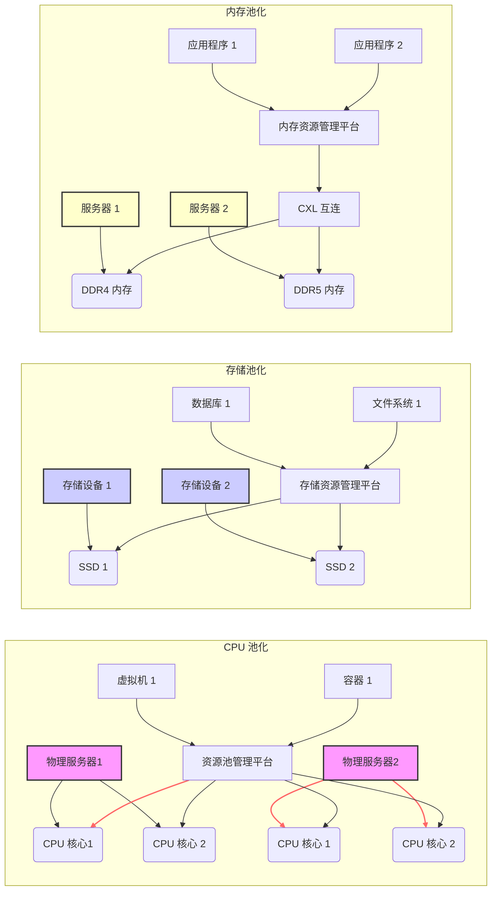

## 内存池化背后的技术 CXL (Compute Express Link)   
                    
### 作者                    
digoal                    
                    
### 日期                    
2025-03-05                   
                    
### 标签                    
PostgreSQL , PolarDB , DuckDB , cxl , Compute Express Link , 内存池化 , 内存共享   
                    
----                    
                    
## 背景     
在云端, 通过分布式存储和RDMA技术, 已经将`存储`池化 (在数据库领域, 数据湖架构可能也算一种池化状态吧); 通过虚拟化(ECS/容器)技术, 已经将`CPU`池化 (另一种在HPC领域, 将多台机器的 CPU 连接起来，为一个业务服务提供算力. 这种需求非常普遍，并且已经发展出了一系列成熟的技术和方法. 比如MPI (Message Passing Interface), OpenMP (Open Multi-Processing), CUDA (Compute Unified Device Architecture), RDMA (Remote Direct Memory Access));   
    
如何将`内存`池化? 不得不说背后的技术 CXL (Compute Express Link)   
  

  
## 内存池化背后的技术 CXL (Compute Express Link)   
  
### **CXL（Compute Express Link）技术详解：内存池化的关键革新**  
  
#### **1. CXL技术概述**  
**CXL（Compute Express Link）** 是一种基于PCIe物理层的高速互连协议，由Intel、AMD、ARM等公司联合开发，旨在解决CPU、GPU、FPGA、内存扩展设备等异构计算单元之间的高效通信问题。其核心特性包括 **缓存一致性**、**低延迟** 和 **高带宽**，尤其适用于需要共享内存资源的场景（如内存池化）。  
  
- **发展背景**：    
  - 传统架构中，内存直接绑定在CPU上，导致资源碎片化、利用率低。  
  - 异构计算（如AI/ML、大数据）对内存容量和灵活分配的需求激增。  
  - 现有互连协议（如PCIe）缺乏缓存一致性，难以支持多设备高效共享内存。  
  
- **协议版本演进**：    
  - **CXL 1.1**：基础版本，支持缓存一致性。  
  - **CXL 2.0**：引入内存池化（Memory Pooling）和共享能力。  
  - **CXL 3.0**：支持多层级互连（Fabric）和动态资源分配，带宽翻倍至64 GT/s。  
  
#### **2. CXL的内存池化机制**  
**内存池化（Memory Pooling）** 是将分散的内存资源整合为逻辑上的统一池，供多个设备按需动态分配。CXL通过以下技术实现这一目标：  
  
##### **2.1 缓存一致性协议（CXL.cache & CXL.mem）**  
- **CXL.cache**：    
  允许设备（如GPU）缓存主机CPU的内存数据，保持多设备间缓存一致性，避免数据冲突。  
- **CXL.mem**：    
  使设备能够直接访问主机或池化内存，支持读写操作，同时通过一致性协议同步数据。  
  
##### **2.2 内存池化架构**  
- **集中式池化**：    
  通过CXL交换机（Switch）将多个内存模块（如DDR、SCM）连接成共享池，CPU、GPU等设备通过CXL链路访问池中内存。  
- **分布式池化**：    
  设备自身内存（如GPU显存）可被其他设备通过CXL协议访问，形成全局统一内存视图。  
  
##### **2.3 关键技术特性**  
- **动态容量分配**：    
  内存池可按需分配给不同设备，例如在AI训练时动态扩展GPU可用内存。  
- **透明访问**：    
  应用程序无需修改代码即可使用池化内存，操作系统通过CXL驱动管理地址映射。  
- **低延迟访问**：    
  通过缓存一致性减少数据拷贝，延迟接近本地内存（微秒级）。  
  
#### **3. CXL内存池化的技术优势**  
| **特性**                | **传统架构**               | **CXL内存池化**              |  
|-------------------------|--------------------------|----------------------------|  
| **内存利用率**           | 低（固定分配）             | 高（动态共享）               |  
| **扩展性**               | 受限于单机内存插槽         | 支持跨设备、跨节点扩展       |  
| **一致性管理**            | 需软件维护，开销大         | 硬件级缓存一致性             |  
| **延迟**                 | 跨设备访问延迟高（毫秒级） | 接近本地内存（微秒级）       |  
| **适用场景**             | 单一工作负载               | 异构计算、弹性云资源         |  
  
#### **4. 应用场景**  
##### **4.1 云计算与虚拟化**  
- **弹性内存分配**：    
  虚拟机（VM）按需从池中分配内存，突破物理服务器内存容量限制。  
- **冷热数据分层**：    
  高频数据存于本地内存，低频数据存于远端池化内存（如CXL+SCM）。  
  
##### **4.2 AI/ML训练**  
- **大模型训练**：    
  GPU可直接访问池化内存，避免因显存不足导致的数据分片传输。  
- **多GPU协同**：    
  通过CXL共享内存，减少GPU间数据复制开销。  
  
##### **4.3 高性能计算（HPC）**  
- **统一内存空间**：    
  CPU与加速器（如FPGA）共享内存池，简化编程模型。  
- **近内存计算**：    
  计算节点就近访问池化内存，降低网络延迟。  
  
##### **4.4 边缘计算**  
- **资源整合**：    
  将边缘节点的闲置内存汇集成池，支持突发负载需求。  
  
#### **5. CXL与其他技术的对比**  
| **技术**       | **核心能力**                | **适用场景**               | **与CXL的差异**            |  
|---------------|---------------------------|--------------------------|--------------------------|  
| **CXL**        | 缓存一致性、内存池化         | 异构计算、资源动态共享      | 硬件级一致性，延迟最低      |  
| **CCIX**       | 跨设备一致性互连             | 多CPU/加速器通信          | 生态支持较少，逐渐被CXL取代 |  
| **NVLink**     | GPU间高速直连               | NVIDIA GPU集群            | 仅限NVIDIA设备，无内存池化 |  
| **Gen-Z**      | 内存语义网络                 | 分布式内存共享             | 依赖网络协议，延迟较高      |  
  
#### **6. 挑战与未来方向**  
##### **6.1 当前挑战**  
- **硬件兼容性**：    
  需要CPU、内存控制器、设备均支持CXL协议（如Intel Sapphire Rapids起支持CXL 1.1/2.0）。  
- **软件生态**：    
  操作系统（如Linux内核）需优化内存管理模块以支持CXL池化。  
- **资源调度复杂性**：    
  动态分配需智能算法避免资源争用（如NUMA架构扩展）。  
  
##### **6.2 未来趋势**  
- **CXL 3.0 Fabric**：    
  支持多层级交换，构建跨机柜、跨数据中心的全局内存池。  
- **与SCM（存储级内存）结合**：    
  利用CXL管理SCM（如Optane PMem），提供高容量持久化内存池。  
- **标准化与开源工具**：    
  SPDK、DPDK等框架将扩展对CXL内存池的支持。  
  
#### **7. 总结**  
CXL通过硬件级缓存一致性和高效的内存池化机制，正在重塑数据中心架构：    
- **对用户的价值**：降低TCO（总拥有成本）、提升资源利用率、加速异构计算。    
- **对产业的影响**：推动内存解耦（Disaggregation），迈向“内存即服务”（Memory-as-a-Service）。    
  
随着CXL 3.0的普及和生态成熟，未来内存池化将成为云、AI、HPC等场景的标配技术。  
  
      
<b> 以上内容基于DeepSeek及诸多AI生成, 轻微人工调整, 感谢杭州深度求索人工智能等公司. </b>               
             
<b> AI 生成的内容请自行辨别正确性, 当然也多了些许踩坑的乐趣, 毕竟冒险是每个男人的天性. </b>             
        
  
#### [期望 PostgreSQL|开源PolarDB 增加什么功能?](https://github.com/digoal/blog/issues/76 "269ac3d1c492e938c0191101c7238216")
  
  
#### [PolarDB 开源数据库](https://openpolardb.com/home "57258f76c37864c6e6d23383d05714ea")
  
  
#### [PolarDB 学习图谱](https://www.aliyun.com/database/openpolardb/activity "8642f60e04ed0c814bf9cb9677976bd4")
  
  
#### [PostgreSQL 解决方案集合](../201706/20170601_02.md "40cff096e9ed7122c512b35d8561d9c8")
  
  
#### [德哥 / digoal's Github - 公益是一辈子的事.](https://github.com/digoal/blog/blob/master/README.md "22709685feb7cab07d30f30387f0a9ae")
  
  
#### [About 德哥](https://github.com/digoal/blog/blob/master/me/readme.md "a37735981e7704886ffd590565582dd0")
  
  

  
