## NineData社区版本试用, 平滑将PolarDB PostgreSQL大表转换为分区表  
                      
### 作者                      
digoal                      
                      
### 日期                      
2025-03-06    
                      
### 标签                      
PostgreSQL , PolarDB , DuckDB , NineData , 数据同步 , 平滑切换分区    
                      
----                      
                      
## 背景       
为了生计, 我被迫答应老板的无理要求: 把PostgreSQL迁移到MySQL. MySQL有啥好的, 但是老板喜欢没得办法, 没办法咋个弄?   
  
找来找去, 终于找到了前阿里云数据库产品事业部负责人佛爷和普爷公司的产品NineData. <b> 居然推出了社区免费版, 这广告也太明显了. </b>   
  
## 体验 NineData 社区版  
“NineData 社区版”是最新发布的免费的、本地化部署（docker）版本。提供了数据库复制、数据库 DevOps 等产品能力，帮助小型企业、团队等更好的管理数据库。主要的产品功能包括：数据库全量迁移、增量迁移、数据库访问管理、流程权限等。  
  
### 功能概述  
  
当前版本支持的数据库复制包括：  
- MySQL->MySQL 结构、全量、增量迁移，以及数据对比  
- PostgreSQL -> PostgreSQL 结构、全量、增量迁移，以及数据对比  
- MySQL -> Doris 结构、全量、增量迁移，以及数据对比  
  
支持的数据库访问管理，则包括了 MySQL、PostgreSQL、Oracle、SQL Server、MongoDB 等数十种数据库。  
  
幸好目前Ninedata免费版仅支持PG 到 PG, 暂时还不能把PostgreSQL迁移到MySQL. 跟老板有交代了: <b>最牛逼的人搞的最牛逼的迁移工具NineData都不支持把PostgreSQL迁移到MySQL, 你作个啥子妖. 要不等他们把PG 到 MySQL免费了再搞. </b>  
     
不过都拿到社区版了, 那就体验一下怎么把PolarDB for PostgreSQL的大表转换成分区表吧, 毕竟这个也是很多小伙伴们都痛啊, 平滑转换还挺麻烦的.  
  
我的想法是建一个分区表, 然后用NineData同步过去, 到业务低谷再换个表名, 有约束关系的再迁移一下约束关系, 这样能对业务的影响降低到最小.    
  
### 部署 NineData 社区版  
拉取镜像  
```  
docker pull registry.cn-hangzhou.aliyuncs.com/ninedata_public/ninedata:latest  
```  
  
启动容器  
```  
mkdir ~/ninedata  
  
# 目前仅支持x86架构  
docker run --net=host --privileged -v ~/ninedata:/u01 --name ninedata -d registry.cn-hangzhou.aliyuncs.com/ninedata_public/ninedata:latest  
```  
  
打开WEB控制界面: `http://127.0.0.1:30081` , 初始管理员账号与密码均为 `admin`   
  
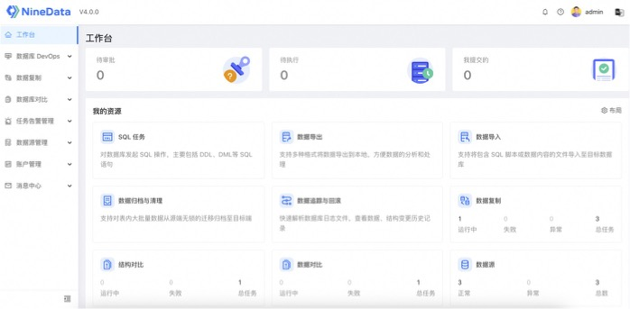  
  
PolarDB 就用进阶课的环境吧:   
- [《穷鬼玩PolarDB RAC一写多读集群系列 | 在Docker容器中用loop设备模拟共享存储搭建PolarDB RAC》](../202412/20241216_03.md)    
  
为了支持增量复制, 需要把 PolarDB 参数 `wal_level` 改成 `logical` 后重启PolarDB.    
  
建立测试库和测试用户  
```  
postgres=# create database db1;  
CREATE DATABASE  
postgres=# create role r1 login superuser encrypted password '123456';  
CREATE ROLE  
```  
  
确认pg_hba.conf已允许NineData连接, 包括正常协议和流复制协议都要允许.  
  
创建测试表, 写入一些测试数据, 假设tbl是大表  
```  
CREATE TABLE tbl (  
    id   int primary key,  
    info text,  
    ts timestamp not null  
) ;  
  
insert into tbl select generate_series(1,1000), 'test', now();  
```  
  
创建分区表tbl1, 使用月份分区. 让NineData把tbl的数据增量同步到tbl1.  
```  
CREATE TABLE tbl1 (  
    id   int not null,  
    info text,  
    ts   timestamp not null  
) PARTITION BY RANGE (ts);  
  
ALTER TABLE tbl1 ADD PRIMARY KEY (ts, id);  
  
CREATE TABLE tbl1_202501 PARTITION OF tbl1  
    FOR VALUES FROM ('2025-01-01') TO ('2025-02-01');  
  
CREATE TABLE tbl1_202502 PARTITION OF tbl1  
    FOR VALUES FROM ('2025-02-01') TO ('2025-03-01');  
  
CREATE TABLE tbl1_202503 PARTITION OF tbl1  
    FOR VALUES FROM ('2025-03-01') TO ('2025-04-01');  
  
CREATE TABLE tbl1_202504 PARTITION OF tbl1  
    FOR VALUES FROM ('2025-04-01') TO ('2025-05-01');  
  
CREATE TABLE tbl1_202505 PARTITION OF tbl1  
    FOR VALUES FROM ('2025-05-01') TO ('2025-06-01');  
  
CREATE TABLE tbl1_202506 PARTITION OF tbl1  
    FOR VALUES FROM ('2025-06-01') TO ('2025-07-01');  
  
CREATE TABLE tbl1_202507 PARTITION OF tbl1  
    FOR VALUES FROM ('2025-07-01') TO ('2025-08-01');  
  
CREATE TABLE tbl1_202508 PARTITION OF tbl1  
    FOR VALUES FROM ('2025-08-01') TO ('2025-09-01');  
  
CREATE TABLE tbl1_202509 PARTITION OF tbl1  
    FOR VALUES FROM ('2025-09-01') TO ('2025-10-01');  
  
CREATE TABLE tbl1_202510 PARTITION OF tbl1  
    FOR VALUES FROM ('2025-10-01') TO ('2025-11-01');  
  
CREATE TABLE tbl1_202511 PARTITION OF tbl1  
    FOR VALUES FROM ('2025-11-01') TO ('2025-12-01');  
  
CREATE TABLE tbl1_202512 PARTITION OF tbl1  
    FOR VALUES FROM ('2025-12-01') TO ('2026-01-01');  
  
create index on tbl1 (id);   
```  
  
打开NineData控制台, 创建PolarDB数据源  
  
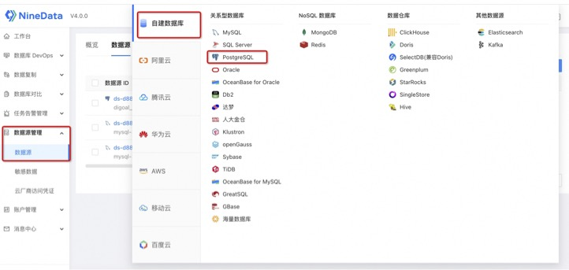  
  
新建同步任务(不需要同步结构, 因为我已经建好了)  
  
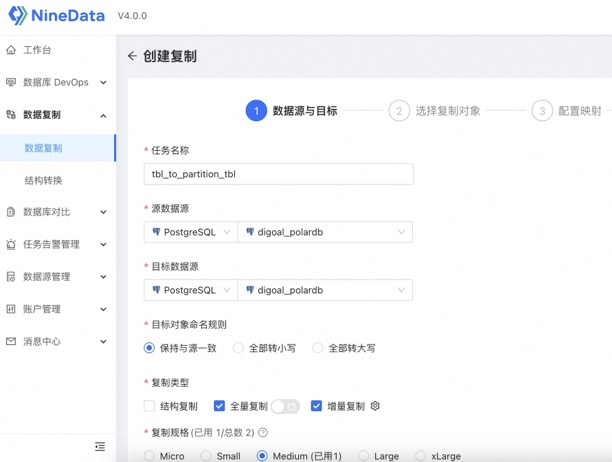  
  
选择tbl表作为源表  
  
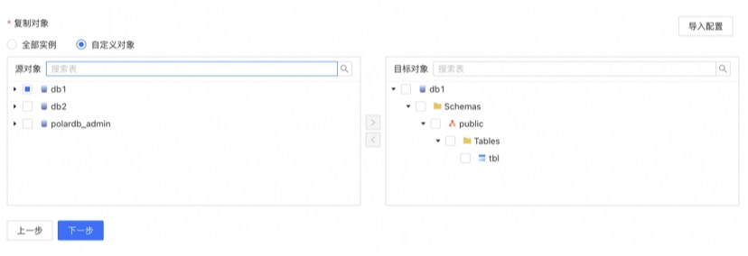  
  
选择tbl1表作为目标表  
  
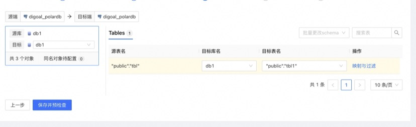  
  
启动任务  
  
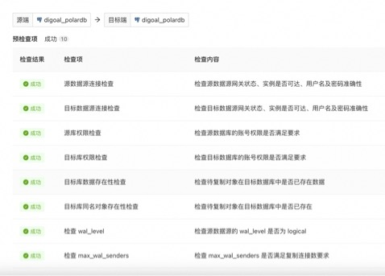  
  
在数据库中可以看到NineData建立了逻辑复制槽, 用于同步全量和增量数据.  
  
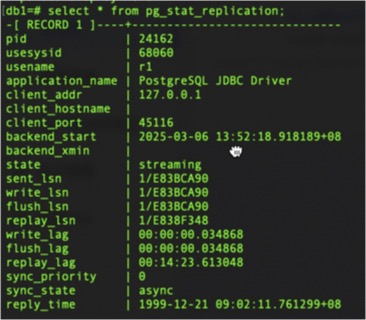  
  
观察同步任务   
  
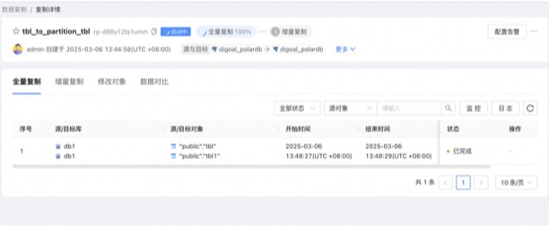  
  
检查全量数据同步完成  
  
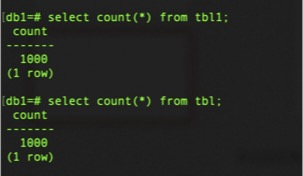  
  
新增和修改数据  
  
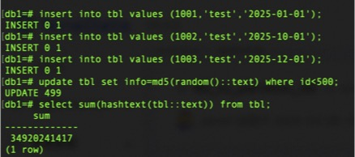  
  
检查增量数据同步完成  
  
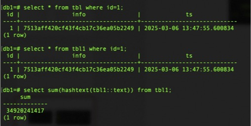  
  
任务的实时仪表盘  
  
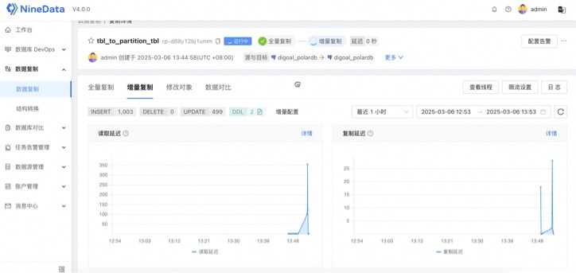  
  
真的太方便了.   
  
未来的期待, 如果结合AI 大模型, function call, tools调用, agent, 是不是AI就可以直接完成以上操作了! 以后的人可以享受生活了, 真羡慕未来的人类, 可以做自己喜欢的事情, 不需要为最基本饱腹之欲而弯腰.  
  
     
  
#### [期望 PostgreSQL|开源PolarDB 增加什么功能?](https://github.com/digoal/blog/issues/76 "269ac3d1c492e938c0191101c7238216")
  
  
#### [PolarDB 开源数据库](https://openpolardb.com/home "57258f76c37864c6e6d23383d05714ea")
  
  
#### [PolarDB 学习图谱](https://www.aliyun.com/database/openpolardb/activity "8642f60e04ed0c814bf9cb9677976bd4")
  
  
#### [PostgreSQL 解决方案集合](../201706/20170601_02.md "40cff096e9ed7122c512b35d8561d9c8")
  
  
#### [德哥 / digoal's Github - 公益是一辈子的事.](https://github.com/digoal/blog/blob/master/README.md "22709685feb7cab07d30f30387f0a9ae")
  
  
#### [About 德哥](https://github.com/digoal/blog/blob/master/me/readme.md "a37735981e7704886ffd590565582dd0")
  
  

  
