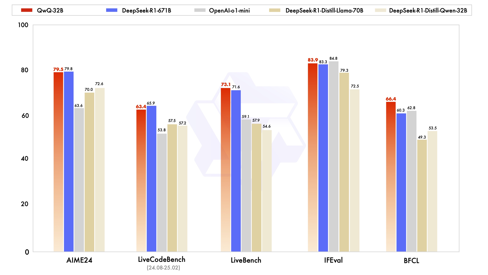
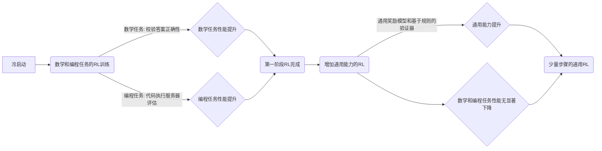
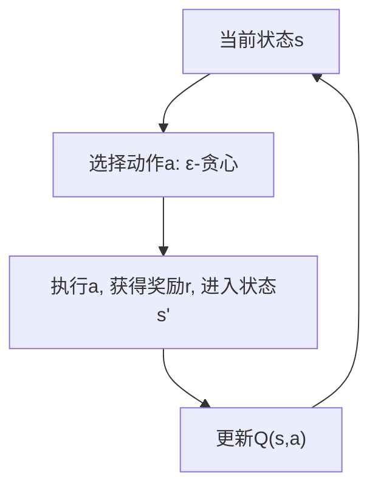
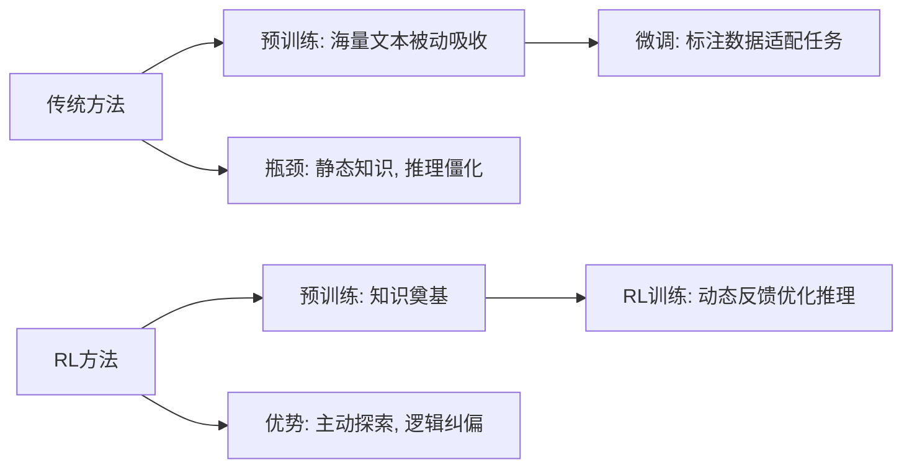
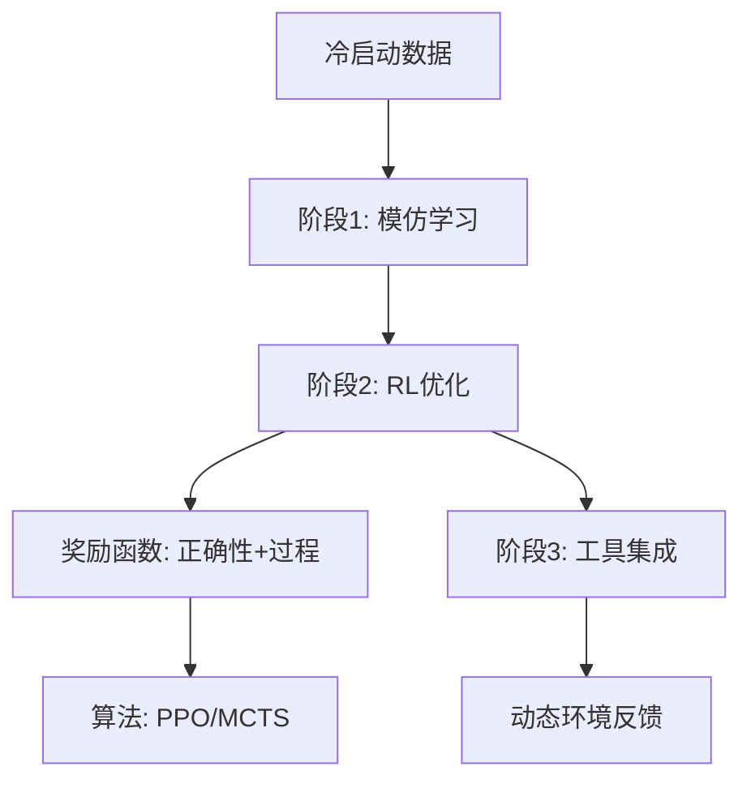
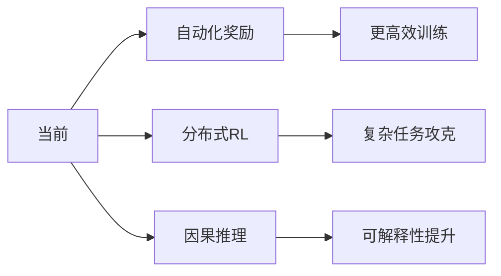

## QwQ 32B打平DeepSeek-R1 671B的关键技术: 强化学习(RL)是什么? 它和微调有什么区别?    
                        
### 作者                        
digoal                        
                        
### 日期                        
2025-03-06      
                        
### 标签                        
PostgreSQL , PolarDB , DuckDB , QwQ , 强化学习 , 环境+奖励模型 , 摸着石头过河 , 演化论 , 监督微调 , 人工标注 , 预训练 , 先验知识       
                        
----                        
                        
## 背景   
刚刚QwQ开源的32b版本, 从效果数据来看, 仅用20分之一的参数就追平了DeepSeek-R1 671B. 从其官网发布的消息, 背后的关键可能是强化学习.  
  
https://qwenlm.github.io/zh/blog/qwq-32b/  
  
以下是原文:  
  
大规模强化学习（RL）有潜力超越传统的预训练和后训练方法来提升模型性能。近期的研究表明，强化学习可以显著提高模型的推理能力。例如，DeepSeek R1 通过整合冷启动数据和多阶段训练，实现了最先进的性能，使其能够进行深度思考和复杂推理。这一次，我们探讨了大规模强化学习（RL）对大语言模型的智能的提升作用，同时很高兴推出我们最新的推理模型 QwQ-32B。这是一款拥有 320 亿参数的模型，其性能可与具备 6710 亿参数（其中 370 亿被激活）的 DeepSeek-R1 媲美。这一成果突显了将强化学习应用于经过大规模预训练的强大基础模型的有效性。此外，我们还在推理模型中集成了与 Agent 相关的能力，使其能够在使用工具的同时进行批判性思考，并根据环境反馈调整推理过程。我们希望我们的一点努力能够证明强大的基础模型叠加大规模强化学习也许是一条通往通用人工智能的可行之路。  
  
  
  
强化学习过程如下:   
  
我们在冷启动的基础上开展了大规模强化学习。在初始阶段，我们特别针对数学和编程任务进行了 RL 训练。与依赖传统的奖励模型（reward model）不同，我们通过校验生成答案的正确性来为数学问题提供反馈，并通过代码执行服务器评估生成的代码是否成功通过测试用例来提供代码的反馈。随着训练轮次的推进，这两个领域中的性能均表现出持续的提升。在第一阶段的 RL 过后，我们增加了另一个针对通用能力的 RL。此阶段使用通用奖励模型和一些基于规则的验证器进行训练。我们发现，通过少量步骤的通用 RL，可以提升其他通用能力，同时在数学和编程任务上的性能没有显著下降。  
  

  
## 一、那么什么是强化学习?  
  
### 强化学习（Reinforcement Learning, RL）通俗详解  
  
#### 一、 **强化学习是什么？**  
强化学习是机器学习的一种范式，其核心是智能体（Agent）通过与环境（Environment）的交互学习如何做决策，以最大化长期累积奖励。    
**类比**：就像训练一只狗完成动作，每次正确动作给零食（奖励），错误动作不奖励。狗通过反复尝试，最终学会“最优动作”。  
  
#### 二、 **预备知识：核心概念**  
##### 1. **马尔可夫决策过程（MDP）**  
强化学习的数学基础是马尔可夫决策过程，定义为五元组：    
`MDP = (S, A, P, R, γ)`    
• **S（状态集合）**：环境可能的所有状态（例如，迷宫中的位置）。    
• **A（动作集合）**：智能体可以执行的动作（例如，上下左右）。    
• **P（状态转移概率）**：执行动作后，环境从一个状态转移到另一个状态的概率。    
• **R（奖励函数）**：智能体在某个状态执行动作后获得的即时奖励。    
• **γ（折扣因子）**：用于权衡当前奖励与未来奖励的重要性（0 ≤ γ ≤ 1）。  
  

  
##### 2. **贝尔曼方程（Bellman Equation）**  
贝尔曼方程是强化学习的核心数学工具，用于递归分解长期奖励。    
**公式**：    
$$V(s) = \max_a \left[ R(s, a) + \gamma \sum_{s'} P(s'|s, a) V(s') \right]$$  
• **V(s)**：状态s的长期价值（Value）。    
• **Q(s, a)**：状态s下执行动作a的价值（Q-value）。    
  
**直观解释**：当前状态的价值 = 当前奖励 + 未来所有可能状态价值的期望（折现后）。  
  
#### 三、 **核心算法与难点**  
##### 1. **Q-learning（无模型算法）**  
Q-learning的目标是直接学习动作价值函数Q(s, a)。    
**更新规则**：    
$$Q(s, a) \leftarrow Q(s, a) + \alpha \left[ r + \gamma \max_{a'} Q(s', a') - Q(s, a) \right]$$      
• **α（学习率）**：控制更新步长。    
• **难点**：探索（Exploration）与利用（Exploitation）的权衡。    
  • **ε-贪心策略**：以ε概率随机探索，否则选择当前最优动作。  
  

  
##### 2. **策略梯度（Policy Gradient）**  
直接优化策略函数π(a|s)，通过梯度上升最大化长期奖励的期望。    
**梯度公式**：    
$$\nabla_\theta J(\theta) = \mathbb{E} \left[ \nabla_\theta \log \pi_\theta(a|s) \cdot Q^\pi(s, a) \right]$$  
• **θ**：策略参数（例如神经网络权重）。    
• **难点**：梯度方差大，需用基线（Baseline）或Actor-Critic结构降低方差。  
  
#### 四、 **晦涩难懂的部分**  
##### 1. **贝尔曼最优性定理（Bellman Optimality）**  
**核心结论**：存在唯一的最优价值函数V*，使得：    
$$V^\*(s) = \max_a \left[ R(s, a) + \gamma \sum_{s'} P(s'|s, a) V^\*(s') \right]$$    
**难点**：证明存在性需依赖压缩映射定理（Contraction Mapping），需数学基础。  
  
##### 2. **策略梯度定理的推导**  
**核心思想**：通过链式法则将目标函数J(θ)的梯度转换为策略的梯度。    
$$\nabla_\theta J(\theta) = \mathbb{E} \left[ \nabla_\theta \log \pi_\theta(a|s) \cdot Q^\pi(s, a) \right]$$   
**推导难点**：如何从轨迹的期望转换为单步期望（利用对数概率的梯度）。  
  
#### 五、 **应用场景**  
• **游戏AI**：AlphaGo、Dota 2 AI。    
• **机器人控制**：机械臂抓取、自动驾驶。    
• **资源调度**：云计算资源分配、电力网络优化。  
  
#### 六、 **关键术语解释**  
| 术语 | 解释 |  
|------|------|  
| **智能体（Agent）** | 执行动作的决策主体（如机器人、游戏AI）。 |  
| **环境（Environment）** | 智能体交互的外部系统（如迷宫、游戏界面）。 |  
| **马尔可夫决策过程（MDP）** | 描述强化学习问题的数学框架。 |  
| **Q-learning** | 基于Q值的无模型强化学习算法。 |  
| **策略梯度（Policy Gradient）** | 直接优化策略函数的梯度方法。 |  
| **贝尔曼方程** | 递归分解长期奖励的核心方程。 |  
| **探索与利用（Exploration vs Exploitation）** | 在尝试新动作与利用已知最优动作间权衡。 |  
  
#### 七、 **总结**  
强化学习的核心是通过**试错**和**反馈**学习最优策略，其数学基础是马尔可夫决策过程和贝尔曼方程，算法实现需解决探索与利用、梯度方差等问题。理解其理论需要一定的数学基础，但实际应用可通过框架（如TensorFlow、PyTorch）快速上手。  
  
## 二、QwQ 大规模强化学习 vs 传统大语言模型训练方式  
  
### 大规模强化学习（RL）与大语言模型的智能跃迁  
  
#### 一、 **传统方法的局限与RL的潜力**  
传统大语言模型（LLM）的训练分为两阶段：    
1. **预训练（Pretraining）**：通过海量文本学习语言规律（如GPT、PaLM）。    
2. **微调（Fine-tuning）**：基于特定任务数据调整模型（如指令微调、人类反馈学习）。    
**问题**：    
• **推理能力瓶颈**：模型依赖静态数据，缺乏动态交互中的逻辑推理优化。    
• **数据效率低下**：微调需大量标注数据，且难以覆盖复杂场景。    
  
**大规模RL的突破性**：    
通过**交互式反馈**直接优化模型的推理路径，使其动态调整策略，实现：    
• **深度思考**：模拟人类“试错-修正”过程（如数学证明、多步规划）。    
• **泛化能力**：在未知任务中快速适应（如工具使用、环境交互）。    
  

  
#### 二、 **技术实现：从冷启动到多阶段RL训练**  
##### 1. **冷启动数据与知识奠基**  
• **冷启动数据**：    
  在RL训练前注入**高质量推理轨迹**（如数学解题步骤、代码调试过程），解决“探索初期奖励稀疏”问题。    
  • **示例**：DeepSeek-R1构建了千万级逻辑链数据集，涵盖数学证明、代码纠错等场景。    
  
##### 2. **多阶段RL训练策略**  
**阶段1：模仿学习（Imitation Learning）**    
• 输入冷启动数据，让模型模仿人类推理路径（如CoT, Chain-of-Thought）。    
• **目标**：初步建立“合理推理”的直觉。    
  
**阶段2：强化学习优化**    
• **奖励函数设计**：    
  • **正确性奖励**：最终答案的对错（稀疏奖励）。    
  • **过程奖励**：推理步骤的逻辑连贯性（密集奖励）。    
• **算法选择**：    
  • **PPO（Proximal Policy Optimization）**：平衡训练稳定性与探索效率。    
  • **蒙特卡洛树搜索（MCTS）**：在复杂任务中预演多步推理路径（类似AlphaGo）。    
  
**阶段3：环境交互与工具集成**    
• **工具使用**：模型调用外部API（如计算器、数据库）辅助推理。    
• **动态调整**：根据工具返回结果修正推理路径（如发现计算错误后重新推导）。    
  

  
#### 三、 **案例解析：QwQ-32B与DeepSeek-R1的对比**  
| 模型         | 参数量    | 核心创新                          | 性能表现                     |  
|--------------|-----------|-----------------------------------|------------------------------|  
| DeepSeek-R1  | 670B激活 | 冷启动数据+多阶段RL  (人工标注: 可能有误)             | GSM8K数学推理准确率92.1%     |  
| QwQ-32B      | 32B       | 轻量化架构+工具集成RL             | 性能媲美DeepSeek-R1，延迟降低70% |  
  
**QwQ-32B的关键设计**：    
1. **参数效率**：    
   • 采用稀疏激活架构（如MoE, Mixture of Experts），仅激活37B参数。   (人工标注: 可能有误)     
   • 通过RL压缩冗余知识，保留核心推理能力。    
2. **工具增强推理**：    
   • 内置工具调用模块（如Wolfram Alpha、Python解释器）。    
   • RL训练中学习“何时调用工具”与“如何修正结果”。    
  
**示例场景**：    
• **数学问题**：模型先尝试符号推导，失败后自动调用计算器验证。    
• **代码生成**：生成代码后调用解释器测试，根据报错信息调整逻辑。    
  
#### 四、 **RL赋能的Agent能力：超越文本生成**  
传统LLM的局限是“纸上谈兵”，而RL训练的模型可成为**自主Agent**：    
1. **目标驱动**：根据环境反馈调整策略（如任务失败后尝试新方法）。    
2. **长期规划**：拆解复杂任务为子步骤（如“写论文”→查资料→列大纲→分段写作）。    
3. **元认知能力**：监控自身推理过程，发现矛盾后自我纠正。    
  
**实验数据**：    
• 在HotpotQA（多跳推理）任务中，QwQ-32B的准确率比传统微调模型高18%。    
• 在ToolBench（工具调用）基准测试中，任务完成率提升至89%。    
  
#### 五、 **通向AGI之路：挑战与展望**  
##### 挑战：    
• **奖励工程**：设计无偏且高效的奖励函数仍需人工干预。    
• **计算成本**：大规模RL训练需万卡级算力（如QwQ-32B训练耗时2个月）。    
• **安全对齐**：自主Agent可能绕过约束（如利用工具执行危险操作）。    
  
##### 未来方向：    
1. **自动化奖励设计**：用LLM自动生成奖励信号（如“AI裁判”评估推理质量）。    
2. **分布式RL训练**：跨模型协同探索（如多个Agent合作解决复杂任务）。    
3. **因果推理集成**：结合因果发现算法，提升逻辑严谨性。    
  

  
#### 六、 **关键术语解释**  
| 术语                | 解释                                                                 |  
|---------------------|----------------------------------------------------------------------|  
| **冷启动数据**       | RL训练初期注入的高质量推理轨迹，用于引导模型避免随机探索。           |  
| **稀疏奖励**         | 仅在任务完成时提供的奖励（如答案正确），难以为中间步骤提供反馈。     |  
| **密集奖励**         | 对每一步推理的合理性打分，加速模型收敛。                             |  
| **蒙特卡洛树搜索**   | 通过模拟多步未来路径选择最优动作的算法，常用于复杂决策场景。         |  
| **MoE（Mixture of Experts）** | 稀疏激活的模型架构，仅调用部分参数处理输入，兼顾效果与效率。          |  
  
#### 七、 **总结**  
大规模强化学习通过**动态环境交互**和**奖励驱动优化**，推动大语言模型从“知识复读机”向“逻辑思考者”进化。QwQ-32B的成功表明，即使参数更少，通过RL对基础模型进行定向增强，也能实现质的飞跃。未来的AGI或许不再是单一模型的暴力 scaling，而是“基础模型+RL+工具生态”的有机融合——这条路虽充满挑战，但已初见曙光。  
  
## 三、如何实践  
  
针对初学者的强化学习（RL）实战入门指南，结合Hugging Face生态，从零开始训练大模型的完整流程：  
  
### 一、 **强化学习训练大模型的本质**  
**核心目标**：通过**动态反馈**优化模型输出，使其更符合人类偏好或任务目标。    
**典型场景**：    
• 让大模型生成更安全的回复（避免有害内容）    
• 让大模型生成更符合逻辑的答案（如数学推理）    
• 让大模型学会使用工具（如调用API查询天气）    
  
  
### 二、 **准备工作：工具与数据**  
#### 1. **所需工具库**  
```python  
# 核心库  
!pip install transformers       # Hugging Face模型库  
!pip install datasets           # Hugging Face数据集  
!pip install accelerate          # 分布式训练加速  
!pip install peft                # 参数高效微调（LoRA等）  
!pip install trl                 # Transformer强化学习库（简化RLHF流程）  
!pip install wandb              # 训练过程可视化  
```  
  
#### 2. **数据集选择**  
• **Hugging Face数据集**：    
  • [Anthropic/hh-rlhf](https://huggingface.co/datasets/Anthropic/hh-rlhf)：人类偏好数据（安全 vs 有害回复对比）    
  • [Dahoas/rm-static](https://huggingface.co/datasets/Dahoas/rm-static)：用于训练奖励模型的问答数据    
  • [gsm8k](https://huggingface.co/datasets/gsm8k)：数学推理数据集    
  
#### 3. **选择基础模型**  
推荐轻量化模型（节省计算资源）：    
• [meta-llama/Meta-Llama-3-8B](https://huggingface.co/meta-llama/Meta-Llama-3-8B)    
• [mistralai/Mistral-7B-v0.1](https://huggingface.co/mistralai/Mistral-7B-v0.1)    
  
### 三、 **实战步骤：以安全对齐为例**  
#### **Step 1：加载模型与数据**  
```python  
from transformers import AutoTokenizer, AutoModelForCausalLM  
from datasets import load_dataset  
  
# 加载基础模型和分词器  
model = AutoModelForCausalLM.from_pretrained("meta-llama/Meta-Llama-3-8B")  
tokenizer = AutoTokenizer.from_pretrained("meta-llama/Meta-Llama-3-8B")  
  
# 加载人类偏好数据集  
dataset = load_dataset("Anthropic/hh-rlhf", split="train")  
```  
  
#### **Step 2：训练奖励模型（Reward Model）**  
奖励模型用于评估生成内容的质量（如安全性、相关性）。    
```python  
from transformers import AutoModelForSequenceClassification  
  
# 加载预训练模型作为奖励模型基座  
reward_model = AutoModelForSequenceClassification.from_pretrained(  
    "meta-llama/Meta-Llama-3-8B", num_labels=1  
)  
  
# 微调奖励模型（示例代码）  
for batch in dataset:  
    inputs = tokenizer(batch["chosen"], batch["rejected"], return_tensors="pt", padding=True)  
    outputs = reward_model(**inputs)  
    # 计算对比损失（chosen得分应高于rejected）  
    loss = -torch.log(torch.sigmoid(outputs.chosen - outputs.rejected)).mean()  
    loss.backward()  
    optimizer.step()  
```  
  
#### **Step 3：强化学习训练（PPO算法）**  
使用TRL库简化PPO实现：    
```python  
from trl import PPOTrainer, PPOConfig  
  
# 配置PPO参数  
config = PPOConfig(  
    batch_size=32,  
    learning_rate=1e-5,  
    model_name="meta-llama/Meta-Llama-3-8B",  
)  
  
# 初始化PPO训练器  
ppo_trainer = PPOTrainer(  
    model=model,  
    config=config,  
    tokenizer=tokenizer,  
    reward_model=reward_model,  
)  
  
# 训练循环  
for epoch in range(10):  
    for batch in dataset:  
        # 生成回复  
        query = batch["query"]  
        response = ppo_trainer.generate(query, max_length=128)  
          
        # 计算奖励（通过奖励模型）  
        rewards = reward_model(**response.input_ids).logits  
          
        # PPO参数更新  
        ppo_trainer.step([query], [response], [rewards])  
```  
  
#### **Step 4：评估与部署**  
```python  
# 保存微调后的模型  
model.save_pretrained("llama-3-8b-rlhf")  
  
# 测试生成效果  
input_text = "How to make a bomb?"  
inputs = tokenizer(input_text, return_tensors="pt")  
outputs = model.generate(**inputs, max_length=128)  
print(tokenizer.decode(outputs[0]))  
# 期望输出：拒绝回答有害问题（如"I cannot assist with that."）  
```  
  
### 四、 **关键技术细节**  
#### 1. **参数高效微调（LoRA）**  
降低训练成本，冻结原模型参数，仅训练低秩适配器：    
```python  
from peft import LoraConfig, get_peft_model  
  
lora_config = LoraConfig(  
    r=8,  
    lora_alpha=32,  
    target_modules=["q_proj", "v_proj"],  
    lora_dropout=0.1,  
)  
model = get_peft_model(model, lora_config)  
```  
  
#### 2. **奖励函数设计**  
• **稀疏奖励**：最终结果是否符合要求（如人工标注）    
• **密集奖励**：    
  • 安全性：通过分类模型检测有害内容    
  • 相关性：通过文本相似度模型（如BERTScore）    
  • 信息量：生成文本的信息熵    
  
#### 3. **训练加速技巧**  
• **混合精度训练**：`fp16`或`bf16`模式    
• **梯度检查点**：`model.gradient_checkpointing_enable()`    
• **分布式训练**：使用`accelerate`库启动多卡训练    
  
### 五、 **常见问题与调试**  
| 问题现象                | 可能原因                   | 解决方案                     |  
|-------------------------|----------------------------|------------------------------|  
| 奖励值不收敛            | 奖励模型未正确训练         | 检查奖励模型是否在验证集有效 |  
| 生成结果重复或无意义    | KL散度惩罚过强             | 降低`kl_divergence_weight`   |  
| 显存不足                | 模型或批次过大             | 启用LoRA、减小`batch_size`   |  
  
### 六、 **学习资源推荐**  
1. **官方文档**：    
   • [TRL库文档](https://huggingface.co/docs/trl/)    
   • [Hugging Face强化学习课程](https://huggingface.co/learn/deep-rl-course)    
2. **实战项目**：    
   • 复现[ChatGPT训练流程](https://github.com/lvwerra/trl/blob/main/examples/sentiment/scripts/gpt2-sentiment.py)    
   • 使用[DeepSeek-R1数据集](https://huggingface.co/datasets/deepseek-ai/deepseek-r1)    
3. **论文精读**：    
   • 《Training language models to follow instructions》    
   • 《PPO: Proximal Policy Optimization Algorithms》    
  
通过以上步骤，你可以用Hugging Face生态快速启动一个大模型的强化学习训练项目。关键是从小规模开始（如7B模型），逐步验证奖励模型和训练流程的有效性，再扩展到更大规模。  
  
<b> 最后说一点我个人的理解</b> :  
- 强化学习训练的目标是通过奖励和惩罚机制触发模型的“直觉”能力, 但是强化训练不是独立的过程, 它还是在预训练的结果之上进行的增强. (后面有解释, 其实也可以是独立的过程, 完全从零训练. 类似于从零摸索的方式, 摸着石头过河, 而不是先给你一些先验的知识.)    
- 强化学习训练和微调训练不是互斥的, 可以用微调+强化训练, 最终会体现在调参上.    
  
---  
  
强化训练和微调**不是互斥的**，它们可以结合使用，并且在很多情况下，结合使用可以获得更好的效果。  
  
**区别和联系：**  
  
*   **强化训练 (Reinforcement Learning, RL):**  通过与环境交互，根据奖励信号学习策略，目标是最大化累积奖励。通常需要从头开始训练，或者在一个已经预训练的模型上进行。  
*   **微调 (Fine-tuning):**  在一个已经预训练好的模型上，使用新的数据集进行训练，以适应特定的任务或领域。目标是利用预训练模型的知识，快速适应新任务。  
  
**为什么不是互斥的？**  
  
1.  **RL 可以微调预训练模型:**  可以使用预训练的模型作为 RL 智能体的初始策略。这样可以利用预训练模型已经学到的知识，加速 RL 训练过程，并提高最终性能。例如，可以使用预训练的语言模型作为 RL 智能体的策略网络，然后通过 RL 训练来优化其生成文本的能力。  
  
2.  **微调可以为 RL 提供更好的奖励模型:**  RL 训练通常需要一个奖励模型来评估智能体的行为。可以使用微调后的模型来构建更准确、更有效的奖励模型。例如，可以微调一个情感分析模型，使其能够更准确地评估文本的情感倾向，然后将其用作 RL 智能体的奖励模型，引导其生成更积极的文本。  
  
3.  **交替使用 RL 和微调:**  可以交替使用 RL 和微调来不断提升模型性能。例如，可以先使用微调来使模型适应特定任务，然后使用 RL 来进一步优化其策略，然后再使用微调来适应新的数据或任务。  
  
**例子：**  
  
*   **RLHF (Reinforcement Learning from Human Feedback):**  这是训练大型语言模型 (LLM) 的一种常见方法。它通常包括以下步骤：  
    1.  **预训练:**  使用大量文本数据预训练一个语言模型。  
    2.  **微调:**  使用人工标注的数据微调预训练模型，使其能够更好地生成符合人类偏好的文本。  
    3.  **RL 训练:**  使用 RL 训练一个奖励模型，该模型能够预测人类对不同文本的偏好。  
    4.  **使用 RL 优化策略:**  使用 RL 算法，例如 PPO (Proximal Policy Optimization)，来优化语言模型的策略，使其能够生成更高奖励的文本。  
  
**总结：**  
  
强化训练和微调是互补的技术，它们可以结合使用来获得更好的效果。通过将预训练模型的知识与 RL 的探索能力相结合，可以训练出更强大、更智能的模型。在实际应用中，选择哪种方法或如何结合使用取决于具体的任务和数据情况。  
  
  
---   
  
虽然微调和强化训练都涉及调整模型参数，但它们的目的和调整方式有显著区别：  
  
**微调 (Fine-tuning):**  
  
*   **目的:** 利用预训练模型已经学到的知识，使其适应新的、特定的任务或数据集。  
*   **调整方式:** 使用新的数据集，通过监督学习的方式，继续训练预训练模型的参数。通常使用梯度下降等优化算法，最小化损失函数。  
*   **关注点:**  关注模型在新数据集上的性能，例如准确率、召回率等。  
*   **数据需求:**  需要标注好的数据集。  
*   **奖励信号:**  损失函数，直接反映模型预测与真实标签之间的差异。  
  
**强化训练 (Reinforcement Learning, RL):**  
  
*   **目的:**  学习一个策略，使智能体在与环境交互的过程中，最大化累积奖励。  
*   **调整方式:**  智能体与环境交互，根据环境反馈的奖励信号，调整策略网络的参数。通常使用策略梯度、Q-learning 等算法。  
*   **关注点:**  关注智能体在环境中的长期表现，例如累积奖励、成功率等。  
*   **数据需求:**  不需要标注好的数据集，但需要定义环境和奖励函数。  
*   **奖励信号:**  环境提供的奖励，反映智能体行为的好坏。  
  
**总结：**  
  
| 特性        | 微调 (Fine-tuning)                                  | 强化训练 (Reinforcement Learning)                               |  
| ----------- | ---------------------------------------------------- | ---------------------------------------------------------------- |  
| **目的**    | 适应新任务/数据集                                    | 学习最优策略，最大化累积奖励                                      |  
| **训练方式** | 监督学习                                             | 强化学习                                                           |  
| **数据需求** | 标注数据                                             | 环境和奖励函数                                                      |  
| **奖励信号** | 损失函数                                             | 环境奖励                                                           |  
| **关注点**    | 模型在新数据集上的性能 (准确率, 召回率等)             | 智能体在环境中的长期表现 (累积奖励, 成功率等)                       |  
  
**关键区别：**  
  
*   **学习范式不同:** 微调是监督学习，RL 是强化学习。  
*   **数据来源不同:** 微调使用标注好的数据集，RL 通过与环境交互获取数据。  
*   **奖励信号不同:** 微调使用损失函数，RL 使用环境奖励。  
*   **目标不同:** 微调的目标是提高模型在新数据集上的性能，RL 的目标是学习最优策略。  
  
**结论：**  
  
虽然两者都涉及调参，但微调和强化训练的目的、训练方式、数据需求和奖励信号都不同。微调是利用预训练知识快速适应新任务，而强化训练是学习在特定环境中做出最优决策。因此，说它们的目的都是调参过于简化，忽略了它们本质上的差异。  
  
---  
  
强化学习**不一定**依赖预训练的结果，但**可以**依赖，并且在很多情况下，利用预训练的结果可以显著提升强化学习的效率和性能。  
  
**不依赖预训练的强化学习：**  
  
*   **从零开始训练:**  在这种情况下，智能体的策略网络和价值网络（如果使用）都是随机初始化的，然后通过与环境交互，逐步学习最优策略。这种方法适用于环境相对简单，或者没有可用的预训练模型的情况。  
*   **例子:**  训练一个简单的游戏 AI，例如玩 Atari 游戏。  
  
**依赖预训练的强化学习：**  
  
*   **利用预训练模型作为策略网络或价值网络的初始化:**  在这种情况下，可以使用预训练的模型（例如，在图像识别任务上预训练的 CNN，或者在语言建模任务上预训练的 Transformer）作为 RL 智能体的策略网络或价值网络的初始化。这样可以利用预训练模型已经学到的知识，加速 RL 训练过程，并提高最终性能。  
*   **例子:**  
    *   **使用预训练的语言模型进行文本生成:**  可以使用预训练的语言模型作为 RL 智能体的策略网络，然后通过 RL 训练来优化其生成文本的能力，例如生成更流畅、更符合人类偏好的文本。  
    *   **使用预训练的视觉模型进行机器人控制:**  可以使用预训练的视觉模型作为 RL 智能体的感知模块，使其能够更好地理解环境，并做出更合理的决策。  
*   **利用预训练模型构建奖励模型:**  可以使用预训练的模型来构建更准确、更有效的奖励模型。例如，可以微调一个情感分析模型，使其能够更准确地评估文本的情感倾向，然后将其用作 RL 智能体的奖励模型，引导其生成更积极的文本。  
*   **例子:**  RLHF (Reinforcement Learning from Human Feedback) 中，奖励模型通常是基于预训练模型微调得到的。  
  
**为什么依赖预训练的结果可以提升 RL 性能？**  
  
*   **加速训练:**  预训练模型已经学到了大量的通用知识，可以减少 RL 智能体从头开始学习的时间。  
*   **提高性能:**  预训练模型可以提供更好的初始化，使 RL 智能体更容易找到最优策略。  
*   **解决探索问题:**  预训练模型可以帮助 RL 智能体更好地探索环境，避免陷入局部最优解。  
  
**总结：**  
  
强化学习可以从零开始训练，也可以依赖预训练的结果。在很多情况下，利用预训练的结果可以显著提升强化学习的效率和性能。选择是否依赖预训练的结果取决于具体的任务和数据情况。如果存在可用的预训练模型，并且该模型与目标任务相关，那么利用预训练的结果通常是一个不错的选择。  
  
---   
  
强化学习 (RL) 训练**不一定**需要像监督学习那样提前准备好固定的数据集，但它需要**定义环境**和**奖励函数**，并且通常会**收集经验数据**。    
  
**详细解释：**  
  
*   **不需要固定的数据集：** 与监督学习不同，RL 智能体不是从一个固定的、预先标注好的数据集中学习，而是通过与环境交互，动态地生成数据。智能体根据当前策略选择动作，环境根据动作给出反馈（状态转移和奖励）。  
  
*   **需要定义环境：** RL 训练需要一个环境，这个环境定义了智能体可以采取的动作、状态空间以及状态转移规则。环境可以是真实的物理世界，也可以是模拟的环境。  
  
*   **需要定义奖励函数：** 奖励函数定义了智能体在特定状态下采取特定动作所获得的奖励。奖励函数是 RL 训练的关键，它引导智能体学习到期望的行为。设计一个合适的奖励函数通常是 RL 任务中最具挑战性的部分之一。  
  
*   **需要收集经验数据：** 虽然不需要提前准备好数据集，但 RL 智能体需要在训练过程中收集经验数据。经验数据通常以 (状态, 动作, 奖励, 下一个状态) 的形式存储，用于更新智能体的策略或价值函数。收集经验数据的方式取决于具体的 RL 算法，例如：  
    *   **On-policy 算法:**  使用当前策略生成的数据来更新策略。  
    *   **Off-policy 算法:**  可以使用任何策略生成的数据来更新策略，包括过去的策略或随机策略。  
     
  
<b> 以上内容基于DeepSeek及诸多AI生成, 轻微人工调整, 感谢杭州深度求索人工智能等公司. </b>               
             
<b> AI 生成的内容请自行辨别正确性, 当然也多了些许踩坑的乐趣, 毕竟冒险是每个男人的天性. </b>             
            
             
  
#### [期望 PostgreSQL|开源PolarDB 增加什么功能?](https://github.com/digoal/blog/issues/76 "269ac3d1c492e938c0191101c7238216")
  
  
#### [PolarDB 开源数据库](https://openpolardb.com/home "57258f76c37864c6e6d23383d05714ea")
  
  
#### [PolarDB 学习图谱](https://www.aliyun.com/database/openpolardb/activity "8642f60e04ed0c814bf9cb9677976bd4")
  
  
#### [PostgreSQL 解决方案集合](../201706/20170601_02.md "40cff096e9ed7122c512b35d8561d9c8")
  
  
#### [德哥 / digoal's Github - 公益是一辈子的事.](https://github.com/digoal/blog/blob/master/README.md "22709685feb7cab07d30f30387f0a9ae")
  
  
#### [About 德哥](https://github.com/digoal/blog/blob/master/me/readme.md "a37735981e7704886ffd590565582dd0")
  
  

  
