## AI辅助 PolarDB内核学习 - 11 rewrite (SQL规则重写器)  
### 作者        
digoal        
        
### 日期        
2025-03-07        
        
### 标签        
PostgreSQL , PolarDB , DuckDB , AI , 内核 , 学习 , rewrite , query rewrite , rule , 规则重写 , sql重写       
        
----        
        
## 背景      
    
## 整体模块概览   
该目录主要负责**查询重写（Query Rewriting）**和**行级安全（Row-Level Security）**，通过规则（Rules）和策略（Policies）修改原始查询的逻辑。以下是各文件的功能概览：  
    
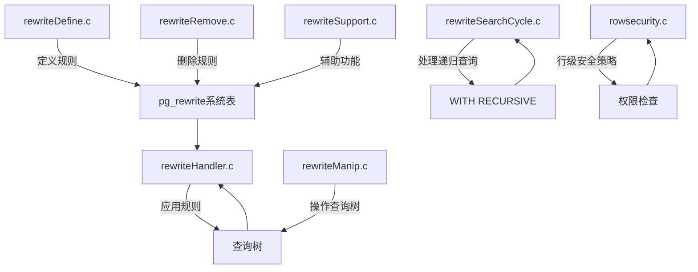
  
### 各文件核心功能说明  
  
#### 1. **rewriteDefine.c**  
- **职责**：定义和管理规则（CREATE/ALTER RULE）。  
- **核心操作**：  
  - 插入/更新`pg_rewrite`系统表。  
  - 检查规则语法和语义有效性。  
- **关键函数**：`DefineRule`, `DefineQueryRewrite`.  
  
#### 2. **rewriteHandler.c**  
- **职责**：查询重写的**核心处理器**。  
- **核心操作**：  
  - 遍历查询树，应用规则（如视图展开、INSTEAD规则）。  
  - 处理行级安全（RLS）策略。  
- **关键函数**：`AcquireRewriteLocks`, `RewriteQuery`.  
  
#### 3. **rewriteManip.c**  
- **职责**：**操作查询树**的工具函数。  
- **核心操作**：  
  - 添加/删除查询条件（Qualifiers）。  
  - 调整目标列（Target Lists）。  
  
#### 4. **rewriteRemove.c**  
- **职责**：删除规则（DROP RULE）。  
- **核心操作**：  
  - 从`pg_rewrite`中删除条目。  
  - 更新表的`relhasrules`状态。  
  
#### 5. **rewriteSearchCycle.c**  
- **职责**：处理**递归查询（WITH RECURSIVE）**中的循环检测。  
- **核心操作**：  
  - 生成循环检测条件（如`CYCLE`子句）。  
  - 构建路径追踪表达式。  
  
#### 6. **rewriteSupport.c**  
- **职责**：规则管理的**辅助工具**。  
- **核心操作**：  
  - 检查规则是否存在（`IsDefinedRule`）。  
  - 更新表的规则状态（`SetRelationRuleStatus`）。  
  
#### 7. **rowsecurity.c**  
- **职责**：**行级安全（RLS）**策略的解析和应用。  
- **核心操作**：  
  - 生成安全策略条件（如`USING`和`WITH CHECK`）。  
  - 处理扩展策略（通过钩子函数）。  
  
  
### 模块协作流程  
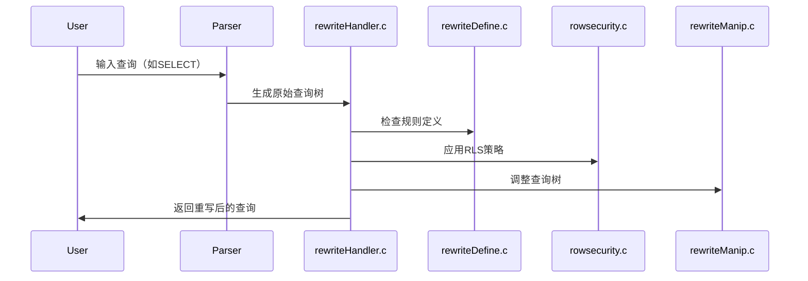
  
  
### 关键概念解释  
1. **规则（Rules）**：  
   - 允许在表上定义自动触发的SQL片段（如`DO INSTEAD`）。  
   - 例如：视图（VIEW）通过`ON SELECT`规则实现。  
  
2. **行级安全（RLS）**：  
   - 通过策略（Policies）限制用户对数据的访问。  
   - 例如：`CREATE POLICY ... USING (user_id = current_user)`.  
  
3. **递归查询（WITH RECURSIVE）**：  
   - 通过`rewriteSearchCycle.c`处理无限递归的终止条件。  
  
## query rewrite相关例子  
  
以下是PostgreSQL中常见的查询重写（Query Rewrite）示例，结合`src/backend/rewrite`目录的模块功能及源码文件说明：  
  
  
### 1. **视图（VIEW）展开**  
- **原始查询**：  
  ```sql  
  SELECT * FROM my_view WHERE id = 1;  
  ```  
- **重写后的查询**：  
  ```sql  
  SELECT * FROM (SELECT * FROM base_table WHERE status = 'active') AS my_view WHERE id = 1;  
  ```  
- **原理**：  
  - 视图本质是`ON SELECT`规则（存储于`pg_rewrite`系统表）。  
  - **rewriteHandler.c**会展开视图为子查询，并合并原始WHERE条件。  
- **源码文件**：  
  - `rewriteHandler.c`：核心逻辑在`RewriteQuery`函数，遍历查询树并替换视图RTEs。  
  
  
### 2. **行级安全（RLS）策略**  
- **原始查询**：  
  ```sql  
  SELECT * FROM sensitive_data;  
  ```  
- **重写后的查询**：  
  ```sql  
  SELECT * FROM sensitive_data WHERE user_id = current_user;  
  ```  
- **原理**：  
  - 通过RLS策略自动附加`USING`条件。  
  - **rowsecurity.c**生成安全策略表达式，插入到查询树的`securityQuals`。  
- **源码文件**：  
  - `rowsecurity.c`：`add_security_quals`函数添加过滤条件。  
  
  
### 3. **INSTEAD规则（如触发器替代操作）**  
- **原始查询**：  
  ```sql  
  INSERT INTO audit_log (action) VALUES ('delete');  
  ```  
- **规则定义**：  
  ```sql  
  CREATE RULE log_deletes AS ON DELETE TO my_table DO INSTEAD  
    INSERT INTO audit_log (action) VALUES ('delete');  
  ```  
- **重写后的行为**：  
  - 执行`DELETE FROM my_table`时，实际插入`audit_log`。  
- **源码文件**：  
  - `rewriteHandler.c`：`ApplyRetrieveRule`处理`INSTEAD`逻辑。  
  - `rewriteDefine.c`：`DefineRule`将规则写入`pg_rewrite`。  
  
  
### 4. **递归查询（WITH RECURSIVE）的循环检测**  
- **原始查询**：  
  ```sql  
  WITH RECURSIVE cte AS (  
    SELECT 1 AS n UNION ALL SELECT n+1 FROM cte WHERE n < 10  
  ) SELECT * FROM cte;  
  ```  
- **重写后的查询**：  
  ```sql  
  -- 隐式添加循环终止条件  
  WITH RECURSIVE cte AS (  
    SELECT 1 AS n, ARRAY[ROW(1)] AS path, false AS cycle  
    UNION ALL  
    SELECT n+1, path || ROW(n+1), (ROW(n+1) = ANY(path))   
    FROM cte WHERE n < 10 AND NOT cycle  
  ) SELECT * FROM cte;  
  ```  
- **原理**：  
  - **rewriteSearchCycle.c**自动生成`cycle`列和路径追踪逻辑。  
- **源码文件**：  
  - `rewriteSearchCycle.c`：`rewriteSearchAndCycle`函数注入循环检测条件。  
  
  
### 5. **条件合并优化**  
- **原始查询**：  
  ```sql  
  SELECT * FROM t1 LEFT JOIN t2 ON t1.id = t2.id WHERE t2.value > 100;  
  ```  
- **重写后的查询**：  
  ```sql  
  SELECT * FROM t1 LEFT JOIN t2 ON t1.id = t2.id AND t2.value > 100;  
  ```  
- **原理**：  
  - 将WHERE条件提升到JOIN条件中（减少中间结果大小）。  
  - **rewriteManip.c**调整查询树中的条件位置。  
- **源码文件**：  
  - `rewriteManip.c`：`adjust_appendrel_attrs`等函数操作条件表达式。  
  
  
### 6. **RETURNING重写（规则中的DML返回结果）**  
- **原始查询**：  
  ```sql  
  UPDATE orders SET status = 'shipped' WHERE id = 1;  
  ```  
- **规则定义**：  
  ```sql  
  CREATE RULE notify_order_update AS ON UPDATE TO orders DO ALSO  
    INSERT INTO notifications (message) VALUES ('Order updated');  
  ```  
- **重写后的行为**：  
  - 执行UPDATE后，自动插入`notifications`，并返回UPDATE的结果。  
- **源码文件**：  
  - `rewriteHandler.c`：`RewriteQuery`将`DO ALSO`规则动作合并到查询计划。  
  
  
### 对应源码模块总结  
| 示例               | 关键源码文件           | 核心函数或逻辑               |  
|--------------------|------------------------|------------------------------|  
| 视图展开           | `rewriteHandler.c`     | `RewriteQuery`, `ApplyRetrieveRule` |  
| 行级安全（RLS）    | `rowsecurity.c`        | `get_row_security_policies`, `add_security_quals` |  
| INSTEAD规则        | `rewriteDefine.c`      | `DefineRule`, `DefineQueryRewrite` |  
| 递归查询循环检测   | `rewriteSearchCycle.c` | `rewriteSearchAndCycle`       |  
| 条件优化           | `rewriteManip.c`       | `adjust_appendrel_attrs`      |  
  
这些示例展示了PostgreSQL如何通过查询重写实现高级功能，你可以进一步要求我深入某个具体文件的实现细节！  
  
## 精读rewriteHandler.c文件  
  
### 详细解读 `rewriteHandler.c` 的功能与实现  
  
在 PostgreSQL 中，`rewriteHandler.c` 是查询重写模块的核心文件，主要负责处理规则（rules）和视图（views）的重写逻辑。以下是对代码的详细解读，结合数据库用户或 DBA 可感知的用例，并使用 Mermaid 图表增强解释性。  
  
  
### **1. 核心功能概述**  
`rewriteHandler.c` 的主要功能包括：  
1. **规则应用**：根据定义的规则（如 `ON SELECT`, `ON INSERT` 等）对查询进行改写。  
2. **视图展开**：将视图的定义嵌入到查询中，替换视图的引用。  
3. **权限检查**：确保用户对涉及的表和视图具有适当的权限。  
4. **递归检测**：防止规则或视图展开过程中出现无限递归。  
5. **锁管理**：为查询中涉及的表获取必要的锁，确保模式稳定性。  
  
  
### **2. 关键函数详解**  
  
#### **2.1 `AcquireRewriteLocks`**  
- **功能**：为查询中涉及的所有关系获取适当的锁，以防止模式在查询执行期间发生变化。  
- **输入**：  
  - 查询树（`Query` 结构）。  
  - 是否为执行阶段（`forExecute` 参数）。  
- **输出**：无。  
- **实现细节**：  
  - 遍历查询中的范围表（RTE，Range Table Entry），为每个关系获取锁。  
  - 如果是执行阶段，使用 RTE 中指定的锁模式；否则，默认使用 `AccessShareLock`。  
  - 检查并修复 JOIN 表达式中可能引用已删除列的情况。  
  
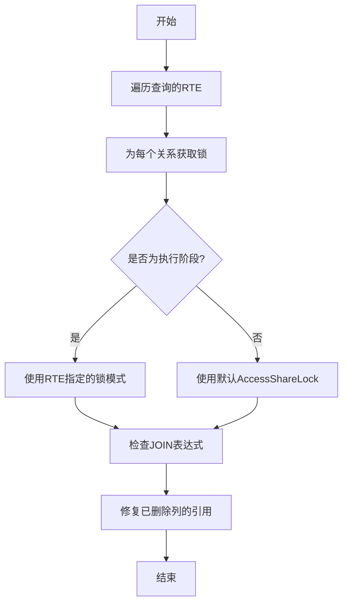
  
**用例**：  
- 用户执行一个复杂查询，涉及多个表和视图。`AcquireRewriteLocks` 确保这些表和视图的结构在查询执行期间不会被修改。  
  
  
#### **2.2 `rewriteRuleAction`**  
- **功能**：根据触发查询的条件改写规则的动作部分。  
- **输入**：  
  - 原始查询（`parsetree`）。  
  - 规则动作（`rule_action`）。  
  - 规则条件（`rule_qual`）。  
  - 目标关系的范围表索引（`rt_index`）。  
- **输出**：改写后的规则动作。  
- **实现细节**：  
  - 调整规则动作的变量编号（`varnos`），使其与主查询的范围表兼容。  
  - 处理 `OLD` 和 `NEW` 引用。  
  - 合并范围表，确保规则动作可以访问主查询的所有表。  
  - 改写目标列表（`targetlist`），处理默认值和多列赋值。  
  
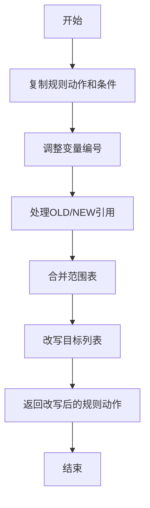
  
**用例**：  
- 用户定义了一个 `ON INSERT` 规则，当插入数据时自动更新另一个表。`rewriteRuleAction` 将规则的动作部分改写为可执行的查询。  
  
  
#### **2.3 `rewriteTargetListIU`**  
- **功能**：将 `INSERT` 或 `UPDATE` 的目标列表标准化。  
- **输入**：  
  - 目标列表（`targetlist`）。  
  - 是否为 `INSERT`。  
- **输出**：标准化的目标列表。  
- **实现细节**：  
  - 为未赋值的列添加默认值。  
  - 合并对同一列的多次赋值（如数组或记录字段的部分更新）。  
  - 按列号排序目标列表。  
  
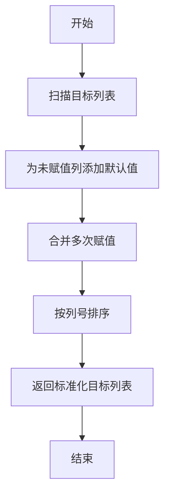
  
**用例**：  
- 用户执行 `INSERT INTO table (col1) VALUES (1)`，但表中还有其他列需要默认值。`rewriteTargetListIU` 自动为这些列添加默认值。  
  
  
#### **2.4 `ApplyRetrieveRule`**  
- **功能**：展开 `ON SELECT` 规则，将视图的定义嵌入到查询中。  
- **输入**：  
  - 查询树。  
  - 视图的范围表条目。  
- **输出**：展开后的查询。  
- **实现细节**：  
  - 检查视图是否有 `INSTEAD OF` 触发器。  
  - 将视图的定义作为子查询嵌入到主查询中。  
  - 添加必要的权限检查和全行引用（`resjunk` 列）。  
  
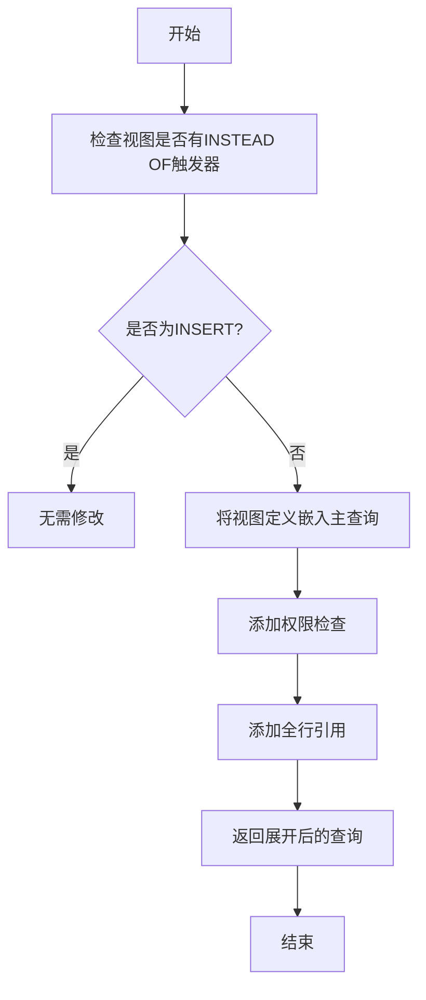
  
**用例**：  
- 用户查询一个视图 `SELECT * FROM my_view`。`ApplyRetrieveRule` 将视图的定义展开为底层表的查询。  
  
  
### **3. 数据库用户视角的用例**  
  
#### **用例 1：视图查询**  
- **场景**：用户创建了一个视图 `my_view`，并在查询中使用它。  
- **过程**：  
  1. 用户执行 `SELECT * FROM my_view`。  
  2. `rewriteHandler.c` 调用 `ApplyRetrieveRule` 展开视图定义。  
  3. 查询被改写为底层表的查询，并执行。  
- **结果**：用户看到视图的结果，而无需关心底层表的复杂性。  
  
#### **用例 2：规则触发**  
- **场景**：用户定义了一个 `ON INSERT` 规则，当插入数据时自动更新另一个表。  
- **过程**：  
  1. 用户执行 `INSERT INTO table (col1) VALUES (1)`。  
  2. `rewriteHandler.c` 调用 `rewriteRuleAction` 改写规则动作。  
  3. 插入操作完成后，规则动作被执行。  
- **结果**：另一个表被自动更新。  
  
  
### **4. 总结**  
`rewriteHandler.c` 是 PostgreSQL 查询重写模块的核心，负责处理规则、视图和权限检查等复杂逻辑。通过上述函数的协作，PostgreSQL 能够高效地改写查询，确保用户能够透明地使用规则和视图，同时避免潜在的递归和权限问题。  
  
如果您希望深入了解某个具体函数或功能，请告诉我！  
  
## 精读rewriteDefine.c文件  
好的，我们来详细解读 `rewriteDefine.c` 的代码，并结合数据库用户或 DBA 可感知的用例来加深理解。  
  
**目标**  
  
理解 `rewriteDefine.c` 中的关键函数，以及它们在创建、修改和删除重写规则时所扮演的角色。  
  
**mermaid 图表**  
  
为了更清晰地展示函数之间的关系，我们使用 mermaid 图表。  
  
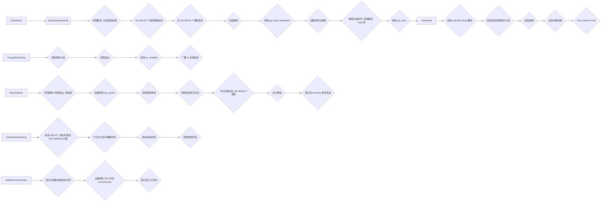
  
**代码解读**  
  
1.  **`DefineRule` 函数**  
  
    *   **功能：**  `DefineRule` 是创建重写规则的入口函数，它接收 CREATE RULE 命令的语法树，并执行创建规则的整个流程。  
    *   **用例：**  DBA 使用 `CREATE RULE` 命令创建规则时，例如：  
  
        ```sql  
        CREATE RULE update_salary AS ON UPDATE TO employees  
        WHERE OLD.salary > NEW.salary  
        DO INSTEAD UPDATE employees SET salary = OLD.salary  
        WHERE emp_id = OLD.emp_id;  
        ```  
  
    *   **流程：**  
  
        1.  **解析分析：**  对规则的条件 (qual) 和动作 (action) 进行语法和语义分析。  
        2.  **查找并锁定关系：**  找到规则所作用的表或视图，并获取适当的锁，防止并发修改。  
        3.  **调用 `DefineQueryRewrite`：**  将经过解析分析的规则信息传递给 `DefineQueryRewrite` 函数，执行实际的规则创建过程。  
  
2.  **`DefineQueryRewrite` 函数**  
  
    *   **功能：**  `DefineQueryRewrite` 接收已经过解析分析的规则信息，执行创建规则的核心逻辑。  
    *   **用例：**  `DefineRule` 函数调用 `DefineQueryRewrite`，或者在某些内部操作中，可以直接调用 `DefineQueryRewrite`。  
    *   **流程：**  
  
        1.  **锁定关系：**  根据规则的类型（`ON SELECT` 或其他），获取不同级别的锁。`ON SELECT` 规则需要 `AccessExclusiveLock`，以确保没有并发的 `SELECT` 操作。  
        2.  **验证关系类型：**  检查关系是否是表或视图，只有这两种类型的关系才能应用规则。  
        3.  **权限检查：**  验证用户是否具有在关系上创建规则的权限。  
        4.  **规则约束检查：**  根据规则的类型，执行各种约束检查，例如：  
            *   `ON SELECT` 规则：  
                *   只能用于视图定义。  
                *   必须是 `INSTEAD` 规则。  
                *   只能有一个 `SELECT` 动作。  
                *   `SELECT` 动作的目标列表必须与视图的结构匹配。  
                *   不能有其他 `ON SELECT` 规则。  
                *   规则名必须是 `_RETURN`。  
            *   非 `ON SELECT` 规则：  
                *   `RETURNING` 列表只能出现在一个动作中。  
                *   不能命名为 `_RETURN`。  
        5.  **安装规则：**  调用 `InsertRule` 函数将规则信息插入到 `pg_rewrite` 系统表中。  
        6.  **更新 `pg_class.relhasrules`：**  设置规则所作用的关系的 `relhasrules` 标志为 true，表示该关系具有规则。  
        7.  **转换为视图：**  如果规则将表转换为视图（这是一种过时的做法），则执行以下操作：  
            *   删除存储文件。  
            *   删除系统属性。  
            *   删除 toast 表。  
            *   更新 `pg_class` 表，将关系类型设置为 `RELKIND_VIEW`。  
  
3.  **`InsertRule` 函数**  
  
    *   **功能：**  `InsertRule` 将规则信息插入到 `pg_rewrite` 系统表中。  
    *   **用例：**  `DefineQueryRewrite` 函数调用 `InsertRule`，将规则的元数据存储到系统表中。  
    *   **流程：**  
  
        1.  **设置 `nulls` 和 `values` 数组：**  准备要插入到 `pg_rewrite` 表中的数据。  
        2.  **检查是否替换现有元组：**  如果规则名已存在，则替换现有规则。  
        3.  **安装依赖：**  创建规则与关系之间的依赖关系，确保在删除关系时，规则也会被删除。  
        4.  **安装对象依赖：**  创建规则与规则的条件和动作中引用的其他对象之间的依赖关系。  
        5.  **Post creation hook：**  执行规则创建后的钩子函数。  
  
4.  **`checkRuleResultList` 函数**  
  
    *   **功能：**  `checkRuleResultList` 验证规则的结果列表（`SELECT` 目标列表或 `RETURNING` 列表）是否与关系的元组描述符 (tupledesc) 兼容。  
    *   **用例：**  在创建 `ON SELECT` 规则或带有 `RETURNING` 列表的规则时，需要确保规则的结果与关系的结构匹配。  
    *   **流程：**  
  
        1.  **检查名称匹配：**  如果需要，检查结果列表中的列名是否与关系中的列名匹配。  
        2.  **检查类型匹配：**  检查结果列表中的列类型是否与关系中的列类型匹配。  
  
5.  **`setRuleCheckAsUser` 函数**  
  
    *   **功能：**  `setRuleCheckAsUser` 递归扫描查询或表达式树，并将所有 rtable 条目中的 `checkAsUser` 字段设置为给定的用户 ID。  
    *   **用例：**  在创建规则时，需要设置规则的执行用户，以确定规则在执行时使用的权限。  
    *   **流程：**  
  
        1.  **递归扫描：**  递归遍历查询树，包括子查询和子链接。  
        2.  **设置 `checkAsUser`：**  对于每个 rtable 条目，将 `checkAsUser` 字段设置为指定的 user ID。  
  
6.  **`ChangeRuleFiring` 函数**  
  
    *   **功能：** 修改现有规则的触发语义（启用或禁用）。  
    *   **用例：** DBA 使用 `ALTER RULE` 命令修改规则的启用状态。  
        ```sql  
        ALTER RULE my_rule ON my_table ENABLE;  
        ALTER RULE my_rule ON my_table DISABLE;  
        ```  
    *   **流程：**  
        1.  **查找规则元组：** 根据规则名称和表名找到对应的规则。  
        2.  **权限验证：** 确保用户有权限修改该规则。  
        3.  **修改 `ev_enabled`：** 更新 `pg_rewrite` 系统表中规则的 `ev_enabled` 字段。  
        4.  **广播 SI 失效消息：** 通知所有后端更新 relcache，使修改生效。  
  
7.  **`RenameRule` 函数**  
  
    *   **功能：** 重命名现有的重写规则。  
    *   **用例：** DBA 使用 `ALTER RULE` 命令重命名规则。  
        ```sql  
        ALTER RULE old_rule_name ON my_table RENAME TO new_rule_name;  
        ```  
    *   **流程：**  
        1.  **查找规则，验证权限，获取锁：** 找到要重命名的规则，验证用户权限，并获取必要的锁。  
        2.  **准备修改 `pg_rewrite`：** 准备更新 `pg_rewrite` 系统表。  
        3.  **获取规则条目：** 从 `pg_rewrite` 中获取规则的记录。  
        4.  **检查新名称是否存在：** 确保新的规则名称没有被占用。  
        5.  **不允许重命名 ON SELECT 规则：** `ON SELECT` 规则必须命名为 `_RETURN`，不允许重命名。  
        6.  **执行更新：** 更新 `pg_rewrite` 系统表中的规则名称。  
        7.  **使关系 relcache 条目失效：** 通知所有后端更新 relcache，使修改生效。  
  
**总结**  
  
`rewriteDefine.c` 文件包含了创建、修改和删除重写规则的关键函数。这些函数负责解析规则定义、验证规则的有效性、将规则信息存储到系统表中，以及维护规则与关系之间的依赖关系。理解这些函数的功能和流程，有助于深入了解 PostgreSQL 的重写规则机制。  
  
希望这个详细的解读能够帮助你更好地理解 `rewriteDefine.c` 的代码。  
  
## 精读rewriteManip.c文件  
好的，我们继续深入 `rewriteManip.c` 的代码，结合数据库用户或 DBA 的视角，详细解读每个函数的功能、实现，并使用 Mermaid 图表来辅助理解。  
  
**文件概览：`rewriteManip.c`**  
  
这个文件主要包含了一系列用于操作和修改查询树（Query Tree）的函数。这些函数在查询重写（Rewrite）阶段被广泛使用，用于实现视图、规则等高级功能。它们的核心任务是遍历查询树，查找特定的节点（例如变量、函数、子查询），并根据需要进行修改，例如调整变量的引用、替换变量、添加条件等等。  
  
**函数详解**  
  
1.  **`contain_aggs_of_level(Node *node, int sublevels_up)`**  
  
    *   **功能：** 检查给定的表达式树中是否包含指定查询级别的聚合函数。  
    *   **参数：**  
        *   `node`: 要检查的表达式树的根节点。  
        *   `sublevels_up`: 指定的查询级别。0表示当前查询级别。  
    *   **返回值：** `true` 如果包含指定级别的聚合函数，否则 `false`。  
    *   **DBA 用例：** DBA 可以使用这个函数来验证视图或规则的定义是否包含不正确的聚合函数使用。例如，如果一个视图的定义中包含了对外部查询的聚合函数引用，这可能会导致错误的结果。  
    *   **实现逻辑：**  
        *   递归遍历表达式树。  
        *   如果遇到 `Aggref` 节点，检查其 `agglevelsup` 字段是否等于 `sublevels_up`。如果是，则返回 `true`。  
        *   递归进入子查询，但不增加 `sublevels_up`，因为我们需要检测外部引用聚合。  
    *   **Mermaid 图表：**  
  
        ```mermaid  
        graph TD  
            A[contain_aggs_of_level] --> B{Node is Aggref?};  
            B -- Yes --> C{Aggref.agglevelsup == sublevels_up?};  
            C -- Yes --> D[return true];  
            C -- No --> E{Node is Query?};  
            B -- No --> E;  
            E -- Yes --> F[Recurse into Query.rtable, Query.whereClause, etc.];  
            E -- No --> G{Recurse into node's children};  
            F --> H["contain_aggs_of_level(child, sublevels_up)"];  
            G --> H;  
            H -- true --> D;  
            H -- false --> I[Continue traversal];  
            I --> J[return false if no agg found];  
        ```  
  
2.  **`locate_agg_of_level(Node *node, int sublevels_up)`**  
  
    *   **功能：** 查找指定查询级别的聚合函数的解析位置（parse location）。  
    *   **参数：**  
        *   `node`: 要检查的表达式树的根节点。  
        *   `sublevels_up`: 指定的查询级别。  
    *   **返回值：** 聚合函数的解析位置（一个整数），如果找不到则返回 -1。  
    *   **DBA 用例：** DBA 可以使用这个函数来定位包含错误聚合函数使用的视图或规则定义，以便进行调试和修复。  
    *   **实现逻辑：**  
        *   类似于 `contain_aggs_of_level`，递归遍历表达式树。  
        *   如果遇到 `Aggref` 节点，检查其 `agglevelsup` 字段是否等于 `sublevels_up`。如果是，则记录其解析位置并返回 `true`（停止遍历）。  
        *   递归进入子查询，但不增加 `sublevels_up`。  
    *   **Mermaid 图表：**  
  
        ```mermaid  
        graph TD  
            A[locate_agg_of_level] --> B{Node is Aggref?};  
            B -- Yes --> C{Aggref.agglevelsup == sublevels_up?};  
            C -- Yes --> D[Record Aggref.location];  
            D --> E[return true];  
            C -- No --> F{Node is Query?};  
            B -- No --> F;  
            F -- Yes --> G[Recurse into Query.rtable, Query.whereClause, etc.];  
            F -- No --> H{Recurse into node's children};  
            G --> I["locate_agg_of_level(child, sublevels_up)"];  
            H --> I;  
            I -- true --> E;  
            I -- false --> J[Continue traversal];  
            J --> K[return -1 if no agg found];  
        ```  
  
3.  **`contain_windowfuncs(Node *node, int sublevels_up)`**  
  
    *   **功能：** 检查给定的表达式树中是否包含当前查询级别的窗口函数。  
    *   **参数：**  
        *   `node`: 要检查的表达式树的根节点。  
        *   `sublevels_up`: 指定的查询级别。  
    *   **返回值：** `true` 如果包含指定级别的窗口函数，否则 `false`。  
    *   **DBA 用例：** DBA 可以使用这个函数来验证视图或规则的定义是否包含不正确的窗口函数使用。  
    *   **实现逻辑：**  
        *   递归遍历表达式树。  
        *   如果遇到 `WindowFunc` 节点，检查其 `winlevelsup` 字段是否等于 `sublevels_up`。如果是，则返回 `true`。  
        *   **不**递归进入子查询。窗口函数通常只在其定义的查询级别有效。  
    *   **Mermaid 图表：**  
  
        ```mermaid  
        graph TD  
            A[contain_windowfuncs] --> B{Node is WindowFunc?};  
            B -- Yes --> C{WindowFunc.winlevelsup == sublevels_up?};  
            C -- Yes --> D[return true];  
            C -- No --> E{Recurse into node's children};  
            B -- No --> E;  
            E --> F["contain_windowfuncs(child, sublevels_up)"];  
            F -- true --> D;  
            F -- false --> G[Continue traversal];  
            G --> H[return false if no window func found];  
        ```  
  
4.  **`locate_windowfunc(Node *node, int sublevels_up)`**  
  
    *   **功能：** 查找当前查询级别的窗口函数的解析位置。  
    *   **参数：**  
        *   `node`: 要检查的表达式树的根节点。  
        *   `sublevels_up`: 指定的查询级别。  
    *   **返回值：** 窗口函数的解析位置，如果找不到则返回 -1。  
    *   **DBA 用例：** DBA 可以使用这个函数来定位包含错误窗口函数使用的视图或规则定义，以便进行调试和修复。  
    *   **实现逻辑：**  
        *   类似于 `contain_windowfuncs`，递归遍历表达式树。  
        *   如果遇到 `WindowFunc` 节点，检查其 `winlevelsup` 字段是否等于 `sublevels_up`。如果是，则记录其解析位置并返回 `true`（停止遍历）。  
        *   **不**递归进入子查询。  
    *   **Mermaid 图表：**  
  
        ```mermaid  
        graph TD  
            A[locate_windowfunc] --> B{Node is WindowFunc?};  
            B -- Yes --> C{WindowFunc.winlevelsup == sublevels_up?};  
            C -- Yes --> D[Record WindowFunc.location];  
            D --> E[return true];  
            C -- No --> F{Recurse into node's children};  
            B -- No --> F;  
            F --> G["locate_windowfunc(child, sublevels_up)"];  
            G -- true --> E;  
            G -- false --> H[Continue traversal];  
            H --> I[return -1 if no window func found];  
        ```  
  
5.  **`checkExprHasSubLink(Node *node)`**  
  
    *   **功能：** 检查给定的表达式树中是否包含 `SubLink`（子查询）。  
    *   **参数：**  
        *   `node`: 要检查的表达式树的根节点。  
    *   **返回值：** `true` 如果包含 `SubLink`，否则 `false`。  
    *   **DBA 用例：** DBA 可以使用这个函数来检测视图或规则的定义是否包含子查询，这可能会影响性能或安全性。  
    *   **实现逻辑：**  
        *   递归遍历表达式树。  
        *   如果遇到 `SubLink` 节点，则返回 `true`。  
        *   **不**递归进入子查询的 rangetable 或 CTE 列表。  
    *   **Mermaid 图表：**  
  
        ```mermaid  
        graph TD  
            A[checkExprHasSubLink] --> B{Node is SubLink?};  
            B -- Yes --> C[return true];  
            B -- No --> D{Node is Query?};  
            D -- Yes --> E[Recurse into Query.targetList, Query.whereClause, etc. EXCEPT rtable and CTE list];  
            D -- No --> F{Recurse into node's children};  
            E --> G["checkExprHasSubLink(child)"];  
            F --> G;  
            G -- true --> C;  
            G -- false --> H[Continue traversal];  
            H --> I[return false if no sublink found];  
        ```  
  
6.  **`CheckExprHasMultiExprParams(Node *node)`**  
  
    *   **功能：** 检查表达式树中是否包含 `MULTIEXPR Param`。  
    *   **参数：**  
        *   `node`: 要检查的表达式树的根节点。  
    *   **返回值：** `true` 如果包含 `MULTIEXPR Param`，否则 `false`。  
    *   **DBA 用例：**  这个函数主要用于规则系统内部，DBA 通常不需要直接使用。它用于检测规则中是否存在无法处理的复杂表达式。  
    *   **实现逻辑：**  
        *   递归遍历表达式树。  
        *   如果遇到 `Param` 节点，并且其 `paramkind` 字段为 `PARAM_MULTIEXPR`，则返回 `true`。  
        *   **不**递归进入子查询。  
    *   **Mermaid 图表：**  
  
        ```mermaid  
        graph TD  
            A[CheckExprHasMultiExprParams] --> B{Node is Param?};  
            B -- Yes --> C{Param.paramkind == PARAM_MULTIEXPR?};  
            C -- Yes --> D[return true];  
            C -- No --> E{Recurse into node's children};  
            B -- No --> E;  
            E --> F["CheckExprHasMultiExprParams(child)"];  
            F -- true --> D;  
            F -- false --> G[Continue traversal];  
            G --> H[return false if no MULTIEXPR Param found];  
        ```  
  
7.  **`OffsetVarNodes(Node *node, int offset, int sublevels_up)`**  
  
    *   **功能：** 调整表达式树中 `Var` 节点的 `varno`（rangetable index）字段的值。  
    *   **参数：**  
        *   `node`: 要调整的表达式树的根节点。  
        *   `offset`: 要增加的偏移量。  
        *   `sublevels_up`: 指定的查询级别。  
    *   **返回值：** 无（直接修改表达式树）。  
    *   **DBA 用例：** 当将一个查询的 rangetable 追加到另一个查询的 rangetable 时，需要调整变量的引用，以确保它们指向正确的表。  
    *   **实现逻辑：**  
        *   递归遍历表达式树。  
        *   如果遇到 `Var` 节点，并且其 `varlevelsup` 字段等于 `sublevels_up`，则将其 `varno` 字段的值增加 `offset`。  
        *   同时调整 `varnosyn` 字段。  
        *   递归进入子查询。  
    *   **Mermaid 图表：**  
  
        ```mermaid  
        graph TD  
            A[OffsetVarNodes] --> B{Node is Var?};  
            B -- Yes --> C{Var.varlevelsup == sublevels_up?};  
            C -- Yes --> D["Var.varno += offset; Var.varnosyn += offset"];  
            D --> E{Recurse into node's children};  
            C -- No --> E;  
            B -- No --> F{Node is RangeTblRef or JoinExpr?};  
            F -- Yes --> G[Adjust rangetable indexes in node];  
            G --> E;  
            F -- No --> E;  
            E --> H["OffsetVarNodes(child, offset, sublevels_up)"];  
            H --> I[Continue traversal];  
        ```  
  
8.  **`ChangeVarNodes(Node *node, Index rt_index, Index new_index, int sublevels_up)`**  
  
    *   **功能：** 将表达式树中引用特定 rangetable entry (RTE) 的 `Var` 节点的 `varno` 字段更改为新的值。  
    *   **参数：**  
        *   `node`: 要调整的表达式树的根节点。  
        *   `rt_index`: 要更改的 RTE 的索引。  
        *   `new_index`: 新的 RTE 索引。  
        *   `sublevels_up`: 指定的查询级别。  
    *   **返回值：** 无（直接修改表达式树）。  
    *   **DBA 用例：**  在视图重写或规则应用中，如果需要将查询中的表引用更改为另一个表，可以使用此函数。  
    *   **实现逻辑：**  
        *   递归遍历表达式树。  
        *   如果遇到 `Var` 节点，并且其 `varlevelsup` 字段等于 `sublevels_up` 且 `varno` 等于 `rt_index`，则将其 `varno` 字段的值更改为 `new_index`。  
        *   同时调整 `varnosyn` 字段。  
        *   递归进入子查询。  
    *   **Mermaid 图表：**  
  
        ```mermaid  
        graph TD  
            A[ChangeVarNodes] --> B{Node is Var?};  
            B -- Yes --> C{Var.varlevelsup == sublevels_up AND Var.varno == rt_index?};  
            C -- Yes --> D["Var.varno = new_index; Var.varnosyn = new_index"];  
            D --> E{Recurse into node's children};  
            C -- No --> E;  
            B -- No --> F{Node is RangeTblRef or JoinExpr?};  
            F -- Yes --> G[Adjust rangetable indexes in node];  
            G --> E;  
            F -- No --> E;  
            E --> H["ChangeVarNodes(child, rt_index, new_index, sublevels_up)"];  
            H --> I[Continue traversal];  
        ```  
  
9.  **`IncrementVarSublevelsUp(Node *node, int min_sublevels_up, int delta_sublevels_up)`**  
  
    *   **功能：** 增加表达式树中 `Var` 节点的 `varlevelsup` 字段的值。  
    *   **参数：**  
        *   `node`: 要调整的表达式树的根节点。  
        *   `min_sublevels_up`: 只有 `varlevelsup` 大于等于此值的 `Var` 节点才会被修改。  
        *   `delta_sublevels_up`: 要增加的偏移量。  
    *   **返回值：** 无（直接修改表达式树）。  
    *   **DBA 用例：** 当将一个表达式插入到子查询中时，需要调整变量的 `varlevelsup` 字段，以确保它们引用正确的查询级别。  
    *   **实现逻辑：**  
        *   递归遍历表达式树。  
        *   如果遇到 `Var` 节点，并且其 `varlevelsup` 字段大于等于 `min_sublevels_up`，则将其 `varlevelsup` 字段的值增加 `delta_sublevels_up`。  
        *   递归进入子查询。  
    *   **Mermaid 图表：**  
  
        ```mermaid  
        graph TD  
            A[IncrementVarSublevelsUp] --> B{Node is Var?};  
            B -- Yes --> C{Var.varlevelsup >= min_sublevels_up?};  
            C -- Yes --> D[Var.varlevelsup += delta_sublevels_up];  
            D --> E{Recurse into node's children};  
            C -- No --> E;  
            B -- No --> E;  
            E --> F["IncrementVarSublevelsUp(child, min_sublevels_up, delta_sublevels_up)"];  
            F --> G[Continue traversal];  
        ```  
  
10. **`IncrementVarSublevelsUp_rtable(List *rtable, int min_sublevels_up, int delta_sublevels_up)`**  
  
    *   **功能：**  与 `IncrementVarSublevelsUp` 类似，但应用于 rangetable 中的表达式。  
    *   **参数：**  
        *   `rtable`: 要调整的 rangetable。  
        *   `min_sublevels_up`: 只有 `varlevelsup` 大于等于此值的 `Var` 节点才会被修改。  
        *   `delta_sublevels_up`: 要增加的偏移量。  
    *   **返回值：** 无（直接修改 rangetable）。  
    *   **DBA 用例：**  与 `IncrementVarSublevelsUp` 类似，用于调整 rangetable 中表达式的查询级别引用。  
    *   **实现逻辑：**  
        *   遍历 rangetable 中的每个 RTE。  
        *   对 RTE 中的 `checkAsUser`, `tablefunc`, `security_barrier` 等字段调用 `IncrementVarSublevelsUp`。  
  
11. **`rangeTableEntry_used(Node *node, int rtindex, int sublevels_up)`**  
  
    *   **功能：** 检测指定的 rangetable entry (RTE) 是否在查询或表达式的 Var 节点、JoinExpr 或 SetOp 树中被引用。  
    *   **参数：**  
        *   `node`: 要检查的表达式树的根节点。  
        *   `rtindex`: 要查找的 RTE 的索引。  
        *   `sublevels_up`: 指定的查询级别。  
    *   **返回值：** `true` 如果 RTE 被引用，否则 `false`。  
    *   **DBA 用例：**  在删除或修改表之前，DBA 可以使用此函数来确定该表是否被视图、规则或其他查询引用。  
    *   **实现逻辑：**  
        *   递归遍历表达式树。  
        *   如果遇到 `Var` 节点，并且其 `varlevelsup` 字段等于 `sublevels_up` 且 `varno` 等于 `rtindex`，则返回 `true`。  
        *   递归进入子查询。  
    *   **Mermaid 图表：**  
  
        ```mermaid  
        graph TD  
            A[rangeTableEntry_used] --> B{Node is Var?};  
            B -- Yes --> C{Var.varlevelsup == sublevels_up AND Var.varno == rtindex?};  
            C -- Yes --> D[return true];  
            C -- No --> E{Node is JoinExpr or SetOpStmt?};  
            B -- No --> E;  
            E -- Yes --> F[Recurse into JoinExpr or SetOpStmt];  
            E -- No --> G{Recurse into node's children};  
            F --> H["rangeTableEntry_used(child, rtindex, sublevels_up)"];  
            G --> H;  
            H -- true --> D;  
            H -- false --> I[Continue traversal];  
            I --> J[return false if RTE is not used];  
        ```  
  
12. **`extract_query_from_insert_select(Query *parsetree, Query **subquery_ptr)`**  
  
    *   **功能：** 如果给定的查询是 `INSERT ... SELECT` 结构，则提取并返回表示 `SELECT` 部分的子查询节点。  
    *   **参数：**  
        *   `parsetree`: 要检查的查询树。  
        *   `subquery_ptr`: （可选）指向 `Query` 指针的指针。如果查询是 `INSERT ... SELECT`，则将 `*subquery_ptr` 设置为指向 `SELECT` 子查询的链接的位置。  
    *   **返回值：** `SELECT` 子查询的 `Query` 节点，如果不是 `INSERT ... SELECT` 则返回原始 `Query` 节点。  
    *   **DBA 用例：**  此函数主要用于规则系统内部，DBA 通常不需要直接使用。它用于处理 `INSERT ... SELECT` 语句的重写。  
    *   **实现逻辑：**  
        *   检查查询是否为 `INSERT` 语句，并且包含 `SELECT` 子查询。  
        *   如果是，则返回 `SELECT` 子查询的 `Query` 节点。  
  
13. **`AddQual(Query *query, Node *qual)`**  
  
    *   **功能：** 将给定的限定条件添加到查询的 `WHERE` 子句中。  
    *   **参数：**  
        *   `query`: 要修改的查询树。  
        *   `qual`: 要添加的限定条件表达式树。  
    *   **返回值：** 无（直接修改查询树）。  
    *   **DBA 用例：**  在视图重写或规则应用中，可能需要向查询添加额外的限定条件，以实现特定的过滤逻辑。  
    *   **实现逻辑：**  
        *   将 `qual` 表达式树添加到查询的 `WHERE` 子句中。  
        *   处理特殊情况，例如 `UTILITY` 语句（`NOTIFY` 除外）和 `SETOP` 语句。  
        *   检查是否添加了聚合函数或子链接。  
  
14. **`InvertAndQual(Query *query, Node *qual)`**  
  
    *   **功能：** 反转给定的子句，并将其添加到给定查询树的 WHERE 限定中。反转意味着 "x IS NOT TRUE"，而不仅仅是 "NOT x"，否则当 x 的计算结果为 NULL 时，我们会做错事。  
    *   **参数：**  
        *   `query`: 要修改的查询树。  
        *   `qual`: 要反转并添加的限定条件表达式树。  
    *   **返回值：** 无（直接修改查询树）。  
    *   **DBA 用例：**  在视图重写或规则应用中，可能需要反转某个条件并将其添加到查询中。  
    *   **实现逻辑：**  
        *   将 `qual` 表达式树反转，然后添加到查询的 `WHERE` 子句中。  
  
15. **`replace_rte_variables(Node *node, Index target_rte, replace_rte_callback callback, void *callback_arg, bool *outer_hasSubLinks)`**  
  
    *   **功能：** 查找表达式树中引用特定 RTE 的所有 Var 节点，并使用从调用者提供的回调函数获得的替换表达式替换它们。  
    *   **参数：**  
        *   `node`: 要修改的表达式树的根节点。  
        *   `target_rte`: 要替换的 RTE 的索引。  
        *   `callback`: 用于生成替换表达式的回调函数。  
        *   `callback_arg`: 传递给回调函数的参数。  
        *   `outer_hasSubLinks`: 指向包含查询的 hasSubLinks 字段的指针。  
    *   **返回值：** 修改后的表达式树。  
    *   **DBA 用例：**  在视图重写或规则应用中，可能需要将查询中的表引用替换为另一个表达式，例如常量或另一个表的列。  
    *   **实现逻辑：**  
        *   递归遍历表达式树。  
        *   如果遇到 `Var` 节点，并且其 `varno` 字段等于 `target_rte`，则调用回调函数生成替换表达式，并替换该 `Var` 节点。  
        *   递归进入子查询。  
  
16. **`map_variable_attnos(Node *node, int target_varno, int sublevels_up, const AttrMap *attno_map, Oid to_rowtype, bool *found_whole_row)`**  
  
    *   **功能：** 查找表达式树中引用特定 RTE 的所有用户列 Var 节点，并根据给定的映射数组调整其 varattnos（varattno n 被 attno_map[n-1] 替换）。 不修改系统列的 Var。  
    *   **参数：**  
        *   `node`: 要修改的表达式树的根节点。  
        *   `target_varno`: 要替换的 RTE 的索引。  
        *   `sublevels_up`: 指定的查询级别。  
        *   `attno_map`: 用于映射列号的数组。  
        *   `to_rowtype`: 更改整行 Var 为此类型。  
        *   `found_whole_row`: 输出标志。  
    *   **返回值：** 修改后的表达式树。  
    *   **DBA 用例：**  在视图重写或规则应用中，如果表的列被删除或重新排序，可以使用此函数来更新查询中的列引用。  
    *   **实现逻辑：**  
        *   递归遍历表达式树。  
        *   如果遇到 `Var` 节点，并且其 `varno` 字段等于 `target_varno`，则根据 `attno_map` 调整其 `varattno` 字段。  
        *   处理整行变量的情况。  
        *   递归进入子查询。  
  
17. **`ReplaceVarsFromTargetList(Node *node, Index target_varno, int sublevels_up, List *targetlist, RangeTblEntry *target_rte, ReplaceVarsNoMatchOption nomatch_option, Index nomatch_varno, bool *outer_hasSubLinks)`**  
  
    *   **功能：** 将 Var 替换为来自目标列表的项目。  
    *   **参数：**  
        *   `node`: 要修改的表达式树的根节点。  
        *   `target_varno`: 要替换的 RTE 的索引。  
        *   `sublevels_up`: 指定的查询级别。  
        *   `targetlist`: 目标列表。  
        *   `target_rte`: 目标 RTE。  
        *   `nomatch_option`: 如果找不到匹配的 resno，则执行的操作。  
        *   `nomatch_varno`: 如果 nomatch_option 是 REPLACEVARS_CHANGE_VARNO，则使用此 varno。  
        *   `outer_hasSubLinks`: 指向包含查询的 hasSubLinks 字段的指针。  
    *   **返回值：** 修改后的表达式树。  
    *   **DBA 用例：**  在视图重写或规则应用中，可能需要将查询中的变量替换为目标列表中的表达式。  
    *   **实现逻辑：**  
        *   递归遍历表达式树。  
        *   如果遇到 `Var` 节点，并且其 `varno` 字段等于 `target_varno`，则在目标列表中查找匹配的 `resno`。  
        *   如果找到匹配的 `resno`，则将该 `Var` 节点替换为目标列表中的表达式。  
        *   如果没有找到匹配的 `resno`，则根据 `nomatch_option` 执行相应的操作。  
        *   递归进入子查询。  
  
**总结**  
  
`rewriteManip.c` 文件中的函数提供了一组强大的工具，用于操作和修改查询树。这些函数在查询重写阶段被广泛使用，用于实现视图、规则等高级功能。理解这些函数的功能和实现逻辑，对于理解 PostgreSQL 的查询重写机制至关重要。  
  
希望这次更详细的解读能够帮助你更好地理解 `rewriteManip.c` 的代码。 结合 Mermaid 图表，可以更直观地理解每个函数的执行流程。 结合 DBA 的用例，可以更好地理解这些函数在实际数据库管理中的应用场景。  
  
## 精读rewriteSearchCycle.c文件  
好的，我们继续深入 `rewriteSearchCycle.c` 的代码，结合你的需求，我会：  
  
1.  **详细解读代码逻辑**：逐段分析代码，解释其功能和实现方式。  
2.  **使用 Mermaid 图表**：绘制流程图或结构图，帮助你理解代码的整体架构和关键步骤。  
3.  **DBA 用例**：结合 DBA 的实际工作场景，解释代码在数据库管理中的作用。  
  
**代码概览**  
  
`rewriteSearchCycle.c` 文件的主要作用是重写包含 `SEARCH` 或 `CYCLE` 子句的 CTE（Common Table Expression，公共表表达式）。这些子句用于在递归 CTE 中进行图搜索或循环检测。  
  
*   `SEARCH` 子句：指定图搜索的顺序（广度优先或深度优先），并为每一行设置一个搜索顺序列。  
*   `CYCLE` 子句：检测递归 CTE 中的循环，并为每一行设置一个循环标记列和一个循环路径列。  
  
**代码详解**  
  
```c  
/*-------------------------------------------------------------------------  
 * rewriteSearchCycle.c  
 *		Support for rewriting SEARCH and CYCLE clauses.  
 * Portions Copyright (c) 1996-2022, PostgreSQL Global Development Group  
 * Portions Copyright (c) 1994, Regents of the University of California  
 * IDENTIFICATION  
 *	  src/backend/rewrite/rewriteSearchCycle.c  
 */  
```  
  
*   这段是版权声明和文件标识，说明了文件的作用和版权信息。  
  
```c  
/*----------  
 * Rewrite a CTE with SEARCH or CYCLE clause  
 * Consider a CTE like  
 * WITH RECURSIVE ctename (col1, col2, col3) AS (  
 *     query1  
 *   UNION [ALL]  
 *     SELECT trosl FROM ctename  
 * )  
 * With a search clause  
 * SEARCH BREADTH FIRST BY col1, col2 SET sqc  
 * the CTE is rewritten to  
 * WITH RECURSIVE ctename (col1, col2, col3, sqc) AS (  
 *     SELECT col1, col2, col3,               -- original WITH column list  
 *            ROW(0, col1, col2)              -- initial row of search columns  
 *       FROM (query1) "*TLOCRN*" (col1, col2, col3)  
 *   UNION [ALL]  
 *     SELECT col1, col2, col3,               -- same as above  
 *            ROW(sqc.depth + 1, col1, col2)  -- count depth  
 *       FROM (SELECT trosl, ctename.sqc FROM ctename) "*TROCRN*" (col1, col2, col3, sqc)  
 * )  
 * (This isn't quite legal SQL: sqc.depth is meant to refer to the first  
 * column of sqc, which has a row type, but the field names are not defined  
 * here.  Representing this properly in SQL would be more complicated (and the  
 * SQL standard actually does it in that more complicated way), but the  
 * internal representation allows us to construct it this way.)  
 * With a search clause  
 * SEARCH DEPTH FIRST BY col1, col2 SET sqc  
 * the CTE is rewritten to  
 * WITH RECURSIVE ctename (col1, col2, col3, sqc) AS (  
 *     SELECT col1, col2, col3,               -- original WITH column list  
 *            ARRAY[ROW(col1, col2)]          -- initial row of search columns  
 *       FROM (query1) "*TLOCRN*" (col1, col2, col3)  
 *   UNION [ALL]  
 *     SELECT col1, col2, col3,               -- same as above  
 *            sqc || ARRAY[ROW(col1, col2)]   -- record rows seen  
 *       FROM (SELECT trosl, ctename.sqc FROM ctename) "*TROCRN*" (col1, col2, col3, sqc)  
 * )  
 * With a cycle clause  
 * CYCLE col1, col2 SET cmc TO 'Y' DEFAULT 'N' USING cpa  
 * (cmc = cycle mark column, cpa = cycle path) the CTE is rewritten to  
 * WITH RECURSIVE ctename (col1, col2, col3, cmc, cpa) AS (  
 *     SELECT col1, col2, col3,               -- original WITH column list  
 *            'N',                            -- cycle mark default  
 *            ARRAY[ROW(col1, col2)]          -- initial row of cycle columns  
 *       FROM (query1) "*TLOCRN*" (col1, col2, col3)  
 *   UNION [ALL]  
 *     SELECT col1, col2, col3,               -- same as above  
 *            CASE WHEN ROW(col1, col2) = ANY (ARRAY[cpa]) THEN 'Y' ELSE 'N' END,  -- compute cycle mark column  
 *            cpa || ARRAY[ROW(col1, col2)]   -- record rows seen  
 *       FROM (SELECT trosl, ctename.cmc, ctename.cpa FROM ctename) "*TROCRN*" (col1, col2, col3, cmc, cpa)  
 *       WHERE cmc <> 'Y'  
 * )  
 * The expression to compute the cycle mark column in the right-hand query is  
 * written as  
 * CASE WHEN ROW(col1, col2) IN (SELECT p.* FROM TABLE(cpa) p) THEN cmv ELSE cmd END  
 * in the SQL standard, but in PostgreSQL we can use the scalar-array operator  
 * expression shown above.  
 * Also, in some of the cases where operators are shown above we actually  
 * directly produce the underlying function call.  
 * If both a search clause and a cycle clause is specified, then the search  
 * clause column is added before the cycle clause columns.  
 */  
```  
  
*   这段注释非常重要，它通过例子详细解释了 `SEARCH` 和 `CYCLE` 子句的重写规则。  
*   **`SEARCH BREADTH FIRST`**:  将 `sqc` 列添加到 CTE，并在递归的每一步增加深度。  
*   **`SEARCH DEPTH FIRST`**: 将 `sqc` 列添加到 CTE，并使用数组记录访问过的行。  
*   **`CYCLE`**:  将 `cmc` (cycle mark column) 和 `cpa` (cycle path) 列添加到 CTE，用于检测循环。  
  
**DBA 用例：**  
  
假设 DBA 需要分析一个组织架构的层级关系，并找出是否存在循环引用（例如，A 的上级是 B，B 的上级又是 A）。  `CYCLE` 子句可以帮助 DBA 轻松地检测到这种循环，避免无限递归查询。  
  
```sql  
WITH RECURSIVE employee_hierarchy (employee_id, employee_name, manager_id, path, is_cycle) AS (  
    SELECT employee_id, employee_name, manager_id, ARRAY[employee_id], FALSE  
    FROM employees  
    WHERE manager_id IS NULL  -- 找到根节点  
  
    UNION ALL  
  
    SELECT e.employee_id, e.employee_name, e.manager_id, eh.path || e.employee_id, e.employee_id = ANY(eh.path)  
    FROM employees e  
    JOIN employee_hierarchy eh ON e.manager_id = eh.employee_id  
    WHERE NOT eh.is_cycle -- 避免已经检测到循环的分支  
)  
SELECT employee_id, employee_name, path, is_cycle  
FROM employee_hierarchy  
WHERE is_cycle;  
```  
  
如果没有 `CYCLE` 子句，DBA 可能需要编写复杂的存储过程或使用其他工具来检测循环，效率会大大降低。  
  
```c  
/*  
 * Make a RowExpr from the specified column names, which have to be among the  
 * output columns of the CTE.  
 */  
/*  
 * Wrap a RowExpr in an ArrayExpr, for the initial search depth first or cycle  
 * row.  
 */  
/*  
 * Make an array catenation expression like  
 * cpa || ARRAY[ROW(cols)]  
 * where the varattno of cpa is provided as path_varattno.  
 */  
```  
  
*   这部分是函数声明的注释，描述了几个辅助函数的作用。这些函数用于构建重写后的查询表达式。  
    *   `RowExpr`:  创建一个行表达式，例如 `ROW(col1, col2)`。  
    *   `ArrayExpr`:  创建一个数组表达式，例如 `ARRAY[ROW(col1, col2)]`。  
    *   `array catenation expression`: 创建数组连接表达式，例如 `cpa || ARRAY[ROW(cols)]`。  
  
```c  
/*  
 * The real work happens here.  
 */  
	/*  
	 * The top level of the CTE's query should be a UNION.  Find the two  
	 * subqueries.  
	 */  
	/*  
	 * We'll need this a few times later.  
	 */  
	/*  
	 * Attribute numbers of the added columns in the CTE's column list  
	 */  
	/*  
	 * Make new left subquery  
	 */  
	/*  
	 * Make target list  
	 */  
	/*  
	 * Make new right subquery  
	 */  
	/*  
	 * Find the reference to the recursive CTE in the right UNION subquery's  
	 * range table.  We expect it to be two levels up from the UNION subquery  
	 * (and must check that to avoid being fooled by sub-WITHs with the same  
	 * CTE name).  There will not be more than one such reference, because the  
	 * parser would have rejected that (see checkWellFormedRecursion() in  
	 * parse_cte.c).  However, the parser doesn't insist that the reference  
	 * appear in the UNION subquery's topmost range table, so we might fail to  
	 * find it at all.  That's an unimplemented case for the moment.  
	 */  
	/*  
	 * Add extra columns to target list of subquery of right subquery  
	 */  
		/* ctename.sqc */  
		/* ctename.cmc */  
		/* ctename.cpa */  
		/*  
		 * Add cmc <> cmv condition  
		 */  
	/*  
	 * Make target list  
	 */  
			/*  
			 * ROW(sqc.depth + 1, cols)  
			 */  
			/*  
			 * sqc || ARRAY[ROW(cols)]  
			 */  
		/*  
		 * CASE WHEN ROW(cols) = ANY (ARRAY[cpa]) THEN cmv ELSE cmd END  
		 */  
		/*  
		 * cpa || ARRAY[ROW(cols)]  
		 */  
	/*  
	 * Add the additional columns to the SetOperationStmt  
	 */  
	/*  
	 * Add the additional columns to the CTE query's target list  
	 */  
	/*  
	 * Add the additional columns to the CTE's output columns  
	 */  
```  
  
*   这部分是代码的核心逻辑，描述了重写 CTE 的步骤。  
    1.  **找到 UNION 查询的两个子查询**：递归 CTE 通常由一个 `UNION` 或 `UNION ALL` 组成，需要找到这两个子查询（左子查询和右子查询）。  
    2.  **创建新的左子查询**：修改左子查询的 Target List，添加 `SEARCH` 或 `CYCLE` 子句所需的额外列。  
    3.  **创建新的右子查询**：修改右子查询的 Target List，添加递归计算 `SEARCH` 或 `CYCLE` 信息的表达式。  
    4.  **更新 CTE 的 Target List 和输出列**：将新的列添加到 CTE 的 Target List 和输出列中，使 CTE 返回的结果包含 `SEARCH` 或 `CYCLE` 的信息。  
  
**Mermaid 图表**  
  
下面是一个简化的流程图，展示了 `rewriteSearchCycle.c` 的主要逻辑：  
  
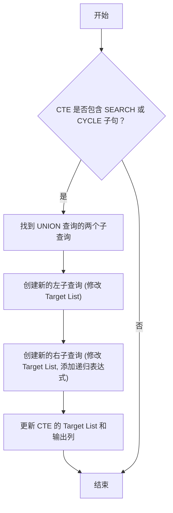
  
**DBA 用例：**  
  
DBA 可以使用 `SEARCH` 子句来分析数据库中的依赖关系，例如表之间的外键关系。通过递归 CTE 和 `SEARCH` 子句，DBA 可以找到某个表的所有依赖表，并按照依赖的深度进行排序。  
  
```sql  
WITH RECURSIVE table_dependencies (table_name, dependent_table, depth) AS (  
    SELECT  
        tc.table_name,  
        kcu.table_name AS dependent_table,  
        0 AS depth  
    FROM  
        information_schema.table_constraints AS tc  
    JOIN  
        information_schema.key_column_usage AS kcu  
            ON tc.constraint_name = kcu.constraint_name  
            AND tc.table_schema = kcu.table_schema  
    WHERE  
        tc.constraint_type = 'FOREIGN KEY'  
        AND tc.table_name = 'your_table'  -- 替换为你要分析的表名  
  
    UNION ALL  
  
    SELECT  
        td.dependent_table,  
        kcu.table_name,  
        td.depth + 1  
    FROM  
        table_dependencies AS td  
    JOIN  
        information_schema.table_constraints AS tc  
            ON td.dependent_table = tc.table_name  
    JOIN  
        information_schema.key_column_usage AS kcu  
            ON tc.constraint_name = kcu.constraint_name  
            AND tc.table_schema = kcu.table_schema  
    WHERE  
        tc.constraint_type = 'FOREIGN KEY'  
        AND kcu.table_name <> 'your_table'  
)  
SEARCH DEPTH FIRST BY table_name  
SELECT table_name, dependent_table, depth  
FROM table_dependencies;  
```  
  
**总结**  
  
`rewriteSearchCycle.c` 是 PostgreSQL 中一个重要的文件，它负责重写包含 `SEARCH` 和 `CYCLE` 子句的 CTE。通过理解这段代码，你可以更好地理解 PostgreSQL 如何处理递归查询，并利用这些功能来解决实际的数据库管理问题。  
  
希望这个详细的解读对你有所帮助！  如果你有任何其他问题，请随时提出。  
  
## 精读rewriteSupport.c文件  
好的，我们跳过 `rewrite` 模块的概览，直接深入 `rewriteSupport.c` 代码的详细解读，并结合 DBA 可感知的用例来加深理解。  
  
**代码片段分析与 Mermaid 图表**  
  
我们逐个分析你提供的代码片段，并用 Mermaid 图表来可视化其逻辑。  
  
**1. `Is there a rule by the given name?` (函数声明，未提供具体实现)**  
  
这段注释表明存在一个函数，用于检查是否存在指定名称的规则。  由于没有提供具体实现，我们只能推测其功能。  
  
*   **DBA 用例:**  DBA 可能需要检查是否存在某个特定的重写规则，例如在删除或修改规则之前。  
  
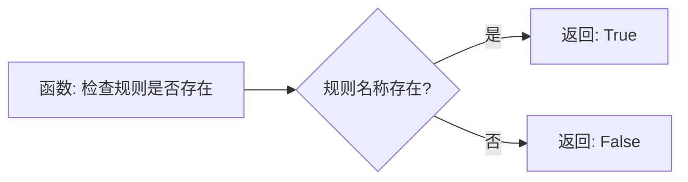
  
**2. `SetRelationRuleStatus` 函数**  
  
```c  
/*  
 * SetRelationRuleStatus  
 *		Set the value of the relation's relhasrules field in pg_class.  
 * NOTE: caller must be holding an appropriate lock on the relation.  
 * NOTE: an important side-effect of this operation is that an SI invalidation  
 * message is sent out to all backends --- including me --- causing relcache  
 * entries to be flushed or updated with the new set of rules for the table.  
 * This must happen even if we find that no change is needed in the pg_class  
 * row.  
 */  
	/*  
	 * Find the tuple to update in pg_class, using syscache for the lookup.  
	 */  
		/* Do the update */  
		/* no need to change tuple, but force relcache rebuild anyway */  
```  
  
这个函数用于设置 `pg_class` 系统表中 `relhasrules` 字段的值。`relhasrules` 字段指示一个表是否具有重写规则。  
  
*   **重要提示:**  
    *   调用者必须持有对关系的适当锁。  
    *   该操作会发送 SI (System Invalidation) 消息，导致所有后端（包括当前后端）刷新或更新 relcache 条目。即使不需要更改 `pg_class` 行，也必须发生这种情况。  
  
*   **DBA 用例:**  当创建、删除或修改表的重写规则时，需要调用此函数。  例如，创建一个新的 `INSERT` 重写规则后，需要设置 `relhasrules` 为 `true`。  
  
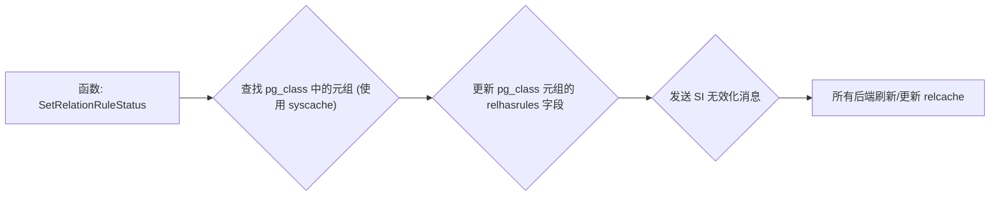
  
**代码片段解释:**  
  
*   `Find the tuple to update in pg_class, using syscache for the lookup.`：这表明函数使用系统缓存（`syscache`）来查找 `pg_class` 系统表中的对应元组。使用缓存可以提高查找效率。  
*   `Do the update`：实际执行更新操作。  
*   `no need to change tuple, but force relcache rebuild anyway`：即使 `relhasrules` 的值没有改变（例如，之前已经设置为 `true`），仍然需要强制重建 relcache。这是因为 relcache 可能包含过时的信息，需要确保所有后端都使用最新的规则信息。  
  
**3. `Find rule oid` 函数**  
  
```c  
/*  
 * Find rule oid.  
 * If missing_ok is false, throw an error if rule name not found.  If  
 * true, just return InvalidOid.  
 */  
	/* Find the rule's pg_rewrite tuple, get its OID */  
```  
  
这个函数用于查找指定名称的重写规则的 OID (Object Identifier)。  
  
*   `missing_ok` 参数控制了当找不到规则时函数的行为。如果 `missing_ok` 为 `false`，则抛出一个错误；如果为 `true`，则返回 `InvalidOid`。  
  
*   **DBA 用例:**  DBA 可能需要查找规则的 OID，以便在删除或修改规则时使用。  例如，`DROP RULE my_rule ON my_table;`  内部实现就需要先找到 `my_rule` 的 OID。  
  
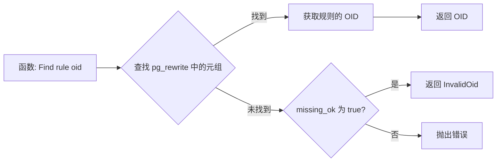
  
**代码片段解释:**  
  
*   `Find the rule's pg_rewrite tuple, get its OID`：函数在 `pg_rewrite` 系统表中查找与给定名称匹配的规则元组，并提取其 OID。  
  
**总结**  
  
`rewriteSupport.c` 文件包含了一些辅助函数，用于支持重写规则的管理。这些函数主要负责：  
  
*   检查规则是否存在。  
*   更新表的 `relhasrules` 状态。  
*   查找规则的 OID。  
  
这些函数是重写规则功能的核心组成部分，确保了规则的正确创建、删除和应用。通过理解这些函数的行为，DBA 可以更好地管理数据库中的重写规则，优化查询性能，并实现更复杂的数据库逻辑。  
  
希望这个详细的解读和 Mermaid 图表能够帮助你更好地理解 `rewriteSupport.c` 中的代码。 如果你有任何其他问题，请随时提出。  
  
## 精读rowsecurity.c文件  
### 代码解读与用例分析

#### 1. **Row-Level Security (RLS) 概述**
Row-Level Security (RLS) 是 PostgreSQL 中的一种机制，用于限制用户对表中记录的访问和修改。RLS 通过定义策略（Policies）来实现，这些策略可以针对特定角色、特定命令或由扩展提供。RLS 的核心思想是在查询重写阶段，将策略条件附加到查询的 `securityQuals` 或 `WithCheckOptions` 中，从而在查询执行时自动应用这些策略。

#### 2. **代码结构与功能**
`rowsecurity.c` 文件主要负责处理 RLS 相关的逻辑，包括获取策略、应用策略、以及处理不同命令类型（如 SELECT、UPDATE、DELETE 等）的策略。

##### 2.1 **`get_row_security_policies()` 函数**
该函数用于获取应用于指定 RTE（Range Table Entry）的行安全策略。它根据命令类型和角色来决定应用哪些策略，并将这些策略添加到 `securityQuals` 或 `WithCheckOptions` 中。

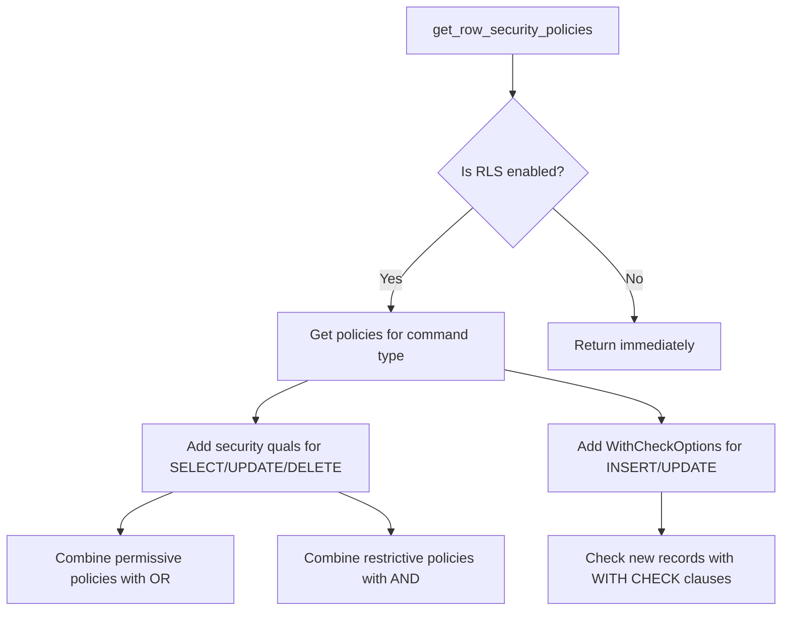

**用例：**
假设有一个表 `employees`，其中定义了以下 RLS 策略：
- **SELECT 策略**：只能查看自己部门的员工记录。
- **UPDATE 策略**：只能更新自己部门的员工记录。

当用户执行 `SELECT * FROM employees;` 时，`get_row_security_policies()` 会获取并应用 SELECT 策略，自动在查询中添加 `WHERE department_id = current_user_department_id` 条件。

##### 2.2 **`add_security_quals()` 函数**
该函数用于将行安全策略的 `USING` 子句添加到 `securityQuals` 中，以限制对现有记录的访问。如果没有策略允许访问，则添加一个默认的 `false` 条件，拒绝所有访问。

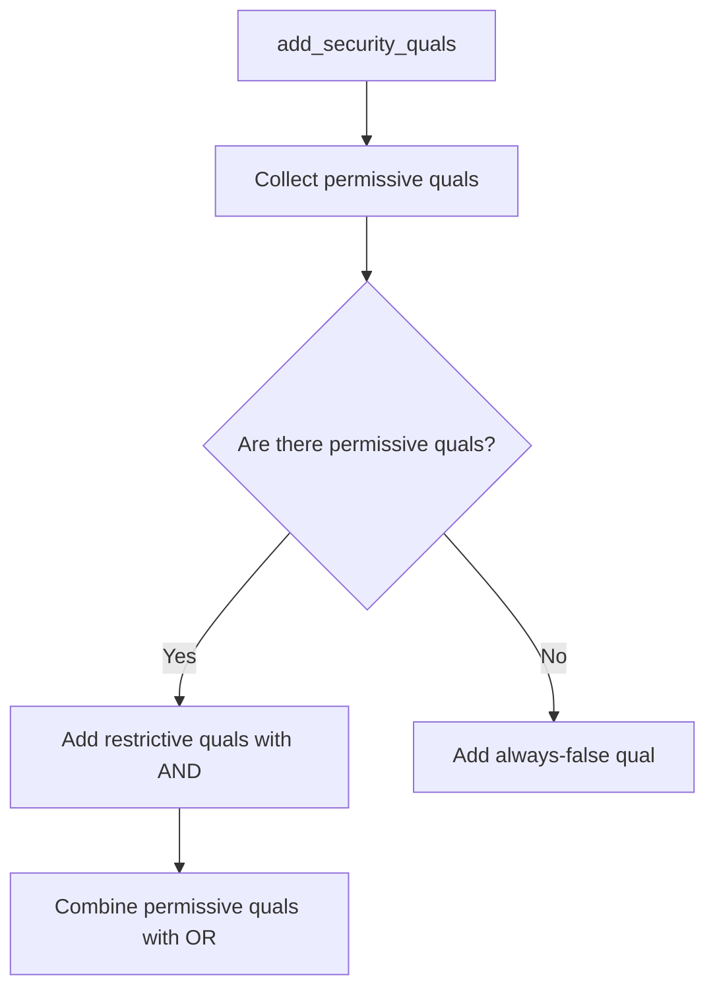

**用例：**
继续上面的 `employees` 表，如果用户尝试执行 `UPDATE employees SET salary = salary + 1000;`，`add_security_quals()` 会添加 `WHERE department_id = current_user_department_id` 条件，确保用户只能更新自己部门的员工记录。

##### 2.3 **`add_with_check_options()` 函数**
该函数用于将行安全策略的 `WITH CHECK` 子句添加到 `WithCheckOptions` 中，以验证新记录是否符合策略。如果没有策略允许插入或更新，则添加一个默认的 `false` 条件，拒绝所有操作。

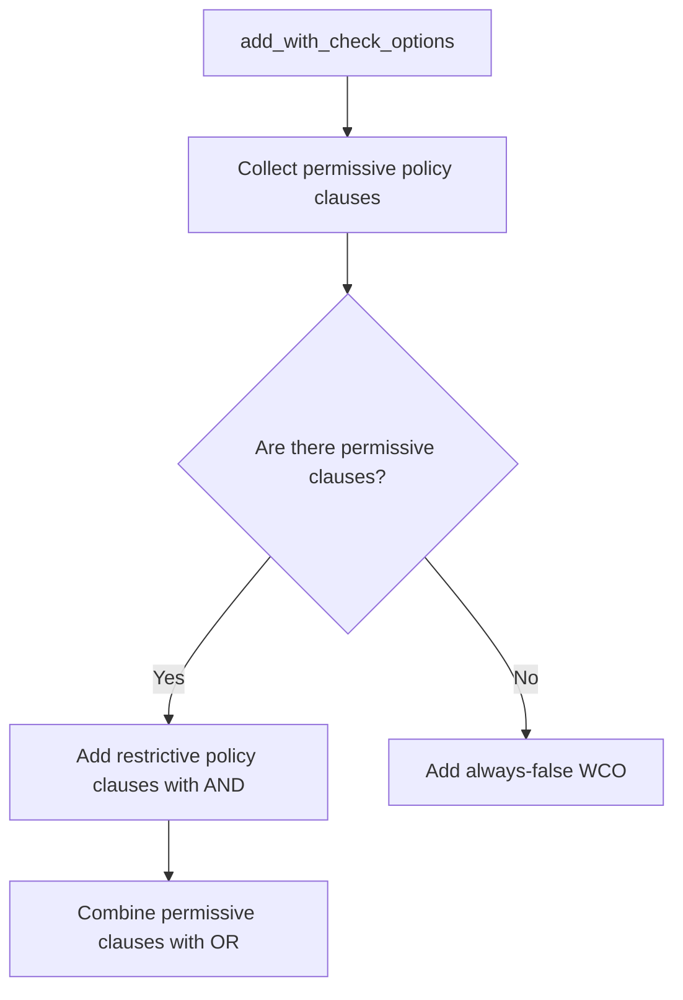

**用例：**
如果用户尝试执行 `INSERT INTO employees (id, name, department_id) VALUES (1, 'Alice', 2);`，`add_with_check_options()` 会检查 `department_id` 是否等于 `current_user_department_id`，如果不符合，则拒绝插入。

#### 3. **RLS 策略的应用场景**
##### 3.1 **SELECT 查询**
- **策略**：限制用户只能查看自己部门的记录。
- **SQL**：`SELECT * FROM employees;`
- **应用**：自动添加 `WHERE department_id = current_user_department_id`。

##### 3.2 **UPDATE 查询**
- **策略**：限制用户只能更新自己部门的记录。
- **SQL**：`UPDATE employees SET salary = salary + 1000;`
- **应用**：自动添加 `WHERE department_id = current_user_department_id`。

##### 3.3 **INSERT 查询**
- **策略**：限制用户只能插入自己部门的记录。
- **SQL**：`INSERT INTO employees (id, name, department_id) VALUES (1, 'Alice', 2);`
- **应用**：检查 `department_id` 是否等于 `current_user_department_id`，如果不符合，则拒绝插入。

#### 4. **RLS 策略的扩展**
PostgreSQL 允许通过扩展添加自定义的行安全策略。扩展可以通过 `row_security_policy_hook_permissive` 和 `row_security_policy_hook_restrictive` 钩子来添加策略。

**用例：**
假设有一个扩展 `my_rls_extension`，它添加了一个策略，限制用户只能访问 `salary < 100000` 的记录。当用户执行 `SELECT * FROM employees;` 时，扩展的策略会自动与现有的策略结合，进一步限制查询结果。

#### 5. **RLS 策略的缓存与重规划**
RLS 策略的启用与否可能受到环境变量（如 `row_security` GUC 或当前角色）的影响。因此，PostgreSQL 会标记涉及 RLS 的查询，以便在环境变化时重新规划查询。

**用例：**
如果用户切换角色，导致 RLS 策略发生变化，PostgreSQL 会自动重新规划涉及 RLS 的查询，以确保应用新的策略。

### 总结
`rowsecurity.c` 文件中的代码实现了 PostgreSQL 的行级安全机制，通过策略限制用户对表中记录的访问和修改。通过 `get_row_security_policies()`、`add_security_quals()` 和 `add_with_check_options()` 等函数，PostgreSQL 在查询重写阶段自动应用这些策略，确保数据的安全性和一致性。
  
  
## 提示  
1、模块概览  
````  
我是C语言初学者, 请结合我提供的如下信息向我详细解读这个PolarDB for PostgreSQL version 15 源码目录的代码, 使用mermaid图表提高解释性, 使用数据库用户或DBA可感知的用例加强对代码的理解.        
rewrite介绍:       
```  
Rule and view support     
```   
src/backend/rewrite 这个目录中有如下文件   
```  
rewriteDefine.c  
rewriteHandler.c  
rewriteManip.c  
rewriteRemove.c  
rewriteSearchCycle.c  
rewriteSupport.c  
rowsecurity.c  
```  
请先进行概要讲解, 下面是每个c文件的简单注释(通过这个方法得到: `grep -E "^/\*|^[ ]\*\s+|^[ ]\*/" *.c` ), 后面我要求你提供每个c文件的详细解说时再提供每个c文件的详细注释.  
```  
...  
```  
````  
  
2、c文件精读  
````  
我是C语言初学者, 请结合我提供的如下信息向我详细解读这个PolarDB for PostgreSQL version 15 源码, 使用mermaid图表提高解释性, 使用数据库用户或DBA可感知的用例加强对代码的理解.   
你已经向我解释了这个功能模块的概览, 可跳过概览介绍, 进入下列代码的详细介绍.     
下面是xxx.c代码文件里的注释内容供你参考 (通过这个方法得到: `grep -E "\s+/\*|\s+\*\s+|\s+\*/|^/\*" xxx.c` )   
```  
...  
```  
````  
    
## PolarDB & PostgreSQL 15 差异    
```
git diff -u 50d3d22baba63613d1f1406b2ed460dc9b03c3fc f5e7493819e370d30ac2047c68c21c9fb03ce4a0 -- src/backend/bootstrap/bootstrap.c
```
     
差异分析待补充.  
   
  
    
<b> 以上内容基于DeepSeek及诸多AI生成, 轻微人工调整, 感谢杭州深度求索人工智能等公司. </b>     
  
<b> AI 生成的内容请自行辨别正确性, 当然也多了些许踩坑的乐趣, 毕竟冒险是每个男人的天性.  </b>    
  
  
#### [期望 PostgreSQL|开源PolarDB 增加什么功能?](https://github.com/digoal/blog/issues/76 "269ac3d1c492e938c0191101c7238216")
  
  
#### [PolarDB 开源数据库](https://openpolardb.com/home "57258f76c37864c6e6d23383d05714ea")
  
  
#### [PolarDB 学习图谱](https://www.aliyun.com/database/openpolardb/activity "8642f60e04ed0c814bf9cb9677976bd4")
  
  
#### [PostgreSQL 解决方案集合](../201706/20170601_02.md "40cff096e9ed7122c512b35d8561d9c8")
  
  
#### [德哥 / digoal's Github - 公益是一辈子的事.](https://github.com/digoal/blog/blob/master/README.md "22709685feb7cab07d30f30387f0a9ae")
  
  
#### [About 德哥](https://github.com/digoal/blog/blob/master/me/readme.md "a37735981e7704886ffd590565582dd0")
  
  

  
