## AI辅助 PolarDB内核学习 - 12 optimizer 概览 (优化器的工作原理)    
### 作者          
digoal          
          
### 日期          
2025-03-10          
          
### 标签          
PostgreSQL , PolarDB , DuckDB , AI , 内核 , 学习 , optimizer , 优化器     
          
----          
          
## 背景   
  
参考: src/backend/optimizer/README  
  
## 一、优化器就像旅行规划师  
想象你要从北京到上海，有不同交通方式（高铁/飞机/自驾），不同中转城市（南京/杭州）。优化器的任务就是**找到最快且最省钱的路线**。  
  
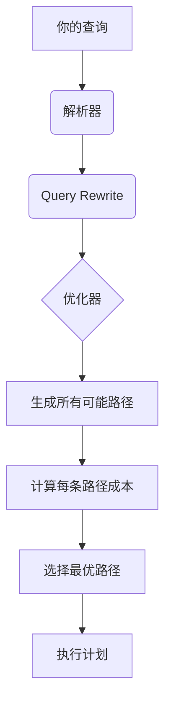
  
### 核心组件详解（配合 Mermaid）  
  
#### 1. 路径（Path）是什么？  
每个表有不同扫描方式，就像不同交通工具：  
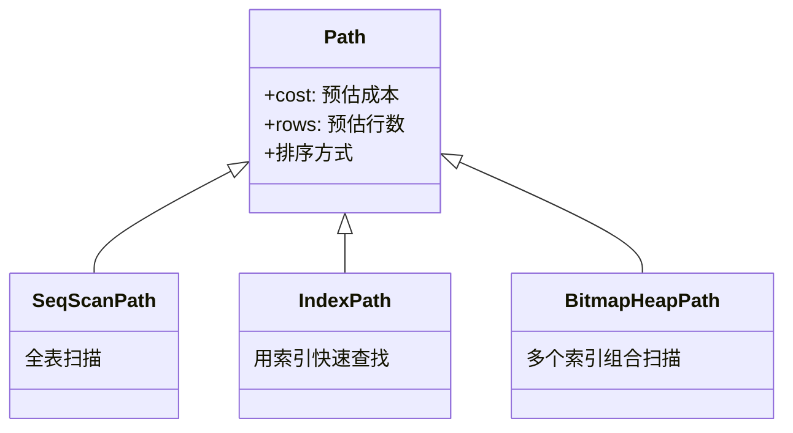
  
#### 2. 连接树构建过程（动态规划）  
假设要连接 4 个表（A,B,C,D），优化器分层处理：  
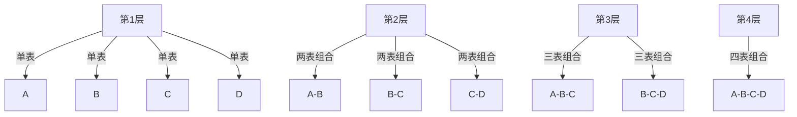
  
每一层保留最优路径，例如：  
• `A-B` 可能用嵌套循环  
• `B-C` 可能用哈希连接  
  
#### 3. 连接方式对比  
```mermaid  
gantt  
    title 连接方式对比  
    dateFormat  X  
    axisFormat %s  
      
    嵌套循环 : crit, 0, 3  
    哈希连接 : active, 0, 2  
    合并连接 : done, 0, 4  
```  
  
| 连接方式 | 适用场景                  | 特点                         |  
|----------|--------------------------|-----------------------------|  
| 嵌套循环 | 小表驱动大表              | 简单但性能差                 |    
| 哈希连接 | 等值连接且数据量大        | 需要内存但速度快             |  
| 合并连接 | 数据已排序                | 无需内存但需要预处理排序     |  
  
---  
  
### 关键过程图解  
  
#### 优化器工作流程  
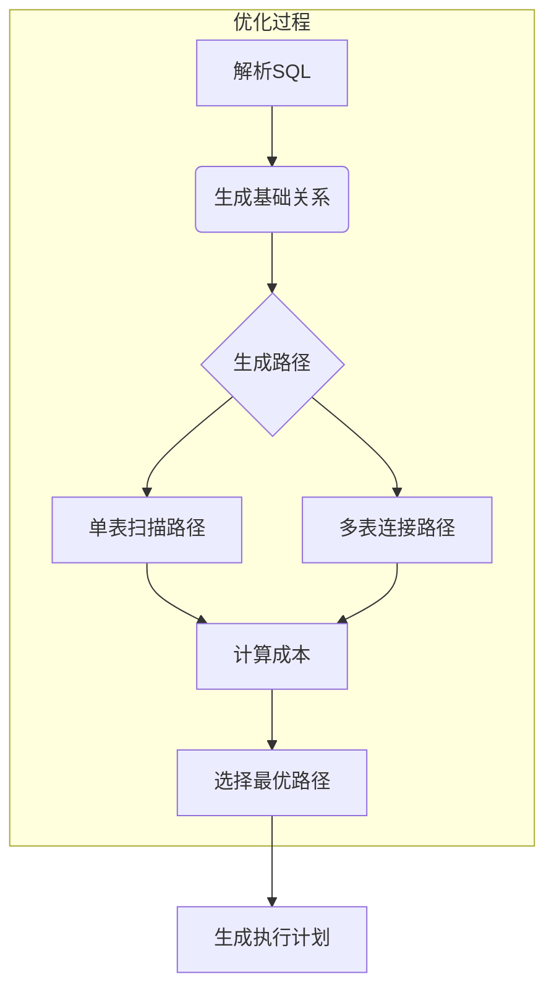
  
#### 动态规划示例（4表连接）  
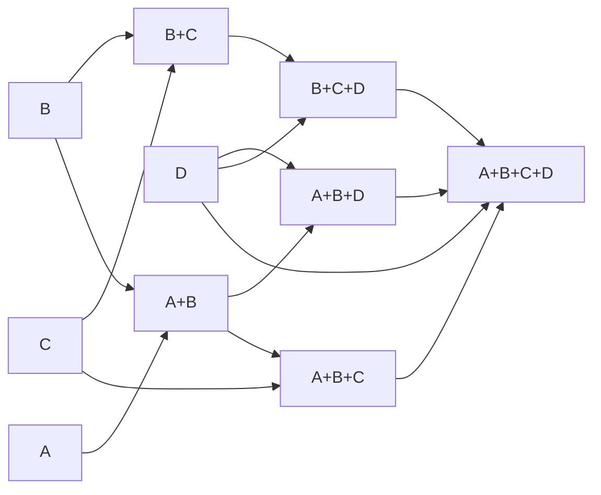
  
每一步都会比较：  
• 路径成本（CPU + I/O 时间）  
• 是否已排序（影响后续连接方式）  
  
### 总结  
PostgreSQL 优化器的核心思想：  
1. **穷举可能性**：生成所有可能的查询路径  
2. **动态规划**：自底向上逐层优化，保留每层最优解  
3. **成本模型**：基于统计信息计算 CPU/I/O 成本  
  
通过这种机制，即使面对复杂的 10 表连接，优化器也能在合理时间内找到较优解。就像用动态规划算法解旅行商问题（TSP）一样！  
  
  
## 二、PostgreSQL 优化器的等价类与参数化路径  
  
#### 1. 等价类（EquivalenceClasses）是什么？  
**比喻**：等价类就像朋友圈，所有成员都互相认识（相等）。例如，A = B，B = C，那么A、B、C在同一个朋友圈里。优化器利用这种关系，**避免重复验证**，还能生成新的连接条件。  
  
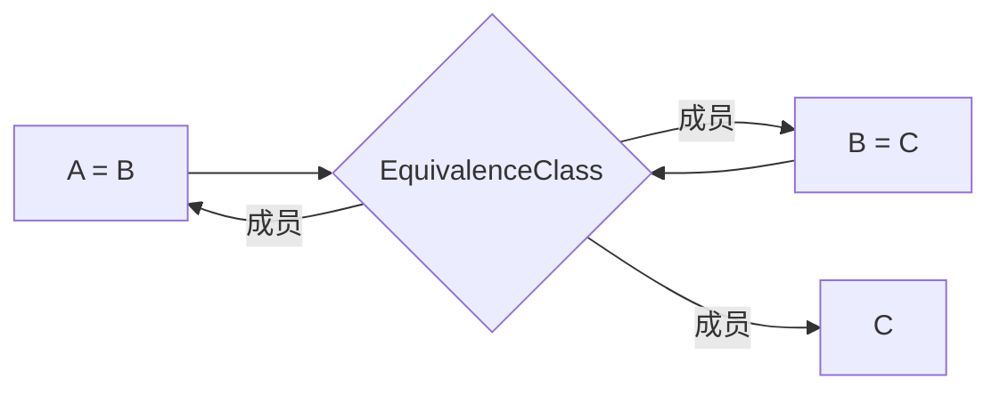
  
**作用**：  
• **减少条件判断**：只需验证一次等价性（如A = C），无需检查所有组合。  
• **优化连接顺序**：即使查询中未显式指定，也能生成新的连接路径（如A和C直接连接）。  
  
#### 2. 路径键（PathKeys）的作用  
**比喻**：路径键像快递单号，标记包裹的**排序规则**。优化器通过它判断数据是否按需排序，避免额外排序操作。  
  
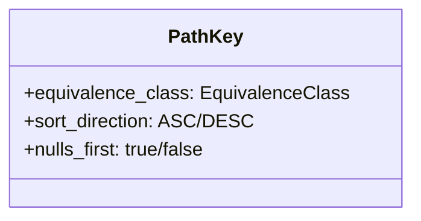
  
**示例**：  
• 索引扫描返回按`id`排序的数据，生成路径键`{id ASC}`。  
• 合并连接要求两侧输入按相同顺序排序，路径键匹配则无需额外排序。  
  
  
#### 3. 参数化路径（Parameterized Paths）  
**比喻**：参数化路径像外卖小哥，根据用户地址（参数）快速定位目标，避免挨家挨户敲门。  
  
**原理**：  
• **嵌套循环连接**中，外层表的列值作为参数传递给内层表的索引扫描。  
• **大幅减少扫描量**：内层表利用参数直接定位数据，无需全表扫描。  
  

  
**示例**：  
```sql  
SELECT * FROM small_table A  
JOIN large_table B ON A.x = B.y;  
```  
• 优化器可能选择：外层扫描`A`，内层用`B.y`索引扫描，参数为`A.x`。  
  
#### 4. LATERAL子查询的优化  
**比喻**：LATERAL像实时翻译，子查询可以随时引用外层表的字段，生成动态参数。  
  
**特点**：  
• 子查询可引用外层表的列，生成参数化路径。  
• 优化器将引用关系转化为参数传递，利用索引加速。  
  
**示例**：  
```sql  
SELECT * FROM users u  
JOIN LATERAL (  
    SELECT * FROM orders o  
    WHERE o.user_id = u.id  
    ORDER BY o.date DESC LIMIT 3  
) ON true;  
```  
• 对每个用户`u`，子查询动态获取最近的3个订单，利用`user_id`索引快速定位。  
  
  
#### 5. 参数化路径与动态规划的协作  
**优化器如何选择路径？**  
1. **生成候选路径**：包括普通扫描和参数化路径。  
2. **动态规划分层处理**：从单表到多表，保留每层最优路径。  
3. **成本估算**：考虑参数化路径的行数、索引效率，选择总成本最低的方案。  
  
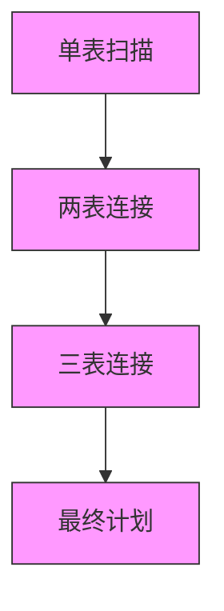
  
**关键决策点**：  
• **参数化路径的行数**：行数少时，嵌套循环更优；行数多时，哈希/合并连接更佳。  
• **索引选择**：优先选择参数化索引扫描，减少I/O。  
  
  
#### 6. 等价类与路径键的实际应用  
**案例**：  
```sql  
SELECT * FROM a, b, c  
WHERE a.x = b.y AND b.y = c.z;  
```  
• **等价类**：`{a.x, b.y, c.z}`。  
• **路径键生成**：若索引扫描按`a.x`排序，路径键为`{a.x ASC}`，等价类成员`b.y`和`c.z`的排序自动继承。  
• **连接优化**：即使查询未指定`a.x = c.z`，优化器可生成此条件，直接连接A和C。  
  
  
### 总结  
• **等价类**：简化条件验证，生成隐含连接条件。  
• **路径键**：标记数据排序规则，避免多余排序。  
• **参数化路径**：利用外层参数优化内层扫描，适合小表驱动大表。  
• **LATERAL子查询**：动态参数传递，结合索引提升效率。  
  
通过组合这些机制，PostgreSQL优化器在复杂查询中灵活选择最优路径，兼顾性能和资源消耗。  
  
  
## 三、PostgreSQL 优化器的高级功能  
  
#### **1. 安全级别约束：保护敏感数据**  
**问题背景**：当使用行级安全（RLS）或安全屏障视图时，需要确保过滤敏感数据的条件（如权限检查）**优先执行**，避免其他条件泄露信息。  
  
**实现原理**：  
• **安全级别（security_level）**：每个条件子句有一个安全等级，数字越小优先级越高。  
• **Leakproof 函数**：被标记为“不泄露数据”的函数，可以提前执行，无需受安全级别限制。  
  
**示例**：  
```sql  
-- 安全屏障视图中的条件（安全级别0）  
CREATE VIEW secure_view AS  
SELECT * FROM users WHERE role = 'user' WITH CHECK OPTION;  
  
-- 用户查询（普通条件，安全级别1）  
SELECT * FROM secure_view WHERE leaky_function(email) = 'xxx';  
```  
优化器会**优先执行** `role = 'user'`，再执行 `leaky_function(email)`，防止未过滤的数据被泄露。  
  
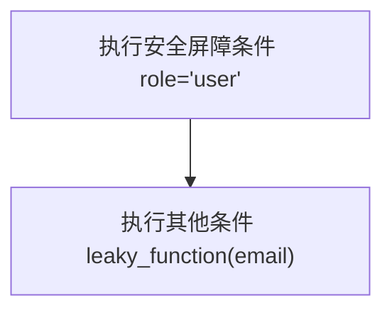
  
#### **2. 后扫描/连接规划：处理复杂查询**  
**任务**：处理 `GROUP BY`、聚合、窗口函数等高层操作。  
  
**关键结构**：  
• **UPPERREL_GROUP_AGG**：处理分组和聚合。  
• **UPPERREL_WINDOW**：处理窗口函数。  
• **UPPERREL_ORDERED**：处理排序。  
  
**示例**：  
```sql  
SELECT department, AVG(salary)   
FROM employees   
GROUP BY department   
ORDER BY AVG(salary) DESC;  
```  
优化器会：  
1. 生成分组路径（如哈希聚合或排序+分组）。  
2. 计算平均工资。  
3. 按平均值排序。  
  

  
#### **3. 并行查询：加速大数据处理**  
**核心思想**：将数据分块，多个工作进程并行处理。  
  
**关键组件**：  
• **Gather节点**：协调多个工作进程，合并结果。  
• **Partial Paths（部分路径）**：每个工作进程处理部分数据的路径。  
  
**示例**：  
```sql  
SELECT * FROM large_table WHERE status = 'active';  
```  
优化器可能选择：  
• **并行顺序扫描**：每个进程扫描不同的数据块。  
• **Gather合并结果**：主进程收集所有结果。  
  
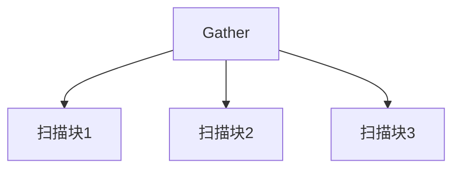
  
#### **4. 分区连接：高效处理分区表**  
**适用场景**：两个分区表按相同键分区，且连接条件使用分区键。  
  
**优化效果**：将大表连接分解为多个小分区对连接。  
  
**示例**：  
```sql  
-- orders 和 order_items 均按 order_id 分区  
SELECT *   
FROM orders   
JOIN order_items   
  ON orders.order_id = order_items.order_id;  
```  
优化器将连接分解为：  
• 分区1：`orders_p1` JOIN `order_items_p1`  
• 分区2：`orders_p2` JOIN `order_items_p2`  
  
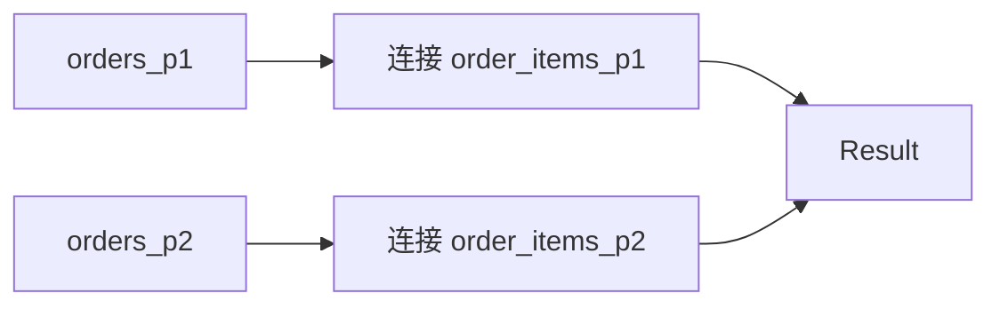
  
  
#### **5. 分区聚合：提升聚合效率**  
**适用场景**：当 `GROUP BY` 包含所有分区键时，每个分区独立聚合。  
  
**示例**：  
```sql  
-- sales 表按 region 分区  
SELECT region, SUM(revenue)   
FROM sales   
GROUP BY region;  
```  
优化器会在每个分区计算 `SUM(revenue)`，再合并结果。  
  
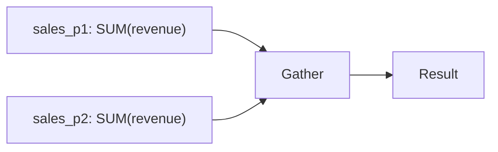
  
  
### 总结  
| **功能**         | **核心思想**                          | **优化效果**                     |  
|-------------------|--------------------------------------|---------------------------------|  
| 安全级别约束       | 敏感数据条件优先执行                  | 防止数据泄露                     |  
| 后扫描/连接规划    | 分阶段处理复杂操作（聚合、排序）       | 避免冗余计算，选择最优路径         |  
| 并行查询           | 数据分块并行处理                      | 大幅缩短大数据查询时间            |  
| 分区连接           | 将大表连接分解为小分区对连接          | 减少数据扫描量，提升连接效率       |  
| 分区聚合           | 每个分区独立聚合                      | 降低计算复杂度，加速聚合操作       |  
  
通过组合这些机制，PostgreSQL 优化器在复杂场景下依然能高效生成执行计划，兼顾性能与安全性。  
  
<b> 以上内容基于DeepSeek及诸多AI生成, 轻微人工调整, 感谢杭州深度求索人工智能等公司. </b>     
  
<b> AI 生成的内容请自行辨别正确性, 当然也多了些许踩坑的乐趣, 毕竟冒险是每个男人的天性.  </b>    
    
  
  
#### [期望 PostgreSQL|开源PolarDB 增加什么功能?](https://github.com/digoal/blog/issues/76 "269ac3d1c492e938c0191101c7238216")
  
  
#### [PolarDB 开源数据库](https://openpolardb.com/home "57258f76c37864c6e6d23383d05714ea")
  
  
#### [PolarDB 学习图谱](https://www.aliyun.com/database/openpolardb/activity "8642f60e04ed0c814bf9cb9677976bd4")
  
  
#### [PostgreSQL 解决方案集合](../201706/20170601_02.md "40cff096e9ed7122c512b35d8561d9c8")
  
  
#### [德哥 / digoal's Github - 公益是一辈子的事.](https://github.com/digoal/blog/blob/master/README.md "22709685feb7cab07d30f30387f0a9ae")
  
  
#### [About 德哥](https://github.com/digoal/blog/blob/master/me/readme.md "a37735981e7704886ffd590565582dd0")
  
  

  
