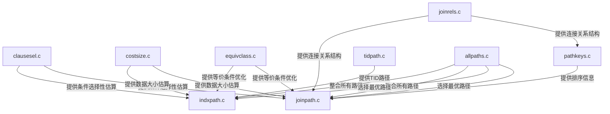

## AI辅助 PolarDB内核学习 - 13 path (路径生成)代码概览  
### 作者  
digoal  
  
### 日期  
2025-03-14  
  
### 标签  
PostgreSQL , PolarDB , DuckDB , AI , 内核 , 学习 , path , 路径生成  
  
----  
  
## 背景  
  
## 解读path (路径生成)代码概览  
  
以下是 PostgreSQL 15 源码目录 `src/backend/optimizer/path` 中各个文件的通俗解释，以及它们之间的协作关系图示：  
  
### **1. `allpaths.c`**  
**作用**：  
这是路径生成的“总控中心”。它负责收集所有可能的查询执行路径（如扫描路径、连接路径等），并从中选择成本最低的路径作为最终执行计划。  
**通俗比喻**：  
就像一个项目经理，协调所有团队（其他文件）生成的路径方案，最终选出最优方案。  
  
### **2. `clausesel.c`**  
**作用**：  
评估查询条件（如 `WHERE` 子句）的选择性（selectivity）。  
- 计算某个条件过滤后能保留多少行数据（例如，`WHERE age > 30` 能过滤掉多少数据）。  
- 这些估算结果直接影响后续路径的成本计算。  
**通俗比喻**：  
像一个“过滤器效率评估师”，判断每个条件能过滤掉多少数据。  
  
### **3. `costsize.c`**  
**作用**：  
计算表或索引的大小（如行数、页数等），并估算扫描这些数据结构的成本。  
- 例如，全表扫描的成本取决于表的大小。  
**通俗比喻**：  
像一个“数据大小计算器”，告诉优化器“这个表有多大，扫描它需要多少时间”。  
  
### **4. `equivclass.c`**  
**作用**：  
处理等价类（equivalence classes），将多个等价的表达式合并，以优化查询条件。  
- 例如，将 `a = b` 和 `b = c` 合并为 `a = b = c`，从而简化条件或启用更优的索引。  
**通俗比喻**：  
像一个“条件合并专家”，把多个条件合并成更高效的等价表达式。  
  
### **5. `indxpath.c`**  
**作用**：  
生成基于索引的扫描路径（如索引扫描、位图索引扫描）。  
- 当查询条件可以利用索引时，生成对应的路径并计算其成本。  
**通俗比喻**：  
像一个“索引使用顾问”，决定是否使用索引以及如何高效使用。  
  
### **6. `joinpath.c`**  
**作用**：  
生成表之间的连接路径（如嵌套循环连接、哈希连接、合并连接等）。  
- 决定连接顺序（如先连接表A和B，还是先连接B和C）。  
**通俗比喻**：  
像一个“连接策略设计师”，设计不同表之间的连接方式。  
  
### **7. `joinrels.c`**  
**作用**：  
管理连接关系（join relations）的结构，例如：  
- 生成连接后的虚拟关系（如连接表A和B后的临时结果集）。  
- 处理连接条件的优化（如将连接条件与过滤条件合并）。  
**通俗比喻**：  
像一个“连接关系构建师”，负责连接后的数据结构和条件优化。  
  
### **8. `pathkeys.c`**  
**作用**：  
管理路径键（pathkeys），用于确保数据按特定顺序处理（如排序或合并连接(merge join)）。  
- 例如，合并连接需要两个输入数据按相同键排序。  
**通俗比喻**：  
像一个“数据排序协调员”，确保数据按正确顺序传递。  
  
### **9. `tidpath.c`**  
**作用**：  
生成基于元组ID（TID）的扫描路径。  
- 例如，当通过索引获取元组ID后，直接通过TID快速访问堆中的具体元组。  
**通俗比喻**：  
像一个“快速定位器”，通过元组ID直接跳转到数据存储位置。  
  
### **协作关系图示（Mermaid）**  

  
### **流程说明**：  
1. **基础数据准备**：  
   - `clausesel.c` 和 `costsize.c` 提供条件选择性和数据大小的估算，作为成本计算的基础。  
   - `equivclass.c` 优化条件表达式，可能简化后续路径生成。  
  
2. **路径生成**：  
   - `indxpath.c` 生成索引扫描路径。  
   - `joinpath.c` 生成连接路径，并依赖 `joinrels.c` 的连接关系结构和 `pathkeys.c` 的排序信息。  
   - `tidpath.c` 生成基于TID的快速路径。  
  
3. **路径整合与选择**：  
   - `allpaths.c` 收集所有路径，综合成本估算后选择最优路径作为最终执行计划。  
  
通过这些模块的协作，PostgreSQL 能够生成高效且合理的查询执行计划。  
  
  
## 提示  
````  
请通俗易懂的逐一介绍PostgreSQL 15 源码目录src/backend/optimizer/path中这些文件的作用, 可以使用mermaid图示.  
```  
allpaths.c  
clausesel.c  
costsize.c  
equivclass.c  
indxpath.c  
joinpath.c  
joinrels.c  
pathkeys.c  
tidpath.c  
```  
````  
  
<b> 以上内容基于DeepSeek、QwQ及诸多AI生成, 轻微人工调整, 感谢杭州深度求索人工智能、阿里云等公司. </b>  
  
<b> AI 生成的内容请自行辨别正确性, 当然也多了些许踩坑的乐趣, 毕竟冒险是每个男人的天性.  </b>  
  
  
  
#### [期望 PostgreSQL|开源PolarDB 增加什么功能?](https://github.com/digoal/blog/issues/76 "269ac3d1c492e938c0191101c7238216")
  
  
#### [PolarDB 开源数据库](https://openpolardb.com/home "57258f76c37864c6e6d23383d05714ea")
  
  
#### [PolarDB 学习图谱](https://www.aliyun.com/database/openpolardb/activity "8642f60e04ed0c814bf9cb9677976bd4")
  
  
#### [PostgreSQL 解决方案集合](../201706/20170601_02.md "40cff096e9ed7122c512b35d8561d9c8")
  
  
#### [德哥 / digoal's Github - 公益是一辈子的事.](https://github.com/digoal/blog/blob/master/README.md "22709685feb7cab07d30f30387f0a9ae")
  
  
#### [About 德哥](https://github.com/digoal/blog/blob/master/me/readme.md "a37735981e7704886ffd590565582dd0")
  
  

  
