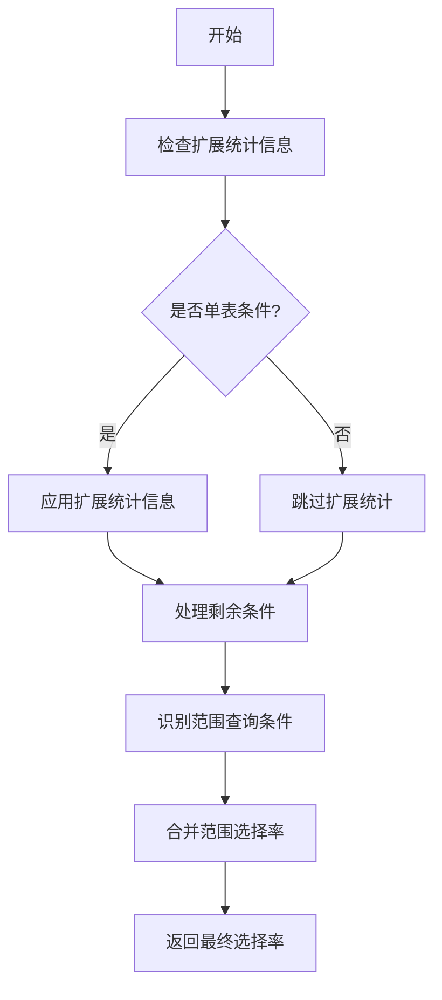

## AI辅助 PolarDB内核学习 - 14 path(路径生成) 之 选择性(clausesel.c)代码  
### 作者    
digoal    
    
### 日期    
2025-03-14    
    
### 标签    
PostgreSQL , PolarDB , DuckDB , AI , 内核 , 学习 , path , 路径生成 , 选择性估算     
    
----    
    
## 背景    
    
## 解读path(路径生成)之选择性(clausesel.c)代码  
    
以下是针对 PolarDB for PostgreSQL 15 中 `clausesel.c` 的详细解释，结合数据库优化器的核心逻辑和实际用例，并使用 Mermaid 图表辅助理解：  
  
### 1. **核心功能：选择率（Selectivity）计算**  
`clausesel.c` 的核心是 **计算查询条件过滤数据的能力**（即选择率），直接影响优化器选择索引、连接顺序和执行计划。  
  
#### 关键函数：  
- **`clauselist_selectivity`**    
  计算由 `AND` 连接的条件列表的选择率。例如：  
  ```sql  
  SELECT * FROM users WHERE age > 30 AND city = 'Beijing';  
  ```  
  - **范围查询优化**：自动识别类似 `x > 5 AND x < 10` 的条件，合并为更精确的范围选择率（避免简单相乘导致的低估）。  
  - **扩展统计信息**：利用多列统计信息（如相关列的联合分布）提高复杂条件的估计准确性。  
  
- **`clauselist_selectivity_or`**    
  计算由 `OR` 连接的条件列表的选择率。例如：  
  ```sql  
  SELECT * FROM orders WHERE status = 'pending' OR priority = 'high';  
  ```  
  - 使用公式 `s1 + s2 - s1*s2` 估算重叠行的概率。  
  
### 2. **代码流程与 Mermaid 图表**  
#### 流程图：`clauselist_selectivity` 的处理逻辑  

  
#### 关键数据结构：`RangeQueryClause`  
用于管理范围查询的边界条件（如 `x > 5` 和 `x < 10`）：  
```c  
struct RangeQueryClause {  
    Node *var;           // 条件涉及的列（如 x）  
    bool have_lobound;   // 是否有下界（如 x > 5）  
    bool have_hibound;   // 是否有上界（如 x < 10）  
    Selectivity lobound; // 下界选择率  
    Selectivity hibound; // 上界选择率  
};  
```  
  
### 3. **实际用例分析**  
#### 用例 1：范围查询优化  
**查询**：  
```sql  
SELECT * FROM products WHERE price BETWEEN 100 AND 200;  
```  
- **优化逻辑**：  
  1. `clauselist_selectivity` 识别 `price >= 100` 和 `price <= 200` 为范围条件。  
  2. 合并选择率：`hibound`（price <= 200）和 `lobound`（price >= 100）的覆盖范围。  
  3. 最终选择率 = `hibound + lobound - 1`（避免简单相乘导致的低估）。  
  
#### 用例 2：OR 条件的代价估算  
**查询**：  
```sql  
SELECT * FROM employees WHERE department = 'HR' OR salary > 100000;  
```  
- **优化逻辑**：  
  - 假设 `department = 'HR'` 的选择率是 0.2，`salary > 100000` 的选择率是 0.1。  
  - 合并选择率 = `0.2 + 0.1 - (0.2 * 0.1) = 0.28`（避免低估结果行数）。  
  
### 4. **关键代码片段解析**  
#### 范围条件合并：`addRangeClause`  
```c  
static void addRangeClause(RangeQueryClause **rqlist, Node *clause, ...) {  
    // 判断条件是否为范围查询的一部分（如 x > 5 或 x < 10）  
    if (is_lobound) {  
        // 更新下界  
        rinfo->lobound = s2;  
    } else {  
        // 更新上界  
        rinfo->hibound = s2;  
    }  
}  
```  
- **作用**：将单个条件（如 `x > 5`）归类到对应的范围组中，后续合并计算。  
  
#### 选择率计算公式  
```c  
// 合并后的范围选择率  
s2 = hibound + lobound + null_frac - 1;  
```  
- **公式解释**：`hibound` 是小于上界的比例，`lobound` 是大于下界的比例，`null_frac` 是 NULL 值比例。合并后选择率 = 有效范围比例 - NULL 值影响。  
  
### 5. **数据库性能调优启示**  
#### 场景 1：索引选择  
- 如果 `clauselist_selectivity` 低估了 `WHERE name LIKE 'A%'` 的选择率，优化器可能放弃使用索引。  
- **解决方法**：通过 `ANALYZE` 更新统计信息，或手动调整 `default_statistics_target`。  
  
#### 场景 2：多列统计信息  
- 对于 `WHERE a = 1 AND b = 2`，如果列 `a` 和 `b` 高度相关，但未创建扩展统计信息，选择率可能被高估。  
- **解决方法**：  
  ```sql  
  CREATE STATISTICS stats_a_b ON (a, b) FROM table_name;  
  ANALYZE table_name;  
  ```  
  
### 6. **总结**  
- **核心逻辑**：通过 `clauselist_selectivity` 计算条件的选择率，优化器生成高效执行计划。  
- **关键优化**：范围查询合并、OR 条件处理、扩展统计信息支持。  
- **DBA 关注点**：定期 `ANALYZE` 表，创建多列统计信息，避免选择率误估导致的性能问题。  
  
如需进一步分析特定代码片段或性能问题，请提供更多上下文！  
  
## 提示    
c文件精读    
````    
我是C语言初学者, 请结合我提供的如下信息向我详细解读这个PolarDB for PostgreSQL version 15 源码, 使用mermaid图表提高解释性, 使用数据库用户或DBA可感知的用例加强对代码的理解.     
你已经向我解释了这个功能模块的概览, 可跳过概览介绍, 进入下列代码的详细介绍.       
下面是xxx.c代码文件里的注释内容供你参考 (通过这个方法得到: `grep -E "\s+/\*|\s+\*\s+|\s+\*/|^/\*" xxx.c` )     
```    
...    
```    
````    
      
## PolarDB & PostgreSQL 15 差异      
```  
git diff -u 50d3d22baba63613d1f1406b2ed460dc9b03c3fc f5e7493819e370d30ac2047c68c21c9fb03ce4a0 -- src/backend/bootstrap/clausesel.c  
```  
       
差异分析待补充.    
    
<b> 以上内容基于DeepSeek、QwQ及诸多AI生成, 轻微人工调整, 感谢杭州深度求索人工智能、阿里云等公司. </b>    
    
<b> AI 生成的内容请自行辨别正确性, 当然也多了些许踩坑的乐趣, 毕竟冒险是每个男人的天性.  </b>    
    
    
  
#### [期望 PostgreSQL|开源PolarDB 增加什么功能?](https://github.com/digoal/blog/issues/76 "269ac3d1c492e938c0191101c7238216")
  
  
#### [PolarDB 开源数据库](https://openpolardb.com/home "57258f76c37864c6e6d23383d05714ea")
  
  
#### [PolarDB 学习图谱](https://www.aliyun.com/database/openpolardb/activity "8642f60e04ed0c814bf9cb9677976bd4")
  
  
#### [PostgreSQL 解决方案集合](../201706/20170601_02.md "40cff096e9ed7122c512b35d8561d9c8")
  
  
#### [德哥 / digoal's Github - 公益是一辈子的事.](https://github.com/digoal/blog/blob/master/README.md "22709685feb7cab07d30f30387f0a9ae")
  
  
#### [About 德哥](https://github.com/digoal/blog/blob/master/me/readme.md "a37735981e7704886ffd590565582dd0")
  
  

  
