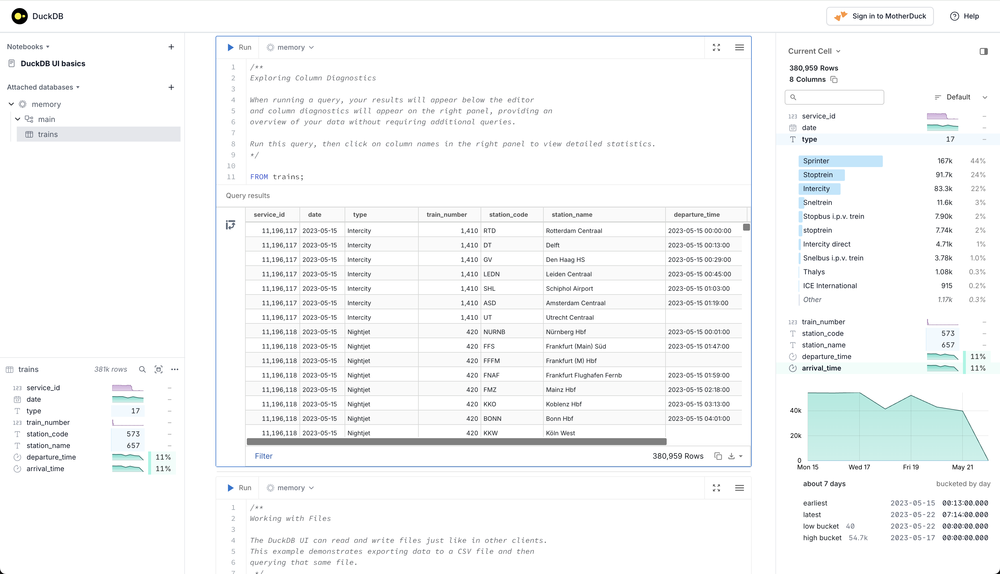
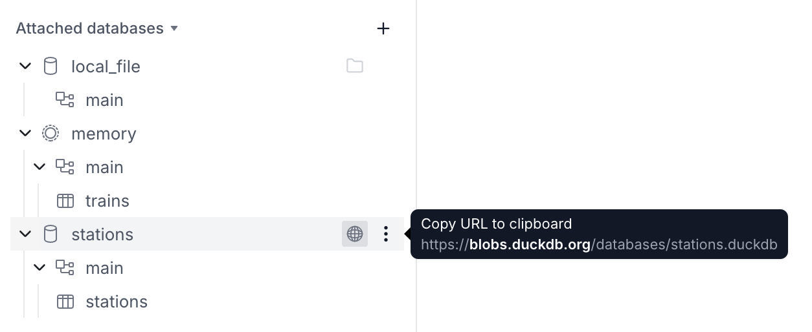
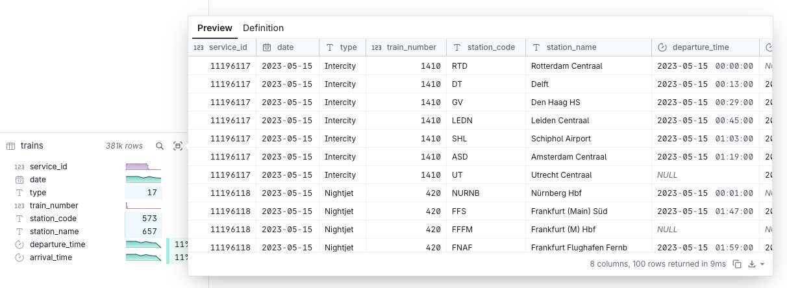
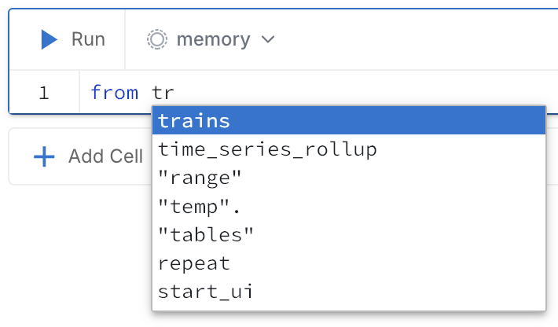
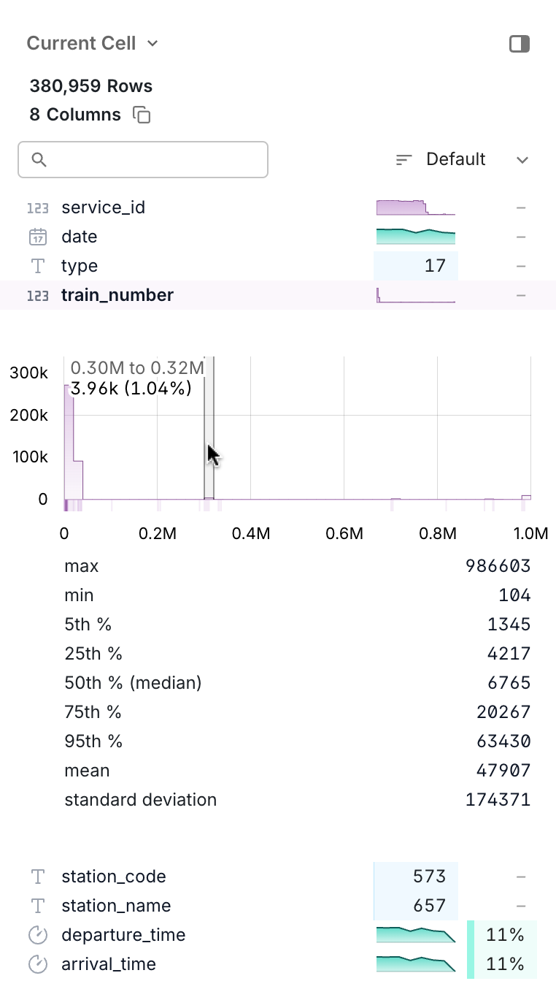

## DuckDB UI 开启乔布斯时刻: An Analyzer, A Brain, A Portal   
                                                                                                                        
### 作者                                                                                            
digoal                                                                                            
                                                                                                   
### 日期                                                                                                 
2025-03-17                                                                                          
                                                                                                
### 标签                                                                                              
PostgreSQL , PolarDB , DuckDB , A Phone An iPod A Internet , An Analyzer A Brain A Portal    
                                                                                                                       
----                                                                                                
                                                                                                              
## 背景         
（灯光渐暗，一束追光打在舞台中央。穿着黑色高领衫的演讲者缓缓举起手中的无线遥控器，背后大屏幕亮起DuckDB的极简Logo）  
  
**Steve Jobs式停顿...**  
  
"今天，我们要重新发明数据分析的未来。"  
  
（屏幕突然分裂成三块跃动的数据流）  
  
"有人问我们：你们要做一个更快的数据库吗？"（摇头轻笑）"不——我们要问——为什么不能是优雅的一体机？"   
  
（遥控器轻点，三块屏幕汇聚成彩虹粒子风暴）  
  
"第一个革命...（压低嗓音）**An Analyzer**"  
  
（可视化界面如星轨流转，SQL查询像聊天般自然浮现）  
"传统数据库需要你当司机，而它——（挑眉）会自己踩油门！当你的Python脚本碰到50GB CSV文件，它会默默启动量子压缩引擎，比子弹更快的OLAP，就藏在你的笔记本里。OLAP性能暴增100倍，轻量到能在你的Python脚本里呼吸，像瑞士军刀般嵌入任何平台。这是划时代的嵌入式数据库引擎！"  
  
**突然加快语速：**  
  
"第二个突破...（双手张开）**A Brain**"  
  
（屏幕展示AI自动优化查询计划的脑神经网络图）  
"这不是冰冷的代码编辑器，是会说人类语言的数据画布。输入'给我上周销售异常'，它会自动生成诊断报告——就像问Siri天气一样简单。"  
  
**戏剧性后退两步：**  
  
"但最疯狂的...（深吸气）**A Portal**"  
  
（演示数据从Snowflake实时流向本地Excel，3D图表在AR界面旋转）  
"告别ETL炼狱！这个魔法通道能同时握住云端巨人的手，也能轻抚你手机里的CSV文件。金融模型？基因组数据？它让所有数据在指尖共舞。浏览器即战场，notebook实时渲染十亿级数据集，每个可视化都是空间交互的奇迹！"  
  
（突然静默，走到舞台边缘）  
  
"你们可能觉得我在说未来..."（遥控器按下，DuckDB图标化作漫天飞舞的鸭子投影）"但这就是此时此刻，在M1芯片上就能运行的——（一字一顿）分析次元折叠术。"  
  
**高举遥控器做出经典ending pose：**  
  
"因为在这个时代，（屏幕炸开千万行流光溢彩的SQL）数据不应被工具束缚，而应如呼吸般自由。"  
  
（三块模块旋转融合成金色鸭嘴兽图腾）  
  
"这，不是三个独立工具。"（停顿，环视观众席）"而是三位一体的数据革命！DuckDB把数据库的威力、AI的智慧、交互的美学熔铸成这个（举起透明设备）——能装进你U盘的宇宙级分析平台！"  
  
（全场沸腾，灯光聚焦于命令行界面）  
  
"今天起，忘记臃肿的数据库集群。输入`duckdb -ui`，让数据在你指尖起舞！"（眨眼微笑）"哦对了，它永远免费——但这不该成为你们熬夜coding的理由。"  
  
## `duckdb -ui`  
https://duckdb.org/2025/03/12/duckdb-ui.html  
  
https://github.com/duckdb/duckdb-ui  
  
DuckDB 项目的建立是为了简化利用现代数据库技术。DuckDB 可用于多种流行语言，并可在各种平台上运行。附带的命令行界面 (CLI)提供了一种从终端窗口以交互方式运行 SQL 查询的便捷方式，并且一些第三方工具提供了更复杂的 UI。  
  
DuckDB CLI 提供高级功能，如交互式多行编辑、自动完成和进度指示器。但是，处理冗长的 SQL 查询时会很麻烦，而且其数据探索工具有限。许多可用的第三方 UI 都很棒，但选择、安装和配置一个并不简单。通过 UI 使用 DuckDB 应该和使用 CLI 一样简单。现在就是这样！  
  
从DuckDB v1.2.1开始，功能齐全的本地 Web 用户界面可立即使用！您可以通过使用以下-ui参数启动 DuckDB CLI 客户端，从终端启动它：  
```  
duckdb -ui  
```  
  
您还可以从DuckDB 客户端（例如 CLI、Python、Java 等）运行以下 SQL 命令：  
```  
CALL start_ui();  
```  
  
然后在浏览器中打开 DuckDB UI：  
  
    
  
DuckDB UI 使用交互式笔记本来定义 SQL 脚本并显示查询结果。然而，它的功能远不止于此。让我们来看看它的主要功能。  
  
### 特征  
#### 数据库  
您的附加数据库显示在左侧。此列表包括内存数据库以及您已加载的任何文件和 URL。您可以通过展开数据库和架构来探索表和视图。  
  
    
  
#### 表格摘要  
单击表格或视图即可在下方显示摘要。用户界面显示行数、每列的名称和类型以及每列数据的概况。  
  
    
  
选择一列以查看其数据的更详细摘要。您可以使用右上角附近的“预览数据”按钮检查前 100 行。您还可以在此处找到表或视图的 SQL 定义。  
  
#### 笔记本  
您可以将工作组织到命名的笔记本中。笔记本的每个单元都可以执行一个或多个 SQL 语句。用户界面支持语法突出显示和自动完成功能，以协助您编写查询。  
  
    
  
您可以运行整个单元格，或者仅运行选择，然后使用提供的控件对结果进行排序、筛选或进一步转换。  
  
#### 列探索器  
右侧面板包含列资源管理器，其中显示了结果摘要。您可以深入研究每一列以获取见解。  
  
    
  
#### MotherDuck 集成  
如果您想连接到MotherDuck，您可以登录 MotherDuck 将文件和表保存到专为大规模使用 DuckDB 并与您的团队共享数据而精心设计的云数据仓库中。  
  
    
  
#### …还有更多！  
DuckDB UI 正在积极开发中。期待添加和改进！  
  
<b> AI肯定会有, 放心吧. </b>    
      
  
#### [期望 PostgreSQL|开源PolarDB 增加什么功能?](https://github.com/digoal/blog/issues/76 "269ac3d1c492e938c0191101c7238216")
  
  
#### [PolarDB 开源数据库](https://openpolardb.com/home "57258f76c37864c6e6d23383d05714ea")
  
  
#### [PolarDB 学习图谱](https://www.aliyun.com/database/openpolardb/activity "8642f60e04ed0c814bf9cb9677976bd4")
  
  
#### [PostgreSQL 解决方案集合](../201706/20170601_02.md "40cff096e9ed7122c512b35d8561d9c8")
  
  
#### [德哥 / digoal's Github - 公益是一辈子的事.](https://github.com/digoal/blog/blob/master/README.md "22709685feb7cab07d30f30387f0a9ae")
  
  
#### [About 德哥](https://github.com/digoal/blog/blob/master/me/readme.md "a37735981e7704886ffd590565582dd0")
  
  

  
