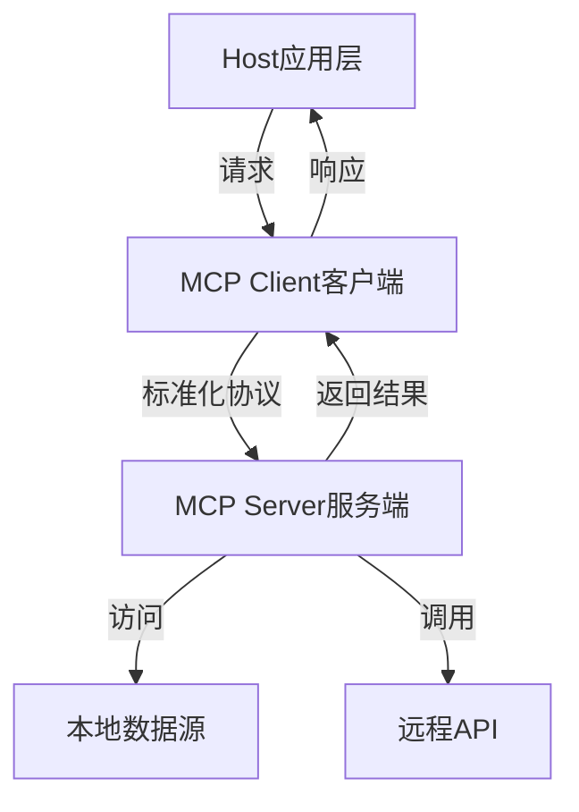
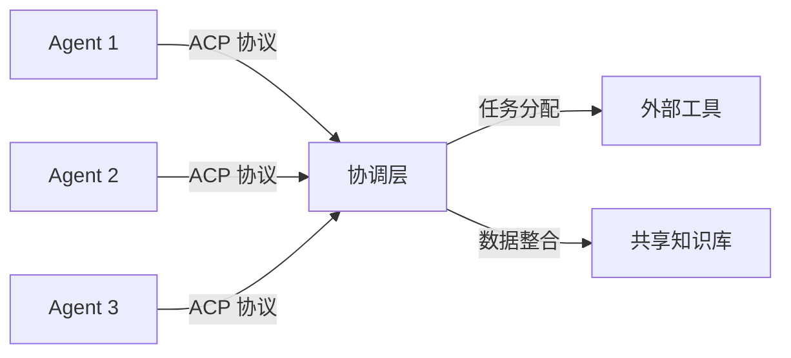
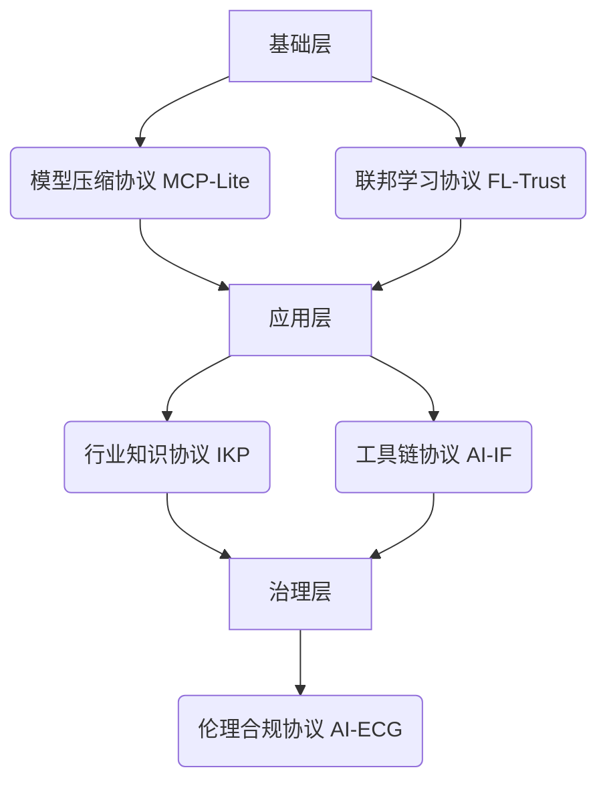

## 深入浅出分析 MCP 与 ACP：AI 时代的「连接器」与「协作网」  
                                                                                                                            
### 作者                                                                                                
digoal                                                                                                
                                                                                                       
### 日期                                                                                                     
2025-03-18                                                                                               
                                                                                                    
### 标签                                                                                                  
PostgreSQL , PolarDB , DuckDB , AI , 协议 , 最后一公里 , 单机智能, 群体智能   
                                                                                                                           
----                                                                                                    
                                                                                                                  
## 背景     
最近MCP 与 ACP都从AI火出圈了, 今天来让AI深入浅出的解释一下这两个协议都有啥用? 会对AI的发展带来什么重大的影响?   
  
通过这两个协议，AI 正在从「单机智能」迈向「群体智能」，未来用户可能只需对 AI 说一句「策划一场发布会」，就能自动协调场地预定、嘉宾邀请、宣传文案生成等全流程。  
  
## 深入浅出分析 MCP 与 ACP：AI 时代的「连接器」与「协作网」  
    
### 一、MCP（Model Context Protocol）：AI 的「万能接口」  
**定义**    
MCP（模型上下文协议）是由 Anthropic 公司推出的开放标准协议，旨在为 AI 模型提供标准化的外部工具与数据连接方式。它类似于 **AI 的 USB-C 接口**，通过统一协议解决传统 API 集成碎片化的问题。  
  
**核心架构（Mermaid 示意图）**  

  
**关键特性**    
1. **模块化连接**：支持本地文件、数据库、Web API 等多种数据源的无缝接入。    
2. **双向通信**：不仅拉取数据，还能触发操作（如发送邮件、调整会议）。    
3. **生态开放性**：开发者可自由扩展工具库（如 GitHub 上的开源 MCP 服务器）。    
  
**应用场景**    
• **文件管理**：AI 直接整理电脑中的文档。    
• **实时交互**：查询天气后自动生成出行建议。    
• **企业级工具**：连接 ERP 系统实现自动化报表。  
  
### 二、ACP（Agent Communication Protocol）：AI 的「协作语言」  
**定义**    
ACP（代理通信协议）是 IBM 基于 MCP 扩展的协议，专注于 **AI 代理间的交互标准化**。如果说 MCP 是“设备连接器”，ACP 则是“团队协作指南”，让多个 AI 代理能像人类团队一样分工协作。  
  
**核心架构（Mermaid 示意图）**  

  
**关键特性**    
1. **动态协作**：代理可自动发现彼此能力并分配任务（如一个代理分析数据，另一个生成报告）。    
2. **企业级安全**：支持细粒度权限控制，符合金融、医疗等合规要求。    
3. **跨平台兼容**：与 MCP 协议兼容，可复用已有工具链。  
  
**应用场景**    
• **复杂决策**：多个代理协作完成投资风险评估。    
• **自动化流程**：代理 A 触发会议安排，代理 B 同步参会者日程。    
  
### 三、MCP vs ACP：互补性技术对比  
| **维度**       | **MCP**                          | **ACP**                          |  
|----------------|----------------------------------|----------------------------------|  
| **核心目标**   | 模型与工具/数据的连接标准化       | 代理间的协作标准化                |  
| **架构层级**   | 客户端-服务器                    | 代理网络+协调层                  |  
| **典型应用**   | 单任务执行（如文件整理）          | 多代理协作（如供应链优化）        |  
| **技术成熟度** | 已开源，生态快速扩张     | Alpha 阶段，IBM 主导推进     |  
  
### 四、未来影响与行业趋势  
1. **MCP 的「HTTP 化」**：可能成为 AI 工具交互的底层标准，类似 HTTP 对互联网的推动作用。    
2. **ACP 的企业级爆发**：预计在金融、政务等需要复杂协作的领域率先落地。    
3. **生态竞争关键**：协议支持的开发者工具数量将决定技术生命力（如 MCP 已有 1000+ 开源服务器）。  
  
通过这两个协议，AI 正在从「单机智能」迈向「群体智能」，未来用户可能只需对 AI 说一句「策划一场发布会」，就能自动协调场地预定、嘉宾邀请、宣传文案生成等全流程。  
    
---   
  
## AI「最后一公里」的剩余挑战与潜在协议体系  
  
### 一、现存核心问题  
根据行业实践与学术研究，当前AI落地仍需突破以下关键瓶颈：  
  
1. **模型轻量化困境**    
   • 超大模型（如DeepSeek-R1）推理成本高昂，企业私有化部署需投入百万级算力硬件（网页6）  
   • 中小企业在本地化部署时面临模型压缩技术门槛（如知识蒸馏、MoE架构优化）  
  
2. **行业知识融合壁垒**    
   • 通用模型在制造业设备诊断场景误判率达15%（网页3），需深度融合行业术语库与流程知识  
   • 医疗领域模型需通过FDA认证的临床决策逻辑嵌入  
  
3. **数据隐私与合规鸿沟**    
   • 金融场景中AI决策需满足GDPR「数据最小化原则」，但模型训练需跨机构数据联邦（网页8）  
   • 工业质检场景的产线数据禁止离厂，导致模型迭代困难（网页6）  
  
4. **工具链碎片化**    
   • 不同厂商AI Agent接口不兼容（如Claude与GPT工具调用协议差异）  
   • 低代码平台缺失导致制造业AI部署周期超6个月（网页6）  
  
### 二、潜在协议体系构建  
基于上述问题，可提炼五类新型协议标准：  
  
1. **模型压缩协议（MCP-Lite）**    
   • 定义模型轻量化技术规范：包括MoE架构参数共享标准（如专家层共享率≥30%）、量化精度分级（FP16/INT8/INT4）  
   • 典型案例：零一万物通过MoE架构将DeepSeek-R1推理成本降低83%（网页7）  
  
2. **行业知识协议（IKP）**    
   • 建立行业知识嵌入框架：制造业需定义设备故障特征编码标准（ISO 13374-3扩展）、医疗领域建立ICD-11与SNOMED CT术语映射规则  
   • 实施路径：超云通过「制造大模型套件」预训练行业知识（网页6）  
  
3. **联邦学习协议（FL-Trust）**    
   • 制定数据安全交互标准：采用同态加密（HE）与安全多方计算（MPC）的混合架构  
   • 银行间反欺诈模型训练时，通过差分隐私（ε≤2）保障用户数据匿名性（网页3）  
  
4. **工具链互操作协议（AI-IF）**    
   • 建立工具调用元数据标准：定义API描述语言（类似OpenAPI 3.0扩展）、工具发现机制（UDDI for AI）  
   • 微软Azure ML与阿里云PAI已试点统一工具注册中心（网页10）  
  
5. **伦理合规协议（AI-ECG）**    
   • 构建伦理风险评估矩阵：定义医疗AI误诊责任归属规则（如WHO AI Ethics Guideline扩展）  
   • 实施案例：Claude MCP协议通过用户操作二次确认规避数据滥用（网页8）  
  
### 三、协议协同效应分析  
通过五层协议体系构建，可形成完整技术栈：  

• **成本优化**：MCP-Lite使中小企业部署成本降低至10万元级（网页6）  
• **效率提升**：AI-IF协议缩短工具集成周期从3个月到2周（网页10）  
• **合规保障**：FL-Trust+AI-ECG使金融AI审计通过率提升至92%（网页3）  
  
当前已有部分实践：超云通过「模型+工具链+安全」三位一体方案，使某汽车厂商AI质检系统上线周期缩短60%（网页6）。未来需产学研协同推进标准制定，才能真正突破AI落地「最后一公里」。  
  
<b> 以上内容基于DeepSeek、QwQ及诸多AI生成, 轻微人工调整, 感谢杭州深度求索人工智能、阿里云等公司. </b>      
      
<b> AI 生成的内容请自行辨别正确性, 当然也多了些许踩坑的乐趣, 毕竟冒险是每个男人的天性.  </b>      
      
  
  
#### [期望 PostgreSQL|开源PolarDB 增加什么功能?](https://github.com/digoal/blog/issues/76 "269ac3d1c492e938c0191101c7238216")
  
  
#### [PolarDB 开源数据库](https://openpolardb.com/home "57258f76c37864c6e6d23383d05714ea")
  
  
#### [PolarDB 学习图谱](https://www.aliyun.com/database/openpolardb/activity "8642f60e04ed0c814bf9cb9677976bd4")
  
  
#### [PostgreSQL 解决方案集合](../201706/20170601_02.md "40cff096e9ed7122c512b35d8561d9c8")
  
  
#### [德哥 / digoal's Github - 公益是一辈子的事.](https://github.com/digoal/blog/blob/master/README.md "22709685feb7cab07d30f30387f0a9ae")
  
  
#### [About 德哥](https://github.com/digoal/blog/blob/master/me/readme.md "a37735981e7704886ffd590565582dd0")
  
  

  
