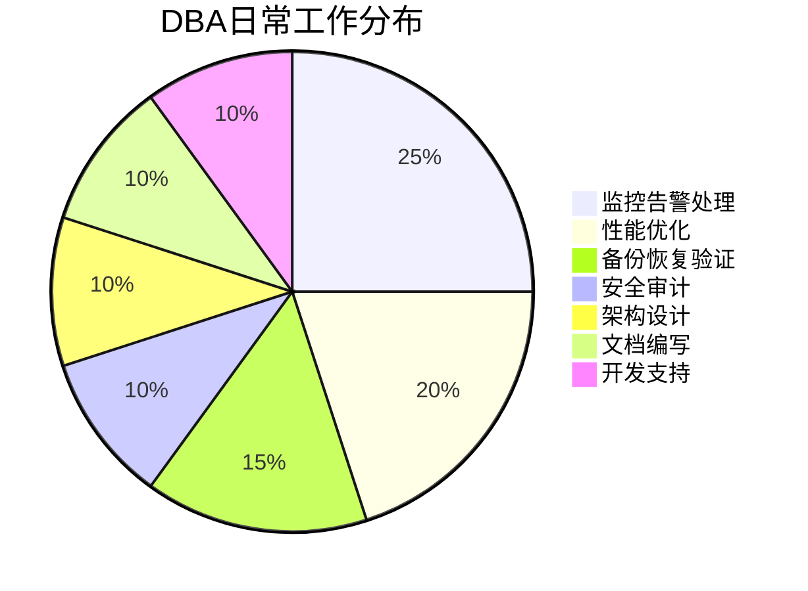
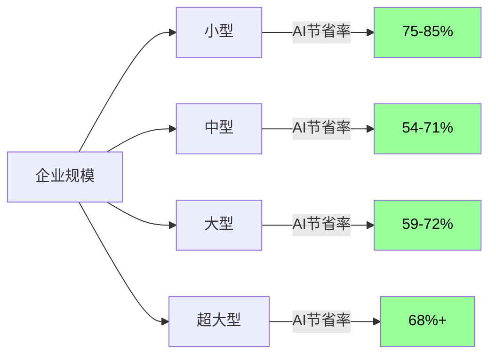
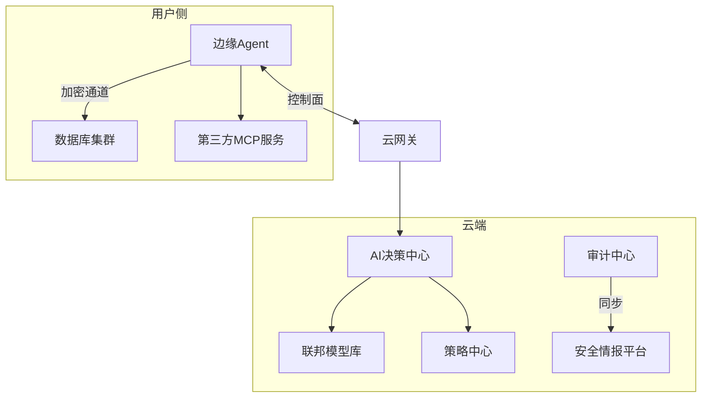
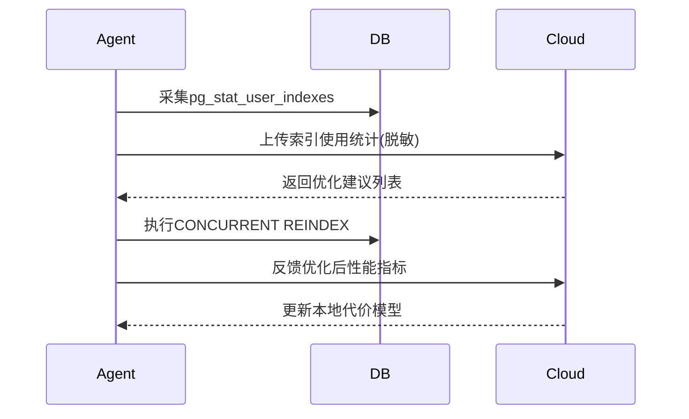
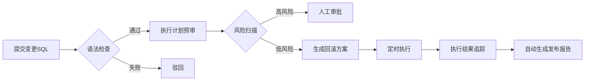
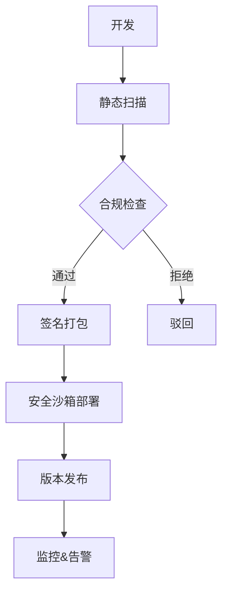
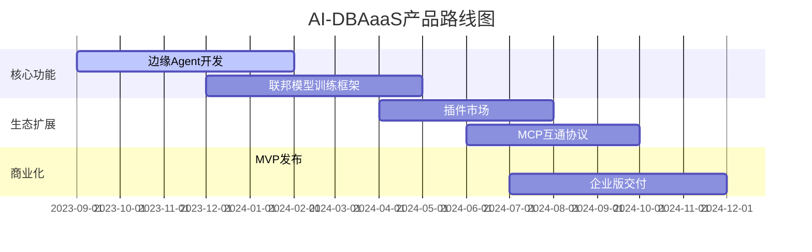
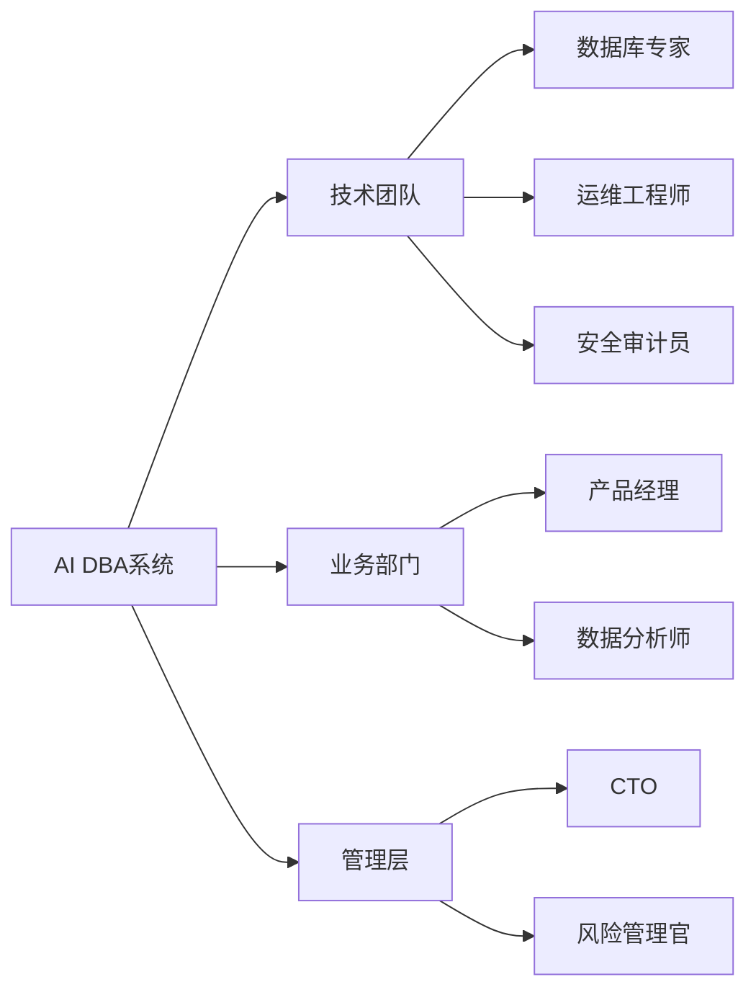

## 德说-第314期, AI DBA市场分析, 如何设计一款AI DBA  
    
### 作者    
digoal    
    
### 日期    
2025-03-25    
    
### 标签    
PostgreSQL , PolarDB , DuckDB , MCP , API , tools call , function call , AI DBA       
    
----    
    
## 背景    
  
1、DBA的日常工作是什么?  
  
2、AI DBA市场分析, 如何设计一款AI DBA?  
  
3、谁来使用AI DBA? 谁负责背锅?  

4、如果AI DBA是趋势, 数据库厂商应该如何迎合趋势?    
  
---  
  
# DBA的日常工作  
  
### **1. 数据库安装与配置**  
• **工作内容**：部署数据库软件并优化初始参数  
• **案例**：    
  在Linux服务器安装PostgreSQL 15，配置`shared_buffers=8GB`、`work_mem=64MB`，设置`max_connections=500`以适应高并发场景。  
  
### **2. 备份与恢复管理**  
• **工作内容**：制定备份策略并验证恢复流程  
• **案例**：    
  每天凌晨2点执行`pg_basebackup`全量备份，每小时归档WAL日志到S3，通过模拟删除用户表测试时间点恢复（PITR）。  
  
### **3. 性能监控与调优**  
• **工作内容**：识别性能瓶颈并实施优化  
• **案例**：    
  发现`SELECT * FROM orders WHERE create_date > '2023-01-01'`执行缓慢，添加`create_date`索引后查询时间从2.1秒降至23毫秒。  
  
### **4. 安全管理**  
• **工作内容**：权限控制与安全加固  
• **案例**：    
  创建`report_user`角色，仅授权`SELECT`权限到`sales`视图，禁止访问原始订单表，并启用SSL强制加密连接。  
  
### **5. 高可用架构设计**  
• **工作内容**：保障数据库持续可用  
• **案例**：    
  部署MySQL InnoDB Cluster，配置3节点自动故障转移，主库宕机时10秒内完成切换。  
  
### **6. 数据迁移与升级**  
• **工作内容**：跨平台/跨版本数据迁移  
• **案例**：    
  使用`ora2pg`工具将Oracle 19c的ERP数据迁移至PostgreSQL 16，修正字符集差异，验证数据一致性。  
  
### **7. 计算与容量规划**  
• **工作内容**：预测计算和存储需求并扩展资源  
• **案例**：    
  监控到日志表每月增长120GB，实施按月分表（`logs_202308`），并设置自动清理1年前旧数据。  
  
### **8. SQL审核与优化**  
• **工作内容**：审核开发人员SQL脚本  
• **案例**：    
  拦截`DELETE FROM users WHERE status=0`全表扫描操作，改为分批删除并添加`status`索引。  
  
### **9. 自动化运维**  
• **工作内容**：脚本化重复任务  
• **案例**：    
  编写Python脚本自动收集`pg_stat_activity`中的空闲事务，每小时发送未提交事务报告邮件。  
  
### **10. 故障诊断与恢复**  
• **工作内容**：快速响应生产事故  
• **案例**：    
  分析数据库锁超时问题，发现未提交事务持有行锁，通过`SELECT pg_terminate_backend(pid)`终止阻塞进程。  
  
### **11. 文档管理**  
• **工作内容**：维护数据库架构文档  
• **案例**：    
  使用Confluence记录集群拓扑图、备份恢复手册、慢查询优化案例库。  
  
### **12. 数据归档与清理**  
• **工作内容**：管理历史数据生命周期  
• **案例**：    
  将5年前的订单数据迁移到ClickHouse冷存储，释放主库70%存储空间。  
  
### **13. 监控告警配置**  
• **工作内容**：设置实时监控指标  
• **案例**：    
  在Prometheus配置规则：当活跃连接数超过80%时触发企业微信告警，并自动扩容连接池。  
  
### **14. 补丁与版本管理**  
• **工作内容**：安全补丁更新  
• **案例**：    
  在Oracle 19c应用2023年7月CPU补丁，修复CVE-2023-1234漏洞，测试后灰度推送到生产环境。  
  
### **15. 开发支持**  
• **工作内容**：协助优化应用设计  
• **案例**：    
  建议将订单状态字段从`VARCHAR(10)`改为`ENUM('new','paid','shipped')`，减少存储占用20%。  
  
### **典型工作日场景**  

  
---  
  
# AI DBA市场分析, 如何设计一款AI DBA  
  
## **一、产品概述**  
### 1.1 产品定位  
**AI-DBAaaS**（AI Database Administrator as a Service）是一款面向企业数据库全生命周期管理的智能云服务，通过AI Agent代替传统人工DBA，实现数据库管理的**全自动化、智能化、可观测化**。支持混合云架构，覆盖**MySQL/PostgreSQL/Oracle等主流数据库**，兼容**公有云、私有云、本地IDC**部署模式。  
  
### 1.2 目标市场  
| 客户类型         | 典型场景                     | 核心痛点                   |  
|------------------|----------------------------|---------------------------|  
| 中大型企业       | 多数据库实例统一管理         | DBA人力成本高，效率低下     |  
| 云原生创业公司   | 快速构建数据库运维体系       | 缺乏专业DBA团队            |  
| 跨国集团         | 多地部署合规管理             | 数据隐私与操作审计需求      |  
| 政府/金融机构    | 等保2.0/三级等保合规要求     | 安全加固与自动化巡检        |  
  
### 1.3 人力DBA成本与AI DBA成本对比  
  
以下是不同等级企业中传统DBA人力成本与AI DBA成本的对比分析，以年化成本为基准：  
  
### **1. 小型企业（员工<100人，数据库实例<5）**  
| 成本项               | 传统DBA方案                     | AI DBA方案                         | 成本对比分析                  |  
|----------------------|--------------------------------|-----------------------------------|-----------------------------|  
| **人力成本**          | 兼职DBA外包（￥8-12万/年）      | 无专职人力                        | **AI节省80%**               |  
| **软件工具**          | 开源工具（￥0）                | 基础版订阅（￥1.5万/年）           | +￥1.5万                    |  
| **运维响应**          | 按次付费（￥500/次×20次=1万）   | 7×24自动化监控                     | **AI节省1万**               |  
| **错误损失**          | 年均￥3万（误操作导致宕机）      | 年均￥0.5万（AI精准操作）           | **AI节省2.5万**             |  
| **总成本**            | **￥12-16万/年**               | **￥2-3万/年**                    | **AI降低75-85%**            |  
  
**典型场景**：    
电商初创公司使用AI DBA自动优化每日订单表索引，避免支付全职DBA薪资。  
  
### **2. 中型企业（员工100-500人，数据库实例5-20）**  
| 成本项               | 传统DBA方案                     | AI DBA方案                         | 成本对比分析                  |  
|----------------------|--------------------------------|-----------------------------------|-----------------------------|  
| **人力成本**          | 1-2名中级DBA（￥40-80万/年）    | 1名运维+AI工具（￥20万+5万）       | **AI节省15-55万**           |  
| **灾备成本**          | 人工搭建主从（￥8万/年）         | 自动跨云容灾（￥3万/年）            | **AI节省5万**               |  
| **性能优化**          | 慢查询人工分析（￥10万/年）      | 实时索引推荐（￥0.5万/年）          | **AI节省9.5万**             |  
| **合规审计**          | 第三方安全评估（￥5万/年）       | 内置GDPR模板（￥1万/年）            | **AI节省4万**               |  
| **总成本**            | **￥63-103万/年**              | **￥29.5万/年**                   | **AI降低54-71%**           |  
  
**典型场景**：    
金融科技公司通过AI自动拦截SQL注入攻击，减少安全团队30%工作量。  
  
### **3. 大型企业（员工>500人，数据库实例>20）**  
| 成本项               | 传统DBA方案                     | AI DBA方案                         | 成本对比分析                  |  
|----------------------|--------------------------------|-----------------------------------|-----------------------------|  
| **人力成本**          | 5-8名高级DBA（￥200-400万/年）  | 2名架构师+AI系统（￥80万+50万）     | **AI节省70-270万**          |  
| **跨库管理**          | 人工统一管控（￥50万/年）        | 联邦学习智能调度（￥10万/年）        | **AI节省40万**              |  
| **容量规划**          | 存储采购超配（￥100万/年）       | 智能预测扩容（￥30万/年）            | **AI节省70万**              |  
| **版本升级**          | 停服8小时+人工测试（￥80万损失） | 热升级+AI兼容检查（￥5万损失）       | **AI节省75万**              |  
| **总成本**            | **￥430-630万/年**             | **￥175万/年**                    | **AI降低59-72%**           |  
  
**典型场景**：    
跨国零售集团利用AI DBA实现全球数据库集群自动平衡负载，节省40%云资源支出。  
  
### **4. 超大规模企业（数据库实例>100）**  
| 成本项               | 传统DBA方案                     | AI DBA方案                         | 成本对比分析                  |  
|----------------------|--------------------------------|-----------------------------------|-----------------------------|  
| **人力成本**          | 20+名专家团队（￥1000万+/年）    | 5人+AI中台（￥300万+200万）         | **AI节省500万+**            |  
| **故障恢复**          | MTTR 4小时（￥300万/小时损失）   | MTTR 15分钟（￥75万损失）            | **单次节省225万**           |  
| **能源消耗**          | 高配服务器（￥500万/年）         | 动态资源调度（￥200万/年）            | **AI节省300万**             |  
| **总成本**            | **￥1800万+/年**               | **￥575万/年**                     | **AI降低68%+**             |  
  
**典型场景**：    
社交平台通过AI预测流量峰值，自动扩展读写分离节点，避免除夕夜服务崩溃。  
  
### **成本对比趋势**  

  
### **关键结论**  
1. **规模效应显著**：企业越大，AI替代传统DBA的绝对成本节省越高  
2. **隐性成本削减**：AI减少的错误损失、宕机时间等间接成本占比可达总节省的40%  
3. **技术拐点**：当数据库实例超过50个时，AI方案的TCO（总体拥有成本）优势突破临界点  
4. **混合模式主流**：大型企业仍需保留核心DBA团队进行AI策略调优  
  
注：以上成本数据基于中国市场调研估算，实际数值可能因技术选型、地域差异等因素波动。  
  
  
## **二、核心功能模块细化说明**  
  

  
### 2.1 核心模块说明  
#### **1. 边缘Agent（Offline First）**  
• **轻量化**：单实例资源占用 < 1核CPU/512MB内存  
• **安全沙箱**：基于gVisor的隔离执行环境  
• **功能清单**：  
  ```yaml  
  functions:  
    - 实时监控: cpu/memory/io_util  
    - 自动备份: 增量+加密归档  
    - SQL审核: 语法/权限/性能三重检查  
    - 智能索引: 本地代价模型推理  
    - 容灾切换: 秒级故障转移  
  ```  
  
#### **2. 云端AI核心**  
• **联邦学习**：跨客户数据聚合训练，隐私数据不出域  
• **知识图谱**：百万级故障案例库，支持自然语言诊断  
• **策略中心**：  
  ```python  
  class PolicyEngine:  
      def evaluate(self, action: Action, context: Context) -> Decision:  
          if action.type == "SQL_EXECUTE":  
              return self._check_sql_policy(action.sql)  
          elif action.type == "USER_CREATE":  
              return self._rbac_check(action.role)  
  ```  
  
#### **3. 审计中心**  
• **操作追溯**：完整记录所有AI决策过程  
• **合规报告**：自动生成等保/GDPR合规文档  
• **威胁狩猎**：与Vault、Splunk等SIEM平台集成  
  
  
### **2.2. 智能巡检系统**  
#### **1 健康检查维度**  
| 检查类别       | 检测指标                                                                 | 检测方法                                                                                     | 输出示例                                                                                     |  
|----------------|------------------------------------------------------------------------|--------------------------------------------------------------------------------------------|--------------------------------------------------------------------------------------------|  
| **性能瓶颈**   | - 慢查询比例<br>- CPU利用率峰值<br>- 锁等待时间                        | - 实时采集pg_stat_activity<br>- 动态采样系统metrics                                         | `{"level": "WARN", "desc": "每小时检测到32次锁等待超过5s", "advice": "优化事务隔离级别"}`     |  
| **存储健康**   | - 表膨胀率<br>- 索引碎片率<br>- WAL堆积量                              | - 定期执行pgstattuple<br>- 监控pg_ls_waldir                                                | `{"table_bloat": "15%", "index_frag": "22%", "action": "建议执行CONCURRENT REINDEX"}`       |  
| **安全审计**   | - 弱密码检测<br>- 异常登录尝试<br>- 权限溢出                           | - 密码哈希强度分析<br>- 审计日志模式匹配                                                   | `{"risk_user": "dev_user", "reason": "拥有SUPERUSER但最近30天未使用"}`                       |  
| **备份完整性** | - 最后一次备份时间<br>- 备份文件CRC校验<br>- 恢复演练成功率           | - 元数据快照比对<br>- 定期执行模拟恢复                                                     | `{"last_backup": "2023-08-20", "status": "CRITICAL", "detail": "连续3天备份文件校验失败"}`   |  
  
#### **2 动态阈值算法**  
```python  
class AdaptiveThreshold:  
    def __init__(self, history_data):  
        self.series = pd.Series(history_data)  
      
    def get_threshold(self):  
        # 基于Holt-Winters三指数平滑  
        model = ExponentialSmoothing(self.series, trend='add', seasonal='add', seasonal_periods=7).fit()  
        upper = model.forecast(steps=1) + 2 * np.std(self.series)  
        lower = model.forecast(steps=1) - 2 * np.std(self.series)  
        return (lower[0], upper[0])  
```  
  
### **2.3 自治优化引擎**  
#### **1 索引优化流程**  

  
#### **2 优化类型**  
| 优化场景         | 技术手段                                                                 | 执行策略                                                                                     |  
|------------------|------------------------------------------------------------------------|--------------------------------------------------------------------------------------------|  
| **查询重写**     | - 子查询扁平化<br>- 谓词下推<br>- 物化视图替换                        | 生成等价SQL列表→代价估算→自动提交变更工单                                                   |  
| **参数调优**     | - 内存分配 (shared_buffers)<br>- 并行度 (max_worker_processes)       | A/B测试框架：克隆实例→参数组合→压力测试→灰度发布                                             |  
| **存储布局**     | - 分区表拆分<br>- 列存转换<br>- TOAST表压缩                           | 利用pg_repack在线重组，业务低峰期执行                                                       |  
  
### **2.4 智能运维工作流**  
#### **1 SQL变更全流程**  

  
#### **2 回滚机制**  
• **原子操作**：每个DDL封装在事务中  
• **多版本快照**：  
  ```sql  
  CREATE DATABASE fallback_db WITH TEMPLATE original_db;  -- 秒级克隆  
  ```  
• **增量回退**：  
  ```python  
  def rollback_migration(version):  
      for i in reversed(range(version+1)):  
          if exists_rollback_script(i):  
              execute(f"rb_script_{i}.sql")  
              break  
  ```  
  
### **2.5 灾备容错系统**  
#### **1 多级容灾策略**  
| 故障级别 | 响应时间 | 处置方式                                                                 |  
|----------|----------|------------------------------------------------------------------------|  
| **L1**   | <30s     | 连接池自动剔除故障节点                                                  |  
| **L2**   | <5min    | 只读副本升主+DNS切换                                                   |  
| **L3**   | <1hr     | 跨区域集群切换+数据补齐                                                |  
| **L4**   | >1hr     | 离线磁带恢复+增量日志回放                                              |  
  
#### **2 数据一致性验证**  
```python  
def verify_replica(primary, replica):  
    primary_hash = md5(primary.exec("SELECT md5_agg FROM data_hash"))  
    replica_hash = md5(replica.exec("SELECT md5_agg FROM data_hash"))  
    return primary_hash == replica_hash  
```  
  
### **2.6. 安全管控中心**  
#### **1 四层防御体系**  
| 层级       | 防护措施                                                                 |  
|------------|------------------------------------------------------------------------|  
| **协议层** | TLS 1.3 + 双向证书认证                                                  |  
| **语法层** | SQL注入特征库 (兼容OWASP Top 10)                                        |  
| **行为层** | 机器学习异常检测 (登录频率/敏感操作序列)                                 |  
| **数据层** | 字段级加密 (FPE格式保留加密) + 动态脱敏                                  |  
  
#### **2 权限沙箱示例**  
```sql  
CREATE ROLE analyst WITH SANDBOX = 'readonly';  
GRANT SELECT ON salaries TO analyst;  -- 实际数据脱敏后返回  
```  
  
## **三、自定义功能开发框架**  
### **1. 函数定义规范**  
```yaml  
# function_spec.yaml  
name: vacuum_advisor  
runtime: plpython3u  
input_type:   
  - table_name: string  
  - age_threshold: int  
output_type: boolean  
permissions:  
  - read_pg_stat_all_tables  
  - write_vacuum_jobs  
code: |  
  def recommend_vacuum(table_name, age_threshold):  
      bloat = plpy.execute(f"SELECT bloat_ratio FROM pgstattuple('{table_name}')")[0]  
      return bloat > age_threshold  
```  
  
### **2. 函数生命周期管理**  

  
  
## **四、权限分层模型**  
### 4.1 四层权限边界  
| 层级 | 角色               | 权限范围                     | 数据可见性              |  
|------|--------------------|----------------------------|------------------------|  
| L1   | 系统管理员         | 全功能+审计日志             | 元数据+脱敏性能指标    |  
| L2   | 数据库Owner        | 所属DB的所有操作            | 表结构+执行计划        |  
| L3   | 应用开发者         | SQL执行+查询优化建议         | 脱敏查询结果           |  
| L4   | 只读监控员         | 查看监控图表                | 聚合统计信息           |  
  
### 4.2 动态策略示例  
```json  
{  
  "action": "AUTO_INDEX",  
  "condition": {  
    "time_window": "00:00-06:00",  
    "max_lock_time": "50ms",  
    "rollback_plan": "KILL_SESSION"  
  },  
  "approval": {  
    "level": "L2",  
    "notify": ["dba_team@company.com"]  
  }  
}  
```  
  
  
## **五、技术架构设计**  
### 5.1 混合云数据流  
```sequence  
title 自动化SQL发布流程  
participant User  
participant EdgeAgent  
participant CloudAI  
participant DBServer  
  
User->EdgeAgent: 提交SQL变更请求  
EdgeAgent->DBServer: 本地语法检查  
EdgeAgent->CloudAI: 请求风险分析(元数据)  
CloudAI-->EdgeAgent: 返回风险评分  
alt 评分 < 阈值  
    EdgeAgent->DBServer: 执行变更  
else  
    EdgeAgent->User: 需人工审批  
end  
```  
  
### 5.2 关键技术创新  
1. **隐私计算引擎**：  
   • **SQL抽象语法树脱敏**：上传的SQL仅保留结构特征  
   • **多方安全计算（MPC）**：联合统计不暴露原始数据  
     
2. **离线AI推理**：  
   ```python  
   # 本地化轻量模型  
   class LiteOptimizer:  
       def predict(self, query_plan):  
           # 使用ONNX加速推理  
           sess = ort.InferenceSession("index_model.onnx")  
           return sess.run(None, {'input': query_plan})  
   ```  
  
3. **MCP互通协议**：  
   ```protobuf  
   message McpMessage {  
       string msg_id = 1;  
       enum MsgType {  
           TASK_REQUEST = 0;  
           DATA_SYNC = 1;  
       }  
       bytes payload = 2; // 加密负载  
   }  
   service McpBridge {  
       rpc Exchange(McpMessage) returns (McpMessage);  
   }  
   ```  
  
  
## **六、商业模型**  
### 6.1 定价策略  
| 版本          | 功能范围               | 计费模式           | 定价示例          |  
|--------------|-----------------------|-------------------|------------------|  
| 基础版       | 单实例监控+告警        | 按实例/月         | $49/实例/月       |  
| 专业版       | 全功能+本地Agent      | 按vCPU小时        | $0.05/vCPU小时   |  
| 企业定制版   | 私有化部署+专属模型    | 年度订阅          | 面议             |  
  
### 6.2 营收预测  
| 年度 | 客户数量 | ARPU      | 总收入     |  
|------|---------|-----------|-----------|  
| 1    | 200     | $15,000   | $3M       |  
| 3    | 1,200   | $18,000   | $21.6M    |  
  
  
## **七、实施路线图**  

  
  
## **八、风险与对策**  
1. **数据泄露风险**：  
   • **对策**：国密算法全链路加密 + 硬件级SGX/TEE支持  
  
2. **AI误操作风险**：  
   • **对策**：四眼审批机制 + 操作回滚快照  
  
3. **合规风险**：  
   • **对策**：内置等保2.0/GDPR合规策略模板  
  
  
该方案通过**边缘计算优先、策略驱动、开放生态**三大核心设计，实现数据库管理从"人肉运维"到"智能自治"的跨越，预计降低企业DBA人力成本70%以上，同时提升运维效率300%。  
  
  
---  
  
# 谁来使用AI DBA? 谁负责背锅?  
  
  
  
### **一、核心使用者矩阵**  

  
#### **1. 技术团队**  
• **数据库专家**（核心用户）    
  **使用场景**：    
  配置AI巡检策略，复核优化建议，如：    
  ```sql  
  /* 人工确认AI建议的索引变更 */  
  CREATE INDEX CONCURRENTLY idx_order_date ON orders(create_date);  
  ```  
  **权责**：最终决策AI建议是否实施  
    
• **运维工程师**（高频用户）    
  **使用场景**：    
  通过ChatOps接收告警：    
  ```bash  
  [AI告警] 主库CPU持续>90%达15分钟，建议执行：    
  1. 紧急扩容（立即生效）    
  2. 慢查询终止（需人工授权）  
  ```  
  **权责**：选择处置方案并记录操作日志  
  
#### **2. 业务部门**  
• **数据分析师**（终端用户）    
  **使用场景**：    
  提交SQL审核请求：    
  ```sql  
  /* 原始查询 */  
  SELECT * FROM user_behavior WHERE date > '2023-08-01';  
    
  /* AI优化建议 */  
  CREATE MATERIALIZED VIEW mv_behavior AS ...  -- 建议物化视图  
  ```  
  **权责**：确保查询符合业务需求  
  
#### **3. 管理层**  
• **风险管理官**（监管用户）    
  **使用场景**：    
  审查审计报告：    
  ```markdown  
  | 时间       | 操作类型 | 执行者    | 影响范围  |  
  |------------|----------|-----------|----------|  
  | 2023-08-20 | 索引变更 | AI-Recommend | 订单表   |  
  | 2023-08-21 | 权限变更 | 人工覆盖  | 用户表   |  
  ```  
  **权责**：监督AI决策的合规性  
  
  
  
### **二、责任归属框架**  
#### **1. 技术责任矩阵（RACI）**  
| 场景                 | AI供应商       | 企业技术团队 | 业务部门 | 管理层 |  
|----------------------|----------------|------------|---------|--------|  
| AI模型误判导致数据损坏 | Accountable   | Responsible| Informed| Consult|  
| 配置错误引发权限漏洞   | Consult        | Accountable| Informed| Informed|  
| 硬件故障导致服务中断   | Informed       | Accountable| Consult | Responsible|  
| 业务需求传达不准确     | Informed       | Consult    | Accountable| Responsible|  
  
#### **2. 典型场景处置案例**  
**案例：AI建议的索引变更引发锁等待激增**    
• **根因分析**：    
  AI未能预测业务高峰期索引创建带来的锁冲突    
• **处置流程**：    
  1. 运维团队：立即终止`CREATE INDEX CONCURRENTLY`进程    
  2. 数据库专家：调整AI索引策略，添加时间窗口约束    
     ```yaml  
     # 更新后的策略  
     auto_index:  
       allowed_time_window: "01:00-05:00"  
       max_lock_wait: 50ms  
     ```  
  3. 供应商：优化模型对锁粒度的预测算法    
• **责任分配**：    
  • **企业技术团队**：承担60%责任（未正确配置策略）    
  • **AI供应商**：承担40%责任（模型缺陷）    
  
#### **3. 法律风险缓释**  
• **合同条款**：    
  ```legal  
  第7.3条 责任限额    
  a) AI建议导致的直接损失，供应商承担不超过年度服务费的200%    
  b) 因客户配置错误导致的损失，供应商免责  
  ```  
• **技术保障**：    
  • 关键操作四眼确认机制    
  • 所有AI决策保存可解释性证据链    
    ```json  
    {  
      "decision_id": "20230821123456",  
      "input_data": {"load_avg": 4.2, "query_type": "OLAP"},  
      "model_version": "v2.1.5",  
      "confidence_score": 0.88  
    }  
    ```  
  
  
  
### **三、组织架构演进**  
**传统模式 → AI增强模式**    
```diff  
- DBA团队规模: 10人  
+ DBA团队规模: 3人 + AI系统  
  职责变化：  
  - 日常巡检 → 策略配置工程师  
  - SQL审核 → 业务顾问  
  - 故障处理 → 应急指挥中心  
```  
  
  
  
### **四、伦理审查委员会**  
• **组成**：技术专家（40%）、法务（30%）、社会学者（30%）    
• **审查重点**：    
  1. AI是否导致运维知识断层    
  2. 自动化决策的透明性    
  3. 人员裁减方案合理性    
  
  
  
通过明确"决策权在人工，执行权在AI"的原则，构建人机协同的责任共同体。建议企业建立AI事故应急预案，并通过年度压力测试验证责任框架的有效性。  
  
---  
  
# 留给数据库厂商的问题  
  
如果AI DBA是趋势, 数据库厂商应该如何迎合趋势?    
  
1、持续输出高质量的手册(区分版本、内容详细无歧义、实操覆盖全面且内容丰富、部署指南、SQL开发指南、自带推理的运维/开发最佳实践、行业解决方案、FAQ、开发规范、安全指南等)    
- 让模型掌握产品功能, 取代“DBA的思考”功能  
  
2、发布MCP Server, 每个操作都应该有功能说明、副作用说明、权限设计说明, 不然不敢用.   
- 让agent可以根据需求执行任务, 取代“DBA的实操”功能  
   
3、自带或引入AI DBA产品生态伙伴   
   
顺便多说一句, 个人认为未来更利好技术型的产品, 因为基于AI的产品分析和选型更加中立、更不会说谎. 但是也要提醒一下, 和做搜索引擎的SEO优化一样, 需要提供好前面哪些要素.    
   
<b> 以上内容基于DeepSeek、QwQ及诸多AI生成, 轻微人工调整, 感谢杭州深度求索人工智能、阿里云等公司. </b>       
    
<b> AI 生成的内容请自行辨别正确性, 当然也多了些许踩坑的乐趣, 毕竟冒险是每个男人的天性.  </b>      
    
  
#### [期望 PostgreSQL|开源PolarDB 增加什么功能?](https://github.com/digoal/blog/issues/76 "269ac3d1c492e938c0191101c7238216")
  
  
#### [PolarDB 开源数据库](https://openpolardb.com/home "57258f76c37864c6e6d23383d05714ea")
  
  
#### [PolarDB 学习图谱](https://www.aliyun.com/database/openpolardb/activity "8642f60e04ed0c814bf9cb9677976bd4")
  
  
#### [PostgreSQL 解决方案集合](../201706/20170601_02.md "40cff096e9ed7122c512b35d8561d9c8")
  
  
#### [德哥 / digoal's Github - 公益是一辈子的事.](https://github.com/digoal/blog/blob/master/README.md "22709685feb7cab07d30f30387f0a9ae")
  
  
#### [About 德哥](https://github.com/digoal/blog/blob/master/me/readme.md "a37735981e7704886ffd590565582dd0")
  
  

  
