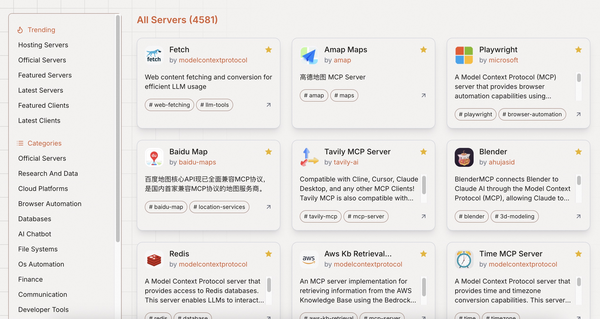

## 德说-第315期, 万物都在用MCP接入AI Agent, 你还在等什么?  
        
### 作者        
digoal        
        
### 日期        
2025-03-27       
        
### 标签        
PostgreSQL , PolarDB , DuckDB , Cursor , MCP Host , MCP client , MCP server         
        
----        
        
## 背景     
AI Agent正席卷各类应用, 不管是赶潮流还是真能降本提效, 反之老板和员工都很焦虑, 都在想办法把自己的产品接入AI Agent, 或者让员工赶紧用AI提效.    
  
如果AI应用逐渐成为主流, 流量势必会被其快速占领, 毕竟它不需要休息.  
  
如果你是销售, 你肯定希望有AI帮你带货.  
  
如果你是个人创作中, 你肯定希望AI帮你提升创作效率.  
  
如果你是主播, 你可能希望有N个24小时不停工作的数字替身.  
  
如果你是数据库生态产品厂商, 要火起来应该尽快接入Agent生态, 例如将所有API的能力抽象出来, 转换MCP Server的tools. 让AI Agent能接入你, 帮你加速获得用户流量.    
  
这里是几个mcp server的汇总网站, 汇总了各类产品的mcp server, 就像菜市场, 大家纷纷把自家产品的mcp server放在里面供AI Agent应用接入选用.  
  
https://www.mcpstack.com/  
  
https://mcp.so/server/  
  
https://github.com/modelcontextprotocol/servers/  
  
看, 百度和高德接入了:   
- https://mcp.so/server/baidu-map  
- https://mcp.so/server/amap-maps/amap  
  
qwen作为AI服务, 以AI agent(MCP Host/client)的角色接入MCP Server.   
- https://chat.qwen.ai  
   
   
   
所有想被API调用的产品都在通过MCP接入AI Agent, 开发者正在经历从面向人开发接口到面向AI Agent开发接口.       
  
  
  
反过来, 能整合好LLM, MCP Server服务则有机会打造出优秀的AI应. 不管是c端还是b端    
- 例如 面向开发者的 cursor.     
  
  
#### [期望 PostgreSQL|开源PolarDB 增加什么功能?](https://github.com/digoal/blog/issues/76 "269ac3d1c492e938c0191101c7238216")
  
  
#### [PolarDB 开源数据库](https://openpolardb.com/home "57258f76c37864c6e6d23383d05714ea")
  
  
#### [PolarDB 学习图谱](https://www.aliyun.com/database/openpolardb/activity "8642f60e04ed0c814bf9cb9677976bd4")
  
  
#### [PostgreSQL 解决方案集合](../201706/20170601_02.md "40cff096e9ed7122c512b35d8561d9c8")
  
  
#### [德哥 / digoal's Github - 公益是一辈子的事.](https://github.com/digoal/blog/blob/master/README.md "22709685feb7cab07d30f30387f0a9ae")
  
  
#### [About 德哥](https://github.com/digoal/blog/blob/master/me/readme.md "a37735981e7704886ffd590565582dd0")
  
  

  
