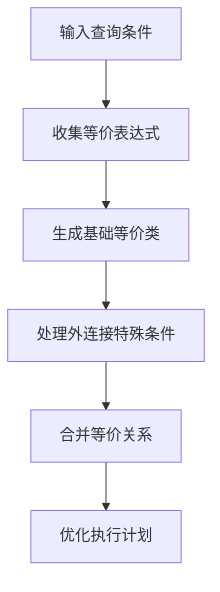
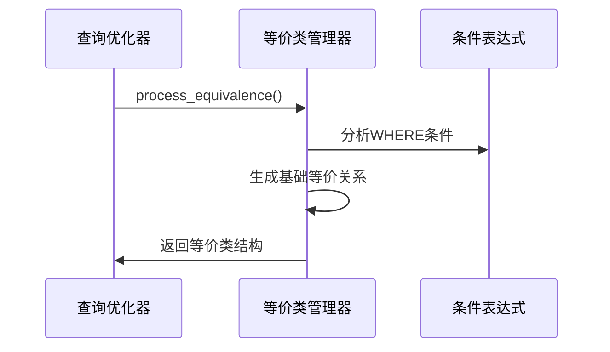
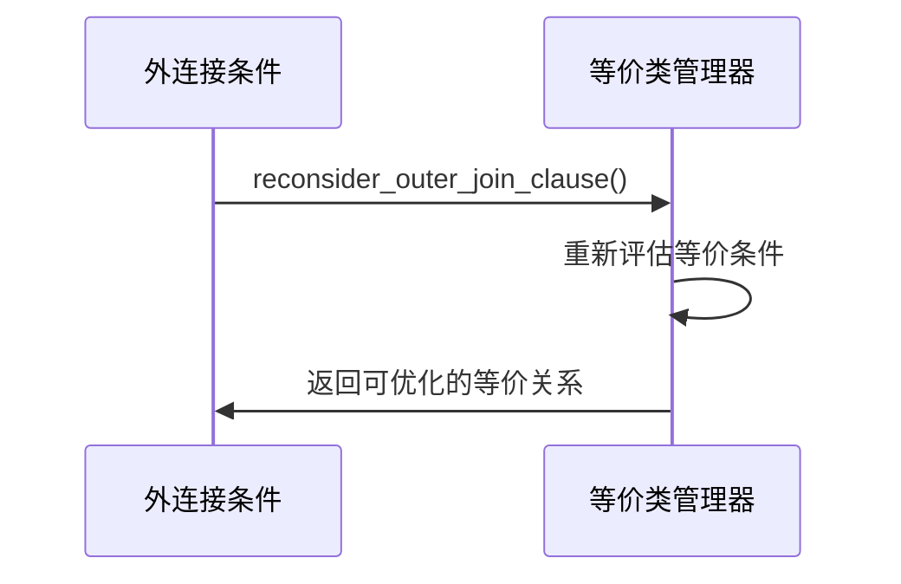
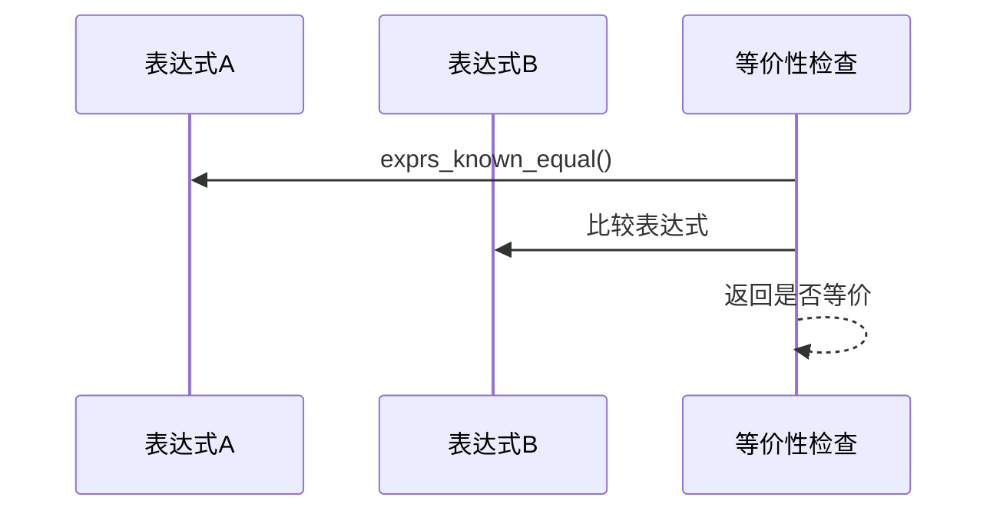
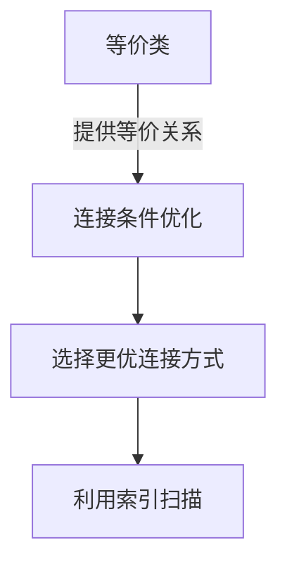
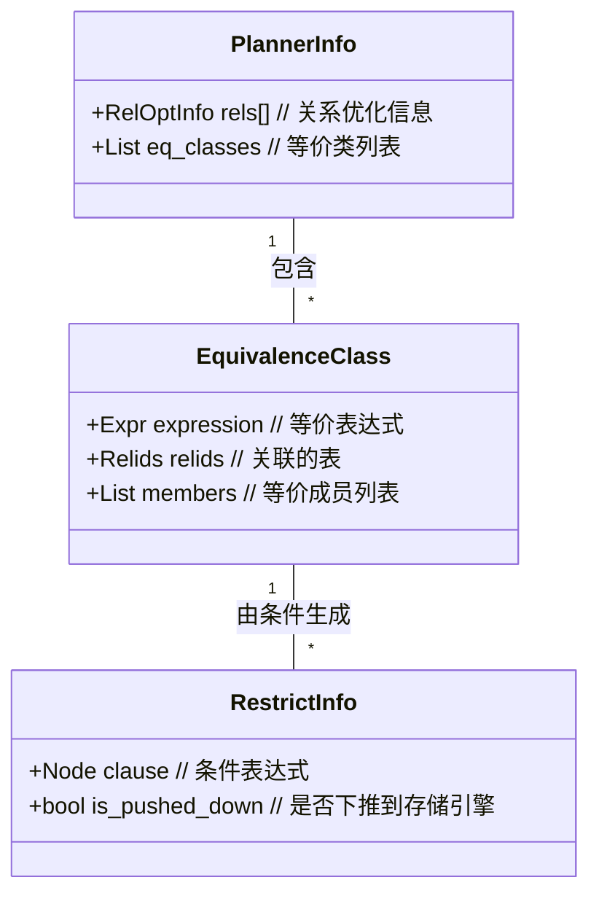

## AI辅助 PolarDB内核学习 - 16 path(路径生成) 之 等价类(equivclass.c)代码      
### 作者        
digoal        
        
### 日期        
2025-03-27        
        
### 标签        
PostgreSQL , PolarDB , DuckDB , AI , 内核 , 学习 , path , 路径生成 , equivclass.c , 等价类  
        
----        
        
## 背景    
  
## 解读path(路径生成)之等价类(equivclass.c)代码      
  
### 等价类优化器模块解读   
  
#### **一、核心功能与作用**  
这个模块是PostgreSQL查询优化器的核心组件，负责**等价类（Equivalence Classes）的生成与管理**。它通过识别查询中隐含的等价关系（如 `a = b` 和 `b = c` 可推导出 `a = c`），帮助优化器生成更高效的执行计划。  
  
  
#### **二、关键流程与步骤**  
以下是等价类处理的简化流程图：  
  

  
  
#### **三、核心功能模块详解**  
  
  
##### **1. 等价类生成**  

  
**关键函数**：  
- `generate_base_implied_equalities()`：生成基础等价关系  
- `add_eq_member()`：将等价表达式添加到等价类  
- `canonicalize_ec_expression()`：标准化表达式（如统一类型）  
  
  
##### **2. 外连接条件处理**  

  
**关键函数**：  
- `reconsider_outer_join_clause()`：处理LEFT/RIGHT JOIN的条件  
- `reconsider_full_join_clause()`：处理FULL JOIN的条件  
- **作用**：确保外连接的NULL处理不影响等价关系的有效性  
  
  
##### **3. 等价性判断**  

  
**关键函数**：  
- `exprs_known_equal()`：判断两个表达式是否等价  
- **应用场景**：优化条件合并（如 `WHERE a = 5 AND b = a` → `WHERE a = b = 5`）  
  
  
##### **4. 索引与连接优化**  

  
**关键函数**：  
- `eclass_useful_for_merging()`：判断等价类是否适合用于连接合并  
- `add_child_rel_equivalences()`：处理子查询或关联表的等价关系  
  
  
#### **四、对DBA/开发者的实际影响**  
1. **查询性能提升**：  
   - 等价类帮助优化器选择更优的连接顺序（如Hash Join → Merge Join）。  
   - 自动合并条件，减少扫描数据量。  
  
2. **调试与优化技巧**：  
   - **查看等价类**：通过 `EXPLAIN (VERBOSE)` 观察等价关系。  
   - **示例问题**：    
     ```sql  
     EXPLAIN (VERBOSE) SELECT * FROM a JOIN b ON a.id = b.id WHERE b.id = 5;  
     ```  
     等价类会推导出 `a.id = b.id = 5`，优化器可能直接使用索引扫描。  
  
3. **常见问题**：  
   - **断裂等价关系**：如 `a = b OR c = d` 无法形成等价类。  
   - **外连接陷阱**：外连接的NULL值可能导致等价关系失效。  
  
  
#### **五、代码结构概览**  

  
  
#### **六、典型场景示例**  
**场景**：优化以下查询：  
```sql  
SELECT * FROM orders   
JOIN customers ON orders.cust_id = customers.id   
WHERE customers.id = 100;  
```  
  
**等价类优化过程**：  
1. 识别 `orders.cust_id = customers.id`。  
2. 结合 `customers.id = 100`，推导出 `orders.cust_id = customers.id = 100`。  
3. 优化器直接扫描 `customers.id=100` 的索引，再关联 `orders`。  
  
  
#### **七、常见错误与排查**  
1. **断裂等价关系**：  
   - **现象**：等价类未合并，导致全表扫描。  
   - **排查**：检查条件是否包含 `OR` 或函数（如 `a = f(b)`）。  
  
2. **外连接条件未优化**：  
   - **现象**：外连接性能差。  
   - **解决**：使用 `RECONSIDER_JOIN_ORDER` 提示优化器。  
  
  
### 总结  
此模块通过等价类管理，帮助PostgreSQL自动发现隐含的等价关系，从而生成更高效的执行计划。开发者和DBA可通过 `EXPLAIN` 分析等价类的使用情况，并针对断裂关系或外连接进行优化。  
  
## 提示         
````        
使用cursor  
  
add context : src/backend/optimizer/path/equivclass.c  
  
ask :   
从数据库用户(应用开发者或DBA)角度通熟易懂解读这个代码, 使用sequence, mermaid图表增加可读性.   
  
模型选择 : qwq-plus  
````        
          
## PolarDB & PostgreSQL 15 差异          
```      
git diff -u 50d3d22baba63613d1f1406b2ed460dc9b03c3fc f5e7493819e370d30ac2047c68c21c9fb03ce4a0 -- src/backend/optimizer/path/equivclass.c   
```      
           
差异分析待补充.        
        
<b> 以上内容基于DeepSeek、QwQ及诸多AI生成, 轻微人工调整, 感谢杭州深度求索人工智能、阿里云等公司. </b>        
        
<b> AI 生成的内容请自行辨别正确性, 当然也多了些许踩坑的乐趣, 毕竟冒险是每个男人的天性.  </b>        
        
       
  
  
#### [期望 PostgreSQL|开源PolarDB 增加什么功能?](https://github.com/digoal/blog/issues/76 "269ac3d1c492e938c0191101c7238216")
  
  
#### [PolarDB 开源数据库](https://openpolardb.com/home "57258f76c37864c6e6d23383d05714ea")
  
  
#### [PolarDB 学习图谱](https://www.aliyun.com/database/openpolardb/activity "8642f60e04ed0c814bf9cb9677976bd4")
  
  
#### [PostgreSQL 解决方案集合](../201706/20170601_02.md "40cff096e9ed7122c512b35d8561d9c8")
  
  
#### [德哥 / digoal's Github - 公益是一辈子的事.](https://github.com/digoal/blog/blob/master/README.md "22709685feb7cab07d30f30387f0a9ae")
  
  
#### [About 德哥](https://github.com/digoal/blog/blob/master/me/readme.md "a37735981e7704886ffd590565582dd0")
  
  

  
