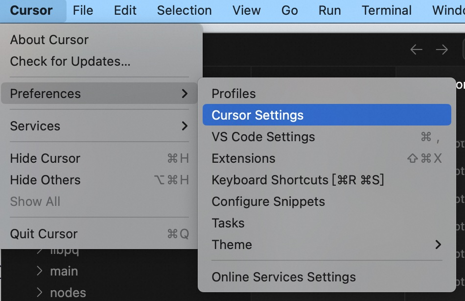
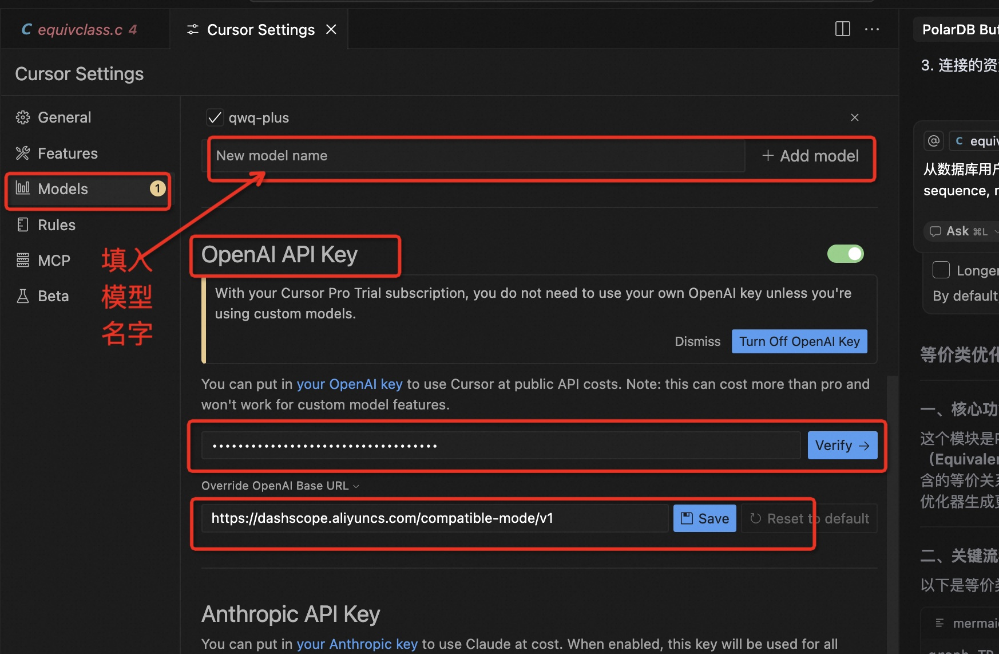
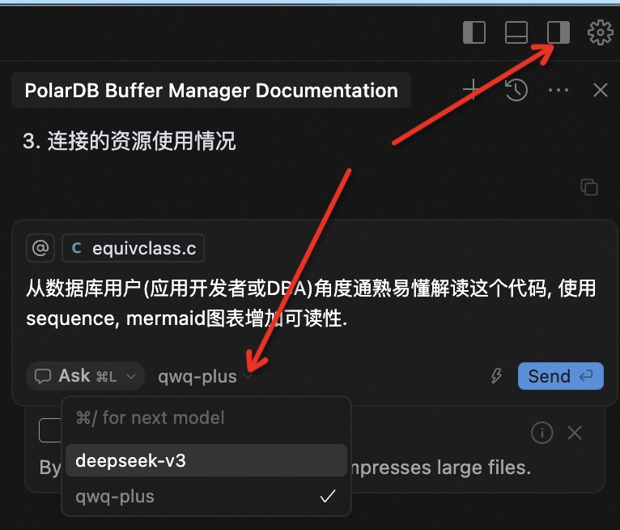

## Cursor 如何接入百炼 dashscope 内的大模型 例如QwQ , Qwen , Deepseek       
  
### 作者          
digoal          
          
### 日期          
2025-03-27          
          
### 标签          
PostgreSQL , PolarDB , DuckDB , Cursor , dashscope , 百炼     
          
----          
          
## 背景      
1、安装cursor, 参考如下  
- [《MCP太火了, 新手仅3分钟用Cursor Agent接管2大国产数据库》](../202503/20250327_04.md)    
  
2、开通百炼, 并创建API KEY  
- https://bailian.console.aliyun.com  
  
3、选择需要用到的模型, 例如qwa-plus  
  
https://bailian.console.aliyun.com/model-market#/model-market  
  
https://bailian.console.aliyun.com/model-market#/model-market/detail/qwq-plus  
  
通义千问QwQ推理模型增强版，基于Qwen2.5模型训练的QwQ推理模型，通过强化学习大幅度提升了模型推理能力。模型数学代码等核心指标（AIME 24/25、livecodebench）以及部分通用指标（IFEval、LiveBench等）达到DeepSeek-R1 满血版水平。  
  
模型调用-输入: ¥0.0016/千Token  
  
模型调用-输出: ¥0.004/千Token  
   
目前很多模型都有赠送免费额度.   
  
4、配置cursor   
  
  
  
添加模型名( qwq-plus ), 修改openAI URL ( https://dashscope.aliyuncs.com/compatible-mode/v1 ), API KEY ( xxxxx )  
  
  
  
使用新增的模型 qwq-plus   
  
  
  
  
## 参考  
Cursor 如何接入 Qwen 大模型:    
- https://blog.csdn.net/ls1120623840/article/details/145226560  
- https://developer.aliyun.com/article/1640134  
- https://help.aliyun.com/zh/model-studio/getting-started/models   
  
  
  
#### [期望 PostgreSQL|开源PolarDB 增加什么功能?](https://github.com/digoal/blog/issues/76 "269ac3d1c492e938c0191101c7238216")
  
  
#### [PolarDB 开源数据库](https://openpolardb.com/home "57258f76c37864c6e6d23383d05714ea")
  
  
#### [PolarDB 学习图谱](https://www.aliyun.com/database/openpolardb/activity "8642f60e04ed0c814bf9cb9677976bd4")
  
  
#### [PostgreSQL 解决方案集合](../201706/20170601_02.md "40cff096e9ed7122c512b35d8561d9c8")
  
  
#### [德哥 / digoal's Github - 公益是一辈子的事.](https://github.com/digoal/blog/blob/master/README.md "22709685feb7cab07d30f30387f0a9ae")
  
  
#### [About 德哥](https://github.com/digoal/blog/blob/master/me/readme.md "a37735981e7704886ffd590565582dd0")
  
  

  
