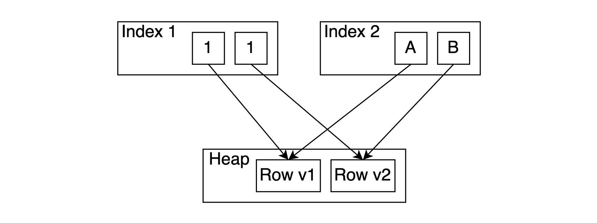
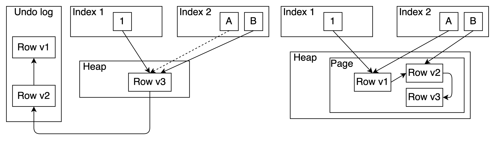
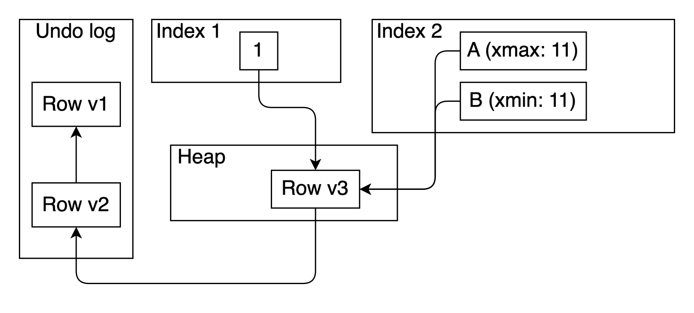
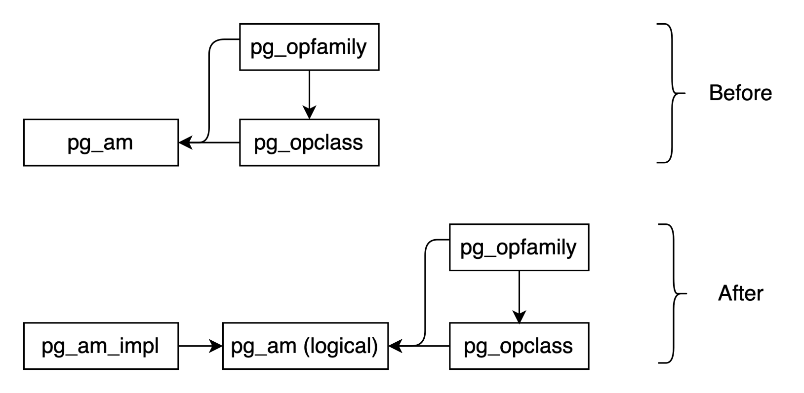

## OrioleDB, 更好的PostgreSQL TAM(存储引擎)  
      
### 作者      
digoal      
      
### 日期      
2025-03-28     
      
### 标签      
PostgreSQL , PolarDB , DuckDB , OrioleDB , mvcc , 写放大 , undo log     
      
----      
      
## 背景    
OrioleDB正在开发一种新的表访问方法(Table Access Method, TAM)，旨在解决PostgreSQL现有heap访问方法的一些根本性限制。  
  
PostgreSQL HEAP 表引擎最需要的功能是：  
- 1 替代的 MVCC 实现，例如基于 UNDO 日志的存储。提供此功能的动机在Uber 博客文章、Andy Pavlo 博客文章和许多其他来源中得到了充分讨论。还有来自digoal的 [《DB吐槽大会,第1期 - PG MVCC》](../202108/20210823_07.md)  虽然digoal以前也力挺PG: [《为PostgreSQL讨说法 - 浅析《UBER ENGINEERING SWITCHED FROM POSTGRES TO MYSQL》》](../201607/20160728_01.md)    
- 2 非堆式存储。例如，在索引组织表中，索引不是表的可选附加功能（可加快请求速度），而是表存储内部使用的必要层。因此，表元组是复杂数据结构的一部分，不能通过页码和偏移量号等固定长度的地址来寻址。它需要通过索引键等可变长度的标识符来寻址。    
  
### OrioleDB 核心观点  
  
OrioleDB正在开发一种新的表访问方法(Table Access Method, TAM)，旨在解决PostgreSQL现有heap访问方法的一些根本性限制。  
  
### PostgreSQL heap table 的问题  
  
1. **堆元组格式限制**：PostgreSQL传统的堆元组(Heap Tuple)格式存在多个问题：  
   - 固定头部开销(23字节)  
   - 无法有效处理宽列(超过约2kB的列)  
   - 缺乏原生的列压缩支持  
   - 更新操作产生大量写放大. (更新时产生wal. 垃圾回收时又产生wal. 如果不是HOT的话更新后索引要插入新版本, 垃圾回收时还需要清理索引内的无效指向. 清理前索引扫描还会性能下降, 因为有无效指向. 这些所有和WAL相关的操作还会增加备份负担、增加同步流复制负担、增加归档负担.)    
  
2. **索引扫描效率**：当前系统在索引扫描时需要多次访问表存储(heap)，导致性能瓶颈。  
  
## OrioleDB的解决方案  
  
1. **新的元组格式**：  
   - 更紧凑的头部设计(可减少到5字节)  
   - 支持列式存储和压缩  
   - 为不同访问模式优化的多种存储格式. 行列混合存储, 用来分析的列使用列存储, 用于tp的高并发查询多字段值采用行存.   
  
2. **索引组织表(IOT)**特性：  
   - 主键索引直接包含表数据，避免二次查找. 类似include columns, 覆盖索引.   
   - 支持"仅索引扫描"(index-only scan)更多场景  
  
3. **混合存储模型**：  
   - 结合行存和列存优势  
   - 自动选择最佳存储格式  
   - 支持部分列更新而不重写整个元组. 行列混合存储的好处, 不用copy整个tuple 作为new version或old version.   
  
### 技术细节  
  
1. **undo日志集成**：将undo日志直接嵌入元组格式，提高事务处理效率。  
  
2. **内存管理改进**：更智能的缓冲策略，减少不必要的I/O。  
  
3. **并行处理优化**：新格式更适合现代多核CPU的并行处理。  
  
### 预期收益  
  
1. 显著减少CPU缓存未命中  
2. 降低I/O操作数量  
3. 提高压缩效率  
4. 更好的SSD适配性  
  
### OrioleDB 项目当前状态  
  
该项目仍在积极开发中，但已显示出在TPC-C等基准测试中的显著性能提升。  
  
  
## 原文  
https://www.orioledb.com/blog/better-table-access-methods  
  
长期以来，PostgreSQL 一直拥有一个可扩展的索引访问方法 API（称为 AM），它经受住了时间的考验，并允许许多强大的扩展提供自己的索引类型。例如：rum、pgvector、bloom、zombodb等。PostgreSQL 12 引入了 Table AM API，承诺为表访问方法提供同等的灵活性。  
  
尽管 PostgreSQL 的 Table AM API 从版本 12 开始就可用，并且其内置存储引擎（特别是 MVCC 模型）不断受到批评，但令人惊讶的是，还没有功能齐全的事务存储引擎纯粹作为扩展出现。  
  
由于Table AM 和Index AM API 紧密耦合，因此这对于两种实现来说都是一个问题。  
  
替代 PostgreSQL HEAP 表引擎最需要的功能是：  
- 1 替代的 MVCC 实现，例如基于 UNDO 日志的存储。提供此功能的动机在Uber 博客文章、Andy Pavlo 博客文章和许多其他来源中得到了充分讨论。还有来自digoal的 [《DB吐槽大会,第1期 - PG MVCC》](../202108/20210823_07.md)  虽然digoal以前也力挺PG: [《为PostgreSQL讨说法 - 浅析《UBER ENGINEERING SWITCHED FROM POSTGRES TO MYSQL》》](../201607/20160728_01.md)    
- 2 非堆式存储。例如，在索引组织表中，索引不是表的可选附加功能（可加快请求速度），而是表存储内部使用的必要层。因此，表元组是复杂数据结构的一部分，不能通过页码和偏移量号等固定长度的地址来寻址。它需要通过索引键等可变长度的标识符来寻址。  
  
提供 2 的 API 扩展或多或少是可以理解的。这可以通过在所有 API 中用任意字节序列替换ctid来实现。但是，1 似乎相当复杂，需要很多澄清。  
  
OrioleDB是说明更改TAM和IAM API 动机的一个示例。它是一种扩展，提供我们开发的TAM，用于解决内置存储引擎的许多众所周知的缺点。但是，OrioleDB 还不是嵌入式扩展；它仅需要对 PostgreSQL Core 进行几个修补。  
  
除了下面将要讨论的这两件事之外，还有许多需要进一步改进的 API，例如指针弯曲和替代 WAL 日志记录，这些超出了本文的讨论范围。  
  
### 替代 MVCC  
表 AM API 不会直接强制 MVCC 的实现方式。不过，索引 AM 和表 AM API 做出了以下假设：每个 TID 要么被所有索引编入索引，要么根本没有编入索引。即使索引 AM 对单个 TID 有多个引用（如 GIN），所有这些引用也应该对应于相同的索引值。  
  
当前堆：所有行版本都是所有索引的索引  
  
    
  
这一原则因存在写放大而受到批评。如果你更新一个索引属性，你必须将其插入到每个索引中。另外，如果我们想充分利用 undo log 的优势或构建其他无写放大的存储方法（例如 WARM 技术），我们必须打破这一假设。  
  
说明：只有更改的属性在更新时才会使用 WARM 或撤消日志(UNDO LOG)进行索引  
  
    
  
不违背这一假设的撤消访问方法与现有的HOT技术(减少写放大)非常相似，只是旧行版本存储在撤消日志(UNDO LOG)中，并且不必适合同一页。在我看来，这并不是 TAM 的合理之处。  
  
让我们看看这个假设在 API 级别是如何实际执行的。  
  
1、在更新表行期间，索引以全有或全无的方式更新。表 AM 更新方法的签名如下：实现只能设置 的值 `update_indexes`。  
```  
/* see table_tuple_update() for reference about parameters */  
    TM_Result   (*tuple_update) (Relation rel,  
                                 ItemPointer otid,  
                                 TupleTableSlot *slot,  
                                 CommandId cid,  
                                 Snapshot snapshot,  
                                 Snapshot crosscheck,  
                                 bool wait,  
                                 TM_FailureData *tmfd,  
                                 LockTupleMode *lockmode,  
                                 TU_UpdateIndexes *update_indexes);  
```  
  
相应的枚举完全是全有或全无的，除非有一个特殊值来处理BRIN。即使我们为这个枚举添加另一个特殊值，目前仍然没有地方存储每个索引的索引更新策略  
```  
/*  
 * Result codes for table_update(..., update_indexes*..).  
 * Used to determine which indexes to update.  
 */  
typedef enum TU_UpdateIndexes  
{  
/* No indexed columns were updated (incl. TID addressing of tuple) */  
    TU_None,  
  
/* A non-summarizing indexed column was updated, or the TID has changed */  
    TU_All,  
  
/* Only summarized columns were updated, TID is unchanged */  
    TU_Summarizing,  
} TU_UpdateIndexes;  
```  
  
2、索引 AM API 中缺少“点删除”方法来删除特定元组。目前，我们可以使用 `ambulkdelete` 和 `amvacuumcleanup` 方法批量从索引中删除元组。是否删除特定 TID 是通过调用回调来确定的（见下图）。这会导致效率低下，因为大多数当前实现都必须扫描整个索引。此外，从一个 TID 可以引用的几个元组中，该方法无法选择应该删除哪一个。它只能删除所有元组。  
```  
/* Typedef for callback function to determine if a tuple is bulk-deletable */  
typedef bool (*IndexBulkDeleteCallback) (ItemPointer itemptr, void *state);  
  
/* bulk delete */  
typedef IndexBulkDeleteResult *(*ambulkdelete_function) (IndexVacuumInfo *info,  
                                                         IndexBulkDeleteResult *stats,  
                                                         IndexBulkDeleteCallback callback,  
                                                         void *callback_state);  
  
/* post-VACUUM cleanup */  
typedef IndexBulkDeleteResult *(*amvacuumcleanup_function) (IndexVacuumInfo *info,  
                                                            IndexBulkDeleteResult *stats);  
```  
  
3、如前所述，索引当前通过块号和偏移号引用表行。并且只有11 位偏移号可以安全地从表 TID 传输到所有索引访问方法。但是，替代的 MVCC 实现可能需要将额外的有效负载与 TID 一起存储。我们需要一个或几个位来实现“删除标记”索引甚至完整的可见性信息。  
  
让我们看看如何克服这个限制。一般来说，我认为有两种方法可以做到这一点。  
  
#### 方法 1：Index AM 为替代的 MVCC  
虽然表 AM 仍然负责所有的 MVCC 内容，但是索引 AM 为替代的 MVCC 实现提供了必要的设施，包括自定义有效负载与 TID 一起存储、“点删除”方法，甚至“点更新”方法（如果索引中的 TID 无法更改，则自定义有效负载肯定可以更改）。  
  
由于我们应该允许多个索引元组引用同一个 TID，因此我们必须在从表 AM 中获取相应元组时提供更多信息。也就是说，我们可能需要传递索引值，以便 `index_fetch_tuple` 使用表行版本重新检查它们。  
```  
    bool        (*index_fetch_tuple) (struct IndexFetchTableData *scan,  
                                      ItemPointer tid,  
                                      Snapshot snapshot,  
                                      TupleTableSlot *slot,  
                                      bool *call_again, bool *all_dead);  
```  
  
对于基于撤消(UNDO)的存储，许多行版本可以驻留在同一个 TID 中，位图扫描可能可以“按原样”工作。不过，它可能会得到更多的误报。但如果我们想允许类似 WARM 的东西，最好为表 AM 提供一种重新定义位图扫描的方法。这已经是可能的了 `set_rel_pathlist_hook`，但零售方式会更好。  
  
#### 方法 2：MVCC 感知  
另一种方法是允许 MVCC 感知索引。也就是说，执行器（或可以说是表 AM）只调用索引 AM insert() 和 delete() 方法，而索引 AM 提供 MVCC 感知扫描。这将使仅索引扫描变得更加简单。甚至整个表 AM 都可以是一个中间层，将数据存储在索引中并提供索引组织表。  
  
有人可能会说 MVCC 信息可能会给索引带来很大的负担。但是，我们应该记住，索引在压缩这些信息方面有更大的自由度。也就是说，当页面上的所有元组都需要标记为已更新/已删除时，堆必须为最坏情况保留空间。相比之下，索引可以在平均情况下优化存储，而在最坏情况下进行页面拆分  
  
下图给出了示例。事务 11 将索引 2 的值从值 A 更新为值 B。因此，值 A 标记为 xmax == 11，值 B 标记为 xmin == 11。这些值允许扫描索引 2 并根据快照仅获取可见匹配，而无需检查堆。索引 2 的垃圾收集也可以在不检查堆的情况下执行。另外，请注意，我们不需要为值 A 的 xmin 和值 B 的 xmax 保留空间，因为我们可以在需要时执行页面拆分。  
  
图示：MVCC 感知索引的性能  
  
    
  
### 分裂指数  
上述讨论强调，改进 PostgreSQL 的索引 AM API 以适应新的存储模型需要的不仅仅是渐进式的更改。鉴于现有的索引 AM 与运算符系列、类和规划器启发式算法紧密交织在一起，并且实现假设物理元组标识符 (TID) 模型，因此无法使用替代 MVCC 实现或索引组织表所需的功能来增强它们。为了保持所有现有索引和表功能不变，更可持续的方法是将索引 AM 拆分为两个不同的层：  
  
1、逻辑索引 AM。该层将充当与现有实体（例如运算符系列和运算符类）交互的抽象边界，公开查询规划器所需的信息并继承现有的规划器技巧。  
  
2、索引 AM 实现。此层负责索引的实际实现，包括索引页面布局、插入/删除/搜索算法等。特定实现提供诸如 MVCC 感知、对任意行标识符的支持等属性。  
  
下图说明了建议的分离。逻辑索引 AM 与 PostgreSQL 的核心（操作符系列、规划器等）交互，而索引 AM 实现封装了实际的索引逻辑和存储细节。  
  
图：将 pg_am 拆分为两个新实体  
  
    
  
例如，使用此设计扩展可以定义新的索引 AM 和 MVCC 感知 B 树实现（在 pg_am_impl 中定义）。通过 pg_am，它将重用所有现有的运算符类/系列、规划器黑客等。此 MVCC 感知 B 树将经过定制，以服务于此扩展中定义的基于撤消的表 AM。  
  
虽然 PostgreSQL 现有的表和索引 AM API 多年来一直为社区提供良好的服务，但对替代存储引擎和 MVCC 实现的需求暴露了其当前设计中固有的局限性。从全有或全无的更新机制到基于 TID 的索引的僵化，所讨论的挑战强调了需要一种更灵活、更细致入微的方法。我们可以从支持完全支持 MVCC 的索引或扩展索引 AM 以支持替代的 MVCC 策略开始。此外，将索引 AM 分为逻辑层和实现层的提议是一个有前途的方向，它不仅解决了当前的限制，而且为未来的创新奠定了基础。这种重新构想的架构可以使 PostgreSQL 支持多种存储模型，减少写入放大，并提高整体系统性能，最终为更模块化、可扩展和强大的数据库生态系统打开大门。  
  
  
  
#### [期望 PostgreSQL|开源PolarDB 增加什么功能?](https://github.com/digoal/blog/issues/76 "269ac3d1c492e938c0191101c7238216")
  
  
#### [PolarDB 开源数据库](https://openpolardb.com/home "57258f76c37864c6e6d23383d05714ea")
  
  
#### [PolarDB 学习图谱](https://www.aliyun.com/database/openpolardb/activity "8642f60e04ed0c814bf9cb9677976bd4")
  
  
#### [PostgreSQL 解决方案集合](../201706/20170601_02.md "40cff096e9ed7122c512b35d8561d9c8")
  
  
#### [德哥 / digoal's Github - 公益是一辈子的事.](https://github.com/digoal/blog/blob/master/README.md "22709685feb7cab07d30f30387f0a9ae")
  
  
#### [About 德哥](https://github.com/digoal/blog/blob/master/me/readme.md "a37735981e7704886ffd590565582dd0")
  
  

  
