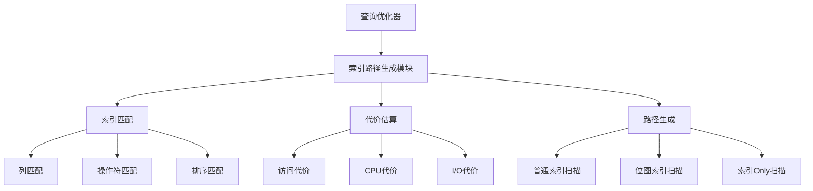
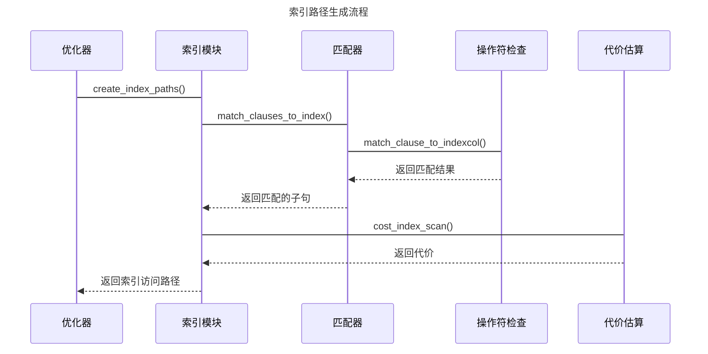
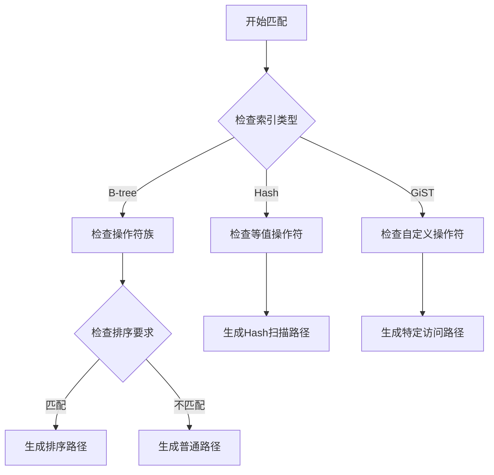

## AI辅助 PolarDB内核学习 - 17 path(路径生成) 之 索引路径生成(indxpath.c)代码        
  
### 作者          
digoal          
          
### 日期          
2025-03-28          
          
### 标签          
PostgreSQL , PolarDB , DuckDB , AI , 内核 , 学习 , path , 路径生成 , indxpath.c , 索引路径生成  
          
----          
          
## 背景    
  
## 解读path(路径生成)之索引路径生成(indxpath.c)代码     
  
我将从多个角度深入解析 indxpath.c 这个文件。这是 PostgreSQL/PolarDB 中负责索引路径生成的核心代码。  
  
## 1. 架构师视角  
  
从架构设计角度看,这个模块主要解决以下核心问题:  
  

  
核心设计决策:  
  
1. 索引匹配策略  
- 采用分层匹配:先匹配列,再匹配操作符,最后匹配排序需求  
- 支持多种匹配模式:精确匹配、范围匹配、排序匹配等  
- 通过操作符族(operator family)实现跨类型的操作符匹配  
  
2. 代价模型设计    
- 考虑多个维度:CPU代价、I/O代价、缓存命中等  
- 支持并行执行的代价估算  
- 支持参数化扫描的代价估算  
  
3. 扩展性设计  
- 提供钩子函数支持自定义索引访问方法  
- 支持自定义操作符族  
- 支持自定义代价估算函数  
  
## 2. 内核开发者视角  
  
### 2.1 核心数据结构  
  
```c  
// 索引子句  
typedef struct IndexClause {  
    RestrictInfo *rinfo;    // 原始约束条件  
    List *indexquals;       // 索引条件  
    bool lossy;             // 是否有损  
    int indexcol;           // 索引列号  
    List *indexcols;        // 涉及的所有索引列  
} IndexClause;  
  
// 索引子句集合  
typedef struct IndexClauseSet {  
    bool nonempty;          // 是否非空  
    List *indexclauses[INDEX_MAX_KEYS]; // 每列的索引子句  
} IndexClauseSet;  
```  
  
### 2.2 关键流程  
  
#### 索引路径生成主流程:  
  

  
#### 关键函数解析  
  
1. create_index_paths()  
```c  
void create_index_paths(PlannerInfo *root, RelOptInfo *rel)  
{  
    // 1. 收集限制条件  
    // 2. 为每个索引生成访问路径  
    // 3. 生成位图扫描路径  
    // 4. 生成索引Only扫描路径  
}  
```  
  
示例:  
```sql  
CREATE INDEX idx_user_name ON users(name);  
  
-- 以下查询会触发索引路径生成  
SELECT * FROM users WHERE name = 'Alice';  
```  
  
2. match_clause_to_indexcol()  
```c  
static IndexClause *  
match_clause_to_indexcol(PlannerInfo *root,  
                         RestrictInfo *rinfo,  
                         int indexcol,  
                         IndexOptInfo *index)  
{  
    // 1. 检查操作符是否支持索引扫描  
    // 2. 检查操作数是否匹配索引列  
    // 3. 生成索引条件  
}  
```  
  
## 3. DBA视角  
  
### 3.1 索引选择建议  
  
1. 基于代码中的匹配逻辑,建议:  
  
- 选择合适的索引列顺序  
```sql  
-- 好的设计  
CREATE INDEX idx_user_age_name ON users(age, name);  
  
-- 常用查询  
SELECT * FROM users WHERE age = 20 AND name LIKE 'A%';  
```  
  
- 注意操作符族的选择  
```sql  
-- 支持字符串模式匹配的操作符族  
CREATE INDEX idx_text_pattern ON articles USING gin (content gin_trgm_ops);  
```  
  
2. 基于代价估算逻辑,建议:  
  
- 考虑选择性  
- 考虑数据分布  
- 考虑更新开销  
  
### 3.2 性能调优建议  
  
1. 参数调优  
```sql  
-- 调整索引扫描代价因子  
SET random_page_cost = 1.1;    
SET cpu_index_tuple_cost = 0.005;  
```  
  
2. 统计信息维护  
```sql  
-- 保持统计信息准确  
ANALYZE users;  
```  
  
## 4. 应用开发者视角  
  
### 4.1 查询编写建议  
  
1. 索引友好的查询模式:  
  
```sql  
-- 好的写法  
SELECT * FROM orders   
WHERE order_date >= '2023-01-01'   
  AND order_date < '2024-01-01'  
ORDER BY order_date;  
  
-- 不友好的写法  
SELECT * FROM orders   
WHERE extract(year from order_date) = 2023;  
```  
  
2. 利用索引Only扫描:  
  
```sql  
-- 可以使用索引Only扫描  
CREATE INDEX idx_user_name_email ON users(name, email);  
SELECT name, email FROM users WHERE name = 'Alice';  
```  
  
### 4.2 常见陷阱  
  
1. 隐式类型转换  
```sql  
-- 错误:会导致索引无法使用  
WHERE user_id = '123'  -- user_id是integer类型  
  
-- 正确  
WHERE user_id = 123  
```  
  
2. 函数应用  
```sql  
-- 错误:无法使用索引  
WHERE UPPER(name) = 'ALICE'  
  
-- 正确:使用函数索引  
CREATE INDEX idx_upper_name ON users(UPPER(name));  
```  
  
## 5. 深入解析关键算法  
  
### 5.1 索引匹配算法  
  

  
### 5.2 代价估算模型  
  
关键考虑因素:  
1. 选择性估算  
2. I/O代价  
3. CPU代价  
4. 并行度收益  
  
```python  
# 伪代码展示代价计算  
def calculate_index_cost(index, quals):  
    selectivity = estimate_selectivity(quals)  
    io_cost = random_page_cost * estimated_pages * selectivity  
    cpu_cost = cpu_index_tuple_cost * estimated_tuples * selectivity  
      
    if can_parallel:  
        total_cost = (io_cost + cpu_cost) / parallel_workers  
    else:  
        total_cost = io_cost + cpu_cost  
          
    return total_cost  
```  
  
这个模块的代码虽然复杂,但结构清晰,扩展性好。它是查询优化器中非常关键的一环,直接影响查询性能。理解这个模块对于数据库开发、调优和应用开发都很重要。  
  
  
## 提示  
```  
使用cursor   
  
@indxpath.c  
从数据库内核开发者、架构师、用户(应用开发者和DBA)多个角度通熟易懂的解读这个代码, 使用sequence、mermaid图表增加可读性, 使用恰当的例子增加对代码的解释. 关键内容请深入重点详细解释.   
  
长文本模式  
```      
            
## PolarDB & PostgreSQL 15 差异            
```        
git diff -u 50d3d22baba63613d1f1406b2ed460dc9b03c3fc f5e7493819e370d30ac2047c68c21c9fb03ce4a0 -- src/backend/optimizer/path/indxpath.c   
```        
             
差异分析待补充.          
          
<b> 以上内容基于DeepSeek、QwQ及诸多AI生成, 轻微人工调整, 感谢杭州深度求索人工智能、阿里云等公司. </b>          
          
<b> AI 生成的内容请自行辨别正确性, 当然也多了些许踩坑的乐趣, 毕竟冒险是每个男人的天性.  </b>          
  
  
  
#### [期望 PostgreSQL|开源PolarDB 增加什么功能?](https://github.com/digoal/blog/issues/76 "269ac3d1c492e938c0191101c7238216")
  
  
#### [PolarDB 开源数据库](https://openpolardb.com/home "57258f76c37864c6e6d23383d05714ea")
  
  
#### [PolarDB 学习图谱](https://www.aliyun.com/database/openpolardb/activity "8642f60e04ed0c814bf9cb9677976bd4")
  
  
#### [PostgreSQL 解决方案集合](../201706/20170601_02.md "40cff096e9ed7122c512b35d8561d9c8")
  
  
#### [德哥 / digoal's Github - 公益是一辈子的事.](https://github.com/digoal/blog/blob/master/README.md "22709685feb7cab07d30f30387f0a9ae")
  
  
#### [About 德哥](https://github.com/digoal/blog/blob/master/me/readme.md "a37735981e7704886ffd590565582dd0")
  
  

  
