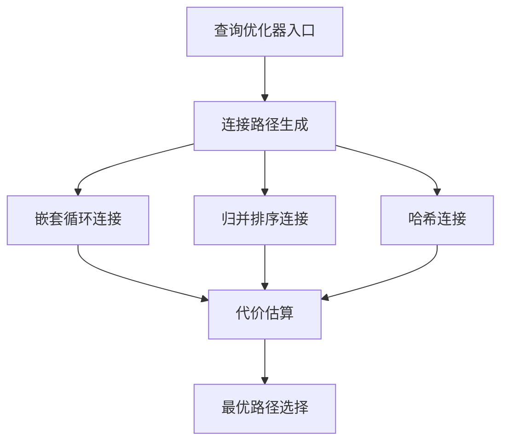
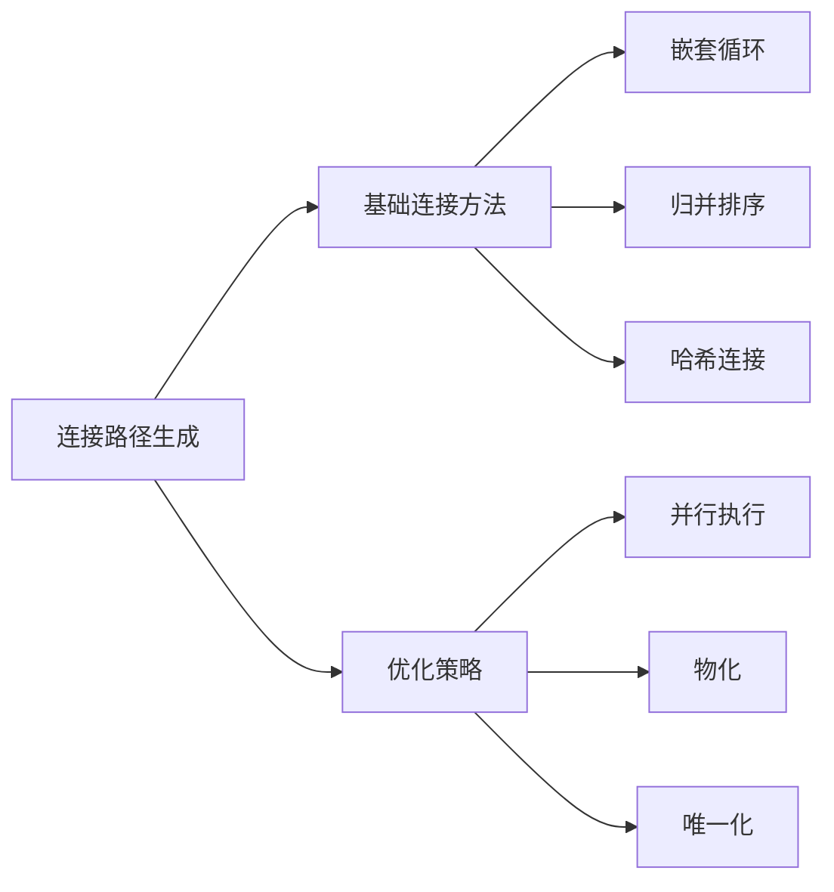
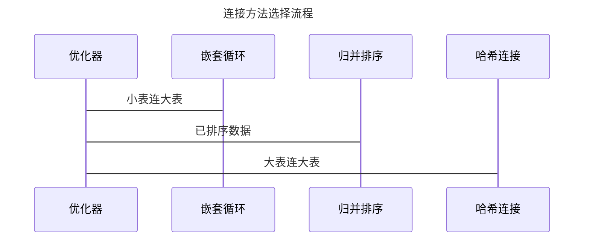
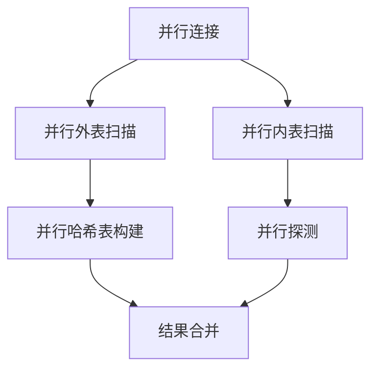

## AI辅助 PolarDB内核学习 - 18 path(路径生成) 之 连接路径生成(joinpath.c)代码          
    
### 作者            
digoal            
            
### 日期            
2025-03-28            
            
### 标签            
PostgreSQL , PolarDB , DuckDB , AI , 内核 , 学习 , path , 路径生成 , joinpath.c , 连接路径生成    
            
----            
            
## 背景      
    
## 解读path(路径生成)之连接路径生成(joinpath.c)代码       
    
我将从多个角度深入解析 joinpath.c 这个文件。这是 PostgreSQL/PolarDB 中实现关系连接路径生成的核心代码。  
  
## 1. 架构师视角  
  
### 整体架构  
  

  
核心组件:  
1. 连接路径生成器(JoinPath Generator)  
2. 代价估算器(Cost Estimator)   
3. 路径选择器(Path Selector)  
  
### 关键设计决策  
  
1. **模块化设计**  

  
2. **可扩展性**  
- 提供 hook 机制允许扩展连接路径生成  
- 支持自定义连接方法  
- 支持自定义代价估算  
  
3. **并行处理支持**  
- 支持并行嵌套循环连接  
- 支持并行归并排序连接  
- 支持并行哈希连接  
  
## 2. 内核开发者视角  
  
### 核心数据结构  
  
```c  
typedef struct JoinPathExtraData  
{  
    List *restrictlist;      // 连接条件  
    List *mergeclause_list;  // 可用于归并的条件  
    bool inner_unique;       // 内表是否唯一  
    SpecialJoinInfo *sjinfo; // 特殊连接信息  
} JoinPathExtraData;  
```  
  
### 关键算法实现  
  
1. **嵌套循环连接路径生成**  
```c  
static void try_nestloop_path(PlannerInfo *root,  
                            RelOptInfo *joinrel,  
                            Path *outer_path,  
                            Path *inner_path,  
                            List *pathkeys,  
                            JoinType jointype,  
                            JoinPathExtraData *extra)  
{  
    // 1. 检查参数化条件  
    // 2. 计算代价  
    // 3. 生成路径  
}  
```  
  
示例:  
```sql  
-- 嵌套循环连接示例  
SELECT * FROM users u, orders o   
WHERE u.id = o.user_id AND u.age > 20;  
```  
  
2. **归并排序连接路径生成**  
```c  
static void try_mergejoin_path(PlannerInfo *root,  
                             RelOptInfo *joinrel,  
                             Path *outer_path,   
                             Path *inner_path,  
                             List *pathkeys,  
                             List *mergeclauses,  
                             JoinType jointype,  
                             JoinPathExtraData *extra)  
{  
    // 1. 检查排序键  
    // 2. 计算排序代价  
    // 3. 生成路径  
}  
```  
  
示例:  
```sql  
-- 归并排序连接示例  
SELECT * FROM users u, orders o   
WHERE u.id = o.user_id   
ORDER BY u.id;  
```  
  
3. **哈希连接路径生成**  
```c  
static void try_hashjoin_path(PlannerInfo *root,  
                            RelOptInfo *joinrel,  
                            Path *outer_path,  
                            Path *inner_path,  
                            List *hashclauses,  
                            JoinType jointype,  
                            JoinPathExtraData *extra)  
{  
    // 1. 检查哈希条件  
    // 2. 计算哈希表代价  
    // 3. 生成路径  
}  
```  
  
## 3. DBA/应用开发者视角  
  
### 连接类型选择指南  
  

  
1. **适合使用嵌套循环连接的场景**:  
- 一个表很小(< 1000行)  
- 连接条件允许不是等值  
- 内表有索引  
  
```sql  
-- 适合嵌套循环的例子  
SELECT * FROM users u   
JOIN user_roles ur ON u.id = ur.user_id   
WHERE u.age > 20;  
-- user_roles 表较小且 user_id 有索引  
```  
  
2. **适合使用归并排序连接的场景**:  
- 数据已经按连接键排序  
- 需要排序结果  
- 内存受限  
  
```sql  
-- 适合归并排序的例子  
SELECT * FROM orders o   
JOIN order_items i ON o.id = i.order_id   
ORDER BY o.id;  
-- 两表都按 id 排序  
```  
  
3. **适合使用哈希连接的场景**:  
- 两个大表连接  
- 等值连接条件  
- 有足够内存建立哈希表  
  
```sql  
-- 适合哈希连接的例子  
SELECT * FROM orders o   
JOIN users u ON o.user_id = u.id;  
-- 两个大表的等值连接  
```  
  
### 性能优化建议  
  
1. **索引优化**  
- 为经常参与连接的列创建索引  
- 考虑覆盖索引减少回表  
  
2. **统计信息维护**  
- 定期更新统计信息确保优化器选择正确的连接方式  
- 监控连接执行情况  
  
3. **参数调优**  
```sql  
-- 控制连接方法选择  
SET enable_nestloop = on/off;  
SET enable_mergejoin = on/off;  
SET enable_hashjoin = on/off;  
  
-- 调整内存参数  
SET work_mem = '100MB';  -- 影响哈希表大小  
```  
  
## 4. 深入解析关键实现  
  
### 并行连接处理  

  
关键代码:  
```c  
static void try_partial_hashjoin_path(...)  
{  
    // 1. 检查并行安全性  
    if (!joinrel->consider_parallel)  
        return;  
          
    // 2. 估算并行度  
    // 3. 生成并行路径  
}  
```  
  
### 代价估算模型  
  
连接代价计算考虑因素:  
1. CPU代价  
2. I/O代价   
3. 内存使用  
4. 并行度  
  
示例:  
```c  
initial_cost_nestloop(root, &workspace, jointype,  
                     outer_path, inner_path, extra);  
```  
  
这个函数会计算:  
- 启动代价 = 外表启动代价 + 内表启动代价  
- 运行代价 = 外表扫描代价 + (外表行数 * 内表扫描代价)  
  
## 5. 最佳实践建议  
  
1. **连接优化原则**  
- 小表驱动大表  
- 利用索引减少扫描  
- 适当预排序  
  
2. **监控和诊断**  
```sql  
-- 查看连接执行计划  
EXPLAIN ANALYZE SELECT ...  
  
-- 监控连接执行状态  
SELECT * FROM pg_stat_activity   
WHERE query LIKE '%JOIN%';  
```  
  
3. **常见问题处理**  
- 连接性能差 -> 检查统计信息、索引  
- 内存溢出 -> 调整work_mem  
- CPU负载高 -> 考虑并行执行  
    
    
## 提示    
```    
使用cursor     
    
@joinpath.c    
从数据库内核开发者、架构师、用户(应用开发者和DBA)多个角度通熟易懂的解读这个代码, 使用sequence、mermaid图表增加可读性, 使用恰当的例子增加对代码的解释. 关键内容请深入重点详细解释.     
    
长文本模式    
```        
              
## PolarDB & PostgreSQL 15 差异              
```          
git diff -u 50d3d22baba63613d1f1406b2ed460dc9b03c3fc f5e7493819e370d30ac2047c68c21c9fb03ce4a0 -- src/backend/optimizer/path/joinpath.c     
```          
               
差异分析待补充.            
            
<b> 以上内容基于DeepSeek、QwQ及诸多AI生成, 轻微人工调整, 感谢杭州深度求索人工智能、阿里云等公司. </b>            
            
<b> AI 生成的内容请自行辨别正确性, 当然也多了些许踩坑的乐趣, 毕竟冒险是每个男人的天性.  </b>            
    
  
#### [期望 PostgreSQL|开源PolarDB 增加什么功能?](https://github.com/digoal/blog/issues/76 "269ac3d1c492e938c0191101c7238216")
  
  
#### [PolarDB 开源数据库](https://openpolardb.com/home "57258f76c37864c6e6d23383d05714ea")
  
  
#### [PolarDB 学习图谱](https://www.aliyun.com/database/openpolardb/activity "8642f60e04ed0c814bf9cb9677976bd4")
  
  
#### [PostgreSQL 解决方案集合](../201706/20170601_02.md "40cff096e9ed7122c512b35d8561d9c8")
  
  
#### [德哥 / digoal's Github - 公益是一辈子的事.](https://github.com/digoal/blog/blob/master/README.md "22709685feb7cab07d30f30387f0a9ae")
  
  
#### [About 德哥](https://github.com/digoal/blog/blob/master/me/readme.md "a37735981e7704886ffd590565582dd0")
  
  

  
