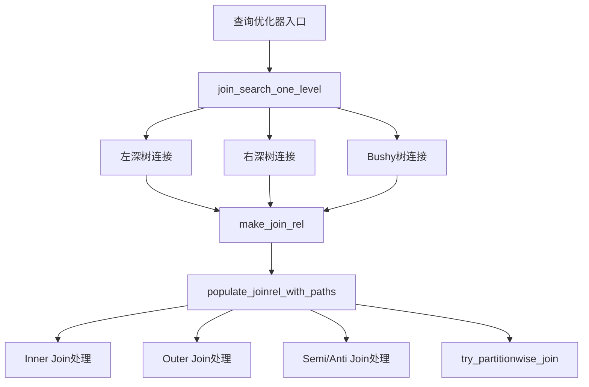
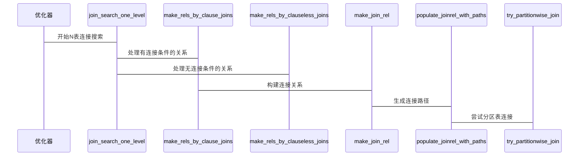
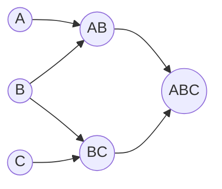

## AI辅助 PolarDB内核学习 - 19 path(路径生成) 之 连接对象(joinrels.c)代码            
      
### 作者              
digoal              
              
### 日期              
2025-03-28              
              
### 标签              
PostgreSQL , PolarDB , DuckDB , AI , 内核 , 学习 , path , 路径生成 , joinrels.c , 连接对象        
              
----              
              
## 背景        
      
## 解读path(路径生成)之连接对象(joinrels.c)代码     
      
我将从多个角度深入解析 joinrels.c 这个文件。这是 PolarDB/PostgreSQL 中实现关系连接(Join)的核心代码。  
  
## 1. 架构师视角  
  
### 1.1 整体架构  
  

  
核心架构特点:  
  
1. 分层设计  
- 最上层是连接搜索策略  
- 中间层是连接关系构建  
- 底层是具体连接路径生成  
  
2. 模块化设计  
- 连接类型处理模块化  
- 分区表连接单独处理  
- 代价估算独立模块  
  
3. 可扩展性  
- 支持添加新的连接类型  
- 支持添加新的连接算法  
- 支持添加新的优化策略  
  
### 1.2 关键流程  
  

  
## 2. 内核开发者视角  
  
### 2.1 核心数据结构  
  
```c  
typedef struct RelOptInfo {  
    RelOptKind reloptkind;    // 基表/连接/上层连接  
    Relids relids;           // 包含的基表ID集合  
    List *pathlist;          // 可能的访问路径  
    Path *cheapest_total_path; // 总代价最优路径  
    bool consider_partitionwise_join; // 是否考虑分区连接  
    // ... 其他字段  
} RelOptInfo;  
  
typedef struct SpecialJoinInfo {  
    JoinType jointype;      // INNER/LEFT/FULL/SEMI/ANTI  
    Relids min_lefthand;    // 左侧最小关系集合  
    Relids min_righthand;   // 右侧最小关系集合  
    // ... 其他字段  
} SpecialJoinInfo;  
```  
  
### 2.2 关键函数解析  
  
#### join_search_one_level()  
  
这是连接搜索的核心函数,使用动态规划算法搜索最优连接顺序。  
  
```c  
void join_search_one_level(PlannerInfo *root, int level)  
{  
    // 1. 处理左深树连接  
    foreach(r, joinrels[level - 1]) {  
        if (has_join_restriction()) {  
            // 处理有连接条件的情况  
            make_rels_by_clause_joins();  
        } else {  
            // 处理无连接条件的情况  
            make_rels_by_clauseless_joins();   
        }  
    }  
  
    // 2. 处理bushy树连接  
    for (k = 2; k < level-2; k++) {  
        // 尝试不同大小的子树连接  
    }  
}  
```  
  
举例说明:  
```sql  
SELECT * FROM A, B, C, D   
WHERE A.id = B.id AND B.id = C.id AND C.id = D.id;  
```  
  
搜索过程:  
1. level=2: (A⋈B), (B⋈C), (C⋈D)  
2. level=3: ((A⋈B)⋈C), (A⋈(B⋈C)), ((B⋈C)⋈D)  
3. level=4: (((A⋈B)⋈C)⋈D), ((A⋈B)⋈(C⋈D))  
  
#### try_partitionwise_join()  
  
这是分区表连接的核心函数:  
  
```c  
static void try_partitionwise_join(PlannerInfo *root,   
                                 RelOptInfo *rel1,  
                                 RelOptInfo *rel2,  
                                 RelOptInfo *joinrel)  
{  
    // 1. 检查是否可以进行分区连接  
    if (!IS_PARTITIONED_REL(rel1) || !IS_PARTITIONED_REL(rel2))  
        return;  
          
    // 2. 计算分区边界  
    compute_partition_bounds();  
      
    // 3. 为每对匹配的分区创建连接  
    for (cnt_parts = 0; cnt_parts < joinrel->nparts; cnt_parts++) {  
        // 获取匹配的分区  
        child_rel1 = rel1->part_rels[cnt_parts];  
        child_rel2 = rel2->part_rels[cnt_parts];  
          
        // 创建分区连接  
        populate_joinrel_with_paths();  
    }  
}  
```  
  
举例:  
```sql  
-- 表按id范围分区  
CREATE TABLE orders (  
    id int,  
    info text  
) PARTITION BY RANGE (id);  
  
CREATE TABLE customers (  
    id int,   
    name text  
) PARTITION BY RANGE (id);  
  
-- 分区连接查询  
SELECT * FROM orders o JOIN customers c ON o.id = c.id;  
```  
  
## 3. 应用开发者/DBA视角  
  
### 3.1 优化建议  
  
1. 连接条件优化  
- 尽量提供等值连接条件  
- 连接列建议建立索引  
- 避免笛卡尔积  
  
2. 分区表使用  
- 相同分区策略便于分区连接  
- 分区键作为连接条件可提升性能  
- 合理的分区大小很重要  
  
3. 统计信息维护  
- 及时收集统计信息  
- 关注连接列的数据分布  
- 适当调整采样率  
  
### 3.2 性能监控  
  
关键指标:  
1. 连接算法选择(Hash/Merge/Nested Loop)  
2. 分区裁剪情况  
3. 并行度  
4. 内存使用  
  
示例:  
```sql  
EXPLAIN ANALYZE   
SELECT /*+ HASHJOIN */ *   
FROM orders o   
JOIN customers c ON o.id = c.id  
WHERE o.id > 1000;  
```  
  
## 4. 重点难点解析  
  
### 4.1 动态规划算法  
  

  
核心思想:  
1. 自底向上构建最优解  
2. 记忆化搜索避免重复计算  
3. 剪枝优化减少搜索空间  
  
### 4.2 分区连接处理  
  
关键点:  
1. 分区边界计算  
2. 分区匹配规则  
3. 并行执行策略  
  
### 4.3 特殊连接处理  
  
处理流程:  
1. OUTER JOIN空值处理  
2. SEMI JOIN重复消除  
3. ANTI JOIN补集计算  
  
## 5. 总结  
  
joinrels.c 实现了数据库中最复杂的查询优化功能之一。它通过:  
  
1. 分层模块化的架构设计  
2. 高效的动态规划算法  
3. 智能的分区连接处理  
4. 完善的特殊连接支持  
  
来实现高效的多表连接优化。理解和用好这些特性对于开发高性能数据库应用至关重要。  
  
      
## 提示      
```      
使用cursor       
      
@joinrels.c      
从数据库内核开发者、架构师、用户(应用开发者和DBA)多个角度通熟易懂的解读这个代码, 使用sequence、mermaid图表增加可读性, 使用恰当的例子增加对代码的解释. 关键内容请深入重点详细解释.       
      
长文本模式      
```          
                
## PolarDB & PostgreSQL 15 差异                
```            
git diff -u 50d3d22baba63613d1f1406b2ed460dc9b03c3fc f5e7493819e370d30ac2047c68c21c9fb03ce4a0 -- src/backend/optimizer/path/joinrels.c       
```            
                 
差异分析待补充.              
              
<b> 以上内容基于DeepSeek、QwQ及诸多AI生成, 轻微人工调整, 感谢杭州深度求索人工智能、阿里云等公司. </b>              
              
<b> AI 生成的内容请自行辨别正确性, 当然也多了些许踩坑的乐趣, 毕竟冒险是每个男人的天性.  </b>              
      
      
  
#### [期望 PostgreSQL|开源PolarDB 增加什么功能?](https://github.com/digoal/blog/issues/76 "269ac3d1c492e938c0191101c7238216")
  
  
#### [PolarDB 开源数据库](https://openpolardb.com/home "57258f76c37864c6e6d23383d05714ea")
  
  
#### [PolarDB 学习图谱](https://www.aliyun.com/database/openpolardb/activity "8642f60e04ed0c814bf9cb9677976bd4")
  
  
#### [PostgreSQL 解决方案集合](../201706/20170601_02.md "40cff096e9ed7122c512b35d8561d9c8")
  
  
#### [德哥 / digoal's Github - 公益是一辈子的事.](https://github.com/digoal/blog/blob/master/README.md "22709685feb7cab07d30f30387f0a9ae")
  
  
#### [About 德哥](https://github.com/digoal/blog/blob/master/me/readme.md "a37735981e7704886ffd590565582dd0")
  
  

  
