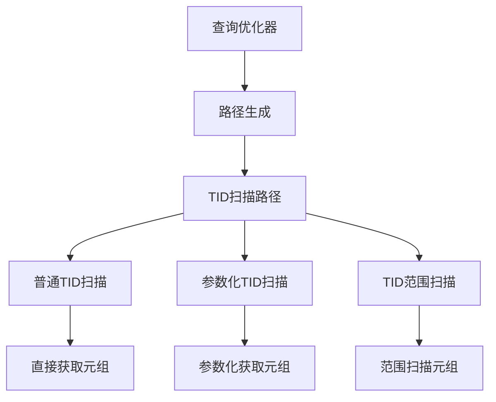
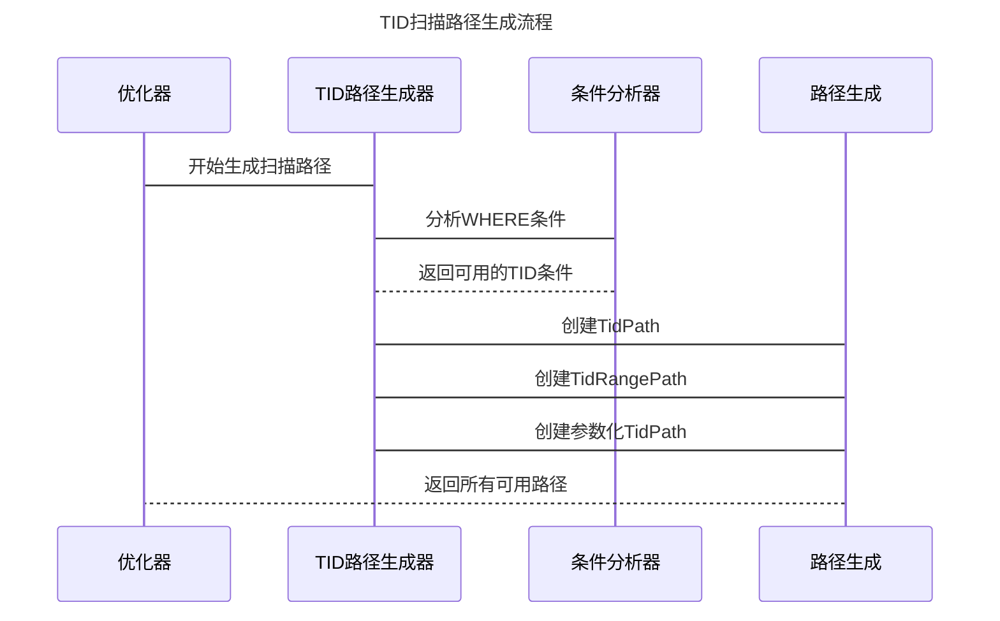
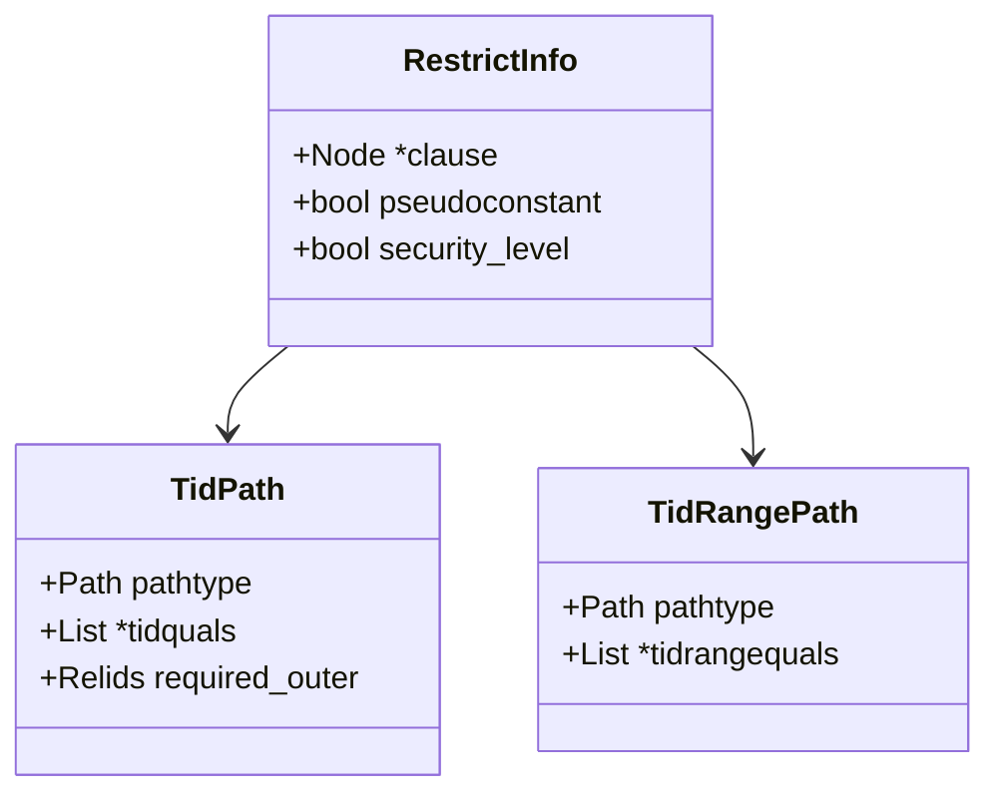
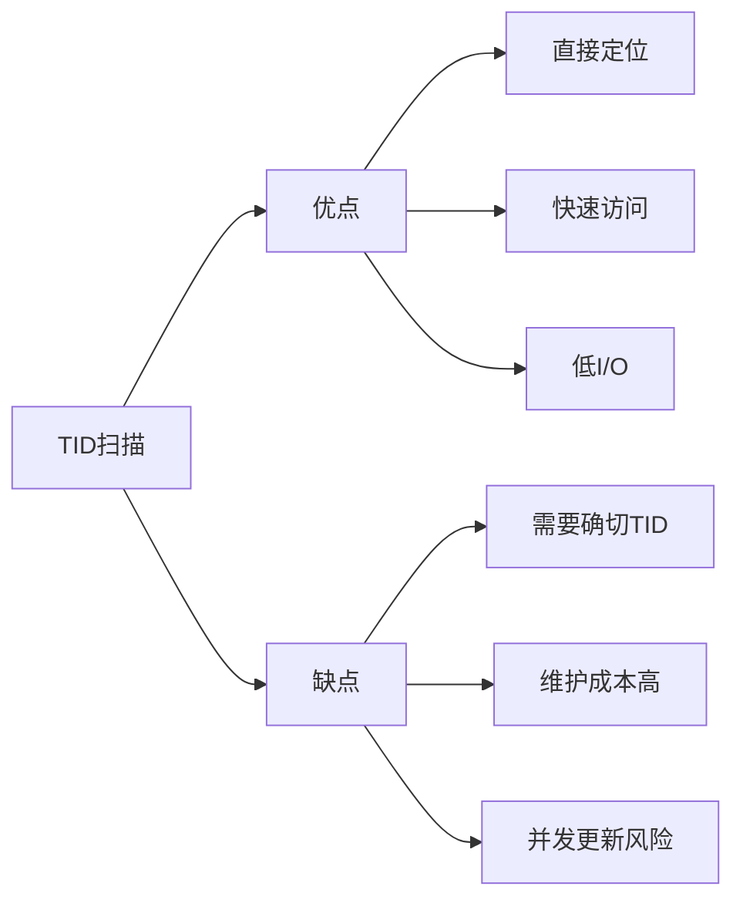
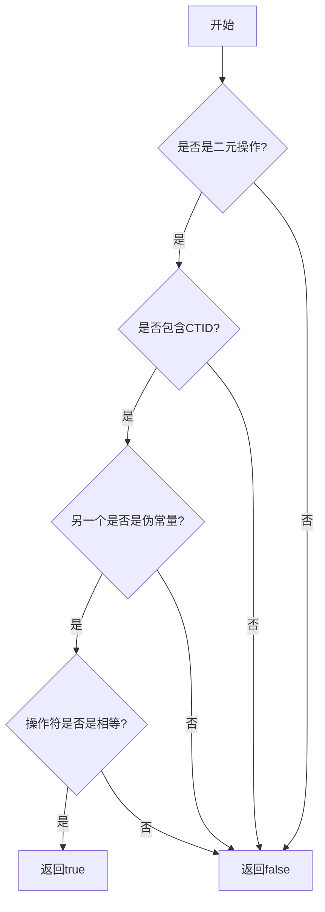

## AI辅助 PolarDB内核学习 - 20 path(路径生成) 之 TID扫描路径优化(tidpath.c)代码              
        
### 作者                
digoal                
                
### 日期                
2025-03-28                
                
### 标签                
PostgreSQL , PolarDB , DuckDB , AI , 内核 , 学习 , path , 路径生成 , tidpath.c , TID扫描路径优化 , 行号扫描 , 块级扫描      
                
----                
                
## 背景          
        
## 解读path(路径生成)之TID扫描路径优化(tidpath.c)代码      
        
我将从多个角度深入解析这段代码。TID是行号, 由blockNum和ItemPoint两部分组成, 表示tuple(行)在文件中所处的具体位置, 例如`(103,21)`表示第103号数据块内的第21行记录.    
  
## TID 扫描路径优化器代码解析  
  
### 1. 概述  
  
这段代码实现了 PostgreSQL/PolarDB 中的 TID (Tuple Identifier) 扫描路径优化。TID 是数据库中用于直接定位元组(行)的物理地址。  
  
### 2. 从架构师角度  
  
#### 2.1 整体设计  
  

  
#### 2.2 核心组件  
  
1. **TidPath**: 直接通过 TID 访问元组的执行路径  
2. **TidRangePath**: 通过 TID 范围条件扫描的执行路径  
3. **RestrictInfo**: 存储查询条件的数据结构  
  
#### 2.3 关键设计决策  
  

  
### 3. 从内核开发者角度  
  
#### 3.1 核心函数分析  
  
##### create_tidscan_paths  
```c  
void create_tidscan_paths(PlannerInfo *root, RelOptInfo *rel)  
```  
  
这是整个模块的入口函数，主要完成：  
1. 生成普通 TID 扫描路径  
2. 生成 TID 范围扫描路径  
3. 生成参数化 TID 扫描路径  
  
##### TidQualFromRestrictInfo  
```c  
static List *TidQualFromRestrictInfo(PlannerInfo *root,   
                                   RestrictInfo *rinfo,   
                                   RelOptInfo *rel)  
```  
  
分析单个限制条件是否可用于 TID 扫描：  
1. 检查是否是伪常量  
2. 检查安全性  
3. 匹配具体的条件类型  
  
#### 3.2 重要数据结构  
  

  
### 4. 从应用开发者/DBA角度  
  
#### 4.1 使用场景  
  
1. **直接访问已知 TID 的行**  
```sql  
SELECT * FROM mytable WHERE ctid = '(0,1)';  
```  
  
2. **批量访问多个 TID**  
```sql  
SELECT * FROM mytable WHERE ctid IN ('(0,1)', '(0,2)', '(0,3)');  
```  
  
3. **TID 范围扫描**  
```sql  
SELECT * FROM mytable WHERE ctid > '(0,1)' AND ctid < '(0,100)';  
```  
  
#### 4.2 性能特点  
  

  
#### 4.3 最佳实践  
  
1. **适用场景**:  
   - 需要快速访问特定行  
   - 已知行的精确位置  
   - 批量获取特定行  
  
2. **注意事项**:  
   - TID 在更新后可能变化  
   - 并发环境下需要特别注意  
   - 不适合作为业务主键  
  
### 5. 深入解析关键实现  
  
#### 5.1 条件匹配逻辑  
  
```c  
static bool IsTidEqualClause(RestrictInfo *rinfo, RelOptInfo *rel)  
```  
  
这个函数判断是否是 TID 相等条件：  
  

  
#### 5.2 参数化路径生成  
  
```c  
static void BuildParameterizedTidPaths(PlannerInfo *root,   
                                     RelOptInfo *rel,   
                                     List *clauses)  
```  
  
这个函数处理涉及连接的 TID 扫描：  
  
示例:  
```sql  
-- 参数化TID扫描的例子  
SELECT t1.* FROM table1 t1, table2 t2   
WHERE t1.ctid = t2.saved_tid;  
```  
  
#### 5.3 范围扫描实现  
  
范围扫描支持的操作符：  
- `>`  - TIDGreaterOperator  
- `>=` - TIDGreaterEqOperator  
- `<`  - TIDLessOperator  
- `<=` - TIDLessEqOperator  
  
### 6. 性能优化建议  
  
1. **索引选择**  
   - 当有 TID 条件时优先考虑 TID 扫描  
   - 与其他条件结合时需要成本评估  
  
2. **查询优化**  
   - 使用 EXPLAIN ANALYZE 分析执行计划  
   - 评估 TID 扫描的实际效果  
  
3. **并发控制**  
   - 注意 MVCC 对 TID 扫描的影响  
   - 考虑使用适当的隔离级别  
  
这段代码展示了数据库内核中查询优化器的精妙设计，通过合理的抽象和模块化，实现了高效的 TID 扫描路径生成。它既保证了功能的完整性，又提供了良好的扩展性。  
  
## 提示        
```        
使用cursor         
        
@tidpath.c       
从数据库内核开发者、架构师、用户(应用开发者和DBA)多个角度通熟易懂的解读这个代码, 使用sequence、mermaid图表增加可读性, 使用恰当的例子增加对代码的解释. 关键内容请深入重点详细解释.         
        
长文本模式        
```            
                  
## PolarDB & PostgreSQL 15 差异                  
```              
git diff -u 50d3d22baba63613d1f1406b2ed460dc9b03c3fc f5e7493819e370d30ac2047c68c21c9fb03ce4a0 -- src/backend/optimizer/path/tidpath.c    
```              
                   
差异分析待补充.                
                
<b> 以上内容基于DeepSeek、QwQ及诸多AI生成, 轻微人工调整, 感谢杭州深度求索人工智能、阿里云等公司. </b>                
                
<b> AI 生成的内容请自行辨别正确性, 当然也多了些许踩坑的乐趣, 毕竟冒险是每个男人的天性.  </b>                
        
  
#### [期望 PostgreSQL|开源PolarDB 增加什么功能?](https://github.com/digoal/blog/issues/76 "269ac3d1c492e938c0191101c7238216")
  
  
#### [PolarDB 开源数据库](https://openpolardb.com/home "57258f76c37864c6e6d23383d05714ea")
  
  
#### [PolarDB 学习图谱](https://www.aliyun.com/database/openpolardb/activity "8642f60e04ed0c814bf9cb9677976bd4")
  
  
#### [PostgreSQL 解决方案集合](../201706/20170601_02.md "40cff096e9ed7122c512b35d8561d9c8")
  
  
#### [德哥 / digoal's Github - 公益是一辈子的事.](https://github.com/digoal/blog/blob/master/README.md "22709685feb7cab07d30f30387f0a9ae")
  
  
#### [About 德哥](https://github.com/digoal/blog/blob/master/me/readme.md "a37735981e7704886ffd590565582dd0")
  
  

  
