## AI辅助 PolarDB内核学习 - 21 path(路径生成) 之 路径排序信息(pathkeys.c)代码                
          
### 作者                  
digoal                  
                  
### 日期                  
2025-03-28                  
                  
### 标签                  
PostgreSQL , PolarDB , DuckDB , AI , 内核 , 学习 , path , 路径生成 , pathkeys.c , 路径排序信息  
                  
----                  
                  
## 背景            
          
## 解读path(路径生成)之路径排序信息(pathkeys.c)代码      
          
我将从多个角度深入解析 pathkeys.c 这个关键文件。  
  
## PathKeys是什么  
  
PathKeys（路径键）  
--------  
  
PathKeys数据结构用于表示“通过特定Path生成的元组的排序顺序信息”。路径的pathkeys字段是一个由PathKey节点组成的列表，其中第n个元素代表结果的第n个排序键。每个PathKey包含以下字段：  
* 指向等价类(EquivalenceClass)的引用    
* 一个B树操作族OID（必须与等价类中的某个操作族匹配）    
* 排序方向（升序或降序）    
* 空值优先或空值最后标志位    
  
等价类表示被排序的值。由于根据操作族定义，等价类中的各个成员被认为是相等的，因此只要路径按其中任何一个成员排序，就可以视为也按其他成员排序——这正是我们引用整个等价类而不仅引用单个成员的依据。  
  
在单表/基础关系RelOptInfo中，Paths表示扫描关系的各种方式及其产生的元组排序。顺序扫描路径的pathkeys为NIL，表示没有已知的排序。索引扫描的Path.pathkeys表示所选索引的排序（如果存在）。单键索引会创建单PathKey列表，而多列索引会为每个键索引列生成一个对应的列表。覆盖索引INCLUDE子句中指定的非键列不会在列表中有对应的PathKeys，因为它们不影响索引排序。（实际上，由于索引可以正向或反向扫描，因此可能产生两种排序顺序和两种PathKey列表）  
  
需要注意的是，位图扫描的pathkeys为NIL，因为我们无法确定其结果的总体顺序。同样，在无序类型索引(例如bloom , gin index.)上的索引扫描也会生成NIL pathkeys。不过，我们总能通过显式排序来创建pathkey。Sort计划输出的pathkeys仅表示排序键字段和使用的排序操作符。  
  
考虑连接操作时情况会更有趣。假设我们使用合并连接条件A.X = B.Y对A和B执行合并连接(merge join)。合并连接的输出按X排序——但同时也按Y排序。这同样可以通过引用包含X和Y的等价类的PathKey来表示。  
  
进一步思考会发现，嵌套循环连接(nestloop join)也能产生有序输出。例如，如果对外部关系A和内部关系B执行嵌套循环连接，那么与A相关的任何pathkeys对连接结果仍然有效：我们没有改变来自A的元组顺序。更有趣的是，如果存在等价条件A.X=B.Y，且A.X是外部关系A的pathkey，那么我们可以断言B.Y也是连接结果的pathkey——X之前是有序的且现在仍然有序，而连接的Y值与连接的X值相等，因此Y现在也必须有序。即使我们没有对Y使用显式排序或合并连接，这个结论依然成立。（注意：哈希连接(hash join)不能保证保持外部关系的顺序，因为执行器可能决定"分批"处理连接，因此哈希连接路径的pathkeys总是设为NIL。例外：RIGHT或FULL连接不保持外部关系的顺序，因为它可能在排序中的任意位置插入空值。）  
  
总的来说，我们将等价类作为pathkeys的基础是合理的，因为每当扫描包含多个等价类成员的关系或连接两个各自包含等价类成员的关系时，我们都会应用源自该等价类的限制条件或连接子句。这保证了等价类中列出的任何两个值在扫描或连接产生的所有元组中实际相等，因此如果元组按其中一个值排序，也可以认为它们按其他值排序。无论测试子句是用作合并连接条件，还是仅作为qpqual过滤器事后执行，都不影响这一结论。  
  
需要注意的是，用引用尚未连接到路径输出的变量的等价类的PathKey来标记路径的排序顺序并不特别困难。我们可以暂时忽略这些不相关的条目。这使得在整个连接计划过程中使用相同的等价类成为可能。实际上，通过避免生成多个相同的PathKey对象，我们可以将等价类和PathKey的比较简化为简单的指针比较，这在add_path需要大量PathKey比较来判断竞争路径是否等效排序时能极大提升效率。  
  
PathKeys也可用于表示我们希望实现的排序顺序，因为它们很容易与候选路径的pathkeys进行比较。因此，SortGroupClause列表会被转换为优化器内部使用的pathkeys列表。  
  
我们可以做的另一个改进是要求规范化的pathkey列表（排序顺序）不重复提及同一个等价类。例如，在以下所有情况中，第二个排序列都是冗余的，因为它无法区分与第一个排序列相同的值：  
```  
	SELECT ... ORDER BY x, x    
	SELECT ... ORDER BY x, x DESC    
	SELECT ... WHERE x = y ORDER BY x, y    
```  
  
虽然用户不太可能直接写"ORDER BY x,x"，但一旦考虑等价类，这种冗余更可能出现。此外，系统在计算合并连接所需的排序顺序时也可能生成冗余的pathkey列表。通过消除冗余，我们节省了时间并改进了计划，因为规划器能更容易识别等效的排序顺序。  
  
另一个有趣的性质是：如果底层等价类包含常量且不在外连接之下，那么这个pathkey完全冗余，根本不需要排序！每行都必须包含相同的常量值，因此无需排序。（如果等价类在外连接之下，我们仍然需要排序，因为某些行可能变为null而其他行没有。这种情况下我们必须小心选择非常量成员进行排序。这里的关键假设是所有非常量成员在同一计划层级都变为null，否则它们可能不会产生相同的排序顺序。）这看起来可能没有意义，因为用户不太可能写"... WHERE x = 42 ORDER BY x"，但它让我们能识别特定索引列与排序顺序无关的情况：如果有"... WHERE x = 42 ORDER BY y"，扫描(x,y)上的索引就能产生正确排序的数据而无需排序步骤。过去我们用非常丑陋的特殊代码在有限场景中识别这种情况，但从pathkeys中丢弃常量等价类使这一过程变得清晰且自动。  
  
你可能反对说外连接之下的等价类在连接树的不同层级并不总是表示相同的值，因此用它唯一标识排序顺序是有问题的。确实如此，但我们可以避免显式处理这个问题，因为我们始终认为外连接会破坏其可空输入的任何排序。因此，即使路径在外连接之下按{a.x}排序，如果该排序很重要我们会重新排序；所以对两种排序使用相同的PathKey不会产生实际问题。  
  
  
等价类和路径键的处理顺序  
-------------------------------------------------------  
  
如前所述，在计划过程中处理等价类和PathKeys有特定的阶段顺序。在初始扫描查询条件时（deconstruct_jointree后接reconsider_outer_join_clauses），我们基于条件中找到的可合并连接子句构建等价类。这个过程结束时，我们已经掌握了关于不同变量等价关系的全部信息，因此后续不会再有等价类的合并。此时可以将等价类视为"规范化的"，并构建引用它们的规范化PathKeys。这时我们会为查询的ORDER BY及相关子句构建PathKeys。（任何未出现在其他地方的排序表达式将导致创建新的等价类，但这不会导致现有类合并，因此不会破坏规范化。）  
  
因为所有等价类在开始生成路径前就已确定，我们可以用它们指导哪些索引是有用的：如果某个索引的列没有在任何等价类中被提及，那么这个索引的排序顺序对查询不可能有帮助。这可以跳过create_index_paths()中对无关索引的大部分处理。  
  
在某些情况下，planner.c在query_planner完成后会构建额外的等价类和PathKeys。这些情况下，额外的等价类/PathKeys用于表示query_planner期间未考虑的排序顺序。应尽量减少这种情况，因为query_planner不可能返回产生这种排序顺序的计划，意味着总是需要显式排序。目前这种情况仅发生在涉及多个具有不同排序要求的窗口函数的查询中，这些查询本来就需要额外的排序。  
  
### 1. PathKeys基础结构  
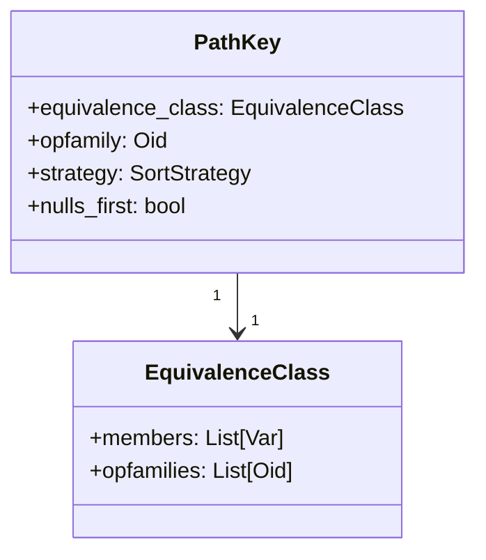
  
### 2. 索引扫描的PathKeys生成  
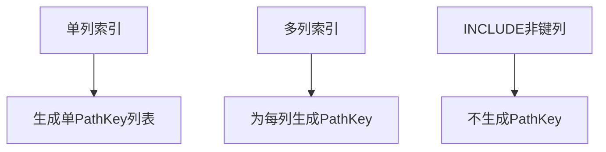
  
### 3. 合并连接保持排序的机制  

  
### 4. 嵌套循环连接保持外部表排序  
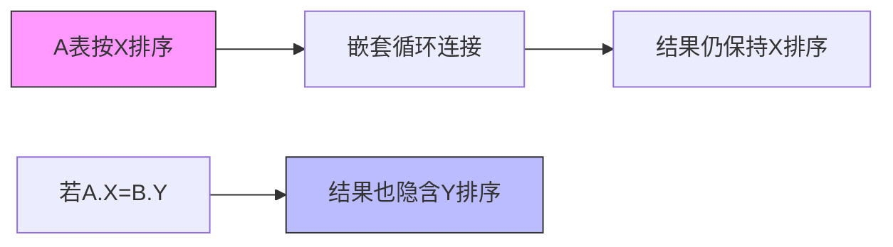
  
### 5. 冗余PathKey消除示例  
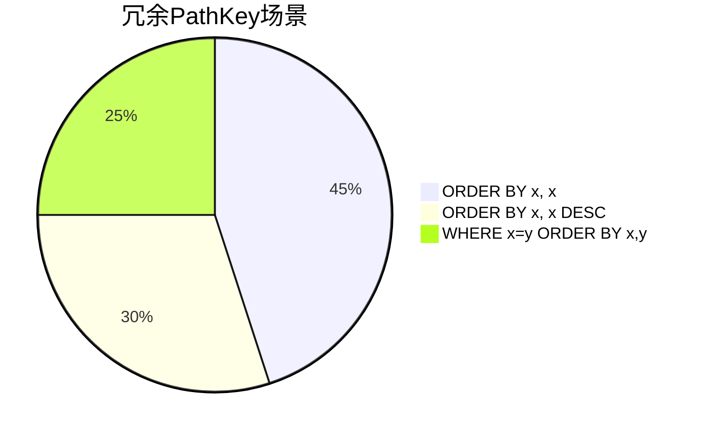
  
### 6. 常量等价类优化  
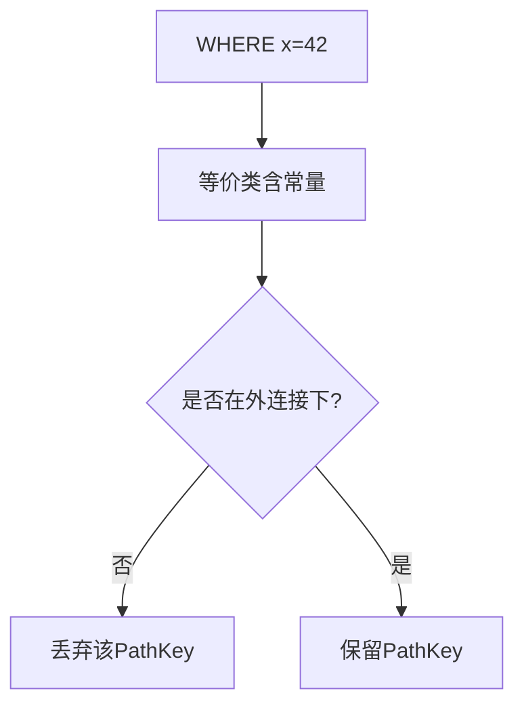
  
### 7. 计划阶段处理顺序  
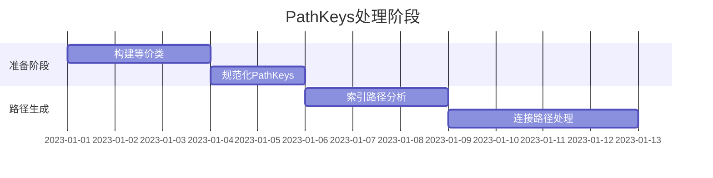
  
这些图表展示了：  
1. PathKey与等价类的组成关系  
2. 不同扫描方式如何生成PathKeys  
3. 连接操作如何传播排序属性  
4. 优化器如何消除冗余和利用常量条件  
5. 完整的处理流程阶段  
  
## PathKeys 有什么用?  
  
PathKeys 是 PostgreSQL 查询优化器的核心数据结构，主要用于 **描述和传递数据的排序属性**。它的核心作用可以总结为以下 5 个方面：  
  
  
### 1. **避免不必要的排序（最重要的优化）**  
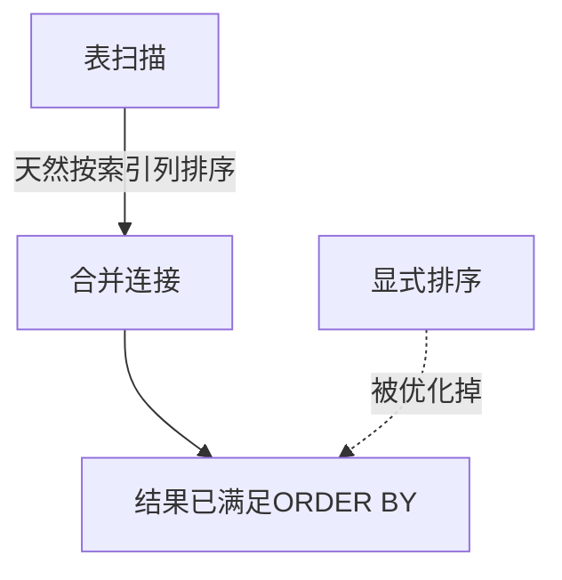
- 当 SQL 包含 `ORDER BY` 时，如果底层扫描或连接 **天然** 已经按目标列排序，则直接 **跳过排序操作**  
- 典型案例：索引扫描后直接返回数据，无需额外 `Sort` 节点  
  
  
### 2. **指导连接方法的选择**  
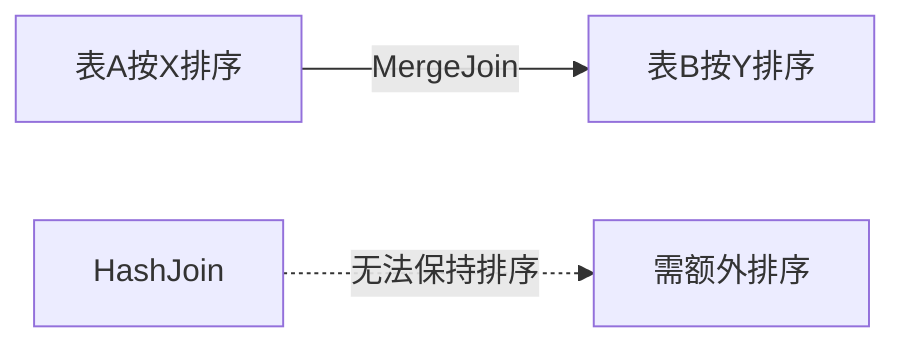
- **合并连接(MergeJoin)** 要求输入数据按连接键排序  
- PathKeys 帮助优化器识别哪些表已经具备所需排序，优先选择无需额外排序的连接方式  
  
  
### 3. **支持窗口函数的分组排序**  
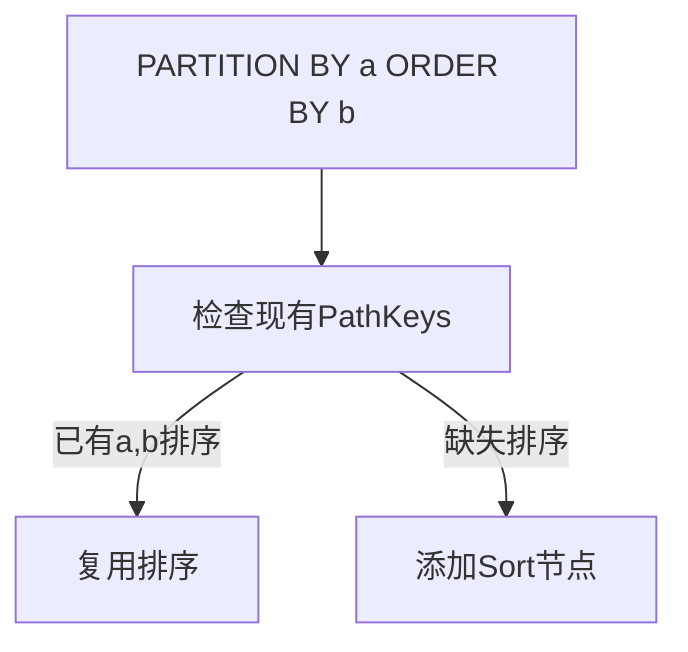
- 多个窗口函数可能共享相同的排序要求  
- PathKeys 帮助优化器 **合并相同的排序需求**，避免重复排序  
  
  
### 4. **识别常量排序的优化机会**  
```sql  
-- 优化器自动识别 WHERE x=42 使 ORDER BY x 成为无操作  
SELECT * FROM t WHERE x = 42 ORDER BY x;  
```  

  
  
### 5. **消除冗余排序键**  
```sql  
-- 优化器自动简化 ORDER BY x, x DESC 为 ORDER BY x  
SELECT * FROM t ORDER BY x, x DESC;  
```  
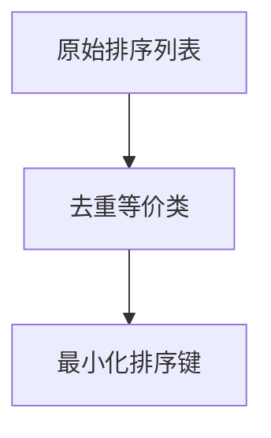
  
  
### 关键设计思想  
1. **基于等价类(EquivalenceClass)**    
   通过 `WHERE a=b` 等条件建立列的等价关系，使 `ORDER BY a` 也能满足 `ORDER BY b` 的需求  
  
2. **操作族(opfamily)感知**    
   明确排序规则适用的比较操作（如B-tree索引的排序规则）  
  
3. **显式排序方向**    
   精确记录 ASC/DESC 和 NULLS FIRST/LAST 属性  
  
  
### 实际执行示例  
```sql  
-- 假设存在索引 idx_xy(x,y)  
EXPLAIN SELECT * FROM t   
WHERE x = 10   
ORDER BY y;  
  
-- 优化器利用PathKeys发现：  
-- 1. WHERE x=10 使x排序无意义  
-- 2. 索引扫描天然按(x,y)排序  
-- 3. 直接使用索引，无需额外排序  
```  
  
PathKeys 本质上让优化器能够 **像人类一样理解数据流动时的排序状态**，从而做出更智能的决策。  
  
    
  
## PathKeys 详解 - PostgreSQL/PolarDB 排序优化核心机制  
  
## 1. 架构师视角  
  
### 1.1 PathKeys 的核心定位  
  
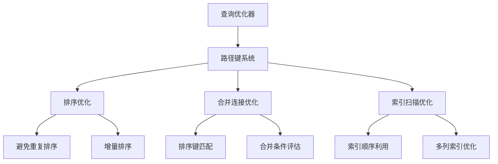
  
### 1.2 系统架构设计  
  
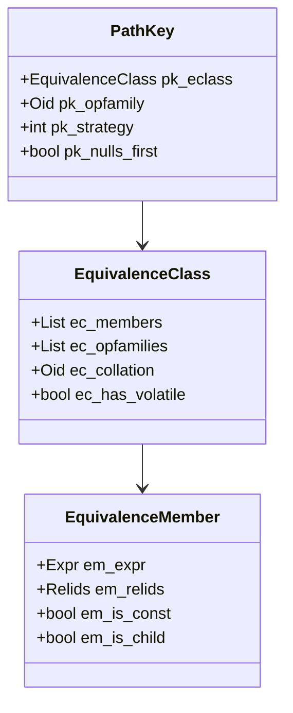
  
## 2. 内核开发者视角  
  
### 2.1 核心数据结构解析  
  
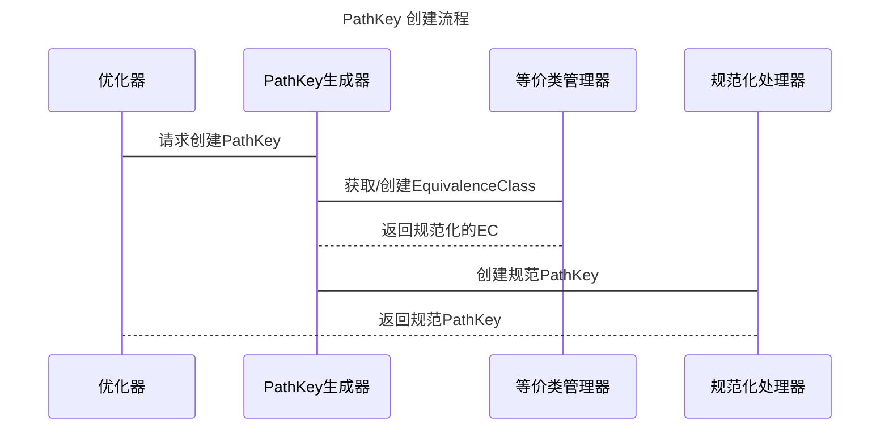
  
### 2.2 关键算法实现  
  
1. **路径键规范化**  
```c  
PathKey *make_canonical_pathkey(PlannerInfo *root,  
                              EquivalenceClass *eclass,  
                              Oid opfamily,  
                              int strategy,  
                              bool nulls_first)  
```  
  
这个函数确保相同的排序要求只生成一个 PathKey 对象，通过:  
- 使用等价类合并  
- 操作符族标准化  
- 排序策略统一  
  
2. **路径键匹配算法**  
```c  
bool pathkeys_contained_in(List *keys1, List *keys2)  
{  
    // 检查 keys1 是否是 keys2 的前缀  
    // 用于判断一个排序是否满足另一个排序要求  
}  
```  
  
## 3. DBA 视角  
  
### 3.1 性能优化场景  
  
1. **避免多余排序**  
```sql  
-- 示例1: 利用索引顺序避免排序  
CREATE INDEX idx_user_name ON users(name);  
SELECT * FROM users ORDER BY name;  -- 可直接使用索引顺序  
  
-- 示例2: 合并连接优化  
SELECT * FROM orders o JOIN users u ON o.user_id = u.id   
ORDER BY o.user_id;  -- 可能利用排序顺序进行合并连接  
```  
  
2. **索引设计优化**  
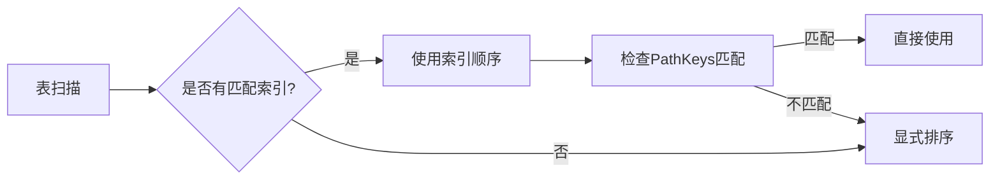
  
### 3.2 监控和诊断  
  
关键监控点：  
1. 排序操作的发生  
2. 合并连接的选择  
3. 索引利用率  
  
## 4. 应用开发者视角  
  
### 4.1 查询优化建议  
  
1. **利用索引顺序**  
```sql  
-- 好的实践  
CREATE INDEX idx_composite ON orders(user_id, create_time);  
SELECT * FROM orders   
WHERE user_id = 100   
ORDER BY create_time;  -- 可使用索引顺序  
  
-- 避免的模式  
SELECT * FROM orders   
ORDER BY random();  -- 无法利用任何排序优化  
```  
  
2. **合并连接优化**  
```sql  
-- 推荐  
SELECT * FROM orders o   
JOIN users u ON o.user_id = u.id   
ORDER BY o.user_id;  -- 可能使用合并连接  
  
-- 不推荐  
SELECT * FROM orders o   
JOIN users u ON o.user_id != u.id;  -- 无法使用合并连接  
```  
  
## 5. 深入解析关键实现  
  
### 5.1 路径键匹配算法  
  
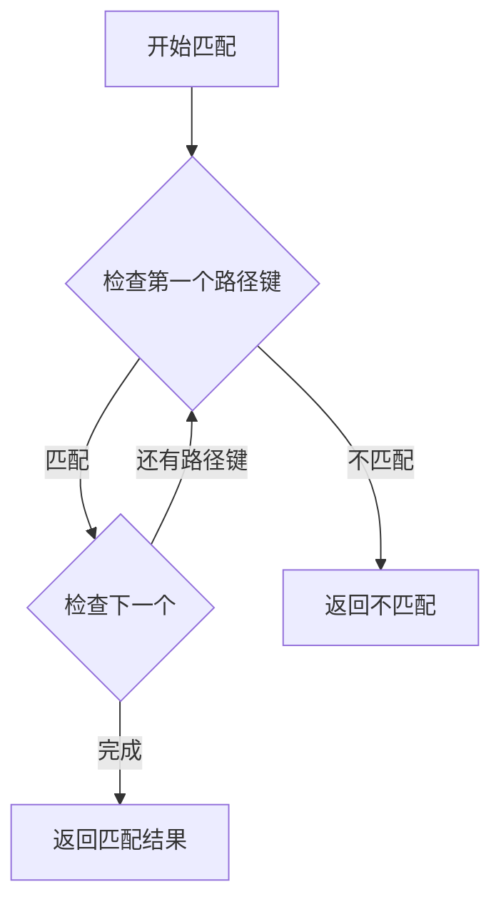
  
### 5.2 等价类处理  
  
等价类是路径键系统的核心概念，用于：  
1. 识别相等的排序表达式  
2. 合并等价的排序要求  
3. 优化连接操作  
  
示例：  
```sql  
SELECT * FROM orders o   
WHERE o.user_id = o.customer_id   
ORDER BY o.user_id;  
-- user_id 和 customer_id 会形成等价类  
```  
  
### 5.3 性能优化要点  
  
1. **缓存机制**  
- 规范化的路径键被缓存在 root->canon_pathkeys  
- 避免重复创建相同的路径键  
  
2. **内存管理**  
- 路径键在 planner_cxt 中分配  
- 确保在整个规划过程中保持有效  
  
3. **优化策略**  
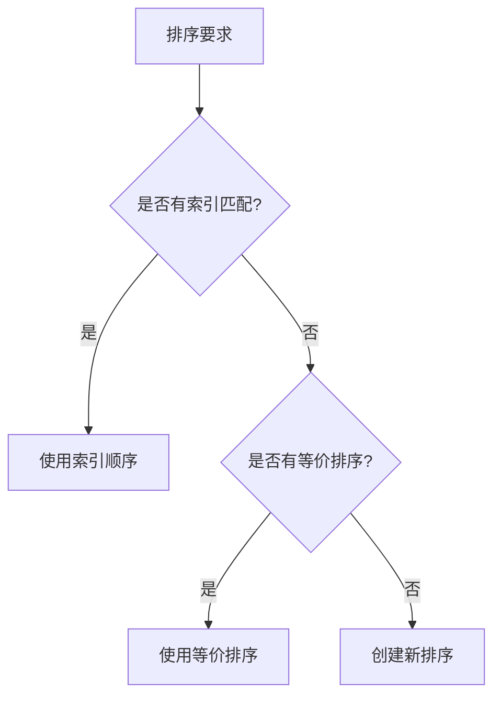
  
这个模块展示了 PostgreSQL/PolarDB 在查询优化方面的精妙设计，通过路径键系统实现了高效的排序优化和连接优化。理解这个模块对于数据库开发和优化都非常重要。  
    
## 提示     
```          
使用cursor           
          
@pathkeys.c         
从数据库内核开发者、架构师、用户(应用开发者和DBA)多个角度通熟易懂的解读这个代码, 使用sequence、mermaid图表增加可读性, 使用恰当的例子增加对代码的解释. 关键内容务必要深入重点详细解释.           
          
长文本模式          
```              
                    
## PolarDB & PostgreSQL 15 差异                    
```                
git diff -u 50d3d22baba63613d1f1406b2ed460dc9b03c3fc f5e7493819e370d30ac2047c68c21c9fb03ce4a0 -- src/backend/optimizer/path/pathkeys.c      
```                
                     
差异分析待补充.                  
                  
<b> 以上内容基于DeepSeek、QwQ及诸多AI生成, 轻微人工调整, 感谢杭州深度求索人工智能、阿里云等公司. </b>                  
                  
<b> AI 生成的内容请自行辨别正确性, 当然也多了些许踩坑的乐趣, 毕竟冒险是每个男人的天性.  </b>                  
          
          
          
  
#### [期望 PostgreSQL|开源PolarDB 增加什么功能?](https://github.com/digoal/blog/issues/76 "269ac3d1c492e938c0191101c7238216")
  
  
#### [PolarDB 开源数据库](https://openpolardb.com/home "57258f76c37864c6e6d23383d05714ea")
  
  
#### [PolarDB 学习图谱](https://www.aliyun.com/database/openpolardb/activity "8642f60e04ed0c814bf9cb9677976bd4")
  
  
#### [PostgreSQL 解决方案集合](../201706/20170601_02.md "40cff096e9ed7122c512b35d8561d9c8")
  
  
#### [德哥 / digoal's Github - 公益是一辈子的事.](https://github.com/digoal/blog/blob/master/README.md "22709685feb7cab07d30f30387f0a9ae")
  
  
#### [About 德哥](https://github.com/digoal/blog/blob/master/me/readme.md "a37735981e7704886ffd590565582dd0")
  
  

  
