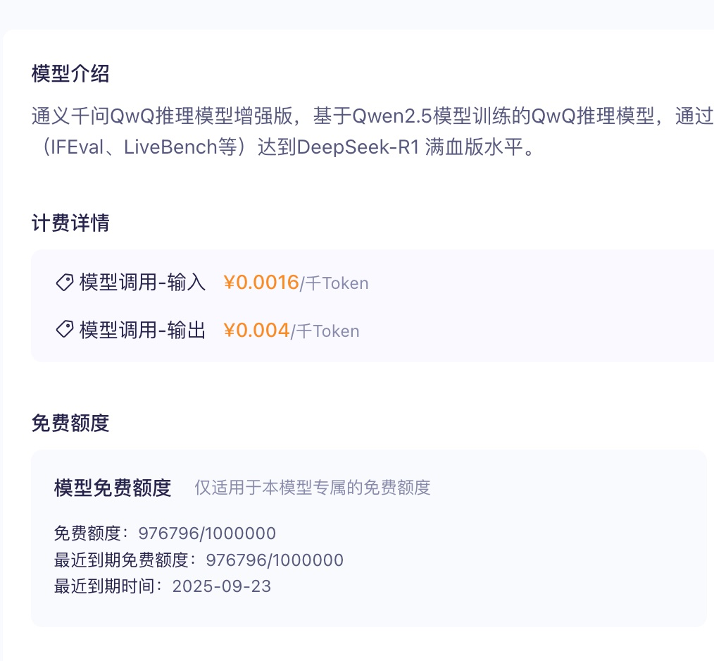
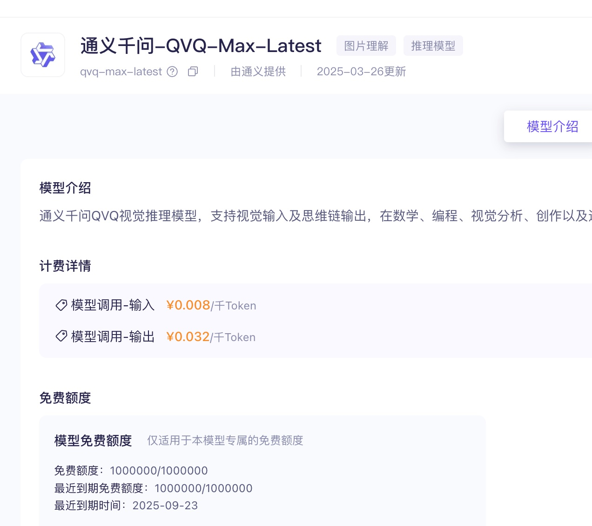

## 德说-第316期, AI从业者智商测试: 聪明人在薅羊毛傻子在竞争算力  
          
### 作者          
digoal          
          
### 日期          
2025-03-29        
          
### 标签          
PostgreSQL , PolarDB , DuckDB , AI 行业 , 薅羊毛         
          
----          
          
## 背景       
  
前段时间把房子包给了二房东(因为当房东真的太烦了, 记得刚来杭州的时候好羡慕五联西苑的房东, 一栋房子隔了十几间出租, 收收租搓搓麻将, 日子过的不要太潇洒. 当了房东才知道真烦, 不是那个专业的真赚不了那份钱.), 后来有位朋友也想把房子给二房东(房子更大、更新), 托我问二房东, 没想到不收. 为什么呢?  朋友小区附近是拆迁房, 拆迁房都是小房东, 小房东嘛, 价格自己说了算, 能租出去落袋为安最好, 很容易就把租金拉下来. 就算二房东租出去了比较好的价格, 租客稍微打听一下有更低的, 附近搬个家太方便了.  要租得起价格, 不仅需要考虑地段(商圈、写字楼、出行), 还要考虑资源是否集中.    
  
出行行业最开始的时候也是类似情况, 很多公司砸钱补贴乘客和司机, 没耗到最后的公司都倒了, 耗到最后的公司才能躺赢.  特点非常鲜明, 初期: 玩家多, 打价格战, 对用户有利; 充分竞争后, 资源汇总到少数玩家, 玩家对价格把控能力强, 用户几乎没有可薅的羊毛;     
  
现在AI行业可以大致分几层:   
- 硬件厂商: 供应算力卡   
- 大模型 + 算力 服务供应商: 提供算力租赁   
- AI Agent 软件方: 粘合大模型和传统软硬件   
- 传统软硬件方: 被AI赋能   
  
硬件厂商, 处于技术和市场垄断地位.    
  
大模型 + 算力 服务供应商, 是AI基础设施, 巨头都在抢这部分生意, 显然还处于初期阶段, 都在补贴用户呢, 对普通人来说是能薅到羊毛的.    
  
AI Agent 软件方就像出行行业初期的出租车司机或依附于平台的小平台(例如猪猪打车), 现在是最利好的, 所以搞这部分目前的启动成本最低.  而且在各个行业也有可能出独角兽.     
  
来看几个老朋友的创业产品:   
  
bytebase, World's most advanced database DevSecOps solution for Developer, Security, DBA and Platform Engineering teams. The GitHub/GitLab for database DevSecOps.  
- https://github.com/bytebase/bytebase  
  
DeepChat - 连接强大AI与个人世界的智能助手 | DeepChat - A smart assistant that connects powerful AI to your personal world  
- https://github.com/ThinkInAIXYZ/deepchat  
  
AskTable AI 致力于让每个人都能轻松、愉快地从数据中获取洞察。  
- https://docs.asktable.com/docs/introduction/what-is-asktable  
  
还有通过API集成各类大模型的产品  
- https://www.askmanyai.cn/index  
  
薅羊毛指南:  
  
https://bailian.console.aliyun.com  
  
[《Cursor 如何接入百炼 dashscope 内的大模型 例如QwQ , Qwen , Deepseek》](../202503/20250327_07.md)    
  
    
  
    
  
一起薅羊毛吧，傻子才会去竞争算力。除非你就是想成为最后活下来的“大模型 + 算力 服务供应商”。    
  
  
  
#### [期望 PostgreSQL|开源PolarDB 增加什么功能?](https://github.com/digoal/blog/issues/76 "269ac3d1c492e938c0191101c7238216")
  
  
#### [PolarDB 开源数据库](https://openpolardb.com/home "57258f76c37864c6e6d23383d05714ea")
  
  
#### [PolarDB 学习图谱](https://www.aliyun.com/database/openpolardb/activity "8642f60e04ed0c814bf9cb9677976bd4")
  
  
#### [PostgreSQL 解决方案集合](../201706/20170601_02.md "40cff096e9ed7122c512b35d8561d9c8")
  
  
#### [德哥 / digoal's Github - 公益是一辈子的事.](https://github.com/digoal/blog/blob/master/README.md "22709685feb7cab07d30f30387f0a9ae")
  
  
#### [About 德哥](https://github.com/digoal/blog/blob/master/me/readme.md "a37735981e7704886ffd590565582dd0")
  
  

  
