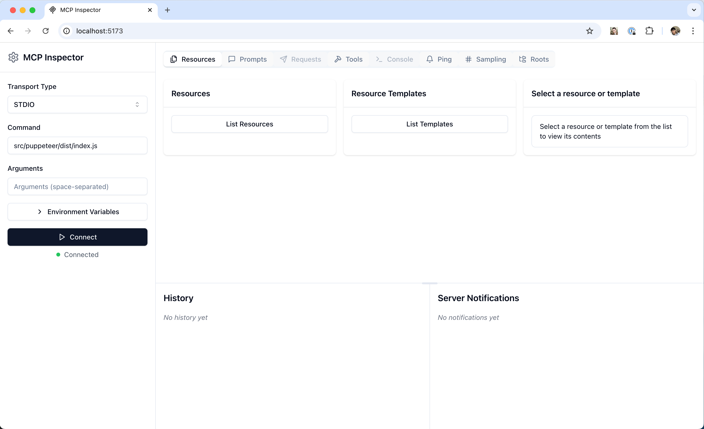

## 开发数据库MCP Server可参考什么开源项目? 推荐 greptimedb MCP Server. 如何调试mcp? mcp inspector  
              
### 作者              
digoal              
              
### 日期              
2025-03-31             
              
### 标签              
PostgreSQL , PolarDB , DuckDB , MCP , inspector , 调试          
              
----              
              
## 背景   
想定制开发一款数据库的mcp server? 有没有可参考的项目? 最好文档比较丰富, 实现了tools, resource, prompt.   
  
推荐 greptimedb MCP Server  
- https://github.com/GreptimeTeam/greptimedb-mcp-server   
  
开发好之后, 如何与ai agent进行整合? 不再赘述, 参考:   
- [《MCP太火了, 新手仅3分钟用Cursor Agent接管2大国产数据库》](../202503/20250327_04.md)    
- [《两大国产数据库PolarDB & OB通过MCP与AI Agent应用整合》](../202503/20250326_02.md)    
  
## 如何调试已开发好的mcp server?   
使用mcp inspector:  
- https://modelcontextprotocol.io/docs/tools/inspector    
  
具体实操可以使用`mcp dev $mcpserver_server.py` , 参考如下：  
- https://mp.weixin.qq.com/s?__biz=MzkxOTIwMDgxMg==&mid=2247488130&idx=1&sn=890210978c1b415b786b3c48f3f61bbe&scene=21#wechat_redirect  
  
python sdk写的mcp server可使用 npx uv , 下面来尝试一下.    
  
  
1、install uv  
  
https://docs.astral.sh/uv/getting-started/installation/  
  
```  
curl -LsSf https://astral.sh/uv/install.sh | sh  
```  
  
```  
vi ~/.bash_profile  
  
. "$HOME/.local/bin/env"  
```  
  
```  
. "$HOME/.local/bin/env"  
```  
  
2、install npx  
  
我的macos版本太低, 不支持brew安装  
```  
$ brew update  
  
==> Updating Homebrew...  
==> Homebrew collects anonymous analytics.  
Read the analytics documentation (and how to opt-out) here:  
  https://docs.brew.sh/Analytics  
No analytics have been recorded yet (nor will be during this `brew` run).  
  
==> Homebrew is run entirely by unpaid volunteers. Please consider donating:  
  https://github.com/Homebrew/brew#donations  
  
Updated 2 taps (homebrew/core and homebrew/cask).  
==> New Formulae  
dish                easyeda2kicad       gama                geesefs             harsh               hjson               ktexttemplate       lld@19              llvm@19             xan  
==> New Casks  
atv-remote                        captainplugins                    font-playpen-sans-deva            inmusic-software-center           pastenow                          slidepad  
bambu-connect                     earnapp                           grayjay                           kilohearts-installer              rave                              swift-shift  
beutl                             font-lxgw-wenkai-gb-lite          hamrs-pro                         moment                            restapia                          voiceink  
==> Outdated Formulae  
ca-certificates                         icu4c@77                                pcre2                                   pkgconf                                 socat  
  
You have 5 outdated formulae installed.  
You can upgrade them with brew upgrade  
or list them with brew outdated.  
  
$ brew install node  
Error: unknown or unsupported macOS version: :sequoia  
```  
  
使用nvm来安装即可  
```  
curl -o- https://raw.githubusercontent.com/nvm-sh/nvm/v0.40.2/install.sh | bash  
  
  
=> Downloading nvm from git to '/Users/digoal/.nvm'  
=> Cloning into '/Users/digoal/.nvm'...  
remote: Enumerating objects: 382, done.  
remote: Counting objects: 100% (382/382), done.  
remote: Compressing objects: 100% (325/325), done.  
remote: Total 382 (delta 43), reused 179 (delta 29), pack-reused 0 (from 0)  
Receiving objects: 100% (382/382), 386.80 KiB | 517.00 KiB/s, done.  
Resolving deltas: 100% (43/43), done.  
* (HEAD detached at FETCH_HEAD)  
  master  
=> Compressing and cleaning up git repository  
  
=> Appending nvm source string to /Users/digoal/.zshrc  
=> Appending bash_completion source string to /Users/digoal/.zshrc  
=> Close and reopen your terminal to start using nvm or run the following to use it now:  
  
export NVM_DIR="$HOME/.nvm"  
[ -s "$NVM_DIR/nvm.sh" ] && \. "$NVM_DIR/nvm.sh"  # This loads nvm  
[ -s "$NVM_DIR/bash_completion" ] && \. "$NVM_DIR/bash_completion"  # This loads nvm bash_completion  
```  
  
```  
vi ~/.bash_profile  
  
source ./.nvm/nvm.sh   
```  
  
```  
source ~/.nvm/nvm.sh  
```  
  
```  
$ nvm install 22  
Downloading and installing node v22.14.0...  
Downloading https://nodejs.org/dist/v22.14.0/node-v22.14.0-darwin-arm64.tar.xz...  
################################################################################################################################################################################################### 100.0%  
Computing checksum with shasum -a 256  
Checksums matched!  
Now using node v22.14.0 (npm v10.9.2)  
Creating default alias: default -> 22 (-> v22.14.0)  
```  
  
  
3、克隆greptimedb_mcp_server  
  
https://github.com/GreptimeTeam/greptimedb-mcp-server/blob/main/README.md  
  
```  
cd ~  
git clone --depth 1 https://github.com/GreptimeTeam/greptimedb-mcp-server  
cd greptimedb-mcp-server/src/greptimedb_mcp_server  
  
$ ll  
total 48  
drwxr-xr-x  3 digoal  staff    96B Mar 31 15:16 ..  
-rw-r--r--  1 digoal  staff   293B Mar 31 15:16 __init__.py  
-rw-r--r--  1 digoal  staff   1.8K Mar 31 15:16 config.py  
-rw-r--r--  1 digoal  staff   9.1K Mar 31 15:16 server.py  
-rw-r--r--  1 digoal  staff   1.7K Mar 31 15:16 utils.py  
drwxr-xr-x  7 digoal  staff   224B Mar 31 15:16 .  
drwxr-xr-x  6 digoal  staff   192B Mar 31 16:22 __pycache__  
  
$ pwd  
/Users/digoal/greptimedb-mcp-server/src/greptimedb_mcp_server  
```  
  
4、调试mcp server:  
  
参考: https://modelcontextprotocol.io/docs/tools/inspector    
  
```  
npx @modelcontextprotocol/inspector \
  uv \
  --directory path/to/server \
  run \
  package-name \
  args...  
```  
  
```  
npx @modelcontextprotocol/inspector uv \
  --directory \
  /Users/digoal/greptimedb-mcp-server/src/greptimedb_mcp_server \
  run \
  -m \
  greptimedb_mcp_server.server  
```  
  
  
```  
Starting MCP inspector...  
Proxy server listening on port 3000  
  
🔍 MCP Inspector is up and running at http://localhost:5173 🚀  
```  
  
此时打开浏览器, 输入地址:`http://localhost:5173`, 可以调试这个mcp server.  
  
  
  
  
#### [期望 PostgreSQL|开源PolarDB 增加什么功能?](https://github.com/digoal/blog/issues/76 "269ac3d1c492e938c0191101c7238216")
  
  
#### [PolarDB 开源数据库](https://openpolardb.com/home "57258f76c37864c6e6d23383d05714ea")
  
  
#### [PolarDB 学习图谱](https://www.aliyun.com/database/openpolardb/activity "8642f60e04ed0c814bf9cb9677976bd4")
  
  
#### [PostgreSQL 解决方案集合](../201706/20170601_02.md "40cff096e9ed7122c512b35d8561d9c8")
  
  
#### [德哥 / digoal's Github - 公益是一辈子的事.](https://github.com/digoal/blog/blob/master/README.md "22709685feb7cab07d30f30387f0a9ae")
  
  
#### [About 德哥](https://github.com/digoal/blog/blob/master/me/readme.md "a37735981e7704886ffd590565582dd0")
  
  

  
