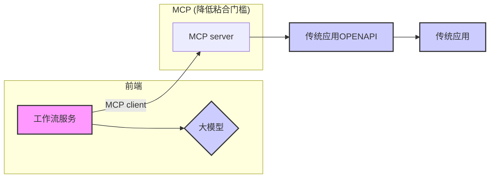

## 德说-第318期, 这类应用很有价值: 企业级AI工作流(支持大模型和MCP)开源项目有哪些?    
                
### 作者                
digoal                
                
### 日期                
2025-04-01               
                
### 标签                
PostgreSQL , PolarDB , DuckDB , MCP , 大模型 , AI Agent , 工作流 , 传统应用 , OpenAPI      
                
----                
                
## 背景    
企业级AI工作流(支持大模型和MCP)的开源项目有哪些?      
  
我为什么会特别关注此类应用? 个人认为这类应用很有价值, 工作流服务比较适合企业用来黏合LLM和传统应用, 支持MCP则更加降低了粘合门槛.    
  

  
下面结合AI给的回复, 列举一些此类应用.  
  
prompt: `工作流相关开源产品有哪些? 要求支持mcp client (model context protocol) 连接 mcp server.`     
  
  
1、Cursor : 程序员辅助编程利器 29k Star  
- [《Cursor 如何接入百炼 dashscope 内的大模型 例如QwQ , Qwen , Deepseek》](../202503/20250327_07.md)    
- [《MCP太火了, 新手仅3分钟用Cursor Agent接管2大国产数据库》](../202503/20250327_04.md)    
- [《程序员辅助编程利器只是AI应用的开始: cursor, An editor built for programming with AI》](../202303/20230320_01.md)    
- https://github.com/getcursor/cursor    
  
  
2、Cline : Autonomous coding agent right in your IDE, capable of creating/editing files, executing commands, using the browser, and more with your permission every step of the way. 37.9k Star   
- 功能：VS Code插件，支持通过MCP协议扩展AI助手功能（如代码生成、文件操作）。  
- 工作流支持：可自定义MCP服务器工具，实现开发任务自动化（如代码编辑、终端命令执行）。  
- 开源地址：https://github.com/cline/cline/blob/main/locales/zh-cn/README.md   
  
  
3、beeai-framework : Build production-ready AI agents in both Python and Typescript. 2.2k Star  
- https://github.com/i-am-bee/beeai-framework  
  
  
4、mcp-agent : Build effective agents using Model Context Protocol and simple workflow patterns. 2.5k Star  
- https://github.com/lastmile-ai/mcp-agent  
  
  
5、ChatMCP : an AI chat client implementing the Model Context Protocol (MCP). 1.1k Star  
- https://github.com/daodao97/chatmcp  
  
6、continue : Create, share, and use custom AI code assistants with our open-source IDE extensions and hub of models, rules, prompts, docs, and other building blocks. 25.1k Star   
- https://github.com/continuedev/continue  
  
  
7、DeepChat : 连接强大AI与个人世界的智能助手 | DeepChat - A smart assistant that connects powerful AI to your personal world. 1.3k Star  
- https://github.com/ThinkInAIXYZ/deepchat  
  
8、open-webui : User-friendly AI Interface (Supports Ollama, OpenAI API, ...). 86.5k Star  
- https://github.com/open-webui/open-webui   
- 0.6.0 开始通过 MCPO 支持 MCP 服务器：您现在可以将内部 MCP 工具转换并公开为 Open WebUI 中可互操作的 OpenAPI HTTP 服务器，从而实现无缝、即插即用的 AI 工具链创建。了解更多信息：https://github.com/open-webui/mcpo
  
9、Dify : Dify 是一款开源的大语言模型(LLM) 应用开发平台。它融合了后端即服务（Backend as Service）和 LLMOps 的理念，使开发者可以快速搭建生产级的生成式 AI 应用。即使你是非技术人员，也能参与到 AI 应用的定义和数据运营过程中。 88.3k Star   
- https://github.com/langgenius/dify   
- Dify通过mcp-client可以连接MCP server : https://github.com/3dify-project/dify-mcp-client
- 通过mcp-server则可以被AI Agent集成 : https://github.com/YanxingLiu/dify-mcp-server
  
更多待补充.  
  
