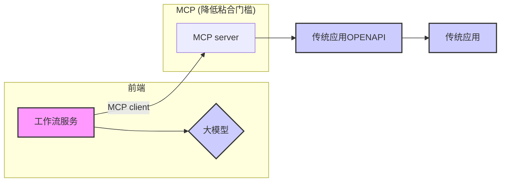

## 德说-第318期, 这类应用很有价值: 企业级AI工作流(支持大模型和MCP)开源项目有哪些?    
                
### 作者                
digoal                
                
### 日期                
2025-04-01               
                
### 标签                
PostgreSQL , PolarDB , DuckDB , MCP , 大模型 , AI Agent , 工作流 , 传统应用 , OpenAPI      
                
----                
                
## 背景    
企业级AI工作流(支持大模型和MCP)的开源项目有哪些?      
  
我为什么会特别关注此类应用? 个人认为这类应用很有价值, 工作流服务比较适合企业用来黏合LLM和传统应用, 支持MCP则更加降低了粘合门槛.    
  

  
下面结合AI给的回复, 列举一些此类应用.  
  
prompt: `工作流相关开源产品有哪些? 要求支持mcp client (model context protocol) 连接 mcp server.`     
  
### 程序员编程提效工具  
1、Cursor : 程序员辅助编程利器 29k Star  
- [《Cursor 如何接入百炼 dashscope 内的大模型 例如QwQ , Qwen , Deepseek》](../202503/20250327_07.md)    
- [《MCP太火了, 新手仅3分钟用Cursor Agent接管2大国产数据库》](../202503/20250327_04.md)    
- [《程序员辅助编程利器只是AI应用的开始: cursor, An editor built for programming with AI》](../202303/20230320_01.md)    
- https://github.com/getcursor/cursor    
  
  
2、Cline : Autonomous coding agent right in your IDE, capable of creating/editing files, executing commands, using the browser, and more with your permission every step of the way. 37.9k Star   
- 功能：VS Code插件，支持通过MCP协议扩展AI助手功能（如代码生成、文件操作）。  
- 工作流支持：可自定义MCP服务器工具，实现开发任务自动化（如代码编辑、终端命令执行）。  
- 开源地址：https://github.com/cline/cline/blob/main/locales/zh-cn/README.md   
  
### AI 对话+调用MCP能力  
3、ChatMCP : an AI chat client implementing the Model Context Protocol (MCP). 1.1k Star  
- https://github.com/daodao97/chatmcp  
  
4、DeepChat : 连接强大AI与个人世界的智能助手 | DeepChat - A smart assistant that connects powerful AI to your personal world. 1.3k Star  
- https://github.com/ThinkInAIXYZ/deepchat  
  
5、open-webui : User-friendly AI Interface (Supports Ollama, OpenAI API, ...). 86.5k Star  
- https://github.com/open-webui/open-webui    
- 0.6.0 开始通过 MCPO 支持 MCP 服务器：您现在可以将内部 MCP 工具转换并公开为 Open WebUI 中可互操作的 OpenAPI HTTP 服务器，从而实现无缝、即插即用的 AI 工具链创建。了解更多信息：https://github.com/open-webui/mcpo  
   
open-webui 0.6+ 通过增加mcp和openapi的整合能力, 也可以作为AI Agent平台来使用.      
  
### 平台或模块类
6、mcp-agent : Build effective agents using Model Context Protocol and simple workflow patterns. 2.5k Star  
- https://github.com/lastmile-ai/mcp-agent
  
  
7、beeai-framework : Build production-ready AI agents in both Python and Typescript. 2.2k Star  
- https://github.com/i-am-bee/beeai-framework
   
8、continue : Create, share, and use custom AI code assistants with our open-source IDE extensions and hub of models, rules, prompts, docs, and other building blocks. 25.1k Star   
- https://github.com/continuedev/continue  
  
     
9、Dify : Dify 是一款开源的大语言模型(LLM) 应用开发平台。它融合了后端即服务（Backend as Service）和 LLMOps 的理念，使开发者可以快速搭建生产级的生成式 AI 应用。即使你是非技术人员，也能参与到 AI 应用的定义和数据运营过程中。 88.3k Star   
- https://github.com/langgenius/dify   
- Dify通过mcp-client可以连接MCP server : https://github.com/3dify-project/dify-mcp-client
- 通过mcp-server则可以被AI Agent集成 : https://github.com/YanxingLiu/dify-mcp-server
   
更多待补充.  
  
最后用AI简单对比Cline和Cursor.  
  
    
---  

### Cline 与 Cursor 产品对比  
  
#### 1. **核心定位与架构**  
- **Cursor**    
  - **闭源商业产品**：基于 VS Code 深度定制的独立 IDE，内置 Claude、GPT-4 等大模型。    
  - **集成度高**：自动化能力强，支持复杂任务拆解（如代码生成、Bug 修复、项目级上下文理解）。    
  - **云端依赖**：需付费订阅，模型和服务由官方托管，无法自定义本地模型。  
  
- **Cline**    
  - **开源 VS Code 插件**：完全免费，支持本地部署模型（如 DeepSeek、Qwen2.5）或接入第三方 API（如 OpenAI）。    
  - **灵活性高**：允许开发者自行配置模型和工具链，适合隐私敏感或需要定制化场景。    
  - **扩展性强**：支持通过 MCP Server 连接外部数据源和工具（如数据库、API）。  
  
#### 2. **功能对比**  
| **维度**       | **Cursor**                                                                 | **Cline**                                                                 |  
|----------------|----------------------------------------------------------------------------|---------------------------------------------------------------------------|  
| **代码生成**   | 支持多文件联动生成，自动处理依赖和编译错误，适合中小型项目。         | 依赖模型能力，需手动配置上下文，大型项目性能较差。                  |  
| **Bug 修复**   | 自动分析错误日志并修复，成功率较高（如一次修复率达 70% 以上）。    | 需手动提供上下文，修复能力依赖模型（如 DeepSeek-V3 表现接近 Claude3.5）。 |  
| **上下文理解** | 内置向量数据库，可快速检索项目代码库，减少幻觉。                     | 需手动配置文件读取范围，处理复杂上下文时效率较低。                  |  
| **协作与部署** | 支持团队协作和云开发环境，适合敏捷开发。                             | 无原生协作功能，依赖 Git 等工具，适合个人或小团队。                    |  
  
#### 3. **费用与成本**  
- **Cursor**：订阅制（20 美元/月），包含无限代码补全和高级请求，适合高频使用场景。    
- **Cline**：    
  - **本地部署**：零成本（如使用 DeepSeek-V3 免费版）。    
  - **API 调用**：按 Token 计费（如阿里百炼 Qwen2.5 约 1.5 元/万 Token），成本可控。    
  
#### 4. **适用场景**  
- **选 Cursor**：    
  - 需要快速原型开发、自动修复 Bug、团队协作。    
  - 硬件配置较高（推荐 i7 + 32G 内存）。    
  
- **选 Cline**：    
  - 注重隐私/定制化，需本地部署模型（如企业内网开发）。    
  - 预算有限，愿意牺牲部分自动化能力换取成本优势。    
  
#### 5. **性能与资源消耗**  
- **Cursor**：加载大型项目时 CPU/内存占用高，但对任务执行效率优化较好。    
- **Cline**：轻量级插件，资源占用低，但复杂任务需多次调试。    
  
#### 6. **总结**  
- **Cursor 优势**：开箱即用、自动化强、适合中小型项目。**劣势**：费用高、闭源。    
- **Cline 优势**：开源免费、灵活定制。**劣势**：需技术背景配置、大型项目支持弱。    
  
   
  
#### [期望 PostgreSQL|开源PolarDB 增加什么功能?](https://github.com/digoal/blog/issues/76 "269ac3d1c492e938c0191101c7238216")
  
  
#### [PolarDB 开源数据库](https://openpolardb.com/home "57258f76c37864c6e6d23383d05714ea")
  
  
#### [PolarDB 学习图谱](https://www.aliyun.com/database/openpolardb/activity "8642f60e04ed0c814bf9cb9677976bd4")
  
  
#### [PostgreSQL 解决方案集合](../201706/20170601_02.md "40cff096e9ed7122c512b35d8561d9c8")
  
  
#### [德哥 / digoal's Github - 公益是一辈子的事.](https://github.com/digoal/blog/blob/master/README.md "22709685feb7cab07d30f30387f0a9ae")
  
  
#### [About 德哥](https://github.com/digoal/blog/blob/master/me/readme.md "a37735981e7704886ffd590565582dd0")
  
  

  
