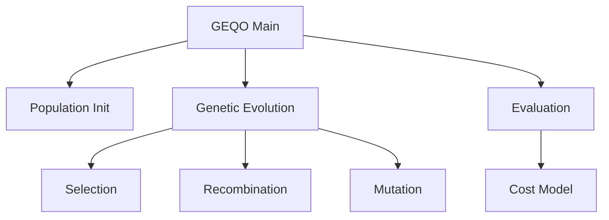
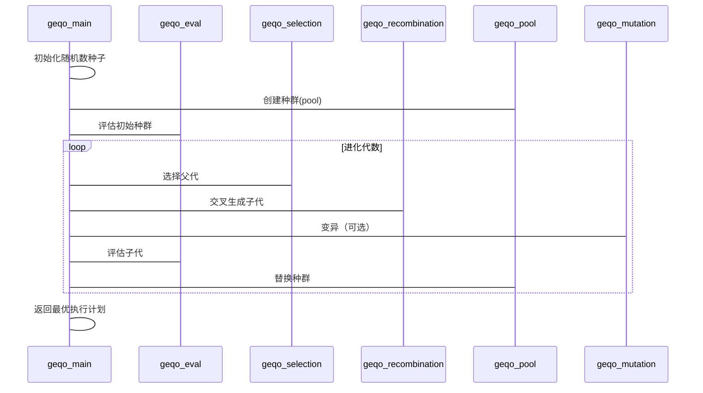
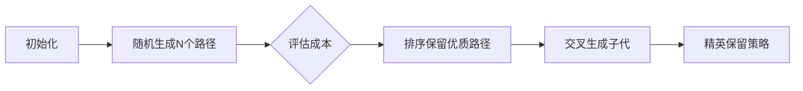

## AI辅助 PolarDB内核学习 - 22 多表JOIN优化 之 geqo(遗传算法)   
            
### 作者                    
digoal                    
                    
### 日期                    
2025-04-02                   
                    
### 标签                    
PostgreSQL , PolarDB , DuckDB , AI , 内核 , 学习 , geqo , JOIN , 穷举法 , 遗传算法     
                    
----                    
                    
## 背景   
PostgreSQL 的 GEQO (Genetic Query Optimizer) 解决的是 **复杂查询的查询优化问题**。更具体地说，它主要用于解决以下问题：

*   **连接顺序优化：** 当查询包含多个表连接时，连接的顺序会显著影响查询的性能。对于少量表的连接，PostgreSQL 的标准优化器可以使用动态规划算法来找到最佳连接顺序。但是，当连接的表数量增加时，动态规划算法的复杂度呈指数增长，导致优化时间过长。GEQO 使用遗传算法来近似找到一个好的连接顺序，从而在合理的时间内优化复杂查询。

*   **搜索空间过大：** 对于包含大量表连接(JOIN)的查询，可能的连接顺序数量非常庞大，标准优化器(采用穷举法)无法在合理的时间内穷尽所有可能性。GEQO 通过遗传算法，在巨大的搜索空间中进行高效搜索，找到一个相对较优的连接顺序。

**简单来说，GEQO 是一种在连接表数量较多时，用于快速找到一个“足够好”的查询计划的优化器。**

**以下是 GEQO 的一些关键特点：**

*   **遗传算法：** GEQO 使用遗传算法来搜索最佳连接顺序。遗传算法是一种启发式搜索算法，模拟生物进化过程，通过选择、交叉和变异等操作，逐步优化种群中的个体（即连接顺序）。

*   **近似优化：** GEQO 并不保证找到最佳连接顺序，而是找到一个相对较优的连接顺序。这是因为遗传算法是一种启发式算法，无法穷尽所有可能性。

*   **性能权衡：** GEQO 牺牲了一定的优化精度，换取了更快的优化速度。对于连接表数量较多的查询，使用 GEQO 可以显著减少查询优化时间，从而提高整体性能。

**何时使用 GEQO：**

通常情况下，PostgreSQL 的标准优化器已经足够优秀。只有在以下情况下，才需要考虑使用 GEQO：

*   查询包含大量的表连接（通常超过 4-5 个）。
*   查询优化时间过长，导致整体性能下降。
*   对查询计划的精度要求不高，可以接受近似优化。

**总结：**

GEQO 是 PostgreSQL 中用于优化复杂查询的工具，它通过遗传算法来近似找到一个好的连接顺序，从而在合理的时间内优化查询。它主要用于解决连接表数量较多时，标准优化器无法在合理时间内找到最佳连接顺序的问题。
            
## 解读 多表JOIN优化 之 geqo(遗传算法)    
  
我将从多维度解读PostgreSQL遗传查询优化器(GEQO)的实现，结合代码结构、算法流程和实际应用场景进行说明。  
  
# 一、架构师视角 - 整体架构设计  
## 1.1 模块组成  

  
## 1.2 核心数据结构  
```c  
// 种群结构（geqo_pool.c）  
typedef struct Pool {  
    Chromosome *data;  // 染色体数组  
    int         size;  // 种群大小  
    int         string_length; // 基因长度（表数量）  
} Pool;  
  
// 染色体结构（geqo.h）  
typedef struct Chromosome {  
    Gene       *string; // 基因序列（表连接顺序）   
    Cost        worth;  // 适应度（查询成本）  
} Chromosome;  
  
// 城市表（边重组算法用）  
typedef struct City {  
    int         used;  // 是否使用标记  
    int         select_list; // 选择列表  
} City;  
```  
  
# 二、内核开发者视角 - 关键算法实现  
## 2.1 主流程（geqo_main.c）  

  
## 2.2 边重组算法（ERX）核心逻辑  
```c  
// geqo_erx.c  
void gimme_edge_table(...) {  
    // 构建边表：统计两个父代路径的邻接关系  
    for (每个基因位置) {  
        记录tour1和tour2的前后关系  
        标记共享边（负值表示）  
    }  
}  
  
int gimme_tour(...) {  
    // 生成新路径：优先选择公共边  
    while (未完成路径) {  
        if (当前边是共享边) 直接采用  
        else 选择最小度数节点  
        if (失败) 随机选择未用节点  
    }  
    return 失败次数;  
}  
```  
  
典型示例：  
```  
父代1：A-B-C-D-E  
父代2：D-A-E-C-B  
  
边表构建：  
A: [B,D] (D来自父代2)  
B: [A,C]  
C: [B,D,E]   
D: [C,A]  
E: [D,C]  
  
生成路径：  
A-D（公共边）→ D-C → C-B → B-A（失败）→ 随机选E → 最终路径A-D-C-B-E  
```  
  
## 2.3 成本评估（geqo_eval.c）  
```c  
Cost geqo_eval(...) {  
    // 通过实际构造连接树获取成本  
    joinrel = gimme_tree(root, tour, num_gene);  
    if (joinrel)   
        return joinrel->cheapest_total_path->total_cost;  
    else   
        return DBL_MAX; // 无效路径  
}  
```  
  
评估过程特点：  
1. 使用实际优化器成本模型  
2. 考虑物理优化（索引、连接方法）  
3. 内存上下文管理避免泄露  
  
# 三、DBA/应用开发者视角 - 实践应用  
## 3.1 配置参数  
| 参数 | 默认值 | 说明 |  
|-----|-------|-----|  
| geqo | on | 启用遗传优化 |  
| geqo_threshold | 12 | 触发GEQO的表数量 |  
| geqo_pool_size | 0 | 种群规模（0=自动计算） |  
| geqo_effort | 5 | 计算强度（1-10） |  
| geqo_seed | 0.0 | 随机种子（0.0=自动生成） |  
  
## 3.2 典型问题排查  
1. **计划不稳定问题**  
```sql  
-- 固定随机种子  
SET geqo_seed = 0.5;  
```  
2. **优化器耗时过长**  
```sql  
-- 降低计算强度  
SET geqo_effort = 3;  
-- 减小种群规模  
SET geqo_pool_size = 100;  
```  
3. **连接顺序异常**  
```sql  
-- 临时禁用GEQO  
SET geqo = off;  
```  
  
## 3.3 性能调优建议  
1. 当表数>15时GEQO效率优势明显  
2. 调整geqo_effort平衡计划质量/优化时间：  
   - OLTP系统：较低值（3-5）  
   - OLAP系统：较高值（7-9）  
3. 监控工具配合：  
```sql  
EXPLAIN (ANALYZE, VERBOSE) SELECT ...; -- 实际执行计划分析  
SELECT * FROM pg_stat_statements; -- 高频查询识别  
```  
  
# 四、关键创新点解读  
## 4.1 动态种群管理（geqo_pool.c）  

  
特点：  
- 自动计算种群规模：`pool_size = 2^(n+1)`，n为表数  
- 淘汰机制：保留最优解，替换最差50%  
- 无效路径过滤：成本为DBL_MAX的直接丢弃  
  
## 4.2 多重组策略支持  
通过编译选项支持多种交叉算法：  
```c  
// geqo.h  
#define ERX // 边重组（默认）  
// #define PMX // 部分映射  
// #define CX  // 循环交叉  
// #define PX  // 位置交叉  
```  
  
各算法对比：  
| 算法 | 时间复杂度 | 适合场景 |  
|-----|----------|--------|  
| ERX | O(n^2) | 高连接数 |  
| PMX | O(n) | 快速收敛 |  
| CX  | O(n) | 保持绝对位置 |  
  
## 4.3 成本估算优化  
在geqo_eval()中通过`gimme_tree`生成真实计划，关键优化：  
1. 共享结构重用：利用`root->join_rel_list`缓存中间结果  
2. 内存上下文隔离：每个评估在独立内存上下文进行  
3. 剪枝策略：及时终止高成本路径评估  
  
# 五、源码学习建议  
1. 调试入口：  
```bash  
# 编译时开启DEBUG  
./configure --enable-debug  
# 查看遗传优化过程  
client_min_messages = DEBUG1  
```  
  
2. 关键断点：  
```gdb  
b geqo_main.c:100 // 主循环  
b geqo_eval.c:85 // 成本评估   
b geqo_erx.c:150 // 边重组  
```  
  
3. 可视化工具：  
```python  
# 使用pygraphviz绘制连接树  
def plot_join_tree(query):  
    # 解析执行计划  
    # 生成DOT文件  
    # 调用graphviz渲染  
```  
  
通过多角度分析可以看到，PostgreSQL的GEQO实现将经典的遗传算法与数据库查询优化深度结合，在动态种群管理、多重组策略、成本模型整合等方面展现了工程化智慧。对于实际使用，理解其内在机制有助于制定更有效的优化策略。  
  
## 提示       
```            
使用cursor             
            
@geqo          
解读geqo代码. 从数据库内核开发者、架构师、用户(应用开发者和DBA)多个角度通熟易懂的解读这个代码, 使用sequence、mermaid图表增加可读性, 使用恰当的例子增加对代码的解释. 关键内容务必要深入重点详细解释.             
            
长文本模式            
```                
                      
## PolarDB & PostgreSQL 15 差异                      
```                  
git diff -u 50d3d22baba63613d1f1406b2ed460dc9b03c3fc f5e7493819e370d30ac2047c68c21c9fb03ce4a0 -- src/backend/optimizer/geqo       
```                  
                       
差异分析待补充.                    
                    
<b> 以上内容基于DeepSeek、QwQ及诸多AI生成, 轻微人工调整, 感谢杭州深度求索人工智能、阿里云等公司. </b>                    
                    
<b> AI 生成的内容请自行辨别正确性, 当然也多了些许踩坑的乐趣, 毕竟冒险是每个男人的天性.  </b>                    
          
  
#### [期望 PostgreSQL|开源PolarDB 增加什么功能?](https://github.com/digoal/blog/issues/76 "269ac3d1c492e938c0191101c7238216")
  
  
#### [PolarDB 开源数据库](https://openpolardb.com/home "57258f76c37864c6e6d23383d05714ea")
  
  
#### [PolarDB 学习图谱](https://www.aliyun.com/database/openpolardb/activity "8642f60e04ed0c814bf9cb9677976bd4")
  
  
#### [PostgreSQL 解决方案集合](../201706/20170601_02.md "40cff096e9ed7122c512b35d8561d9c8")
  
  
#### [德哥 / digoal's Github - 公益是一辈子的事.](https://github.com/digoal/blog/blob/master/README.md "22709685feb7cab07d30f30387f0a9ae")
  
  
#### [About 德哥](https://github.com/digoal/blog/blob/master/me/readme.md "a37735981e7704886ffd590565582dd0")
  
  

  
