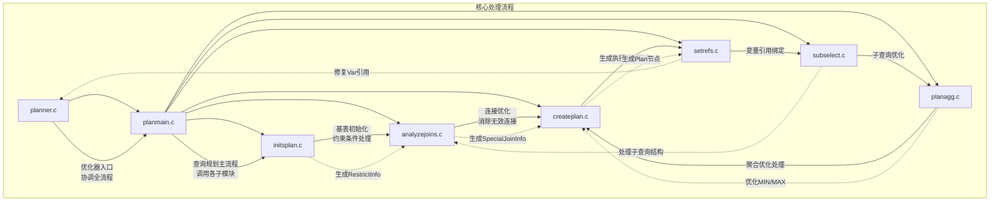
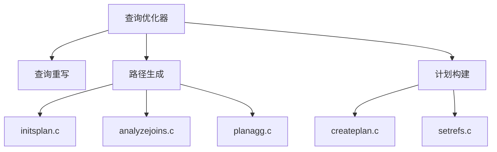
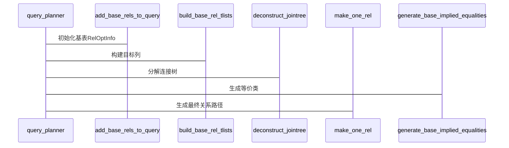

## AI辅助 PolarDB内核学习 - 23 优化器plan模块概览   
              
### 作者                      
digoal                      
                      
### 日期                      
2025-04-02                     
                      
### 标签                      
PostgreSQL , PolarDB , DuckDB , AI , 内核 , 学习 , plan , 概览     
                      
----                      
                      
## 背景                
              
## 解读 优化器plan模块 概览   
  
以下是针对PostgreSQL优化器plan模块的深度解析：  
  

  
### 文件功能详解：  
1. **planner.c**    
   - 优化器总入口  
   - 处理查询重写、路径生成、计划构建  
   - 调用`planmain.c`启动主流程  
  
2. **planmain.c**    
   - 查询规划主控制器  
   - 核心函数`query_planner()`  
   - 协调基表处理、连接分解、路径生成  
  
3. **initsplan.c**    
   - 初始化基表RelOptInfo  
   - 处理WHERE/JOIN-ON条件（`distribute_qual_to_rels`）  
   - 构建约束条件链表  
  
4. **analyzejoins.c**    
   - 连接优化核心模块  
   - 消除无效外连接（`remove_useless_joins`）  
   - 处理连接顺序约束  
  
5. **createplan.c**    
   - 将最优路径转为执行计划  
   - 生成SeqScan/IndexScan/NestLoop等节点  
   - 处理投影、排序等操作  
  
6. **setrefs.c**    
   - 执行计划后期处理  
   - 修复变量引用（`set_plan_references`）  
   - 处理参数化路径  
  
7. **subselect.c**    
   - 子查询优化处理  
   - 将ANY/EXISTS子查询转为半连接  
   - 处理相关子查询去关联  
  
8. **planagg.c**    
   - 聚合优化专项处理  
   - 将MIN/MAX转为LIMIT查询  
   - 处理带有索引的极值查询  
  
### 数据流动示例：  
```   
查询树 → planner.c → planmain.c → initsplan.c (构建基表信息)  
                      ↓  
              analyzejoins.c (优化连接)  
                      ↓  
              createplan.c (生成计划树)  
                      ↓  
               setrefs.c (绑定变量)  
                      ↓  
             最终执行计划输出  
```  
  
    
  
  
# 一、架构师视角 - 模块全景  

  
核心文件分工：  
- `planner.c`: 优化器入口，协调全流程  
- `initsplan.c`: 初始化基表信息，构建RestrictInfo  
- `analyzejoins.c`: 连接优化，消除无效连接  
- `createplan.c`: 将最优路径转换为可执行的Plan树  
- `planagg.c`: 聚合优化（如MIN/MAX转LIMIT查询）  
  
# 二、内核开发者视角 - 关键流程  
  
## 2.1 主流程（query_planner函数）  

  
## 2.2 条件推送（distribute_qual_to_rels）  
典型场景：WHERE条件处理  
```c  
// initsplan.c  
distribute_qual_to_rels()  
{  
    if (条件仅涉及单表)  
        加入baserestrictinfo  
    else if (涉及多表)  
        加入joininfo列表  
    if (mergejoinable)  
        创建等价类  
}  
```  
处理逻辑：  
1. 分离单表条件与连接条件  
2. 识别可下推条件  
3. 维护等价类信息  
  
# 三、DBA视角 - 优化器行为特征  
  
## 3.1 统计信息利用  
| 统计类型        | 影响决策               | 示例               |  
|-----------------|------------------------|--------------------|  
| pg_class.reltuples | 表基数估算          | SeqScan代价计算    |  
| pg_stats.correlation | 索引有效性判断    | 索引扫描选择       |  
| pg_statistic.stakind1 | 列数据分布        | 条件选择性估算     |  
  
## 3.2 执行计划调优点  
```sql  
EXPLAIN SELECT * FROM orders WHERE customer_id=123 AND total>100;  
```  
优化器可能行为：  
1. 优先使用customer_id索引  
2. 对total条件做索引条件过滤  
3. 根据数据相关性决定索引扫描或位图扫描  
  
# 四、重点模块解析  
  
## 4.1 连接消除（analyzejoins.c）  
处理逻辑：  
```c  
remove_useless_joins()  
{  
    foreach 特殊连接信息  
        if (左连接可消除)  
            remove_rel_from_query()  
            重构连接树  
}  
```  
示例场景：  
```sql  
SELECT * FROM A LEFT JOIN B ON A.id=B.aid WHERE B.x IS NOT NULL;  
-- 优化器会将LEFT JOIN转为INNER JOIN   PS: B.x 有not null约束才成立吧? 或者改成b.* is not null?  
```  
  
## 4.2 聚合优化（planagg.c）  
MIN/MAX优化流程：  
1. 识别MIN/MAX聚合  
2. 构建等价子查询  
```sql  
-- 原查询  
SELECT MIN(price) FROM products WHERE category=1;  
  
-- 优化后等效  
SELECT price FROM products   
WHERE category=1 AND price IS NOT NULL   
ORDER BY price LIMIT 1;  
```  
关键判断条件：  
- 存在可用索引  
- 无影响结果的易失函数  
- 无GROUP BY等复杂结构  
  
## 4.3 计划生成（createplan.c）  
核心数据结构：  
```c  
typedef struct Plan {  
    NodeTag     type;  
    double      startup_cost;  
    double      total_cost;  
    List       *targetlist;  
    List       *qual;  
    //...  
} Plan;  
```  
生成过程：  
1. 选择最优路径（索引扫描/顺序扫描）  
2. 递归生成子节点计划  
3. 添加投影、排序等操作节点  
  
# 五、关键算法与数据结构  
  
## 5.1 动态规划搜索  
```python  
# make_one_rel 中的路径搜索  
def find_best_path():  
    for level in 1..n:  
        for each subset of size level:  
            generate_join_paths()  
            keep_cheapest_path()  
```  
  
## 5.2 代价模型  
代价计算公式：  
```  
总代价 = 启动代价 + (行数 × 每行代价)  
索引扫描代价 = random_page_cost × 选择率 + cpu_index_tuple_cost × 行数  
```  
  
## 5.3 等价类处理  
```c  
// 生成等价条件  
generate_base_implied_equalities()  
{  
    foreach 等价类  
        if (存在可合并条件)  
            生成隐含条件  
            加入约束列表  
}  
```  
  
# 六、诊断与优化建议  
  
## 6.1 常见性能模式  
| 现象                | 优化器应对策略           | DBA应对措施              |  
|---------------------|--------------------------|--------------------------|  
| 缺失统计信息        | 默认选择顺序扫描         | ANALYZE更新统计          |  
| 高选择性条件        | 优先使用索引             | 创建合适索引             |  
| 多列相关条件        | 使用复合索引             | 调整索引列顺序           |  
| 外键连接            | 识别外键约束优化连接顺序 | 确保外键索引存在         |  
  
## 6.2 执行计划分析要点  
1. 确认基数估算准确性  
2. 检查索引选择合理性  
3. 识别不必要的排序操作  
4. 关注连接类型（Nested Loop/Hash Join/Merge Join）  
  
通过深入理解优化器代码结构，开发者能更好定位性能瓶颈，DBA可针对性优化SQL与数据库配置，架构师则能设计更合理的数据库架构。  
  
  
  
    
## 提示         
```              
使用cursor               
              
@plan           
1 解读plan代码目录的顶层设计. 从数据库内核开发者、架构师、用户(应用开发者和DBA)多个角度通熟易懂的解读这个代码, 使用sequence、mermaid图表增加可读性, 使用恰当的例子增加对代码的解释. 关键内容务必要深入重点详细解释.
2 目录中每个c文件的作用, 用mermaid表示其关系. analyzejoins.c  createplan.c    initsplan.c     planagg.c       planmain.c      planner.c       setrefs.c       subselect.c        
              
长文本模式              
```                  
                        
## PolarDB & PostgreSQL 15 差异                        
```                    
git diff -u 50d3d22baba63613d1f1406b2ed460dc9b03c3fc f5e7493819e370d30ac2047c68c21c9fb03ce4a0 -- src/backend/optimizer/geqo         
```                    
                         
差异分析待补充.                      
                      
<b> 以上内容基于DeepSeek、QwQ及诸多AI生成, 轻微人工调整, 感谢杭州深度求索人工智能、阿里云等公司. </b>                      
                      
<b> AI 生成的内容请自行辨别正确性, 当然也多了些许踩坑的乐趣, 毕竟冒险是每个男人的天性.  </b>                      
              
     
  
#### [期望 PostgreSQL|开源PolarDB 增加什么功能?](https://github.com/digoal/blog/issues/76 "269ac3d1c492e938c0191101c7238216")
  
  
#### [PolarDB 开源数据库](https://openpolardb.com/home "57258f76c37864c6e6d23383d05714ea")
  
  
#### [PolarDB 学习图谱](https://www.aliyun.com/database/openpolardb/activity "8642f60e04ed0c814bf9cb9677976bd4")
  
  
#### [PostgreSQL 解决方案集合](../201706/20170601_02.md "40cff096e9ed7122c512b35d8561d9c8")
  
  
#### [德哥 / digoal's Github - 公益是一辈子的事.](https://github.com/digoal/blog/blob/master/README.md "22709685feb7cab07d30f30387f0a9ae")
  
  
#### [About 德哥](https://github.com/digoal/blog/blob/master/me/readme.md "a37735981e7704886ffd590565582dd0")
  
  

  
