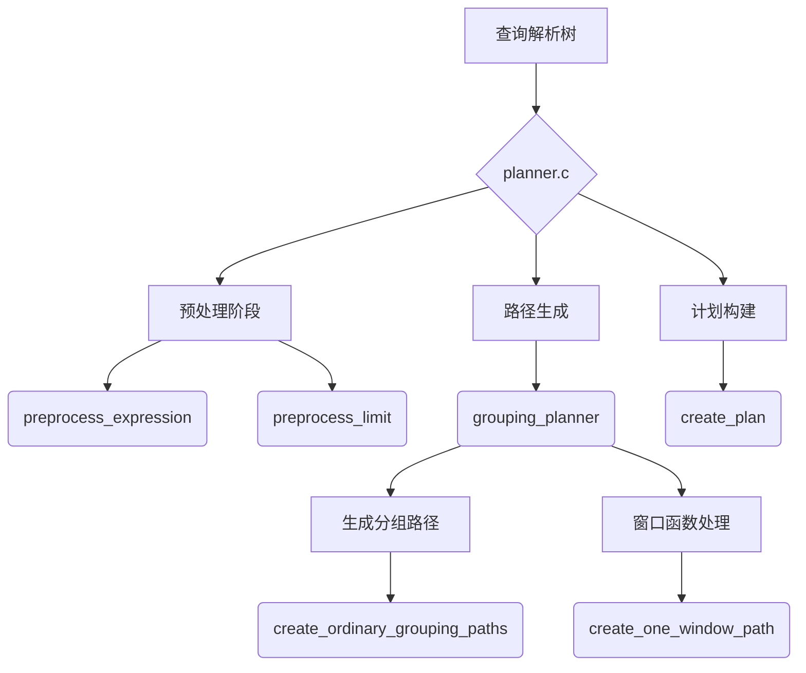
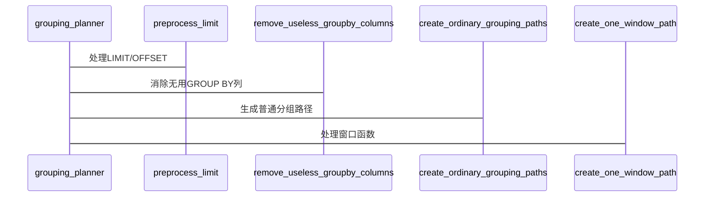
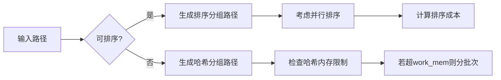

## AI辅助 PolarDB内核学习 - 24 优化器(plan模块) 入口代码 planner.c   
                
### 作者                        
digoal                        
                        
### 日期                        
2025-04-02                       
                        
### 标签                        
PostgreSQL , PolarDB , DuckDB , AI , 内核 , 学习 , plan , 入口代码 , planner.c        
                        
----                        
                        
## 背景                  
                
## 解读 优化器(plan模块) 入口代码 planner.c  
    
以下从多维度对PostgreSQL查询优化器核心模块planner.c进行深度解析：  
  
# 一、架构师视角 - 模块架构设计  

  
# 二、内核开发者视角 - 关键代码结构  
## 2.1 核心数据结构  
```c  
// 分组集数据（处理GROUPING SETS）  
typedef struct {  
    List       *rollups;        // 多层分组集合  
    double      dNumHashGroups; // 哈希分组估算数  
    Bitmapset  *unhashable_refs;// 不可哈希列  
} grouping_sets_data;  
  
// 窗口函数处理上下文  
typedef struct {  
    WindowClause *wc;           // 窗口子句  
    List       *uniqueOrder;    // 唯一排序键  
} WindowClauseSortData;  
```  
  
## 2.2 主流程（grouping_planner函数）  

  
# 三、DBA视角 - 优化器行为特征  
## 3.1 LIMIT优化示例  
```sql  
EXPLAIN SELECT * FROM orders ORDER BY order_date LIMIT 100;  
```  
优化器行为：  
1. `preprocess_limit`计算有效元组比例  
2. 优先选择带排序的索引扫描  
3. 当`order_date`有索引时，使用`IndexScan`+`Limit`  
4. 无索引时采用`Sort`+`SeqScan`  
  
## 3.2 分组优化策略  
```sql  
SELECT customer_id, SUM(amount)   
FROM orders   
GROUP BY customer_id   
HAVING SUM(amount) > 1000;  
```  
优化器决策点：  
1. 使用哈希聚合还是排序聚合  
2. HAVING条件下推时机  
3. 分组列基数估算（`dNumHashGroups`）  
  
# 四、关键算法深度解析  
## 4.1 分组路径生成（create_ordinary_grouping_paths）  

  
## 4.2 窗口函数优化（create_one_window_path）  
```c  
// 窗口函数处理核心逻辑  
static void create_one_window_path(...) {  
    // 步骤1：确定窗口排序键  
    get_windowclause_sort_order(...);  
      
    // 步骤2：生成排序路径  
    if (window_has_unique_sort)  
        pathkeys = NIL; // 无需额外排序  
    else  
        add_sort_node(...);  
          
    // 步骤3：添加窗口聚合节点  
    create_windowagg_path(...);  
}  
```  
  
典型优化场景：  
- 当窗口函数使用`UNIQUE`排序键时，跳过显式排序  
- 多个窗口函数共享相同`PARTITION BY`时合并计算  
  
# 五、并行查询处理  
## 5.1 并行度决策  
```c  
int plan_create_index_workers(Oid tableOid, Oid indexOid) {  
    // 基于表大小和配置参数计算  
    workers = Min(max_parallel_maintenance_workers,   
                 log2(rel_pages / 1000));  
    return workers;  
}  
```  
  
## 5.2 并行聚合优化  
```sql  
-- 原始执行计划  
Finalize GroupAggregate  
-> Gather Merge  
   -> Partial HashAggregate  
  
-- 优化条件：  
1. can_partial_agg()返回true  
2. 聚合函数支持并行（标记PARALLEL_SAFE）  
3. 无ORDER BY或GROUPING SETS  
```  
  
# 六、扩展机制  
## 6.1 优化器钩子  
```c  
// 插件可注入的钩子函数  
typedef PlannedStmt *(*planner_hook_type) (Query *parse,...);  
extern PGDLLIMPORT planner_hook_type planner_hook;  
  
// 示例：修改查询树  
static PlannedStmt *my_planner(...) {  
    if (parse->commandType == CMD_SELECT)  
        add_dummy_where_clause(parse); // 注入自定义条件  
    return standard_planner(...);  
}  
```  
  
## 6.2 自定义扫描提供程序  
通过`planner.c`中的`preprocess_expression`实现：  
```c  
Node *preprocess_expression(...) {  
    if (is_custom_scan_expr(expr))  
        rewrite_custom_scan_expr(...);  
    // 标准处理流程  
    return expr;  
}  
```  
  
# 七、诊断与调优  
## 7.1 常见问题模式  
| 现象 | 可能原因 | 检查点 |  
|------|---------|-------|  
| 未使用预期索引 | 成本估算偏差 | 检查`pg_stats`统计信息 |  
| 并行度不足 | 配置参数限制 | max_parallel_workers_per_gather |  
| 内存溢出 | work_mem不足 | 观察`EXPLAIN ANALYZE`的峰值内存 |  
  
## 7.2 性能调优参数  
```sql  
-- 关键配置示例  
SET random_page_cost = 1.1;     -- SSD优化  
SET work_mem = '64MB';          -- 提升排序/哈希性能  
SET parallel_setup_cost = 10;   -- 降低并行启动阈值  
SET enable_sort = off;          -- 强制使用哈希聚合  
```  
  
通过深入理解planner.c的实现机制，开发者可定制优化策略，DBA能精准诊断执行计划问题，架构师可设计更高效的数据库应用模式。建议结合`EXPLAIN (ANALYZE, VERBOSE)`输出与源码实现进行对比分析。  
  
      
## 提示           
```                
使用cursor                 
                
@planner.c @planner.h            
从数据库内核开发者、架构师、用户(应用开发者和DBA)多个角度通熟易懂的解读这个代码, 使用sequence、mermaid图表增加可读性, 使用恰当的例子增加对代码的解释. 关键内容务必要深入重点详细解释.           
                
长文本模式            
```                    
                          
## PolarDB & PostgreSQL 15 差异                          
```                      
git diff -u 50d3d22baba63613d1f1406b2ed460dc9b03c3fc f5e7493819e370d30ac2047c68c21c9fb03ce4a0 -- src/backend/optimizer/geqo           
```                      
                           
差异分析待补充.                        
                        
<b> 以上内容基于DeepSeek、QwQ及诸多AI生成, 轻微人工调整, 感谢杭州深度求索人工智能、阿里云等公司. </b>                        
                        
<b> AI 生成的内容请自行辨别正确性, 当然也多了些许踩坑的乐趣, 毕竟冒险是每个男人的天性.  </b>                        
                
       
  
#### [期望 PostgreSQL|开源PolarDB 增加什么功能?](https://github.com/digoal/blog/issues/76 "269ac3d1c492e938c0191101c7238216")
  
  
#### [PolarDB 开源数据库](https://openpolardb.com/home "57258f76c37864c6e6d23383d05714ea")
  
  
#### [PolarDB 学习图谱](https://www.aliyun.com/database/openpolardb/activity "8642f60e04ed0c814bf9cb9677976bd4")
  
  
#### [PostgreSQL 解决方案集合](../201706/20170601_02.md "40cff096e9ed7122c512b35d8561d9c8")
  
  
#### [德哥 / digoal's Github - 公益是一辈子的事.](https://github.com/digoal/blog/blob/master/README.md "22709685feb7cab07d30f30387f0a9ae")
  
  
#### [About 德哥](https://github.com/digoal/blog/blob/master/me/readme.md "a37735981e7704886ffd590565582dd0")
  
  

  
