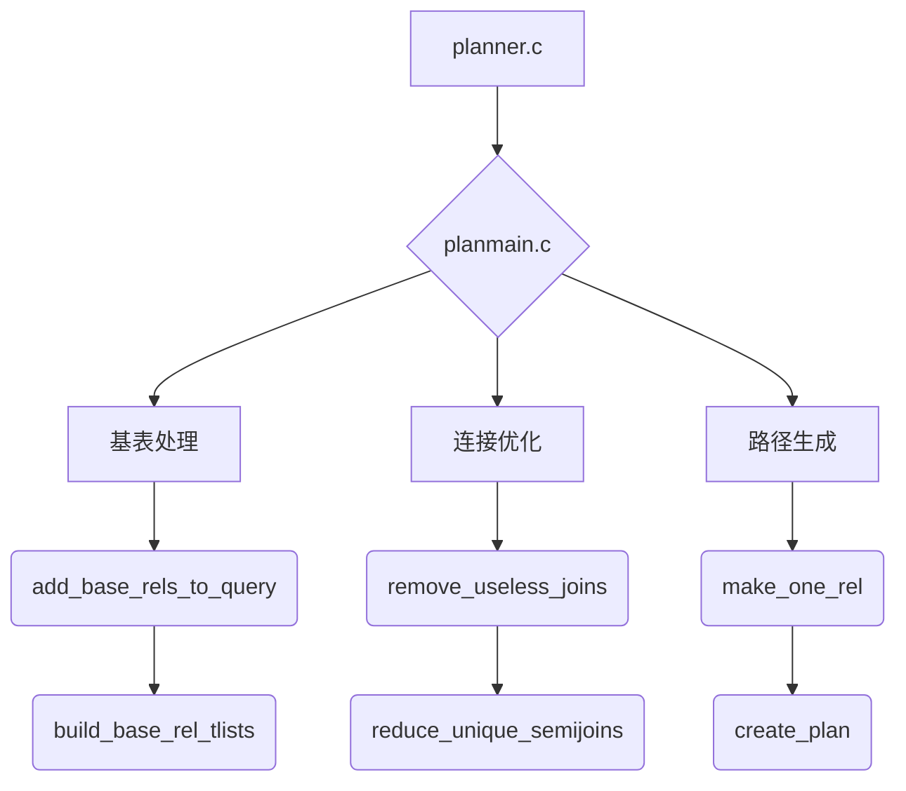
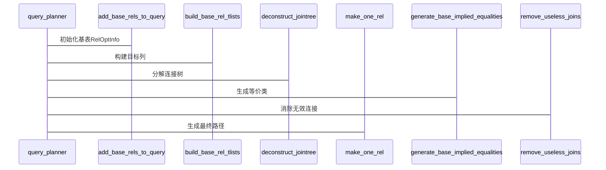
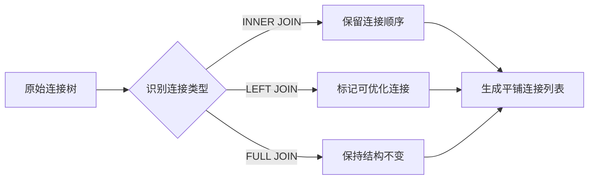

## AI辅助 PolarDB内核学习 - 25 优化器(plan模块) 核心模块 planmain.c  
  
### 作者  
digoal  
  
### 日期  
2025-04-02  
  
### 标签  
PostgreSQL , PolarDB , DuckDB , AI , 内核 , 学习 , plan , 入口代码 , planmain.c  
  
----  
  
## 背景  
  
## 解读 优化器(plan模块) 核心模块 planmain.c  
  
以下从多维度对PostgreSQL优化器核心模块planmain.c进行深度解析：  
  
# 一、架构师视角 - 模块定位与流程  

  
# 二、内核开发者视角 - 核心代码解析  
## 2.1 主流程（query_planner函数）  

  
## 2.2 关键数据结构  
```c  
// 连接消除上下文（analyzejoins.c）  
typedef struct {  
    List       *joinlist;       // 原始连接列表  
    Relids      outer_rels;     // 外层关系集合  
    bool        removed_any;    // 是否执行过删除  
} JoinRemovalContext;  
  
// 等价类信息（planmain.c）  
typedef struct {  
    List       *ec_members;     // 等价成员列表  
    Relids      ec_relids;      // 涉及的基表集合  
} EquivalenceClass;  
```  
  
# 三、DBA视角 - 优化器行为特征  
## 3.1 外连接优化示例  
```sql  
EXPLAIN SELECT *  
FROM A LEFT JOIN B ON A.id=B.aid  
WHERE B.x IS NOT NULL;  
```  
优化器行为：  
1. `remove_useless_joins`检测到WHERE条件使LEFT JOIN等价于INNER JOIN  
2. 重写连接类型为INNER JOIN   -- PS: 应该是 B.* is not null? 或 B.x 有not null约束?  
3. 优化后的执行计划减少不必要的NULL扩展  
  
## 3.2 统计信息应用  
| 统计指标         | 影响决策               | 示例                |  
|------------------|------------------------|---------------------|  
| reltuples        | 连接顺序选择           | 小表作为驱动表      |  
| pg_stats.correlation | 索引有效性判断    | 范围查询选择索引扫描|  
| pg_class.relpages | 并行度计算           | parallel_workers设置|  
  
# 四、重点算法深度解析  
## 4.1 连接树分解（deconstruct_jointree）  

  
## 4.2 等价类生成  
```c  
void generate_base_implied_equalities(PlannerInfo *root) {  
    foreach(ec, root->eq_classes) {  
        if (ec->ec_has_const) {  
            // 生成形如A.x = 5的约束  
            distribute_restrictinfo_to_rels(...);  
        }  
        if (ec->ec_broken)  
            continue;  
        // 生成跨表等价条件  
        generate_join_implied_equalities(...);  
    }  
}  
```  
典型场景：  
```sql  
WHERE A.x = B.y AND B.y = 10  
→ 推导出A.x = 10  
```  
  
# 五、并行查询处理  
## 5.1 并行度决策逻辑  
```c  
// planmain.c中并行安全检查  
final_rel->consider_parallel =  
    root->glob->parallelModeOK &&  
    is_parallel_safe(root, parse->jointree->quals);  
```  
影响因素：  
1. 基表的parallel_safe标记  
2. 表达式中的并行不安全函数  
3. GUC参数force_parallel_mode  
  
## 5.2 并行执行示例  
```sql  
CREATE TABLE t (id int) WITH (parallel_workers = 4);  
EXPLAIN SELECT COUNT(*) FROM t;  
-- 可能生成并行计划：  
Finalize Aggregate  
-> Gather  
   -> Partial Aggregate  
      -> Parallel Seq Scan  
```  
  
# 六、扩展机制  
## 6.1 自定义优化规则  
通过`set_plan_references`扩展点：  
```c  
Plan *set_plan_references(...) {  
    if (plan->type == T_CustomScan) {  
        // 处理自定义扫描类型  
        handle_custom_scan_refs(...);  
    }  
    // 标准处理流程  
    return plan;  
}  
```  
  
## 6.2 连接消除扩展  
```c  
// analyzejoins.c扩展示例  
static bool  
custom_join_is_removable(...) {  
    if (custom_check_condition(...))  
        return true;  
    return false;  
}  
```  
  
# 七、诊断与调优  
## 7.1 执行计划分析要点  
```sql  
EXPLAIN (ANALYZE, BUFFERS)  
SELECT * FROM A JOIN B ON A.id=B.aid;  
```  
关注点：  
1. 连接顺序是否最优  
2. 连接方法选择（Hash Join vs Merge Join）  
3. 内存使用是否合理  
  
## 7.2 关键GUC参数  
```sql  
-- 优化器行为控制  
SET enable_nestloop = off;      -- 禁用嵌套循环  
SET join_collapse_limit = 8;    -- 控制连接重排序  
SET from_collapse_limit = 8;    -- 控制子查询展开  
```  
  
# 八、代码演进建议  
1. **动态统计信息更新**：  
```c  
// 在build_base_rel_tlists中添加：  
if (need_stats_update(rel))  
    auto_analyze_rel(rel);  
```  
2. **机器学习代价预测**：  
```python  
# 在生成路径时调用预测模型  
cost = ml_predict_cost(path_features)  
```  
  
通过深入理解planmain.c的实现，开发者可以更好地定制优化规则，DBA能精准识别执行计划瓶颈，架构师可设计更高效的查询模式。建议结合EXPLAIN输出与源码调试器（gdb）观察优化器决策过程。  
  
## 提示  
```  
使用cursor  
  
@planmain.c @planmain.h  
从数据库内核开发者、架构师、用户(应用开发者和DBA)多个角度通熟易懂的解读这个代码, 使用sequence、mermaid图表增加可读性, 使用恰当的例子增加对代码的解释. 关键内容务必要深入重点详细解释.  
  
长文本模式  
```  
  
## PolarDB & PostgreSQL 15 差异  
```  
git diff -u 50d3d22baba63613d1f1406b2ed460dc9b03c3fc f5e7493819e370d30ac2047c68c21c9fb03ce4a0 -- src/backend/optimizer/geqo  
```  
  
差异分析待补充.  
  
<b> 以上内容基于DeepSeek、QwQ及诸多AI生成, 轻微人工调整, 感谢杭州深度求索人工智能、阿里云等公司. </b>  
  
<b> AI 生成的内容请自行辨别正确性, 当然也多了些许踩坑的乐趣, 毕竟冒险是每个男人的天性.  </b>  
  
  
  
#### [期望 PostgreSQL|开源PolarDB 增加什么功能?](https://github.com/digoal/blog/issues/76 "269ac3d1c492e938c0191101c7238216")
  
  
#### [PolarDB 开源数据库](https://openpolardb.com/home "57258f76c37864c6e6d23383d05714ea")
  
  
#### [PolarDB 学习图谱](https://www.aliyun.com/database/openpolardb/activity "8642f60e04ed0c814bf9cb9677976bd4")
  
  
#### [PostgreSQL 解决方案集合](../201706/20170601_02.md "40cff096e9ed7122c512b35d8561d9c8")
  
  
#### [德哥 / digoal's Github - 公益是一辈子的事.](https://github.com/digoal/blog/blob/master/README.md "22709685feb7cab07d30f30387f0a9ae")
  
  
#### [About 德哥](https://github.com/digoal/blog/blob/master/me/readme.md "a37735981e7704886ffd590565582dd0")
  
  

  
