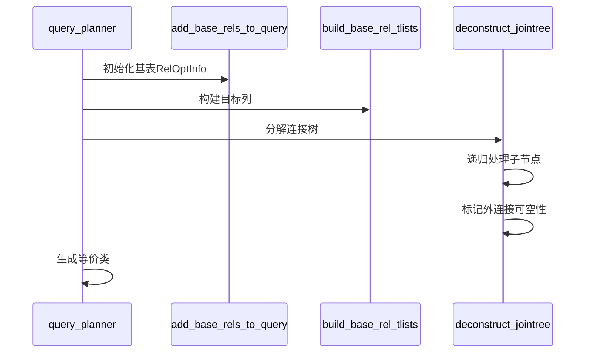
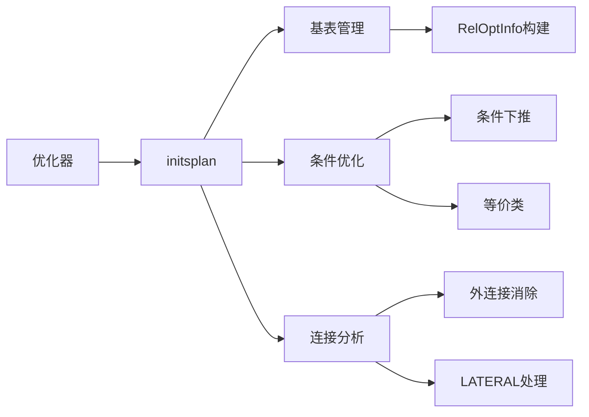

## AI辅助 PolarDB内核学习 - 26 优化器(plan模块) 核心模块 initsplan.c   
    
### 作者    
digoal    
    
### 日期    
2025-04-02    
    
### 标签    
PostgreSQL , PolarDB , DuckDB , AI , 内核 , 学习 , plan , initsplan.c   
    
----    
    
## 背景    
    
## 解读 优化器(plan模块) 核心模块 initsplan.c   
  
**代码作用简述**：  
`initsplan.c` 是 PostgreSQL 优化器的核心模块，负责初始化查询的基表信息、分解 WHERE/JOIN 条件到对应关系、构建等价类、处理 LATERAL 引用及外键约束，为后续的路径优化奠定基础。

### **内核开发者视角 - 核心机制解析**  


**关键代码逻辑**：  
1. **条件分发 (`distribute_qual_to_rels`)**  
   - **输入**：原始条件（如 `A.id=B.aid`）
   - **处理**：
     - 检查外连接延迟 (`check_outerjoin_delay`)
     - 识别可合并条件 (`check_mergejoinable`)
     - 分发到单表或连接关系 (`distribute_restrictinfo_to_rels`)
   - **输出**：`RestrictInfo` 结构，标记作用域和属性

2. **等价类生成 (`generate_base_implied_equalities`)**  
   ```c
   // 示例：WHERE A.x=B.y AND B.y=10
   if (ec->ec_has_const) {
       generate A.x=10  // 生成跨表等价
   }
   ```

### **架构师视角 - 模块设计**  


**设计亮点**：  
- **动态条件延迟**：通过 `check_outerjoin_delay` 处理外连接语义约束，确保条件在正确层级应用  
- **外键智能匹配**：`match_foreign_keys_to_quals` 将外键约束与查询条件关联，提升多表连接估算精度  
- **LATERAL依赖追踪**：`find_lateral_references` 确保横向引用变量正确传递  

### **应用开发者视角 - 查询优化示例**  
**场景**：多表 JOIN 性能优化  
```sql
EXPLAIN SELECT * 
FROM orders o JOIN customers c ON o.cid = c.id
WHERE o.total > 100 AND c.country = 'US';
```
**优化器行为**：  
1. 将 `o.total > 100` 下推至 `orders` 表 (`distribute_restrictinfo_to_rels`)  
2. 识别 `o.cid=c.id` 为等值连接，生成等价类  
3. 若存在 `(customers.id) REFERENCES orders(cid)` 外键，使用 FK 基数估算  

### **DBA视角 - 调优实践**  
**关键参数与诊断**：  
```sql
-- 查看条件分布
EXPLAIN (VERBOSE) SELECT ...;

-- 检查外键利用
SELECT * FROM pg_stats WHERE tablename = 'orders';

-- 控制连接重排序
SET join_collapse_limit = 8; 
```

**常见问题与对策**：  
| 现象 | 根因 | 解决方案 |  
|------|------|----------|  
| 顺序扫描低效 | 条件未下推 | 检查 `WHERE` 条件索引 |  
| 嵌套循环耗时 | 缺少等价类 | 添加组合索引或调整连接顺序 |  
| 外连接性能差 | 可空列估算偏差 | 手动更新统计或使用 `LEAKPROOF` 函数 |  


### **核心创新 - 条件延迟处理**  
**机制**：  
```c
static bool check_outerjoin_delay(...) {
    do {
        // 遍历所有下层外连接
        if (当前条件依赖外连接可空侧) {
            relids = 合并外连接两侧 rels;  // 强制提升作用域
            delayed = true;
        }
    } while (发现新的依赖);
}
```
**效果**：避免过早过滤外连接产生的 NULL 行，确保查询语义正确性。例如：  
```sql
SELECT * FROM A LEFT JOIN B ON A.id=B.aid WHERE B.x > 10;
-- 若 B 未匹配，B.x 为 NULL，WHERE 条件需在 JOIN 后应用
```

**总结**：  
`initsplan.c` 通过精细的条件分发和语义分析，构建查询优化的核心框架。开发者需关注等价类与统计信息的交互，DBA 应结合执行计划分析索引与参数调优，而架构师则需理解模块间的数据流以设计高效查询引擎。
  
  
## 提示    
```    
使用cursor    
    
@initsplan.c  
先用几句话阐述代码作用, 然后从数据库内核开发者、架构师、用户(应用开发者和DBA)多个角度通熟易懂的解读这个代码, 使用sequence、mermaid图表以及恰当的例子提升代码可读性. 关键内容务必要深入重点详细解释.    
    
长文本模式    
```    
    
## PolarDB & PostgreSQL 15 差异    
```    
git diff -u 50d3d22baba63613d1f1406b2ed460dc9b03c3fc f5e7493819e370d30ac2047c68c21c9fb03ce4a0 -- src/backend/optimizer/geqo    
```    
    
差异分析待补充.    
    
<b> 以上内容基于DeepSeek、QwQ及诸多AI生成, 轻微人工调整, 感谢杭州深度求索人工智能、阿里云等公司. </b>    
    
<b> AI 生成的内容请自行辨别正确性, 当然也多了些许踩坑的乐趣, 毕竟冒险是每个男人的天性.  </b>    
    
  
#### [期望 PostgreSQL|开源PolarDB 增加什么功能?](https://github.com/digoal/blog/issues/76 "269ac3d1c492e938c0191101c7238216")
  
  
#### [PolarDB 开源数据库](https://openpolardb.com/home "57258f76c37864c6e6d23383d05714ea")
  
  
#### [PolarDB 学习图谱](https://www.aliyun.com/database/openpolardb/activity "8642f60e04ed0c814bf9cb9677976bd4")
  
  
#### [PostgreSQL 解决方案集合](../201706/20170601_02.md "40cff096e9ed7122c512b35d8561d9c8")
  
  
#### [德哥 / digoal's Github - 公益是一辈子的事.](https://github.com/digoal/blog/blob/master/README.md "22709685feb7cab07d30f30387f0a9ae")
  
  
#### [About 德哥](https://github.com/digoal/blog/blob/master/me/readme.md "a37735981e7704886ffd590565582dd0")
  
  

  
