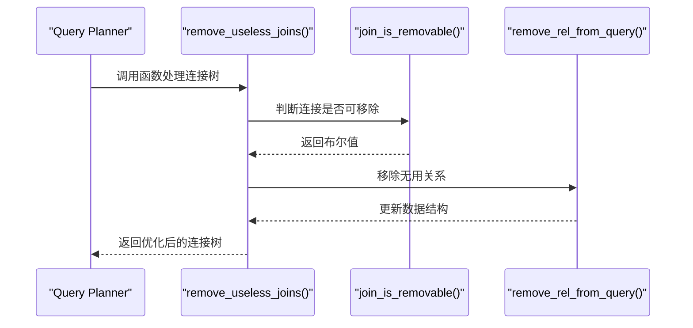
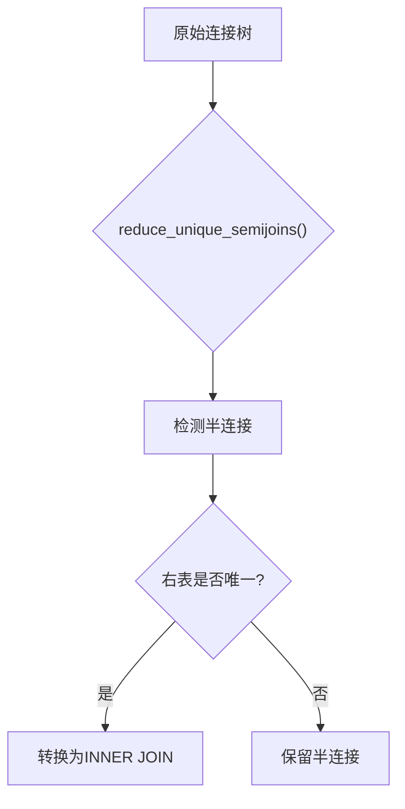
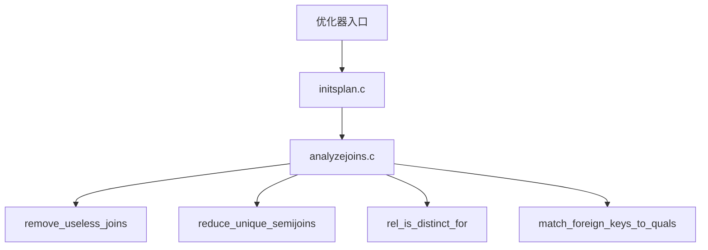
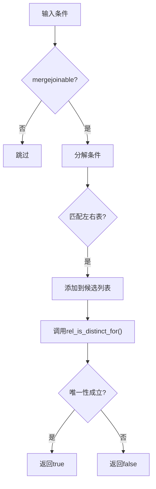
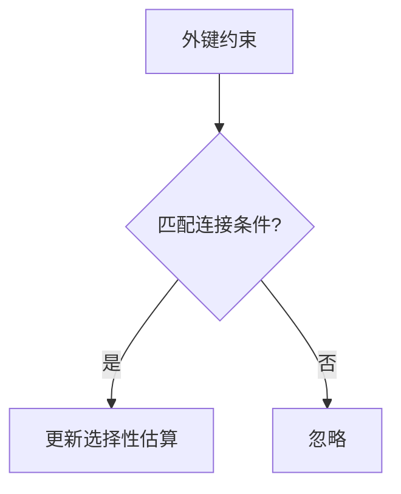
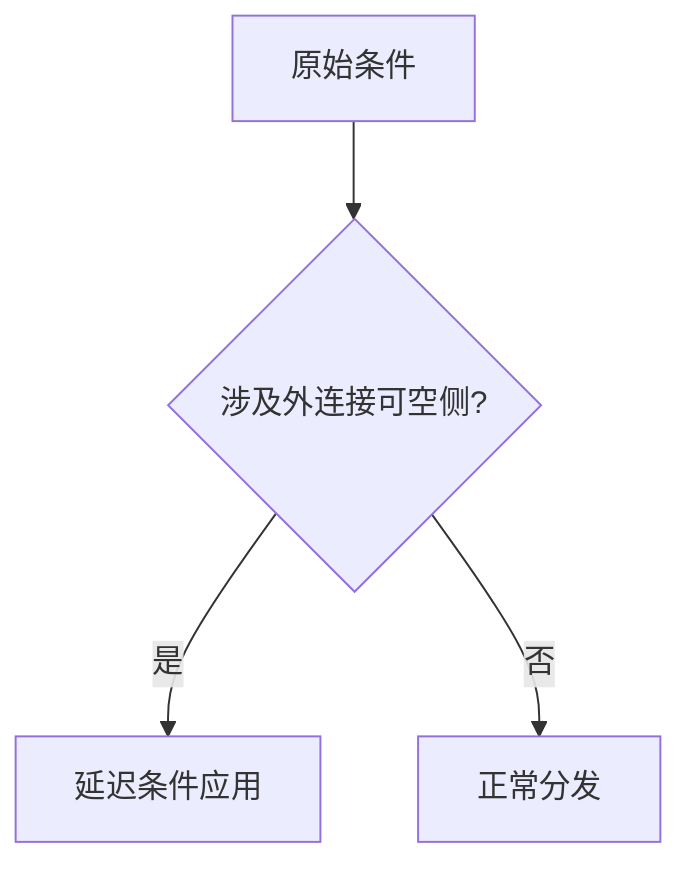
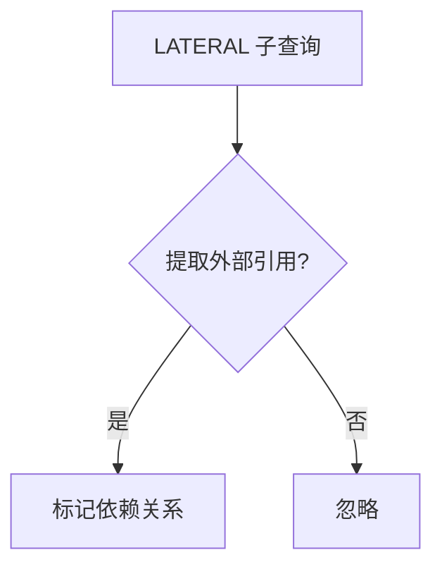

## AI辅助 PolarDB内核学习 - 27 优化器(plan模块) 核心模块 analyzejoins.c     
      
### 作者      
digoal      
      
### 日期      
2025-04-02      
      
### 标签      
PostgreSQL , PolarDB , DuckDB , AI , 内核 , 学习 , plan , analyzejoins.c     
      
----      
      
## 背景      
      
## 解读 优化器(plan模块) 核心模块 analyzejoins.c     
    
### **代码作用简述**    
`analyzejoins.c` 是 PostgreSQL 查询优化器的核心模块之一，专注于连接树的简化和优化。它通过分析连接条件、基表属性以及外键约束等信息，实现以下功能：    
1. **消除无用连接**：识别并移除那些不会影响查询结果的连接（如LEFT JOIN中可省略的右表）。    
2. **简化半连接**：将满足唯一性条件的半连接（SEMI JOIN）转化为普通INNER JOIN。    
3. **保证语义正确性**：在优化过程中确保连接语义不受破坏，同时提升执行计划效率。    
  
## **一、内核开发者视角 - 核心机制解析**  
  
### 1.1 消除无用连接 (`remove_useless_joins`)  

  
#### 关键逻辑：  
- **判断连接是否可移除**：通过 `join_is_removable()` 检查连接条件是否唯一化右表，且右表未被上层引用。  
- **移除无用关系**：调用 `remove_rel_from_query()` 删除右表，并更新所有相关数据结构（如 `attr_needed` 和 `SpecialJoinInfo`）。  
  
#### 示例场景：  
```sql  
SELECT *   
FROM A LEFT JOIN B ON A.id = B.aid   
WHERE B.* IS NOT NULL;  
```  
优化器行为：  
1. 检测到 `B.* IS NOT NULL` 条件使 `LEFT JOIN` 等价于 `INNER JOIN`。  
2. 将 `LEFT JOIN` 转换为 `INNER JOIN`，减少不必要的 NULL 行生成。  
  
### 1.2 简化半连接 (`reduce_unique_semijoins`)  

  
#### 关键逻辑：  
- **检测半连接唯一性**：通过 `innerrel_is_unique_for()` 检查右表是否对左表唯一。  
- **转换连接类型**：若右表唯一，则将 SEMI JOIN 转换为 INNER JOIN。  
  
#### 示例场景：  
```sql  
SELECT *   
FROM A   
WHERE EXISTS (SELECT 1 FROM B WHERE A.id = B.aid);  
```  
优化器行为：  
1. 检测到 `A.id = B.aid` 且 `B` 表具有唯一索引。  
2. 将 SEMI JOIN 转换为 INNER JOIN，减少不必要的重复行检查。  
  
  
## **二、架构师视角 - 模块设计与交互**  
  

  
#### 设计亮点：  
1. **动态条件延迟**：通过 `check_outerjoin_delay` 确保条件在正确层级应用，避免破坏外连接语义。  
2. **唯一性证明**：利用索引和等价类信息（`relation_has_unique_index_for`），证明右表唯一性。  
3. **多级缓存**：通过 `unique_for_rels` 和 `non_unique_for_rels` 缓存唯一性验证结果，减少重复计算。  
  
#### 数据流：  
- 输入：`PlannerInfo` 和连接树（`joinlist`）。  
- 输出：优化后的连接树。  
- 中间状态：更新 `RelOptInfo` 和 `SpecialJoinInfo` 的相关字段。  
  
## **三、用户视角 - 实际应用场景与收益**  
  
### 3.1 DBA 视角 - 执行计划优化  
  
#### 示例 1：消除无用连接  
```sql  
EXPLAIN SELECT *   
FROM orders o   
LEFT JOIN customers c ON o.cid = c.id   
WHERE c.id IS NOT NULL;  
```  
优化前：  
- 左连接生成 NULL 行。  
- 过滤条件 `c.id IS NOT NULL` 导致部分 NULL 行被丢弃。  
  
优化后：  
- 左连接转为内连接，减少不必要的 NULL 行生成。  
  
#### 示例 2：简化半连接  
```sql  
EXPLAIN SELECT *   
FROM A   
WHERE EXISTS (SELECT 1 FROM B WHERE A.id = B.aid);  
```  
优化前：  
- 半连接可能导致重复行检查。  
  
优化后：  
- 若 `B.aid` 具有唯一索引，则直接使用 INNER JOIN，提升性能。  
  
### 3.2 应用开发者视角 - 性能调优技巧  
  
#### 常见问题：  
| 现象 | 根因 | 解决方案 |  
|------|------|----------|  
| 左连接性能差 | 右表基数过高或条件不充分 | 添加唯一索引或调整连接条件 |  
| 半连接低效 | 条件复杂或右表非唯一 | 简化条件或确保右表唯一 |  
  
#### 示例参数调整：  
```sql  
-- 控制连接重排序  
SET join_collapse_limit = 8;  
  
-- 强制禁用遗传算法优化  
SET geqo = off;  
```  
  
## **四、核心算法深度解析**  
  
### 4.1 唯一性证明 (`is_innerrel_unique_for`)  

  
#### 关键点：  
1. **条件过滤**：仅考虑 `mergejoinable` 的等值条件（如 `=`）。  
2. **左右表匹配**：确保条件形式为 `outer op inner` 或 `inner op outer`。  
3. **唯一性验证**：通过 `rel_is_distinct_for()` 检查右表是否唯一。  
  
#### 示例：  
```sql  
SELECT *   
FROM A   
JOIN B ON A.id = B.aid;  
```  
假设 `B(aid)` 上存在唯一索引，则优化器可以安全地认为 `B` 表唯一。  
  
  
### 4.2 外键约束匹配 (`match_foreign_keys_to_quals`)  

  
#### 关键点：  
- **外键发现**：通过 `root->fkey_list` 获取外键信息。  
- **条件匹配**：将外键约束与查询条件关联，提升多表连接的选择性估算精度。  
  
#### 示例：  
```sql  
SELECT *   
FROM A   
JOIN B ON A.fk = B.pk;  
```  
优化器利用外键约束 `A(fk) REFERENCES B(pk)`，精确估算连接基数。  
  
  
## **五、诊断与调优建议**  
  
### 5.1 执行计划分析  
```sql  
EXPLAIN (ANALYZE, VERBOSE) SELECT ...;  
```  
关注点：  
1. 是否存在多余的 NULL 行生成。  
2. 半连接是否被正确转换为 INNER JOIN。  
3. 条件是否下推至正确层级。  
  
### 5.2 参数调优  
| 参数 | 默认值 | 说明 |  
|------|--------|------|  
| `join_collapse_limit` | 8 | 控制连接重排序深度 |  
| `from_collapse_limit` | 8 | 控制子查询展开深度 |  
| `geqo_threshold` | 12 | 遗传算法触发阈值 |  
  
#### 示例：  
```sql  
-- 提升连接重排序深度  
SET join_collapse_limit = 16;  
  
-- 禁用遗传算法优化  
SET geqo = off;  
```  
  
## **六、创新机制解读**  
  
### 6.1 动态条件延迟 (`check_outerjoin_delay`)  

  
#### 效果：  
- 防止条件被错误地下推至外连接可空侧，导致语义错误。  
- 示例：`LEFT JOIN` 中的条件必须在连接后应用。  
  
  
### 6.2 LATERAL 引用追踪 (`find_lateral_references`)  

  
#### 效果：  
- 确保 LATERAL 子查询中的外部变量正确传递。  
- 示例：  
```sql  
SELECT *   
FROM A, LATERAL (SELECT * FROM B WHERE B.x = A.y) AS sub;  
```  
优化器会将 `A.y` 标记为需要提前投影。  
  
  
## **七、总结**  
  
`analyzejoins.c` 通过精细化的条件分析和语义验证，实现了连接树的高效优化。开发者需理解条件延迟与唯一性证明机制，DBA 应结合统计信息与执行计划进行调优，而架构师则需关注模块间的协作以设计更高效的查询引擎。  
  
    
## 提示      
```      
使用cursor      
      
@analyzejoins.c    
先用几句话阐述代码作用, 然后从数据库内核开发者、架构师、用户(应用开发者和DBA)多个角度通熟易懂的解读这个代码, 使用sequence、mermaid图表以及恰当的例子提升代码可读性. 关键内容务必要深入重点详细解释.      
      
长文本模式      
```      
      
## PolarDB & PostgreSQL 15 差异      
```      
git diff -u 50d3d22baba63613d1f1406b2ed460dc9b03c3fc f5e7493819e370d30ac2047c68c21c9fb03ce4a0 -- src/backend/optimizer/plan/analyzejoins.c      
```      
      
差异分析待补充.      
      
<b> 以上内容基于DeepSeek、QwQ及诸多AI生成, 轻微人工调整, 感谢杭州深度求索人工智能、阿里云等公司. </b>      
      
<b> AI 生成的内容请自行辨别正确性, 当然也多了些许踩坑的乐趣, 毕竟冒险是每个男人的天性.  </b>      
      
  
#### [期望 PostgreSQL|开源PolarDB 增加什么功能?](https://github.com/digoal/blog/issues/76 "269ac3d1c492e938c0191101c7238216")
  
  
#### [PolarDB 开源数据库](https://openpolardb.com/home "57258f76c37864c6e6d23383d05714ea")
  
  
#### [PolarDB 学习图谱](https://www.aliyun.com/database/openpolardb/activity "8642f60e04ed0c814bf9cb9677976bd4")
  
  
#### [PostgreSQL 解决方案集合](../201706/20170601_02.md "40cff096e9ed7122c512b35d8561d9c8")
  
  
#### [德哥 / digoal's Github - 公益是一辈子的事.](https://github.com/digoal/blog/blob/master/README.md "22709685feb7cab07d30f30387f0a9ae")
  
  
#### [About 德哥](https://github.com/digoal/blog/blob/master/me/readme.md "a37735981e7704886ffd590565582dd0")
  
  

  
