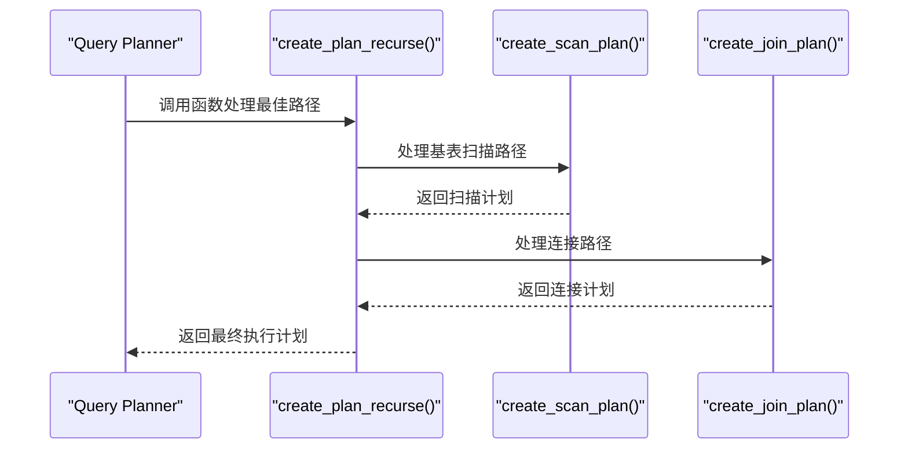
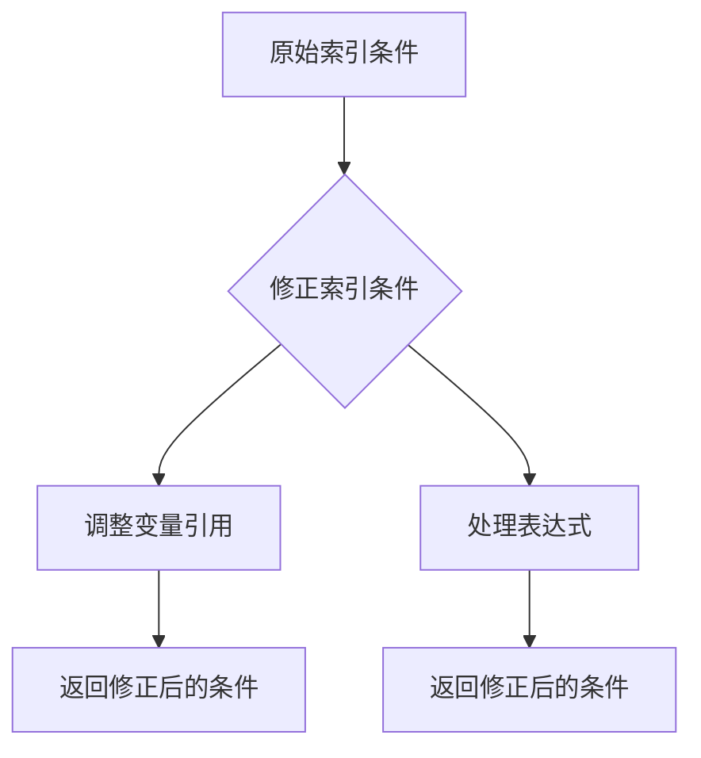
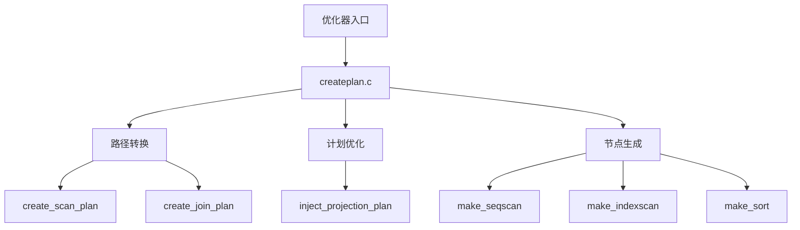
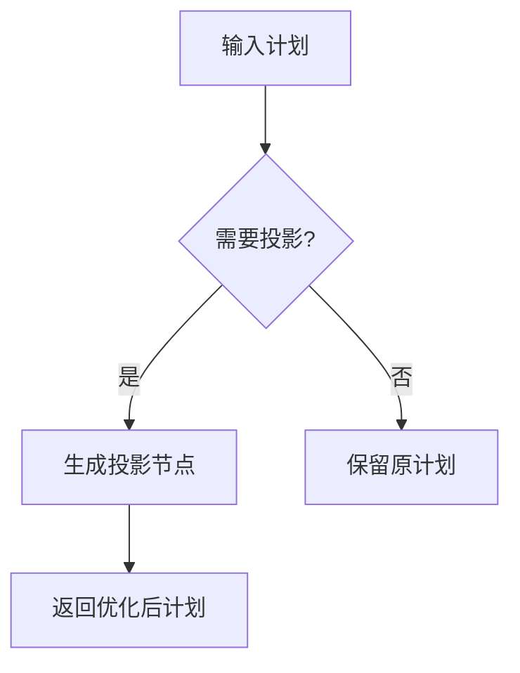
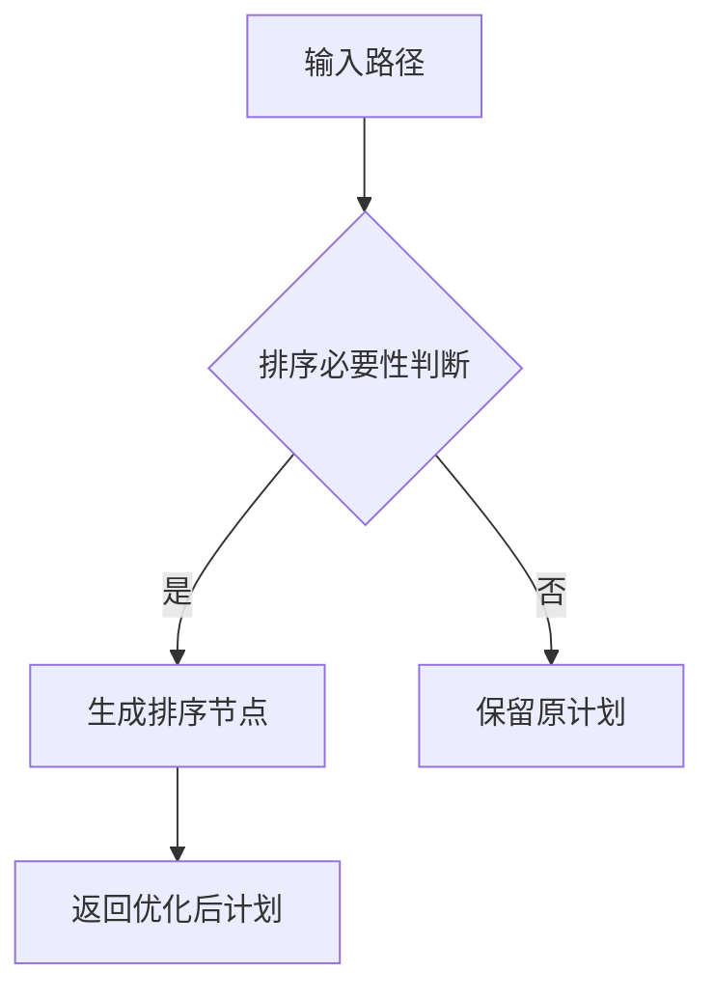
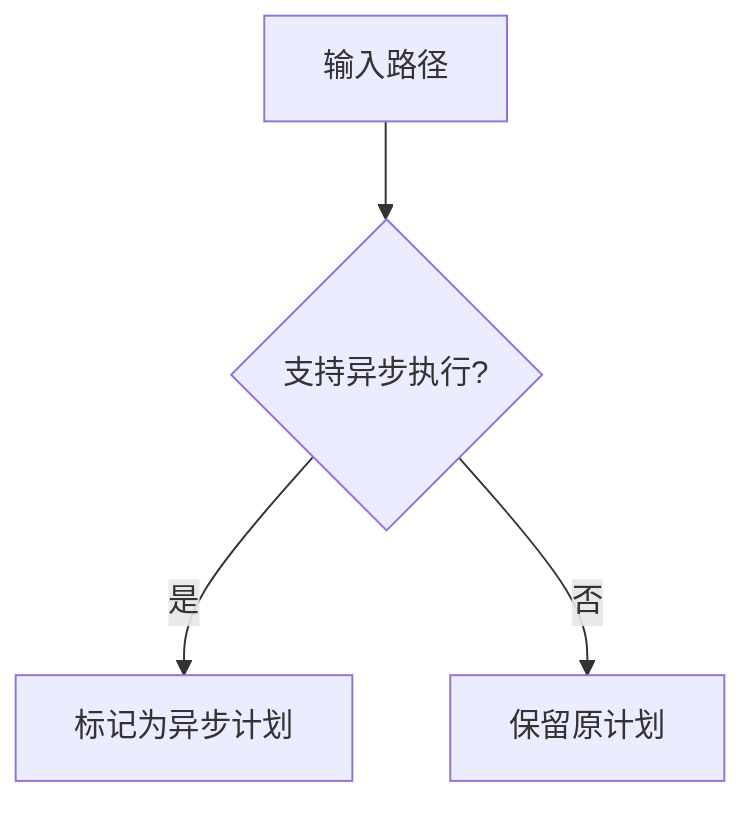
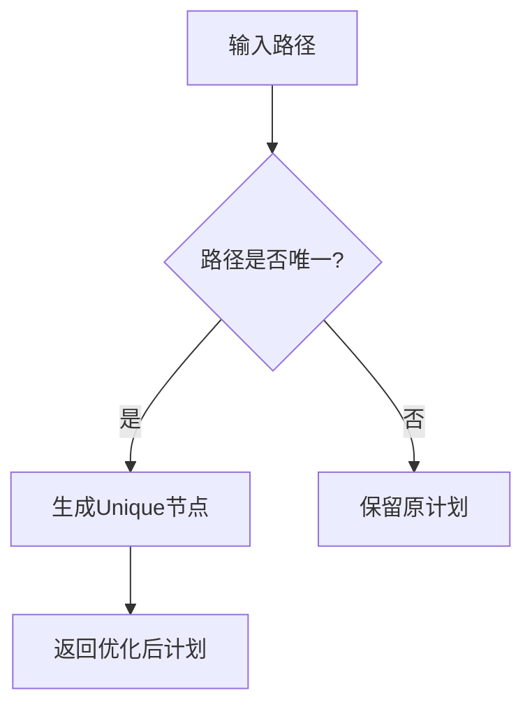

## AI辅助 PolarDB内核学习 - 28 优化器(plan模块) 核心模块 createplan.c     
        
### 作者        
digoal        
        
### 日期        
2025-04-02        
        
### 标签        
PostgreSQL , PolarDB , DuckDB , AI , 内核 , 学习 , plan , createplan.c       
        
----        
        
## 背景        
        
## 解读 优化器(plan模块) 核心模块 createplan.c       
  
### **代码作用简述**    
`createplan.c` 是 PostgreSQL 查询优化器的核心模块之一，负责将路径（Path）转换为实际的执行计划（Plan）。它根据路径类型（如索引扫描、排序、聚合等）生成对应的执行节点（如 `SeqScan`, `IndexScan`, `Sort` 等），并确保计划的正确性和高效性。  
  
---  
  
## **一、内核开发者视角 - 核心机制解析**  
  
### 1.1 路径到计划的转换流程 (`create_plan_recurse`)  

  
#### 关键逻辑：  
- **路径分类**：根据路径类型调用不同的子函数（如 `create_scan_plan` 或 `create_join_plan`）。  
- **递归处理**：对于嵌套路径（如连接或子查询），递归生成子计划。  
- **计划优化**：通过 `inject_projection_plan` 和 `change_plan_targetlist` 确保目标列表和条件正确传递。  
  
#### 示例场景：  
```sql  
SELECT * FROM A JOIN B ON A.id = B.aid;  
```  
优化器行为：  
1. 生成基表扫描路径（`SeqScan` 或 `IndexScan`）。  
2. 生成连接路径（`NestLoop`, `HashJoin`, 或 `MergeJoin`）。  
3. 将路径转换为执行计划，并注入投影节点。  
  
  
### 1.2 索引条件修正 (`fix_indexqual_references`)  

  
#### 关键点：  
- **变量引用调整**：确保索引条件中的变量引用与执行计划一致。  
- **表达式处理**：对复杂表达式（如函数调用）进行深度修正。  
  
#### 示例：  
```sql  
SELECT * FROM A WHERE A.x > 5;  
```  
假设存在索引 `idx_x`，优化器会将条件 `A.x > 5` 转换为适合索引扫描的形式。  
  
  
## **二、架构师视角 - 模块设计与交互**  
  
### 2.1 模块分工  

  
#### 设计亮点：  
1. **路径抽象化**：支持多种路径类型（如基表扫描、连接、排序等），并通过统一接口生成计划。  
2. **计划层次化**：通过递归生成子计划，确保复杂查询的正确性。  
3. **性能优化**：在计划生成过程中注入投影节点，减少不必要的计算。  
  
  
## **三、用户视角 - 实际应用场景与收益**  
  
### 3.1 DBA 视角 - 执行计划优化  
  
#### 示例 1：索引扫描优化  
```sql  
EXPLAIN SELECT * FROM A WHERE A.x = 10;  
```  
优化器行为：  
1. 检测到条件 `A.x = 10` 可以使用索引 `idx_x`。  
2. 生成 `IndexScan` 计划，避免全表扫描。  
  
#### 示例 2：连接顺序优化  
```sql  
EXPLAIN SELECT * FROM A JOIN B ON A.id = B.aid;  
```  
优化器行为：  
1. 选择基数较小的表作为驱动表。  
2. 根据统计信息生成最优连接计划（如 `HashJoin` 或 `MergeJoin`）。  
  
  
### 3.2 应用开发者视角 - 性能调优技巧  
  
#### 常见问题：  
| 现象 | 根因 | 解决方案 |  
|------|------|----------|  
| 全表扫描低效 | 缺少合适索引 | 添加索引或调整查询条件 |  
| 连接性能差 | 驱动表选择不当 | 分析统计信息，调整表顺序 |  
  
#### 示例参数调整：  
```sql  
-- 控制计划生成行为  
SET enable_indexscan = on;  -- 启用索引扫描  
SET enable_hashjoin = on;   -- 启用哈希连接  
```  
  
  
## **四、核心算法深度解析**  
  
### 4.1 投影计划注入 (`inject_projection_plan`)  

  
#### 关键点：  
- **投影必要性判断**：通过 `use_physical_tlist` 判断是否需要生成投影节点。  
- **节点生成**：调用 `make_projection` 创建投影计划。  
  
#### 示例：  
```sql  
SELECT A.x + 1 AS y FROM A;  
```  
优化器行为：  
1. 检测到目标列表包含表达式 `A.x + 1`。  
2. 在基表扫描计划后注入投影节点。  
  
  
### 4.2 排序计划生成 (`create_sort_plan`)  

  
#### 关键逻辑：  
- **路径分析**：检测路径是否需要排序（如 `Order By` 或 `Group By`）。  
- **节点生成**：调用 `make_sort` 或 `make_incrementalsort` 创建排序计划。  
  
#### 示例：  
```sql  
SELECT * FROM A ORDER BY A.x;  
```  
优化器行为：  
1. 检测到 `Order By` 条件。  
2. 生成 `Sort` 节点，确保输出按 `A.x` 排序。  
  
  
## **五、诊断与调优建议**  
  
### 5.1 执行计划分析  
```sql  
EXPLAIN (ANALYZE, VERBOSE) SELECT ...;  
```  
关注点：  
1. 是否使用了预期的扫描方法（如索引扫描）。  
2. 排序和投影节点是否合理。  
3. 内存使用是否符合预期。  
  
### 5.2 参数调优  
| 参数 | 默认值 | 说明 |  
|------|--------|------|  
| `enable_indexscan` | on | 启用索引扫描 |  
| `enable_bitmapscan` | on | 启用位图扫描 |  
| `work_mem` | 4MB | 控制排序和聚合内存 |  
  
#### 示例：  
```sql  
-- 提升排序内存  
SET work_mem = '8MB';  
  
-- 强制禁用位图扫描  
SET enable_bitmapscan = off;  
```  
  
## **六、创新机制解读**  
  
### 6.1 动态计划生成 (`mark_async_capable_plan`)  

  
#### 效果：  
- 支持异步执行的计划（如 `SeqScan` 或 `IndexScan`）可以并行处理，提升查询性能。  
- 示例：  
```sql  
SELECT * FROM A WHERE A.x > 10;  
```  
若 `A` 表支持并行扫描，则优化器会生成异步计划。  
  
  
### 6.2 唯一性计划生成 (`create_unique_plan`)  

  
#### 关键点：  
- **唯一性验证**：通过 `innerrel_is_unique_for` 检查右表是否唯一。  
- **节点生成**：调用 `make_unique` 创建 `Unique` 节点。  
  
#### 示例：  
```sql  
SELECT DISTINCT A.x FROM A;  
```  
优化器行为：  
1. 检测到 `DISTINCT` 关键字。  
2. 在基表扫描计划后添加 `Unique` 节点，去重输出。  
  
  
## **七、总结**  
  
`createplan.c` 通过精细化的路径转换和计划优化，生成高效的执行计划。开发者需理解路径到计划的映射规则，DBA 应结合统计信息与执行计划进行调优，而架构师则需关注模块间的协作以设计更灵活的查询引擎。  
      
  
## 提示        
```        
使用cursor        
        
@createplan.c      
先用几句话阐述代码作用, 然后从数据库内核开发者、架构师、用户(应用开发者和DBA)多个角度通熟易懂的解读这个代码, 使用sequence、mermaid图表以及恰当的例子提升代码可读性. 关键内容务必要深入重点详细解释.        
        
长文本模式        
```        
        
## PolarDB & PostgreSQL 15 差异        
```        
git diff -u 50d3d22baba63613d1f1406b2ed460dc9b03c3fc f5e7493819e370d30ac2047c68c21c9fb03ce4a0 -- src/backend/optimizer/plan/createplan.c        
```        
        
差异分析待补充.        
        
<b> 以上内容基于DeepSeek、QwQ及诸多AI生成, 轻微人工调整, 感谢杭州深度求索人工智能、阿里云等公司. </b>        
        
<b> AI 生成的内容请自行辨别正确性, 当然也多了些许踩坑的乐趣, 毕竟冒险是每个男人的天性.  </b>        
        
  
#### [期望 PostgreSQL|开源PolarDB 增加什么功能?](https://github.com/digoal/blog/issues/76 "269ac3d1c492e938c0191101c7238216")
  
  
#### [PolarDB 开源数据库](https://openpolardb.com/home "57258f76c37864c6e6d23383d05714ea")
  
  
#### [PolarDB 学习图谱](https://www.aliyun.com/database/openpolardb/activity "8642f60e04ed0c814bf9cb9677976bd4")
  
  
#### [PostgreSQL 解决方案集合](../201706/20170601_02.md "40cff096e9ed7122c512b35d8561d9c8")
  
  
#### [德哥 / digoal's Github - 公益是一辈子的事.](https://github.com/digoal/blog/blob/master/README.md "22709685feb7cab07d30f30387f0a9ae")
  
  
#### [About 德哥](https://github.com/digoal/blog/blob/master/me/readme.md "a37735981e7704886ffd590565582dd0")
  
  

  
