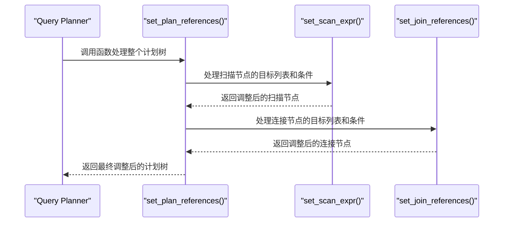
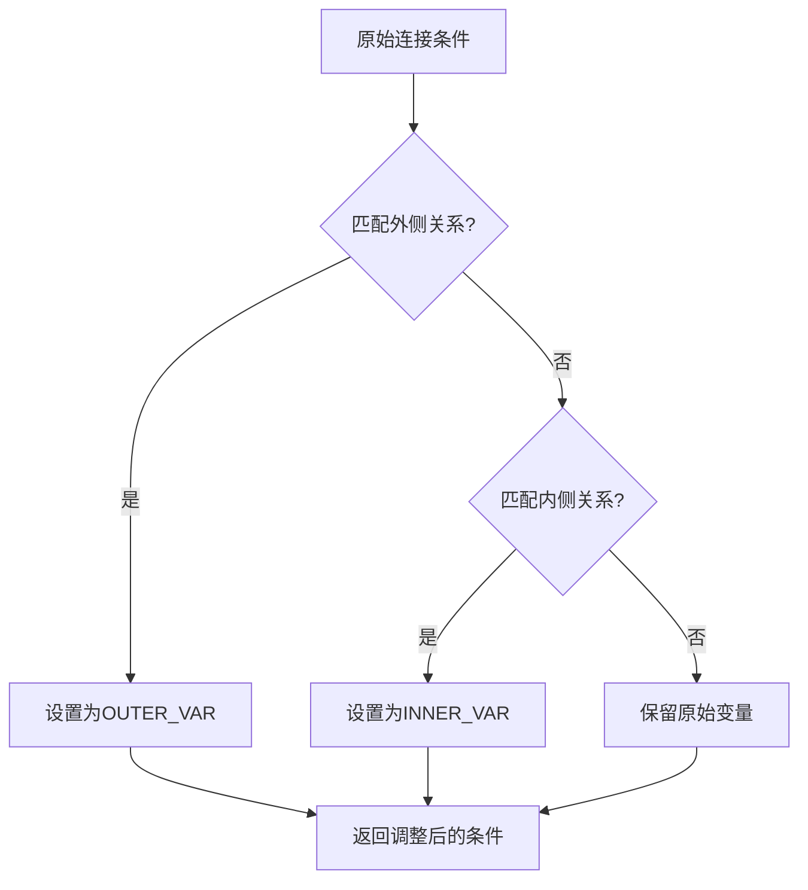
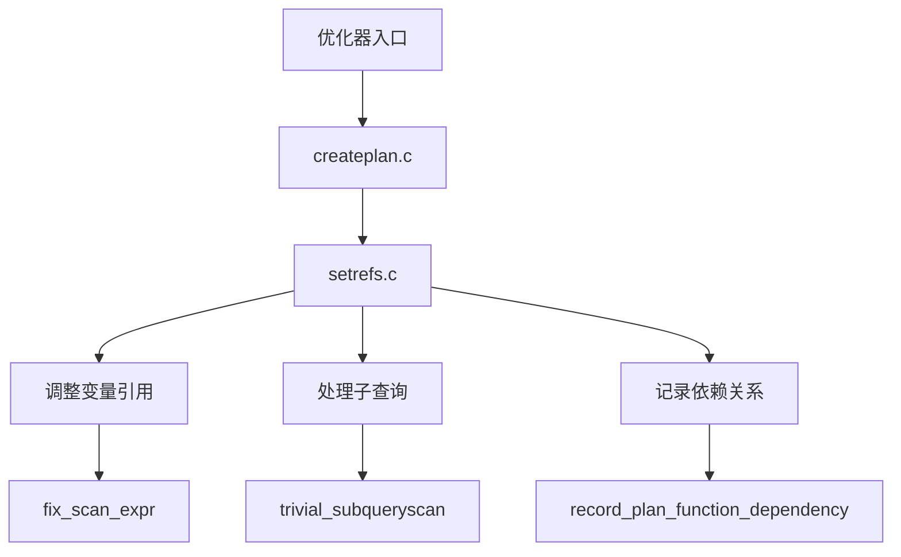
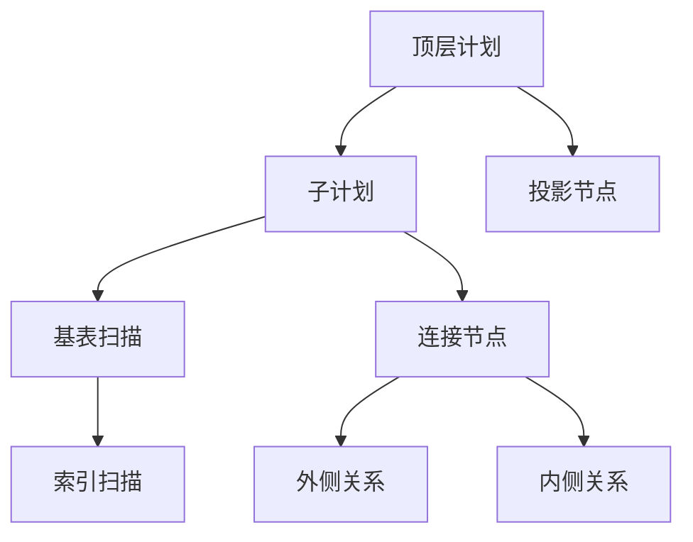
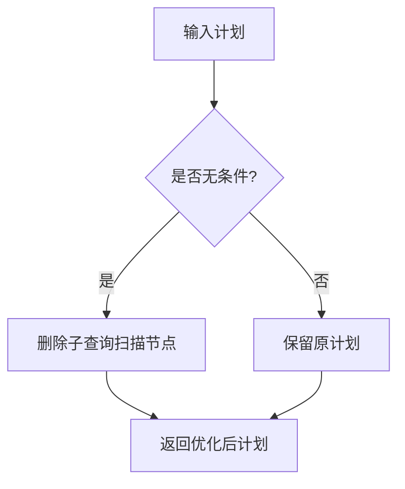
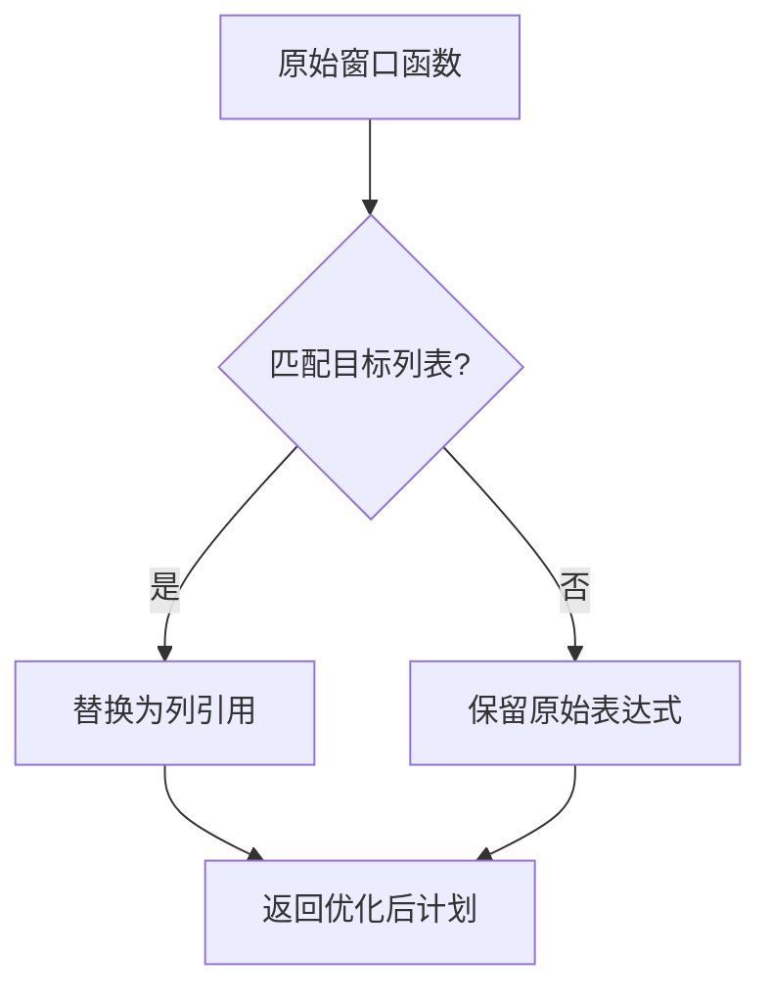
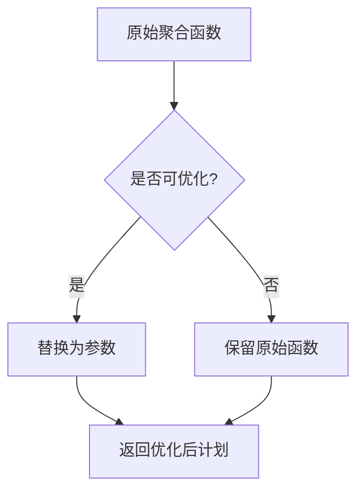
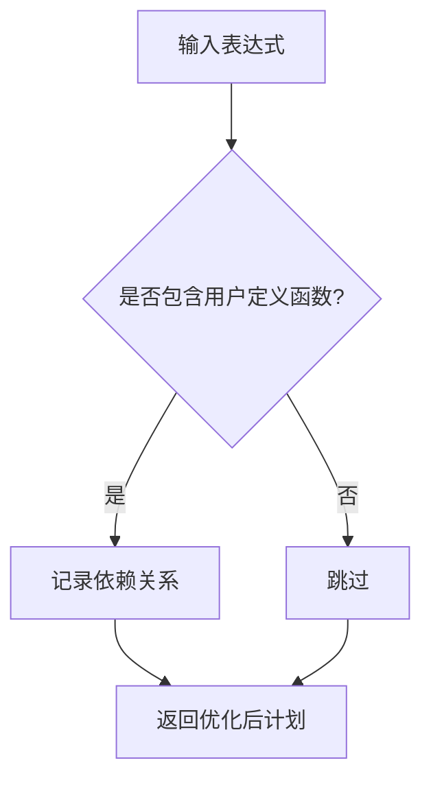

## AI辅助 PolarDB内核学习 - 29 优化器(plan模块) 核心模块 setrefs.c  
  
### 作者  
digoal  
  
### 日期  
2025-04-02  
  
### 标签  
PostgreSQL , PolarDB , DuckDB , AI , 内核 , 学习 , plan , setrefs.c  
  
----  
  
## 背景  
  
## 解读 优化器(plan模块) 核心模块 setrefs.c  
  
### **代码作用简述**  
`setrefs.c` 是 PostgreSQL 查询优化器中的关键模块，负责在生成执行计划的最后阶段调整变量引用（Var）、参数（Param）和表达式树，确保它们与最终的执行计划一致。它通过递归遍历计划树，修正目标列表（TargetList）和条件表达式（Quals），并处理子查询、外键、聚合函数等复杂场景。  
  
---  
  
## **一、内核开发者视角 - 核心机制解析**  
  
### 1.1 变量引用调整流程 (`set_plan_references`)  

  
#### 关键逻辑：  
- **RTE 展平**：将所有子查询的 RTE（Range Table Entry）合并到全局的 `finalrtable` 中。  
- **变量偏移**：根据 `rtoffset` 调整 Var 的 `varno` 和 `varattno`，确保其引用与展平后的 RTE 对应。  
- **子计划替换**：对于无用的子查询扫描（如 `SubqueryScan`），直接替换为子计划以减少冗余。  
  
#### 示例场景：  
```sql  
SELECT * FROM (SELECT id, name FROM users WHERE age > 30) AS sub;  
```  
优化器行为：  
1. 将子查询 `users` 的 RTE 合并到全局 `finalrtable`。  
2. 调整外部查询的目标列表，使其引用子查询的输出列。  
3. 如果子查询扫描无用，则直接替换为子计划。  
  
  
### 1.2 连接节点变量调整 (`set_join_references`)  

  
#### 关键点：  
- **变量分类**：区分外侧（OUTER_VAR）和内侧（INNER_VAR）变量，确保连接语义正确。  
- **条件匹配**：通过 `fix_join_expr` 匹配连接条件中的变量，并替换为目标列表中的列引用。  
  
#### 示例：  
```sql  
SELECT * FROM A JOIN B ON A.id = B.aid;  
```  
优化器行为：  
1. 检测到 `A.id` 和 `B.aid` 分别属于外侧和内侧关系。  
2. 将 `A.id` 替换为 OUTER_VAR，`B.aid` 替换为 INNER_VAR。  
  
  
## **二、架构师视角 - 模块设计与交互**  
  
### 2.1 模块分工  

  
#### 设计亮点：  
1. **统一接口**：通过 `set_plan_refs` 递归处理所有计划节点类型（如 `SeqScan`, `IndexScan`, `Join` 等）。  
2. **动态调整**：支持多种特殊场景（如子查询扫描、外连接、窗口函数等），确保灵活性。  
3. **依赖管理**：记录计划对用户定义函数、类型和表的依赖，用于缓存失效检测。  
  
  
### 2.2 计划层次化  

  
#### 关键点：  
- **上下文传递**：通过 `PlannerInfo` 和 `rtoffset` 参数，确保每一层计划的变量引用调整独立且正确。  
- **递归处理**：从顶层计划开始，逐层调整子计划的变量引用。  
  
  
## **三、用户视角 - 实际应用场景与收益**  
  
### 3.1 DBA 视角 - 执行计划优化  
  
#### 示例 1：子查询扫描优化  
```sql  
EXPLAIN SELECT * FROM (SELECT id, name FROM users WHERE age > 30) AS sub;  
```  
优化器行为：  
1. 检测到子查询扫描无实际意义。  
2. 直接替换为子计划，减少不必要的 `SubqueryScan` 节点。  
  
#### 示例 2：外连接变量调整  
```sql  
EXPLAIN SELECT * FROM A LEFT JOIN B ON A.id = B.aid;  
```  
优化器行为：  
1. 检测到 `LEFT JOIN` 条件中涉及外侧和内侧变量。  
2. 将 `A.id` 替换为 OUTER_VAR，`B.aid` 替换为 INNER_VAR。  
  
  
### 3.2 应用开发者视角 - 性能调优技巧  
  
#### 常见问题：  
| 现象 | 根因 | 解决方案 |  
|------|------|----------|  
| 子查询性能差 | 子查询未被优化 | 使用 `WITH` 或直接展开子查询 |  
| 连接顺序不当 | 统计信息不准确 | 更新统计信息或手动调整连接顺序 |  
  
#### 示例参数调整：  
```sql  
-- 控制子查询优化行为  
SET enable_nestloop = on; -- 启用嵌套循环连接  
SET from_collapse_limit = 8; -- 控制子查询展开深度  
```  
  
  
## **四、核心算法深度解析**  
  
### 4.1 子查询扫描优化 (`trivial_subqueryscan`)  

  
#### 关键逻辑：  
- **条件判断**：若子查询扫描无条件过滤且目标列表完全映射子计划输出，则可删除该节点。  
- **示例**：  
```sql  
SELECT * FROM (SELECT id, name FROM users) AS sub;  
```  
优化器行为：  
1. 检测到子查询扫描无实际作用。  
2. 直接替换为子计划，避免额外开销。  
  
  
### 4.2 窗口函数变量调整 (`set_windowagg_runcondition_references`)  

  
#### 关键点：  
- **变量替换**：将窗口函数（WindowFunc）替换为对应的目标列表列引用。  
- **示例**：  
```sql  
SELECT SUM(amount) OVER () AS total FROM transactions;  
```  
优化器行为：  
1. 将 `SUM(amount)` 替换为目标列表中的列引用。  
2. 减少窗口函数的重复计算。  
  
  
### 4.3 聚合函数优化 (`find_minmax_agg_replacement_param`)  

  
#### 关键逻辑：  
- **条件判断**：若聚合函数为 `MIN/MAX` 且满足特定条件（如单列聚合），则用参数替换以提升性能。  
- **示例**：  
```sql  
SELECT MIN(id) FROM users;  
```  
优化器行为：  
1. 检测到 `MIN(id)` 可优化为参数。  
2. 替换为参数引用，减少排序操作。  
  
## **五、诊断与调优建议**  
  
### 5.1 执行计划分析  
```sql  
EXPLAIN (ANALYZE, VERBOSE) SELECT ...;  
```  
关注点：  
1. 是否存在冗余的 `SubqueryScan` 或 `Append` 节点。  
2. 窗口函数和聚合函数是否被正确优化。  
3. 内存使用是否符合预期。  
  
### 5.2 参数调优  
| 参数 | 默认值 | 说明 |  
|------|--------|------|  
| `enable_nestloop` | on | 启用嵌套循环连接 |  
| `enable_hashjoin` | on | 启用哈希连接 |  
| `work_mem` | 4MB | 控制排序和聚合内存 |  
  
#### 示例：  
```sql  
-- 提升排序内存  
SET work_mem = '8MB';  
  
-- 强制禁用嵌套循环连接  
SET enable_nestloop = off;  
```  
  
## **六、创新机制解读**  
  
### 6.1 动态依赖管理 (`record_plan_function_dependency`)  

  
#### 效果：  
- 自动记录计划对用户定义函数的依赖，确保缓存计划在函数变更时失效。  
- **示例**：  
```sql  
CREATE FUNCTION my_func(x int) RETURNS int AS $$ ... $$ LANGUAGE SQL;  
SELECT my_func(id) FROM users;  
```  
优化器行为：  
1. 检测到 `my_func` 为用户定义函数。  
2. 记录其依赖关系，确保函数变更时重新规划。  
  
  
### 6.2 并行计划生成 (`set_param_references`)  
```mermond  
graph TD  
    A[Gather 节点] --> B{是否包含初始化参数?}  
    B -->|是| C[记录初始化参数依赖]  
    B -->|否| D[跳过]  
    C --> E[返回优化后计划]  
    D --> E  
```  
  
#### 关键点：  
- **初始化参数管理**：确保并行计划中的初始化参数（InitPlan）正确传递。  
- **示例**：  
```sql  
SELECT * FROM users WHERE id IN (SELECT user_id FROM orders);  
```  
优化器行为：  
1. 检测到子查询 `IN` 条件。  
2. 生成初始化参数，并确保其在并行计划中正确传递。  
  
  
## **七、总结**  
  
`setrefs.c` 通过精细化的变量引用调整和表达式优化，确保执行计划的正确性和高效性。开发者需理解其递归调整机制，DBA 应结合统计信息与执行计划进行调优，而架构师则需关注模块间的协作以设计更灵活的查询引擎。  
  
  
## 提示  
```  
使用cursor  
  
@setrefs.c  
先用几句话阐述代码作用, 然后从数据库内核开发者、架构师、用户(应用开发者和DBA)多个角度通熟易懂的解读这个代码, 使用sequence、mermaid图表以及恰当的例子提升代码可读性. 关键内容务必要深入重点详细解释.  
  
长文本模式  
```  
  
## PolarDB & PostgreSQL 15 差异  
```  
git diff -u 50d3d22baba63613d1f1406b2ed460dc9b03c3fc f5e7493819e370d30ac2047c68c21c9fb03ce4a0 -- src/backend/optimizer/plan/setrefs.c  
```  
  
差异分析待补充.  
  
<b> 以上内容基于DeepSeek、QwQ及诸多AI生成, 轻微人工调整, 感谢杭州深度求索人工智能、阿里云等公司. </b>  
  
<b> AI 生成的内容请自行辨别正确性, 当然也多了些许踩坑的乐趣, 毕竟冒险是每个男人的天性.  </b>  
  
  
#### [期望 PostgreSQL|开源PolarDB 增加什么功能?](https://github.com/digoal/blog/issues/76 "269ac3d1c492e938c0191101c7238216")
  
  
#### [PolarDB 开源数据库](https://openpolardb.com/home "57258f76c37864c6e6d23383d05714ea")
  
  
#### [PolarDB 学习图谱](https://www.aliyun.com/database/openpolardb/activity "8642f60e04ed0c814bf9cb9677976bd4")
  
  
#### [PostgreSQL 解决方案集合](../201706/20170601_02.md "40cff096e9ed7122c512b35d8561d9c8")
  
  
#### [德哥 / digoal's Github - 公益是一辈子的事.](https://github.com/digoal/blog/blob/master/README.md "22709685feb7cab07d30f30387f0a9ae")
  
  
#### [About 德哥](https://github.com/digoal/blog/blob/master/me/readme.md "a37735981e7704886ffd590565582dd0")
  
  

  
