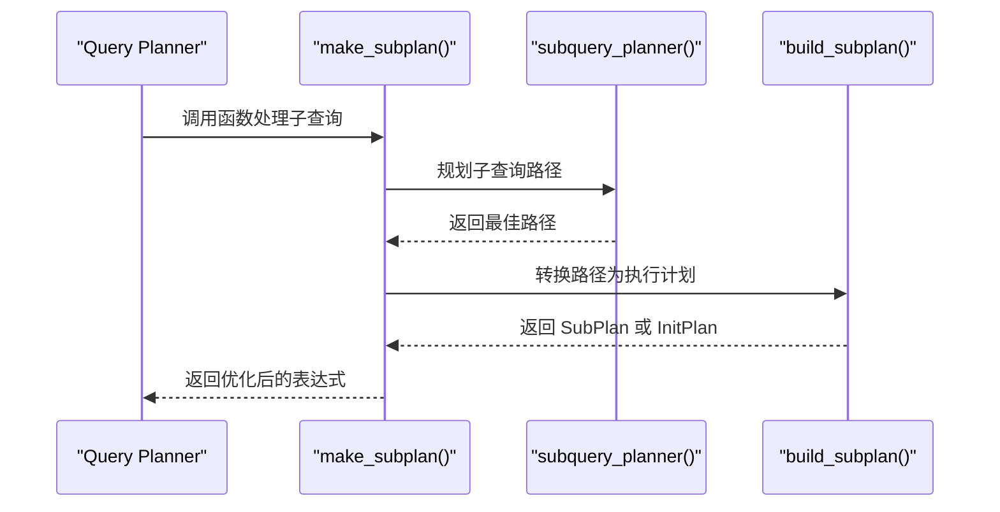
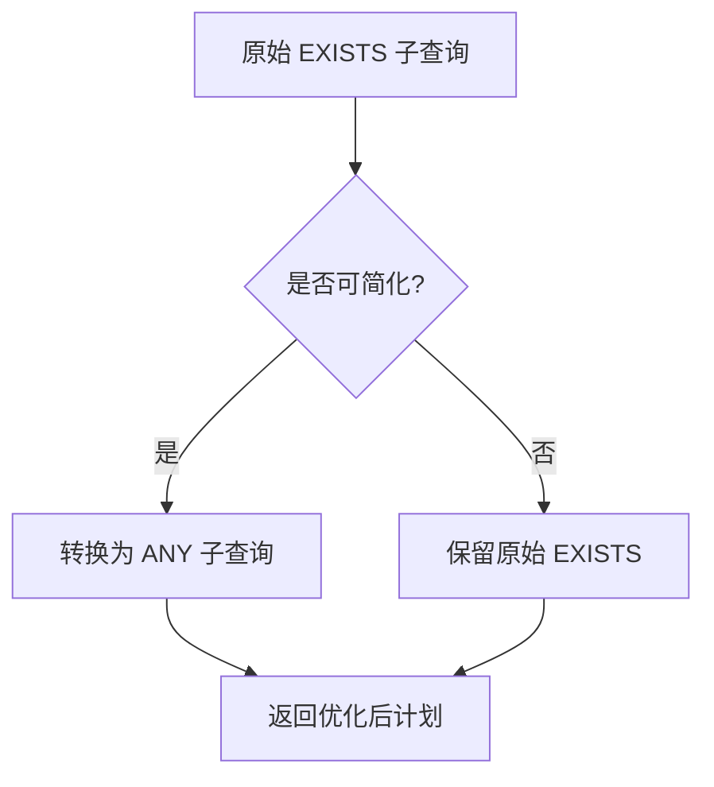
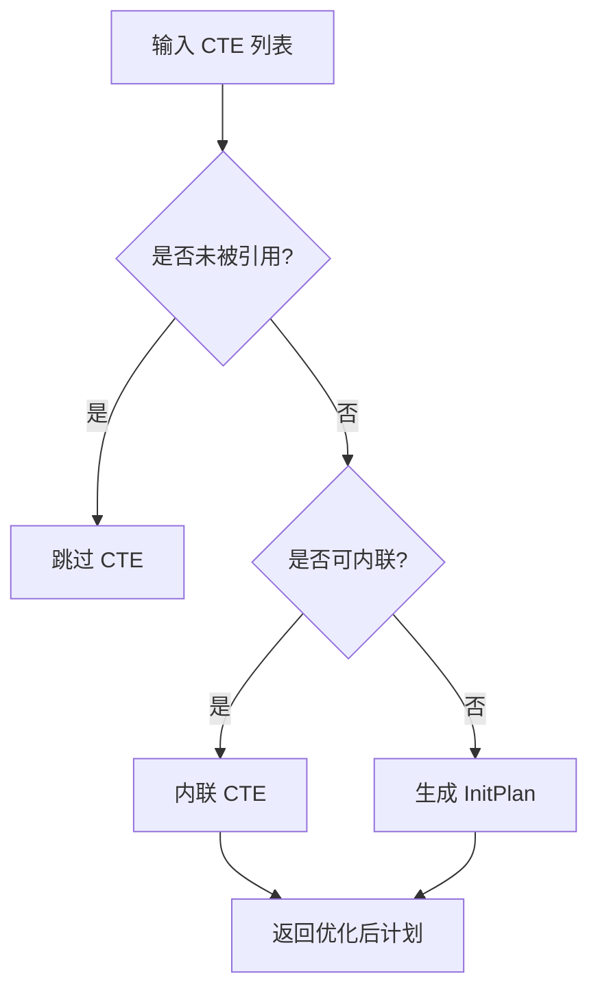
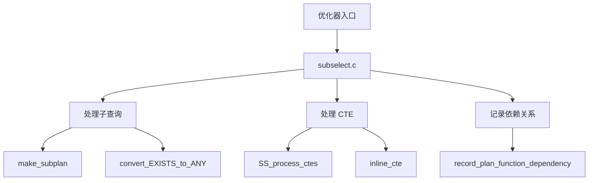
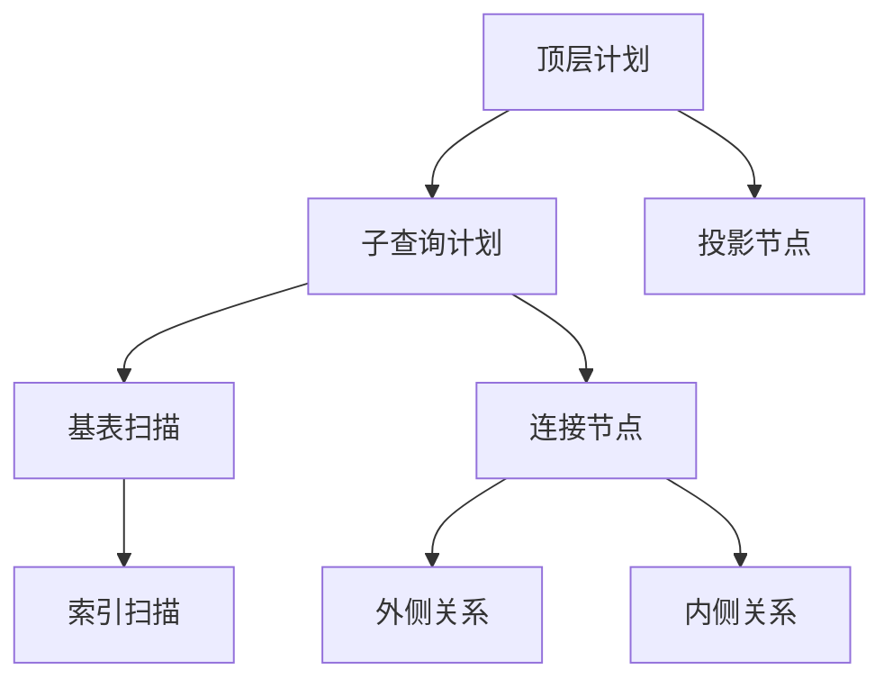
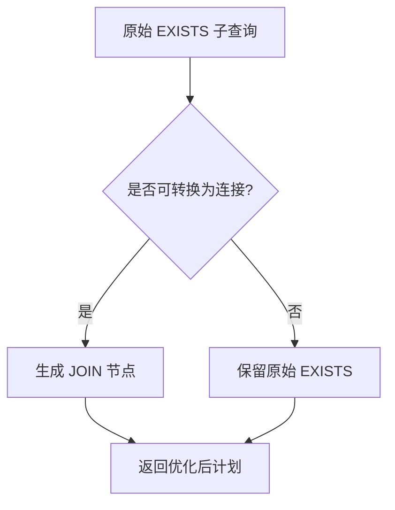
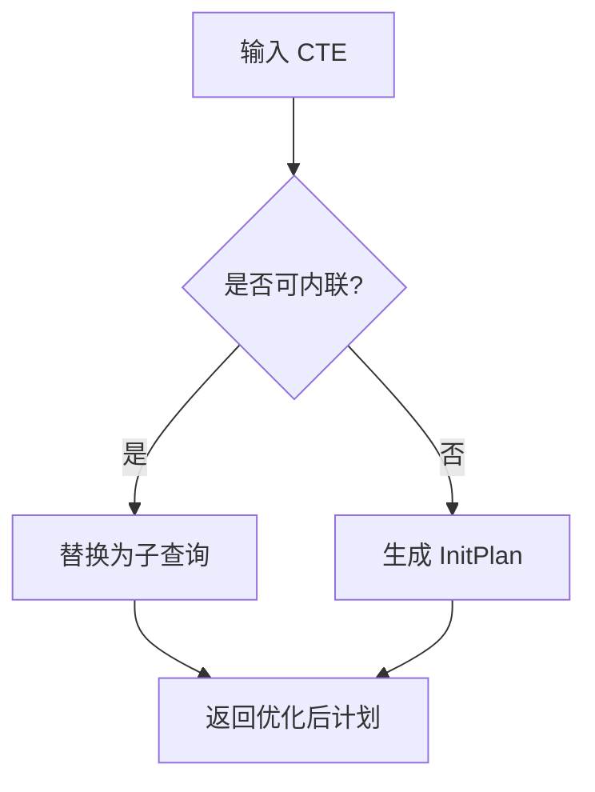
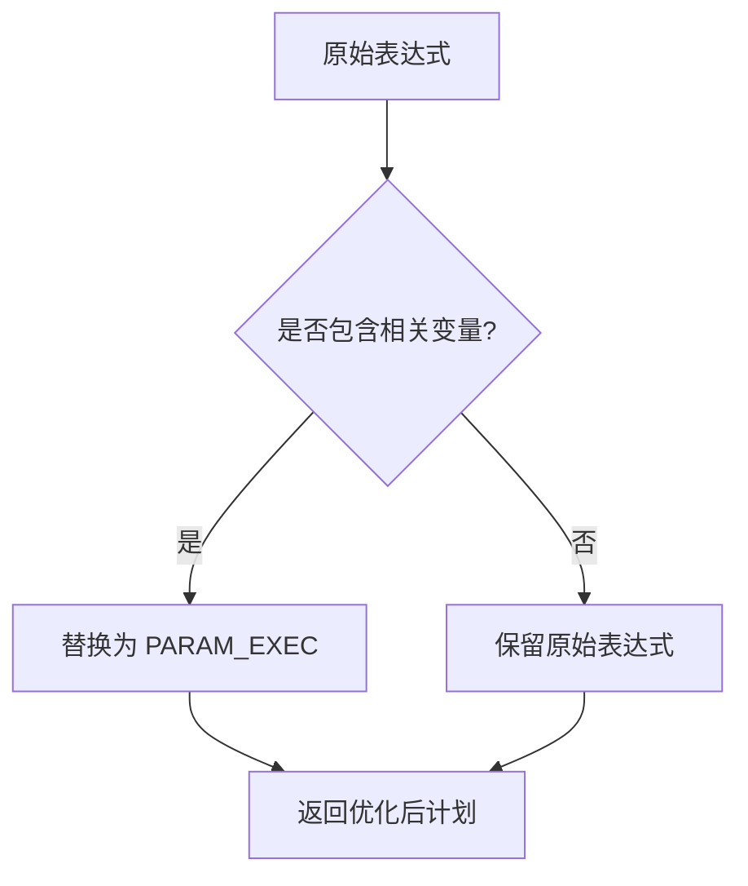
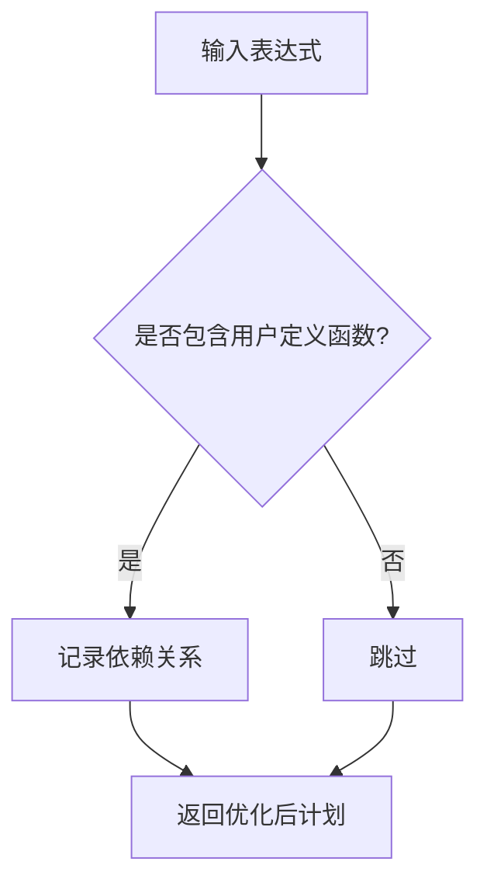
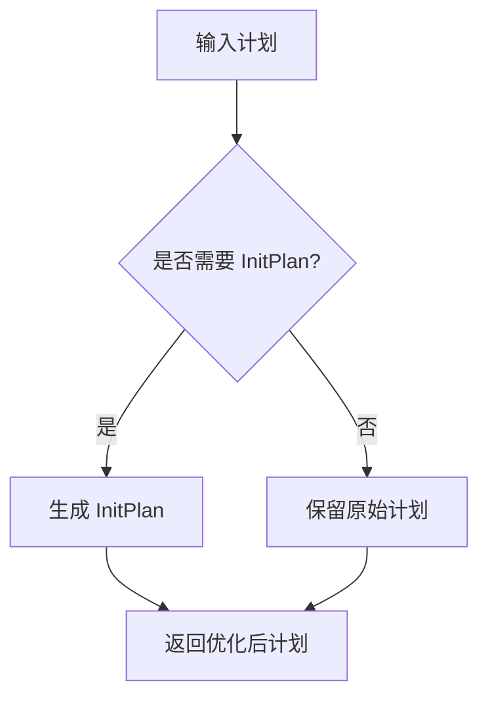

## AI辅助 PolarDB内核学习 - 30 优化器(plan模块) 核心模块 subselect.c    
    
### 作者    
digoal    
    
### 日期    
2025-04-02    
    
### 标签    
PostgreSQL , PolarDB , DuckDB , AI , 内核 , 学习 , plan , subselect.c    
    
----    
    
## 背景    
    
## 解读 优化器(plan模块) 核心模块 subselect.c    
    
### **代码作用简述**    
`subselect.c` 是 PostgreSQL 查询优化器中的关键模块，负责处理子查询（SubLink）和公用表表达式（CTE）。它通过递归遍历计划树，将子查询转换为执行计划中的 `SubPlan` 或 `InitPlan` 节点，并优化 EXISTS 和 ANY 类型的子查询为连接操作。此外，该模块还支持 CTE 的内联化或初始化计划生成。  
  
## **一、内核开发者视角 - 核心机制解析**  
  
### 1.1 子查询转换流程 (`make_subplan`)  

  
#### 关键逻辑：  
1. **子查询规划**：通过 `subquery_planner` 生成子查询的最佳路径。  
2. **参数隔离**：提取子查询所需的外部参数（`plan_params`），确保它们在父查询中正确传递。  
3. **计划生成**：调用 `create_plan` 将路径转换为执行计划。  
4. **SubPlan 或 InitPlan**：根据子查询是否包含相关变量（`parParam`），决定生成 `SubPlan` 或 `InitPlan`。  
  
#### 示例场景：  
```sql  
SELECT * FROM users WHERE id IN (SELECT user_id FROM orders);  
```  
优化器行为：  
1. 检测到 `IN` 子查询。  
2. 规划子查询路径，提取外部参数。  
3. 生成 `SubPlan` 或 `InitPlan`，并替换原始子查询。  
  
### 1.2 EXISTS 子查询优化 (`convert_EXISTS_to_ANY`)  

  
#### 关键点：  
- **条件判断**：若 EXISTS 子查询无目标列表且不引用外部变量，则可优化为 ANY 子查询。  
- **示例**：  
```sql  
SELECT * FROM users WHERE EXISTS (SELECT 1 FROM orders WHERE orders.user_id = users.id);  
```  
优化器行为：  
1. 检测到 EXISTS 子查询。  
2. 简化子查询为目标列表为空的结构。  
3. 转换为等价的 ANY 子查询。  
  
### 1.3 CTE 处理 (`SS_process_ctes`)  

  
#### 关键逻辑：  
- **未引用 CTE**：直接跳过处理。  
- **内联化**：若 CTE 不包含递归、副作用或外部引用，则将其内联为普通子查询。  
- **InitPlan**：否则，生成 `InitPlan` 并添加到全局计划列表中。  
  
#### 示例：  
```sql  
WITH cte AS (SELECT id, name FROM users) SELECT * FROM cte;  
```  
优化器行为：  
1. 检测到 CTE 被引用。  
2. 若 CTE 可内联，则替换为普通子查询；否则生成 `InitPlan`。  
  
  
## **二、架构师视角 - 模块设计与交互**  
  
### 2.1 模块分工  

  
#### 设计亮点：  
1. **统一接口**：通过 `make_subplan` 和 `SS_process_ctes` 统一处理子查询和 CTE。  
2. **动态调整**：支持多种特殊场景（如 EXISTS 转换、CTE 内联化），确保灵活性。  
3. **依赖管理**：记录计划对用户定义函数、类型和表的依赖，用于缓存失效检测。  
  
  
### 2.2 计划层次化  

  
#### 关键点：  
- **上下文传递**：通过 `PlannerInfo` 和 `rtoffset` 参数，确保每一层计划的变量引用调整独立且正确。  
- **递归处理**：从顶层计划开始，逐层调整子计划的变量引用。  
  
  
## **三、用户视角 - 实际应用场景与收益**  
  
### 3.1 DBA 视角 - 执行计划优化  
  
#### 示例 1：ANY 子查询优化  
```sql  
EXPLAIN SELECT * FROM users WHERE id IN (SELECT user_id FROM orders);  
```  
优化器行为：  
1. 将 `IN` 子查询转换为 `ANY` 子查询。  
2. 使用哈希表加速匹配过程。  
  
#### 示例 2：CTE 内联化  
```sql  
WITH cte AS (SELECT id, name FROM users) SELECT * FROM cte;  
```  
优化器行为：  
1. 检测到 CTE 被引用。  
2. 若 CTE 可内联，则替换为普通子查询以减少开销。  
  
  
### 3.2 应用开发者视角 - 性能调优技巧  
  
#### 常见问题：  
| 现象 | 根因 | 解决方案 |  
|------|------|----------|  
| 子查询性能差 | 子查询未被优化 | 使用 `WITH` 或直接展开子查询 |  
| 连接顺序不当 | 统计信息不准确 | 更新统计信息或手动调整连接顺序 |  
  
#### 示例参数调整：  
```sql  
-- 控制子查询优化行为  
SET enable_nestloop = on; -- 启用嵌套循环连接  
SET from_collapse_limit = 8; -- 控制子查询展开深度  
```  
  
  
## **四、核心算法深度解析**  
  
### 4.1 EXISTS 子查询转换为连接 (`convert_EXISTS_sublink_to_join`)  

  
#### 关键逻辑：  
1. **条件判断**：若 EXISTS 子查询不引用外部变量且无副作用，则可转换为 SEMI JOIN。  
2. **示例**：  
```sql  
SELECT * FROM users WHERE EXISTS (SELECT 1 FROM orders WHERE orders.user_id = users.id);  
```  
优化器行为：  
1. 检测到 EXISTS 子查询。  
2. 转换为 SEMI JOIN，提升性能。  
  
  
### 4.2 CTE 内联化 (`inline_cte`)  

  
#### 关键点：  
- **条件判断**：若 CTE 不包含递归、副作用或外部引用，则可内联。  
- **示例**：  
```sql  
WITH cte AS (SELECT id, name FROM users) SELECT * FROM cte;  
```  
优化器行为：  
1. 检测到 CTE 被引用。  
2. 若 CTE 可内联，则替换为普通子查询。  
  
  
### 4.3 参数管理 (`SS_replace_correlation_vars`)  

  
#### 关键逻辑：  
- **变量替换**：将相关变量（`Var`）替换为执行时参数（`PARAM_EXEC`）。  
- **示例**：  
```sql  
SELECT * FROM users WHERE EXISTS (SELECT 1 FROM orders WHERE orders.user_id = users.id);  
```  
优化器行为：  
1. 将 `users.id` 替换为 `PARAM_EXEC`。  
2. 确保子查询在执行时正确引用父查询变量。  
  
  
## **五、诊断与调优建议**  
  
### 5.1 执行计划分析  
```sql  
EXPLAIN (ANALYZE, VERBOSE) SELECT ...;  
```  
关注点：  
1. 是否存在冗余的 `SubPlan` 或 `InitPlan` 节点。  
2. EXISTS 和 ANY 子查询是否被正确优化为连接。  
3. 内存使用是否符合预期。  
  
### 5.2 参数调优  
| 参数 | 默认值 | 说明 |  
|------|--------|------|  
| `enable_nestloop` | on | 启用嵌套循环连接 |  
| `enable_hashjoin` | on | 启用哈希连接 |  
| `work_mem` | 4MB | 控制排序和聚合内存 |  
  
#### 示例：  
```sql  
-- 提升排序内存  
SET work_mem = '8MB';  
  
-- 强制禁用嵌套循环连接  
SET enable_nestloop = off;  
```  
  
## **六、创新机制解读**  
  
### 6.1 动态依赖管理 (`record_plan_function_dependency`)  

  
#### 效果：  
- 自动记录计划对用户定义函数的依赖，确保缓存计划在函数变更时失效。  
- **示例**：  
```sql  
CREATE FUNCTION my_func(x int) RETURNS int AS $$ ... $$ LANGUAGE SQL;  
SELECT my_func(id) FROM users;  
```  
优化器行为：  
1. 检测到 `my_func` 为用户定义函数。  
2. 记录其依赖关系，确保函数变更时重新规划。  
  
  
### 6.2 初始化计划生成 (`SS_make_initplan_from_plan`)  

  
#### 关键点：  
- **条件判断**：若子查询无相关变量，则生成 `InitPlan`。  
- **示例**：  
```sql  
SELECT * FROM users WHERE EXISTS (SELECT 1 FROM orders WHERE orders.status = 'active');  
```  
优化器行为：  
1. 检测到子查询无相关变量。  
2. 生成 `InitPlan`，提前计算结果以减少重复执行。  
  
  
## **七、总结**  
  
`subselect.c` 通过精细化的子查询优化和 CTE 处理，显著提升了复杂查询的执行效率。内核开发者需理解其递归调整机制，DBA 应结合统计信息与执行计划进行调优，而架构师则需关注模块间的协作以设计更灵活的查询引擎。  
  
    
## 提示    
```    
使用cursor    
    
@subselect.c @subselect.h   
先用几句话阐述代码作用, 然后从数据库内核开发者、架构师、用户(应用开发者和DBA)多个角度通熟易懂的解读这个代码, 使用sequence、mermaid图表以及恰当的例子提升代码可读性. 关键内容务必要深入重点详细解释.    
    
长文本模式    
```    
    
## PolarDB & PostgreSQL 15 差异    
```    
git diff -u 50d3d22baba63613d1f1406b2ed460dc9b03c3fc f5e7493819e370d30ac2047c68c21c9fb03ce4a0 -- src/backend/optimizer/plan/subselect.c    
```    
    
差异分析待补充.    
    
<b> 以上内容基于DeepSeek、QwQ及诸多AI生成, 轻微人工调整, 感谢杭州深度求索人工智能、阿里云等公司. </b>    
    
<b> AI 生成的内容请自行辨别正确性, 当然也多了些许踩坑的乐趣, 毕竟冒险是每个男人的天性.  </b>    
    
  
#### [期望 PostgreSQL|开源PolarDB 增加什么功能?](https://github.com/digoal/blog/issues/76 "269ac3d1c492e938c0191101c7238216")
  
  
#### [PolarDB 开源数据库](https://openpolardb.com/home "57258f76c37864c6e6d23383d05714ea")
  
  
#### [PolarDB 学习图谱](https://www.aliyun.com/database/openpolardb/activity "8642f60e04ed0c814bf9cb9677976bd4")
  
  
#### [PostgreSQL 解决方案集合](../201706/20170601_02.md "40cff096e9ed7122c512b35d8561d9c8")
  
  
#### [德哥 / digoal's Github - 公益是一辈子的事.](https://github.com/digoal/blog/blob/master/README.md "22709685feb7cab07d30f30387f0a9ae")
  
  
#### [About 德哥](https://github.com/digoal/blog/blob/master/me/readme.md "a37735981e7704886ffd590565582dd0")
  
  

  
