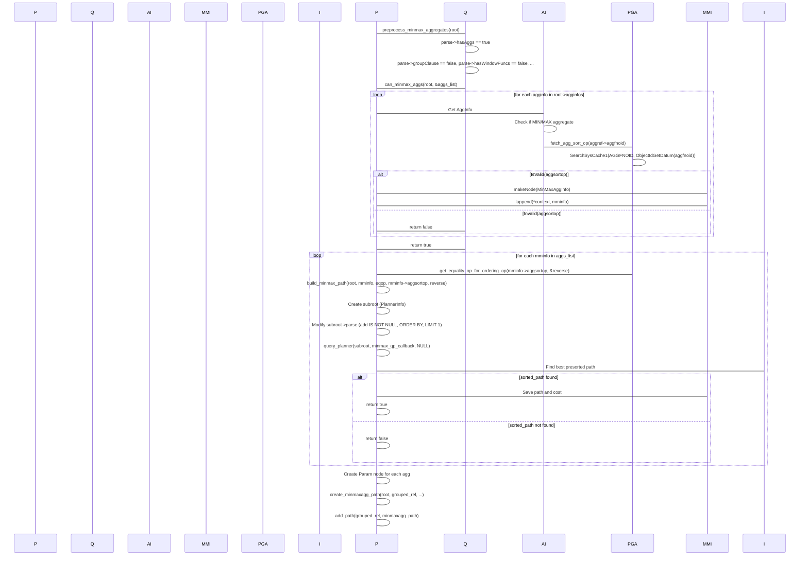

## AI辅助 PolarDB内核学习 - 31 优化器(plan模块) 核心模块 planagg.c      
      
### 作者      
digoal      
      
### 日期      
2025-04-02      
      
### 标签      
PostgreSQL , PolarDB , DuckDB , AI , 内核 , 学习 , plan , planagg.c      
      
----      
      
## 背景      
      
## 解读 优化器(plan模块) 核心模块 planagg.c      
      
好的，我们来深入解读这段 PostgreSQL 代码，从数据库内核开发者、架构师、用户（应用开发者和 DBA）等多个角度，并结合图表和例子，力求通俗易懂。  
  
**代码作用概述**  
  
这段代码是 PostgreSQL 优化器的一部分，专门针对包含 `MIN()` 和 `MAX()` 聚合函数的查询进行优化。其核心思想是，当查询满足特定条件时，将 `MIN/MAX` 聚合函数替换为等效的子查询，该子查询利用索引扫描来快速找到最小值或最大值，而不是扫描整个表。  
  
**1. 数据库内核开发者视角**  
  
作为内核开发者，我们需要关注代码的实现细节、性能影响、与其他模块的交互以及潜在的风险。  
  
*   **实现细节：**  
  
    *   `preprocess_minmax_aggregates()` 函数是入口点。它首先检查查询是否满足优化的前提条件（例如，没有 `GROUP BY`、`HAVING`、`WINDOW` 函数，只引用单个表等）。  
    *   `can_minmax_aggs()` 函数遍历查询中的所有聚合函数，确认它们是否都是 `MIN/MAX` 函数，并且参数是可索引的。  
    *   `build_minmax_path()` 函数是核心。它为每个 `MIN/MAX` 聚合函数构建一个子查询，该子查询使用 `ORDER BY` 和 `LIMIT 1` 来获取最小值或最大值。它还负责创建子查询的 `PlannerInfo`，并调用 `query_planner()` 来生成子查询的执行计划。  
    *   `minmax_qp_callback()` 函数是一个回调函数，用于在子查询的规划过程中设置 `query_pathkeys`，确保优化器考虑到 `ORDER BY` 子句。  
    *   `fetch_agg_sort_op()` 函数用于从系统目录 `pg_aggregate` 中获取与聚合函数关联的排序操作符。  
  
*   **性能影响：**  
  
    *   这种优化可以显著提高包含 `MIN/MAX` 聚合函数的查询的性能，特别是当表很大且在聚合列上有索引时。通过索引扫描，可以避免全表扫描，从而减少 I/O 操作和 CPU 消耗。  
    *   优化效果取决于索引的有效性、数据分布以及查询的其他条件。  
  
*   **与其他模块的交互：**  
  
    *   该代码与优化器的其他模块（例如，`planner.c`、`pathnode.c`、`cost.c`）密切相关。它利用这些模块的功能来构建子查询、生成执行计划和评估成本。  
    *   它还与系统目录 `pg_aggregate` 交互，以获取聚合函数的信息。  
  
*   **潜在风险：**  
  
    *   如果查询不满足优化的前提条件，或者优化后的子查询的执行计划比全表扫描更差，则可能会导致性能下降。  
    *   代码的复杂性较高，需要仔细测试和维护，以确保其正确性和稳定性。  
  
**2. 架构师视角**  
  
作为架构师，我们需要关注代码的整体设计、可扩展性、可维护性以及与其他组件的集成。  
  
*   **整体设计：**  
  
    *   该代码采用了一种基于规则的优化方法，即通过检查查询的结构和语义，并应用特定的规则来生成优化的执行计划。  
    *   这种方法简单直接，易于理解和实现。但是，它可能无法处理所有可能的优化场景。  
  
*   **可扩展性：**  
  
    *   该代码的可扩展性有限。如果需要支持新的聚合函数或优化场景，则需要修改代码本身。  
    *   一种更具扩展性的方法是使用一种基于成本的优化方法，即通过评估不同执行计划的成本，并选择成本最低的计划。  
  
*   **可维护性：**  
  
    *   该代码的可维护性一般。代码的复杂性较高，需要仔细注释和文档化。  
    *   为了提高可维护性，可以考虑将代码分解为更小的、更模块化的函数。  
  
*   **与其他组件的集成：**  
  
    *   该代码与优化器的其他组件紧密集成。为了确保代码的正确性和稳定性，需要进行全面的集成测试。  
  
**3. 用户视角（应用开发者和 DBA）**  
  
作为用户，我们更关心如何利用这种优化来提高查询性能，以及如何诊断和解决相关的问题。  
  
*   **如何利用优化：**  
  
    *   确保查询满足优化的前提条件，例如，没有 `GROUP BY`、`HAVING`、`WINDOW` 函数，只引用单个表等。  
    *   在聚合列上创建索引。  
    *   使用 `EXPLAIN` 命令来查看查询的执行计划，确认优化是否生效。  
  
*   **如何诊断和解决问题：**  
  
    *   如果查询性能没有提高，或者出现性能下降，则可以使用 `EXPLAIN` 命令来查看查询的执行计划，确认优化是否生效。  
    *   如果优化没有生效，则可以检查查询是否满足优化的前提条件，或者尝试调整查询的结构。  
    *   如果优化生效了，但是性能仍然很差，则可以检查索引的有效性，或者尝试调整数据库的配置参数。  
  
**代码流程图 (Mermaid Sequence Diagram)**  
  

  
**例子**  
  
假设我们有一个名为 `products` 的表，包含 `id`、`name` 和 `price` 列。我们想要找到价格最低的产品：  
  
```sql  
SELECT MIN(price) FROM products;  
```  
  
如果没有索引，PostgreSQL 将会扫描整个 `products` 表来找到最低价格。但是，如果在 `price` 列上有一个索引，优化器可以将查询重写为以下子查询：  
  
```sql  
SELECT price FROM products ORDER BY price ASC LIMIT 1;  
```  
  
这个子查询可以使用索引扫描来快速找到最低价格，而无需扫描整个表。  
  
**总结**  
  
这段代码是 PostgreSQL 优化器中一个重要的组成部分，它可以显著提高包含 `MIN/MAX` 聚合函数的查询的性能。理解这段代码的实现细节、与其他模块的交互以及潜在的风险，可以帮助我们更好地利用这种优化，并诊断和解决相关的问题。希望这个详细的解读对您有所帮助！  
      
## 提示      
```      
使用cursor      
      
@planagg.c    
先用几句话阐述代码作用, 然后从数据库内核开发者、架构师、用户(应用开发者和DBA)多个角度通熟易懂的解读这个代码, 使用sequence、mermaid图表以及恰当的例子提升代码可读性. 关键内容务必要深入重点详细解释.      
      
长文本模式      
```      
      
## PolarDB & PostgreSQL 15 差异      
```      
git diff -u 50d3d22baba63613d1f1406b2ed460dc9b03c3fc f5e7493819e370d30ac2047c68c21c9fb03ce4a0 -- src/backend/optimizer/plan/subselect.c      
```      
      
差异分析待补充.      
      
<b> 以上内容基于DeepSeek、QwQ及诸多AI生成, 轻微人工调整, 感谢杭州深度求索人工智能、阿里云等公司. </b>      
      
<b> AI 生成的内容请自行辨别正确性, 当然也多了些许踩坑的乐趣, 毕竟冒险是每个男人的天性.  </b>      
      
  
#### [期望 PostgreSQL|开源PolarDB 增加什么功能?](https://github.com/digoal/blog/issues/76 "269ac3d1c492e938c0191101c7238216")
  
  
#### [PolarDB 开源数据库](https://openpolardb.com/home "57258f76c37864c6e6d23383d05714ea")
  
  
#### [PolarDB 学习图谱](https://www.aliyun.com/database/openpolardb/activity "8642f60e04ed0c814bf9cb9677976bd4")
  
  
#### [PostgreSQL 解决方案集合](../201706/20170601_02.md "40cff096e9ed7122c512b35d8561d9c8")
  
  
#### [德哥 / digoal's Github - 公益是一辈子的事.](https://github.com/digoal/blog/blob/master/README.md "22709685feb7cab07d30f30387f0a9ae")
  
  
#### [About 德哥](https://github.com/digoal/blog/blob/master/me/readme.md "a37735981e7704886ffd590565582dd0")
  
  

  
