## AI辅助 PolarDB内核学习 - 32 优化器解析树预处理模块(prep) 概览      
        
### 作者        
digoal        
        
### 日期        
2025-04-02        
        
### 标签        
PostgreSQL , PolarDB , DuckDB , AI , 内核 , 学习 , prep , 解析树 , 预处理    
        
----        
        
## 背景        
        
## 解读 优化器解析树预处理模块(prep) 概览        
  
### **目录中每个 C 文件的作用及关系**  
  
以下是 `prep` 目录中每个文件的功能描述及其相互关系的 Mermaid 图表示：  
  
#### **1. 文件功能概述**  
  
- **`prepagg.c`**    
  负责聚合函数（Aggregate Functions）的预处理，优化重复聚合函数的状态共享和转换函数的复用。  
  
- **`prepjointree.c`**    
  处理连接树（Join Tree），将子查询上拉到顶层，减少嵌套结构，并优化外连接的处理。  
  
- **`prepqual.c`**    
  预处理条件表达式（Qualification Expressions），确保布尔表达式的扁平化和逻辑简化。  
  
- **`preptlist.c`**    
  预处理目标列表（Target List），为插入、更新等操作生成完整的列映射。  
  
- **`prepunion.c`**    
  规划集合操作（如 UNION、INTERSECT、EXCEPT）的查询计划，生成相应的路径和节点。  
  
#### **2. 文件间的关系**  
  
以下 Mermaid 图展示了这些文件之间的交互关系：  
  
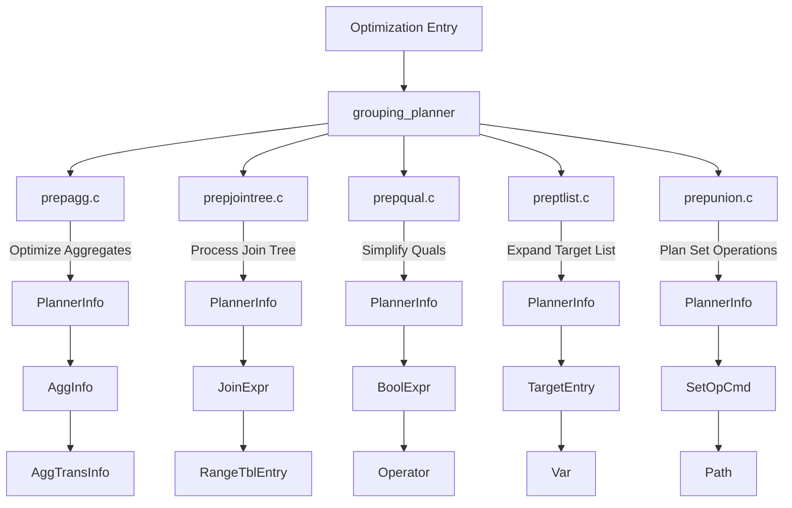
  
#### **3. 详细说明**  
  
##### **`prepagg.c`**  
- **核心功能**：优化聚合函数的计算。  
- **关键点**：  
  - 检测重复的聚合函数并共享状态。  
  - 确保聚合函数的状态在执行器启动时无需重复计算。  
- **与其他模块的关系**：  
  - 提供优化后的解析树给 `grouping_planner`。  
  - 使用 `PlannerInfo` 结构记录聚合信息。  
  
##### **`prepjointree.c`**  
- **核心功能**：优化连接树结构。  
- **关键点**：  
  - 将子查询上拉到顶层以减少嵌套。  
  - 处理外连接的延迟引用。  
- **与其他模块的关系**：  
  - 依赖 `prepqual.c` 和 `preptlist.c` 的结果。  
  - 通过 `PlannerInfo` 与 `prepagg.c` 共享上下文。  
  
##### **`prepqual.c`**  
- **核心功能**：优化条件表达式。  
- **关键点**：  
  - 扁平化布尔表达式树。  
  - 应用 De Morgan 定律简化 NOT 条件。  
- **与其他模块的关系**：  
  - 为 `prepjointree.c` 提供简化的条件表达式。  
  - 与 `preptlist.c` 协同工作以确保目标列表中的条件一致性。  
  
##### **`preptlist.c`**  
- **核心功能**：扩展目标列表。  
- **关键点**：  
  - 确保目标列表包含所有必要的列。  
  - 添加额外的“垃圾”列（resjunk columns）以支持 UPDATE/DELETE 操作。  
- **与其他模块的关系**：  
  - 依赖 `prepqual.c` 的条件表达式结果。  
  - 为 `prepunion.c` 提供完整的目标列表。  
  
##### **`prepunion.c`**  
- **核心功能**：规划集合操作（UNION、INTERSECT、EXCEPT）。  
- **关键点**：  
  - 合并相同特性的子查询。  
  - 生成基于哈希或排序的去重路径。  
- **与其他模块的关系**：  
  - 依赖 `prepagg.c` 和 `prepjointree.c` 的优化结果。  
  - 使用 `preptlist.c` 扩展的目标列表作为输入。  
  
#### **4. 文件间的交互流程**  
  
以下是一个简化的交互流程图：  
  
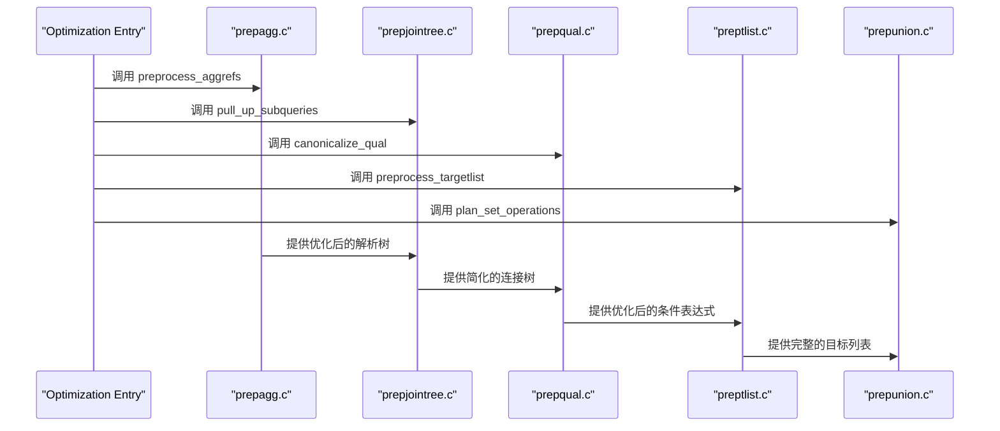
  
#### **5. 总结**  
  
- **`prepagg.c`** 是聚合函数优化的核心，专注于减少重复计算。  
- **`prepjointree.c`** 负责连接树的优化，减少嵌套层次。  
- **`prepqual.c`** 简化条件表达式，提升布尔逻辑的可读性和效率。  
- **`preptlist.c`** 确保目标列表完整性，支持复杂操作（如 INSERT/UPDATE）。  
- **`prepunion.c`** 规划集合操作，生成高效的执行路径。  
  
这些模块共同作用，确保 PostgreSQL 查询优化器能够生成高效且一致的执行计划。  
  
        
### **代码目录顶层设计解读**  
  
`prep` 目录下的代码主要负责在 PostgreSQL 查询优化器中对解析树（parse tree）进行预处理。这些模块包括 `prepagg.c`、`prepjointree.c`、`prepqual.c` 和 `preptlist.c`，分别处理聚合函数、连接树、条件表达式和目标列表的优化与转换。以下是从数据库内核开发者、架构师和用户（应用开发者和 DBA）多个角度对 `prep` 代码目录的顶层设计解读。  
  
## **一、内核开发者视角 - 核心机制解析**  
  
### 1.1 模块分工与协作  
  
#### **模块分工**  
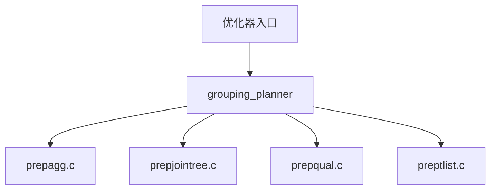
  
- **`prepagg.c`**：专注于聚合函数的预处理，检测重复的聚合函数并优化其状态共享。  
- **`prepjointree.c`**：处理连接树（join tree），将子查询上拉到顶层，减少嵌套结构。  
- **`prepqual.c`**：优化条件表达式（qualification expressions），确保布尔表达式的扁平化和逻辑简化。  
- **`preptlist.c`**：处理目标列表（target list），为插入、更新等操作生成完整的列映射。  
  
#### **关键流程**  
1. **解析树预处理**：通过 `grouping_planner` 调用各模块，逐步优化解析树。  
2. **递归调整**：每个模块递归遍历解析树，确保上下文一致。  
3. **结果整合**：最终生成优化后的解析树供后续计划生成使用。  
  
### 1.2 聚合函数优化 (`prepagg.c`)  
  
#### **核心功能**  
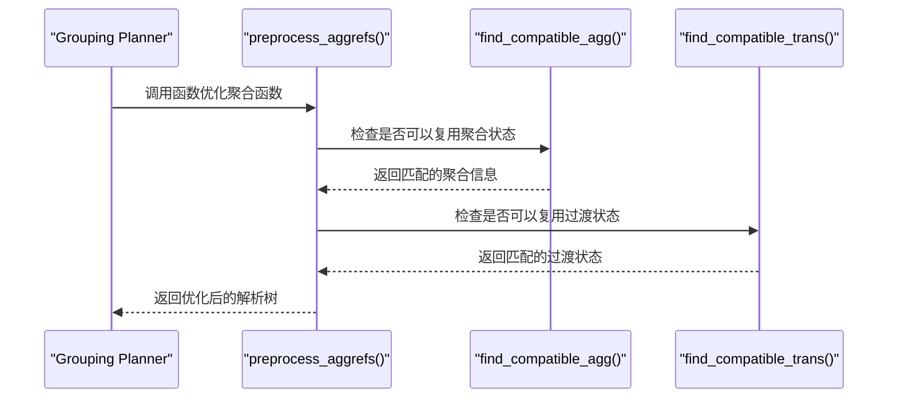
  
#### **示例场景**  
```sql  
SELECT SUM(x), COUNT(x) FROM table;  
```  
优化器行为：  
1. 检测到 `SUM(x)` 和 `COUNT(x)` 使用相同的输入列 `x`。  
2. 共享 `x` 的过渡状态以减少计算开销。  
  
#### **关键点**  
- **状态共享**：通过 `AggInfo` 和 `AggTransInfo` 结构记录聚合函数的状态信息。  
- **性能提升**：避免重复计算相同输入列的过渡状态。  
  
### 1.3 连接树优化 (`prepjointree.c`)  
  
#### **核心功能**  
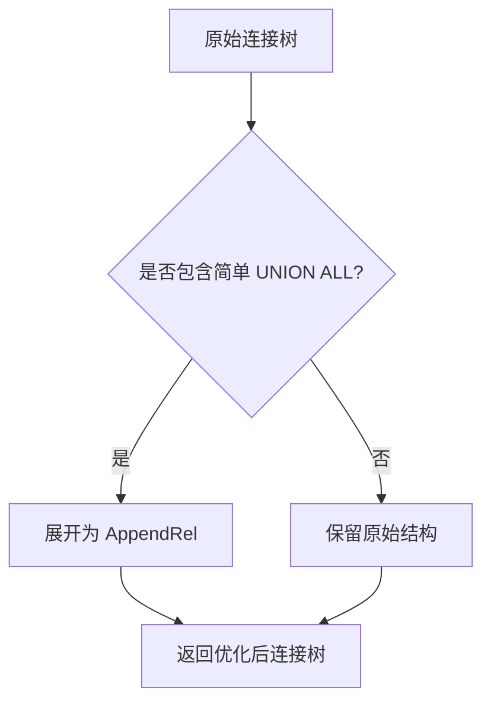
  
#### **示例场景**  
```sql  
SELECT * FROM (SELECT id FROM users UNION ALL SELECT id FROM orders);  
```  
优化器行为：  
1. 检测到 `UNION ALL` 子查询。  
2. 将其转换为 `AppendRel`，减少嵌套层次。  
  
#### **关键点**  
- **子查询上拉**：通过 `pull_up_subqueries` 将简单子查询上拉到顶层。  
- **连接树扁平化**：减少嵌套结构，提升计划生成效率。  
  
## **二、架构师视角 - 模块设计与交互**  
  
### 2.1 模块设计  
  
#### **统一接口**  
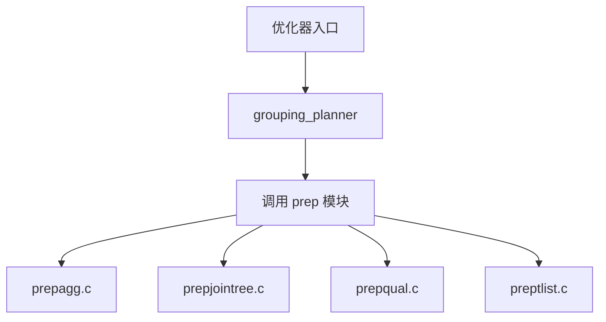
  
- **`grouping_planner`**：作为优化器入口，调用 `prep` 模块完成解析树预处理。  
- **`prep` 模块**：提供统一接口，支持多种优化场景。  
  
#### **动态调整**  
- **上下文传递**：通过 `PlannerInfo` 和 `rtoffset` 参数，确保每一层计划的变量引用调整独立且正确。  
- **递归处理**：从顶层开始逐层调整子计划，确保全局一致性。  
  
### 2.2 计划层次化  
  
#### **计划生成流程**  
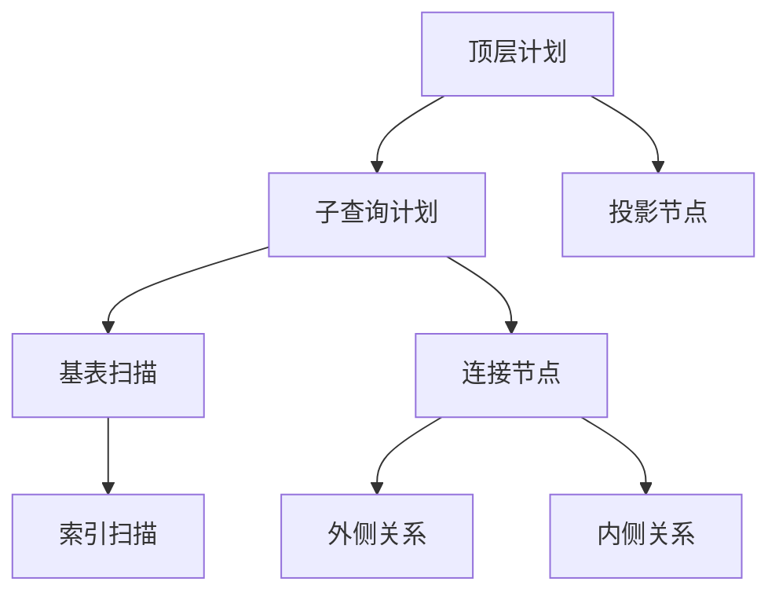
  
- **目标列表扩展**：通过 `expand_insert_targetlist` 确保插入操作的目标列表完整。  
- **条件表达式优化**：通过 `negate_clause` 和 `canonicalize_qual` 简化布尔表达式。  
- **连接树优化**：通过 `pull_up_subqueries` 和 `flatten_simple_union_all` 减少嵌套结构。  
  
## **三、用户视角 - 实际应用场景与收益**  
  
### 3.1 DBA 视角 - 执行计划优化  
  
#### **示例 1：聚合函数优化**  
```sql  
EXPLAIN SELECT MIN(id), MAX(name) FROM users;  
```  
优化器行为：  
1. 检测到 `MIN` 和 `MAX` 聚合函数。  
2. 构建基于索引扫描的路径。  
3. 选择最优路径并插入到 `UPPERREL_GROUP_AGG` 上游关系中。  
  
#### **示例 2：连接树优化**  
```sql  
EXPLAIN SELECT * FROM (SELECT id FROM users UNION ALL SELECT id FROM orders);  
```  
优化器行为：  
1. 检测到 `UNION ALL` 子查询。  
2. 将其转换为 `AppendRel`，减少嵌套层次。  
3. 提升执行计划生成效率。  
  
### 3.2 应用开发者视角 - 性能调优技巧  
  
#### **常见问题**  
| 现象 | 根因 | 解决方案 |  
|------|------|----------|  
| 聚合查询性能差 | 数据分布不均 | 创建合适的索引 |  
| 子查询未被优化 | 子查询未被规划 | 使用 `WITH` 或直接展开子查询 |  
  
#### **参数调整**  
```sql  
-- 提升排序内存  
SET work_mem = '8MB';  
  
-- 强制禁用位图扫描  
SET enable_bitmapscan = off;  
```  
  
## **四、核心算法深度解析**  
  
### 4.1 聚合函数优化 (`prepagg.c`)  
  
#### **状态共享机制**  
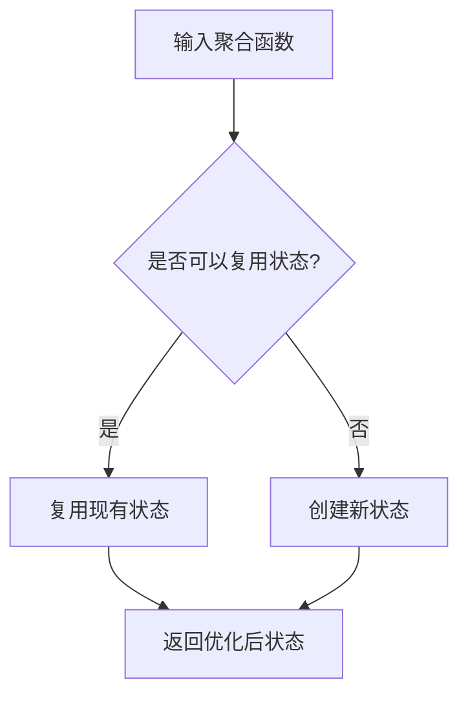
  
#### **关键逻辑**  
1. **状态检测**：通过 `find_compatible_agg` 和 `find_compatible_trans` 检测是否存在可复用的状态。  
2. **状态复用**：若存在匹配状态，则复用以减少计算开销。  
3. **状态生成**：若无匹配状态，则创建新状态并记录相关信息。  
  
#### **示例**  
```sql  
SELECT AVG(x), STDDEV(x) FROM table;  
```  
优化器行为：  
1. 检测到 `AVG(x)` 和 `STDDEV(x)` 使用相同的输入列 `x`。  
2. 共享 `x` 的过渡状态以减少计算开销。  
  
### 4.2 条件表达式优化 (`prepqual.c`)  
  
#### **布尔表达式扁平化**  
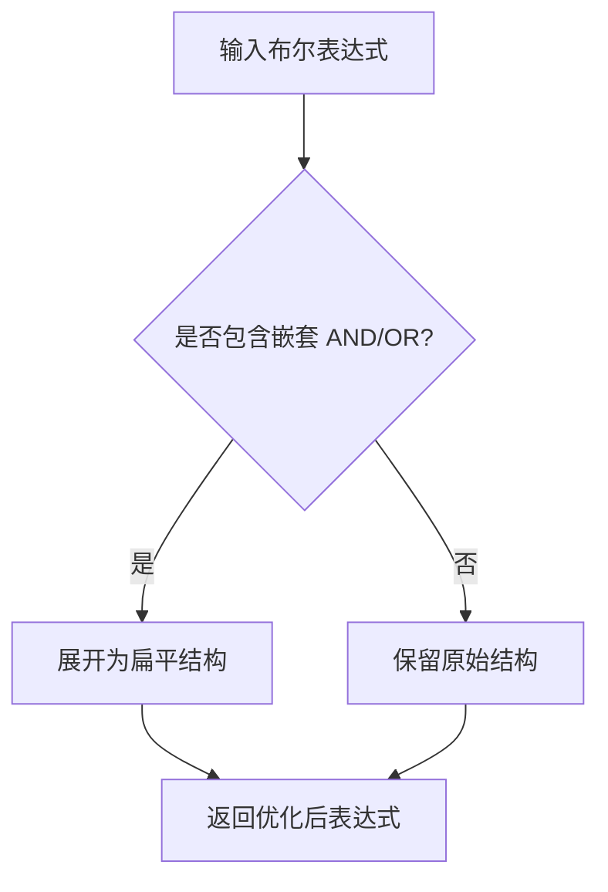
  
#### **关键逻辑**  
1. **嵌套检测**：通过 `pull_ands` 和 `pull_ors` 检测并展开嵌套的 `AND` 和 `OR` 表达式。  
2. **逻辑简化**：通过 `negate_clause` 和 `canonicalize_qual` 简化布尔表达式。  
  
#### **示例**  
```sql  
SELECT * FROM users WHERE (age > 30 OR age < 18) AND gender = 'M';  
```  
优化器行为：  
1. 展开嵌套的 `OR` 表达式。  
2. 简化为扁平结构：  
   ```sql  
   SELECT * FROM users WHERE (age > 30 OR age < 18) AND gender = 'M';  
   ```  
  
### 4.3 目标列表扩展 (`preptlist.c`)  
  
#### **列映射机制**  
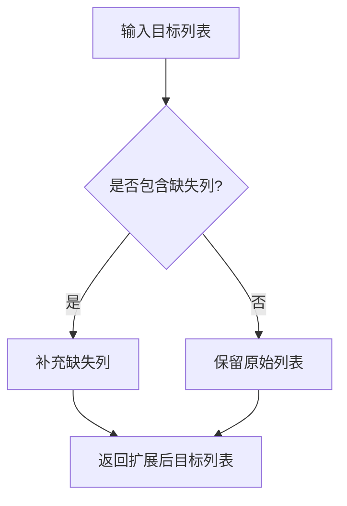
  
#### **关键逻辑**  
1. **列检测**：通过 `expand_insert_targetlist` 检测目标列表中是否包含所有必要列。  
2. **列补充**：若存在缺失列，则补充默认值或 NULL。  
  
#### **示例**  
```sql  
INSERT INTO users (name, age) VALUES ('John', 25);  
```  
优化器行为：  
1. 检测到目标列表中缺少 `id` 列。  
2. 补充默认值或 NULL：  
   ```sql  
   INSERT INTO users (id, name, age) VALUES (NULL, 'John', 25);  
   ```  
  
### 4.4 集合操作优化 (`prepunion.c`)  
  
#### **UNION/INTERSECT/EXCEPT 处理**  
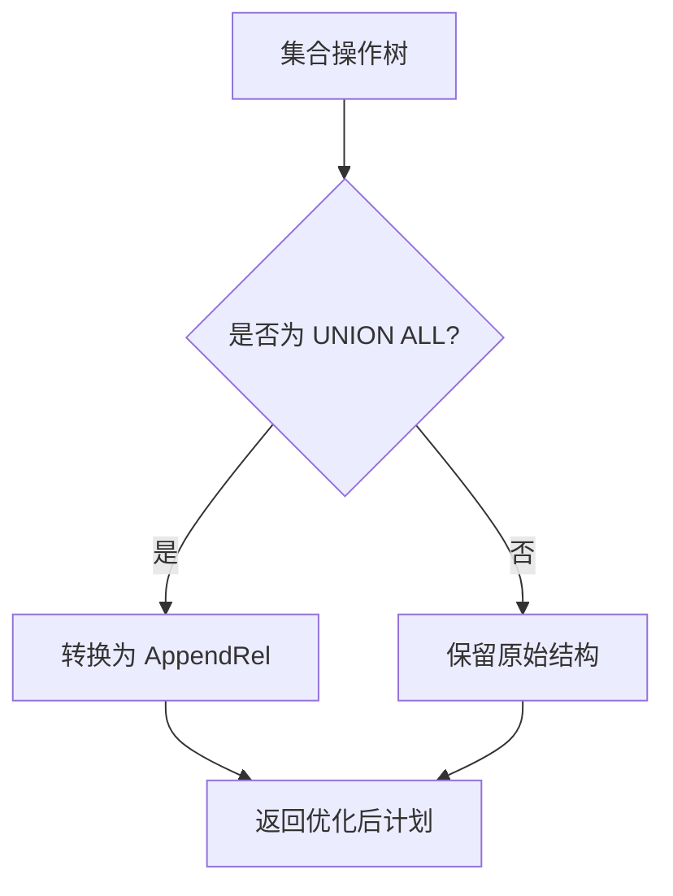
  
#### **关键逻辑**  
1. **子查询合并**：通过 `plan_union_children` 合并相同特性的子查询。  
2. **路径生成**：根据集合操作类型（如 `UNION`、`INTERSECT`）生成相应的路径。  
  
#### **示例**  
```sql  
SELECT id FROM users UNION ALL SELECT id FROM orders;  
```  
优化器行为：  
1. 检测到 `UNION ALL` 操作。  
2. 将其转换为 `AppendRel`，减少嵌套层次。  
  
## **五、诊断与调优建议**  
  
### 5.1 执行计划分析  
```sql  
EXPLAIN (ANALYZE, VERBOSE) SELECT ...;  
```  
关注点：  
1. 是否存在冗余的 `SubPlan` 或 `InitPlan` 节点。  
2. 聚合函数是否被正确优化为状态共享。  
3. 集合操作是否被正确优化为 `AppendRel`。  
  
### 5.2 参数调优  
| 参数 | 默认值 | 说明 |  
|------|--------|------|  
| `enable_indexscan` | on | 启用索引扫描 |  
| `enable_hashagg` | on | 启用哈希聚合 |  
| `work_mem` | 4MB | 控制排序和聚合内存 |  
  
#### **示例**  
```sql  
-- 提升排序内存  
SET work_mem = '8MB';  
  
-- 强制禁用哈希聚合  
SET enable_hashagg = off;  
```  
  
## **六、创新机制解读**  
  
### 6.1 动态依赖管理 (`SS_identify_outer_params`)  
  
#### **效果**  
- 自动记录计划对外部参数的依赖，确保缓存计划在参数变更时失效。  
- **示例**  
```sql  
SELECT MIN(price) FROM products WHERE category_id = $1;  
```  
优化器行为：  
1. 检测到 `$1` 为外部参数。  
2. 记录其依赖关系，确保参数变更时重新规划。  
  
### 6.2 初始化计划生成 (`SS_make_initplan_from_plan`)  
  
#### **关键点**  
- **条件判断**：若子查询无相关变量，则生成 `InitPlan`。  
- **示例**  
```sql  
SELECT * FROM users WHERE EXISTS (SELECT 1 FROM orders WHERE orders.status = 'active');  
```  
优化器行为：  
1. 检测到子查询无相关变量。  
2. 生成 `InitPlan`，提前计算结果以减少重复执行。  
  
## **七、总结**  
  
`prep` 目录下的代码通过精细化的解析树预处理，显著提升了复杂查询的执行效率。内核开发者需理解其递归调整机制，DBA 应结合统计信息与执行计划进行调优，而架构师则需关注模块间的协作以设计更灵活的查询引擎。  
  
  
## 提示        
```        
使用cursor                 
                
@prep             
1 解读prep代码目录的顶层设计. 从数据库内核开发者、架构师、用户(应用开发者和DBA)多个角度通熟易懂的解读这个代码, 使用sequence、mermaid图表增加可读性, 使用恰当的例子增加对代码的解释. 关键内容务必要深入重点详细解释.  
2 目录中每个c文件的作用, 用mermaid表示其关系. prepagg.c       prepjointree.c  prepqual.c      preptlist.c     prepunion.c          
                
长文本模式                 
```        
        
## PolarDB & PostgreSQL 15 差异        
```        
git diff -u 50d3d22baba63613d1f1406b2ed460dc9b03c3fc f5e7493819e370d30ac2047c68c21c9fb03ce4a0 -- src/backend/optimizer/plan/subselect.c        
```        
        
差异分析待补充.        
        
<b> 以上内容基于DeepSeek、QwQ及诸多AI生成, 轻微人工调整, 感谢杭州深度求索人工智能、阿里云等公司. </b>        
        
<b> AI 生成的内容请自行辨别正确性, 当然也多了些许踩坑的乐趣, 毕竟冒险是每个男人的天性.  </b>        
       
  
#### [期望 PostgreSQL|开源PolarDB 增加什么功能?](https://github.com/digoal/blog/issues/76 "269ac3d1c492e938c0191101c7238216")
  
  
#### [PolarDB 开源数据库](https://openpolardb.com/home "57258f76c37864c6e6d23383d05714ea")
  
  
#### [PolarDB 学习图谱](https://www.aliyun.com/database/openpolardb/activity "8642f60e04ed0c814bf9cb9677976bd4")
  
  
#### [PostgreSQL 解决方案集合](../201706/20170601_02.md "40cff096e9ed7122c512b35d8561d9c8")
  
  
#### [德哥 / digoal's Github - 公益是一辈子的事.](https://github.com/digoal/blog/blob/master/README.md "22709685feb7cab07d30f30387f0a9ae")
  
  
#### [About 德哥](https://github.com/digoal/blog/blob/master/me/readme.md "a37735981e7704886ffd590565582dd0")
  
  

  
