## 3分钟速玩Dify(高度可定制的企业级AI应用开源项目)  
                    
### 作者                    
digoal                    
                    
### 日期                    
2025-04-04                   
                    
### 标签                    
PostgreSQL , PolarDB , DuckDB , Dify , 企业级AI应用 , RAG , chatbot , 工作流           
                    
----                    
                    
## 背景      
3分钟速玩Dify.   
  
以搭建ChatBot为例, 支持知识库功能、向量rerank和模糊检索综合排序、本地大模型、云端大模型(bailian百炼平台). 快速感受一下Dify. 不过Dify的能力可远不止于此.   
  
## Demo
测试机为 Macos M2, 请先安装好docker desktop和docker compose(desktop自带)  
  
快速拉起Dify  
```  
cd ~  
git clone --depth 1 https://github.com/langgenius/dify  
cd dify  
cd docker  
cp .env.example .env  
  
# 修改.env环境变量文件.    
# 使用vector存储, 使用pgvector. 它会自动安装:    
#   pgvector插件(用来对知识库导入的文本进行向量检索)  
#   以及pg_bigm插件(用来对知识库导入的文本进行 %...% 模糊搜索)    
vi .env  
VECTOR_STORE=pgvector  
  
# 启动一系列docker容器  
docker compose up -d

# 注, 修改.env需要重启dify. 停止使用down
docker compose down  
docker compose up -d  
```  
  
是不是很简单, 自动拉去需要的镜像中.  
```  
 ⠹ web Pulling   
 ✔ plugin_daemon Pulled   
 ⠹ pgvector Pulling   
 ⠹ worker Pulling  
 ⠹ redis Pulling   
 ✔ db Pulled   
 ⠹ sandbox Pulling     
 ⠹ api Pulling       
 ⠹ ssrf_proxy Pulling      
 ✔ nginx Pulled    
  
 ...  
```  
  
启动后可以看到相应的容器  
```  
$ docker ps  
CONTAINER ID   IMAGE                                                                       COMMAND                  CREATED        STATUS                  PORTS                                      NAMES  
8f1b57ead8b6   nginx:latest                                                                "sh -c 'cp /docker-e…"   20 hours ago   Up 20 hours             0.0.0.0:80->80/tcp, 0.0.0.0:443->443/tcp   docker-nginx-1  
9ed6b6613710   langgenius/dify-api:1.1.3                                                   "/bin/bash /entrypoi…"   20 hours ago   Up 20 hours             5001/tcp                                   docker-worker-1  
d6339fe6944f   langgenius/dify-api:1.1.3                                                   "/bin/bash /entrypoi…"   20 hours ago   Up 20 hours             5001/tcp                                   docker-api-1  
717eac60057f   langgenius/dify-plugin-daemon:0.0.6-local                                   "/bin/bash -c /app/e…"   20 hours ago   Up 20 hours             0.0.0.0:5003->5003/tcp                     docker-plugin_daemon-1  
22e778fb9d51   redis:6-alpine                                                              "docker-entrypoint.s…"   20 hours ago   Up 20 hours (healthy)   6379/tcp                                   docker-redis-1  
b112a660b024   pgvector/pgvector:pg16                                                      "/docker-entrypoint.…"   20 hours ago   Up 20 hours (healthy)   5432/tcp                                   docker-pgvector-1  
0b58ec968dcf   postgres:15-alpine                                                          "docker-entrypoint.s…"   20 hours ago   Up 20 hours (healthy)   5432/tcp                                   docker-db-1  
47bee050b1f3   langgenius/dify-sandbox:0.2.11                                              "/main"                  20 hours ago   Up 20 hours (healthy)                                              docker-sandbox-1  
f32d984c7bb2   ubuntu/squid:latest                                                         "sh -c 'cp /docker-e…"   20 hours ago   Up 20 hours             3128/tcp                                   docker-ssrf_proxy-1  
bd2a1fa87b8e   langgenius/dify-web:1.1.3                                                   "/bin/sh ./entrypoin…"   20 hours ago   Up 20 hours             3000/tcp                                   docker-web-1  
```  
  
PS: 如果你想用PolarDB代替PostgreSQL, 可以再修改`.env`配置文件中下面的参数, 对应到PolarDB即可  
```  
# pgvector configurations, only available when VECTOR_STORE is `pgvector`  
PGVECTOR_HOST=pgvector  
PGVECTOR_PORT=5432  
PGVECTOR_USER=postgres  
PGVECTOR_PASSWORD=difyai123456  
PGVECTOR_DATABASE=dify  
PGVECTOR_MIN_CONNECTION=1  
PGVECTOR_MAX_CONNECTION=5  
PGVECTOR_PG_BIGM=false  
PGVECTOR_PG_BIGM_VERSION=1.2-20240606  
```  
  
PolarDB的部署可参考, 还需要安装pg_bigm插件, 参考文末:    
- [《穷鬼玩PolarDB RAC一写多读集群系列 | 在Docker容器中用loop设备模拟共享存储搭建PolarDB RAC》](../202412/20241216_03.md)    
- [《穷鬼玩PolarDB RAC一写多读集群系列 | 升级vector插件》](../202412/20241224_05.md)    
  
下面进入到WEB页面, 配置Dify  
  
http://127.0.0.1  
  
首次连接, 将自动跳转到install页面, 设置管理员密码.    
  
  
  
  
如果忘记密码, 可以使用这个方法重置:  
```  
docker exec -it docker-api-1 flask reset-password  
```  
  
登陆Dify  
  
http://127.0.0.1/signin  
  
  
  
要创建应用, 可以进入工作室标签, 当前工作室是空白的  
  
http://127.0.0.1/apps  
  
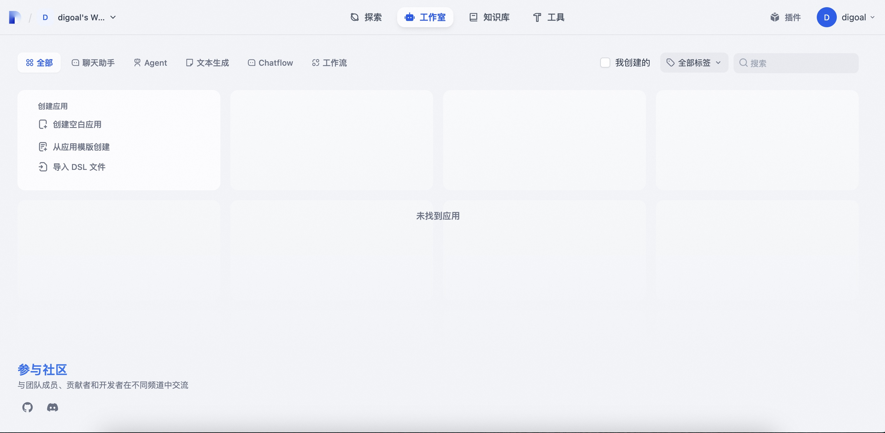  
  
  
先新建知识库  
  
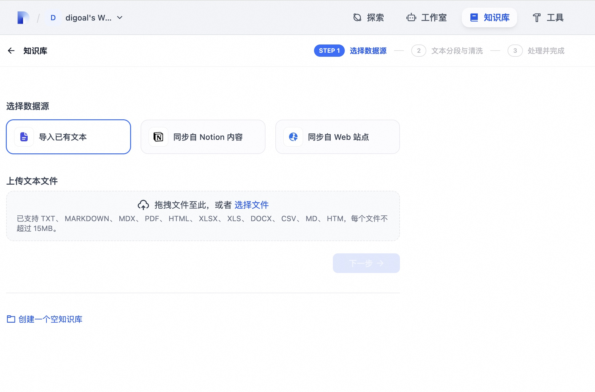  
  
可以把我github的几千篇文章弄进去, 克隆blog  
```  
git clone --depth 1 https://github.com/digoal/blog  
```  
  
选中一些markdown, 例如201811这个目录  
  
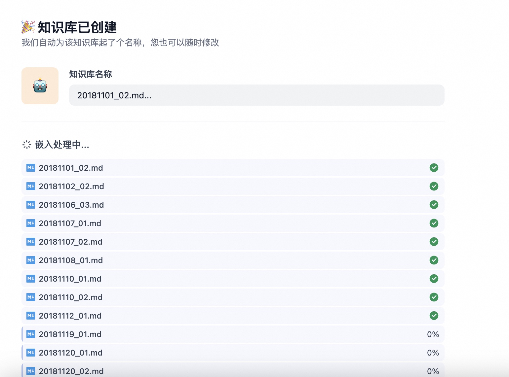  
  
```  
##### 20181129_01.md   [《PostgreSQL 多维、图像 欧式距离、向量距离、向量相似 查询优化 - cube,imgsmlr - 压缩、分段、异步并行》](20181129_01.md)    
##### 20181127_02.md   [《[招聘] [神州飞象] 招聘PostgreSQL 数据库内核研发、DBA》](20181127_02.md)    
##### 20181127_01.md   [《[招聘] [亚信] 招聘PostgreSQL 数据库内核研发》](20181127_01.md)    
##### 20181126_01.md   [《[招聘] [千寻位置] 招聘PostgreSQL DBA与PG背景的服务端研发》](20181126_01.md)    
##### 20181125_01.md   [《PostgreSQL bgwriter,walwriter,backend process 写磁盘的实时监控》](20181125_01.md)    
##### 20181124_01.md   [《[未完待续] PostgreSQL 超级多表JOIN优化 - 优化器优化》](20181124_01.md)    
##### 20181122_02.md   [《PostgreSQL 空间聚合性能 - 行政区、电子围栏 空间聚合 - 时间、空间热力图》](20181122_02.md)    
##### 20181122_01.md   [《Oracle On the PL/SQL Function Result Cache》](20181122_01.md)    
##### 20181120_02.md   [《PostgreSQL 流计算插件 - pipelinedb 1.x 参数配置介绍》](20181120_02.md)    
##### 20181120_01.md   [《PostgreSQL 粗心设错session_preload_libraries的补救方法》](20181120_01.md)    
##### 20181119_01.md   [《双向复制，多向复制，multi-master - 多主 - 多写 - 如何在多写中避免数据复制打环(死循环)》](20181119_01.md)    
##### 20181112_01.md   [《Greenplum 垃圾回收、收集统计信息调度 - vacuum analyze 所有表 - 注意锁问题》](20181112_01.md)    
##### 20181110_02.md   [《Greenplum 6 + ORCA 在CentOS 7下面的部署》](20181110_02.md)    
##### 20181110_01.md   [《Greenplum 6 加 oracle兼容插件 orafce》](20181110_01.md)    
##### 20181108_01.md   [《PostgreSQL 在线修改数据类型 - online ddl 方法之一》](20181108_01.md)    
##### 20181107_02.md   [《Postgres中国用户大会 2018（大象汇） - 海选主题分享》](20181107_02.md)    
##### 20181107_01.md   [《[招聘] [恩墨] 招聘PostgreSQL 高级DBA》](20181107_01.md)    
##### 20181106_03.md   [《Greenplum 大宽表 OR 分层关系 - 大量nestloop，补齐其他字段的性能损耗》](20181106_03.md)    
##### 20181102_02.md   [《PostgreSQL(PPAS 兼容Oracle) 从零开始入门手册 - 珍藏版》](20181102_02.md)    
##### 20181101_02.md   [《PostgreSQL pipelinedb 流计算插件 - IoT应用 - 实时轨迹聚合》](20181101_02.md)    
```  
  
导入文本后, 进行召回测试, 效果不是很好  
  
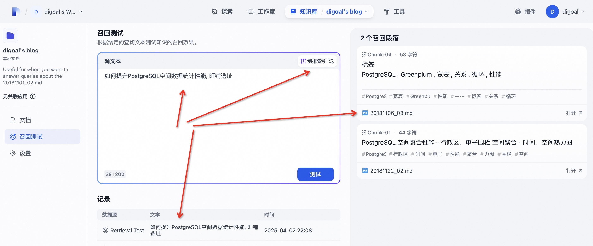  
  
根据后面的方法配置了百炼的rerank模型后, 建议使用混合检索(向量检索+模糊查询), 召回正确性更好.   
  
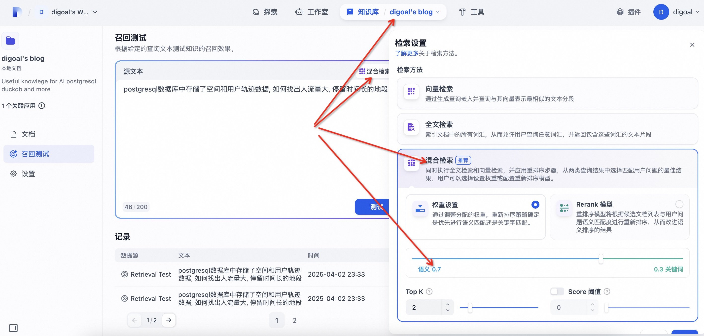  
  
  
  
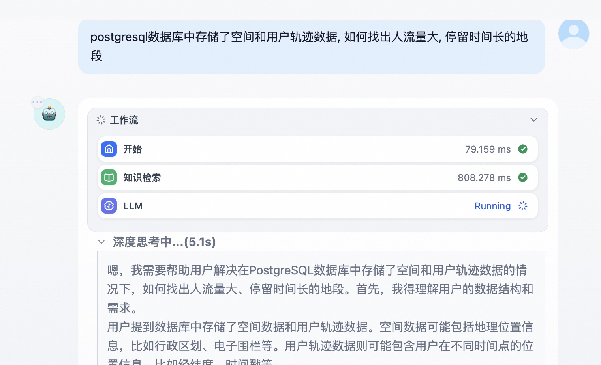  
  
  
````  
<think>  
嗯，我需要帮助用户解决在PostgreSQL数据库中存储了空间和用户轨迹数据的情况下，如何找出人流量大、停留时间长的地段。首先，我得理解用户的数据结构和需求。  
  
用户提到数据库中存储了空间数据和用户轨迹数据。空间数据可能包括地理位置信息，比如行政区划、电子围栏等。用户轨迹数据则可能包含用户在不同时间点的位置信息，比如经纬度、时间戳等。  
  
用户的目标是找出人流量大、停留时间长的地段。这意味着我需要分析用户在哪些区域停留的时间较长，以及这些区域在特定时间段内的用户数量。  
  
首先，我需要考虑如何将用户的轨迹数据转换为空间数据。这可能涉及到将用户的轨迹点落入特定的空间网格或区域（比如行政区划、电子围栏）中。这样可以统计每个区域内的用户数量和停留时间。  
  
接下来，我需要设计一个方法来计算每个区域的用户数量和停留时间。这可能需要使用到PostgreSQL的空间扩展，比如PostGIS，来处理地理空间数据。PostGIS提供了丰富的空间操作函数，可以帮助我将用户的轨迹点与空间网格或区域进行匹配。  
  
另外，我还需要考虑时间因素。用户在不同时间段内的活动可能不同，比如工作日和周末的人流量可能有很大差异。因此，可能需要按时间段统计用户数量和停留时间。  
  
在具体实现上，我需要以下几个步骤：  
  
1. **数据预处理**：确保用户轨迹数据和空间数据已经存储在数据库中，并且格式一致。可能需要清洗和格式化数据，以确保后续分析的准确性。  
  
2. **空间网格划分**：如果还没有现成的空间网格或区域划分，可能需要先创建一个空间网格，将整个研究区域划分为多个小的网格或区域。这样可以方便后续的统计和分析。  
  
3. **轨迹点落入网格**：使用PostGIS的空间操作函数，将用户的轨迹点落入相应的网格或区域中。这可以使用ST_Contains、ST_Intersects等函数来实现。  
  
4. **统计用户数量和停留时间**：根据落入网格的轨迹点，统计每个网格内的用户数量和用户的停留时间。停留时间可以通过计算用户在该网格内的轨迹点之间的时间差来估算。  
  
5. **分析和可视化**：将统计结果进行分析，找出用户数量多、停留时间长的网格。可能还需要生成热力图或其他可视化图表，以便更直观地展示结果。  
  
6. **优化和验证**：在分析过程中，可能需要不断优化算法和参数，以提高分析的准确性和效率。同时，也需要验证结果的合理性，确保没有出现明显的偏差或错误。  
  
在整个过程中，我需要特别注意数据的隐私和安全问题。用户轨迹数据通常包含敏感信息，必须确保数据的处理和存储符合相关法律法规，比如《通用数据保护条例》（GDPR）等。  
  
另外，我还需要考虑性能问题。如果数据量非常大，直接在数据库中进行复杂的计算可能会导致性能瓶颈。可能需要优化查询语句，或者使用分布式计算框架（如Spark）来处理大数据量的分析任务。  
  
最后，我需要确保整个流程的可重复性和可维护性。编写清晰的文档，记录每一步的操作和结果，以便后续的维护和扩展。  
  
总的来说，要实现用户的需求，我需要结合PostgreSQL的空间扩展功能，设计一个高效的数据处理和分析流程，确保能够准确地找出人流量大、停留时间长的地段。  
</think>要找出人流量大、停留时间长的地段，可以按照以下步骤进行：  
  
1. **数据准备**：  
    - 确保数据库中存储了用户轨迹数据和空间数据。用户轨迹数据应包括用户的标识符、时间戳和地理位置信息（如经纬度）。  
    - 确保空间数据（如行政区划、电子围栏）已经存储在数据库中，并且格式与用户轨迹数据一致。  
  
2. **空间网格划分**：  
    - 如果还没有现成的空间网格，可以使用PostGIS创建一个空间网格。例如，使用`ST_CreateGrid`函数将研究区域划分为多个小网格。  
    - 确定网格的大小和分辨率，根据研究区域的大小和精度需求进行调整。  
  
3. **轨迹点落入网格**：  
    - 使用PostGIS的空间操作函数，将用户的轨迹点落入相应的网格中。例如，使用`ST_Intersects`函数判断轨迹点是否位于某个网格内。  
    - 将落入网格的轨迹点与网格标识符关联起来，以便后续统计。  
  
4. **统计用户数量和停留时间**：  
    - 按网格统计用户数量。可以使用`COUNT`函数统计每个网格内的用户数量。  
    - 计算用户的停留时间。停留时间可以通过计算用户在该网格内的轨迹点之间的时间差来估算。例如，对于每个用户，在网格内的连续轨迹点之间的时间差之和即为停留时间。  
    - 将用户数量和停留时间作为两个指标，分别进行统计和分析。  
  
5. **分析和可视化**：  
    - 根据统计结果，找出用户数量多、停留时间长的网格。可以设置阈值，筛选出符合条件的网格。  
    - 使用热力图或其他可视化工具，展示这些网格的分布情况。热力图可以直观地反映人流量和停留时间的集中区域。  
    - 如果需要，可以进一步分析这些网格在不同时间段的表现，比如工作日和周末的差异。  
  
6. **优化和验证**：  
    - 在分析过程中，根据结果不断优化算法和参数。例如，调整网格的大小，或改进停留时间的计算方法。  
    - 验证分析结果的合理性。可以通过抽样检查或与实际数据对比，确保结果的准确性。  
  
7. **报告和应用**：  
    - 编写分析报告，总结人流量大、停留时间长的地段，并提出相应的建议或应用方案。  
    - 如果需要，可以将分析结果集成到现有的系统中，用于实时监控或决策支持。  
  
在整个过程中，需要注意以下几点：  
  
- **数据隐私**：确保用户轨迹数据的处理和存储符合相关隐私保护法规，避免泄露敏感信息。  
- **性能优化**：对于大规模数据，优化数据库查询和计算过程，提升分析效率。  
- **结果可视化**：通过直观的图表展示分析结果，便于理解和应用。  
  
通过以上步骤，可以有效地在PostgreSQL数据库中找出人流量大、停留时间长的地段，为相关决策提供数据支持。  
````  
  
关于模糊查询的插件和优化方法请参考:    
- [《PostgreSQL 模糊查询、相似查询 (like '%xxx%') pg_bigm 比 pg_trgm 优势在哪?》](../202009/20200912_01.md)    
- [《PostgreSQL 模糊查询增强插件pgroonga , pgbigm (含单字、双字、多字、多字节字符) - 支持JSON模糊查询等》](../202003/20200330_01.md)    
- [《PostgreSQL 模糊查询最佳实践 - (含单字、双字、多字模糊查询方法)》](../201704/20170426_01.md)    
  
  
关于pgvector向量索引的优化, 召回率的调整相关文章, 请参考:   
- [《头大! 索引扫描和全表扫描结果不一样, 这向量数据库还能用? 教你一招大幅提升召回率(recall)》](../202404/20240417_01.md)    
- [《向量搜索优化3板斧: 空间、性能、召回(recall)》](../202405/20240506_03.md)    
  
  
  
进入工作室标签, 创建应用  
  
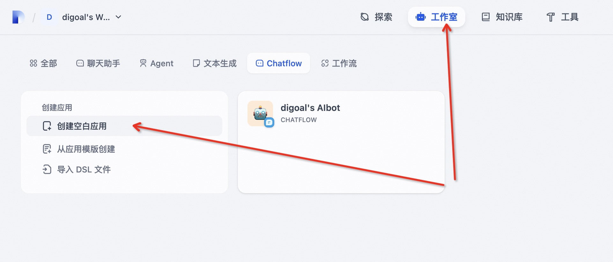  
  
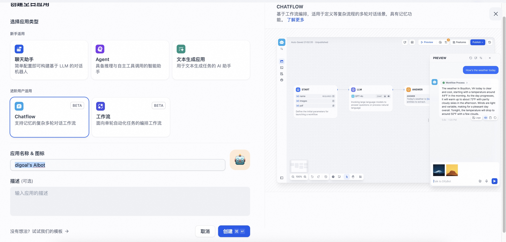  
  
配置工作流, 选择Chatflow    
  
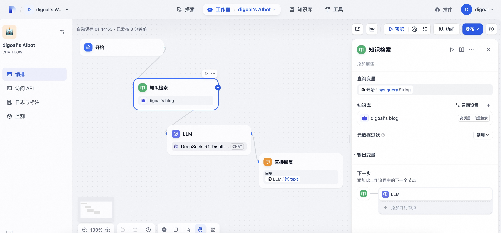  
  
如果你想使用本地模型, 可以打开插件标签, 安装ollama插件  
  
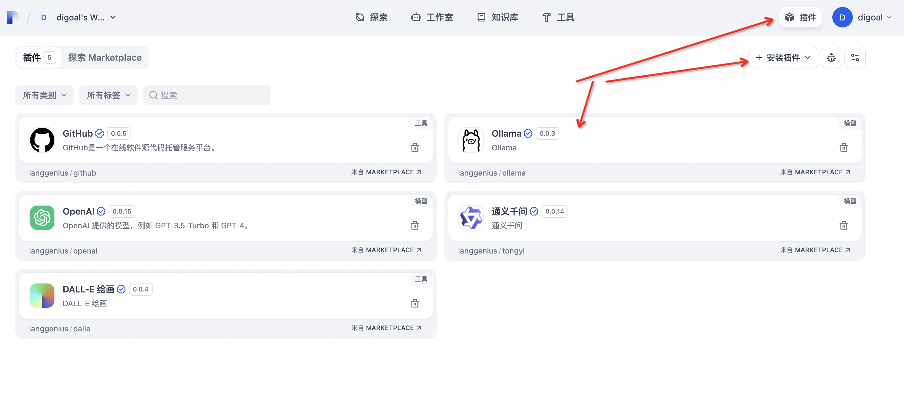  
  
拉起ollama服务.    
```    
OLLAMA_HOST=0.0.0.0:11434 OLLAMA_KEEP_ALIVE=-1 nohup ollama serve >> ~/.ollama.log 2>&1 &    
```   
  
已经有下列模型, 包括一些文本生存模型、embedding模型(将文本转换为向量的模型)  
```  
$ ollama list  
NAME                             ID              SIZE      MODIFIED       
ds-qwen2.5-1.5b-digoal:latest    2c6aaa8a497c    3.6 GB    5 weeks ago       
qwen2.5:1.5b                     65ec06548149    986 MB    5 weeks ago       
deepseek-r1:7b                   0a8c26691023    4.7 GB    6 weeks ago       
qwen_1.5b_test1:latest           682ad25636bd    1.1 GB    7 weeks ago       
deepseek-r1:1.5b                 a42b25d8c10a    1.1 GB    7 weeks ago       
deepseek-r1:14b                  ea35dfe18182    9.0 GB    2 months ago      
mxbai-embed-large:latest         468836162de7    669 MB    4 months ago      
```  
  
配置使用ollama模型, 添加chat模型和embedding模型  
  
  
  
在工作流LLM页面进入配置模型的页面.   
  
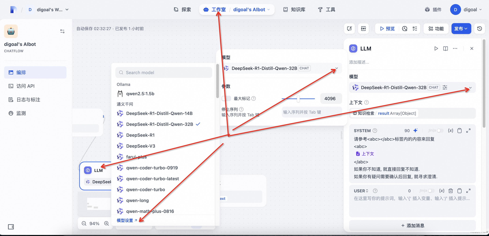  
  
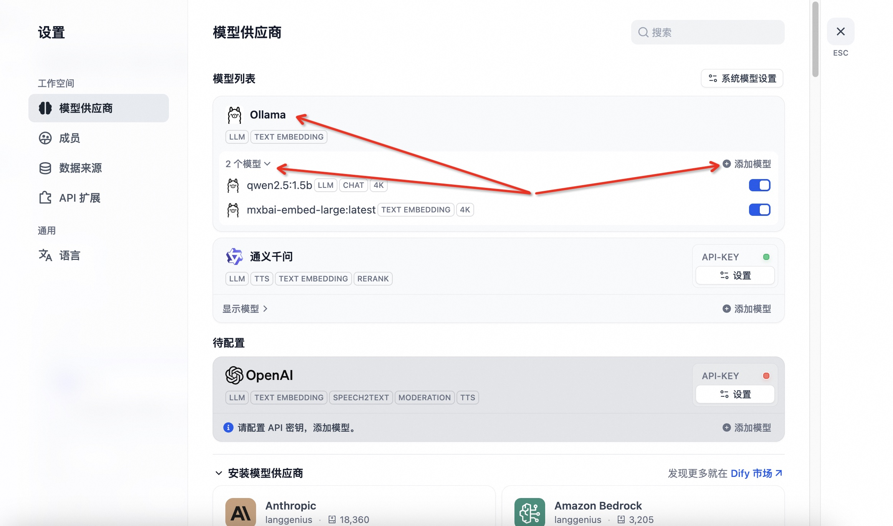  
  
因为dify运行在docker内, ollama运行在宿主机中, 所以地址需要使用 `host.docker.internal` 地址(docker内的特殊域名, 可以访问宿主机IP)  
```  
http://host.docker.internal:11434  
```  
  
本地模型太弱了, 我们可以再加一些免费模型进来, 百炼平台每个模型都有100万免费体验token, 不用白不用.     
  
薅羊毛免费模型, 方法参考:    
- [《Cursor 如何接入百炼 dashscope 内的大模型 例如QwQ , Qwen , Deepseek》](../202503/20250327_07.md)    
- [《德说-第316期, AI从业者智商测试: 聪明人在薅羊毛傻子在竞争算力》](../202503/20250329_01.md)    
  
安装bailian插件  
  
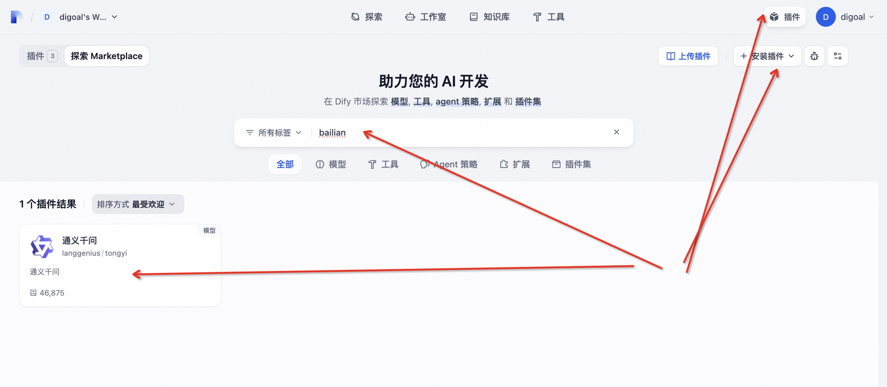  
  
进入模型设置  
  
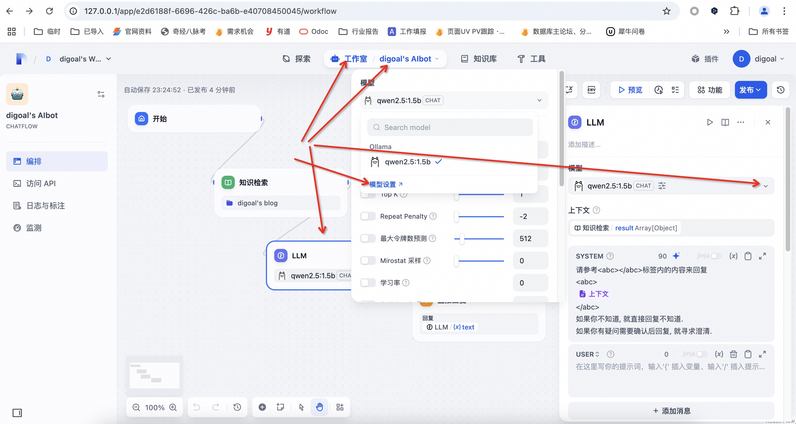  
  
设置bailian key等  
  
https://bailian.console.aliyun.com/  
  
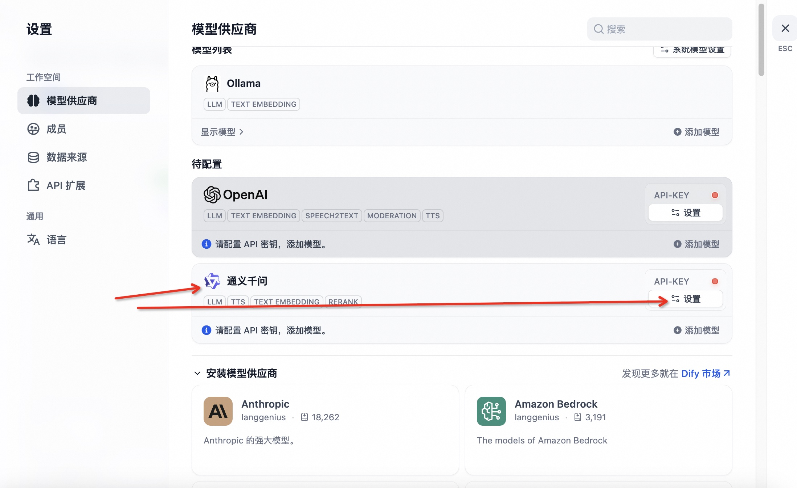  
  
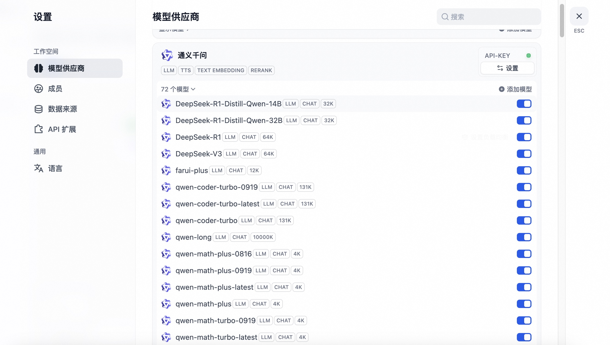  
  
  
配置工作流, 配置LLM时, 需要加入知识库的输出作为输入, 上下文处嵌入知识库的输出变量. 使用`/` 或 点击页面中的`x按钮`可选择变量.    
  
https://docs.dify.ai/zh-hans/guides/workflow/node/knowledge-retrieval  
  
  
  
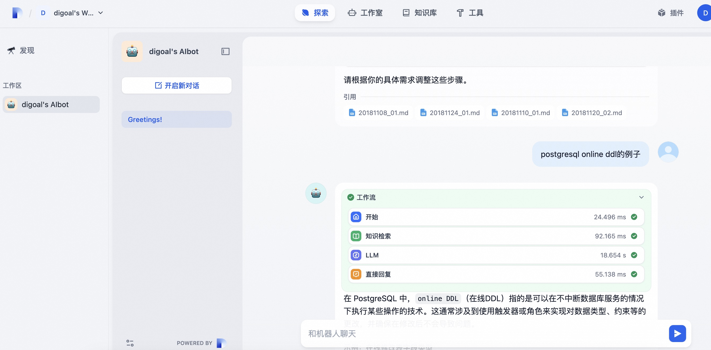  
  
最后, 点击发布.   
  
进入探索标签, 选中我们搭建好的chatbot. 换成参数更大的模型以及相应的知识库文章配合RAG, 回答更靠谱一些.   
  
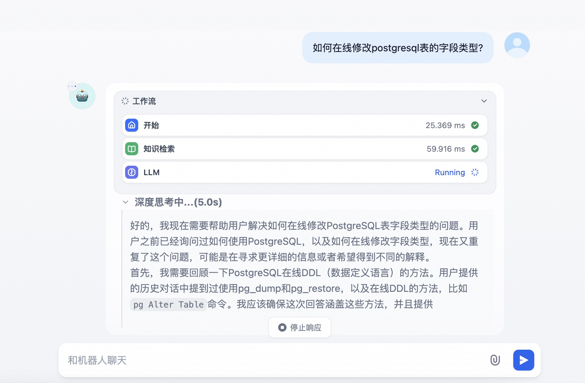  
  
  
企业中实际应用Dify要二开或加入更多节点进行打磨, 例如本例的chatbot, 还可以加入网页搜索、知识库数据预处理、联网搜索、会话(记忆)功能、外接MCP服务、增加文生图模型、增加文字转语音等等.    
  
如果只是构建RAG(基于网页搜索、知识库、自提交内容等), 可以选择openWebUI, 这个产品专注在RAG领域, 使用起来更简单一些.    
  
Dify非常强大, 非常适合用来搭建企业级AI应用.    
  
  
## 参考  
  
https://github.com/langgenius/dify/blob/main/README.md  
  
https://github.com/langgenius/dify/blob/main/docker/README.md  
  
https://docs.dify.ai/learn-more/faq/install-faq  
  
https://docs.dify.ai/getting-started/install-self-hosted/faqs  
  
https://bailian.console.aliyun.com/  
  
https://github.com/digoal/blog  
  
https://docs.dify.ai/zh-hans/guides/workflow/node/knowledge-retrieval  
  
  
罗列了几个领域里面一些比较流行AI开源项目:    
- [《德说-第318期, 这类应用很有价值: 企业级AI工作流(支持大模型和MCP)开源项目有哪些?》](../202504/20250401_01.md)    
  
薅羊毛免费模型, 方法参考:    
- [《Cursor 如何接入百炼 dashscope 内的大模型 例如QwQ , Qwen , Deepseek》](../202503/20250327_07.md)    
- [《德说-第316期, AI从业者智商测试: 聪明人在薅羊毛傻子在竞争算力》](../202503/20250329_01.md)    
  
  
PolarDB的部署可参考, 还需要在PolarDB中安装pg_bigm插件:    
- [《穷鬼玩PolarDB RAC一写多读集群系列 | 在Docker容器中用loop设备模拟共享存储搭建PolarDB RAC》](../202412/20241216_03.md)    
- [《穷鬼玩PolarDB RAC一写多读集群系列 | 升级vector插件》](../202412/20241224_05.md)    
  
关于模糊查询的插件和优化方法请参考:    
- [《PostgreSQL 模糊查询、相似查询 (like '%xxx%') pg_bigm 比 pg_trgm 优势在哪?》](../202009/20200912_01.md)    
- [《PostgreSQL 模糊查询增强插件pgroonga , pgbigm (含单字、双字、多字、多字节字符) - 支持JSON模糊查询等》](../202003/20200330_01.md)    
- [《PostgreSQL 模糊查询最佳实践 - (含单字、双字、多字模糊查询方法)》](../201704/20170426_01.md)    
  
关于pgvector向量索引的优化, 召回率的调整相关文章, 请参考:   
- [《头大! 索引扫描和全表扫描结果不一样, 这向量数据库还能用? 教你一招大幅提升召回率(recall)》](../202404/20240417_01.md)    
- [《向量搜索优化3板斧: 空间、性能、召回(recall)》](../202405/20240506_03.md)    
  
  
  
#### [期望 PostgreSQL|开源PolarDB 增加什么功能?](https://github.com/digoal/blog/issues/76 "269ac3d1c492e938c0191101c7238216")
  
  
#### [PolarDB 开源数据库](https://openpolardb.com/home "57258f76c37864c6e6d23383d05714ea")
  
  
#### [PolarDB 学习图谱](https://www.aliyun.com/database/openpolardb/activity "8642f60e04ed0c814bf9cb9677976bd4")
  
  
#### [PostgreSQL 解决方案集合](../201706/20170601_02.md "40cff096e9ed7122c512b35d8561d9c8")
  
  
#### [德哥 / digoal's Github - 公益是一辈子的事.](https://github.com/digoal/blog/blob/master/README.md "22709685feb7cab07d30f30387f0a9ae")
  
  
#### [About 德哥](https://github.com/digoal/blog/blob/master/me/readme.md "a37735981e7704886ffd590565582dd0")
  
  

  
