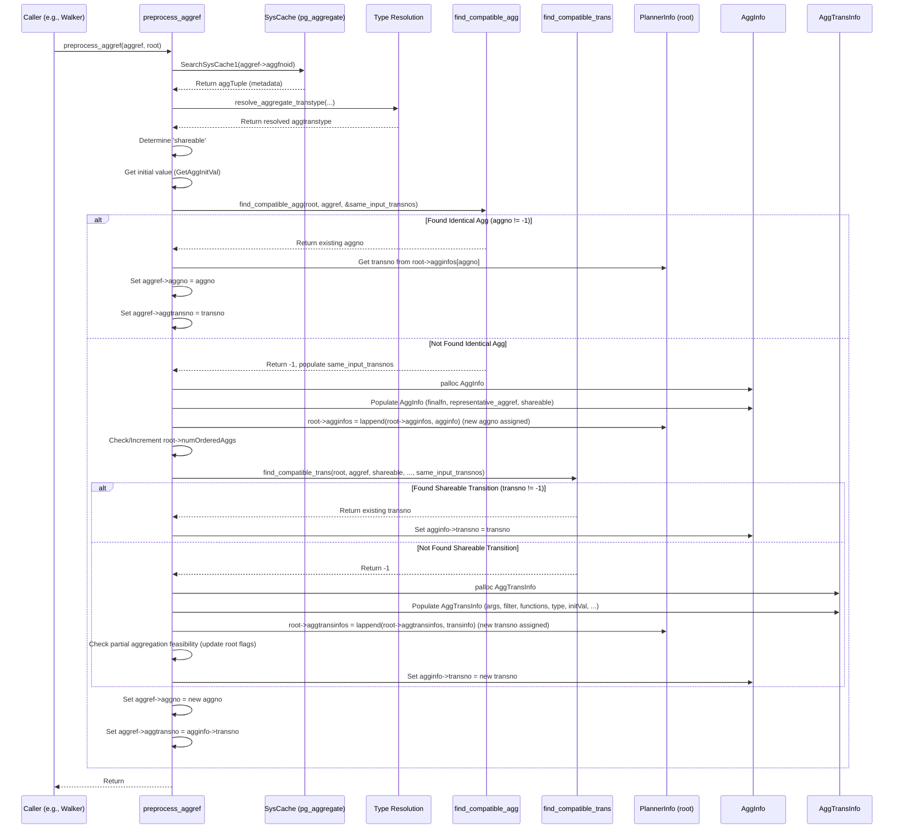
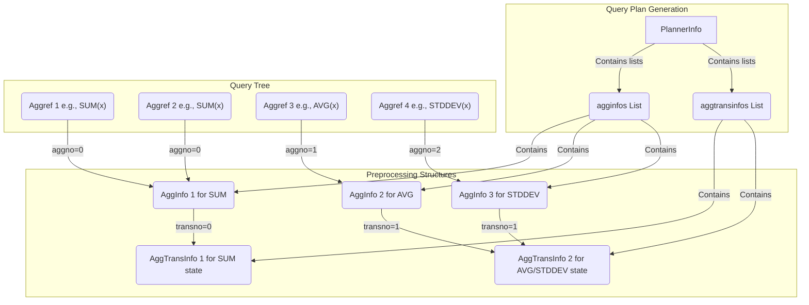

## AI辅助 PolarDB内核学习 - 33 优化器解析树预处理模块(prep) 核心代码 planagg.c  
          
### 作者          
digoal          
          
### 日期          
2025-04-07          
          
### 标签          
PostgreSQL , PolarDB , DuckDB , AI , 内核 , 学习 , prep , 解析树 , 预处理      
          
----          
          
## 背景     
关于聚合的原理, 可以参考一些文章: 
- [《PostgreSQL 并行计算解说 之9 - parallel 自定义并行聚合》](../201903/20190317_01.md)  
- [《Greenplum支持人为多阶段聚合的方法 - 直连segment(PGOPTIONS='-c gp_session_role=utility') Or gp_dist_random('gp_id') Or 多阶段聚合 prefunc》](../201806/20180624_02.md)  
- [《PostgreSQL 11 preview - 多阶段并行聚合array_agg, string_agg》](../201803/20180322_11.md)  
- [《PostgreSQL 11 preview - 分区表智能并行聚合、分组计算(已类似MPP架构，性能暴增)》](../201803/20180322_07.md)  
- [《PostgreSQL Oracle 兼容性之 - 自定义并行聚合函数 PARALLEL_ENABLE AGGREGATE》](../201803/20180312_03.md)  
- [《PostgreSQL VOPS 向量计算 + DBLINK异步并行 - 单实例 10亿 聚合计算跑进2秒》](../201802/20180210_01.md)  
- [《PostgreSQL 多个数组聚合为一维数组加速(array_agg)》](../201802/20180208_02.md)  
- [《PostgreSQL 10 自定义并行计算聚合函数的原理与实践 - (含array_agg合并多个数组为单个一元数组的例子)》](../201801/20180119_04.md)  
- [《HybridDB PostgreSQL "Sort、Group、distinct 聚合、JOIN" 不惧怕数据倾斜的黑科技和原理 - 多阶段聚合》](../201711/20171123_01.md)  
- [《Postgres-XC customized aggregate introduction》](../201305/20130502_01.md)  
          
## 解读 优化器解析树预处理模块(prep) 核心代码 planagg.c  
  
我们来解读一下 PostgreSQL 的 `prepagg.c` 文件中的代码。  
  
**代码作用简述**  
  
这段 C 代码（`prepagg.c`）是 PostgreSQL 查询优化器的一部分，专门用于**预处理**查询中的聚合函数（如 `SUM`, `AVG`, `COUNT` 等）。它的核心目标是**优化聚合计算**，主要通过两种方式实现：  
  
1.  **识别并合并完全相同的聚合函数调用**：如果一个查询中多次出现完全一样的聚合，比如 `SELECT SUM(x) ... HAVING SUM(x) > 10`，这段代码会确保 `SUM(x)` 的计算只执行一次。  
2.  **识别并共享可共享的聚合状态**：有些不同的聚合函数（如 `AVG(x)` 和 `STDDEV(x)`）虽然最终计算结果不同，但它们可能使用相同的输入参数、相同的中间计算过程（状态转移函数）和相同的初始状态。这段代码会识别这种情况，让它们共享同一个中间状态的计算，只在最后一步分别应用各自的最终计算函数。  
  
通过这些优化，可以减少冗余计算，提高查询执行效率。它通过分析 `Aggref` 节点（代表聚合函数调用的内部表示），填充其中的 `aggno` 和 `aggtransno` 字段，并创建 `AggInfo` 和 `AggTransInfo` 结构来记录需要独立计算的聚合终结信息和状态转移信息。  
  
---  
  
**多角度解读**  
  
为了更深入地理解，我们从不同角色的视角来看这段代码：  
  
**1. 数据库内核开发者 (Kernel Developer)**  
  
*   **关注点**: 数据结构、算法、与优化器/执行器的交互、系统目录访问、内存管理。  
  
*   **解读**:  
    *   **核心入口**: `preprocess_aggrefs` 函数是外部调用的入口，它通过 `preprocess_aggrefs_walker` 遍历查询树（`Node *clause`），专门寻找 `Aggref` 节点。  
    *   **`Aggref` 节点处理**: `preprocess_aggref` 函数是处理单个 `Aggref` 节点的核心。它首先通过 `SearchSysCache1(AGGFNOID, ...)` 查询系统目录 `pg_aggregate`，获取聚合函数的元数据，如状态转移函数 (`aggtransfn`)、最终计算函数 (`aggfinalfn`)、合并函数 (`aggcombinefn`)、序列化/反序列化函数 (`aggserialfn`/`aggdeserialfn`)、状态类型 (`aggtranstype`)、初始值 (`agginitval`) 等。  
    *   **多态类型解析**: 对于多态聚合函数（如 `array_agg` 的状态类型依赖于输入类型），需要调用 `resolve_aggregate_transtype` 来确定实际的状态类型 (`aggtranstype`)，并将其存回 `Aggref` 节点。  
    *   **状态共享条件**: `shareable` 标志位根据 `pg_aggregate.aggfinalmodify` 确定。只有当最终函数是 `AGGMODIFY_READ_ONLY` 或 `AGGMODIFY_SHAREABLE` 时，状态才可能被共享。`AGGMODIFY_READ_WRITE` 的最终函数会修改状态，因此不能共享。  
    *   **优化算法**:  
        1.  **查找相同聚合 (`find_compatible_agg`)**: 检查 `root->agginfos` 列表，看是否存在一个 `Aggref` 与当前处理的 `newagg` 完全相同（函数 OID、参数、`ORDER BY`、`DISTINCT`、`FILTER` 等都相同），并且不包含易失函数 (`contain_volatile_functions`)。如果找到，直接复用其 `aggno` 和 `transno`。  
        2.  **查找共享状态 (`find_compatible_trans`)**: 如果没有找到完全相同的聚合，但在 `find_compatible_agg` 过程中发现有其他聚合具有相同的输入参数 (`same_input_transnos` 列表记录了它们的 `transno`)，并且当前聚合是 `shareable` 的，那么就调用 `find_compatible_trans`。这个函数检查这些候选 `transno` 对应的 `AggTransInfo` 是否与当前聚合具有相同的状态转移函数、状态类型、合并/序列化/反序列化函数以及初始值。如果找到，就复用那个 `transno`。  
    *   **数据结构**:  
        *   `Aggref`: 查询树中表示聚合函数调用的节点。此代码会填充它的 `aggtranstype`, `aggno`, `aggtransno` 字段。  
        *   `PlannerInfo *root`: 规划器的全局上下文，包含 `agginfos` 和 `aggtransinfos` 列表。  
        *   `AggInfo`: 存储每个**唯一聚合计算结果**所需的信息，主要是最终函数 (`finalfn_oid`) 和它对应的状态转移编号 (`transno`)。`aggno` 是 `Aggref` 指向 `agginfos` 列表的索引。  
        *   `AggTransInfo`: 存储每个**唯一聚合状态转移过程**所需的信息，包括输入参数 (`args`)、过滤器 (`aggfilter`)、状态转移/合并/序列化/反序列化函数 OID、状态类型信息 (`aggtranstype`, `transtypeLen`, `transtypeByVal`, `aggtransspace`) 和初始值 (`initValue`)。`transno` 是 `Aggref` 和 `AggInfo` 指向 `aggtransinfos` 列表的索引。  
    *   **内存管理**: 使用 `palloc` 在 `CurrentMemoryContext` 中分配 `AggInfo` 和 `AggTransInfo` 结构，使用 `lappend` 将它们添加到 `PlannerInfo` 的列表中。  
    *   **与后续阶段关系**: `aggno` 和 `transno` 的信息会被后续创建 Agg 计划节点（如 `Agg`, `HashAgg`, `GroupAgg`）时使用，用来确定需要计算多少种不同的聚合状态，以及如何从这些状态计算最终结果。`get_agg_clause_costs` 函数利用这些信息来估算聚合操作的成本，影响最终的计划选择。代码注释（XXX）提到，目前这些信息在规划后被丢弃，执行器启动时需要重新查找部分信息，这是一个潜在的优化点。  
    *   **部分聚合 (Partial Aggregation)**: 代码会检查是否可以进行部分聚合 (`root->hasNonPartialAggs`, `root->hasNonSerialAggs`)。例如，没有 `combinefn` 或者 `INTERNAL` 状态类型没有序列化/反序列化函数时，就不能进行部分聚合。`ORDER BY` 或 `DISTINCT` 的聚合也会阻止部分聚合。  
  
**Sequence Diagram (Illustrating `preprocess_aggref` logic)**  
  

  
**2. 架构师 (Architect)**  
  
*   **关注点**: 优化策略、系统性能、资源利用、模块交互、可扩展性。  
  
*   **解读**:  
    *   **优化目标**: `prepagg.c` 体现了数据库在查询处理早期阶段进行优化的重要性。通过在规划阶段识别冗余计算，避免了在执行阶段浪费 CPU 和内存。  
    *   **优化机制**: 采用基于**等价性识别**（相同聚合）和**状态共享**（相同转移过程）的策略。这是一种典型的**公共子表达式消除**思想在聚合函数上的应用。  
    *   **资源影响**:  
        *   **CPU**: 减少了状态转移函数和最终函数的调用次数，降低 CPU 消耗。  
        *   **内存**: 对于 Hash Aggregation 等需要缓存状态的场景，共享状态可以显著减少内存占用，因为多个聚合结果可以从同一个状态值计算出来。`get_agg_clause_costs` 中的 `transitionSpace` 计算反映了这一点。  
        *   **规划时间**: 增加了一些规划阶段的开销（查找、比较、构建元数据结构），但通常这种开销远小于执行阶段节省的时间。  
    *   **模块交互**: 这是优化器（Optimizer）内部的一个预处理步骤，发生在查询树解析之后、生成最终执行计划（Plan Tree）之前。它处理 `Aggref` 节点，并将结果（`aggno`, `aggtransno` 和 `PlannerInfo` 中的列表）传递给后续的计划生成和成本估算逻辑。  
    *   **局限性与未来**:  
        *   **易失函数**: 包含易失函数（如 `random()`）的聚合无法被优化，因为每次调用都可能产生不同结果，这是合理的限制。  
        *   **信息传递**: 如注释 XXX 所述，`AggInfo`/`AggTransInfo` 在规划后丢弃，执行器需要重新查找部分信息。将这些信息传递到执行计划（Agg 节点）中可以进一步优化执行器启动时间，但会增加计划结构的复杂性。  
    *   **可扩展性**: 添加新的聚合函数时，只要正确定义了 `pg_aggregate` 中的属性（特别是 `aggtransfn`, `aggfinalfn`, `aggtranstype`, `agginitval`, `aggfinalmodify` 等），这个优化机制就能自动适用。  
  
**3. 用户 (应用开发者 / DBA)**  
  
*   **关注点**: 查询性能、SQL 写法的影响、EXPLAIN 输出。  
  
*   **解读**:  
    *   **为什么我的查询会变快?**: 如果你的 SQL 查询里包含多个聚合函数，尤其是相同的聚合函数或者功能上相关的聚合函数（比如 `AVG` 和 `STDDEV` 计算同一列），数据库内部的这个 `prepagg.c` 机制会自动帮你优化。它会识别出哪些计算可以合并或共享，避免重复劳动，让查询跑得更快。  
    *   **哪些 SQL 写法会受益?**:  
        *   **重复聚合**:  
            ```sql  
            -- 这里的两个 SUM(salary) 会被识别为相同，只计算一次  
            SELECT department, SUM(salary) AS total_salary  
            FROM employees  
            GROUP BY department  
            HAVING SUM(salary) > 100000;  
            ```  
        *   **可共享状态的聚合**:  
            ```sql  
            -- AVG(score) 和 STDDEV(score) 很可能共享中间状态  
            -- （需要存储 count, sum, sum_of_squares）  
            -- 这个机制会识别并共享状态计算  
            SELECT class, AVG(score), STDDEV(score)  
            FROM student_scores  
            GROUP BY class;  
            ```  
    *   **需要注意什么?**:  
        *   **易失函数 (Volatile Functions)**: 如果你在聚合函数里用了像 `random()` 或 `now()`（取决于其易失性级别）这样的函数，优化可能不会发生。  
            ```sql  
            -- 这里的两次 COUNT(random()) 不会被优化合并，因为 random() 是易失的  
            SELECT COUNT(random()), COUNT(random()) FROM generate_series(1, 10);  
            ```  
        *   **不同条件下的聚合**: 即使函数和参数相同，如果 `FILTER` 条件不同，它们也不会被认为是相同的聚合。  
            ```sql  
            -- 这两个 COUNT(id) 不会合并，因为 FILTER 不同  
            SELECT  
                COUNT(id) FILTER (WHERE status = 'active'),  
                COUNT(id) FILTER (WHERE status = 'inactive')  
            FROM users;  
            ```  
    *   **如何观察效果?**: 虽然 `EXPLAIN` 的输出不直接显示 `aggno` 或 `transno`，但优化的效果可能体现在：  
        *   **更优的计划**: 可能因为成本估算更准确（`get_agg_clause_costs` 的功劳）而选择了更高效的聚合计划（如 HashAgg 而不是 GroupAgg）。  
        *   **更低的成本估算**: `EXPLAIN` 中的聚合节点成本可能会因为优化而降低。  
        *   **更快的执行时间**: `EXPLAIN ANALYZE` 会显示实际执行时间，优化后的查询通常更快。  
  
**Mermaid 图表 (数据结构关系)**  
  

  
**关键内容深入解释**  
  
1.  **`AggInfo` vs `AggTransInfo`**:  
    *   `AggInfo` 代表一个**最终聚合结果**的计算需求。如果两个 `Aggref` 最终需要计算相同的值（如两个 `SUM(x)`），它们会指向同一个 `AggInfo` (相同的 `aggno`)。每个 `AggInfo` 包含最终计算函数 (`finalfn_oid`) 和指向其所需状态的 `transno`。  
    *   `AggTransInfo` 代表一个**中间状态的计算过程**。如果多个不同的聚合（如 `AVG(x)` 和 `STDDEV(x)`）可以使用相同的输入、相同的状态转移逻辑和初始值来计算它们的中间状态，它们对应的 `AggInfo` 就会指向同一个 `AggTransInfo` (相同的 `transno`)。`AggTransInfo` 存储了状态转移所需的所有信息：输入 (`args`), 过滤器 (`aggfilter`), 状态转移函数 (`transfn_oid`), 合并函数 (`combinefn_oid`), 序列化/反序列化函数 (`serialfn_oid`/`deserialfn_oid`), 状态类型 (`aggtranstype`), 初始值 (`initValue`) 等。  
    *   **关系**: `Aggref` -> `AggInfo` (by `aggno`) -> `AggTransInfo` (by `transno`)。一个 `AggTransInfo` 可以被多个 `AggInfo` 共享，一个 `AggInfo` 可以被多个 `Aggref` 共享。  
  
2.  **`aggno` 和 `aggtransno`**:  
    *   `aggno`: 分配给每个**逻辑上不同**的聚合最终结果计算的唯一标识符（在当前查询层级内）。它将 `Aggref` 节点映射到 `root->agginfos` 列表中的一个 `AggInfo` 条目。相同聚合调用（如两个 `SUM(x)`）会获得相同的 `aggno`。  
    *   `aggtransno`: 分配给每个**逻辑上不同**的聚合状态转移计算过程的唯一标识符。它将 `AggInfo` 条目（间接也包括 `Aggref`）映射到 `root->aggtransinfos` 列表中的一个 `AggTransInfo` 条目。可以共享状态的聚合（如 `AVG(x)` 和 `STDDEV(x)`）会获得相同的 `aggtransno`，即使它们的 `aggno` 不同。  
  
3.  **共享条件 (`find_compatible_agg` 和 `find_compatible_trans`)**:  
    *   **`find_compatible_agg` (找完全相同的聚合)**：  
        *   必须没有易失函数。  
        *   函数 OID (`aggfnoid`), 结果类型 (`aggtype`), 排序规则 (`aggcollid`, `inputcollid`) 必须相同。  
        *   `aggstar`, `aggvariadic`, `aggkind` 必须相同。  
        *   参数 (`args`), 直接参数 (`aggdirectargs`), `ORDER BY` 子句 (`aggorder`), `DISTINCT` 子句 (`aggdistinct`), `FILTER` 子句 (`aggfilter`) 必须 `equal()` (深度相等)。  
        *   状态类型 (`aggtranstype`) 必须相同（在调用前已解析）。  
    *   **`find_compatible_trans` (找可共享的状态转移)**：  
        *   首先，`find_compatible_agg` 必须已确认输入参数、`ORDER BY`、`DISTINCT`、`FILTER` 都相同（通过 `same_input_transnos` 传递候选）。  
        *   当前聚合必须是 `shareable` (最终函数不破坏状态)。  
        *   候选 `AggTransInfo` 也必须是可共享的（虽然代码里没显式检查候选的 `shareable`，但它源自的 `AggInfo` 必须是 `shareable` 才能被加入 `same_input_transnos`）。  
        *   状态转移函数 (`transfn_oid`) 必须相同。  
        *   状态类型 (`aggtranstype`) 必须相同。  
        *   合并函数 (`combinefn_oid`) 必须相同（为了部分聚合）。  
        *   序列化/反序列化函数 (`serialfn_oid`, `deserialfn_oid`) 必须相同（为了部分聚合）。  
        *   初始值 (`initValue`, `initValueIsNull`) 必须相同（通过 `datumIsEqual` 比较）。  
  
4.  **成本估算 (`get_agg_clause_costs`)**: 这个函数遍历 `agginfos` 和 `aggtransinfos` 列表，根据 `aggsplit`（指示当前是聚合的哪个阶段，如初始聚合、合并、最终计算等）累加成本。  
    *   它会加上状态转移函数 (`transfn_oid`) 或合并函数 (`combinefn_oid`) 的成本。  
    *   加上序列化/反序列化成本（如果需要）。  
    *   加上最终函数 (`finalfn_oid`) 和直接参数 (`aggdirectargs`) 的计算成本。  
    *   加上输入表达式 (`args`) 和过滤器 (`aggfilter`) 的计算成本（只在初始聚合阶段）。  
    *   估算状态存储空间 (`transitionSpace`)，这对 Hash Aggregation 的内存估算很重要。它考虑了状态类型是传值 (`transtypeByVal`) 还是传引用，以及 `aggtransspace` 提示或默认值。  
  
这个 `prepagg.c` 文件是 PostgreSQL 查询优化器中一个精巧而重要的部分，它通过细致的分析和元数据管理，有效地减少了聚合计算的冗余，是数据库性能优化的一个典型例子。  
  
## 提示          
```          
解读下面的代码. 先用几句话阐述代码作用, 然后从数据库内核开发者、架构师、用户(应用开发者和DBA)多个角度通熟易懂的解读这个代码, 使用sequence、mermaid图表以及恰当的例子提升代码可读性. 关键内容务必要深入重点详细解释.  
$代码内容  
```          
          
## PolarDB & PostgreSQL 15 差异          
```          
git diff -u 50d3d22baba63613d1f1406b2ed460dc9b03c3fc f5e7493819e370d30ac2047c68c21c9fb03ce4a0 -- src/backend/optimizer/prep/prepagg.c          
```          
          
差异分析待补充.          
          
<b> 以上内容基于DeepSeek、QwQ及诸多AI生成, 轻微人工调整, 感谢杭州深度求索人工智能、阿里云等公司. </b>          
          
<b> AI 生成的内容请自行辨别正确性, 当然也多了些许踩坑的乐趣, 毕竟冒险是每个男人的天性.  </b>          
         
  
  
#### [期望 PostgreSQL|开源PolarDB 增加什么功能?](https://github.com/digoal/blog/issues/76 "269ac3d1c492e938c0191101c7238216")
  
  
#### [PolarDB 开源数据库](https://openpolardb.com/home "57258f76c37864c6e6d23383d05714ea")
  
  
#### [PolarDB 学习图谱](https://www.aliyun.com/database/openpolardb/activity "8642f60e04ed0c814bf9cb9677976bd4")
  
  
#### [PostgreSQL 解决方案集合](../201706/20170601_02.md "40cff096e9ed7122c512b35d8561d9c8")
  
  
#### [德哥 / digoal's Github - 公益是一辈子的事.](https://github.com/digoal/blog/blob/master/README.md "22709685feb7cab07d30f30387f0a9ae")
  
  
#### [About 德哥](https://github.com/digoal/blog/blob/master/me/readme.md "a37735981e7704886ffd590565582dd0")
  
  

  
