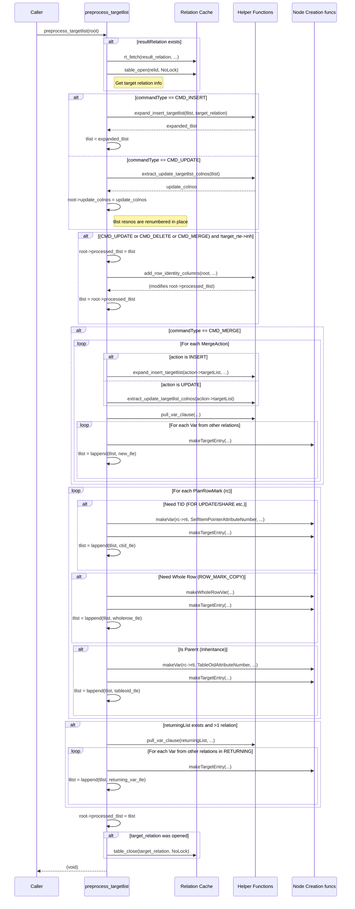

## AI辅助 PolarDB内核学习 - 36 优化器解析树预处理模块(prep) 核心代码 preptlist.c  
  
### 作者  
digoal  
  
### 日期  
2025-04-07  
  
### 标签  
PostgreSQL , PolarDB , DuckDB , AI , 内核 , 学习 , prep , 解析树 , 预处理  
  
----  
  
## 背景  
  
## 解读 优化器解析树预处理模块(prep) 核心代码 preptlist.c  
  
好的，我们来解读一下 PostgreSQL 的 `src/backend/optimizer/prep/preptlist.c` 这段代码。  
  
**代码作用概述**  
  
这段代码的核心作用是在查询优化的早期阶段，**预处理**查询语句的目标列表（Target List，简称 tlist）。目标列表可以理解为 SQL 查询中 `SELECT` 子句后面的表达式列表，或者是 `INSERT` 语句要插入的值，或者是 `UPDATE` 语句 `SET` 子句右侧的表达式。`preprocess_targetlist` 函数是这个过程的主要入口，它根据不同的命令类型（`INSERT`, `UPDATE`, `DELETE`, `MERGE`, `SELECT`）对原始的目标列表进行转换和增强，使其包含足够的信息供后续的**规划器（Planner）**和**执行器（Executor）**使用。主要工作包括：补全 `INSERT` 语句缺失的列、提取 `UPDATE` 语句要更新的列号、添加执行器定位或锁定行所必需的“隐形”列（Junk Columns），以及处理 `MERGE`、`RETURNING` 和 `FOR UPDATE/SHARE` 子句所需的额外列。  
  
**多角度解读**  
  
---  
  
**1. 数据库内核开发者角度**  
  
对于内核开发者来说，`preptlist.c` 是查询处理流水线中，从解析/重写阶段到规划阶段的一个重要桥梁。  
  
*   **输入与输出:** 函数 `preprocess_targetlist` 接收 `PlannerInfo *root` 作为输入，其中 `root->parse` 包含了经过解析器和重写器处理的查询树（`Query` 结构）。它的主要输出是修改 `root->processed_tlist`，生成一个增强版的目标列表，供后续规划阶段使用。对于 `UPDATE`，它还会填充 `root->update_colnos`。  
*   **核心逻辑与数据结构:**  
    *   **Target List (tlist):** 这是核心数据结构，一个 `List`，每个元素是 `TargetEntry` (TLE)。每个 TLE 包含一个表达式（`Expr`）、一个结果列号（`resno`）、列名（`resname`）和一个 `resjunk` 标志。`resjunk=true` 表示这个 TLE 是内部使用的“垃圾列”，不会返回给用户，但对执行过程至关重要。  
    *   **命令类型驱动:** 代码逻辑根据 `parse->commandType` (CMD\_INSERT, CMD\_UPDATE 等) 分支。  
    *   **`INSERT` 处理 (`expand_insert_targetlist`)**: 这是关键。`INSERT` 语句可能只指定了部分列，但执行器需要一个与表物理结构完全对应的元组。此函数遍历目标表的属性（`RelationGetNumberOfAttributes`, `TupleDescAttr`），如果 `INSERT` 语句的 tlist 中缺少某个列，它会创建一个新的 TLE，通常包含一个 `NULL` 常量 (`makeConst`)。特别注意处理已删除列（`att_tup->attisdropped`）和域约束（`coerce_to_domain`）。最终确保 `processed_tlist` 中的非 `resjunk` TLE 与表定义顺序一致。  
    *   **`UPDATE` 处理 (`extract_update_targetlist_colnos`)**: `UPDATE` 的原始 tlist 中，非 `resjunk` TLE 的 `resno` 指示的是要更新的目标表列号。此函数将这些列号提取到 `root->update_colnos` 列表中，然后将 `processed_tlist` 中所有 TLE 的 `resno` 重新编号为从 1 开始的连续序号。这样做简化了执行器处理，因为它不需要关心原始的目标列号，只需要按顺序处理 `processed_tlist` 即可。  
    *   **添加 Junk 列:** 这是另一个核心功能。  
        *   **行标识符 (`add_row_identity_columns`)**: 对于 `UPDATE`/`DELETE`/`MERGE`，执行器需要一种方法来唯一标识要修改或删除的行。通常会添加物理行 ID（如 `ctid` for Heap Tables）作为一个 `resjunk` TLE。注意，对于继承表，这个逻辑会推迟。  
        *   **`MERGE` 处理**: `MERGE` 更复杂，它有 `INSERT` 和 `UPDATE` 两种动作，需要分别处理它们的 tlist。此外，`WHEN` 条件和动作的 tlist 中引用的、非目标表的变量（`Var`）也需要作为 junk TLE 加入主 tlist，以便在连接操作后能获取到这些值。`pull_var_clause` 用于提取这些变量。  
        *   **行标记 (`PlanRowMark`)**: `SELECT FOR UPDATE/SHARE` 需要锁定行。`PlanRowMark` 结构记录了需要锁定的关系。代码会为每个需要锁定的关系（`rc->rti == rc->prti` 避免子表重复添加）添加必要的 junk 列：  
            *   `ctid`: 用于直接定位和锁定物理行（如果需要）。  
            *   `wholerow`: `makeWholeRowVar` 创建一个代表整行的 `Var`，用于 `EvalPlanQual` 检查（在并发更新场景下重新检查 `WHERE` 条件）或 `ROW_MARK_COPY`。  
            *   `tableoid`: 对于继承父表，需要 `tableoid` 来区分实际操作的是哪个子表。  
        *   **`RETURNING` 子句**: 如果 `RETURNING` 列表引用了来自*其他*表（非 `resultRelation`）的列，这些列也需要作为 junk TLE 添加到 `processed_tlist`，以便执行器能计算 `RETURNING` 的结果。  
*   **与其他模块交互:**  
    *   **解析器/重写器:** 提供输入 `Query` 树。`preptlist.c` 的工作依赖于重写器已经完成的一些语义层面的转换（如默认值替换）。注释提到，分工是历史性的，但大致上重写器处理 SQL 语义，`preptlist` 处理物理访问相关的准备。  
    *   **规划器:** 使用 `processed_tlist` 和 `update_colnos` 来生成执行计划（`Plan` 树）。  
    *   **执行器:** 最终使用 `processed_tlist` 来构建元组（`INSERT`）、确定更新哪些列（`UPDATE`）、定位行（`UPDATE`/`DELETE`）以及计算 `RETURNING` 值。  
*   **细节考量:**  
    *   **锁:** 打开 `target_relation` 时使用 `NoLock`，假设调用者已持有至少 `AccessShareLock`。  
    *   **内存管理:** 使用 `pstrdup`, `lappend`, `list_free` 等 PostgreSQL 的内存上下文管理函数。  
    *   **错误处理:** 使用 `elog(ERROR, ...)` 报告关键错误，如 `result relation` 类型不正确。  
  
---  
  
**2. 架构师角度**  
  
架构师关注的是模块在系统中的位置、职责划分以及对系统整体设计的影响。  
  
*   **查询处理管道中的位置:** `preptlist.c` 位于查询处理管道的关键位置，在 **解析 (Parsing)** 和 **重写 (Rewriting)** 之后，**规划 (Planning)** 之前。它扮演了承上启下的角色，将偏向逻辑表示的查询树（`Query`）进一步转化为更接近物理执行需求的结构。  
*   **职责边界:** 该模块清晰地承担了 **目标列表规范化和增强** 的职责。它封装了处理不同 DML 命令（`INSERT`/`UPDATE`/`DELETE`/`MERGE`）和特定子句（`RETURNING`, `FOR UPDATE/SHARE`）对目标列表特殊需求的逻辑。这使得后续的规划器可以基于一个更规整、信息更完备的目标列表来工作，简化了规划器的设计。  
*   **关注点分离:** 通过将目标列表的预处理逻辑集中在此处，实现了关注点分离。规划器可以更专注于路径选择、连接方法、代价估算等核心优化任务，而不需要过多地纠结于目标列表的细节格式问题。执行器也受益于此，因为它接收到的目标列表格式更加统一和明确。  
*   **可扩展性:** `MERGE` 命令的处理展示了该模块的可扩展性。当引入新的 SQL 特性或 DML 命令时，如果该特性对目标列表有特殊要求，可以在此模块中添加相应的处理逻辑。  
*   **性能影响:** 添加 Junk 列虽然增加了目标列表的长度和可能的数据传输量，但这是为了保证执行的正确性（如行标识、并发控制）所必需的开销。设计上需要权衡添加列的必要性和带来的潜在开销。  
  
**Sequence Diagram (简化展示 preprocess_targetlist 流程)**  
  

  
---  
  
**3. 用户 (应用开发者/DBA) 角度**  
  
虽然用户不直接与这段 C 代码交互，但其行为直接影响了 SQL 语句的执行方式和用户能观察到的现象。  
  
*   **`INSERT` 语句的行为:**  
    *   **列顺序和缺失列:** 当你写 `INSERT INTO mytable (col1, col3) VALUES (1, 'a');` 时，如果 `mytable` 还有 `col2` 和 `col4`，这段代码会确保最终插入的行包含所有四列。`col2` 和 `col4` 会被填充默认值（如果由重写器处理过）或者 `NULL`（如此代码中 `expand_insert_targetlist` 添加的部分）。这解释了为什么即使你没指定所有列，`INSERT` 也能工作，并且插入的行结构总是完整的。  
    *   **列的物理顺序:** `expand_insert_targetlist` 确保目标列表中的列严格按照表定义的物理顺序排列。虽然 SQL 标准不保证 `SELECT *` 的列顺序，但在 `INSERT` 的内部处理中，这个顺序是固定的，这对于执行器高效构建元组很重要。  
*   **`UPDATE` 语句的行为:**  
    *   **幕后的列号:** 当你写 `UPDATE mytable SET col3 = 'b', col1 = 2 WHERE id = 1;` 时，`extract_update_targetlist_colnos` 会记录下你要更新的是第 3 列和第 1 列（假设它们是表中的第 3 和第 1 个属性）。虽然你在 SQL 里写的顺序是 `col3, col1`，内部处理可能会按不同的顺序（这里是 1, 3 或其他取决于实现的顺序）存储这个信息 (`update_colnos`)，并重新编号 tlist。这对用户通常是透明的，但解释了为什么 `SET` 子句中的列顺序不影响结果。  
*   **Junk 列的影响 (间接):**  
    *   **`UPDATE`/`DELETE` 的效率:** 添加 `ctid` 作为 junk 列，使得执行器能够非常快速地定位到要修改或删除的物理行，尤其是在没有唯一索引或者 `WHERE` 条件复杂的情况下。这是 `UPDATE`/`DELETE` 高效执行的基础之一。用户虽然看不到 `ctid`，但能感受到其带来的性能优势。  
    *   **`SELECT FOR UPDATE/SHARE`:** 当你使用这些锁定时，代码添加的 `ctid`, `wholerow`, `tableoid` 等 junk 列是实现行锁和并发控制（如 `EvalPlanQual` 重新检查条件）所必需的。用户能观察到的是行被正确锁定，以及在高并发下数据一致性得到维护。  
    *   **`RETURNING` 子句:** 如果你的 `RETURNING` 子句引用了连接查询中非目标表的列，例如 `UPDATE t1 SET val = t2.val FROM t2 WHERE t1.id = t2.id RETURNING t1.*, t2.other_col;`，这段代码确保了 `t2.other_col` 的值能被传递到最后计算 `RETURNING` 结果的阶段。用户能方便地获取到更新操作影响的行的相关信息，包括来自其他表的信息。  
*   **`MERGE` 语句的复杂性:** `MERGE` 语句背后需要处理 `INSERT` 和 `UPDATE` 两种目标列表，并且 `WHEN` 条件可能引用来自源表的数据。这段代码的处理解释了为什么 `MERGE` 可能比简单的 `INSERT` 或 `UPDATE` 有更高的规划和执行开销，因为它涉及更复杂的目标列表和依赖关系管理。  
  
**关键内容深入解释**  
  
1.  **`expand_insert_targetlist` - 确保 INSERT 完整性**  
    *   **目的:** 执行器需要一个完整的元组映像来插入，包含表的所有列，按物理顺序排列。  
    *   **机制:** 遍历目标表的 `TupleDesc` (元组描述符)，逐个检查属性。将 `INSERT` 语句提供的 TLE 按 `resno` 与属性号匹配。如果找到匹配，则使用用户提供的 TLE。如果某个属性在用户 TLE 列表中缺失，则自动生成一个 TLE。  
    *   **默认值 vs NULL:** 如果列有默认值，通常由重写器（`rewriteTargetListIU`）提前处理插入。这里 `expand_insert_targetlist` 主要负责处理*完全未提及*的列，通常插入 `NULL`。它会创建一个 `Const` 节点代表 `NULL`，类型与列类型匹配。  
    *   **已删除列 (`attisdropped`):** 对于已删除的列，仍然会生成一个占位的 `NULL` TLE。注意这里它会使用一个通用的、保证存在的类型（如 `INT4OID`）来创建 `NULL` 常量，因为原始列类型可能已被删除。这确保了元组结构完整，即使某些列逻辑上已不存在。  
    *   **域约束:** 对非删除列生成的 `NULL` 值，会通过 `coerce_to_domain` 检查，这主要是为了捕获域上的 `NOT NULL` 约束。  
    *   **例子:**  
        ```sql  
        CREATE TABLE t (a int, b text, c boolean DEFAULT true, d int); -- d is dropped later  
        ALTER TABLE t DROP COLUMN d;  
        -- User writes:  
        INSERT INTO t (a) VALUES (1);  
        -- Original tlist might be like: TargetEntry(expr=Const(1), resno=1)  
        -- After expand_insert_targetlist, processed_tlist (simplified):  
        -- 1. TargetEntry(expr=Const(1), resno=1, resname='a', resjunk=false) -- From user  
        -- 2. TargetEntry(expr=Const(NULL, type=TEXTOID), resno=2, resname='b', resjunk=false) -- Added NULL for b  
        -- 3. TargetEntry(expr=Const(true, type=BOOLOID), resno=3, resname='c', resjunk=false) -- Default handled by rewriter (assuming)  
        -- 4. TargetEntry(expr=Const(NULL, type=INT4OID), resno=4, resname='d', resjunk=false) -- Added NULL for dropped d  
        -- Note: Junk columns would be appended after these.  
        ```  
  
2.  **Junk Columns - 执行器的隐形助手**  
    *   **为什么需要?** 规划器和执行器在处理过程中，原始 SQL 查询的上下文信息可能丢失或不方便直接访问。执行计划的节点（如 Update, Delete, LockRows）需要特定的信息来完成任务。Junk 列就是将这些必需信息（如行的物理位置 `ctid`、用于并发检查的整行 `wholerow`、区分继承子表的 `tableoid`、`RETURNING` 子句需要的外部变量等）打包到数据流中传递下去的方式。  
    *   **`ctid` (SelfItemPointerAttributeNumber):** 最常见的 junk 列之一。对于堆表，`ctid` 是指向行物理位置的指针（页号 + 项号）。`UPDATE` 和 `DELETE` 节点可以直接使用 `ctid` 找到要操作的行，非常高效。  
    *   **`wholerow` (Whole-row Var):** `makeWholeRowVar` 创建一个特殊的 `Var` 节点，代表整行数据。这主要用于：  
        *   **EvalPlanQual (EPQ):** 在读已提交（Read Committed）隔离级别下，如果一个 `SELECT FOR UPDATE` 或 `UPDATE`/`DELETE` 语句的 `WHERE` 条件在初始扫描和实际更新/锁定之间可能因为并发更新而失效，执行器需要重新检查条件。`wholerow` 提供了重新检查所需的行的完整数据。  
        *   **`ROW_MARK_COPY`:** `COPY FREEZE` 等场景可能需要原始行的映像。  
    *   **`tableoid` (TableOidAttributeNumber):** 在处理继承表时，`UPDATE`/`DELETE` 或 `SELECT FOR UPDATE` 作用于父表，但实际操作可能发生在子表上。执行器需要知道当前处理的行具体来自哪个表（子表或父表自身），`tableoid` 系统列就提供了这个 OID 信息。因此，在涉及继承的行标记（`rc->isParent`）时会添加它。  
    *   **`RETURNING` 和 `MERGE` 中的外部变量:** 当这些子句需要引用来自查询中其他表的值时，这些值必须通过数据流传递到执行相应操作的节点。将这些外部 `Var` 添加为 junk TLE 是实现这一点的标准方法。  
    *   **命名和编号:** Junk TLE 的 `resjunk` 标志为 `true`，通常会有一个内部生成的名字（如 "ctid%u"），并且它们的 `resno` 会排在所有非 junk 列之后。  
  
3.  **`extract_update_targetlist_colnos` 和 `resno` 重编号**  
    *   **`UPDATE` 的特殊性:** 与 `SELECT` 和 `INSERT` 不同，`UPDATE` 的原始 tlist 的 `resno` 有特殊含义：它直接指明要更新目标表的第几个属性（attribute number）。  
    *   **解耦:** `extract_update_targetlist_colnos` 将这个“目标属性号”信息提取到一个单独的列表 (`root->update_colnos`) 中。  
    *   **规范化:** 提取后，它会将 tlist 中所有 TLE（包括 junk 和 non-junk）的 `resno` 重新设置为从 1 开始的连续整数。  
    *   **好处:** 这种分离和规范化对后续处理非常有利：  
        *   **规划器:** 不需要关心 tlist 中 `resno` 的特殊含义，可以像处理 `SELECT` 一样处理 tlist。  
        *   **执行器:** `Update` 执行节点只需要查看 `update_colnos` 列表就知道要更新哪些目标列，然后按顺序处理 `processed_tlist` 中的表达式来获取新值。执行器的逻辑更简单、统一。  
    *   **例子:**  
        ```sql  
        CREATE TABLE t (id int, val text, mod_time timestamp);  
        -- User writes:  
        UPDATE t SET mod_time = now(), val = 'new' WHERE id = 1;  
        -- Original tlist (simplified, assuming id=1, val=2, mod_time=3):  
        -- 1. TargetEntry(expr=now(), resno=3, resjunk=false)  
        -- 2. TargetEntry(expr='new', resno=2, resjunk=false)  
        -- (Maybe some junk columns added by rewriter, e.g., id for WHERE clause if needed later)  
        -- After extract_update_targetlist_colnos:  
        -- root->update_colnos = List(3, 2)  
        -- processed_tlist (simplified, after renumbering and potentially adding ctid junk):  
        -- 1. TargetEntry(expr=now(), resno=1, resjunk=false)  <- Renumbered  
        -- 2. TargetEntry(expr='new', resno=2, resjunk=false)  <- Renumbered  
        -- 3. TargetEntry(expr=ctid_var, resno=3, resname='ctid', resjunk=true) <- Added junk  
        ```  
  
通过这些转换和增强，`preptlist.c` 确保了目标列表包含了所有必要的信息，并且格式统一，为后续高效、正确的查询规划和执行奠定了基础。  
  
## 提示  
```  
解读下面的代码. 先用几句话阐述代码作用, 然后从数据库内核开发者、架构师、用户(应用开发者和DBA)多个角度通熟易懂的解读这个代码, 使用sequence、mermaid图表以及恰当的例子提升代码可读性. 关键内容务必要深入重点详细解释.  
$代码内容  
```  
  
## PolarDB & PostgreSQL 15 差异  
```  
git diff -u 50d3d22baba63613d1f1406b2ed460dc9b03c3fc f5e7493819e370d30ac2047c68c21c9fb03ce4a0 -- src/backend/optimizer/prep/preptlist.c  
```  
  
差异分析待补充.  
  
<b> 以上内容基于DeepSeek、QwQ及诸多AI生成, 轻微人工调整, 感谢杭州深度求索人工智能、阿里云等公司. </b>  
  
<b> AI 生成的内容请自行辨别正确性, 当然也多了些许踩坑的乐趣, 毕竟冒险是每个男人的天性.  </b>  
  
  
  
#### [期望 PostgreSQL|开源PolarDB 增加什么功能?](https://github.com/digoal/blog/issues/76 "269ac3d1c492e938c0191101c7238216")
  
  
#### [PolarDB 开源数据库](https://openpolardb.com/home "57258f76c37864c6e6d23383d05714ea")
  
  
#### [PolarDB 学习图谱](https://www.aliyun.com/database/openpolardb/activity "8642f60e04ed0c814bf9cb9677976bd4")
  
  
#### [PostgreSQL 解决方案集合](../201706/20170601_02.md "40cff096e9ed7122c512b35d8561d9c8")
  
  
#### [德哥 / digoal's Github - 公益是一辈子的事.](https://github.com/digoal/blog/blob/master/README.md "22709685feb7cab07d30f30387f0a9ae")
  
  
#### [About 德哥](https://github.com/digoal/blog/blob/master/me/readme.md "a37735981e7704886ffd590565582dd0")
  
  

  
