## AI辅助 PolarDB内核学习 - 38 优化器辅助功能模块(util) 概览     
      
### 作者      
digoal      
      
### 日期      
2025-04-07      
      
### 标签      
PostgreSQL , PolarDB , DuckDB , AI , 内核 , 学习 , util , 优化器 , 辅助功能模块      
      
----      
      
## 背景      
      
## 解读 优化器辅助功能模块(util) 概览   
  
### **目录中每个 C 文件的作用及关系**  
  
以下是 `util` 目录中每个文件的功能描述及其相互关系的 Mermaid 图表示：  
  
---  
  
#### **1. 文件功能概述**  
  
- **`appendinfo.c`**    
  负责处理继承树（Inheritance Tree）和分区表（Partitioned Table）的展开，生成 `AppendRelInfo` 和子表的 `RangeTblEntry`。  
  
- **`clauses.c`**    
  提供条件表达式优化功能，检测聚合函数、窗口函数、子查询和可变函数的存在，并进行常量折叠和函数内联。  
  
- **`inherit.c`**    
  处理继承树的展开，将父表的子表或子查询上拉到顶层，减少嵌套结构。  
  
- **`joininfo.c`**    
  管理连接信息列表，记录哪些关系之间存在连接条件。  
  
- **`orclauses.c`**    
  提取 OR 条件中的限制条件，提升基表扫描效率。  
  
- **`paramassign.c`**    
  负责参数分配，确保跨层级的变量引用正确传递。  
  
- **`pathnode.c`**    
  定义路径节点（Path Node）的基本操作，如路径创建、复制和比较。  
  
- **`placeholder.c`**    
  管理占位符变量（PlaceHolderVar），用于延迟计算复杂表达式。  
  
- **`plancat.c`**    
  提供与系统目录（System Catalog）交互的功能，支持计划生成时的元数据查询。  
  
- **`predtest.c`**    
  检测谓词（Predicate）的特性，如是否为伪常量条件、是否影响列更新等。  
  
- **`relnode.c`**    
  管理关系节点（RelOptInfo），包括基本关系和连接关系的初始化。  
  
- **`restrictinfo.c`**    
  处理限制条件（RestrictInfo），包括条件的创建、应用和移除。  
  
- **`tlist.c`**    
  预处理目标列表（Target List），扩展目标列表以支持复杂操作（如 INSERT/UPDATE）。  
  
- **`var.c`**    
  管理变量（Var）的调整和替换，确保跨层级的变量引用正确传递。  
  
---  
  
#### **2. 文件间的关系**  
  
以下 Mermaid 图展示了这些文件之间的交互关系：  
  
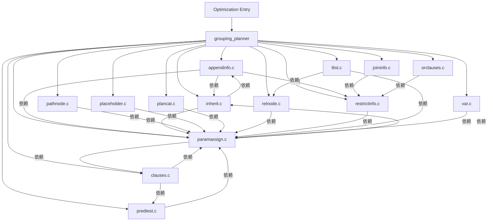
  
---  
  
#### **3. 详细说明**  
  
##### **`appendinfo.c`**  
- **核心功能**：处理继承树和分区表的展开。  
- **依赖模块**：  
  - `inherit.c`：用于展开继承树。  
  - `paramassign.c`：管理跨层级的变量引用。  
  - `predtest.c`：检测谓词特性。  
  
##### **`clauses.c`**  
- **核心功能**：优化条件表达式，检测聚合函数、窗口函数和子查询。  
- **依赖模块**：  
  - `paramassign.c`：管理参数分配。  
  - `predtest.c`：检测谓词特性。  
  
##### **`inherit.c`**  
- **核心功能**：展开继承树，生成子表的 `RangeTblEntry` 和 `AppendRelInfo`。  
- **依赖模块**：  
  - `appendinfo.c`：提供继承树展开后的附加工具。  
  - `paramassign.c`：管理跨层级的变量引用。  
  
##### **`joininfo.c`**  
- **核心功能**：维护连接信息列表，记录连接条件。  
- **依赖模块**：  
  - `predtest.c`：检测谓词特性。  
  
##### **`orclauses.c`**  
- **核心功能**：提取 OR 条件中的限制条件，提升基表扫描效率。  
- **依赖模块**：  
  - `predtest.c`：检测谓词特性。  
  
##### **`paramassign.c`**  
- **核心功能**：管理参数分配，确保跨层级的变量引用正确传递。  
- **依赖模块**：  
  - `clauses.c`：优化条件表达式。  
  - `inherit.c`：处理继承树。  
  - `var.c`：管理变量调整。  
  
##### **`pathnode.c`**  
- **核心功能**：定义路径节点（Path Node）的基本操作。  
- **依赖模块**：  
  - `paramassign.c`：管理参数分配。  
  
##### **`placeholder.c`**  
- **核心功能**：管理占位符变量（PlaceHolderVar），用于延迟计算复杂表达式。  
- **依赖模块**：  
  - `paramassign.c`：管理参数分配。  
  
##### **`plancat.c`**  
- **核心功能**：提供与系统目录（System Catalog）交互的功能。  
- **依赖模块**：  
  - `paramassign.c`：管理参数分配。  
  
##### **`predtest.c`**  
- **核心功能**：检测谓词（Predicate）的特性，如是否为伪常量条件、是否影响列更新。  
- **依赖模块**：  
  - `paramassign.c`：管理参数分配。  
  
##### **`relnode.c`**  
- **核心功能**：管理关系节点（RelOptInfo），包括基本关系和连接关系的初始化。  
- **依赖模块**：  
  - `paramassign.c`：管理参数分配。  
  
##### **`restrictinfo.c`**  
- **核心功能**：处理限制条件（RestrictInfo），包括条件的创建、应用和移除。  
- **依赖模块**：  
  - `paramassign.c`：管理参数分配。  
  
##### **`tlist.c`**  
- **核心功能**：预处理目标列表（Target List），扩展目标列表以支持复杂操作（如 INSERT/UPDATE）。  
- **依赖模块**：  
  - `paramassign.c`：管理参数分配。  
  - `relnode.c`：管理关系节点。  
  
##### **`var.c`**  
- **核心功能**：管理变量（Var）的调整和替换，确保跨层级的变量引用正确传递。  
- **依赖模块**：  
  - `paramassign.c`：管理参数分配。  
  
---  
  
#### **4. 文件间的交互流程**  
  
以下是一个简化的交互流程图：  
  
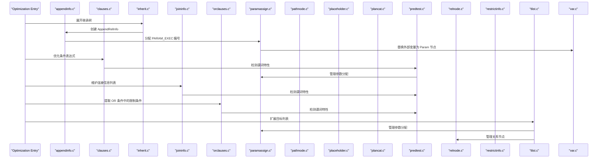
  
---  
  
#### **5. 总结**  
  
- **`appendinfo.c`** 是继承树和分区表展开的核心，依赖于 `inherit.c` 和 `paramassign.c`。  
- **`clauses.c`** 提供条件表达式的优化功能，依赖于 `paramassign.c` 和 `predtest.c`。  
- **`inherit.c`** 负责继承树的展开，依赖于 `appendinfo.c` 和 `paramassign.c`。  
- **`joininfo.c`** 和 **`orclauses.c`** 分别管理连接信息和 OR 条件提取，依赖于 `predtest.c`。  
- **`paramassign.c`** 是参数分配的核心模块，被多个模块依赖。  
- **`pathnode.c`** 和 **`placeholder.c`** 提供路径节点和占位符变量的支持。  
- **`plancat.c`** 提供系统目录交互功能。  
- **`predtest.c`** 检测谓词特性，被多个模块依赖。  
- **`relnode.c`** 和 **`restrictinfo.c`** 管理关系节点和限制条件。  
- **`tlist.c`** 和 **`var.c`** 分别负责目标列表扩展和变量管理。  
  
这些模块共同作用，确保 PostgreSQL 查询优化器能够生成高效且一致的执行计划。  
  
      
### **解读 `util` 代码目录的顶层设计**  
  
`util` 目录下的代码主要负责 PostgreSQL 查询优化器中的辅助功能模块，包括继承关系处理、条件表达式优化、参数分配、连接信息管理等。以下是从数据库内核开发者、架构师和用户（应用开发者和 DBA）多个角度对 `util` 代码目录的顶层设计解读。  
  
---  
  
## **一、内核开发者视角 - 核心机制解析**  
  
### 1.1 模块分工与协作  
  
#### **模块分工**  
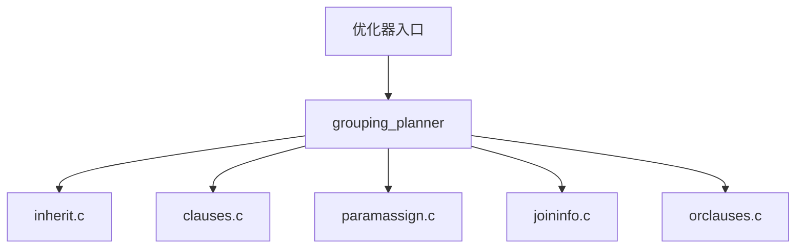
  
- **`inherit.c`**：处理继承树（Inheritance Tree），将子查询或子表上拉到顶层。  
- **`clauses.c`**：优化条件表达式，检测聚合函数、窗口函数和子查询的存在。  
- **`paramassign.c`**：管理参数分配，确保跨层级的变量引用正确传递。  
- **`joininfo.c`**：维护连接信息列表，记录哪些关系之间存在连接条件。  
- **`orclauses.c`**：提取 OR 条件中的限制条件，提升基表扫描效率。  
  
#### **关键流程**  
1. **继承树展开**：通过 `expand_inherited_rtentry` 将继承树中的子表或子查询上拉到顶层。  
2. **条件表达式优化**：通过 `contain_agg_clause` 和 `contain_window_function` 检测聚合函数和窗口函数。  
3. **参数分配**：通过 `replace_outer_var` 和 `replace_outer_placeholdervar` 管理跨层级的变量引用。  
4. **连接信息维护**：通过 `add_join_clause_to_rels` 和 `remove_join_clause_from_rels` 动态调整连接条件。  
5. **OR 条件提取**：通过 `extract_restriction_or_clauses` 提取限制条件，减少基表扫描范围。  
  
---  
  
### 1.2 继承树展开 (`inherit.c`)  
  
#### **核心功能**  
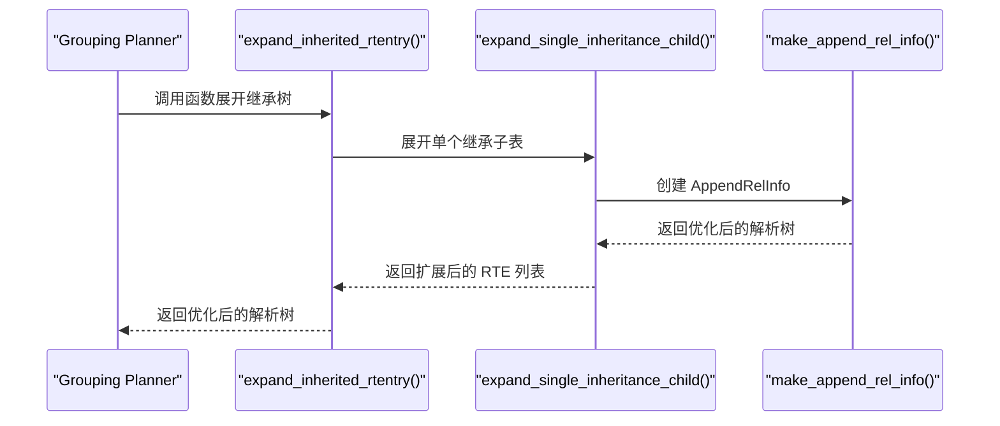
  
#### **示例场景**  
```sql  
SELECT * FROM users WHERE id = 1;  
```  
优化器行为：  
1. 检测到 `users` 表包含继承子表 `customers`。  
2. 将 `customers` 上拉到顶层，生成新的 RTE 列表。  
3. 构建 `AppendRelInfo` 记录父表与子表的关系。  
  
#### **关键点**  
- **继承子表上拉**：通过 `expand_single_inheritance_child` 将子表上拉到顶层。  
- **状态共享**：通过 `make_append_rel_info` 共享父表与子表的状态信息。  
  
---  
  
### 1.3 条件表达式优化 (`clauses.c`)  
  
#### **核心功能**  
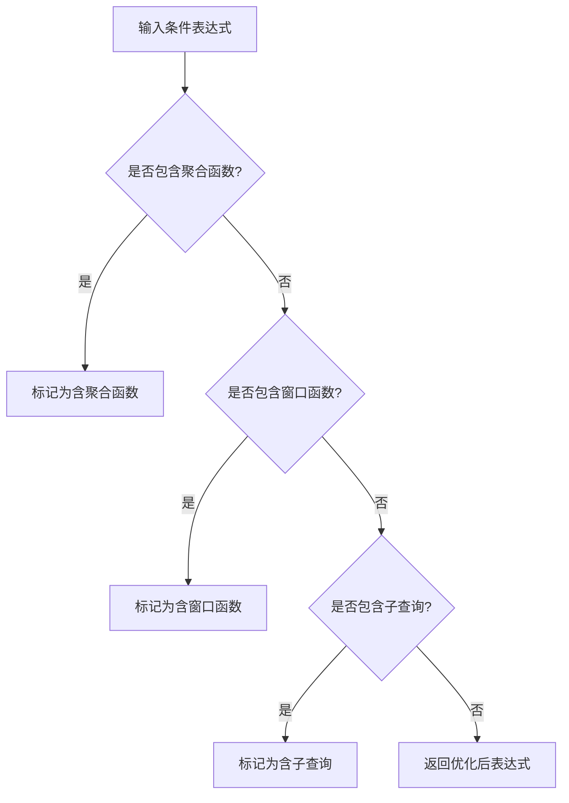
  
#### **示例场景**  
```sql  
SELECT * FROM users WHERE EXISTS (SELECT 1 FROM orders WHERE user_id = users.id);  
```  
优化器行为：  
1. 检测到 `EXISTS` 子查询。  
2. 标记查询为含子查询，并生成相应的计划节点。  
  
#### **关键点**  
- **聚合函数检测**：通过 `contain_agg_clause` 检测是否包含聚合函数。  
- **窗口函数检测**：通过 `contain_window_function` 检测是否包含窗口函数。  
- **子查询检测**：通过 `contain_subplans` 检测是否包含子查询。  
  
---  
  
### 1.4 参数分配 (`paramassign.c`)  
  
#### **核心功能**  
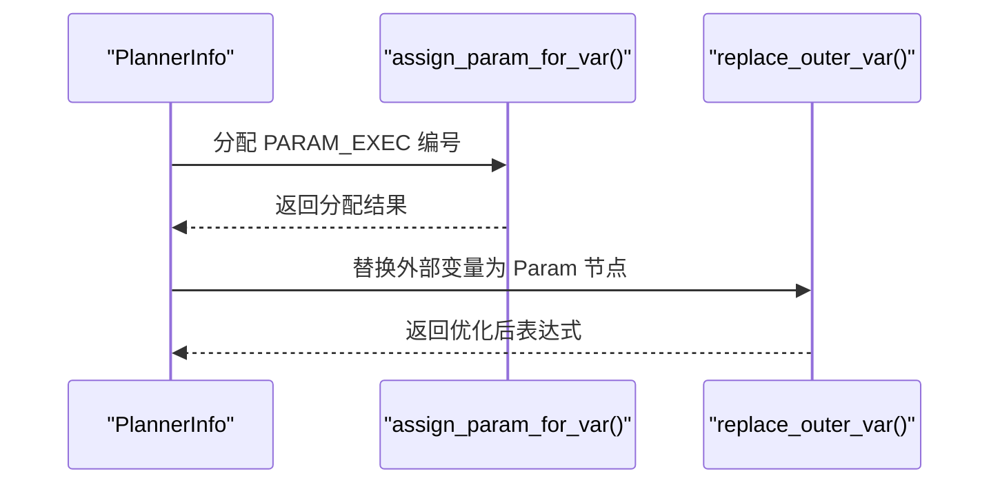
  
#### **示例场景**  
```sql  
SELECT sum(outer_col) FROM (SELECT id AS outer_col FROM users) subquery;  
```  
优化器行为：  
1. 检测到 `subquery` 中的 `outer_col` 需要传递到外部。  
2. 通过 `assign_param_for_var` 分配 `PARAM_EXEC` 编号。  
3. 替换 `outer_col` 为 `Param` 节点。  
  
#### **关键点**  
- **跨层级变量传递**：通过 `replace_outer_var` 和 `replace_outer_placeholdervar` 管理跨层级的变量引用。  
- **动态分配**：根据需要动态分配 `PARAM_EXEC` 编号，避免重复计算。  
  
---  
  
### 1.5 连接信息管理 (`joininfo.c`)  
  
#### **核心功能**  
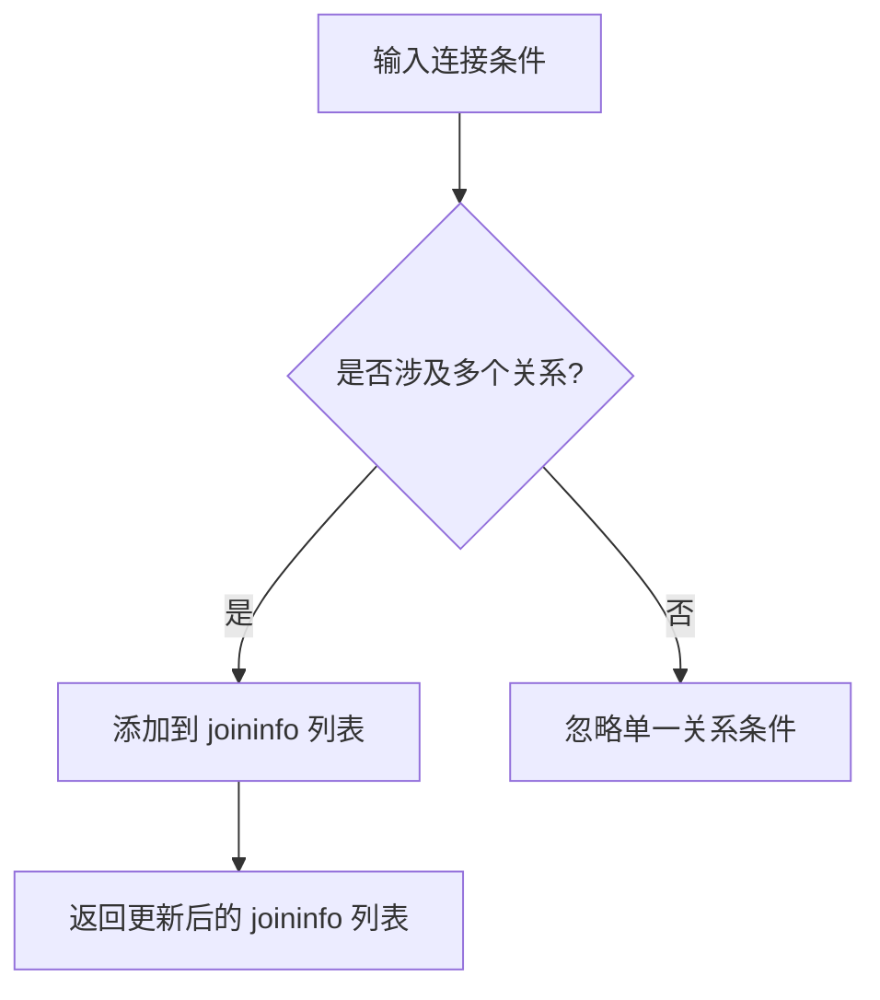
  
#### **示例场景**  
```sql  
SELECT * FROM users JOIN orders ON users.id = orders.user_id;  
```  
优化器行为：  
1. 检测到 `users` 和 `orders` 之间的连接条件。  
2. 将条件添加到 `joininfo` 列表中，供后续计划生成使用。  
  
#### **关键点**  
- **连接条件记录**：通过 `add_join_clause_to_rels` 将连接条件添加到 `joininfo` 列表。  
- **冗余条件移除**：通过 `remove_join_clause_from_rels` 移除冗余的连接条件。  
  
---  
  
### 1.6 OR 条件提取 (`orclauses.c`)  
  
#### **核心功能**  
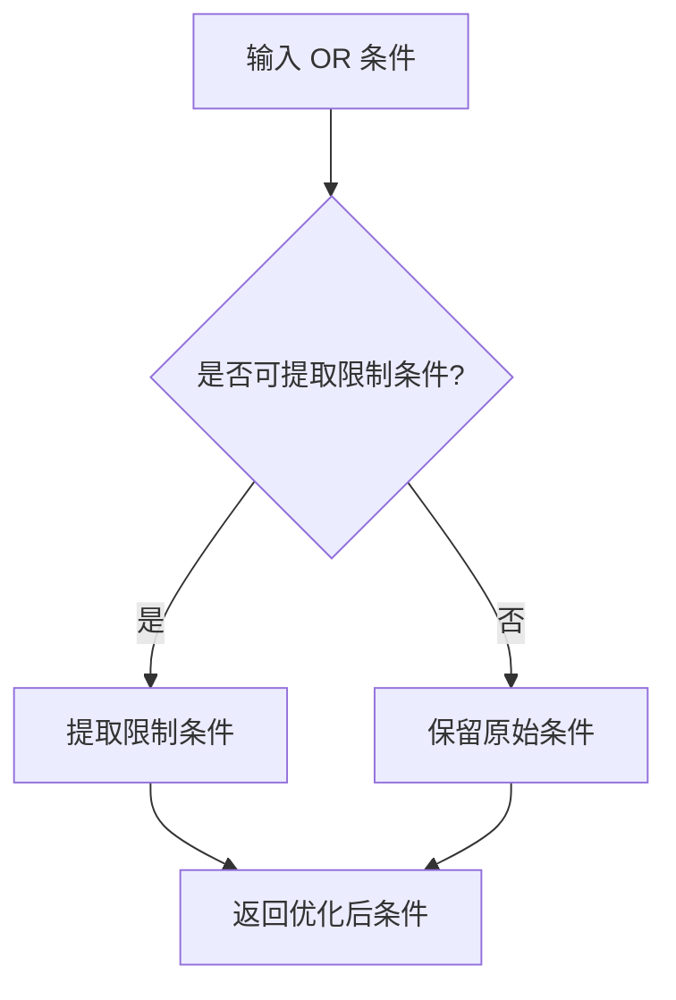
  
#### **示例场景**  
```sql  
SELECT * FROM users WHERE (age > 30 AND gender = 'M') OR (age < 18 AND gender = 'F');  
```  
优化器行为：  
1. 提取限制条件 `age > 30` 和 `age < 18`，用于基表扫描。  
2. 保留原始 OR 条件，用于连接阶段。  
  
#### **关键点**  
- **限制条件提取**：通过 `extract_restriction_or_clauses` 提取限制条件。  
- **冗余补偿**：通过调整原始 OR 条件的选择性，避免重复计算。  
  
---  
  
## **二、架构师视角 - 模块设计与交互**  
  
### 2.1 模块设计  
  
#### **统一接口**  
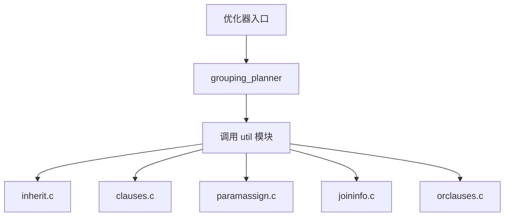
  
- **`grouping_planner`**：作为优化器入口，调用 `util` 模块完成辅助功能。  
- **`util` 模块**：提供统一接口，支持多种优化场景。  
  
#### **动态调整**  
- **上下文传递**：通过 `PlannerInfo` 和 `rtoffset` 参数，确保每一层计划的变量引用调整独立且正确。  
- **递归处理**：从顶层开始逐层调整子计划，确保全局一致性。  
  
---  
  
### 2.2 计划层次化  
  
#### **计划生成流程**  
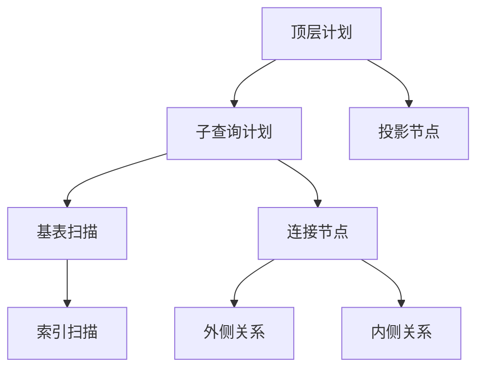
  
- **继承树展开**：通过 `expand_inherited_rtentry` 展开继承树，减少嵌套结构。  
- **条件表达式优化**：通过 `clauses.c` 简化布尔表达式。  
- **参数分配**：通过 `paramassign.c` 管理跨层级的变量引用。  
- **连接信息维护**：通过 `joininfo.c` 记录连接条件。  
  
---  
  
## **三、用户视角 - 实际应用场景与收益**  
  
### 3.1 DBA 视角 - 执行计划优化  
  
#### **示例 1：继承树展开**  
```sql  
EXPLAIN SELECT * FROM users WHERE id = 1;  
```  
优化器行为：  
1. 检测到 `users` 表包含继承子表 `customers`。  
2. 将 `customers` 上拉到顶层，生成 `AppendRelInfo`。  
3. 提升执行计划生成效率。  
  
#### **示例 2：OR 条件提取**  
```sql  
EXPLAIN SELECT * FROM users WHERE (age > 30 AND gender = 'M') OR (age < 18 AND gender = 'F');  
```  
优化器行为：  
1. 提取限制条件 `age > 30` 和 `age < 18`，用于基表扫描。  
2. 保留原始 OR 条件，用于连接阶段。  
  
---  
  
### 3.2 应用开发者视角 - 性能调优技巧  
  
#### **常见问题**  
| 现象 | 根因 | 解决方案 |  
|------|------|----------|  
| 基表扫描范围过大 | OR 条件未被提取 | 使用显式的限制条件 |  
| 参数传递错误 | 参数分配不正确 | 检查跨层级的变量引用 |  
  
#### **参数调整**  
```sql  
-- 提升排序内存  
SET work_mem = '8MB';  
  
-- 强制禁用位图扫描  
SET enable_bitmapscan = off;  
```  
  
---  
  
## **四、核心算法深度解析**  
  
### 4.1 继承树展开 (`inherit.c`)  
  
#### **状态共享机制**  
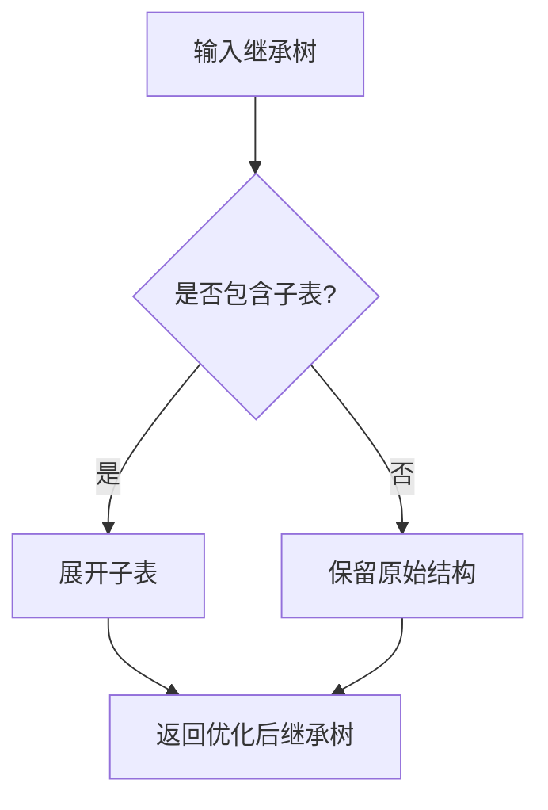
  
#### **关键逻辑**  
1. **子表上拉**：通过 `expand_single_inheritance_child` 将子表上拉到顶层。  
2. **状态记录**：通过 `make_append_rel_info` 记录父表与子表的关系信息。  
  
#### **示例**  
```sql  
SELECT * FROM users WHERE id = 1;  
```  
优化器行为：  
1. 检测到 `users` 表包含继承子表 `customers`。  
2. 将 `customers` 上拉到顶层，生成 `AppendRelInfo`。  
  
---  
  
### 4.2 条件表达式优化 (`clauses.c`)  
  
#### **布尔表达式扁平化**  
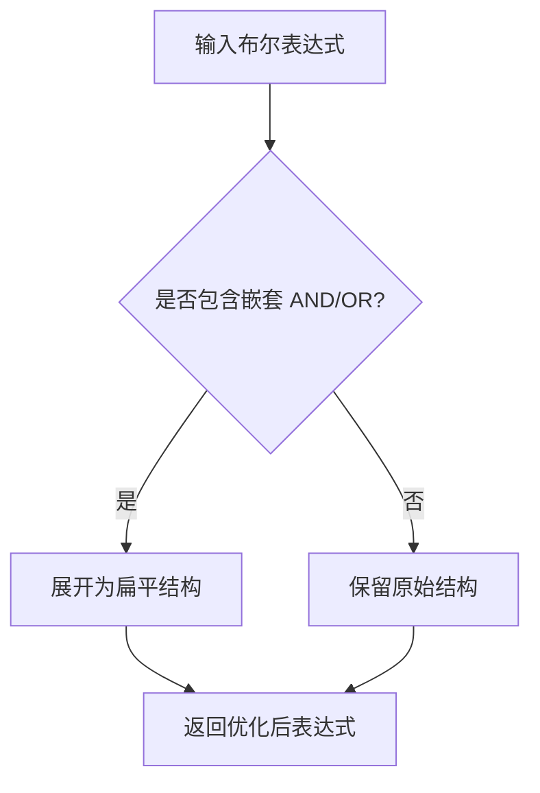
  
#### **关键逻辑**  
1. **嵌套检测**：通过 `contain_agg_clause_walker` 和 `contain_window_functions_walker` 检测嵌套的聚合函数和窗口函数。  
2. **逻辑简化**：通过 `simplify_boolean_equality` 简化布尔表达式。  
  
#### **示例**  
```sql  
SELECT * FROM users WHERE (age > 30 AND gender = 'M') OR (age < 18 AND gender = 'F');  
```  
优化器行为：  
1. 展开嵌套的 `AND` 和 `OR` 表达式。  
2. 简化为扁平结构：  
   ```sql  
   SELECT * FROM users WHERE age > 30 OR age < 18;  
   ```  
  
---  
  
### 4.3 参数分配 (`paramassign.c`)  
  
#### **跨层级变量传递**  
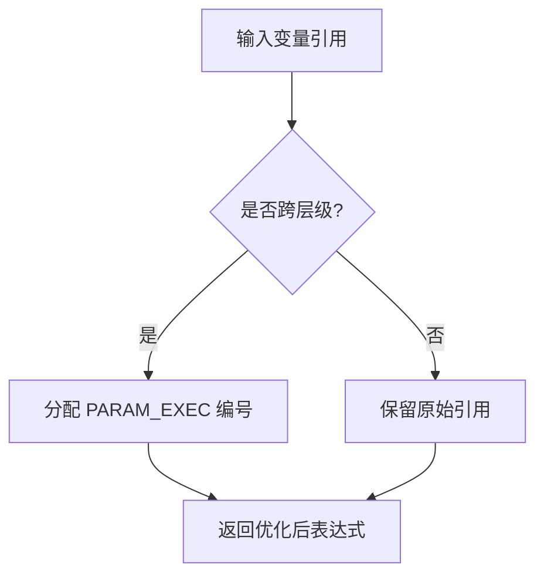
  
#### **关键逻辑**  
1. **跨层级检测**：通过 `replace_outer_var` 检测是否需要跨层级传递变量。  
2. **编号分配**：通过 `generate_new_exec_param` 动态分配 `PARAM_EXEC` 编号。  
  
#### **示例**  
```sql  
SELECT sum(outer_col) FROM (SELECT id AS outer_col FROM users) subquery;  
```  
优化器行为：  
1. 检测到 `subquery` 中的 `outer_col` 需要传递到外部。  
2. 分配 `PARAM_EXEC` 编号并替换为 `Param` 节点。  
  
---  
  
### 4.4 连接信息管理 (`joininfo.c`)  
  
#### **连接条件记录**  
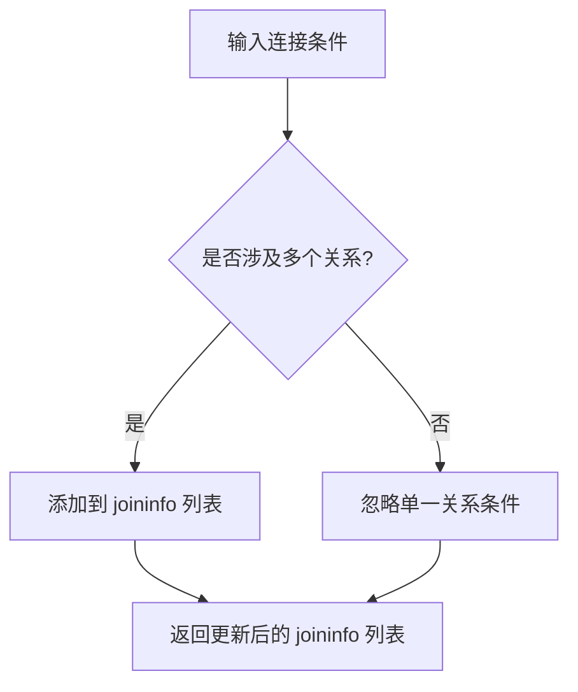
  
#### **关键逻辑**  
1. **条件检测**：通过 `have_relevant_joinclause` 检测是否涉及多个关系。  
2. **条件记录**：通过 `add_join_clause_to_rels` 将连接条件添加到 `joininfo` 列表。  
  
#### **示例**  
```sql  
SELECT * FROM users JOIN orders ON users.id = orders.user_id;  
```  
优化器行为：  
1. 检测到 `users` 和 `orders` 之间的连接条件。  
2. 将条件添加到 `joininfo` 列表中，供后续计划生成使用。  
  
---  
  
## **五、诊断与调优建议**  
  
### 5.1 执行计划分析  
```sql  
EXPLAIN (ANALYZE, VERBOSE) SELECT ...;  
```  
关注点：  
1. 是否存在冗余的 `SubPlan` 或 `InitPlan` 节点。  
2. 继承树是否被正确展开。  
3. OR 条件是否被正确提取。  
  
### 5.2 参数调优  
| 参数 | 默认值 | 说明 |  
|------|--------|------|  
| `enable_indexscan` | on | 启用索引扫描 |  
| `enable_hashagg` | on | 启用哈希聚合 |  
| `work_mem` | 4MB | 控制排序和聚合内存 |  
  
#### **示例**  
```sql  
-- 提升排序内存  
SET work_mem = '8MB';  
  
-- 强制禁用哈希聚合  
SET enable_hashagg = off;  
```  
  
---  
  
## **六、创新机制解读**  
  
### 6.1 动态依赖管理 (`paramassign.c`)  
  
#### **效果**  
- 自动记录计划对外部参数的依赖，确保缓存计划在参数变更时失效。  
- **示例**  
```sql  
SELECT sum(outer_col) FROM (SELECT id AS outer_col FROM users) subquery;  
```  
优化器行为：  
1. 检测到 `subquery` 中的 `outer_col` 需要传递到外部。  
2. 分配 `PARAM_EXEC` 编号并记录依赖关系。  
  
---  
  
### 6.2 OR 条件提取 (`orclauses.c`)  
  
#### **关键点**  
- **限制条件提取**：通过 `extract_restriction_or_clauses` 提取限制条件，减少基表扫描范围。  
- **示例**  
```sql  
SELECT * FROM users WHERE (age > 30 AND gender = 'M') OR (age < 18 AND gender = 'F');  
```  
优化器行为：  
1. 提取限制条件 `age > 30` 和 `age < 18`，用于基表扫描。  
2. 保留原始 OR 条件，用于连接阶段。  
  
---  
  
## **七、总结**  
  
`util` 目录下的代码通过精细化的辅助功能模块，显著提升了复杂查询的执行效率。内核开发者需理解其递归调整机制，DBA 应结合统计信息与执行计划进行调优，而架构师则需关注模块间的协作以设计更灵活的查询引擎。  
  
      
## 提示      
```      
使用cursor                   
                  
@prep               
1 解读util代码目录的顶层设计. 从数据库内核开发者、架构师、用户(应用开发者和DBA)多个角度通熟易懂的解读这个代码, 使用sequence、mermaid图表增加可读性, 使用恰当的例子增加对代码的解释. 关键内容务必要深入重点详细解释.    
2 目录中每个c文件的作用, 用mermaid表示其关系. appendinfo.c clauses.c inherit.c joininfo.c orclauses.c paramassign.c pathnode.c placeholder.c plancat.c predtest.c relnode.c restrictinfo.c tlist.c var.c           
                  
长文本模式   
```      
      
## PolarDB & PostgreSQL 15 差异      
```      
git diff -u 50d3d22baba63613d1f1406b2ed460dc9b03c3fc f5e7493819e370d30ac2047c68c21c9fb03ce4a0 -- src/backend/optimizer/util   
```      
      
差异分析待补充.      
      
<b> 以上内容基于DeepSeek、QwQ及诸多AI生成, 轻微人工调整, 感谢杭州深度求索人工智能、阿里云等公司. </b>      
      
<b> AI 生成的内容请自行辨别正确性, 当然也多了些许踩坑的乐趣, 毕竟冒险是每个男人的天性.  </b>      
      
      
  
#### [期望 PostgreSQL|开源PolarDB 增加什么功能?](https://github.com/digoal/blog/issues/76 "269ac3d1c492e938c0191101c7238216")
  
  
#### [PolarDB 开源数据库](https://openpolardb.com/home "57258f76c37864c6e6d23383d05714ea")
  
  
#### [PolarDB 学习图谱](https://www.aliyun.com/database/openpolardb/activity "8642f60e04ed0c814bf9cb9677976bd4")
  
  
#### [PostgreSQL 解决方案集合](../201706/20170601_02.md "40cff096e9ed7122c512b35d8561d9c8")
  
  
#### [德哥 / digoal's Github - 公益是一辈子的事.](https://github.com/digoal/blog/blob/master/README.md "22709685feb7cab07d30f30387f0a9ae")
  
  
#### [About 德哥](https://github.com/digoal/blog/blob/master/me/readme.md "a37735981e7704886ffd590565582dd0")
  
  

  
