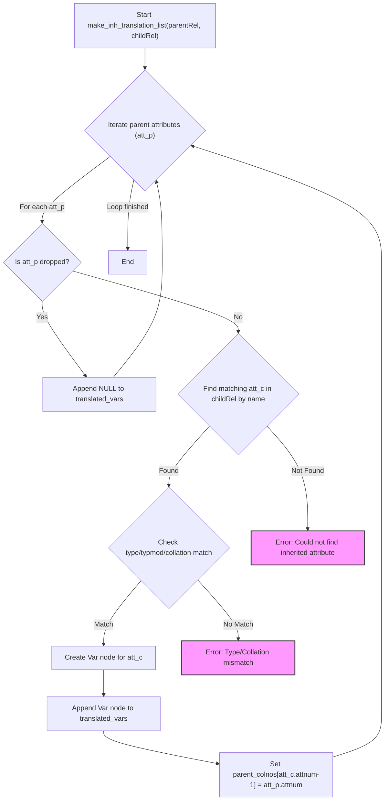
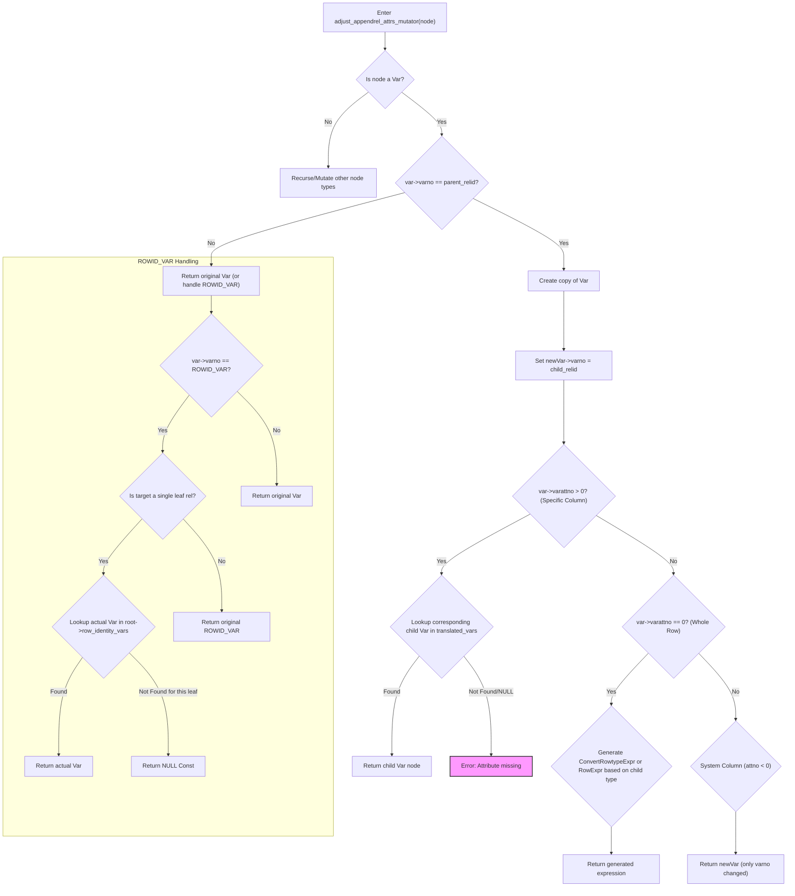

## AI辅助 PolarDB内核学习 - 39 优化器辅助功能模块(util) 核心代码 appendinfo.c      
        
### 作者        
digoal        
        
### 日期        
2025-04-07        
        
### 标签        
PostgreSQL , PolarDB , DuckDB , AI , 内核 , 学习 , util , 优化器 , 辅助功能模块        
        
----        
        
## 背景        
        
## 解读 优化器辅助功能模块(util) 核心代码 appendinfo.c   
    
好的, 我们来解读一下 PostgreSQL 的 `src/backend/optimizer/util/appendinfo.c` 文件中的代码.  
  
**代码作用概述**  
  
这段代码的核心作用是 **处理查询优化过程中涉及继承(inheritance)和分区(partitioning)表的父子关系映射**. 当一个查询涉及到父表时, 优化器需要知道如何将针对父表的操作 (例如查询条件、目标列) 转换成针对其各个子表的操作. `appendinfo.c` 提供了构建这种映射关系 (存储在 `AppendRelInfo` 结构中) 以及基于这种映射关系来调整查询表达式树 (将引用父表的地方替换为引用子表) 的功能. 它还包含了处理 UPDATE/DELETE/MERGE 操作中行标识符 (如 ctid) 在继承/分区场景下的特殊逻辑.  
  
**核心数据结构: `AppendRelInfo`**  
  
在深入不同角度解读之前, 理解 `AppendRelInfo` 结构至关重要. 它就像一张 "翻译表", 记录了一个父表和一个子表之间的对应关系.  
  
```c  
typedef struct AppendRelInfo  
{  
    NodeTag     type;  
  
    /* Basic identification */  
    Index       parent_relid;   // 父表在 Range Table 中的索引 (RTE index)  
    Index       child_relid;    // 子表在 Range Table 中的索引 (RTE index)  
    Oid         parent_reltype; // 父表的数据行类型 OID  
    Oid         child_reltype;  // 子表的数据行类型 OID  
  
    /*  
     * List of Vars translated from parent to child relation. An element can  
     * be NULL if the corresponding parent attribute is dropped.  
     */  
    List       *translated_vars; // 关键: 从父表转换到子表的 Var 节点列表.  
                                 // 列表的第 N 个元素代表父表第 N 列在子表中对应的 Var 节点 (或者 NULL 如果该列被删了或不存在于子表)  
  
    /*  
     * Array translating attnos from child to parent. Index is child attno  
     * minus one. Value is parent attno, or 0 if no match.  
     */  
    int         num_child_cols; // 子表列的数量  
    AttrNumber *parent_colnos;  // 从子表列号 (attno-1 作为索引) 到父表列号 (1-based) 的反向映射数组. 0 表示无匹配.  
  
    /* The parent relation's OID (used for error messages) */  
    Oid         parent_reloid;  // 父表的关系 OID (用于错误信息等)  
} AppendRelInfo;  
```  
  
*   `parent_relid` / `child_relid`: 标识查询计划中涉及的父表和子表.  
*   `translated_vars`: 这是最重要的部分. 它是一个列表, 列表的索引对应父表的列号 (减1). 每个元素是一个 `Var` 节点, 该节点指向子表中对应的列. 例如, 如果父表的第3列对应子表的第5列, 那么 `list_nth(appinfo->translated_vars, 2)` 会是一个指向子表第5列的 `Var` 节点. 这使得我们可以轻松地将引用父表第 N 列的表达式替换为引用子表对应列的表达式.  
*   `parent_colnos`: 提供了一个反向查找的能力, 虽然在 `adjust_appendrel_attrs` 中主要使用 `translated_vars`.  
  
---  
  
**1. 数据库内核开发者角度**  
  
对于内核开发者来说, `appendinfo.c` 是优化器处理继承/分区查询的核心基础设施之一.  
  
*   **关注点:** 数据结构设计、算法效率、与其他优化器模块的交互、内存管理、代码健壮性和错误处理.  
*   **解读:**  
    *   **`make_append_rel_info` 和 `make_inh_translation_list`:** 这是构建 `AppendRelInfo` 的入口. `make_inh_translation_list` 的实现细节是关键. 它需要遍历父表的所有属性, 对于每个非删除的属性, 在子表中查找同名、同类型、同排序规则 (collation) 的属性. 这种查找考虑了子表可能因为 `ALTER TABLE ADD COLUMN` 或多重继承导致列顺序与父表不同的情况. 它使用了系统缓存 (`SearchSysCacheAttName`) 来高效查找子表属性. 函数同时构建了 `translated_vars` (用于正向翻译) 和 `parent_colnos` (用于反向翻译).  
    *   **`adjust_appendrel_attrs` 和 `adjust_appendrel_attrs_mutator`:** 这是实际执行表达式 "翻译" 的核心. 它采用标准的 PostgreSQL `expression_tree_mutator` 模式, 递归地遍历查询树 (如 WHERE 子句, target list).  
        *   **`Var` 节点处理:** 这是最复杂的部分. 当遇到一个 `Var` 节点时:  
            1.  检查 `var->varno` 是否匹配 `appinfo->parent_relid`.  
            2.  如果是, 将 `var->varno` 修改为 `appinfo->child_relid`.  
            3.  **关键翻译:**  
                *   如果 `var->varattno > 0` (普通列): 使用 `appinfo->translated_vars` 找到对应的子表 `Var` 节点并替换原 `Var`. 这里体现了 `translated_vars` 的直接作用.  
                *   如果 `var->varattno == 0` (整行引用 `table.*`): 需要特殊处理. 如果子表有明确的行类型 (通常是这样), 且与父表不同, 则会创建一个 `ConvertRowtypeExpr` 节点来包裹指向子表整行的 `Var`, 实现行类型转换. 如果没有明确类型 (较少见), 则会构建一个 `RowExpr`, 将 `translated_vars` 里的所有子表列 `Var` 组合起来模拟父表的行结构.  
                *   如果 `var->varattno < 0` (系统列, 如 ctid): 通常只需修改 `varno` 即可, 不需要查找 `translated_vars`.  
            4.  **`ROWID_VAR` 处理:** 这是一个特殊的 `varno`, 用作 UPDATE/DELETE/MERGE 中行标识符的占位符. 当处理到叶子子表时, 这个占位符会被替换成该子表实际的行标识符 `Var` (例如 ctid Var). 如果处理的是中间父表, 则占位符保持不变.  
        *   **其他节点:** 它还正确处理 `CurrentOfExpr` (用于 `UPDATE ... WHERE CURRENT OF cursor`), `PlaceHolderVar` (优化器内部使用的占位符变量), 以及 `RestrictInfo` (带有附加优化信息的布尔表达式). 对于这些节点, 不仅需要递归翻译其中的表达式, 还需要调整它们内部存储的 `relids` (关系 ID 集合), 将父表 ID 替换为子表 ID (使用 `adjust_child_relids`).  
    *   **`adjust_child_relids`:** 一个辅助函数, 用于将 Bitmapset (位图集合, 用于表示一组关系 ID) 中的父表 ID 替换为子表 ID. 这对于维护表达式或路径所依赖的关系集合的正确性至关重要.  
    *   **多级继承 (`_multilevel` 函数):** 这些函数通过递归调用单层调整函数, 处理了需要跨越多层继承关系进行翻译的场景 (例如, 查询 A, A->B, B->C, 需要将 A 的表达式翻译到 C).  
    *   **行标识符管理 (`add_row_identity_var`, `add_row_identity_columns`, `distribute_row_identity_vars`):**  
        *   **背景:** 在对继承/分区表执行 UPDATE/DELETE/MERGE 时, Executor 需要一种方法定位到子表中的具体行. `ctid` 是常用方法, 但 FDW 可能有自己的机制.  
        *   **机制:**  
            1.  `add_row_identity_columns`: 根据表类型 (普通表, 外部表) 和操作类型, 调用 `add_row_identity_var` 添加必要的行标识符列 (如 `ctid` Var, 或 FDW 提供的列, 或 `wholerow` Var).  
            2.  `add_row_identity_var`: 如果是继承场景, 它不会直接将 `ctid` 等 `Var` 添加到主查询的目标列表, 而是创建一个特殊的 `ROWID_VAR` (带有唯一的 `varattno` 作为标识符) 添加到目标列表, 并将实际的叶子表 `Var` (如 `ctid` Var) 与这个 `ROWID_VAR` 关联起来, 存储在 `root->row_identity_vars` 中.  
            3.  `distribute_row_identity_vars`: 确保这些 `ROWID_VAR` 占位符被添加到**顶级父表**的 `RelOptInfo` 的 `reltarget` (关系的目标列表) 中. 这样做是为了在后续规划阶段 (`set_append_rel_size`) 将这些占位符连同其他父表列一起复制并**翻译**到每个子表的路径目标列表中.  
            4.  `adjust_appendrel_attrs_mutator` 在处理 `ROWID_VAR` 时, 会查找 `root->row_identity_vars`, 将占位符替换为当前目标子表所需的实际行标识符 Var.  
        *   **重要性:** 这个机制确保了无论继承结构多复杂, Executor 总能获得正确的行标识符来操作叶子表中的行.  
  
*   **示例 (内核角度):** 开发者需要确保 `make_inh_translation_list` 在父表或子表有 `attisdropped` 的列时能正确处理, 在 `translated_vars` 中放入 `NULL`, 并在 `adjust_appendrel_attrs_mutator` 中正确检测和处理这些 `NULL` (通常意味着该列不可用, 应该报错). 还需要确保 `adjust_child_relids` 在处理嵌套的 `PlaceHolderVar` 或复杂的 `RestrictInfo` 时能正确更新所有相关的 `relids` 集合. 内存管理 (如 `palloc0`, `copyObject`) 需要精确无误.  
  
---  
  
**2. 架构师角度**  
  
架构师关注的是该模块在整个 PostgreSQL 系统中的位置、作用、扩展性以及对系统整体性能和功能的影响.  
  
*   **关注点:** 模块化设计、与查询处理流程的集成、对分区/继承功能的支撑、与 FDW 的交互、性能开销、可扩展性.  
*   **解读:**  
    *   **核心作用:** `appendinfo.c` 是实现透明分区/继承查询的关键组件. 它使得用户可以像查询单个表一样查询父表, 而优化器内部通过此模块将查询分解到子表上执行. 这是声明式分区和旧式继承能够工作的基础之一.  
    *   **查询处理流程集成:** 这个模块主要在查询优化的早期阶段被调用. 当优化器识别到查询涉及继承父表时 (通过检查 `RangeTblEntry` 的 `inh` 标志), 它会为每个父子关系构建 `AppendRelInfo`. 在后续为子表生成路径 (Path) 时, 会使用 `adjust_appendrel_attrs` 等函数来转换父表的查询条件、目标列等到子表上.  
        ```mermaid  
        sequenceDiagram  
            participant User  
            participant Parser  
            participant Analyzer  
            participant Optimizer  
            participant AppendInfo  
            participant Executor  
  
            User->>Parser: Submit SQL (SELECT * FROM parent WHERE col1 = 10)  
            Parser->>Analyzer: Generate Parse Tree  
            Analyzer->>Optimizer: Generate Query Tree (parent RTE marked as 'inh')  
            Optimizer->>Optimizer: Identify parent table (RTE with inh=true)  
            Optimizer->>AppendInfo: For each child C of parent P: make_append_rel_info(P, C)  
            AppendInfo-->>Optimizer: AppendRelInfo[] created  
            Optimizer->>Optimizer: Generate paths for parent (initially)  
            Optimizer->>Optimizer: Expand parent paths to child paths  
            loop For each child C  
                Optimizer->>Optimizer: Get path P_parent for parent  
                Optimizer->>AppendInfo: adjust_appendrel_attrs(root, P_parent's conditions/targetlist, appinfo for C)  
                AppendInfo-->>Optimizer: Translated conditions/targetlist for C  
                Optimizer->>Optimizer: Generate path P_child for C using translated info  
            end  
            Optimizer->>Optimizer: Combine child paths (e.g., using Append or MergeAppend node)  
            Optimizer->>Executor: Generate Plan (e.g., Append node over scans on children)  
            Executor->>Executor: Execute plan on child tables  
            Executor-->>User: Return results  
        ```  
    *   **分区/继承支持:** 没有这个模块, 分区表的查询要么无法执行, 要么需要用户手动查询所有分区, 极大地增加了复杂性. 它将底层的复杂性对用户隐藏了.  
    *   **FDW 交互:** `add_row_identity_columns` 函数明确考虑了 `RELKIND_FOREIGN_TABLE`. 它调用 FDW 提供的 `AddForeignUpdateTargets` 回调函数, 允许 FDW 定义自己的行标识符或其他需要在 UPDATE/DELETE 中获取的列. 这体现了良好的扩展性, 使分区/继承能与外部表集成.  
    *   **性能开销:** 构建 `AppendRelInfo` 和执行 `adjust_appendrel_attrs` 会带来一定的优化时开销, 特别是当继承层级很深或表结构复杂时. 查找属性、复制和遍历表达式树都需要时间. 然而, 这种开销通常远小于查询执行时能够通过分区裁剪 (Partition Pruning, 优化器根据 WHERE 条件排除掉不需要扫描的子表) 带来的性能提升. `ROWID_VAR` 机制本身对运行时性能影响很小, 主要增加了优化时的复杂性.  
    *   **限制:** `adjust_appendrel_attrs` 主要处理 `Var` 节点的替换. 如果查询中使用了无法简单通过替换 `Var` 来适应子表结构的复杂表达式或函数, 可能会遇到问题 (虽然这种情况较少见). 类型和 Collation 的严格匹配 (`make_inh_translation_list`) 保证了语义一致性, 但也意味着父子表结构需要保持兼容.  
  
---  
  
**3. 用户 (应用开发者/DBA) 角度**  
  
用户通常不直接与这段代码交互, 但理解其功能有助于更好地使用分区/继承特性, 理解查询计划, 以及排查问题.  
  
*   **关注点:** 功能透明性、查询编写、EXPLAIN 输出解读、性能影响、可能的错误场景.  
*   **解读:**  
    *   **透明性:** 最直观的感受是, 可以像查询普通表一样对父表进行 `SELECT`, `UPDATE`, `DELETE`, `MERGE` 操作. 底层对子表的查询转换和结果合并是由 `appendinfo.c` 等模块自动完成的.  
    *   **查询编写:**  
        *   可以直接在 WHERE 子句中使用父表的列名, `appendinfo.c` 会确保这些条件被正确地应用到子表对应的列上.  
        *   `SELECT` 列表中的父表列也会被正确映射到子表列.  
        *   **例子:**  
            ```sql  
            -- Parent table  
            CREATE TABLE measurements (  
                city_id INT,  
                logdate DATE,  
                peaktemp INT,  
                unitsales INT  
            ) PARTITION BY RANGE (logdate);  
  
            -- Child partition  
            CREATE TABLE measurements_y2023 PARTITION OF measurements  
                FOR VALUES FROM ('2023-01-01') TO ('2024-01-01');  
  
            -- Query on parent  
            SELECT city_id, peaktemp FROM measurements WHERE logdate = '2023-07-15';  
            ```  
            当优化器处理这个查询时:  
            1.  识别到 `measurements` 是父表.  
            2.  找到子表 `measurements_y2023`.  
            3.  调用 `make_append_rel_info` 为 `(measurements, measurements_y2023)` 创建 `AppendRelInfo`. 这个 info 会记录 `measurements.city_id` 对应 `measurements_y2023.city_id`, `measurements.logdate` 对应 `measurements_y2023.logdate`, 等等. (假设列名和类型相同).  
            4.  优化器判断 `WHERE logdate = '2023-07-15'` 只与 `measurements_y2023` 分区相关 (分区裁剪).  
            5.  为 `measurements_y2023` 生成查询计划. 调用 `adjust_appendrel_attrs` 将原始查询的 `SELECT city_id, peaktemp` 和 `WHERE logdate = '2023-07-15'` (这些表达式最初引用父表 `measurements`) 转换为引用子表 `measurements_y2023` 的对应列.  
            6.  最终计划可能是对 `measurements_y2023` 的一个索引扫描或顺序扫描.  
    *   **EXPLAIN 输出:** 在 `EXPLAIN` 的输出中, 涉及分区/继承的查询通常会看到 `Append` 或 `MergeAppend` 节点. 这些节点的子节点是对各个子表 (或分区) 的扫描或操作计划. `adjust_appendrel_attrs` 的作用体现在这些子计划的 `Filter` (对应 WHERE 条件) 和 `Output` (对应 SELECT 列表) 中引用的都是子表的列. `ROWID_VAR` 的效果体现在 UPDATE/DELETE 计划中, 子表扫描的目标列表 (Targetlist) 会包含 `ctid` 或其他行标识符.  
    *   **性能:** 理解这个机制有助于理解分区裁剪的重要性. 如果查询条件不能有效利用分区键来排除子表, `Append`/`MergeAppend` 节点下就会有很多子计划, 查询性能会下降. `AppendRelInfo` 的构建和表达式翻译的开销主要影响**优化时间**, 而不是**执行时间**.  
    *   **错误场景:**  
        *   `"could not find inherited attribute \"%s\" of relation \"%s\""`: 这个错误通常发生在子表缺少父表中某个必需的列 (或者列名、类型、Collation 不匹配). `make_inh_translation_list` 在查找匹配列时失败.  
        *   `"attribute %d of relation \"%s\" does not exist"`: 这个错误可能在 `adjust_appendrel_attrs` 或 `adjust_inherited_attnums` 中发生, 通常是因为尝试访问一个在父表中存在但在 `translated_vars` 映射中为 NULL (可能因为子表中被删除或不存在) 的列号.  
        *   `"conflicting uses of row-identity name \"%s\""`: 在 `add_row_identity_var` 中, 如果不同的 FDW 或代码路径尝试为同一个 `rowid_name` (如 "ctid") 注册不同的 `Var` 定义 (类型、typmod 等不同), 会报此错误.  
  
---  
  
**Mermaid 图表示例**  
  
**1. `make_inh_translation_list` 流程 (概念图)**  
  

  
**2. `adjust_appendrel_attrs_mutator` 处理 `Var` 节点 (简化流程)**  
  

  
**总结**  
  
`appendinfo.c` 是 PostgreSQL 查询优化器中一个精密且关键的部分. 它通过 `AppendRelInfo` 结构建立了父子表之间的属性映射, 并利用 `adjust_appendrel_attrs` 等函数实现了查询表达式的自动翻译. 这使得数据库能够透明地处理针对继承和分区表的查询, 同时通过 `ROWID_VAR` 机制优雅地解决了 UPDATE/DELETE/MERGE 操作中的行定位问题. 理解其工作原理有助于深入理解 PostgreSQL 的查询处理机制, 特别是在使用分区和继承特性时.  
        
## 提示        
```        
解读下面的代码. 先用几句话阐述代码作用, 然后从数据库内核开发者、架构师、用户(应用开发者和DBA)多个角度通熟易懂的解读这个代码, 使用sequence、mermaid图表以及恰当的例子提升代码可读性. 关键内容务必要深入重点详细解释.    
$代码内容   
```        
        
## PolarDB & PostgreSQL 15 差异        
```        
git diff -u 50d3d22baba63613d1f1406b2ed460dc9b03c3fc f5e7493819e370d30ac2047c68c21c9fb03ce4a0 -- src/backend/optimizer/util/appendinfo.c     
```        
        
差异分析待补充.        
        
<b> 以上内容基于DeepSeek、QwQ及诸多AI生成, 轻微人工调整, 感谢杭州深度求索人工智能、阿里云等公司. </b>        
        
<b> AI 生成的内容请自行辨别正确性, 当然也多了些许踩坑的乐趣, 毕竟冒险是每个男人的天性.  </b>        
        
        
  
#### [期望 PostgreSQL|开源PolarDB 增加什么功能?](https://github.com/digoal/blog/issues/76 "269ac3d1c492e938c0191101c7238216")
  
  
#### [PolarDB 开源数据库](https://openpolardb.com/home "57258f76c37864c6e6d23383d05714ea")
  
  
#### [PolarDB 学习图谱](https://www.aliyun.com/database/openpolardb/activity "8642f60e04ed0c814bf9cb9677976bd4")
  
  
#### [PostgreSQL 解决方案集合](../201706/20170601_02.md "40cff096e9ed7122c512b35d8561d9c8")
  
  
#### [德哥 / digoal's Github - 公益是一辈子的事.](https://github.com/digoal/blog/blob/master/README.md "22709685feb7cab07d30f30387f0a9ae")
  
  
#### [About 德哥](https://github.com/digoal/blog/blob/master/me/readme.md "a37735981e7704886ffd590565582dd0")
  
  

  
