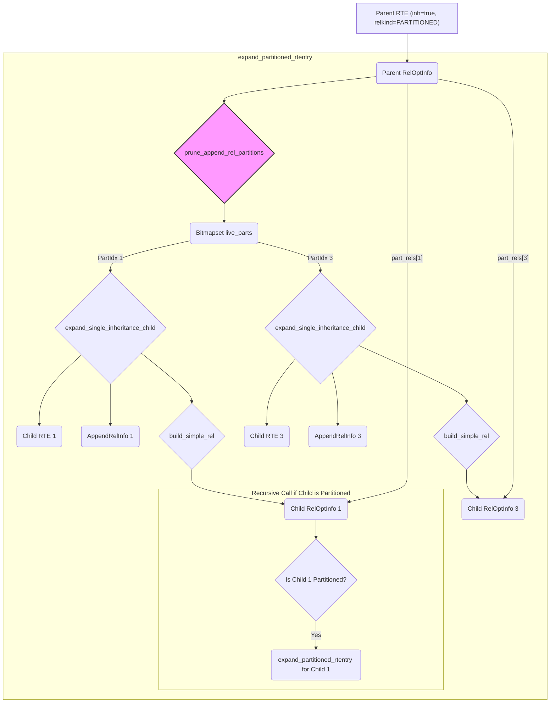

## AI辅助 PolarDB内核学习 - 41 优化器辅助功能模块(util) 核心代码 inherit.c        
          
### 作者          
digoal          
          
### 日期          
2025-04-07          
          
### 标签          
PostgreSQL , PolarDB , DuckDB , AI , 内核 , 学习 , util , 优化器 , 辅助功能模块          
          
----          
          
## 背景          
          
## 解读 优化器辅助功能模块(util) 核心代码 inherit.c     
      
好的，我们来解读一下 PostgreSQL 的 `src/backend/optimizer/util/inherit.c` 这段代码。  
  
**代码作用概述**  
  
这段 C 代码是 PostgreSQL 查询优化器的一部分，其核心功能是处理查询中涉及**表继承**（包括传统继承和分区表）的情况。当查询引用一个父表（或分区表）时，此代码负责**扩展**查询范围，将所有相关的子表（或分区）也纳入查询计划的考虑范围。它会为每个子表创建相应的内部表示（如范围表条目 RTE、关系优化信息 RelOptInfo），处理父子表之间的列映射、权限转换，并将父表的查询条件（WHERE 子句）适配并下推到子表上。对于分区表，它还实现了**分区裁剪 (Partition Pruning)** 的关键逻辑入口。此外，它也用类似的方式处理 `UNION ALL` 子查询（将其视为一种“追加关系”）。  
  
**多角度解读**  
  
**1. 数据库内核开发者 (Kernel Developer) 角度**  
  
*   **核心入口:** `expand_inherited_rtentry` 是处理带有 `inh` (inherit) 标志的范围表条目 (RangeTblEntry, RTE) 的主要函数。这个标志意味着该 RTE 代表一个继承集（传统继承父表或分区表）或一个 `UNION ALL` 集合。  
*   **数据结构交互:**  
    *   **RangeTblEntry (RTE):** 查询中每个表引用的基本描述。`inh` 标志触发此模块。代码会为每个子表创建新的 RTE，复制父表信息但修改 `relid`, `relkind`, `inh` 等，并清空 `requiredPerms` 和 `securityQuals`（权限和 RLS 检查在父级进行）。  
    *   **RelOptInfo:** 优化器用于存储单个关系（表或子查询）的优化所需信息（大小、选择度、路径等）的结构。`expand_inherited_rtentry` 会调用 `build_simple_rel` 为每个子表创建对应的 RelOptInfo。对于分区表，父 RelOptInfo 会存储指向子分区 RelOptInfo 的指针数组 (`part_rels`) 和存活分区的位图 (`live_parts`)。  
    *   **AppendRelInfo:** 存储父子表（或 `UNION ALL` 父子查询）之间的映射关系，特别是 `translated_vars` 列表，用于将父表的属性编号 (attno) 映射到子表的相应属性编号。这对于转换查询条件、权限位图至关重要。  
    *   **PlanRowMark:** 处理 `SELECT ... FOR UPDATE/SHARE`。如果父表被标记，会为每个子表创建对应的 PlanRowMark，并更新父 RowMark 的 `isParent` 标志和 `allMarkTypes` 以聚合所有子表的锁定需求。  
    *   **PlannerInfo (root):** 整个查询的规划上下文，包含范围表 (`root->parse->rtable`)、AppendRelInfo 列表 (`root->append_rel_list`)、RelOptInfo 数组 (`root->simple_rel_array`) 等核心数据结构。此代码会动态扩展这些结构以容纳子表。  
*   **关键算法/逻辑:**  
    *   **继承扩展:** `find_all_inheritors` (用于传统继承) 或 `PartitionDirectoryLookup` + 遍历 `partdesc` (用于分区表) 获取子表 OID。  
    *   **分区裁剪:** `expand_partitioned_rtentry` 调用 `prune_append_rel_partitions`，利用父 RelOptInfo 上的限制条件 (`baserestrictinfo`) 来确定哪些分区 (`live_parts`) 需要被实际扫描。这是分区表性能的关键。  
    *   **递归扩展:** `expand_partitioned_rtentry` 会递归调用自身处理多级分区。  
    *   **列映射与转换:** `expand_single_inheritance_child` 创建 AppendRelInfo 时计算 `translated_vars`。`translate_col_privs` 使用此映射转换列权限位图 (`selectedCols`, `updatedCols` 等)。`apply_child_basequals` 使用 `adjust_appendrel_attrs` (内部调用 `map_variable_attnos`) 转换 WHERE 条件中的 Var 节点。  
    *   **条件转换与下推:** `apply_child_basequals` 将父 RelOptInfo 的 `baserestrictinfo` 转换为适用于子表的条件，并处理常量折叠 (`eval_const_expressions`)。如果条件变为 `FALSE`，则该子表可被完全排除（另一种形式的裁剪）。  
    *   **锁定:** 父表锁在查询开始时由重写器获取。此代码负责为每个新加入的子表获取与父表相同的 `LOCKMODE` 锁。  
    *   **UNION ALL 处理:** `expand_appendrel_subquery` 处理标记为 `inh` 的 `RTE_SUBQUERY`，为已存在的子查询 RTE 构建 RelOptInfo，复用 AppendRel 结构。  
  
**2. 架构师 (Architect) 角度**  
  
*   **统一模型:** `inherit.c` 体现了 PostgreSQL 将传统继承、分区表、乃至 `UNION ALL` 子查询都抽象为**追加关系 (Append Relations)** 的设计思想。优化器对它们使用相似的处理流程（创建子 RTE、子 RelOptInfo、AppendRelInfo），使得优化策略（如路径生成、连接方法选择）可以在此统一模型上进行。  
*   **查询处理流程:** 这部分代码位于优化器的早期阶段，紧跟在查询重写和初步的 PlannerInfo 设置之后。它负责**扩展范围表 (Range Table Expansion)**，是生成最终执行计划前必不可少的一步。  
    ```mermaid  
    sequenceDiagram  
        participant Client  
        participant Parser  
        participant Rewriter  
        participant Planner_Setup  
        participant Inherit_Expansion (inherit.c)  
        participant Optimizer_Paths  
        participant Executor  
  
        Client->>Parser: SQL Query (e.g., SELECT * FROM parent_table)  
        Parser->>Rewriter: Parse Tree  
        Rewriter->>Planner_Setup: Rewritten Query Tree  
        Planner_Setup->>Inherit_Expansion: PlannerInfo (root), RelOptInfo for parent_table (inh=true)  
        Note over Inherit_Expansion: Detects inh=true on parent_table RTE  
        alt Partitioned Table  
            Inherit_Expansion->>Inherit_Expansion: expand_partitioned_rtentry()  
            Inherit_Expansion->>Catalog: Lookup Partitions (PartitionDirectoryLookup)  
            Inherit_Expansion->>Optimizer_Paths: Prune Partitions (prune_append_rel_partitions)  
            loop For each Live Partition  
                Inherit_Expansion->>Inherit_Expansion: expand_single_inheritance_child()  
                Inherit_Expansion->>Planner_Setup: Create Child RTE, AppendRelInfo, Child RelOptInfo  
            end  
        else Traditional Inheritance or UNION ALL  
            Inherit_Expansion->>Catalog: Lookup Children (find_all_inheritors) or Use Existing Children  
             loop For each Child  
                Inherit_Expansion->>Inherit_Expansion: expand_single_inheritance_child() / expand_appendrel_subquery()  
                Inherit_Expansion->>Planner_Setup: Create Child RTE, AppendRelInfo, Child RelOptInfo  
            end  
        end  
        Inherit_Expansion->>Optimizer_Paths: Expanded PlannerInfo (with child info)  
        Optimizer_Paths->>Executor: Generate Plan (potentially Append or MergeAppend node)  
        Executor->>Client: Results  
    ```  
*   **分区表的优势体现:** `expand_partitioned_rtentry` 中的分区裁剪逻辑是分区表性能优势的核心。通过在规划阶段就排除掉不相关的分区，可以显著减少需要扫描的数据量。  
*   **复杂性与可扩展性:** 这种显式的扩展机制虽然增加了优化器的复杂性，但提供了处理复杂继承/分区结构和下推条件的灵活性。新的表类型如果能适配 AppendRel 模型，可以相对容易地集成。  
*   **限制与权衡:**  
    *   **规划开销:** 对于有大量子表/分区的场景，扩展过程本身（查找子表、创建结构、转换条件）会带来一定的规划时间开销。  
    *   **全局 vs. 局部优化:** 虽然条件会下推，但优化器主要还是基于每个子表的 RelOptInfo 独立生成路径，最后通过 Append/MergeAppend 节点组合。这可能不如对整个数据集进行全局优化的效果（如果可能的话）。  
  
**3. 用户 (应用开发者 / DBA) 角度**  
  
*   **透明性:** 对于应用开发者，查询父表（如 `SELECT * FROM measurements WHERE time > '2023-01-01'`）会自动查询所有相关的子表（传统继承）或分区（分区表），无需显式列出所有子表。`inherit.c` 是实现这种透明性的幕后功臣。  
*   **分区表性能:** DBA 设计分区表（例如按时间范围分区）后，`inherit.c` 中的分区裁剪逻辑 (`prune_append_rel_partitions`) 会自动生效。当查询带有分区键的条件时（如上例中的 `time`），优化器能识别出只有部分分区可能包含满足条件的数据，从而只扫描这些分区，极大提升查询性能。  
    *   **例子:** 假设 `measurements` 是按月分区的表，有 `measurements_2022_12`, `measurements_2023_01`, `measurements_2023_02` 等分区。查询 `WHERE time > '2023-01-15'` 时，`inherit.c` 参与的裁剪过程会确定只有 `measurements_2023_01` 和 `measurements_2023_02` (以及后续分区) 需要被扫描，`measurements_2022_12` 则会被跳过。  
*   **`UNION ALL` 视图/子查询:** 如果你创建了一个基于 `UNION ALL` 的视图来合并多个结构相同的表，查询这个视图时，`inherit.c`（通过 `expand_appendrel_subquery`）会确保优化器能像处理继承表一样，为每个 `UNION ALL` 的分支生成优化的扫描计划。  
*   **`ONLY` 关键字:** 如果查询使用了 `ONLY` 关键字 (如 `SELECT * FROM ONLY parent_table`)，则不会触发 `inherit.c` 中的扩展逻辑，查询将只作用于指定的那个表本身。  
*   **权限:** 权限检查通常在父表级别进行。即使查询扩展到了子表，用户也只需要拥有对父表的相应权限（SELECT, UPDATE 等）。`inherit.c` 通过在创建子 RTE 时清除 `requiredPerms` 来体现这一点。  
*   **`FOR UPDATE/SHARE`:** 当在父表上使用行锁（`FOR UPDATE`/`SHARE`）时，`inherit.c` 确保所有被查询的子表也会被正确地锁定，保证数据一致性。DBA 需要注意这可能会增加锁竞争。  
*   **DDL 注意事项:** 虽然 `inherit.c` 是查询时的逻辑，但它依赖于继承/分区结构的元数据。DBA 在执行 DDL（如 `ATTACH/DETACH PARTITION`）时，需要知道这会影响后续查询经由 `inherit.c` 扩展时包含哪些表。并发的 DDL 和查询可能需要合适的锁机制来保证一致性（例如 `ACCESS EXCLUSIVE` 锁）。  
  
**关键内容深入解释**  
  
**1. `expand_partitioned_rtentry`: 分区表的扩展与裁剪**  
  
*   **目标:** 处理分区表 RTE，递归地为所有 *存活* 的分区创建必要的规划器结构。  
*   **核心步骤:**  
    1.  `check_stack_depth()`: 防止无限递归（虽然分区层级有限制，但仍是好习惯）。  
    2.  `PartitionDirectoryLookup`: 从缓存的**分区描述符缓存 (Partition Directory)** 中高效获取分区信息 (`partdesc`)，避免重复查询系统目录。  
    3.  检查更新列 (`root->partColsUpdated`): 如果查询是 UPDATE 且更新了分区键列，记录这个事实，这可能影响执行阶段的元组路由。  
    4.  **分区裁剪 (Partition Pruning):** 调用 `prune_append_rel_partitions(relinfo)`。这是关键！此函数（位于 `partprune.c`）会检查父 `relinfo` 上的 `baserestrictinfo`（WHERE 条件），结合 `partdesc` 中的分区边界信息，计算出一个 `Bitmapset *live_parts`，包含那些**不能**被条件排除的分区的索引。  
    5.  `expand_planner_arrays`: 根据 `live_parts` 的数量扩展 `PlannerInfo` 中的数组（`simple_rte_array`, `append_rel_array`, `simple_rel_array`），为即将创建的子表结构预留空间。  
    6.  `relinfo->part_rels = palloc0(...)`: 在父 RelOptInfo 中分配一个指针数组，用于存放子分区的 RelOptInfo 指针。这构成了分区表的层级结构。  
    7.  **遍历存活分区:** 使用 `bms_next_member` 迭代 `live_parts` 中的每个分区索引 `i`。  
    8.  `try_table_open`: 打开子分区表，并获取 `lockmode` 指定的锁。使用 `try_` 版本是因为分区可能已被并发地 `DETACH` 或 `DROP`，此时应优雅地处理（将其视为被裁剪）。  
    9.  `expand_single_inheritance_child`: 为这个存活的子分区创建 RTE, AppendRelInfo, PlanRowMark (如果需要)。  
    10. `build_simple_rel`: 为子分区创建 RelOptInfo (`childrelinfo`)。  
    11. 存储子 RelOptInfo: `relinfo->part_rels[i] = childrelinfo`。  
    12. `relinfo->all_partrels = bms_add_members(...)`: 将子分区的 `relids` 加入父 RelOptInfo 的 `all_partrels` 集合，用于后续优化。  
    13. **递归:** 如果子分区本身也是一个分区表 (`childrel->rd_rel->relkind == RELKIND_PARTITIONED_TABLE`)，则递归调用 `expand_partitioned_rtentry` 继续扩展。  
    14. `table_close(childrel, NoLock)`: 关闭子表描述符，但保留已获取的锁。  
  
*   **重要性:** 分区裁剪是分区表的核心优势。此函数是裁剪逻辑在优化器中的主要入口点，它决定了哪些分区需要进一步考虑和规划。  
  
**Mermaid 图表示例 (分区表扩展概念)**  
  

  
**2. `expand_single_inheritance_child`: 创建单个子表表示**  
  
*   **目标:** 为父表（传统继承或分区表）的单个子表创建 RTE、AppendRelInfo 和可选的 PlanRowMark。  
*   **核心步骤:**  
    1.  **创建子 RTE (`childrte`):** 使用 `makeNode` 分配内存，`memcpy` 复制父 RTE 的大部分内容。然后，**关键地**，更新 `relid` (子表 OID), `relkind` (子表类型), `inh` (通常为 `false`，除非子表本身也是分区表), 并清零 `requiredPerms` 和 `securityQuals`。  
    2.  添加到范围表: `parse->rtable = lappend(parse->rtable, childrte)`，获取新的 `childRTindex`。  
    3.  **创建 AppendRelInfo (`appinfo`):** 调用 `make_append_rel_info`。这个函数（可能在 `appendinfo.c`）会比较父子表的 `TupleDesc`，计算出 `translated_vars` 列表。这个列表是核心，它是一个 `List`，索引对应子表的属性号 (attno)，值为对应的父表 `Var` 节点（如果列存在于父表中且类型匹配），或者为 `NULL` (如果列是子表特有的或类型不匹配)。对于分区表，这个映射通常是一一对应的。  
    4.  添加到列表: `root->append_rel_list = lappend(root->append_rel_list, appinfo)`。  
    5.  **处理别名 (`childrte->alias`, `childrte->eref`):** 为子 RTE 创建别名信息，确保 EXPLAIN 输出和后续处理能正确显示列名。它会尝试复用父表的列别名（通过 `translated_vars` 映射），对于子表特有列则使用其实际名称。  
    6.  **转换列权限 (`translate_col_privs`):** 使用 `appinfo->translated_vars` 将父 RTE 的 `selectedCols`, `insertedCols`, `updatedCols` 位图转换为子表的列编号。注意 `InvalidAttrNumber` (代表整行引用 `table.*`) 会被特殊处理，转换为子表中所有继承列的权限。  
    7.  存储到数组: 将 `childrte` 和 `appinfo` 存入 `PlannerInfo` 的 `simple_rte_array` 和 `append_rel_array` 中（这些数组之前已被 `expand_planner_arrays` 扩展过）。  
    8.  **创建 PlanRowMark (`childrc`):** 如果父表有 `PlanRowMark` (`top_parentrc != NULL`)，则为子表创建一个。`rti` 是子表索引，`prti` 指向顶层父表的索引，`rowmarkId` 相同。`markType` 会根据子表的 `relkind` (如 FOREIGN TABLE 可能不支持某些锁类型) 和父表的锁强度 (`strength`) 重新选择。子表的 `markType` 会被合并到顶层父 `PlanRowMark` 的 `allMarkTypes` 位图中。  
    9.  **处理目标关系 (Result Relation):** 如果父表是 UPDATE/DELETE/MERGE 的目标关系 (`bms_is_member(parentRTindex, root->all_result_relids)`), 那么子表也要被标记为目标关系 (`root->all_result_relids = bms_add_member(...)`)。如果子表不是分区表（即叶子节点），则将其加入 `leaf_result_relids`，并为其添加必要的行标识列（如 `tableoid` 用于区分来自哪个子表的数据，以及主键或 `ctid` 用于实际更新/删除）。  
  
*   **重要性:** 这是将继承/分区关系具体化为优化器可处理的独立子关系表示的关键步骤。它建立了父子之间的联系 (`AppendRelInfo`) 并处理了所有必要的属性转换。  
  
**3. `apply_child_basequals`: 下推和转换 WHERE 条件**  
  
*   **目标:** 将父 RelOptInfo 中的基本限制条件 (`baserestrictinfo`) 应用到子 RelOptInfo 上。  
*   **核心步骤:**  
    1.  **遍历父条件:** 迭代 `parentrel->baserestrictinfo` 中的每个 `RestrictInfo`。  
    2.  **转换属性:** `adjust_appendrel_attrs(root, (Node *) rinfo->clause, 1, &appinfo)`。此函数（可能在 `plan DML related function`）使用 `appinfo->translated_vars` 将条件表达式中的 `Var` 节点从父表属性号调整为子表属性号。  
    3.  **常量折叠:** `eval_const_expressions(root, childqual)`。转换后的条件可能包含可以直接求值的常量表达式，例如，如果父条件是 `part_key = 10`，而子分区只包含 `part_key > 20` 的数据，转换后可能直接变为 `FALSE`。  
    4.  **检查常量 False/Null:** 如果 `childqual` 变成了常量 `FALSE` 或 `NULL`，意味着这个子表不可能满足条件，函数直接返回 `false`。调用者（通常是 `make_rel_from_joinlist` 或类似函数）会据此将子 RelOptInfo 标记为 "dummy"，后续不会为其生成扫描路径。这是另一种形式的裁剪。  
    5.  **处理常量 True:** 如果变为 `TRUE`，则该条件对子表无限制作用，直接丢弃。  
    6.  **处理 AND 表达式:** `make_ands_implicit` 将可能产生的嵌套 AND 结构扁平化。  
    7.  **检查伪常量:** `contain_vars_of_level(onecq, 0)` 和 `contain_volatile_functions(onecq)` 用于检查转换后的条件是否不包含变量和易变函数。如果是，则标记为 `pseudoconstant`。这可以用于优化，例如在计划的更高层进行过滤（Gate 节点）。  
    8.  **重新构建 RestrictInfo:** 为每个有效的、转换后的条件片段创建新的 `RestrictInfo` 结构，保留原始条件的 `is_pushed_down` 等属性，并设置 `pseudoconstant` 标志。  
    9.  **合并子表特有安全屏障条件:** 如果子 RTE (通常来自 `UNION ALL`) 有自己的 `securityQuals`，也将它们转换为 `RestrictInfo` 并添加到 `childquals` 列表中。  
    10. **设置子 RelOptInfo:** 将最终的 `childquals` 列表设置为 `childrel->baserestrictinfo`，并计算 `baserestrict_min_security`。  
    11. 返回 `true` 表示成功应用（子表未被裁剪掉）。  
  
*   **重要性:** 这是将查询的过滤逻辑正确传递给每个相关子表的关键。常量折叠和伪常量检测是重要的优化手段。返回 `false` 实现基于条件的子表裁剪。  
  
希望这份详细的解读能够帮助你理解 `inherit.c` 的工作原理和在 PostgreSQL 中的重要作用！  
          
## 提示          
```          
解读下面的代码. 先用几句话阐述代码作用, 然后从数据库内核开发者、架构师、用户(应用开发者和DBA)多个角度通熟易懂的解读这个代码, 使用sequence、mermaid图表以及恰当的例子提升代码可读性. 关键内容务必要深入重点详细解释.      
$代码内容     
```          
          
## PolarDB & PostgreSQL 15 差异          
```          
git diff -u 50d3d22baba63613d1f1406b2ed460dc9b03c3fc f5e7493819e370d30ac2047c68c21c9fb03ce4a0 -- src/backend/optimizer/util/inherit.c       
```          
          
差异分析待补充.          
          
<b> 以上内容基于DeepSeek、QwQ及诸多AI生成, 轻微人工调整, 感谢杭州深度求索人工智能、阿里云等公司. </b>          
          
<b> AI 生成的内容请自行辨别正确性, 当然也多了些许踩坑的乐趣, 毕竟冒险是每个男人的天性.  </b>          
          
          
  
#### [期望 PostgreSQL|开源PolarDB 增加什么功能?](https://github.com/digoal/blog/issues/76 "269ac3d1c492e938c0191101c7238216")
  
  
#### [PolarDB 开源数据库](https://openpolardb.com/home "57258f76c37864c6e6d23383d05714ea")
  
  
#### [PolarDB 学习图谱](https://www.aliyun.com/database/openpolardb/activity "8642f60e04ed0c814bf9cb9677976bd4")
  
  
#### [PostgreSQL 解决方案集合](../201706/20170601_02.md "40cff096e9ed7122c512b35d8561d9c8")
  
  
#### [德哥 / digoal's Github - 公益是一辈子的事.](https://github.com/digoal/blog/blob/master/README.md "22709685feb7cab07d30f30387f0a9ae")
  
  
#### [About 德哥](https://github.com/digoal/blog/blob/master/me/readme.md "a37735981e7704886ffd590565582dd0")
  
  

  
