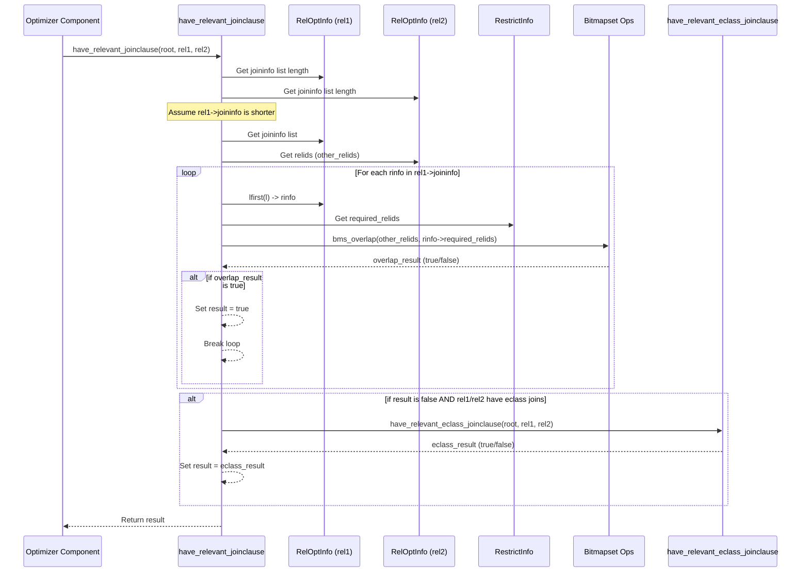
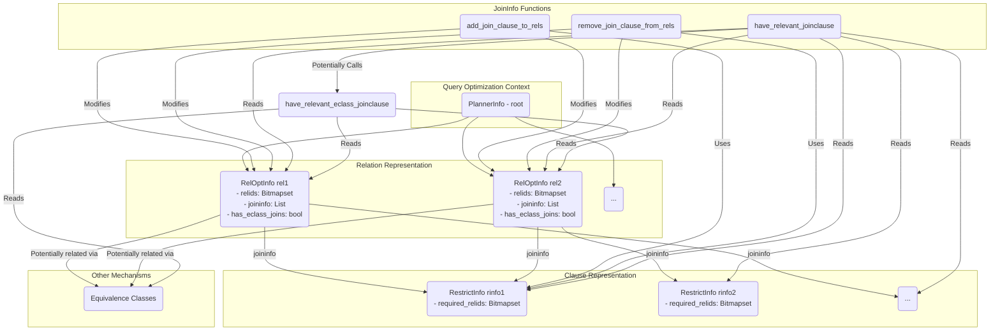

## AI辅助 PolarDB内核学习 - 42 优化器辅助功能模块(util) 核心代码 joininfo.c          
            
### 作者            
digoal            
            
### 日期            
2025-04-07            
            
### 标签            
PostgreSQL , PolarDB , DuckDB , AI , 内核 , 学习 , util , 优化器 , 辅助功能模块            
            
----            
            
## 背景            
            
## 解读 优化器辅助功能模块(util) 核心代码 joininfo.c       
        
Okay, let's break down this PostgreSQL C code from `joininfo.c`.  
  
**代码作用简述 (Brief Summary)**  
  
这段代码主要负责**管理查询优化过程中连接子句（Join Clauses）与基本关系（Tables/Relations）之间的关联信息**。它提供了三个核心功能：  
  
1.  **`have_relevant_joinclause`**: 检测两个给定的关系之间是否存在任何（直接或间接的）连接条件。这有助于优化器判断连接这两个关系是否有意义。  
2.  **`add_join_clause_to_rels`**: 将一个连接子句（表示为一个`RestrictInfo`结构）添加到所有参与该子句的关系的`joininfo`列表中。  
3.  **`remove_join_clause_from_rels`**: 从所有相关关系的`joininfo`列表中移除一个特定的连接子句。这通常在优化器发现某个关系根本不需要被连接时使用。  
  
这些函数是查询优化器构建和探索不同连接顺序（Join Order）的基础工具。  
  
**多角度解读 (Multi-Perspective Interpretation)**  
  
---  
  
**1. 数据库内核开发者 (Database Kernel Developer Perspective)**  
  
*   **关注点**: 数据结构、算法效率、内存管理、与其他优化器模块的交互。  
*   **解读**:  
    *   **数据结构**:  
        *   `RelOptInfo`: 代表一个关系（基本表或已连接的结果），包含 `relids` (Bitmapset，表示包含的基础表ID集合) 和 `joininfo` (一个`List`，存储指向与此关系相关的`RestrictInfo`的指针)。  
        *   `RestrictInfo`: 封装了一个限制条件（WHERE子句或JOIN ON子句），包含 `required_relids` (Bitmapset，表示评估此条件所需的基础表ID集合)。  
        *   `List`: PostgreSQL 自定义的链表实现。  
        *   `Bitmapset (Relids)`: 高效的位图集合，用于快速进行集合运算（如`bms_overlap`判断交集，`bms_next_member`遍历成员）。  
    *   **`have_relevant_joinclause`**:  
        *   **核心逻辑**: 通过检查一个关系（`rel1`）的 `joininfo` 列表中的每个 `RestrictInfo` (`rinfo`)，看其 `required_relids` 是否与另一个关系（`rel2`）的 `relids` 有交集 (`bms_overlap`)。反之亦然（代码会选择较短的 `joininfo` 列表进行迭代以提高效率）。  
        *   **关键点**: "Relevant" 不代表 "immediately evaluable"。即使一个 join clause `a.x = b.y + c.z` 需要三个表，它也会被记录在 `a`, `b`, `c` 各自的 `joininfo` 中。调用 `have_relevant_joinclause(a, b)` 时，会因为这个 clause 检查到 overlap 而返回 `true`。这提示优化器 `a` 和 `b` 之间存在关联，即使这个关联需要 `c` 的参与才能最终计算。  
        *   **`EquivalenceClass`**: 这是一个重要的补充。等价类 (`eclass`) 存储了已知相等的表达式（例如，`WHERE a.x = b.y AND b.y = 10` 会将 `a.x`, `b.y`, `10` 放入同一个等价类）。这种传递性可能隐含了 `a` 和 `b` 之间的连接关系，即使没有显式的 `a.x = b.y` 这样的 `RestrictInfo`。因此，如果 `joininfo` 检查未找到关联，还会检查等价类 (`have_relevant_eclass_joinclause`)。  
    *   **`add_join_clause_to_rels`**:  
        *   **实现**: 遍历 `join_relids` 中的每个基础表 ID，找到对应的 `RelOptInfo`，然后使用 `lappend` 将*同一个* `RestrictInfo` 指针追加到该 `RelOptInfo` 的 `joininfo` 链表末尾。  
        *   **共享指针**: 注意，所有相关的 `RelOptInfo` 的 `joininfo` 列表都包含指向*同一个* `RestrictInfo` 实例的指针。这允许对 `RestrictInfo` 的属性（如选择性估算）进行缓存，并在所有使用它的地方共享，但要求这些缓存信息不能依赖于特定的上下文。  
        *   **效率**: `bms_next_member` 高效遍历 Bitmapset 中的成员。`lappend` 是 O(1) 操作（如果列表记住尾指针）或 O(N)（如果需要遍历到尾部，但通常针对 Planner 使用的 List 优化为 O(1)）。  
    *   **`remove_join_clause_from_rels`**:  
        *   **实现**: 类似于 `add`，遍历 `join_relids`，找到 `RelOptInfo`，然后使用 `list_delete_ptr` 通过指针比较从 `joininfo` 列表中移除 `RestrictInfo`。  
        *   **指针比较**: `list_delete_ptr` 直接比较内存地址，效率很高。`Assert` 确保了要删除的项确实存在于列表中。  
    *   **整体作用**: 这些函数是优化器早期阶段（特别是 join planning 阶段）的基础设施，用于组织和查询连接的可能性。它们直接影响优化器如何构建候选的连接路径（Paths）。  
  
---  
  
**2. 架构师 (Architect Perspective)**  
  
*   **关注点**: 模块职责、系统设计、可扩展性、性能瓶颈。  
*   **解读**:  
    *   **模块化**: `joininfo.c` 封装了连接信息管理的核心逻辑，与路径生成（`pathnode.c`, `paths.c`）、代价估算等模块解耦，但为其提供必要输入。这是一个良好的模块化设计。  
    *   **设计决策**:  
        *   **关联方式**: 将一个 join clause 关联到 *所有* 参与的关系，而不是仅仅关联到一个特定的关系 *对*。这种多对多关联的设计提供了极大的灵活性，允许优化器从任何一个参与关系出发，都能“看到”这个连接条件，从而探索更多样的连接顺序。例如，对于 `t1 JOIN t2 ON t1.a=t2.b JOIN t3 ON t2.c=t3.d`，`t1.a=t2.b` 会在 `t1` 和 `t2` 的 `joininfo` 中，`t2.c=t3.d` 会在 `t2` 和 `t3` 的 `joininfo` 中。当考虑连接 `t1` 和 `t3` 时（也许通过某种 Hash Join 变体），`have_relevant_joinclause` 虽然可能基于这两个 clause 返回 false（如果它们只涉及两方），但优化器在探索 `(t1 join t2) join t3` 或 `t1 join (t2 join t3)` 时会用到这些信息。  
        *   **`have_relevant_joinclause` 的“宽松”定义**: 允许涉及第三方关系的 clause 也被视为相关，这是为了支持更复杂的连接策略，如先交叉连接（Cross Join）或计算部分结果，然后再应用涉及其他表的条件（例如通过索引扫描）。这体现了对复杂查询优化场景的考量。  
        *   **`EquivalenceClass` 的整合**: 将等价类作为连接信息的另一个来源，增强了优化器发现隐含连接关系的能力，提高了规划质量，尤其是在有常量约束和传递性约束的情况下。  
    *   **性能**:  
        *   使用 Bitmapset 进行关系集合操作是关键的性能优化，尤其是在处理具有大量表的连接时。  
        *   `have_relevant_joinclause` 中选择较短列表迭代是简单但有效的优化。  
        *   共享 `RestrictInfo` 实例减少了内存占用和重复计算。  
    *   **可扩展性**: 如果未来需要支持新型的连接条件或约束，可能需要扩展 `RestrictInfo` 结构和相关的处理逻辑，但基础的 `joininfo` 关联机制是相对稳固的。  
  
---  
  
**3. 用户 (应用开发者 / DBA Perspective)**  
  
*   **关注点**: 查询性能、`EXPLAIN` 输出、如何编写高效查询。  
*   **解读**:  
    *   **幕后英雄**: 你写的 SQL 查询中的 `JOIN ON` 条件和部分 `WHERE` 条件会被解析成 `RestrictInfo`。这段代码就是 PostgreSQL 优化器用来理解这些条件如何将表关联起来的“记事本”。  
    *   **`have_relevant_joinclause` 的意义**: 这个函数帮助优化器判断：“连接表 A 和表 B 是否可能有用？” 如果你的查询中有 `WHERE A.id = B.ref_id`，这个函数就会告诉优化器 A 和 B 之间有直接关联。更巧妙的是，即使你有 `WHERE A.value = B.amount + C.offset`，这个函数也会认为 A 和 B (以及 A 和 C, B 和 C) 之间存在“相关性”。这意味着优化器 *不会* 因为这个条件需要三个表就完全放弃先连接 A 和 B 的可能性。它可能会考虑先连接 B 和 C 计算 `B.amount + C.offset`，或者在连接 A 和 B 后再处理 C。  
    *   **对查询编写的影响**:  
        *   **明确的连接条件**: 编写清晰的 `JOIN ON` 条件能让优化器更容易地通过这些机制识别出关系。  
        *   **传递性**: 如果你写 `WHERE t1.a = t2.b AND t2.b = t3.c`，优化器不仅知道 `t1` 和 `t2`、`t2` 和 `t3` 相关，还会通过等价类推断出 `t1` 和 `t3` 也相关 (`t1.a = t3.c`)。这可能带来更优的连接顺序（比如直接连接 `t1` 和 `t3`）。  
    *   **`EXPLAIN` 的体现**: `EXPLAIN` 输出中看到的连接顺序（Join Order）和连接方法（Join Method, e.g., Hash Join, Nested Loop）是优化器综合考虑了 `joininfo` 提供的关联信息、表的统计信息、代价估算等因素后做出的决策。如果优化器因为 `have_relevant_joinclause` 返回 `true` 而考虑了某个连接，这可能会反映在最终选择的计划或被评估但放弃的计划中（在非常详细的 `EXPLAIN` 模式下可能看到）。  
    *   **为什么要知道这个?**: 理解优化器如何利用连接信息，有助于你分析为什么某个查询计划是这样生成的，以及如何通过调整查询（比如添加看似冗余但能帮助优化的条件）或数据库统计信息来引导优化器选择更好的计划。例如，如果发现优化器没有选择一个你认为很好的连接顺序，可能是因为它未能通过 `joininfo` 或 `eclass` 发现相关的连接条件。  
  
**Sequence Diagram (`have_relevant_joinclause`)**  
  

  
**Mermaid 图表 (Conceptual Data Structures & Interaction)**  
  

  
**关键内容深入解释 (Deep Dive on Key Aspects)**  
  
1.  **`have_relevant_joinclause` 的核心逻辑与 `bms_overlap`**:  
    *   假设我们调用 `have_relevant_joinclause(root, rel1, rel2)`，并且 `rel1->joininfo` 列表更短。代码会遍历 `rel1->joininfo` 中的每一个 `RestrictInfo *rinfo`。  
    *   对于每个 `rinfo`，它会检查 `bms_overlap(rel2->relids, rinfo->required_relids)`。  
    *   `rel2->relids` 是代表 `rel2` 这个（可能是连接后的）关系所包含的所有*基础*表 ID 的集合。  
    *   `rinfo->required_relids` 是评估 `rinfo` 这个条件所必需的所有*基础*表 ID 的集合。  
    *   **`bms_overlap` 返回 true 当且仅当这两个集合存在交集。** 这意味着什么？这意味着 `rinfo` 这个条件至少需要 `rel2` 中的一个基础表，同时也需要 `rel1` 中的一个基础表（因为 `rinfo` 出现在 `rel1->joininfo` 列表中，根据 `add_join_clause_to_rels` 的逻辑，它必然需要 `rel1` 至少一个基础表）。  
    *   **例子**:  
        *   Query: `SELECT * FROM t1, t2, t3 WHERE t1.a = t2.b AND t2.c = t3.d;`  
        *   `rinfo1` for `t1.a = t2.b`: `required_relids = {t1, t2}`. Added to `t1.joininfo` and `t2.joininfo`.  
        *   `rinfo2` for `t2.c = t3.d`: `required_relids = {t2, t3}`. Added to `t2.joininfo` and `t3.joininfo`.  
        *   Call `have_relevant_joinclause(t1, t2)`:  
            *   Iterate `t1.joininfo` (contains `rinfo1`).  
            *   Check `bms_overlap(t2->relids={t2}, rinfo1->required_relids={t1, t2})`. 交集是 `{t2}`，非空。返回 `true`.  
        *   Call `have_relevant_joinclause(t1, t3)`:  
            *   Iterate `t1.joininfo` (contains `rinfo1`). Check `bms_overlap(t3->relids={t3}, rinfo1->required_relids={t1, t2})`. 交集为空。  
            *   Iterate `t3.joininfo` (contains `rinfo2`). Check `bms_overlap(t1->relids={t1}, rinfo2->required_relids={t2, t3})`. 交集为空。  
            *   Check eclass (假设没有等价类)。返回 `false`。这表示 `t1` 和 `t3` 之间没有 *直接* 的连接条件被记录。  
    *   **多表条件的精妙之处**:  
        *   Query: `SELECT * FROM t1, t2, t3 WHERE t1.x = t2.y + t3.z;`  
        *   `rinfo3` for `t1.x = t2.y + t3.z`: `required_relids = {t1, t2, t3}`. Added to `t1.joininfo`, `t2.joininfo`, `t3.joininfo`.  
        *   Call `have_relevant_joinclause(t1, t2)`:  
            *   Iterate `t1.joininfo` (contains `rinfo3`).  
            *   Check `bms_overlap(t2->relids={t2}, rinfo3->required_relids={t1, t2, t3})`. 交集是 `{t2}`，非空。返回 `true`!  
        *   **重要结论**: 即使 `t1.x = t2.y + t3.z` 不能仅用 `t1` 和 `t2` 来评估，`have_relevant_joinclause` 依然认为它们之间存在相关性。这给了优化器信号：“考虑连接 `t1` 和 `t2` 可能是有价值的，因为它们共同参与了一个更复杂的约束”。优化器可能会选择先连接 `t2` 和 `t3`，或者使用其他涉及三方的连接策略。  
  
2.  **`RestrictInfo` 指针共享**:  
    *   `add_join_clause_to_rels` 将完全相同的 `RestrictInfo` 指针添加到所有相关 `RelOptInfo` 的 `joininfo` 列表中。  
    *   **优点**:  
        *   **内存效率**: 只需存储一份 `RestrictInfo` 结构。  
        *   **信息缓存**: 对 `RestrictInfo` 进行的代价估算、选择性分析等结果可以被缓存起来，所有引用它的地方都能直接使用，避免重复计算。  
    *   **要求**: 缓存的信息必须是通用的，不能依赖于它是在哪个 `RelOptInfo` 的上下文中被访问的。例如，`RestrictInfo` 中缓存的选择性（selectivity）应该是该子句本身的固有属性，而不是它作用于某个特定中间连接结果时的选择性（后者通常在生成具体 Path 时计算）。  
  
3.  **与 `EquivalenceClass` 的关系**:  
    *   `joininfo` 主要处理显式的连接条件（`a=b`, `a > b+c` 等）。  
    *   `EquivalenceClass` 处理相等关系 (`a=b`, `b=c`, `c=10`)，并能推导出传递性相等 (`a=c`, `a=10`, `b=10`)。  
    *   一个等价关系，如 `a.x = b.y`，既可能生成一个 `RestrictInfo` 存入 `joininfo`，也可能在等价类数据结构中记录。  
    *   `have_relevant_joinclause` 先检查 `joininfo`，如果找不到关联，再检查等价类（通过 `have_relevant_eclass_joinclause`）。这是因为等价类可能包含由多个 `WHERE` 子句推导出来的隐含连接关系。例如 `WHERE a.x = b.y AND a.x = c.z`，即使没有 `b.y = c.z` 的显式 `RestrictInfo`，等价类也会知道 `b.y` 和 `c.z` 是相等的，这构成了 `b` 和 `c` 之间的连接依据。  
  
这段代码虽然行数不多，但它体现了关系数据库优化器中管理连接信息的核心思想，对于理解优化器如何探索庞大的连接顺序搜索空间至关重要。  
            
## 提示            
```            
解读下面的代码. 先用几句话阐述代码作用, 然后从数据库内核开发者、架构师、用户(应用开发者和DBA)多个角度通熟易懂的解读这个代码, 使用sequence、mermaid图表以及恰当的例子提升代码可读性. 关键内容务必要深入重点详细解释.        
$代码内容       
```            
            
## PolarDB & PostgreSQL 15 差异            
```            
git diff -u 50d3d22baba63613d1f1406b2ed460dc9b03c3fc f5e7493819e370d30ac2047c68c21c9fb03ce4a0 -- src/backend/optimizer/util/joininfo.c         
```            
            
差异分析待补充.            
            
<b> 以上内容基于DeepSeek、QwQ及诸多AI生成, 轻微人工调整, 感谢杭州深度求索人工智能、阿里云等公司. </b>            
            
<b> AI 生成的内容请自行辨别正确性, 当然也多了些许踩坑的乐趣, 毕竟冒险是每个男人的天性.  </b>            
            
            
  
#### [期望 PostgreSQL|开源PolarDB 增加什么功能?](https://github.com/digoal/blog/issues/76 "269ac3d1c492e938c0191101c7238216")
  
  
#### [PolarDB 开源数据库](https://openpolardb.com/home "57258f76c37864c6e6d23383d05714ea")
  
  
#### [PolarDB 学习图谱](https://www.aliyun.com/database/openpolardb/activity "8642f60e04ed0c814bf9cb9677976bd4")
  
  
#### [PostgreSQL 解决方案集合](../201706/20170601_02.md "40cff096e9ed7122c512b35d8561d9c8")
  
  
#### [德哥 / digoal's Github - 公益是一辈子的事.](https://github.com/digoal/blog/blob/master/README.md "22709685feb7cab07d30f30387f0a9ae")
  
  
#### [About 德哥](https://github.com/digoal/blog/blob/master/me/readme.md "a37735981e7704886ffd590565582dd0")
  
  

  
