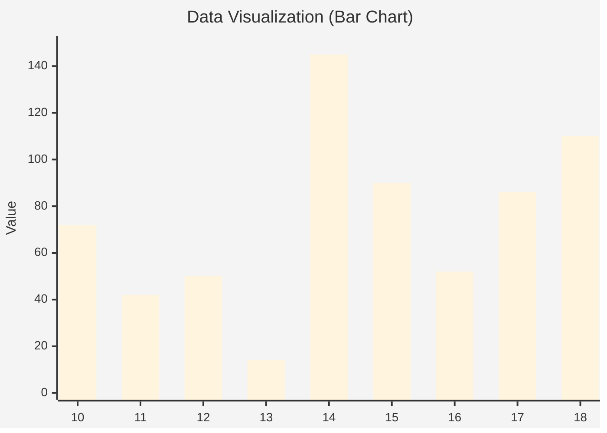

## PostgreSQL 18 功能整理 : 14以来最值得期待的版本
                                                                                                                                                                      
### 作者                                                                                                                                          
digoal                                                                                                                                          
                                                                                                                                                 
### 日期                                                                                                                                               
2025-04-07                                                                                                                                         
                                                                                                                                              
### 标签                                                                                                                                            
PostgreSQL , PolarDB , DuckDB , preview       
                                                                                                                                                                     
----                                                                                                                                              
                                                                                                                                                            
## 背景       
从PostgreSQL 10开始, 我养成了一个习惯, 在`git.postgresql.org`和`https://commitfest.postgresql.org/`实时跟踪解读PostgreSQL新版本新增的用户相关patch和feat. 从我的blog可以看到10-18这些版本的文章数, 也间接反映了对应版本有多少用户关心的特性.    
  
从历史来看14最牛, 我发了145篇preview. 后面PG开始挤牙膏(过去这么多年回过去看, 实则15到17这些版本主要在打磨逻辑复制, 还有一些不够塞牙缝的小功能/体验升级.).    
  
```  
$ git clone --depth 1 https://github.com/digoal/blog  
$ cd blog  
$ grep "PostgreSQL 18 preview" README.md | head -n 10   
##### 202504/20250406_05.md   [《PostgreSQL 18 preview - pgcrypto 新增2个更安全的密码哈希算法》](202504/20250406_05.md)    
##### 202504/20250406_04.md   [《PostgreSQL 18 preview - pg_dump 导出统计信息功能优化》](202504/20250406_04.md)    
##### 202504/20250406_03.md   [《PostgreSQL 18 preview - `autoprewarm` `shared buffer`预热插件改用`streaming read I/O`》](202504/20250406_03.md)    
##### 202504/20250406_02.md   [《PostgreSQL 18 preview - pg_recvlogical 支持创建 failover slot》](202504/20250406_02.md)    
##### 202504/20250406_01.md   [《PostgreSQL 18 preview - index skip scan 优化》](202504/20250406_01.md)    
##### 202504/20250405_03.md   [《PostgreSQL 18 preview - 支持`copy 物化视图 to`》](202504/20250405_03.md)    
##### 202504/20250405_02.md   [《PostgreSQL 18 preview - bitmap Heap Scan支持AIO批量读》](202504/20250405_02.md)    
##### 202504/20250405_01.md   [《PostgreSQL 18 preview - `in (values ())` 支持自动按需转换为 `= any(array)`》](202504/20250405_01.md)    
##### 202504/20250403_07.md   [《PostgreSQL 18 preview - range类型增加GiST 和 B-树的 `sortsupport` 接口》](202504/20250403_07.md)    
##### 202504/20250403_06.md   [《PostgreSQL 18 preview - 连接协议兼容性、安全性改进, 支持min/max_protocol_version》](202504/20250403_06.md)    
...  
```  
  
不过PostgreSQL 似乎又觉醒(不剂牙膏)了, 现在18还没有发布, 已经有110篇. PostgreSQL 18似乎是14以来最值得期待的版本, 最值得期待的当属AIO和DIO框架feat, 估计后面的版本会围绕IO实现进行打磨(挤牙膏).     
```  
$ for i in 10.0 {11..18} ; do echo "$i: `grep -c "PostgreSQL $i preview" README.md`" ; done  
10.0: 72  
11: 42  
12: 50  
13: 14  
14: 145  
15: 90  
16: 52  
17: 86  
18: 110  
```
   

  
  
很多我以前在吐槽系列文章中的点都得到了解决. 文章如下:   
- [《2021-DB吐槽大会 系列 - 适合产品经理、架构师与内核开发者》](../202108/20210823_05.md)    
  
期待18的发布.    
     
各版本功能矩阵参考: https://www.postgresql.org/about/featurematrix/   

## 下面整理了截止到2025.04.09的PostgreSQL 18 preview
IO 优化. 新增启发式预读接口(流式读), IO功能模块化(worker/io_uring/sync ...), 支持异步IO.   
- [《PostgreSQL 18 AIO & DIO 顶层设计》](../202504/20250403_01.md)    
- [《PostgreSQL 18 preview - read_stream 启发式预读量优化, 异步IO(AIO)准备》](../202503/20250317_05.md)    
- [《PostgreSQL 18 preview - 重磅, 刚刚支持异步IO框架》](../202503/20250319_02.md)    
- [《PostgreSQL 18 preview - 异步IO(AIO)应用到缓冲区管理器层面》](../202503/20250331_01.md)    
- [《PostgreSQL 18 preview - AIO增强 : 增加监控工具、增强测试能力、清理代码、改进错误诊断》](../202504/20250403_03.md)    
- [《PostgreSQL 18 preview - 打开文件数限制max_files_per_process更新, 为异步IO io_uring做准备》](../202503/20250325_01.md)    
- [《PostgreSQL 18 preview - 异步IO支持io_uring, IO性能大幅提升》](../202503/20250327_03.md)    
- [《PostgreSQL 18 preview - bitmap Heap Scan支持AIO批量读》](../202504/20250405_02.md)    
- [《PostgreSQL 18 preview - 改进buffer manager API适配未来read_stream.c 的改进》](../202503/20250314_03.md)    
- [《PostgreSQL 18 preview - 流式IO提升索引垃圾回收效率》](../202503/20250324_01.md)    
- [《PostgreSQL 18 preview - read_stream 预读逻辑优化, 提升IO性能》](../202503/20250317_04.md)    
- [《PostgreSQL 18 preview - bitmapheapscan 适配 read_stream 接口, 提升位图堆扫描的性能》](../202503/20250317_06.md)    
- [《PostgreSQL 18 preview - `autoprewarm` `shared buffer`预热插件改用`streaming read I/O`》](../202504/20250406_03.md)    
- [《PostgreSQL 18 preview - 允许所有场景开启并发IO》](../202503/20250331_02.md)    
- [《PostgreSQL 18 preview - 提高默认的 effective_io_concurrency , maintenance_io_concurrency 至 16》](../202503/20250313_02.md)    
- [《PostgreSQL 18 preview - 新增IO合并硬限制: io_max_combine_limit》](../202503/20250319_07.md)    
- [《PostgreSQL 18 preview - 调整 BAS_BULKREAD 算法适配 并发IO请求 和 合并IO大小》](../202504/20250408_10.md)    
- [《PostgreSQL 18 preview - file_copy_method = COPY/CLONE( 支持 COW )》](../202504/20250409_01.md)    
  
  
大版本升级. pg_upgrade支持并行IO框架, 支持swap inode(比hard link还更快), 支持统计信息迁移, 支持一键创建所有对象逻辑订阅(简化增量同步), 支持analyze跳过已有统计信息的对象. 最终可大幅缩短停机时间.    
- [《PostgreSQL 18 preview - pg_upgrade 大版本升级工具支持并行框架》](../202409/20240918_01.md)    
- [《PostgreSQL 18 preview - pg_upgrade大版本升级支持swap选项(mv data)》](../202503/20250326_01.md)    
- [《PostgreSQL 18 preview - pg_upgrade使用CREATE DATABASE ... STRATEGY = FILE_COPY提升大版本升级过程中create database性能》](../202407/20240713_08.md)    
- [《PostgreSQL 18 preview - Pluggable cumulative statistics》](../202407/20240713_05.md)    
- [《PostgreSQL 18 preview - 支持统计信息导出导入, 将来用pg_upgrade大版本升级后不需要analyze了》](../202410/20241026_01.md)    
- [《PostgreSQL 18 preview - 支持pg_upgrade升级大版本时迁移统计信息》](../202502/20250221_02.md)    
- [《PostgreSQL 18 preview - pg_createsubscriber增加--all选项, 方便全实例逻辑订阅》](../202503/20250328_07.md)    
- [《PostgreSQL 18 preview - pg_dump 导出统计信息功能优化》](../202504/20250406_04.md)    
- [《PostgreSQL 18 preview - PG 18支持重置(pg_clear_attribute_stats)和设置(pg_set_attribute_stats)指定对象的列级统计信息》](../202410/20241023_01.md)    
- [《PostgreSQL 18 preview - PG 18支持重置(pg_clear_relation_stats)和设置(pg_set_relation_stats)指定对象的统计信息》](../202410/20241012_02.md)    
- [《PostgreSQL 18 preview - vacuumdb支持跳过已有统计信息对象, 提升pg_upgrade体验》](../202503/20250319_06.md)    
  
  
逻辑复制. 提升大事务逻辑复制性能, 生成列复制控制, 增强监控等.    
- [《PostgreSQL 18 preview - 提升大事务逻辑复制性能》](../202410/20241028_02.md)    
- [《PostgreSQL 18 preview - 逻辑复制增强: 允许指定是否复制generated columns的value》](../202411/20241101_01.md)    
- [《PostgreSQL 18 preview - pg_recvlogical 支持创建 failover slot》](../202504/20250406_02.md)    
- [《PostgreSQL 18 preview - 订阅数控制参数: max_active_replication_origins》](../202503/20250324_02.md)    
- [《PostgreSQL 18 preview - 新增插件: pglogicalinspect 内视 logical decoding components 信息》](../202410/20241016_01.md)    
- [《PostgreSQL 18 preview - 逻辑订阅冲突统计 Collect statistics about conflicts in logical replication》](../202409/20240904_01.md)    
  
  
性能. 高并发小事务优化, 大内存机器优化, 复杂查询优化, 指令优化提升JSON处理性能, 泛化排序接口不再依赖btree, 并行build GIN索引.   
- [《PostgreSQL 18 preview - 增加fast-path lock slots, 提升访问多对象的高并发OLTP业务性能》](../202409/20240924_01.md)    
- [《PostgreSQL 18 preview - 高并发性能优化 之 fast-path lock优化》](../202503/20250317_02.md)    
- [《PostgreSQL 18 preview - 提升 GetLockStatusData 效率, 优化高并发小事务性能》](../202410/20241026_02.md)    
- [《PostgreSQL 18 preview - 引入 NUMA 感知能力》](../202504/20250408_01.md)    
- [《PostgreSQL 18 preview - 索引启发式扫描 优化 `in` , `= any(array)` 多值匹配性能》](../202503/20250324_03.md)    
- [《PostgreSQL 18 preview - 窗口查询性能提升40%(100万个窗口时), 递归CTE性能提升》](../202409/20240906_02.md)    
- [《PostgreSQL 18 preview - tuplestore.c使用generation.c memory context, 物化节点内存使用率降低,性能提升22%》](../202407/20240713_09.md)    
- [《PostgreSQL 18 preview - tuple deformation 优化, OLAP 场景性能提升5-20%》](../202412/20241230_01.md)    
- [《PostgreSQL 18 preview - SIMD用于提升JSON 字符串转义性能》](../202408/20240808_02.md)    
- [《PostgreSQL 18 preview - numeric 类型乘法算法性能优化》](../202407/20240713_04.md)    
- [《PostgreSQL 18 preview - 泛化索引AM排序接口: PrepareSortSupportFromIndexRel() 函数》](../202503/20250317_01.md)    
- [《PostgreSQL 18 preview - range类型增加GiST 和 B-树的 `sortsupport` 接口》](../202504/20250403_07.md)    
- [《PostgreSQL 18 preview - 奇慢无比的GIN索引创建支持并行了》](../202503/20250304_03.md)    
  
  
优化器. 新增索引跳跃扫描方法, 自动转换`in/or`条件为`= ANY`, merge join优化, 增强query rewrite针对烂SQL, 提升复杂SQL行数估算精度等.  
- [《PostgreSQL 18 preview - index skip scan 优化》](../202504/20250406_01.md)    
- [《PostgreSQL 18 preview - 将命中同一个索引的多个`OR`条件转换为 `= ANY (.....)` , 避免使用更低效的BitmapOr》](../202411/20241125_01.md)    
- [《PostgreSQL 18 preview - `in (values ())` 支持自动按需转换为 `= any(array)`》](../202504/20250405_01.md)    
- [《PostgreSQL 18 preview - mergejoins 支持 incremental sort》](../202410/20241009_03.md)    
- [《PostgreSQL 18 preview - 专为烂SQL的一个优化补丁 , Self-Join Elimination》](../202502/20250218_02.md)    
- [《PostgreSQL 18 preview - Support "Right Semi Join" plan shapes》](../202407/20240705_03.md)    
- [《PostgreSQL 18 preview - 并行 nestloop join 优先考虑 物化最廉价的inner path》](../202407/20240713_01.md)    
- [《PostgreSQL 18 preview - Allow pushdown of HAVING clauses with grouping sets》](../202410/20241009_04.md)    
- [《PostgreSQL 18 preview - Teach planner how to estimate rows for timestamp generate_series》](../202407/20240713_07.md)    
- [《PostgreSQL 18 preview - 使用扩展统计信息提高hash join bucket估算准确度》](../202503/20250311_03.md)    
- [《PostgreSQL 18 preview - 子查询group by单列统计信息提升》](../202502/20250220_01.md)    
  
  
块级增量备份恢复.   
- [《PostgreSQL 18 preview - pg_combinebackup 支持硬链接(hard link)》](../202503/20250319_01.md)    
- [《PostgreSQL 18 preview - pg_ls_summariesdir() 查询 pg_wal/summaries目录(wal 倒排索引)》](../202410/20241012_01.md)    
  
  
  
监控/管理. 支持观测运行中SQL执行计划, 新增explain钩子, 扩展explain输出, 增强WAL监控数据试图展示, 认证DDoS攻击检测, 精细记录登陆日志, 精确记录获取锁错误详情, 进程内存上下文检测, 快速驱逐shared buffer, 其他统计信息视图输出内容增强.  
- [《PostgreSQL 18 preview - pg_log_query_plan() 打印running SQL的执行计划》](../202407/20240701_05.md)    
- [《PostgreSQL 18 preview - 新增 EXPLAIN 扩展信息钩子》](../202503/20250319_04.md)    
- [《PostgreSQL 18 preview - 支持 pg_overexplain 插件, 增加EXPLAIN debug,range_table选项》](../202503/20250327_02.md)    
- [《PostgreSQL 18 preview - EXPLAIN ANALYZE 展示 Parallel Bitmap Heap Scan worker stats 信息》](../202407/20240713_06.md)    
- [《PostgreSQL 18 preview - explain 增强 window 函数使用输出信息》](../202503/20250312_02.md)    
- [《PostgreSQL 18 preview - explain analyze支持index searches统计》](../202503/20250312_01.md)    
- [《PostgreSQL 18 preview - Add memory/disk usage for Material nodes in EXPLAIN》](../202407/20240705_02.md)    
- [《PostgreSQL 18 preview - 增强wal receiver进程的WAL写入监控》](../202503/20250306_01.md)    
- [《PostgreSQL 18 preview - 增加每个进程的 WAL 统计信息》](../202503/20250311_01.md)    
- [《PostgreSQL 18 preview - Add data for WAL in pg_stat_io and backend statistics (pg_stat_get_backend_io)》](../202502/20250206_02.md)    
- [《PostgreSQL 18 preview - `pg_stat_io` "实时"刷新`wal sender`统计信息》](../202504/20250408_02.md)    
- [《PostgreSQL 18 preview - 新增 wal_buffer full times 统计》](../202502/20250217_03.md)    
- [《PostgreSQL 18 preview - PostgreSQL pg_stat_activity新增状态authenticating, 可检测拒绝服务DDoS攻击》](../202407/20240701_04.md)    
- [《PostgreSQL 18 preview - log_connections 模块化 , 精细记录用户连接阶段信息》](../202503/20250313_01.md)    
- [《PostgreSQL 18 preview - 新增GUC参数:log_lock_failure 记录获取锁错误详细日志》](../202503/20250317_03.md)    
- [《PostgreSQL 18 preview - 新增获取进程内存上下文函数: pg_get_process_memory_contexts》](../202504/20250409_02.md)    
- [《PostgreSQL 18 preview - pg_buffercache 新增高效驱逐shared buffer unpinned page的函数接口`pg_buffercache_evict_{relation,all}`》](../202504/20250408_09.md)    
- [《PostgreSQL 18 preview - pg_stat_statements: Add columns to track parallel worker activity》](../202410/20241009_01.md)    
- [《PostgreSQL 18 preview - 会话各状态耗时/计数分析: pg_stat_session》](../202407/20240701_03.md)    
- [《PostgreSQL 18 preview - pg_stat_checkpointer.num_done 统计实际完成的检查点次数》](../202410/20241008_02.md)    
- [《PostgreSQL 18 preview - backend process IO 统计功能 `pg_stat_get_backend_io($PID)`》](../202501/20250115_02.md)    
- [《PostgreSQL 18 preview - 新增GUC: extension_control_path 指定插件位置》](../202503/20250319_08.md)    
- [《PostgreSQL 18 preview - 新增 GUC: query_id_squash_values 支持SQL IN查询混淆开关》](../202503/20250319_05.md)    
- [《PostgreSQL 18 preview - 新增角色pg_signal_autovacuum_worker, 可以向autovacuum worker进程发出cancel or terminate信号》](../202407/20240713_03.md)    
- [《PostgreSQL 18 preview - pg_get_acl() 支持sub-OID, 如列级别权限检测》](../202407/20240713_02.md)    
- [《PostgreSQL 18 preview - Set query ID for inner queries of CREATE TABLE AS and DECLARE》](../202410/20241028_03.md)    
  
  
稳定性. 提升时序数据(append only)冻结频率, 解决大表垃圾回收频率低问题, 可能: 内置repack功能, 64-bit xid设计框架引入  
- [《PostgreSQL 18 preview - 优化insert only表的autovacuum freeze频率》](../202503/20250304_02.md)    
- [《PostgreSQL 18 preview - 解决大表的自动垃圾回收频率低问题: autovacuum_vacuum_max_threshold》](../202502/20250206_01.md)    
- [《PostgreSQL 18 preview - VACUUM FULL / CLUSTER CONCURRENTLY》](../202409/20240902_01.md)    
- [《PostgreSQL 18 preview - 64-bit XID 设计和patch出炉, 真的来了?》](../202407/20240701_06.md)    
- [《PostgreSQL 18 preview - 新增GUC: vacuum_truncate 控制垃圾回收时是否收缩文件大小(截断表的末尾空页)》](../202503/20250321_01.md)    
  
SQL. 虚拟生成列, copy跳过错误上限, 外部表创建支持LIKE语法, returning返回new/old value支持等   
- [《PostgreSQL 18 preview - Add OLD/NEW support to RETURNING in DML queries》](../202501/20250120_01.md)    
- [《PostgreSQL 18 preview - Virtual generated columns》](../202502/20250208_01.md)    
- [《PostgreSQL 18 preview - 支持`copy 物化视图 to`》](../202504/20250405_03.md)    
- [《PostgreSQL 18 preview - COPY 最多可跳过的错误行数(REJECT_LIMIT N)》](../202410/20241008_05.md)    
- [《PostgreSQL 18 preview - COPY支持log_verbosity = silent对跳过的错误行保持静默; file_fdw options支持on_error 及 log_verbosity》](../202410/20241008_03.md)    
- [《PostgreSQL 18 preview - file_fdw 最多可跳过的错误行数(REJECT_LIMIT N)》](../202411/20241121_01.md)    
- [《PostgreSQL 18 preview - int和bytea支持互相转换》](../202503/20250307_02.md)    
- [《PostgreSQL 18 preview - 支持字节流反序列函数 reverse(bytea)》](../202503/20250314_01.md)    
- [《PostgreSQL 18 preview - 新增array_sort函数 支持数组元素排序》](../202504/20250403_02.md)    
- [《PostgreSQL 18 preview - 支持在 CREATE FOREIGN TABLE 中使用 LIKE 语法》](../202502/20250220_02.md)    
- [《PostgreSQL 18 preview - `CASEFOLD()` 增强式 `LOWER()` , 多字节字符 大小写不敏感》](../202501/20250126_01.md)    
- [《PostgreSQL 18 preview - 支持 `gamma()` 和 `lgamma()` 函数》](../202503/20250327_01.md)    
- [《PostgreSQL 18 preview - PL/pgSQL 允许使用 `=>` 语法为命名游标参数赋值兼容Oracle》](../202503/20250304_01.md)    
- [《PostgreSQL 18 preview - primary key, unique 世俗约束 (gist 实现 without overlaps)》](../202409/20240918_02.md)    
- [《PostgreSQL 18 preview - 妥协了? check和foreign key 约束要引入假设为真(NOT ENFORCED)了?》](../202501/20250115_01.md)    
  
  
psql客户端. 支持pipeline和bind等协议层功能的使用.   
- [《PostgreSQL 18 preview - psql客户端支持扩展协议prepared statement元语: bind parse bindx close》](../202407/20240701_02.md)    
- [《PostgreSQL 18 preview - psql 支持pipeline流水线模式》](../202502/20250221_04.md)    
  
  
分区表. 大量分区性能优化.   
- [《PostgreSQL 18 preview - 优化分区表规划阶段性能》](../202504/20250408_08.md)    
- [《PostgreSQL 18 preview - Reduce memory used by try_partitionwise_join》](../202407/20240729_01.md)    
- [《PostgreSQL 18 preview - 优化分区表Append节点选择最优执行计划的策略, 引入tuple_fraction》](../202503/20250311_02.md)    
- [《PostgreSQL 18 preview - 放宽对非 B-tree 索引用于partition keys、matviews的限制》](../202503/20250319_03.md)    
- [《PostgreSQL 18 preview - pg社区这个patch有点不理性! 不解决问题, 解决提问题的人. - Remove support for unlogged on partitioned tables》](../202410/20241008_01.md)    
  
  
安全. 支持“刷卡”认证方法, 支持协议版本控制, cancel key增强(够大, 中间件可编码), pgcrytpo插件新增密码哈希算法.   
- [《PostgreSQL 18 preview - 支持OAuth 2.0认证协议, 可“刷卡”认证了》](../202502/20250221_03.md)    
- [《PostgreSQL 18 preview - 连接协议兼容性、安全性改进, 支持min/max_protocol_version》](../202504/20250403_06.md)    
- [《PostgreSQL 18 preview - 连接协议改进, cancel key增加到256字节》](../202504/20250403_05.md)    
- [《PostgreSQL 18 preview - pgcrypto 新增2个更安全的密码哈希算法》](../202504/20250406_05.md)    
  
  
   
  
#### [期望 PostgreSQL|开源PolarDB 增加什么功能?](https://github.com/digoal/blog/issues/76 "269ac3d1c492e938c0191101c7238216")
  
  
#### [PolarDB 开源数据库](https://openpolardb.com/home "57258f76c37864c6e6d23383d05714ea")
  
  
#### [PolarDB 学习图谱](https://www.aliyun.com/database/openpolardb/activity "8642f60e04ed0c814bf9cb9677976bd4")
  
  
#### [PostgreSQL 解决方案集合](../201706/20170601_02.md "40cff096e9ed7122c512b35d8561d9c8")
  
  
#### [德哥 / digoal's Github - 公益是一辈子的事.](https://github.com/digoal/blog/blob/master/README.md "22709685feb7cab07d30f30387f0a9ae")
  
  
#### [About 德哥](https://github.com/digoal/blog/blob/master/me/readme.md "a37735981e7704886ffd590565582dd0")
  
  

  
