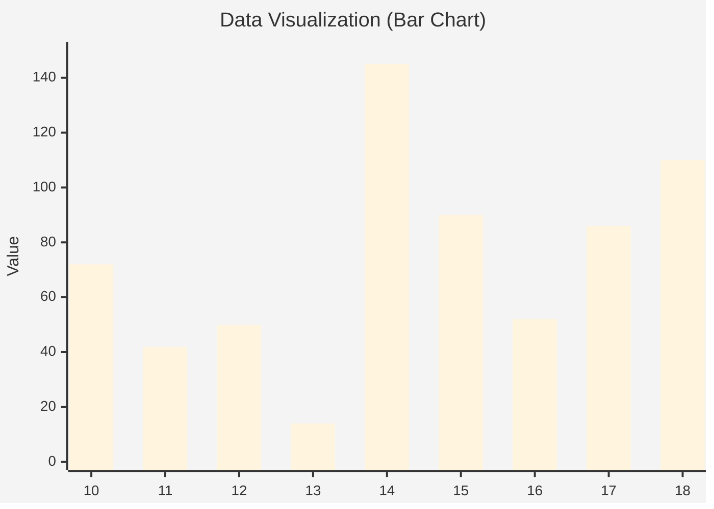

## 14以来最值得期待的版本: PostgreSQL 18  
                                                                                                                                                                      
### 作者                                                                                                                                          
digoal                                                                                                                                          
                                                                                                                                                 
### 日期                                                                                                                                               
2025-04-07                                                                                                                                         
                                                                                                                                              
### 标签                                                                                                                                            
PostgreSQL , PolarDB , DuckDB , preview       
                                                                                                                                                                     
----                                                                                                                                              
                                                                                                                                                            
## 背景       
从PostgreSQL 10开始, 我养成了一个习惯, 在`git.postgresql.org`和`https://commitfest.postgresql.org/`实时跟踪PostgreSQL新版本新增的用户相关patch和feat. 从我的blog可以看到10-18这些版本的文章数, 间接反映了对应版本有多少用户关心的特性.    
  
从历史来看14最牛, 我发了145篇preview. 后面PG开始挤牙膏(过去这么多年回过去看, 实则15到17这些版本主要在打磨逻辑复制).    
  
```  
$ git clone --depth 1 https://github.com/digoal/blog  
$ cd blog  
$ grep "PostgreSQL 18 preview" README.md | head -n 10   
##### 202504/20250406_05.md   [《PostgreSQL 18 preview - pgcrypto 新增2个更安全的密码哈希算法》](202504/20250406_05.md)    
##### 202504/20250406_04.md   [《PostgreSQL 18 preview - pg_dump 导出统计信息功能优化》](202504/20250406_04.md)    
##### 202504/20250406_03.md   [《PostgreSQL 18 preview - `autoprewarm` `shared buffer`预热插件改用`streaming read I/O`》](202504/20250406_03.md)    
##### 202504/20250406_02.md   [《PostgreSQL 18 preview - pg_recvlogical 支持创建 failover slot》](202504/20250406_02.md)    
##### 202504/20250406_01.md   [《PostgreSQL 18 preview - index skip scan 优化》](202504/20250406_01.md)    
##### 202504/20250405_03.md   [《PostgreSQL 18 preview - 支持`copy 物化视图 to`》](202504/20250405_03.md)    
##### 202504/20250405_02.md   [《PostgreSQL 18 preview - bitmap Heap Scan支持AIO批量读》](202504/20250405_02.md)    
##### 202504/20250405_01.md   [《PostgreSQL 18 preview - `in (values ())` 支持自动按需转换为 `= any(array)`》](202504/20250405_01.md)    
##### 202504/20250403_07.md   [《PostgreSQL 18 preview - range类型增加GiST 和 B-树的 `sortsupport` 接口》](202504/20250403_07.md)    
##### 202504/20250403_06.md   [《PostgreSQL 18 preview - 连接协议兼容性、安全性改进, 支持min/max_protocol_version》](202504/20250403_06.md)    
...  
```  
  
不过PostgreSQL 似乎又觉醒(不剂牙膏)了, 现在18还没有发布, 已经有110篇. PostgreSQL 18似乎是14以来最值得期待的版本, 最值得期待的当属AIO和DIO框架feat, 估计后面的版本会围绕IO实现进行打磨(挤牙膏).     
```  
$ for i in 10.0 {11..18} ; do echo "$i: `grep -c "PostgreSQL $i preview" README.md`" ; done  
10.0: 72  
11: 42  
12: 50  
13: 14  
14: 145  
15: 90  
16: 52  
17: 86  
18: 110  
```
   

  
  
很多我以前在吐槽系列文章中的点都得到了解决. 文章如下:   
- [《2021-DB吐槽大会 系列 - 适合产品经理、架构师与内核开发者》](../202108/20210823_05.md)    
  
期待18的发布.    
     
