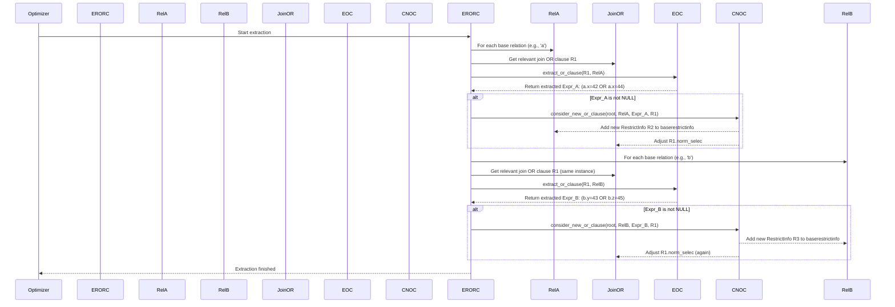
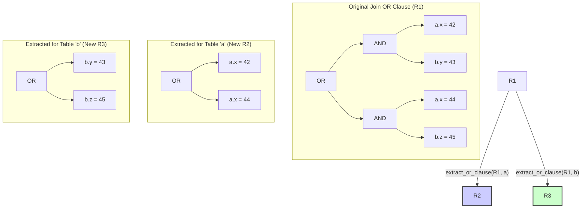

## AI辅助 PolarDB内核学习 - 43 优化器辅助功能模块(util) 核心代码 orclauses.c  
  
### 作者  
digoal  
  
### 日期  
2025-04-08  
  
### 标签  
PostgreSQL , PolarDB , DuckDB , AI , 内核 , 学习 , util , 优化器 , 辅助功能模块  
  
----  
  
## 背景  
  
## 解读 优化器辅助功能模块(util) 核心代码 orclauses.c  
  
Okay, let's break down this PostgreSQL optimizer code (`orclauses.c`).  
  
**代码作用简述 (Concise Summary)**  
  
这段代码的作用是在查询优化阶段，**从连接条件（JOIN clause）中的 `OR` 子句里，尝试提取出可以应用于单个表的 `OR` 过滤条件（Restriction clause）**。 如果成功提取，这些新的过滤条件会被添加到对应表的扫描阶段，目的是尽早过滤掉不满足条件的行，从而减少参与连接的数据量，提高查询性能。同时，它会调整原始 `OR` 连接条件的代价估算，以避免重复计算过滤效果导致估算偏差。  
  
**多角度解读 (Multi-Perspective Interpretation)**  
  
---  
  
**1. 数据库内核开发者 (Database Kernel Developer)**  
  
*   **关注点:** 优化器逻辑、数据结构交互、性能影响、代码健壮性。  
*   **解读:**  
    *   **核心逻辑:** `extract_restriction_or_clauses` 函数是入口，它遍历查询中的每个基表 (`RelOptInfo`)。对于每个基表，它检查与之相关的 `joininfo` 列表中的 `RestrictInfo`。  
    *   **筛选条件:** 它只关注那些本身是 `OR` 结构 (`restriction_is_or_clause`)、逻辑上可以被移动到当前基表处理 (`join_clause_is_movable_to`)、且未被标记为冗余 (`norm_selec <= 1`) 的连接 `OR` 条件。  
    *   **提取过程 (`extract_or_clause`):** 这是关键。它递归地检查输入 `OR` 条件的每个分支（arm，通常是 `AND` 表达式）。在每个分支中，它寻找只涉及当前目标基表 (`rel`) 且满足安全条件 (`is_safe_restriction_clause_for`) 的子条件。**关键要求是：原始 `OR` 的 *每一个* 分支都必须能提取出至少一个针对目标基表的有效子条件**。如果满足，这些从各分支提取出的子条件会被重新组合成一个新的 `OR` 表达式（返回的是 `Expr`，不是 `RestrictInfo`）。  
    *   **安全检查 (`is_safe_restriction_clause_for`):** 确保提取出的子条件：  
        *   不是伪常量 (`pseudoconstant`)。  
        *   其涉及的关系 (`clause_relids`) *完全等于* 目标基表的关系 ID (`rel->relids`)，不多不少。  
        *   不包含易变函数 (`contain_volatile_functions`)，防止优化改变函数的调用次数。  
    *   **评估与应用 (`consider_new_or_clause`):**  
        *   将提取出的 `Expr` 包装成新的 `RestrictInfo`。  
        *   计算这个新 `OR` 条件的选择性 (`clause_selectivity`)。  
        *   **阈值判断:** 只有当新 `OR` 条件的选择性足够低（`or_selec <= 0.9`），即能过滤掉至少 10% 的行时，才认为值得添加。否则，增加的检查开销可能超过收益。  
        *   **添加条件:** 如果通过阈值检查，将新的 `RestrictInfo` 添加到基表的 `baserestrictinfo` 列表中，以便在扫描该表时应用。  
        *   **选择性调整 (The "Hack"):** 这是非常重要的一步。由于新添加的 `OR` 条件与原始的 `OR` 连接条件是部分冗余的，直接使用标准的 `selectivity = selec1 * selec2` 会导致最终连接结果集的估算行数过低。为了补偿，代码会**修改原始 `OR` 连接条件 (`join_or_rinfo`) 缓存的选择性 (`norm_selec`)**。它将其设置为 `orig_selec / or_selec`，这样在后续计算连接代价时，两者选择性的乘积能近似等于未进行此优化时的原始选择性，从而保持连接大小估算的相对准确性。**注意:** 这个调整是个"HACK"，它依赖选择性被缓存且后续不再以完全相同方式重新计算的假设，并且主要针对内连接 (`JOIN_INNER`) 的 `norm_selec` 进行调整，对外连接 (`outer_selec`) 的处理则不完善。  
    *   **数据结构:** 深度依赖 `PlannerInfo` (全局优化信息), `RelOptInfo` (关系信息), `RestrictInfo` (封装了表达式、选择性、关系ID等元数据)。`List` 用于处理表达式的参数列表。`Bitmapset` (`bms_`) 用于高效处理关系ID集合。  
  
---  
  
**2. 数据库架构师 (Database Architect)**  
  
*   **关注点:** 优化策略的有效性、适用范围、对整体性能的影响、潜在风险。  
*   **解读:**  
    *   **优化目标:** 这是典型的谓词下推（Predicate Pushdown）的一种变体，但专门针对 `OR` 结构。目标是将过滤尽可能提前到数据访问层（表扫描），减少后续操作（如连接）处理的数据量。  
    *   **适用场景:** 对形如 `WHERE (... AND tableA.col1 = x AND tableB.col1 = y) OR (... AND tableA.col2 = z AND tableB.col2 = w)` 的查询特别有效。如果能提取出 `WHERE tableA.col1 = x OR tableA.col2 = z`，并且这个条件可以通过索引扫描 `tableA`，性能提升会很显著。  
    *   **策略权衡 (Trade-offs):**  
        *   **收益:** 减少连接输入，降低连接成本，可能启用更优的扫描方式（如索引扫描）。  
        *   **成本:** 增加了优化器的分析时间；增加了查询执行期间可能需要评估的条件数量（虽然新条件本身有过滤作用）；选择性调整机制比较hacky，可能在某些边缘情况下导致估算偏差，尤其是对外连接。  
        *   **限制:** 不是完全的 CNF (Conjunctive Normal Form / 合取范式) 转换，因为它不拆分原始的 `OR` 结构，避免了表达式过度膨胀。只处理特定的 `OR of ANDs` 结构。  
    *   **对整体架构的影响:** 这是优化器内部的一个增强模块，对用户透明。它增加了优化器寻找更优计划的可能性，特别是在涉及复杂 `OR` 条件的多表连接场景下。它体现了优化器在逻辑等价转换和基于代价的决策之间寻求平衡的设计哲学。选择性调整的 HACK 是务实但有风险的选择，未来可能有更精确的代价模型来替代它。  
  
---  
  
**3. 用户 (应用开发者 / DBA)**  
  
*   **关注点:** 查询性能、如何编写可优化的 SQL、如何理解执行计划。  
*   **解读:**  
    *   **对你的影响 (What it means for you):** 你不需要直接调用或配置这个功能，它是 PostgreSQL 优化器自动进行的一部分。如果你的查询包含类似 `(A.x=1 AND B.y=2) OR (A.z=3 AND B.t=4)` 这样的 `WHERE` 条件，这个机制可能会在后台自动为你优化查询。  
    *   **如何受益 (How you benefit):** 当这个优化生效时，你可能会在 `EXPLAIN` 的输出中看到：  
        *   在表扫描（Seq Scan, Index Scan, Bitmap Scan）节点上出现新的 `Filter` 条件，形如 `(tableA.col1 = x OR tableA.col2 = z)`。  
        *   如果这个新的 `OR` 条件能利用索引，可能会看到 `Index Scan` 或 `Bitmap Heap Scan` 被选用，而原本可能只能 `Seq Scan`。  
        *   参与连接（如 Hash Join, Nested Loop, Merge Join）的节点的 `rows` 估算值可能会比没有这个优化时更低（因为输入行数减少了）。  
    *   **编写 SQL 的启示 (SQL writing tips):** 虽然这是自动优化，但理解其原理有助于编写更“优化器友好”的 SQL。不过，对于这种特定的 `OR` 优化，并没有特别直接的写法建议，因为优化器会尝试分析结构。更通用的建议是：尽量让条件能利用索引，保持统计信息最新 (`ANALYZE`)。  
    *   **DBA 注意事项:** 理解这个机制有助于分析复杂查询的 `EXPLAIN` 计划。如果看到计划中基表扫描有额外的 `OR` Filter，并且连接操作符上方的 `rows` 估算看起来合理，这可能就是 `orclauses.c` 在起作用。如果怀疑代价估算有问题（特别是涉及 `OR` 和 `OUTER JOIN`），这个模块的选择性调整可能是需要关注的地方之一，尽管用户无法直接干预其内部计算。  
  
**图表与示例 (Diagrams and Examples)**  
  
**示例 (Example):**  
  
沿用代码注释中的例子：  
  
```sql  
SELECT *  
FROM a JOIN b ON ((a.x = 42 AND b.y = 43) OR (a.x = 44 AND b.z = 45));  
-- 或者写在 WHERE 子句中效果类似:  
-- WHERE (a.x = 42 AND b.y = 43) OR (a.x = 44 AND b.z = 45);  
```  
  
**`orclauses.c` 的处理流程 (大致):**  
  
1.  **检查表 `a`:**  
    *   找到连接条件 `RestrictInfo` R1: `((a.x = 42 AND b.y = 43) OR (a.x = 44 AND b.z = 45))`。  
    *   `restriction_is_or_clause(R1)` 为真。  
    *   `join_clause_is_movable_to(R1, a)` 为假 (因为它包含 `b`)。**但是！** 这里 `join_clause_is_movable_to` 的检查可能比字面意思更宽松，允许包含其他表，只要有参数化路径的可能。假设它通过了某种形式的检查，允许我们尝试提取。  
    *   调用 `extract_or_clause(R1, a)`:  
        *   看第一个 OR 分支 `(a.x = 42 AND b.y = 43)`:  
            *   `a.x = 42`: `is_safe_restriction_clause_for` 对 `a` 为真。提取 `a.x = 42`。  
            *   `b.y = 43`: `is_safe_restriction_clause_for` 对 `a` 为假。  
        *   看第二个 OR 分支 `(a.x = 44 AND b.z = 45)`:  
            *   `a.x = 44`: `is_safe_restriction_clause_for` 对 `a` 为真。提取 `a.x = 44`。  
            *   `b.z = 45`: `is_safe_restriction_clause_for` 对 `a` 为假。  
        *   两个分支都成功提取了针对 `a` 的条件。  
        *   返回新的 `Expr`: `(a.x = 42 OR a.x = 44)`。  
    *   调用 `consider_new_or_clause(..., a, (a.x=42 OR a.x=44), R1)`:  
        *   创建新的 `RestrictInfo` R2: `(a.x = 42 OR a.x = 44)`。  
        *   计算 R2 的选择性 `or_selec`。假设 `or_selec = 0.1` (小于 0.9)。  
        *   将 R2 添加到 `a` 的 `baserestrictinfo`。  
        *   计算 R1 的原始选择性 `orig_selec`。  
        *   **修改 R1 的缓存选择性:** `R1->norm_selec = orig_selec / 0.1`。  
  
2.  **检查表 `b`:**  
    *   同样找到连接条件 R1。  
    *   调用 `extract_or_clause(R1, b)`:  
        *   看第一个 OR 分支 `(a.x = 42 AND b.y = 43)`: 提取 `b.y = 43`。  
        *   看第二个 OR 分支 `(a.x = 44 AND b.z = 45)`: 提取 `b.z = 45`。  
        *   两个分支都成功提取了针对 `b` 的条件。  
        *   返回新的 `Expr`: `(b.y = 43 OR b.z = 45)`。  
    *   调用 `consider_new_or_clause(..., b, (b.y=43 OR b.z=45), R1)`:  
        *   创建新的 `RestrictInfo` R3: `(b.y = 43 OR b.z = 45)`。  
        *   计算 R3 的选择性 `or_selec_b`。假设 `or_selec_b = 0.2`。  
        *   将 R3 添加到 `b` 的 `baserestrictinfo`。  
        *   **再次修改 R1 的缓存选择性:** `R1->norm_selec = (之前调整后的值) / 0.2`。 (注意，R1 的选择性可能被调整多次)  
  
**最终效果:** 查询逻辑上等价于：  
  
```sql  
SELECT *  
FROM a JOIN b ON ((a.x = 42 AND b.y = 43) OR (a.x = 44 AND b.z = 45))  
WHERE (a.x = 42 OR a.x = 44) -- 这个条件在扫描 a 时应用  
  AND (b.y = 43 OR b.z = 45); -- 这个条件在扫描 b 时应用  
```  
  
**Sequence Diagram (简化流程):**  
  

  
**Mermaid Graph (逻辑转换示意):**  
  

  
希望这个详细的、多角度的解读能帮助你理解 `orclauses.c` 的作用和内部机制！  
  
## 提示  
```  
解读下面的代码. 先用几句话阐述代码作用, 然后从数据库内核开发者、架构师、用户(应用开发者和DBA)多个角度通熟易懂的解读这个代码, 使用sequence、mermaid图表以及恰当的例子提升代码可读性. 关键内容务必要深入重点详细解释.  
$代码内容  
```  
  
## PolarDB & PostgreSQL 15 差异  
```  
git diff -u 50d3d22baba63613d1f1406b2ed460dc9b03c3fc f5e7493819e370d30ac2047c68c21c9fb03ce4a0 -- src/backend/optimizer/util/orclauses.c  
```  
  
差异分析待补充.  
  
<b> 以上内容基于DeepSeek、QwQ及诸多AI生成, 轻微人工调整, 感谢杭州深度求索人工智能、阿里云等公司. </b>  
  
<b> AI 生成的内容请自行辨别正确性, 当然也多了些许踩坑的乐趣, 毕竟冒险是每个男人的天性.  </b>  
  
  
  
#### [期望 PostgreSQL|开源PolarDB 增加什么功能?](https://github.com/digoal/blog/issues/76 "269ac3d1c492e938c0191101c7238216")
  
  
#### [PolarDB 开源数据库](https://openpolardb.com/home "57258f76c37864c6e6d23383d05714ea")
  
  
#### [PolarDB 学习图谱](https://www.aliyun.com/database/openpolardb/activity "8642f60e04ed0c814bf9cb9677976bd4")
  
  
#### [PostgreSQL 解决方案集合](../201706/20170601_02.md "40cff096e9ed7122c512b35d8561d9c8")
  
  
#### [德哥 / digoal's Github - 公益是一辈子的事.](https://github.com/digoal/blog/blob/master/README.md "22709685feb7cab07d30f30387f0a9ae")
  
  
#### [About 德哥](https://github.com/digoal/blog/blob/master/me/readme.md "a37735981e7704886ffd590565582dd0")
  
  

  
