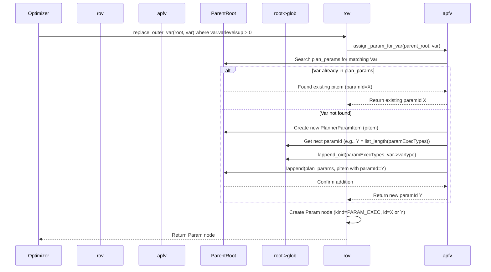
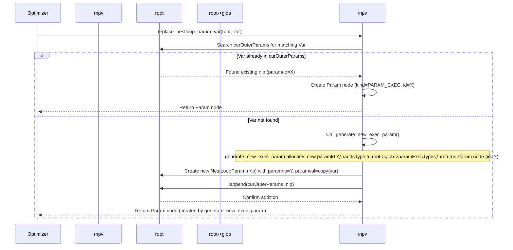
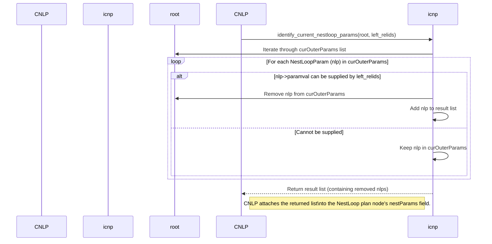
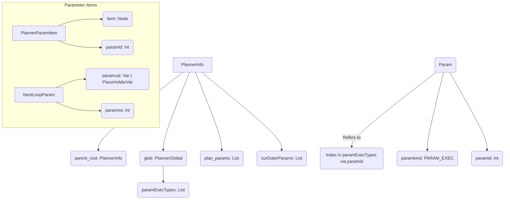

## AI辅助 PolarDB内核学习 - 44 优化器辅助功能模块(util) 核心代码 paramassign.c    
    
### 作者    
digoal    
    
### 日期    
2025-04-08    
    
### 标签    
PostgreSQL , PolarDB , DuckDB , AI , 内核 , 学习 , util , 优化器 , 辅助功能模块    
    
----    
    
## 背景    
    
## 解读 优化器辅助功能模块(util) 核心代码 paramassign.c    
    
好的，我们来解读一下 PostgreSQL 的 `paramassign.c` 这段代码。  
  
**代码作用概述**  
  
`paramassign.c` 文件是 PostgreSQL 查询优化器的一部分，其核心作用是在查询规划（Planning）阶段，管理和分配**执行时参数（`PARAM_EXEC`）**。当查询中包含子查询或需要嵌套循环（NestLoop）连接时，内层计划可能需要引用外层查询计算出的值。这段代码负责将这些对外层值的引用（如 `Var`、`PlaceHolderVar` 等）转换成内部参数 `Param`，并为这些参数分配唯一的 ID（`paramId`），确保在查询执行（Execution）阶段，执行器能够正确地传递和接收这些值。它通过维护几个关键的数据结构来实现参数的跟踪、分配和复用。  
  
**多角度解读**  
  
---  
  
**1. 数据库内核开发者角度**  
  
对于内核开发者来说，`paramassign.c` 是连接查询优化（Optimizer）和查询执行（Executor）的关键桥梁之一，特别是在处理相关子查询（Correlated Subqueries）和 `LATERAL` 连接时。  
  
*   **核心问题：** 如何在执行时将父查询节点（Parent Plan Node）计算出的值传递给子查询节点（SubPlan Node）或嵌套循环的内层节点（Inner Plan Node）？  
*   **解决方案：** 使用 `PARAM_EXEC` 类型的参数。在规划阶段，识别出子计划需要访问的、来自外层查询的变量（`Var`）、占位符（`PlaceHolderVar`）、聚合函数（`Aggref`）或分组函数（`GroupingFunc`）。将这些外层引用替换为 `Param` 节点，类型为 `PARAM_EXEC`，并分配一个全局唯一的 `paramId`。  
*   **关键数据结构：**  
    *   `root->glob->paramExecTypes` (List of Oid): 这是整个查询计划**全局**的参数类型列表。列表的索引 `i` 就对应 `paramId = i`。存储的是每个参数槽位预期的数据类型 OID。`InvalidOid` 表示该槽位用于特殊信令，不实际传递数据。这个列表是追加式的，一旦分配，规划期间不会移除。  
    *   `root->plan_params` (List of PlannerParamItem): 这是**当前查询层级**（`PlannerInfo *root`）的临时列表。当规划一个**子查询**时，这个列表记录了该子查询需要从当前层级（或更外层）获取的所有值（`Var`, `PlaceHolderVar`, `Aggref`, `GroupingFunc`）以及为它们分配的 `paramId`。子查询规划完成后，这个列表会被清空，以便为下一个子查询使用。它的主要目的是在**单个子查询内部**对来自同一父级的相同参数引用进行去重，避免生成多个 `paramId`。  
    *   `root->curOuterParams` (List of NestLoopParam): 这也是**当前查询层级**的临时列表。当为**嵌套循环（NestLoop）** 的右侧（内层）构建计划时，如果内层计划需要引用来自左侧（外层）的值，这个列表会记录这些需求。`NestLoopParam` 包含分配的 `paramId` 和需要传递的值（`Var` 或 `PlaceHolderVar`）。当创建 `NestLoop` 计划节点时，会从 `curOuterParams` 中提取（并移除）由该 `NestLoop` 左侧提供的参数，并将它们附加到 `NestLoop` 节点上。这个列表的主要目的是在构建嵌套循环计划树的过程中，对来自同一（潜在）父 `NestLoop` 的相同参数引用进行去重。  
*   **重要函数剖析：**  
    *   `replace_outer_var`/`replace_outer_placeholdervar`/`replace_outer_agg`/`replace_outer_grouping`: 这些函数是入口点。当优化器遇到一个指向外层查询的引用（`varlevelsup > 0`, `phlevelsup > 0`, `agglevelsup > 0`）时，会调用相应的函数。  
    *   `assign_param_for_var`/`assign_param_for_placeholdervar`: 这些函数负责查找或创建 `PlannerParamItem`。它们会导航到正确的父级 `PlannerInfo`，检查 `plan_params` 列表是否已有匹配项（基于变量/占位符的属性，如 `varno`, `varattno`, `phid` 等）。如果找到，直接返回已分配的 `paramId`（实现去重）；如果没找到，创建一个新的 `PlannerParamItem`，分配一个新的 `paramId`（通过 `paramExecTypes` 列表的长度），记录参数类型到 `paramExecTypes`，并将新 `pitem` 加入 `plan_params` 列表。**关键点：** 这些函数通过 `copyObject` 复制 Var/PHV 并将 `levelsup` 设为 0，因为参数本身在子查询或参数接收端看来是本地的。  
    *   `replace_nestloop_param_var`/`replace_nestloop_param_placeholdervar`: 处理来自 NestLoop 外层的值。它们检查 `root->curOuterParams` 是否已存在对应 Var/PHV 的 `NestLoopParam`。若存在，复用 `paramno`；若不存在，调用 `generate_new_exec_param` 分配新的 `paramId` 和 `paramExecTypes` 条目，创建 `NestLoopParam` 并加入 `curOuterParams`。  
    *   `generate_new_exec_param`: 通用函数，用于无条件分配一个新的 `paramId`，并记录其类型到 `paramExecTypes`。它不关心去重，主要用于 NestLoop 参数和子计划输出参数。  
    *   `process_subquery_nestloop_params`: 特殊处理 `LATERAL` 子查询。子查询规划时已经通过 `replace_outer_xxx` 分配了 `paramId` 并记录在（临时的）`plan_params` 中。此函数在主查询构建 `NestLoop`（通常由 `LATERAL` 引起）时被调用，将子查询所需的、且确实来自 `NestLoop` 左侧的参数（检查 `var->varno` 是否在 `root->curOuterRels` 中）注册到 `root->curOuterParams` 中，使用的 `paramId` 是子查询规划时就已经确定的。  
    *   `identify_current_nestloop_params`: 当一个 `NestLoop` 计划节点最终形成时，调用此函数。它遍历 `root->curOuterParams`，找出所有能由该 `NestLoop` 的左侧子节点（`leftrelids`）满足的参数（`NestLoopParam`），将它们从 `curOuterParams` 列表中移除，并返回这个列表。返回的列表会被附加到 `NestLoop` 节点的 `nestParams` 字段，执行器将据此在运行时填充参数。  
    *   `assign_special_exec_param`: 分配一个 `paramId`，但在 `paramExecTypes` 中标记为 `InvalidOid`。这用于非数据传递的同步机制，例如递归查询中工作表扫描与递归 UNION 之间的信号，或 `EvalPlanQual` 中的重查信号。执行器知道这种参数 ID 不需要填充值。  
*   **设计权衡：** 代码注释中提到，曾经尝试过更积极的全局参数去重，但因生命周期管理复杂易出错而放弃。目前的策略是在 `plan_params`（单个子查询）和 `curOuterParams`（单个 NL 构建过程）内部去重，而在不同子查询树或不同 NestLoop 之间即使是相同的 Var 也可能分配不同的 `paramId`。这是一种在实现复杂度和潜在性能收益之间的权衡，认为最小化参数数量带来的执行期节省有限。  
  
---  
  
**2. 架构师角度**  
  
从架构师的角度看，`paramassign.c` 体现了查询处理中**关注点分离**和**模块化**的设计原则。  
  
*   **解耦规划与执行：** 它清晰地将“识别跨层级数据依赖”的逻辑（规划期）与“实际传递数据”的机制（执行期）分开。`Param` 节点和 `paramExecTypes` 数组是两者之间的接口契约。规划器生成带 `Param` 的计划树，执行器理解如何利用这些 `Param` 和对应的参数槽位。  
*   **参数化执行模型：** `PARAM_EXEC` 是实现参数化查询执行（不仅仅是用户提供的 `$1` 参数，还包括内部节点间依赖）的基础。这使得计划可以被更灵活地构建和重用（尤其是在子查询场景）。  
*   **状态管理：** `PlannerInfo` 结构及其嵌套关系（`parent_root`）和其包含的列表（`plan_params`, `curOuterParams`）是管理规划期间状态的关键。`PlannerGlobal`（`root->glob`）则维护了整个计划的全局状态（`paramExecTypes`）。这种分层状态管理对于处理递归查询和复杂嵌套结构至关重要。  
*   **可扩展性：** 如果未来需要支持新的跨层级引用类型（例如，窗口函数的外部引用），可以在此模块中添加相应的 `replace_outer_xxx` 和 `assign_param_for_xxx` 函数，扩展参数处理能力，而无需大规模改动执行器。  
*   **鲁棒性：** 通过 `copyObject` 创建副本，避免了对原始查询树节点的不期望修改。明确区分不同列表（`plan_params` vs `curOuterParams`）的用途和生命周期，有助于减少逻辑错误。放弃全局去重的决策也反映了对系统稳定性和可维护性的优先考虑。  
  
---  
  
**3. 用户（应用开发者/DBA）角度**  
  
虽然应用开发者和 DBA 通常不直接与这段 C 代码交互，但其功能对他们编写和理解 SQL 查询的行为至关重要。  
  
*   **启用强大 SQL 功能：** 这个模块是实现**相关子查询**（Correlated Subqueries）和 **`LATERAL` 连接**的核心机制。没有它，子查询或 `LATERAL` 派生表就无法引用外层查询的列。  
    *   **例子（相关子查询）：**  
        ```sql  
        SELECT e.name, (SELECT COUNT(*) FROM projects p WHERE p.manager_id = e.id) AS project_count  
        FROM employees e;  
        ```  
        这里的 `e.id` 在子查询中是外部引用。`paramassign.c` 会将其替换为一个 `PARAM_EXEC` 参数（比如 `$0`），子查询计划会使用 `$0`。执行时，对于 `employees` 表的每一行，会先计算 `e.id` 的值，将其放入参数槽 `$0`，然后执行子查询计划。  
    *   **例子（LATERAL Join）：**  
        ```sql  
        SELECT c.name, t.topic  
        FROM categories c LEFT JOIN LATERAL (  
            SELECT topic FROM top_topics_in_category(c.id) LIMIT 1  
        ) t ON true;  
        ```  
        这里的 `c.id` 被传递给 `LATERAL` 子查询（或函数）。`paramassign.c` 会处理这个引用，可能通过 `NestLoop` 的参数传递机制。执行时，对于 `categories` 的每一行，`c.id` 的值会被设置好，然后执行 `LATERAL` 部分的计划。  
*   **性能影响（间接）：** 虽然代码注释提到最小化参数数量节省不大，但参数传递本身是有开销的。复杂的嵌套查询或大量相关子查询可能导致生成较多的 `PARAM_EXEC` 参数，这构成了执行成本的一部分。DBA 在分析 `EXPLAIN (VERBOSE, COSTS OFF)` 输出时，可能会看到 `Param(kind=PARAM_EXEC id=...)` 这样的节点，理解其来源有助于分析查询计划。  
*   **理解 `EXPLAIN` 输出：** `EXPLAIN (VERBOSE)` 输出中显示的 `SubPlan` 或 `NestLoop` 节点的参数信息（例如，`NestLoop` 的 `Nest Loop Params` 部分），其参数 ID (`$N`) 就是由 `paramassign.c` 分配的。理解 `$N` 对应外层哪个值有助于深入理解计划执行流程。  
*   **限制（潜在）：** 过去尝试全局去重失败的历史意味着，在非常复杂的查询中，理论上可能存在冗余的参数传递（同一个外层值通过不同的 `paramId` 多次传递给不同的子树）。虽然不常见且影响有限，但这是设计上的一个已知简化。  
  
---  
  
**Sequence / Mermaid 图表**  
  
**场景1: 处理相关子查询中的外部 Var (`replace_outer_var`)**  
  

  
**场景2: 处理 NestLoop 参数 (`replace_nestloop_param_var`)**  
  

  
**场景3: 创建 NestLoop 节点时识别参数 (`identify_current_nestloop_params`)**  
  

  
**数据结构 (Mermaid Class Diagram like representation):**  
  

  
这个图示说明了 `PlannerInfo` 如何持有对父级、全局信息以及两个关键参数列表的引用。同时展示了 `PlannerParamItem` 和 `NestLoopParam` 的基本结构，以及最终生成的 `Param` 节点如何通过其 `paramid` 关联到全局的 `paramExecTypes` 列表中的一个条目。  
  
希望这个多角度、包含图表和示例的详细解读能够帮助你深入理解 `paramassign.c` 的作用和机制！  
    
## 提示    
```    
解读下面的代码. 先用几句话阐述代码作用, 然后从数据库内核开发者、架构师、用户(应用开发者和DBA)多个角度通熟易懂的解读这个代码, 使用sequence、mermaid图表以及恰当的例子提升代码可读性. 关键内容务必要深入重点详细解释.    
$代码内容    
```    
    
## PolarDB & PostgreSQL 15 差异    
```    
git diff -u 50d3d22baba63613d1f1406b2ed460dc9b03c3fc f5e7493819e370d30ac2047c68c21c9fb03ce4a0 -- src/backend/optimizer/util/paramassign.c    
```    
    
差异分析待补充.    
    
<b> 以上内容基于DeepSeek、QwQ及诸多AI生成, 轻微人工调整, 感谢杭州深度求索人工智能、阿里云等公司. </b>    
    
<b> AI 生成的内容请自行辨别正确性, 当然也多了些许踩坑的乐趣, 毕竟冒险是每个男人的天性.  </b>    
    
    
  
#### [期望 PostgreSQL|开源PolarDB 增加什么功能?](https://github.com/digoal/blog/issues/76 "269ac3d1c492e938c0191101c7238216")
  
  
#### [PolarDB 开源数据库](https://openpolardb.com/home "57258f76c37864c6e6d23383d05714ea")
  
  
#### [PolarDB 学习图谱](https://www.aliyun.com/database/openpolardb/activity "8642f60e04ed0c814bf9cb9677976bd4")
  
  
#### [PostgreSQL 解决方案集合](../201706/20170601_02.md "40cff096e9ed7122c512b35d8561d9c8")
  
  
#### [德哥 / digoal's Github - 公益是一辈子的事.](https://github.com/digoal/blog/blob/master/README.md "22709685feb7cab07d30f30387f0a9ae")
  
  
#### [About 德哥](https://github.com/digoal/blog/blob/master/me/readme.md "a37735981e7704886ffd590565582dd0")
  
  

  
