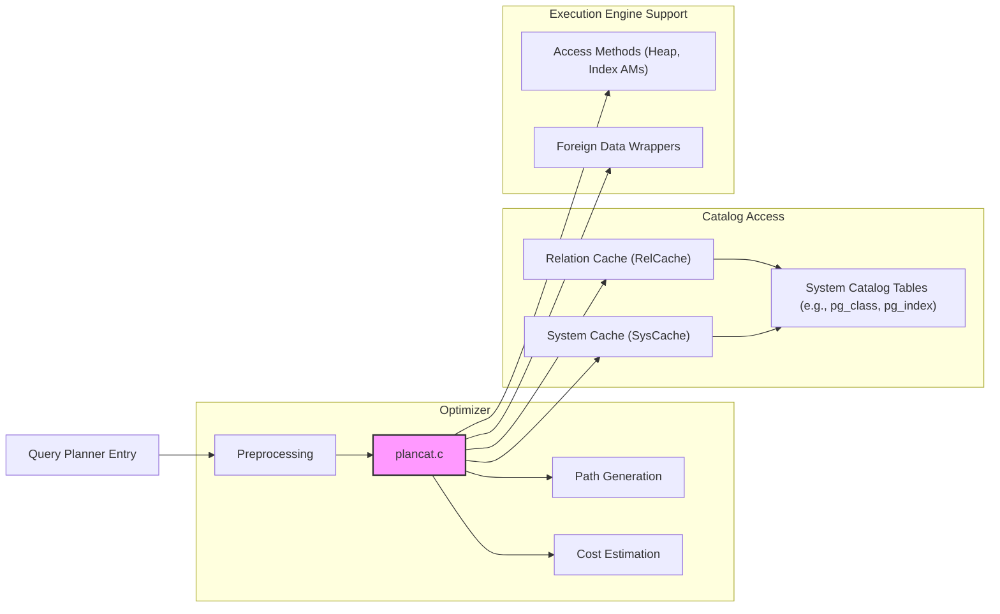
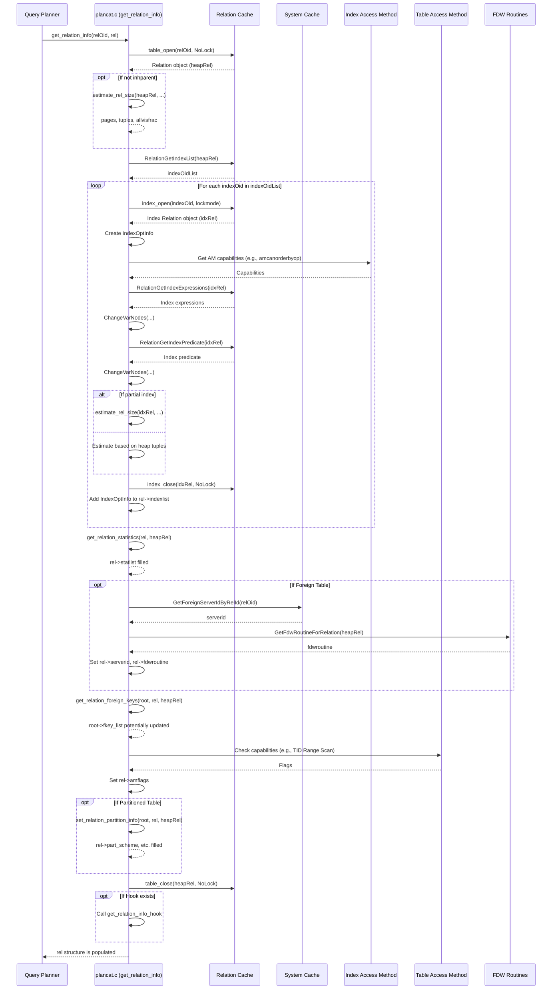

## AI辅助 PolarDB内核学习 - 47 优化器辅助功能模块(util) 核心代码 plancat.c    
    
### 作者    
digoal    
    
### 日期    
2025-04-08    
    
### 标签    
PostgreSQL , PolarDB , DuckDB , AI , 内核 , 学习 , util , 优化器 , 辅助功能模块    
    
----    
    
## 背景    
    
## 解读 优化器辅助功能模块(util) 核心代码 plancat.c    
    
Okay, let's break down the PostgreSQL `plancat.c` code.  
  
**代码作用概述 (Code Purpose Summary)**  
  
`plancat.c` 包含一系列函数，其核心作用是**为查询优化器（Optimizer）提供访问系统目录（System Catalogs）的接口**。在生成查询执行计划（Query Plan）的过程中，优化器需要大量关于数据库对象（如表、索引、函数、约束等）的元数据和统计信息。`plancat.c` 就是负责高效、准确地查询和提取这些信息，并将其组织成优化器易于使用的内部数据结构（主要是 `RelOptInfo` 和 `IndexOptInfo`）。这些信息是进行成本估算、路径选择、约束排除、索引选择等优化决策的基础。  
  
**多角度解读 (Multi-Perspective Interpretation)**  
  
---  
  
**1. 数据库内核开发者 (Database Kernel Developer Perspective)**  
  
对于内核开发者来说，`plancat.c` 是优化器与元数据管理子系统（特别是系统缓存 SysCache 和关系缓存 RelCache）之间的关键桥梁。  
  
*   **核心功能:**  
    *   **元数据检索:** 通过 `table_open`, `index_open`, `SearchSysCache*` 等函数，安全高效地从系统表中获取表结构、索引定义、统计信息、约束、函数属性等。  
    *   **数据结构填充:** 将检索到的原始目录信息转换为优化器内部使用的数据结构，如 `RelOptInfo` (关系优化信息) 和 `IndexOptInfo` (索引优化信息)。这涉及内存分配 (`palloc`, `makeNode`) 和字段填充。  
    *   **信息预处理:** 对获取的信息进行必要的预处理，使其对优化器更有用。例如：  
        *   `ChangeVarNodes`: 调整表达式中变量（Var）的 `varno`（变量编号），使其与查询范围表（Range Table）中的索引一致。这对于比较 WHERE 子句和索引/约束表达式至关重要。  
        *   `eval_const_expressions`/`canonicalize_qual`: 对约束表达式进行常量折叠和规范化，以便与查询条件进行比较。  
        *   计算或估算宽度 (`get_rel_data_width`)。  
    *   **缓存利用:** 严重依赖 SysCache 和 RelCache 来加速对系统目录的访问，避免重复的磁盘 I/O 和解析开销。开发者需要理解缓存的工作机制和失效条件。`NoLock` 的使用表明调用者（通常是查询规划的早期阶段）已经获取了必要的锁（通常是 `AccessShareLock`），避免了额外的锁开销。  
    *   **接口封装:** 为优化器的其他模块（如路径生成 `path/`, 代价估算 `costsize.c`）提供清晰的函数接口来获取所需信息，隐藏了直接访问系统目录的复杂性。  
    *   **可扩展性支持:**  
        *   **钩子 (Hooks):** `get_relation_info_hook` 允许插件（如外部优化器或监控工具）介入并修改或增强获取的关系信息。  
        *   **FDW 支持:** 通过 `GetFdwRoutineForRelation` 获取外部数据包装器（FDW）的特定函数指针，使优化器能与外部表交互。  
        *   **支持函数 (Support Functions):** 调用操作符和函数的支持函数（如 `oprrest`, `oprjoin`, `prosupport`）来获取更精确的选择率和成本估算，允许用户或扩展自定义优化行为。  
*   **关键考量:**  
    *   **性能:** 目录访问是优化的关键路径，必须高效。缓存命中率、减少锁争用是重要指标。  
    *   **正确性:** 必须准确反映目录状态，并正确处理并发、事务可见性（如 `indcheckxmin` 对 HOT 的影响）、模式变更等问题。  
    *   **内存管理:** 需要仔细管理 `palloc` 分配的内存，避免泄漏。信息通常分配在与 PlannerInfo 关联的内存上下文中。  
    *   **锁管理:** 理解何时需要锁，何时可以依赖调用者持有的锁（如 `NoLock` 的使用场景）。  
  
*   **Mermaid Component Diagram (组件交互示意):**  
  

  
---  
  
**2. 架构师 (Architect Perspective)**  
  
架构师关注 `plancat.c` 在整个 PostgreSQL 系统中的定位、设计原则和对系统整体性能、可扩展性的影响。  
  
*   **模块职责:** `plancat.c` 清晰地划分了优化器中“元数据访问层”的职责。它将优化逻辑（如何使用信息）与数据获取逻辑（如何得到信息）分离，提高了系统的模块化程度。  
*   **信息枢纽:** 它是优化器获取静态和动态（统计信息）元数据的核心枢纽。所有需要了解表、索引、函数等细节的优化步骤都会直接或间接地依赖它。  
*   **性能关键点:** 由于查询优化本身就是资源密集型操作，`plancat.c` 的效率直接影响查询编译时间。它对缓存的重度依赖是架构上的关键决策，以牺牲少量内存换取显著的性能提升。  
*   **可扩展性设计:**  
    *   **插件钩子 (`get_relation_info_hook`)**: 体现了 PostgreSQL 可扩展的设计哲学，允许第三方代码无缝集成到优化信息收集中。  
    *   **FDW 集成**: 将 FDW 的元数据和回调函数集成到标准的关系信息收集中，使得外部表能以相对统一的方式参与查询优化。  
    *   **访问方法 (AM) 抽象**: 通过 `IndexAmRoutine` 和 `TableAmRoutine` 结构体获取 AM 的能力（如是否支持排序、位图扫描、并行等），使得优化器不必硬编码特定 AM 的行为。`plancat.c` 负责将这些能力信息传递给优化器。  
    *   **统计信息扩展 (`pg_statistic_ext`)**: `get_relation_statistics` 函数支持处理多列统计信息，这是对传统单列统计信息的增强，体现了架构在统计信息收集和使用上的演进。  
*   **设计权衡:**  
    *   **信息收集时机:** `get_relation_info` 在规划早期一次性收集大量信息。优点是避免了后续重复打开关系和查询目录，缺点是可能收集了最终用不到的信息。  
    *   **缓存依赖:** 高度依赖缓存提高了性能，但也意味着缓存未命中或缓存失效（如 DDL 后）会导致性能下降。缓存管理策略是架构的重要部分。  
*   **与其他模块关系:**  
    *   **Parser/Analyzer:** 接收来自解析和分析阶段产生的查询树（Query Tree）和范围表（Range Table）。  
    *   **Optimizer (Core Logic):** 为代价估算 (`costsize.c`, `costapi.c`)、路径生成 (`path/`, `plan/`)、连接规划 (`join/`) 等提供基础数据。  
    *   **Executor:** `plancat.c` 获取的一些信息（如 FDW routine, AM flags）会被传递到执行计划中，供执行器使用。  
  
---  
  
**3. 用户 (User Perspective - Application Developer & DBA)**  
  
用户虽然不直接调用 `plancat.c` 的函数，但他们的操作和数据库配置会直接影响这些函数的行为，进而影响查询性能。  
  
*   **应用开发者 (Application Developer):**  
    *   **查询性能:** `plancat.c` 获取的信息决定了优化器能否找到高效的执行计划。例如：  
        *   **索引使用:** `get_relation_info` 负责发现表上的可用索引 (`IndexOptInfo`)。如果开发者创建了合适的索引，这里就能发现，优化器才有可能选择索引扫描。不合适的索引（如无效索引、分区索引本身）会被过滤掉。  
        *   **函数/操作符选择率:** `restriction_selectivity`, `join_selectivity`, `function_selectivity` 会影响优化器对 WHERE 子句过滤效果的判断。如果使用了选择性估算不准的自定义函数或操作符，可能导致优化器选择次优计划。开发者可以通过提供 `SUPPORT` 函数来改进估算。  
        *   **ON CONFLICT (UPSERT):** `infer_arbiter_indexes` 函数直接支持 `INSERT ... ON CONFLICT` 语句，它根据开发者指定的冲突目标（列或约束名）查找对应的唯一索引。如果找不到匹配的索引，语句会报错。  
    *   **约束:** 开发者定义的 `CHECK` 约束和 `NOT NULL` 约束会被 `get_relation_constraints` 获取。如果 `constraint_exclusion` GUC 设置为 `partition` 或 `on`，优化器可能利用这些约束来避免扫描那些明显不满足查询条件的表分区或普通表（尽管对普通表效果有限）。  
    *   **数据类型与宽度:** `estimate_rel_size` 中使用的 `get_rel_data_width` 会基于列的数据类型估算行宽，这影响表大小和成本估算。选择更紧凑的数据类型可能间接影响优化决策。  
  
*   **数据库管理员 (DBA):**  
    *   **统计信息 (`ANALYZE`):** DBA 执行 `ANALYZE` 命令至关重要。`ANALYZE` 负责更新 `pg_class` 中的 `reltuples` (行数) 和 `relpages` (页数)，以及 `pg_statistic` 和 `pg_statistic_ext_data` 中的详细统计信息。`plancat.c` 中的 `estimate_rel_size` 和 `get_relation_statistics` 直接依赖这些信息。**陈旧或缺失的统计信息是导致 `plancat.c` 提供错误数据给优化器，进而产生坏计划的最常见原因。**  
    *   **索引管理:** DBA 创建、维护索引。`get_relation_info` 会检查索引是否有效 (`indisvalid`)、是否就绪 (`indcheckxmin` 相关逻辑)。DBA 需要确保索引处于可用状态。  
    *   **配置参数 (GUCs):**  
        *   `constraint_exclusion`: 控制 `relation_excluded_by_constraints` 函数的行为，决定是否以及在何种程度上使用约束来优化查询（特别是分区表）。DBA 需要根据工作负载调整此参数。  
        *   `enable_*scan` 等参数：虽然不直接在 `plancat.c` 中使用，但 `plancat.c` 收集的信息（如索引可用性）是这些参数生效的前提。  
    *   **分区表管理:** 对于分区表，`set_relation_partition_info` 负责收集分区键、分区策略、分区边界等信息。DBA 对分区表的定义和维护直接影响这些信息的准确性，进而影响分区裁剪（Partition Pruning）的效果。  
    *   **扩展和自定义:** DBA 可能安装包含自定义函数、操作符、数据类型或 FDW 的扩展。这些扩展可能需要提供支持函数来帮助 `plancat.c` 进行准确的成本和选择率估算。DBA 需要了解扩展如何影响优化。  
    *   **外部表 (FDW):** DBA 配置外部服务器和外部表。`get_relation_info` 会获取 FDW 相关信息，这对于涉及外部表的查询优化至关重要。  
  
**关键函数深入解读与图表**  
  
**1. `get_relation_info` 函数详解**  
  
这是 `plancat.c` 中最核心的函数之一，负责为单个关系（表、视图、外部表等）收集全面的元数据和统计信息，填充 `RelOptInfo` 结构。  
  
*   **输入:**  
    *   `PlannerInfo *root`: 全局规划器信息。  
    *   `Oid relationObjectId`: 要查询的关系的 OID。  
    *   `bool inhparent`: 标记这个关系是否作为继承树的父级出现（如果是，则不计算自身大小，忽略索引等）。  
    *   `RelOptInfo *rel`: 要填充的目标结构体。  
*   **核心步骤:**  
    1.  **打开关系:** `table_open(relationObjectId, NoLock)`。使用 `NoLock` 是因为调用者（如 `setup_simple_rel_arrays`）通常已持有 `AccessShareLock`。  
    2.  **基本检查:** 验证关系类型（非索引、复合类型等），检查恢复状态。  
    3.  **初始化 RelOptInfo:** 设置 `min_attr`, `max_attr`, `reltablespace`，分配 `attr_needed` 和 `attr_widths` 数组。  
    4.  **估算大小 (非继承父):** 调用 `estimate_rel_size` 获取 `pages`, `tuples`, `allvisfrac`。  
    5.  **获取并行工作者数:** `RelationGetParallelWorkers`。  
    6.  **处理索引 (如果 `hasindex` 且非继承父):**  
        *   获取索引 OID 列表: `RelationGetIndexList`。  
        *   循环处理每个索引:  
            *   打开索引: `index_open`。  
            *   检查有效性: `indisvalid`, `indcheckxmin` (可能设置 `transientPlan`)，检查是否为分区索引。  
            *   创建 `IndexOptInfo` 节点。  
            *   填充 `IndexOptInfo`: OID、列信息 (`indexkeys`, `opfamily`, `opcintype`, `indexcollations`)、AM 能力 (`amcanorderbyop`, `amcostestimate` 等)、排序信息 (B-Tree 直接用，其他类型尝试映射)、索引表达式 (`indexprs`)、索引谓词 (`indpred`)。  
            *   **关键:** `ChangeVarNodes` 调整 `indexprs` 和 `indpred` 中的 `varno`，使其与 `rel->relid` 匹配。  
            *   估算索引大小: `estimate_rel_size` (部分索引特殊处理)。  
            *   获取 B-Tree 高度: `_bt_getrootheight`。  
            *   关闭索引。  
            *   将 `IndexOptInfo` 添加到 `rel->indexlist`。  
    7.  **获取扩展统计信息:** 调用 `get_relation_statistics` 填充 `rel->statlist`。  
    8.  **获取 FDW 信息:** 如果是外部表，获取 `serverid` 和 `fdwroutine`。  
    9.  **获取外键信息:** 调用 `get_relation_foreign_keys` 将相关的外键信息添加到 `root->fkey_list`。  
    10. **获取 Table AM 标志:** 检查 Table AM 的能力（如 TID Range Scan 支持）。  
    11. **获取分区信息 (如果是分区表):** 调用 `set_relation_partition_info`。  
    12. **关闭关系:** `table_close`。  
    13. **调用钩子:** `get_relation_info_hook`。  
  
*   **Sequence Diagram (`get_relation_info`)**  
  

  
**2. `estimate_rel_size` 函数**  
  
*   **作用:** 估算关系（表或索引）的物理大小（页数）和逻辑大小（元组数），以及可见性映射（VM）中全可见页面的比例。  
*   **逻辑:**  
    *   **普通表/物化视图 (`RELKIND_HAS_TABLE_AM`)**: 调用 `table_relation_estimate_size` (通常定义在对应的表访问方法如 `heapam.c`)，这个函数会结合 `pg_class` 中的统计信息 (`reltuples`, `relpages`, `relallvisible`) 和当前的物理文件大小来估算。如果 `pg_class` 统计信息过时（例如，表刚创建或有大量插入/删除后未 `ANALYZE`），它会参考实际的物理页数，并可能根据 `pg_class` 中的旧密度来推算当前的元组数。  
    *   **索引 (`RELKIND_INDEX`)**: 类似地，结合 `pg_class` 统计信息和实际物理页数。它会特别处理元数据页（metapage），从页数中减去 1 再计算密度。如果 `pg_class` 信息无效（`reltuples < 0` 或 `relpages == 0`），会退回到基于数据类型宽度 (`get_rel_data_width`) 估算每页能放多少元组，假设页是满的（这通常是高估）。`allvisfrac` 基于 `relallvisible` 计算。  
    *   **其他类型 (外部表, 序列等):** 直接使用 `pg_class` 中的 `relpages` 和 `reltuples`。对于外部表，FDW 自身可能有更复杂的估算逻辑，但 `plancat.c` 层面只提供来自 `pg_class` 的基本值（可能由 `ANALYZE FOREIGN TABLE` 更新）。  
*   **重要性:** 成本估算的基础。不准确的大小估算会导致错误的成本计算，从而选择低效的计划（如在小表上用了索引扫描，或在大表上用了全表扫描）。  
*   **例子:** `ANALYZE mytable;` 更新 `pg_class.reltuples` 和 `pg_class.relpages` for `mytable`。后续查询 `SELECT * FROM mytable WHERE ...` 时，`get_relation_info` 调用 `estimate_rel_size` 会读取这些更新后的值，得到更准确的表大小估算。  
  
**3. `get_relation_constraints` 和 `relation_excluded_by_constraints`**  
  
*   **`get_relation_constraints`:**  
    *   获取指定关系上有效的 `CHECK` 约束和（可选地）`NOT NULL` 约束。  
    *   如果 `include_partition` 为 true 且关系是分区，则包含分区约束。  
    *   对约束表达式进行常量折叠 (`eval_const_expressions`) 和规范化 (`canonicalize_qual`)，并调整 `varno` (`ChangeVarNodes`)。  
    *   返回一个列表，其中每个元素都是一个约束表达式（隐式 AND 格式）。  
*   **`relation_excluded_by_constraints`:**  
    *   判断一个关系（通常是分区表的一个分区，或在 `constraint_exclusion=on` 时的普通表）是否可以基于约束和查询条件而被完全排除，无需扫描。  
    *   **逻辑:**  
        1.  检查 `rel->baserestrictinfo` (查询中针对该表的 WHERE 条件) 是否为空或自相矛盾 (例如 `WHERE 1=0` 或 `WHERE col = 1 AND col = 2`)。只考虑不可变（immutable）的条件。  
        2.  根据 `constraint_exclusion` GUC 的值决定是否继续：`off` 则退出；`partition` 则只处理分区成员；`on` 则处理所有情况（并考虑基本表的分区约束）。  
        3.  获取关系的相关约束（调用 `get_relation_constraints`）。只考虑不可变约束。  
        4.  使用 `predicate_refuted_by` 检查查询条件 (`rel->baserestrictinfo`) 是否与约束列表 (`safe_constraints`) 相矛盾。如果矛盾，意味着满足查询条件的行不可能存在于这个关系中，可以排除扫描。  
*   **例子:**  
    ```sql  
    CREATE TABLE sales (id int, sale_date date, amount int) PARTITION BY RANGE (sale_date);  
    CREATE TABLE sales_2023 PARTITION OF sales FOR VALUES FROM ('2023-01-01') TO ('2024-01-01');  
    CREATE TABLE sales_2024 PARTITION OF sales FOR VALUES FROM ('2024-01-01') TO ('2025-01-01');  
  
    -- GUC: constraint_exclusion = partition (或 on)  
    EXPLAIN SELECT * FROM sales WHERE sale_date = '2024-05-15';  
    ```  
    在规划此查询时，对于 `sales_2023` 分区：  
    1.  `relation_excluded_by_constraints` 被调用。  
    2.  `baserestrictinfo` 包含 `sale_date = '2024-05-15'`。  
    3.  `get_relation_constraints` 获取 `sales_2023` 的分区约束，大致等价于 `sale_date >= '2023-01-01' AND sale_date < '2024-01-01'`。  
    4.  `predicate_refuted_by` 发现 `'2024-05-15' >= '2023-01-01'` 为真，但 `'2024-05-15' < '2024-01-01'` 为假。因此查询条件与分区约束矛盾。  
    5.  `relation_excluded_by_constraints` 返回 `true`。  
    6.  优化器将从计划中排除对 `sales_2023` 的扫描。  
  
**4. 选择率估算函数 (`restriction_selectivity`, `join_selectivity`, `function_selectivity`)**  
  
*   **作用:** 为优化器提供 WHERE 子句条件（限制条件）或连接条件的过滤效果估算（选择率，0到1之间）。选择率越低，表示条件过滤掉的行越多。  
*   **机制:**  
    *   **操作符:** `restriction_selectivity` 和 `join_selectivity` 查找 `pg_operator` 中定义的对应操作符的 `oprrest` (限制选择率函数) 或 `oprjoin` (连接选择率函数) 属性。如果找到函数 OID，就通过 `OidFunctionCall*` 调用它，传入规划器信息、操作符 OID、参数列表、变量 ID 等。  
    *   **函数:** `function_selectivity` 查找 `pg_proc` 中定义的函数的 `prosupport` (支持函数) 属性。如果找到，调用支持函数并传递 `SupportRequestSelectivity` 结构体，期望支持函数填充选择率。  
    *   **默认值:** 如果找不到对应的选择率函数或支持函数，或者函数调用失败，会返回一个硬编码的默认值（如操作符为 0.5，函数为 0.3333333）。这些默认值通常不是很准确。  
*   **重要性:** 选择率是成本估算的关键输入。错误的选择率估算（特别是对选择性很高的条件估算过高，或对选择性很低的条件估算过低）会导致优化器严重误判不同路径（如索引扫描 vs. 全表扫描，不同连接顺序）的成本，从而选择坏计划。  
*   **例子:** 对于 `WHERE column = constant`，其 `= `操作符通常有一个选择率函数（如 `eqsel`）。`restriction_selectivity` 会调用 `eqsel`，`eqsel` 会参考 `pg_statistic` 中关于 `column` 的统计信息（如 MCV 列表、直方图）来估算有多少行的 `column` 值等于 `constant`。  
  
**总结 (Conclusion)**  
  
`plancat.c` 是 PostgreSQL 查询优化器中一个至关重要且设计精良的模块。它有效地封装了对系统目录的访问，为优化器提供了做出明智决策所需的丰富元数据和统计信息。通过利用缓存、提供扩展接口（钩子、支持函数）、并集成 FDW 和分区表等现代特性，它在保证查询优化效率和准确性方面扮演着核心角色。对于内核开发者、架构师和高级用户（特别是 DBA）来说，理解 `plancat.c` 的工作原理对于深入理解 PostgreSQL 的查询优化机制和进行性能调优非常有价值。  
    
## 提示    
```    
解读下面的代码. 先用几句话阐述代码作用, 然后从数据库内核开发者、架构师、用户(应用开发者和DBA)多个角度通熟易懂的解读这个代码, 使用sequence、mermaid等图表勾勒代码内部的细节逻辑以及与其他代码文件之间的关联关系, 使用恰当的例子提升代码可读性. 关键内容务必要深入重点详细解释.    
$代码内容    
```    
    
## PolarDB & PostgreSQL 15 差异    
```    
git diff -u 50d3d22baba63613d1f1406b2ed460dc9b03c3fc f5e7493819e370d30ac2047c68c21c9fb03ce4a0 -- src/backend/optimizer/util/plancat.c    
```    
    
差异分析待补充.    
    
<b> 以上内容基于DeepSeek、QwQ及诸多AI生成, 轻微人工调整, 感谢杭州深度求索人工智能、阿里云等公司. </b>    
    
<b> AI 生成的内容请自行辨别正确性, 当然也多了些许踩坑的乐趣, 毕竟冒险是每个男人的天性.  </b>    
    
  
#### [期望 PostgreSQL|开源PolarDB 增加什么功能?](https://github.com/digoal/blog/issues/76 "269ac3d1c492e938c0191101c7238216")
  
  
#### [PolarDB 开源数据库](https://openpolardb.com/home "57258f76c37864c6e6d23383d05714ea")
  
  
#### [PolarDB 学习图谱](https://www.aliyun.com/database/openpolardb/activity "8642f60e04ed0c814bf9cb9677976bd4")
  
  
#### [PostgreSQL 解决方案集合](../201706/20170601_02.md "40cff096e9ed7122c512b35d8561d9c8")
  
  
#### [德哥 / digoal's Github - 公益是一辈子的事.](https://github.com/digoal/blog/blob/master/README.md "22709685feb7cab07d30f30387f0a9ae")
  
  
#### [About 德哥](https://github.com/digoal/blog/blob/master/me/readme.md "a37735981e7704886ffd590565582dd0")
  
  

  
