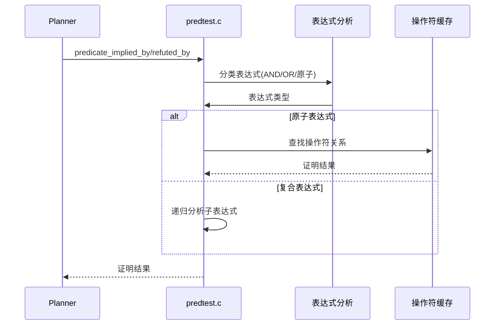
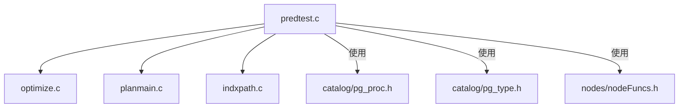
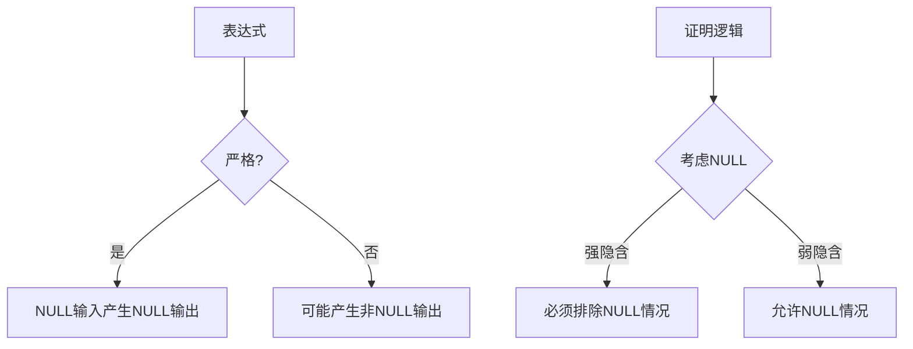

## AI辅助 PolarDB内核学习 - 48 优化器辅助功能模块(util) 核心代码 predtest.c  
  
### 作者  
digoal  
  
### 日期  
2025-04-08  
  
### 标签  
PostgreSQL , PolarDB , DuckDB , AI , 内核 , 学习 , util , 优化器 , 辅助功能模块  
  
----  
  
## 背景  
  
## 解读 优化器辅助功能模块(util) 核心代码 predtest.c  
  
  
## 代码作用概述  
  
predtest.c 是 PostgreSQL 优化器中的一个关键模块，主要负责**逻辑谓词证明**，即判断一个谓词表达式是否隐含或反驳另一个谓词表达式。它用于优化查询计划，通过消除不必要的条件检查来提高查询性能。  
  
主要功能包括：  
• 判断一个 WHERE 子句是否隐含另一个 WHERE 子句或索引谓词（强隐含）  
• 判断一个 CHECK 约束是否隐含另一个 CHECK 约束（弱隐含）  
• 判断一个 WHERE 子句是否反驳 CHECK 约束（强反驳）  
• 判断 WHERE 子句之间是否相互矛盾（弱反驳）  
  
## 多角度解读  
  
### 数据库内核开发者视角  
  
1. **核心算法**：  
   • 使用递归下降法遍历表达式树  
   • 将表达式分类为 AND 类、OR 类或原子类  
   • 根据不同的组合情况应用不同的证明规则  
  
2. **关键数据结构**：  
   • `PredIterInfoData`：用于迭代表达式组件  
   • `OprProofCacheEntry`：缓存操作符证明结果  
  
3. **性能优化**：  
   • 使用缓存存储操作符关系证明结果  
   • 限制大数组操作的处理规模（MAX_SAOP_ARRAY_SIZE）  
   • 短路评估策略  
  
4. **难点处理**：  
   • 处理 NULL 值和三值逻辑  
   • 处理不同类型的操作符和表达式  
   • 保证不变性（immutability）约束  
  
### 架构师视角  
  
1. **系统集成**：  
   ```mermaid  
   graph TD  
     A[查询解析] --> B[谓词证明]  
     B --> C[查询优化]  
     C --> D[计划生成]  
   ```  
  
2. **关键设计决策**：  
   • 分离强/弱隐含和反驳逻辑  
   • 使用操作符家族（opfamily）抽象来泛化比较操作  
   • 缓存机制减少重复计算  
  
3. **扩展性考虑**：  
   • 通过 hook 机制支持扩展  
   • 模块化设计便于添加新的表达式类型  
   • 清晰的接口定义  
  
### 应用开发者和 DBA 视角  
  
1. **实际应用场景**：  
   • 分区裁剪：判断分区键条件是否满足  
   • 索引优化：判断索引条件是否冗余  
   • 约束检查：优化 INSERT/UPDATE 的约束验证  
  
2. **使用示例**：  
   ```sql  
   -- 表定义  
   CREATE TABLE orders (  
     id serial PRIMARY KEY,  
     amount numeric CHECK (amount > 0),  
     status text  
   );  
  
   -- 查询1: 这个WHERE条件隐含了CHECK约束  
   SELECT * FROM orders WHERE amount > 100; -- 自动满足amount > 0  
  
   -- 查询2: 这个WHERE条件反驳了CHECK约束  
   SELECT * FROM orders WHERE amount < 0; -- 优化器可以提前识别矛盾  
   ```  
  
3. **性能调优**：  
   • 理解谓词证明如何帮助优化查询  
   • 设计合适的约束和索引以利用这些优化  
   • 监控缓存效率  
  
## 核心逻辑详解  
  
### 谓词证明的主要流程  
  

  
### 关键算法解析  
  
1. **表达式分类**：  
   • 列表视为隐式 AND  
   • AND/OR 布尔表达式  
   • 标量数组操作表达式（ScalarArrayOpExpr）  
   • 其他视为原子表达式  
  
2. **证明规则矩阵**：  
   ```mermaid  
   graph LR  
     A[原子] -->|隐含| B[AND]  
     A -->|隐含| C[OR]  
     D[AND] -->|隐含| E[原子]  
     D -->|隐含| F[AND]  
     D -->|隐含| G[OR]  
     H[OR] -->|隐含| I[原子]  
     H -->|隐含| J[AND]  
     H -->|隐含| K[OR]  
   ```  
  
3. **操作符证明**：  
   • 使用 B-tree 操作符策略号定义关系  
   • 构建隐含和反驳矩阵  
   • 通过操作符家族查找兼容的操作符  
  
### 代码文件关联  
  

  
## 深入重点解析  
  
### 强隐含 vs 弱隐含  
  
1. **强隐含**：  
   • 用于 WHERE 子句和索引谓词  
   • A 强隐含 B 表示 A 为真时 B 必须为真  
   • 示例：`x < 10` 强隐含 `x < 20`  
  
2. **弱隐含**：  
   • 用于 CHECK 约束  
   • A 弱隐含 B 表示 A 不为假时 B 不为假  
   • 示例：`x IS NOT NULL` 弱隐含 `x > 0`  
  
### 处理 NULL 值的三值逻辑  
  

  
### 操作符证明缓存机制  
  
1. **缓存结构**：  
   • 键：谓词操作符和子句操作符对  
   • 值：隐含和反驳结果  
   • 缓存失效：当 pg_amop 变更时  
  
2. **性能影响**：  
   • 避免重复计算操作符关系  
   • 尤其有益于复杂查询和多次调用  
  
## 实际示例分析  
  
### 示例1：简单隐含  
  
```sql  
-- 假设有 WHERE 条件: x > 10 AND y < 5  
-- 判断是否隐含: x > 5  
  
-- 代码路径:  
1. 将顶层AND分解为两个子条件  
2. 对每个子条件检查是否隐含x > 5  
3. 发现x > 10隐含x > 5  
4. 返回true  
```  
  
### 示例2：反驳检查  
  
```sql  
-- 表有CHECK约束: age >= 18  
-- 查询有WHERE条件: age < 18  
  
-- 代码路径:  
1. 识别age < 18和age >= 18是互斥操作符  
2. 通过BT_refutes_table确认反驳关系  
3. 返回true，优化器可提前终止查询  
```  
  
### 示例3：数组处理  
  
```sql  
-- WHERE条件: x = ANY(ARRAY[1,2,3])  
-- 判断是否隐含: x = 2  
  
-- 代码路径:  
1. 将ANY数组展开为OR条件(x=1 OR x=2 OR x=3)  
2. 检查OR条件中是否有子条件等于x=2  
3. 发现x=2匹配，返回true  
```  
  
## 总结  
  
predtest.c 是 PostgreSQL 优化器的关键组件，通过逻辑谓词证明实现了多种查询优化。它的设计考虑了：  
  
1. **完备性**：处理各种表达式类型和组合  
2. **正确性**：严格处理 NULL 和三值逻辑  
3. **性能**：使用缓存和短路评估  
4. **扩展性**：支持通过 hook 添加自定义逻辑  
  
理解这个模块对于深入掌握 PostgreSQL 查询优化和性能调优至关重要。  
  
## 提示  
```  
解读下面的代码. 先用几句话阐述代码作用, 然后从数据库内核开发者、架构师、用户(应用开发者和DBA)多个角度通熟易懂的解读这个代码, 使用sequence、mermaid等图表勾勒代码内部的细节逻辑以及与其他代码文件之间的关联关系, 使用恰当的例子提升代码可读性. 关键内容务必要深入重点详细解释.  
$代码内容  
```  
  
## PolarDB & PostgreSQL 15 差异  
```  
git diff -u 50d3d22baba63613d1f1406b2ed460dc9b03c3fc f5e7493819e370d30ac2047c68c21c9fb03ce4a0 -- src/backend/optimizer/util/predtest.c  
```  
  
差异分析待补充.  
  
<b> 以上内容基于DeepSeek、QwQ及诸多AI生成, 轻微人工调整, 感谢杭州深度求索人工智能、阿里云等公司. </b>  
  
<b> AI 生成的内容请自行辨别正确性, 当然也多了些许踩坑的乐趣, 毕竟冒险是每个男人的天性.  </b>  
  
  
  
#### [期望 PostgreSQL|开源PolarDB 增加什么功能?](https://github.com/digoal/blog/issues/76 "269ac3d1c492e938c0191101c7238216")
  
  
#### [PolarDB 开源数据库](https://openpolardb.com/home "57258f76c37864c6e6d23383d05714ea")
  
  
#### [PolarDB 学习图谱](https://www.aliyun.com/database/openpolardb/activity "8642f60e04ed0c814bf9cb9677976bd4")
  
  
#### [PostgreSQL 解决方案集合](../201706/20170601_02.md "40cff096e9ed7122c512b35d8561d9c8")
  
  
#### [德哥 / digoal's Github - 公益是一辈子的事.](https://github.com/digoal/blog/blob/master/README.md "22709685feb7cab07d30f30387f0a9ae")
  
  
#### [About 德哥](https://github.com/digoal/blog/blob/master/me/readme.md "a37735981e7704886ffd590565582dd0")
  
  

  
